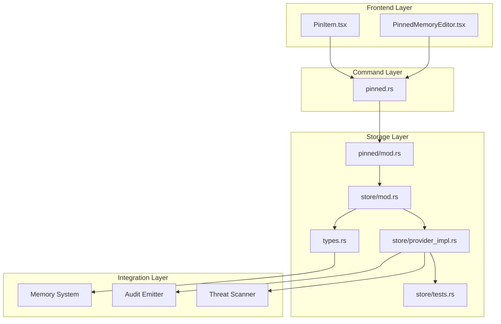
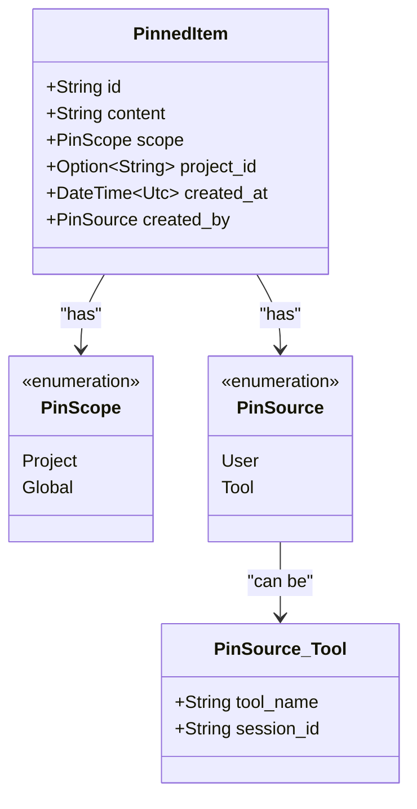
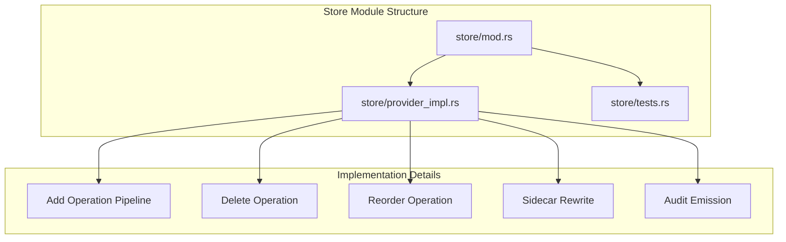
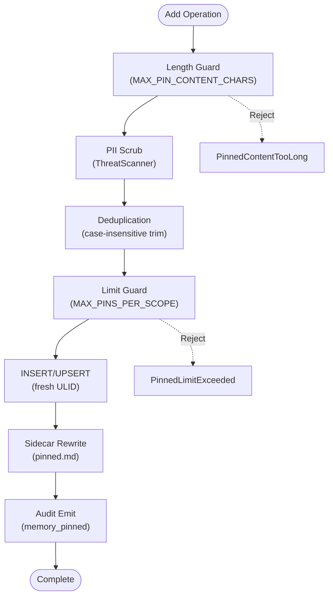
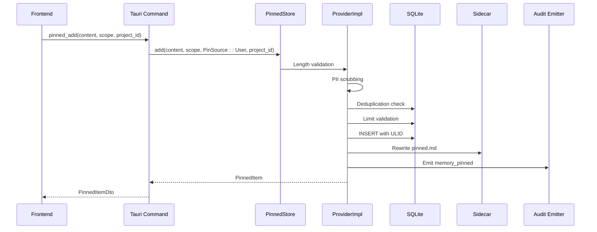
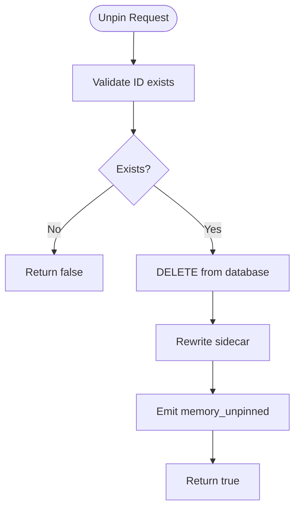
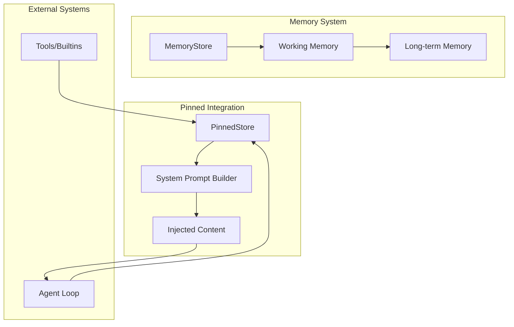
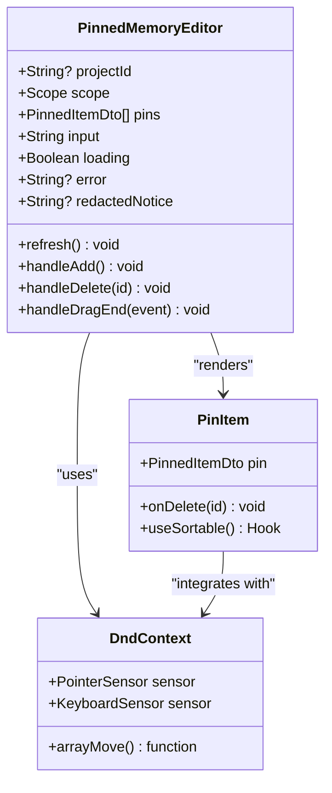
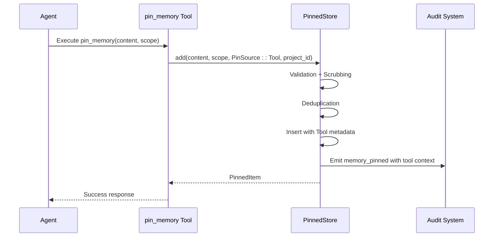
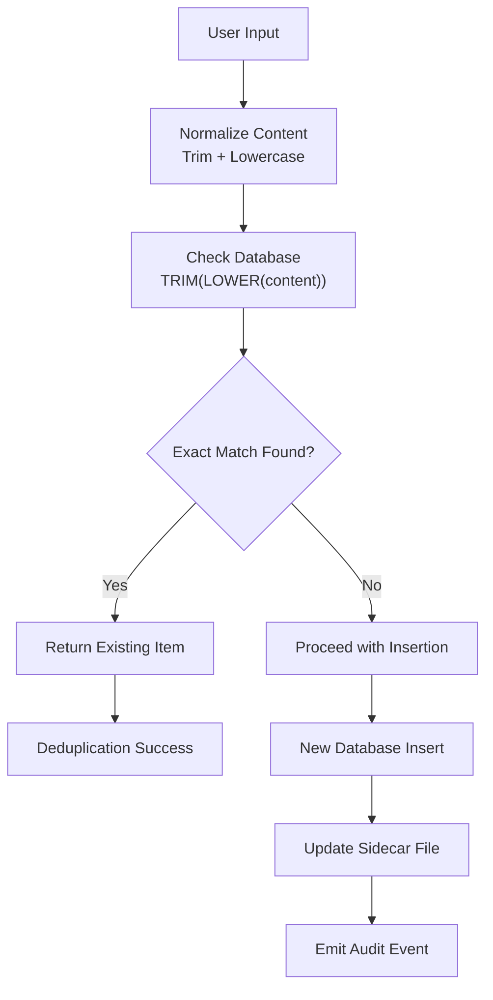

# Pinned Memory Management

<cite>
**Referenced Files in This Document**
- [mod.rs](file://src-tauri/src/modules/memory/pinned/mod.rs)
- [store/mod.rs](file://src-tauri/src/modules/memory/pinned/store/mod.rs)
- [store/provider_impl.rs](file://src-tauri/src/modules/memory/pinned/store/provider_impl.rs)
- [store/tests.rs](file://src-tauri/src/modules/memory/pinned/store/tests.rs)
- [types.rs](file://src-tauri/src/modules/memory/pinned/types.rs)
- [commands/pinned.rs](file://src-tauri/src/commands/pinned.rs)
- [PinnedMemoryEditor.tsx](file://src/components/memory/pinned/PinnedMemoryEditor.tsx)
- [PinItem.tsx](file://src/components/memory/pinned/PinItem.tsx)
- [memory-enhancement-from-openhanako-v1.md](file://docs/design-docs/postCLI/memory-enhancement-from-openhanako-v1.md)
</cite>

## Update Summary
**Changes Made**
- Updated module structure documentation to reflect the new modular organization
- Added documentation for the refactored store implementation files
- Updated architecture diagrams to show the new three-file structure
- Enhanced internal organization section to explain the refactoring benefits

## Table of Contents
1. [Introduction](#introduction)
2. [System Architecture](#system-architecture)
3. [Core Data Structures](#core-data-structures)
4. [Pinned Store Implementation](#pinned-store-implementation)
5. [Pin Operations](#pin-operations)
6. [Priority Management](#priority-management)
7. [Integration with Memory System](#integration-with-memory-system)
8. [Frontend Components](#frontend-components)
9. [Usage Patterns](#usage-patterns)
10. [Conflict Resolution](#conflict-resolution)
11. [Performance Considerations](#performance-considerations)
12. [Troubleshooting Guide](#troubleshooting-guide)
13. [Conclusion](#conclusion)

## Introduction

The pinned memory management system is a critical component of the If2Ai memory architecture designed to maintain persistent, always-available information that the AI agent should retain indefinitely. Unlike regular memory entries that may be subject to eviction and dynamic retrieval, pinned memories are hand-curated facts that are permanently stored and automatically injected into the system prompt for every agent interaction.

This system serves as a foundation for long-term knowledge retention, ensuring that important user-specific information, project context, and critical facts remain accessible regardless of the agent's current operational state or memory pressure conditions.

**Updated** The system has been refactored into a modular structure for improved maintainability and separation of concerns, while preserving all core functionality and APIs.

## System Architecture

The pinned memory system follows a layered architecture with clear separation of concerns between storage, presentation, and integration layers. The refactored architecture now organizes the store implementation into dedicated modules for better maintainability.



**Diagram sources**
- [mod.rs:17-24](file://src-tauri/src/modules/memory/pinned/mod.rs#L17-L24)
- [store/mod.rs:54-57](file://src-tauri/src/modules/memory/pinned/store/mod.rs#L54-L57)
- [commands/pinned.rs:75-113](file://src-tauri/src/commands/pinned.rs#L75-L113)

**Updated** The architecture now reflects the modular organization with clear separation between the main module definition, implementation, and tests.

## Core Data Structures

### PinnedItem Structure

The fundamental data structure representing a pinned memory entry:



**Diagram sources**
- [types.rs:74-92](file://src-tauri/src/modules/memory/pinned/types.rs#L74-L92)
- [types.rs:19-47](file://src-tauri/src/modules/memory/pinned/types.rs#L19-L47)
- [types.rs:54-70](file://src-tauri/src/modules/memory/pinned/types.rs#L54-L70)

### Storage Interface

The `PinnedStore` trait defines the contract for pinned memory operations:

| Method | Purpose | Parameters | Return Type |
|--------|---------|------------|-------------|
| `list` | Retrieve pinned items for a scope | `PinScope`, `Option<&str>` | `Result<Vec<PinnedItem>, MemoryError>` |
| `list_all_for_prompt` | Get union of global + project pins | `&MemoryExecutionScope` | `Result<Vec<PinnedItem>, MemoryError>` |
| `add` | Insert or deduplicate a pin | `content`, `PinScope`, `PinSource`, `Option<&str>` | `Result<PinnedItem, MemoryError>` |
| `delete` | Remove a pin by ID | `&str` | `Result<bool, MemoryError>` |
| `reorder` | Re-stamp creation timestamps | `&[String]` | `Result<(), MemoryError>` |

**Section sources**
- [store/mod.rs:79-128](file://src-tauri/src/modules/memory/pinned/store/mod.rs#L79-L128)

**Updated** The storage interface documentation now points to the refactored store/mod.rs file.

## Pinned Store Implementation

### Modular Architecture

The `SqlitePinnedStore` implementation has been refactored into a modular structure for better maintainability:



**Diagram sources**
- [store/mod.rs:54-57](file://src-tauri/src/modules/memory/pinned/store/mod.rs#L54-L57)
- [store/provider_impl.rs:19-367](file://src-tauri/src/modules/memory/pinned/store/provider_impl.rs#L19-L367)

**Updated** The architecture now shows the clear separation between the main module definition and implementation details.

### SQLite Backend

The `SqlitePinnedStore` provides a robust, transaction-safe implementation with the following key features:

#### Database Schema

The storage layer maintains a normalized schema optimized for the pinned memory use case:

```mermaid
erDiagram
PINNED_ITEMS {
TEXT id PK
TEXT content NOT NULL
TEXT scope NOT NULL
TEXT project_id
TEXT created_at NOT NULL
TEXT created_by_kind NOT NULL
TEXT created_by_meta NOT NULL
}
INDEXES {
idx_pinned_scope
idx_pinned_project
idx_pinned_created
}
PINNED_ITEMS ||--o{ INDEXES : "indexed by"
```

**Diagram sources**
- [store/mod.rs:165-179](file://src-tauri/src/modules/memory/pinned/store/mod.rs#L165-L179)

#### Operational Pipeline

The `add` operation follows a carefully orchestrated seven-step process:



**Diagram sources**
- [store/provider_impl.rs:91-263](file://src-tauri/src/modules/memory/pinned/store/provider_impl.rs#L91-L263)

**Section sources**
- [store/mod.rs:129-186](file://src-tauri/src/modules/memory/pinned/store/mod.rs#L129-L186)
- [store/provider_impl.rs:91-263](file://src-tauri/src/modules/memory/pinned/store/provider_impl.rs#L91-L263)

**Updated** The implementation details now reference the refactored provider_impl.rs file containing the actual implementation logic.

## Pin Operations

### Pin Creation Workflow

The pin creation process involves multiple validation and transformation steps:



**Diagram sources**
- [commands/pinned.rs:115-143](file://src-tauri/src/commands/pinned.rs#L115-L143)
- [store/provider_impl.rs:91-263](file://src-tauri/src/modules/memory/pinned/store/provider_impl.rs#L91-L263)

### Unpin Operations

Unpin operations are idempotent and maintain system consistency:



**Diagram sources**
- [store/provider_impl.rs:265-312](file://src-tauri/src/modules/memory/pinned/store/provider_impl.rs#L265-L312)

**Section sources**
- [commands/pinned.rs:145-158](file://src-tauri/src/commands/pinned.rs#L145-L158)
- [store/provider_impl.rs:265-312](file://src-tauri/src/modules/memory/pinned/store/provider_impl.rs#L265-L312)

**Updated** The unpin operation now references the refactored provider_impl.rs implementation.

## Priority Management

### Scope-Based Organization

Pinned memories are organized into two distinct scopes with different visibility characteristics:

| Scope | Visibility | Use Cases | Storage Requirements |
|-------|------------|-----------|---------------------|
| `PinScope::Global` | Visible across all sessions/projects | Universal facts, personal information, foundational knowledge | `project_id = NULL` |
| `PinScope::Project` | Visible only within specific project | Project-specific context, technical details, team information | `project_id = Some(id)` |

### Ordering and Priority

The system maintains insertion order through ULID-based sorting, allowing manual reordering:


**Diagram sources**
- [store/provider_impl.rs:314-360](file://src-tauri/src/modules/memory/pinned/store/provider_impl.rs#L314-L360)

**Section sources**
- [types.rs:13-47](file://src-tauri/src/modules/memory/pinned/types.rs#L13-L47)
- [store/provider_impl.rs:314-360](file://src-tauri/src/modules/memory/pinned/store/provider_impl.rs#L314-L360)

**Updated** The priority management now references the refactored reorder implementation.

## Integration with Memory System

### System Prompt Injection

The pinned memory system integrates seamlessly with the broader memory architecture:



**Diagram sources**
- [mod.rs:55-63](file://src-tauri/src/modules/memory/mod.rs#L55-L63)
- [store/mod.rs:99-106](file://src-tauri/src/modules/memory/pinned/store/mod.rs#L99-L106)

### Error Handling and Fallbacks

The system provides graceful degradation through the `NullPinnedStore`:

| Scenario | Behavior | Impact |
|----------|----------|---------|
| SQLite initialization failure | `NullPinnedStore` fallback | Operations return empty results |
| Disk write failures | MemoryError propagation | Operation fails safely |
| Concurrent modifications | Optimistic concurrency | Last-write-wins with proper ordering |

**Section sources**
- [store/mod.rs:319-370](file://src-tauri/src/modules/memory/pinned/store/mod.rs#L319-L370)

**Updated** The error handling section now references the refactored store implementation.

## Frontend Components

### PinnedMemoryEditor

The frontend component provides a comprehensive interface for managing pinned memories:



**Diagram sources**
- [PinnedMemoryEditor.tsx:54-57](file://src/components/memory/pinned/PinnedMemoryEditor.tsx#L54-L57)
- [PinItem.tsx:13-16](file://src/components/memory/pinned/PinItem.tsx#L13-L16)

### Real-time Features

The frontend implements several advanced features for optimal user experience:

| Feature | Implementation | Benefit |
|---------|----------------|---------|
| Drag-and-drop reordering | `@dnd-kit/sortable` | Intuitive priority management |
| Optimistic updates | Temporary IDs | Immediate visual feedback |
| Character counting | Real-time validation | Prevents errors before submission |
| Auto-redaction notice | Conditional UI | Transparency about PII handling |

**Section sources**
- [PinnedMemoryEditor.tsx:132-190](file://src/components/memory/pinned/PinnedMemoryEditor.tsx#L132-L190)
- [PinItem.tsx:18-57](file://src/components/memory/pinned/PinItem.tsx#L18-L57)

**Updated** The frontend components remain unchanged, but now integrate with the refactored backend architecture.

## Usage Patterns

### Common Pinning Scenarios

#### Personal Information
- **Pattern**: User adds biographical details, preferences, or contact information
- **Scope**: Typically `Global` for universal applicability
- **Example**: "My name is John Doe", "I prefer Tauri for development"

#### Project Context
- **Pattern**: Team members add technical specifications, guidelines, or project history
- **Scope**: `Project` scoped to specific work contexts
- **Example**: "This project uses Rust + Tauri architecture", "API endpoints require OAuth"

#### Foundational Knowledge
- **Pattern**: Core concepts, principles, or frequently referenced information
- **Scope**: `Global` for broad applicability
- **Example**: "Always prioritize user privacy", "Follow security-first development practices"

### Agent-Initiated Pinning

The system supports programmatic pinning through built-in tools:



**Diagram sources**
- [memory-enhancement-from-openhanako-v1.md:1057-1077](file://docs/design-docs/postCLI/memory-enhancement-from-openhanako-v1.md#L1057-L1077)

**Section sources**
- [memory-enhancement-from-openhanako-v1.md:1048-1077](file://docs/design-docs/postCLI/memory-enhancement-from-openhanako-v1.md#L1048-L1077)

**Updated** The usage patterns remain the same, but now operate within the refactored modular architecture.

## Conflict Resolution

### Duplicate Detection

The system employs sophisticated duplicate detection mechanisms:



**Diagram sources**
- [store/provider_impl.rs:147-178](file://src-tauri/src/modules/memory/pinned/store/provider_impl.rs#L147-L178)

### Capacity Management

The system enforces strict capacity limits to prevent resource exhaustion:

| Limit | Value | Rationale |
|-------|-------|-----------|
| `MAX_PINS_PER_SCOPE` | 50 pins | Prevents performance degradation and UI clutter |
| `MAX_PIN_CONTENT_CHARS` | 500 characters | Maintains system prompt efficiency |

### Priority Conflicts

When multiple pins compete for attention, the system maintains insertion order as the primary priority mechanism, ensuring predictable behavior and user control through manual reordering.

**Section sources**
- [store/mod.rs:74-77](file://src-tauri/src/modules/memory/pinned/store/mod.rs#L74-L77)
- [store/provider_impl.rs:180-189](file://src-tauri/src/modules/memory/pinned/store/provider_impl.rs#L180-L189)

**Updated** The conflict resolution now references the refactored implementation details.

## Performance Considerations

### Storage Optimization

The pinned memory system is designed for minimal overhead:

| Aspect | Optimization | Benefit |
|--------|-------------|---------|
| Indexing | Multi-column indexes on scope, project, created_at | Fast queries and filtering |
| Serialization | Compact JSON storage | Efficient disk usage |
| Sidecar generation | Atomic write + rename | Prevents corruption and reduces I/O |
| Connection pooling | Mutex-wrapped SQLite connection | Thread-safe access with minimal overhead |

### Memory Efficiency

- **ULID-based ordering**: Monotonic identifiers eliminate the need for additional ordering columns
- **Lazy loading**: Pins are loaded only when needed for system prompt injection
- **Minimal metadata**: Only essential fields are stored to reduce footprint

### Concurrency Handling

The system handles concurrent access through:

- **Mutex protection**: Database operations serialized through a mutex
- **Blocking threads**: CPU-intensive operations moved to blocking threads
- **Atomic file operations**: Sidecar writes use temporary files + atomic rename

## Troubleshooting Guide

### Common Issues and Solutions

#### SQLite Initialization Failures
- **Symptoms**: `NullPinnedStore` fallback with error messages
- **Causes**: Permission issues, corrupted database, disk space problems
- **Solutions**: Check file permissions, verify disk space, recreate database

#### Exceeding Capacity Limits
- **Symptoms**: `PinnedLimitExceeded` errors
- **Causes**: Too many pins in a single scope
- **Solutions**: Remove unused pins, consolidate similar information

#### Content Too Long
- **Symptoms**: `PinnedContentTooLong` errors
- **Causes**: Content exceeding 500 character limit
- **Solutions**: Compress information, remove unnecessary details

#### PII Detection
- **Symptoms**: Automatic redaction and audit events
- **Causes**: Sensitive information detected by threat scanner
- **Solutions**: Review redacted content, adjust information sharing

### Debugging Tools

The system provides comprehensive audit trails and logging:

- **Audit events**: `memory_pinned`, `memory_unpinned`, `memory_pii_redacted`
- **Error reporting**: Detailed error messages with context
- **State inspection**: Direct database queries for debugging

**Section sources**
- [store/mod.rs:151-162](file://src-tauri/src/modules/memory/pinned/store/mod.rs#L151-L162)
- [store/provider_impl.rs:110-128](file://src-tauri/src/modules/memory/pinned/store/provider_impl.rs#L110-L128)

**Updated** The troubleshooting guide now references the refactored implementation details.

## Conclusion

The pinned memory management system represents a sophisticated solution for maintaining critical, persistent information within the If2Ai ecosystem. Through careful design of data structures, robust storage mechanisms, and intuitive user interfaces, it provides reliable long-term memory retention while maintaining system performance and security.

**Updated** The recent refactoring into a modular structure demonstrates the system's commitment to maintainability and separation of concerns, while preserving all core functionality and APIs.

Key strengths of the system include:

- **Reliability**: SQLite-backed storage with atomic operations and crash recovery
- **Security**: Built-in PII detection and automatic redaction
- **Usability**: Intuitive frontend with drag-and-drop reordering and real-time feedback
- **Scalability**: Efficient indexing and query optimization
- **Flexibility**: Support for both global and project-scoped pinning
- **Maintainability**: Clean modular architecture with separated concerns

The system successfully balances the competing demands of persistence, performance, and user experience, providing a solid foundation for advanced AI agent capabilities while maintaining the reliability expected in production environments.

The modular refactoring enhances the system's maintainability without compromising functionality, demonstrating the evolution toward a more scalable and developer-friendly architecture while preserving the reliability and security guarantees that make pinned memory essential for the If2Ai ecosystem.