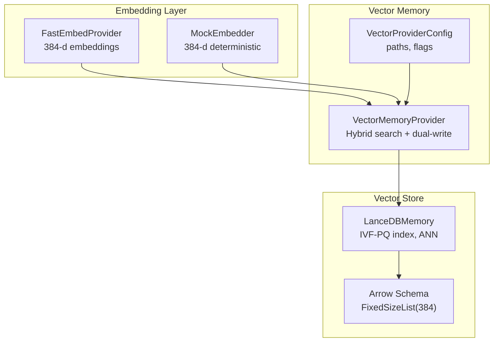
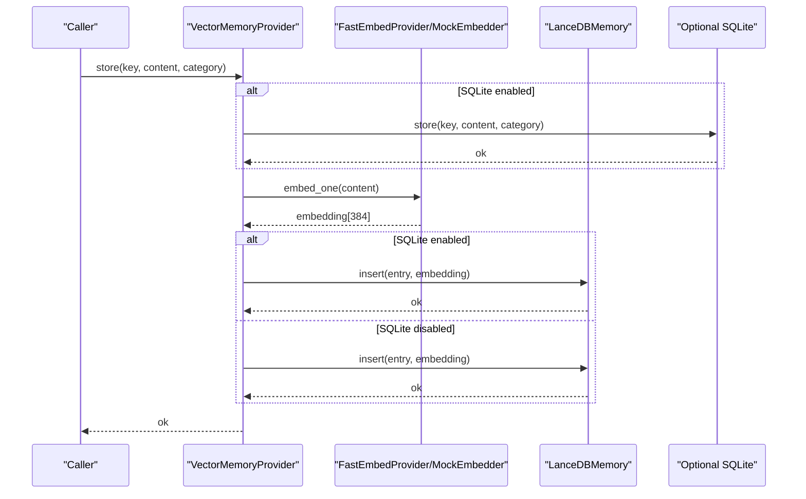
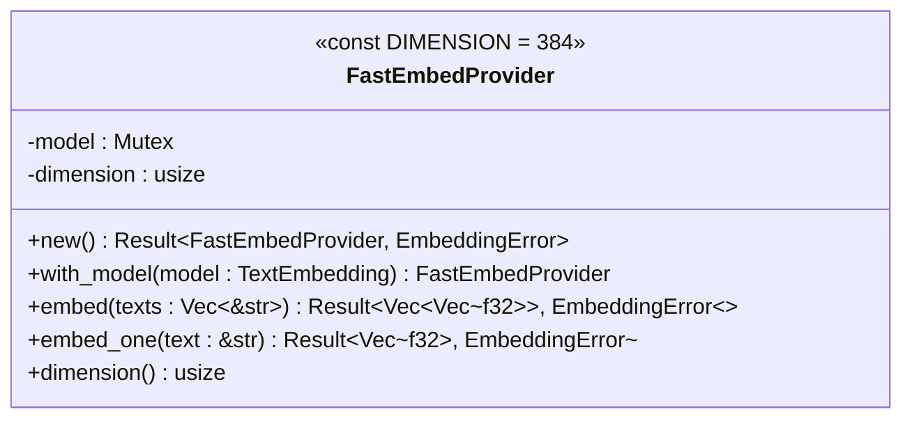
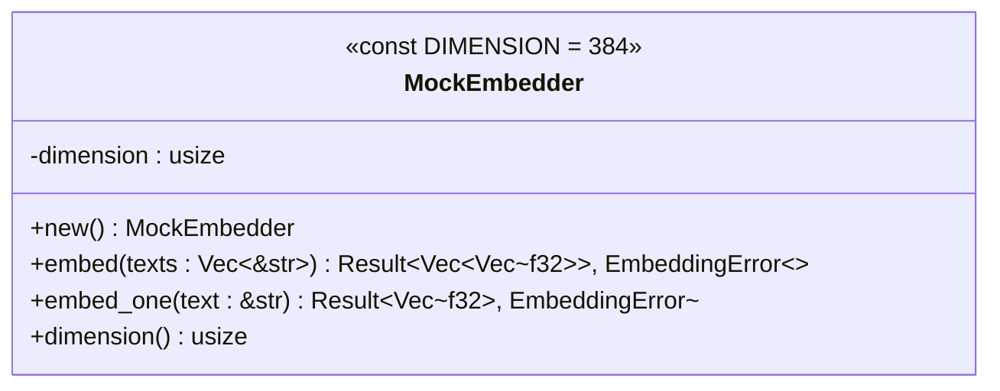
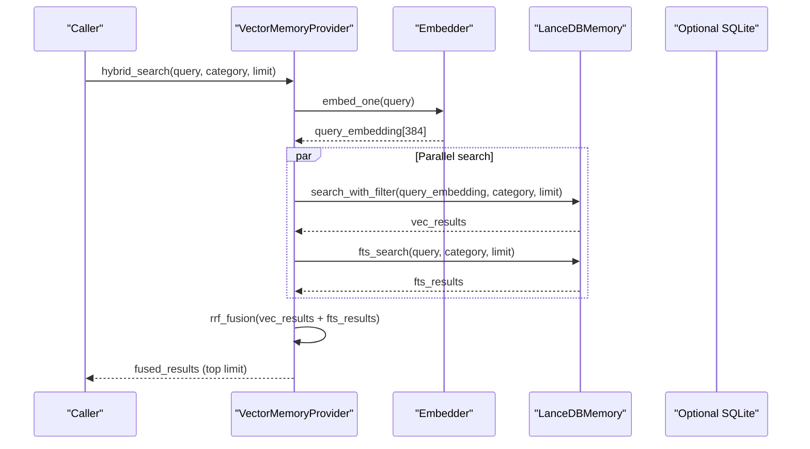
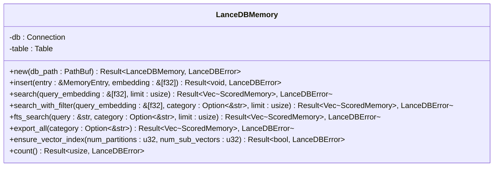
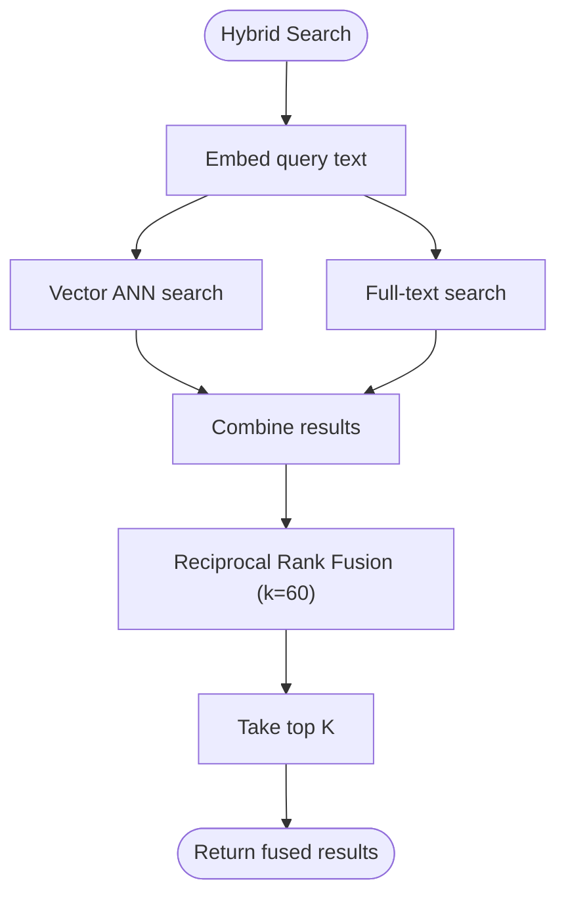
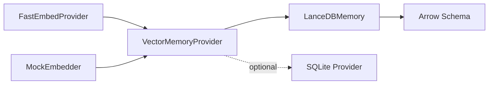

# Vector Embedding System

<cite>
**Referenced Files in This Document**
- [fastembed.rs](file://src-tauri/src/modules/memory/embedding/fastembed.rs)
- [mock.rs](file://src-tauri/src/modules/memory/embedding/mock.rs)
- [mod.rs](file://src-tauri/src/modules/memory/embedding/mod.rs)
- [vector_provider.rs](file://src-tauri/src/modules/memory/providers/vector_provider.rs)
- [lancedb.rs](file://src-tauri/src/modules/memory/providers/lancedb.rs)
- [mod.rs](file://src-tauri/src/modules/memory/mod.rs)
- [model_download.rs](file://src-tauri/src/modules/system_check/model_download.rs)
- [ADR-003-FastEmbed-LanceDB-Selection.md](file://docs/design-docs/postCLI/ADR/ADR-003-FastEmbed-LanceDB-Selection.md)
</cite>

## Table of Contents
1. [Introduction](#introduction)
2. [Project Structure](#project-structure)
3. [Core Components](#core-components)
4. [Architecture Overview](#architecture-overview)
5. [Detailed Component Analysis](#detailed-component-analysis)
6. [Dependency Analysis](#dependency-analysis)
7. [Performance Considerations](#performance-considerations)
8. [Troubleshooting Guide](#troubleshooting-guide)
9. [Conclusion](#conclusion)

## Introduction
This document describes the vector embedding system used by the memory subsystem. It covers the FastEmbed integration for efficient offline text embedding, a deterministic mock embedding provider for testing, and the embedding provider abstraction that enables swapping implementations. It also documents the embedding algorithms, dimensionality considerations, similarity calculations, performance optimizations, batch processing strategies, and integration with the vector database (LanceDB). Finally, it addresses quality metrics, fallback mechanisms, and configuration options.

## Project Structure
The vector embedding system is organized into:
- Embedding providers: FastEmbed and Mock implementations
- Vector memory provider: orchestrates embedding + vector storage
- Vector database: LanceDB-backed storage and search
- Memory provider trait: abstraction for storage backends

**Diagram sources**
- [vector_provider.rs:107-178](file://src-tauri/src/modules/memory/providers/vector_provider.rs#L107-L178)
- [lancedb.rs:112-145](file://src-tauri/src/modules/memory/providers/lancedb.rs#L112-L145)
- [fastembed.rs:35-59](file://src-tauri/src/modules/memory/embedding/fastembed.rs#L35-L59)
- [mock.rs:33-66](file://src-tauri/src/modules/memory/embedding/mock.rs#L33-L66)

**Section sources**
- [mod.rs:1-11](file://src-tauri/src/modules/memory/embedding/mod.rs#L1-L11)
- [vector_provider.rs:1-25](file://src-tauri/src/modules/memory/providers/vector_provider.rs#L1-L25)

## Core Components
- FastEmbedProvider: wraps the fastembed crate to produce 384-dimensional embeddings using the multilingual-e5-small model. It supports batch and single-text embedding, with dimension validation and error handling.
- MockEmbedder: deterministic, unit-norm 384-d embeddings derived from a hash of the input text. Intended for tests and development scenarios where reproducibility is preferred over semantic fidelity.
- VectorMemoryProvider: integrates embedding and vector storage. It supports vector search, full-text search (FTS), hybrid search with Reciprocal Rank Fusion (RRF), optional SQLite dual-write for durability and scope metadata, and PII redaction via a shared ThreatScanner.
- LanceDBMemory: LanceDB-backed store with Arrow schema supporting 384-d float embeddings, approximate nearest neighbor (ANN) search, and optional IVF-PQ index creation.

**Section sources**
- [fastembed.rs:18-107](file://src-tauri/src/modules/memory/embedding/fastembed.rs#L18-L107)
- [mock.rs:18-104](file://src-tauri/src/modules/memory/embedding/mock.rs#L18-L104)
- [vector_provider.rs:98-282](file://src-tauri/src/modules/memory/providers/vector_provider.rs#L98-L282)
- [lancedb.rs:25-115](file://src-tauri/src/modules/memory/providers/lancedb.rs#L25-L115)

## Architecture Overview
The system follows a layered architecture:
- Embedding layer: FastEmbedProvider or MockEmbedder
- Vector memory layer: VectorMemoryProvider orchestrating embedding, storage, and search
- Vector store layer: LanceDBMemory with Arrow schema and optional ANN index
- Optional dual-write: SQLite provider for metadata, scope, and importance decay

**Diagram sources**
- [vector_provider.rs:314-376](file://src-tauri/src/modules/memory/providers/vector_provider.rs#L314-L376)
- [lancedb.rs:147-164](file://src-tauri/src/modules/memory/providers/lancedb.rs#L147-L164)
- [fastembed.rs:82-101](file://src-tauri/src/modules/memory/embedding/fastembed.rs#L82-L101)

## Detailed Component Analysis

### FastEmbedProvider
- Algorithm: Multilingual E5 Small (384-d)
- Offline model: downloaded on first use and cached locally
- Batch vs single: supports both batch and single-text embedding
- Validation: ensures returned embeddings match expected dimension
- Error handling: distinguishes model errors, dimension mismatches, and empty input

**Diagram sources**
- [fastembed.rs:35-107](file://src-tauri/src/modules/memory/embedding/fastembed.rs#L35-L107)

**Section sources**
- [fastembed.rs:40-107](file://src-tauri/src/modules/memory/embedding/fastembed.rs#L40-L107)
- [model_download.rs:14-26](file://src-tauri/src/modules/system_check/model_download.rs#L14-L26)
- [ADR-003-FastEmbed-LanceDB-Selection.md:46-74](file://docs/design-docs/postCLI/ADR/ADR-003-FastEmbed-LanceDB-Selection.md#L46-L74)

### MockEmbedder
- Deterministic 384-d embeddings via FNV-style hashing and LCG-derived components
- Unit-norm output to match cosine similarity expectations
- Intended for tests; not semantically meaningful

**Diagram sources**
- [mock.rs:33-66](file://src-tauri/src/modules/memory/embedding/mock.rs#L33-L66)

**Section sources**
- [mock.rs:35-104](file://src-tauri/src/modules/memory/embedding/mock.rs#L35-L104)

### VectorMemoryProvider
- Embedding dimension: 384 (mirrors FastEmbedProvider)
- Hybrid search: parallel vector and FTS, then RRF fusion
- Dual-write: optional SQLite for metadata, scope, and importance decay
- Security: optional PII scanning via ThreatScanner
- Indexing: attempts to create IVF-PQ index on demand

**Diagram sources**
- [vector_provider.rs:242-275](file://src-tauri/src/modules/memory/providers/vector_provider.rs#L242-L275)
- [lancedb.rs:166-239](file://src-tauri/src/modules/memory/providers/lancedb.rs#L166-L239)

**Section sources**
- [vector_provider.rs:98-282](file://src-tauri/src/modules/memory/providers/vector_provider.rs#L98-L282)
- [vector_provider.rs:651-688](file://src-tauri/src/modules/memory/providers/vector_provider.rs#L651-L688)

### LanceDBMemory
- Schema: key, content, category, embedding (FixedSizeList<Float32, 384>), created_at
- Operations: insert, vector search, filtered vector search, FTS-like client-side filtering, export, count
- Indexing: IVF-PQ index creation guarded by row count thresholds

**Diagram sources**
- [lancedb.rs:112-353](file://src-tauri/src/modules/memory/providers/lancedb.rs#L112-L353)

**Section sources**
- [lancedb.rs:59-115](file://src-tauri/src/modules/memory/providers/lancedb.rs#L59-L115)
- [lancedb.rs:283-342](file://src-tauri/src/modules/memory/providers/lancedb.rs#L283-L342)

### Similarity Calculations and Fusion
- Embeddings are 384-d float vectors.
- Unit normalization is enforced in MockEmbedder to align with cosine similarity expectations.
- Vector similarity uses dot product (cosine ≈ dot for unit vectors).
- Hybrid search uses Reciprocal Rank Fusion (RRF) with k=60 to combine ANN and FTS results.

**Diagram sources**
- [vector_provider.rs:242-275](file://src-tauri/src/modules/memory/providers/vector_provider.rs#L242-L275)
- [vector_provider.rs:651-688](file://src-tauri/src/modules/memory/providers/vector_provider.rs#L651-L688)

**Section sources**
- [mock.rs:69-104](file://src-tauri/src/modules/memory/embedding/mock.rs#L69-L104)
- [vector_provider.rs:651-688](file://src-tauri/src/modules/memory/providers/vector_provider.rs#L651-L688)

### Batch Processing Strategies
- FastEmbedProvider supports batch embedding for improved throughput when processing multiple texts.
- VectorMemoryProvider’s store path embeds a single text; batch embedding is available via the embedder directly.
- LanceDBMemory inserts via Arrow RecordBatch with FixedSizeList(384) arrays.

**Section sources**
- [fastembed.rs:69-80](file://src-tauri/src/modules/memory/embedding/fastembed.rs#L69-L80)
- [lancedb.rs:77-106](file://src-tauri/src/modules/memory/providers/lancedb.rs#L77-L106)

### Integration with Vector Database
- LanceDBMemory creates/opens a table named "semantic_memory" with the expected schema.
- Embeddings are inserted as FixedSizeList<Float32, 384>.
- ANN search leverages LanceDB’s vector search; optional IVF-PQ index improves performance on larger datasets.

**Section sources**
- [lancedb.rs:117-145](file://src-tauri/src/modules/memory/providers/lancedb.rs#L117-L145)
- [lancedb.rs:147-164](file://src-tauri/src/modules/memory/providers/lancedb.rs#L147-L164)

## Dependency Analysis
- Embedding abstraction: VectorMemoryProvider depends on an embedder implementing the same surface as FastEmbedProvider/MockEmbedder.
- Vector store: VectorMemoryProvider depends on LanceDBMemory for persistence and search.
- Optional SQLite: VectorMemoryProvider optionally mirrors writes to SQLite for metadata and scope.
- Model lifecycle: FastEmbed model is initialized once and reused; model download is handled by fastembed crate.

**Diagram sources**
- [vector_provider.rs:107-178](file://src-tauri/src/modules/memory/providers/vector_provider.rs#L107-L178)
- [lancedb.rs:112-145](file://src-tauri/src/modules/memory/providers/lancedb.rs#L112-L145)
- [mod.rs:1-11](file://src-tauri/src/modules/memory/embedding/mod.rs#L1-L11)

**Section sources**
- [mod.rs:1-11](file://src-tauri/src/modules/memory/embedding/mod.rs#L1-L11)
- [vector_provider.rs:107-178](file://src-tauri/src/modules/memory/providers/vector_provider.rs#L107-L178)

## Performance Considerations
- Embedding dimension: 384-d vectors balance semantic quality and computational cost; suitable for CPU-only environments.
- ANN indexing: IVF-PQ index is created when sufficient rows exist; otherwise, brute-force search is used.
- Parallelism: Hybrid search executes vector and FTS searches concurrently.
- Batch embedding: Prefer batch APIs for throughput when processing multiple texts.
- Model caching: FastEmbed model is downloaded once and cached locally.

**Section sources**
- [vector_provider.rs:141-148](file://src-tauri/src/modules/memory/providers/vector_provider.rs#L141-L148)
- [vector_provider.rs:259-263](file://src-tauri/src/modules/memory/providers/vector_provider.rs#L259-L263)
- [lancedb.rs:283-342](file://src-tauri/src/modules/memory/providers/lancedb.rs#L283-L342)
- [model_download.rs:14-26](file://src-tauri/src/modules/system_check/model_download.rs#L14-L26)

## Troubleshooting Guide
Common issues and resolutions:
- Model download failures: Ensure network connectivity; the model is downloaded on first use and cached.
- Dimension mismatch errors: Verify embeddings are 384-d; both FastEmbedProvider and LanceDBMemory enforce this.
- Empty text embedding: FastEmbedProvider rejects empty strings; handle upstream to avoid errors.
- ANN index creation failures: Soft errors are logged; system continues with brute-force search.
- SQLite dual-write failures: Non-fatal; writes continue to LanceDB asynchronously.

**Section sources**
- [fastembed.rs:18-29](file://src-tauri/src/modules/memory/embedding/fastembed.rs#L18-L29)
- [lancedb.rs:34-39](file://src-tauri/src/modules/memory/providers/lancedb.rs#L34-L39)
- [vector_provider.rs:141-148](file://src-tauri/src/modules/memory/providers/vector_provider.rs#L141-L148)
- [vector_provider.rs:352-373](file://src-tauri/src/modules/memory/providers/vector_provider.rs#L352-L373)

## Conclusion
The vector embedding system provides a robust, offline-capable solution for semantic memory using FastEmbed and LanceDB. It offers a clean abstraction enabling deterministic testing via MockEmbedder, optional SQLite dual-write for metadata and scope, and hybrid search with RRF fusion. With careful configuration and indexing, it balances performance and accuracy for agent-driven memory needs.