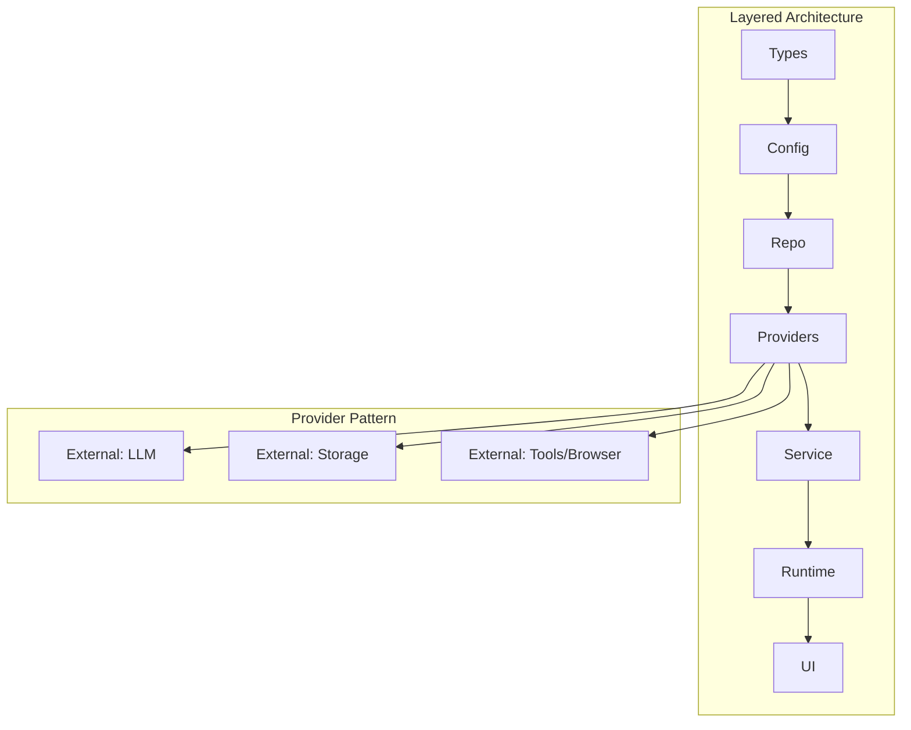
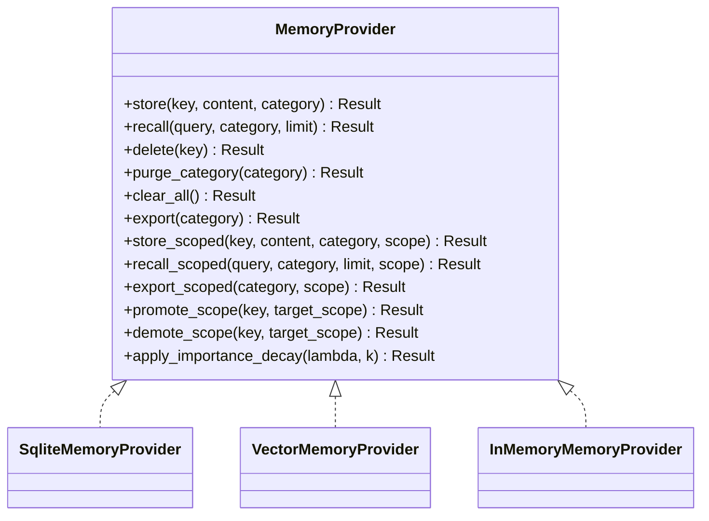
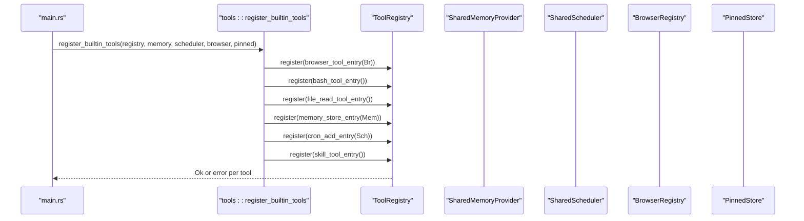
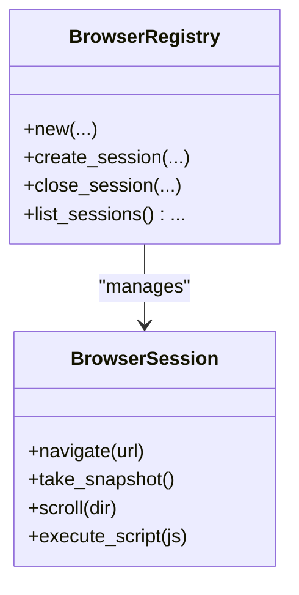
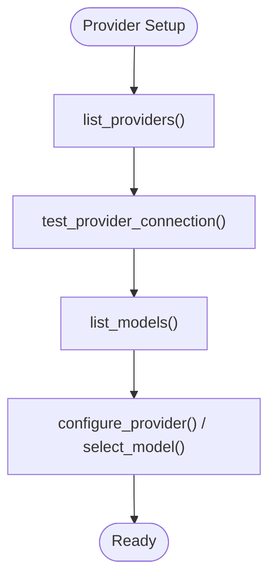
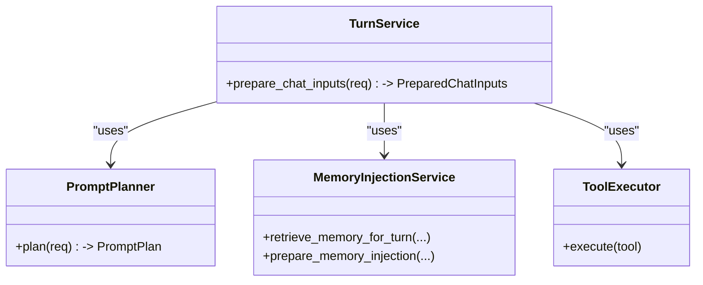
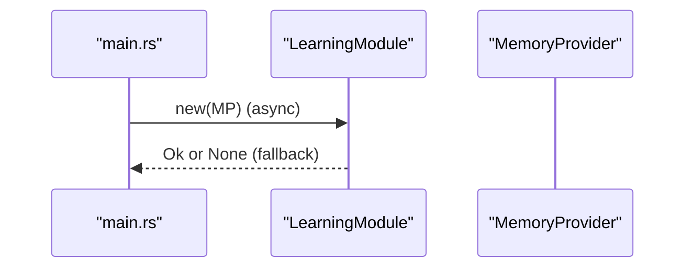
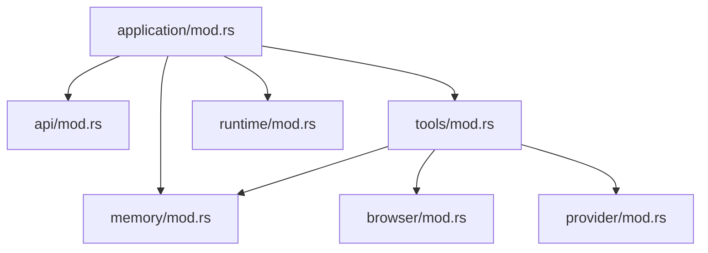

# Module Architecture & Design

<cite>
**Referenced Files in This Document**
- [DESIGN.md](file://DESIGN.md)
- [lib.rs](file://src-tauri/src/lib.rs)
- [main.rs](file://src-tauri/src/main.rs)
- [modules/mod.rs](file://src-tauri/src/modules/mod.rs)
- [application/mod.rs](file://src-tauri/src/modules/application/mod.rs)
- [memory/mod.rs](file://src-tauri/src/modules/memory/mod.rs)
- [provider/mod.rs](file://src-tauri/src/modules/provider/mod.rs)
- [api/mod.rs](file://src-tauri/src/modules/api/mod.rs)
- [tools/mod.rs](file://src-tauri/src/modules/tools/mod.rs)
- [runtime/mod.rs](file://src-tauri/src/modules/runtime/mod.rs)
- [browser/mod.rs](file://src-tauri/src/modules/browser/mod.rs)
</cite>

## Table of Contents
1. [Introduction](#introduction)
2. [Project Structure](#project-structure)
3. [Core Components](#core-components)
4. [Architecture Overview](#architecture-overview)
5. [Detailed Component Analysis](#detailed-component-analysis)
6. [Dependency Analysis](#dependency-analysis)
7. [Performance Considerations](#performance-considerations)
8. [Troubleshooting Guide](#troubleshooting-guide)
9. [Conclusion](#conclusion)
10. [Appendices](#appendices)

## Introduction
This document describes the modular backend architecture of the If2Ai system. It explains the layered design separating concerns across modules for memory management, tool execution, browser automation, speech processing, learning systems, and runtime services. It documents module boundaries, dependency injection patterns, provider architecture, initialization sequences, configuration patterns, extension points, testing strategies, and guidelines for adding new modules.

## Project Structure
The backend is a unified Rust/Tauri application that integrates multiple domain modules under a single binary. The modules are organized by responsibility and migrated from separate crates into a cohesive structure.

```mermaid
graph TB
subgraph "Unified Backend"
MAIN["src-tauri/src/main.rs"]
LIB["src-tauri/src/lib.rs"]
MODS["src-tauri/src/modules/mod.rs"]
end
subgraph "Core Modules"
API["modules/api"]
APP["modules/application"]
BROWSER["modules/browser"]
CHANNEL["modules/channel"]
COMMANDS["modules/commands"]
CONFIG["modules/config"]
CONTROL["modules/control_plane"]
HARNESS["modules/harness"]
LEARNING["modules/learning"]
MEMORY["modules/memory"]
ONBOARD["modules/onboarding"]
PROJECTS["modules/projects"]
PROVIDER["modules/provider"]
RUNTIME["modules/runtime"]
SCHEDULER["modules/scheduler"]
SECURITY["modules/security"]
SESSION["modules/session"]
SKILLS["modules/skills"]
STT["modules/stt"]
SYSTEM["modules/system_check"]
TOOLS["modules/tools"]
TTS["modules/tts"]
VIEWER["modules/viewer_registry"]
end
MAIN --> MODS
LIB --> MODS
MODS --> API
MODS --> APP
MODS --> BROWSER
MODS --> CHANNEL
MODS --> COMMANDS
MODS --> CONFIG
MODS --> CONTROL
MODS --> HARNESS
MODS --> LEARNING
MODS --> MEMORY
MODS --> ONBOARD
MODS --> PROJECTS
MODS --> PROVIDER
MODS --> RUNTIME
MODS --> SCHEDULER
MODS --> SECURITY
MODS --> SESSION
MODS --> SKILLS
MODS --> STT
MODS --> SYSTEM
MODS --> TOOLS
MODS --> TTS
MODS --> VIEWER
```

**Diagram sources**
- [lib.rs:1-23](file://src-tauri/src/lib.rs#L1-L23)
- [modules/mod.rs:1-68](file://src-tauri/src/modules/mod.rs#L1-L68)

**Section sources**
- [lib.rs:1-23](file://src-tauri/src/lib.rs#L1-L23)
- [modules/mod.rs:1-68](file://src-tauri/src/modules/mod.rs#L1-L68)

## Core Components
The backend organizes functionality into clearly separated modules, each with a focused responsibility and explicit interfaces. The core modules include:

- Memory: Persistent and scoped memory storage with provider abstraction and advanced features (compilation, ticking, summarization).
- Tools: Registry and execution framework for built-in and skill-based tools.
- API/Runtime: Provider management and routing for LLM clients and runtime orchestration.
- Browser: Chromium automation via CDP with session lifecycle and snapshotting.
- Provider: Provider registry, connection testing, and model listing.
- Application: Business orchestration services for activation, memory injection, prompt planning, tool execution, and turn orchestration.
- Learning: Self-modeling, reflection, strategy registry, and trajectory management.
- Runtime: Agent loop, conversation, hooks, streaming, permissions, and configuration.

These modules interact through well-defined interfaces, shared traits, and common abstractions, enabling loose coupling and testability.

**Section sources**
- [DESIGN.md:23-29](file://DESIGN.md#L23-L29)
- [memory/mod.rs:1-517](file://src-tauri/src/modules/memory/mod.rs#L1-L517)
- [tools/mod.rs:1-173](file://src-tauri/src/modules/tools/mod.rs#L1-L173)
- [api/mod.rs:1-40](file://src-tauri/src/modules/api/mod.rs#L1-L40)
- [runtime/mod.rs:1-38](file://src-tauri/src/modules/runtime/mod.rs#L1-L38)
- [browser/mod.rs:1-40](file://src-tauri/src/modules/browser/mod.rs#L1-L40)
- [provider/mod.rs:1-25](file://src-tauri/src/modules/provider/mod.rs#L1-L25)
- [application/mod.rs:1-117](file://src-tauri/src/modules/application/mod.rs#L1-L117)

## Architecture Overview
The system follows a strict layered architecture and enforced provider injection patterns. The design emphasizes:
- Single-direction dependency flow (Types → Config → Repo → Providers → Service → Runtime → UI)
- Explicit provider injection points for external dependencies
- Type boundaries and structured logging/error handling
- Asynchronous-first I/O

**Diagram sources**
- [DESIGN.md:41-69](file://DESIGN.md#L41-L69)

**Section sources**
- [DESIGN.md:23-29](file://DESIGN.md#L23-L29)
- [DESIGN.md:70-87](file://DESIGN.md#L70-L87)
- [DESIGN.md:88-104](file://DESIGN.md#L88-L104)
- [DESIGN.md:106-121](file://DESIGN.md#L106-L121)

## Detailed Component Analysis

### Memory Module
The memory module defines a provider trait and multiple implementations, enabling pluggable storage backends. It supports scoped memory operations, importance decay, and advanced subsystems such as compilation, ticking, summarization, and pinned memory.

**Diagram sources**
- [memory/mod.rs:201-380](file://src-tauri/src/modules/memory/mod.rs#L201-L380)

Key initialization and wiring in the backend include:
- Provider selection with fallbacks and threat scanning integration
- JobRunner, SessionSummaryStore, RollingSummarizer, MemoryCompiler, and MemoryTicker construction
- PinnedStore and first-run sentinel handling

**Section sources**
- [memory/mod.rs:1-517](file://src-tauri/src/modules/memory/mod.rs#L1-L517)
- [main.rs:242-404](file://src-tauri/src/main.rs#L242-L404)
- [main.rs:406-782](file://src-tauri/src/main.rs#L406-L782)

### Tools Module
The tools module provides a registry and execution framework. Built-in tools are registered at startup, integrating with memory, scheduler, browser, and pinned stores.

**Diagram sources**
- [tools/mod.rs:26-173](file://src-tauri/src/modules/tools/mod.rs#L26-L173)
- [main.rs:669-675](file://src-tauri/src/main.rs#L669-L675)

**Section sources**
- [tools/mod.rs:1-173](file://src-tauri/src/modules/tools/mod.rs#L1-L173)
- [main.rs:669-675](file://src-tauri/src/main.rs#L669-L675)

### API/Runtime Module
The API module manages provider integrations and routing, while the runtime module orchestrates agent execution, conversations, and streaming.

**Diagram sources**
- [api/mod.rs:1-40](file://src-tauri/src/modules/api/mod.rs#L1-L40)
- [runtime/mod.rs:1-38](file://src-tauri/src/modules/runtime/mod.rs#L1-L38)

**Section sources**
- [api/mod.rs:1-40](file://src-tauri/src/modules/api/mod.rs#L1-L40)
- [runtime/mod.rs:1-38](file://src-tauri/src/modules/runtime/mod.rs#L1-L38)

### Browser Module
The browser module encapsulates Chromium automation via CDP, including session lifecycle, profile management, and snapshotting.

**Diagram sources**
- [browser/mod.rs:1-40](file://src-tauri/src/modules/browser/mod.rs#L1-L40)

**Section sources**
- [browser/mod.rs:1-40](file://src-tauri/src/modules/browser/mod.rs#L1-L40)

### Provider Module
The provider module offers provider discovery, connection testing, model listing, and configuration.

**Diagram sources**
- [provider/mod.rs:1-25](file://src-tauri/src/modules/provider/mod.rs#L1-L25)

**Section sources**
- [provider/mod.rs:1-25](file://src-tauri/src/modules/provider/mod.rs#L1-L25)

### Application Layer Services
The application module coordinates business orchestration for a single agent turn, exposing services for prompt planning, memory injection, tool execution, and turn preparation.

**Diagram sources**
- [application/mod.rs:1-117](file://src-tauri/src/modules/application/mod.rs#L1-L117)

**Section sources**
- [application/mod.rs:1-117](file://src-tauri/src/modules/application/mod.rs#L1-L117)

### Learning Module
The learning module provides self-modeling, reflection, strategy registry, and trajectory management, initialized at startup with fallbacks.

**Diagram sources**
- [main.rs:713-742](file://src-tauri/src/main.rs#L713-L742)

**Section sources**
- [main.rs:713-742](file://src-tauri/src/main.rs#L713-L742)

## Dependency Analysis
The modules exhibit clear separation of concerns and adhere to the layered architecture. Dependencies flow upward (Types → Config → Repo → Providers → Service → Runtime → UI), and external dependencies are injected via providers.

**Diagram sources**
- [tools/mod.rs:22-24](file://src-tauri/src/modules/tools/mod.rs#L22-L24)
- [memory/mod.rs:1-517](file://src-tauri/src/modules/memory/mod.rs#L1-L517)
- [browser/mod.rs:1-40](file://src-tauri/src/modules/browser/mod.rs#L1-L40)
- [provider/mod.rs:1-25](file://src-tauri/src/modules/provider/mod.rs#L1-L25)
- [api/mod.rs:1-40](file://src-tauri/src/modules/api/mod.rs#L1-L40)
- [runtime/mod.rs:1-38](file://src-tauri/src/modules/runtime/mod.rs#L1-L38)
- [application/mod.rs:1-117](file://src-tauri/src/modules/application/mod.rs#L1-L117)

**Section sources**
- [DESIGN.md:41-69](file://DESIGN.md#L41-L69)

## Performance Considerations
- Provider selection and initialization include timeouts and fallbacks to ensure robustness and responsiveness.
- Memory subsystems leverage background job runners and scoped operations to minimize contention and improve throughput.
- Lazy initialization patterns (e.g., TTS provider factory) reduce cold-start latency.
- Structured logging and observability are enforced to facilitate performance monitoring and diagnostics.

[No sources needed since this section provides general guidance]

## Troubleshooting Guide
Common issues and remedies:
- Memory provider initialization failures: The backend attempts hybrid/vector providers with timeouts and falls back to SQLite or in-memory providers. Review logs for specific error messages and environment flags affecting provider selection.
- JobRunner persistence failures: The system falls back to an ephemeral in-memory database for job persistence; failures are logged and startup continues with reduced functionality.
- Learning module initialization: Async initialization may fail; the system logs warnings and disables self-learning features gracefully.
- Logging: Centralized file logging is configured at startup; verify log directory permissions and rotation settings.

**Section sources**
- [main.rs:242-404](file://src-tauri/src/main.rs#L242-L404)
- [main.rs:329-361](file://src-tauri/src/main.rs#L329-L361)
- [main.rs:713-742](file://src-tauri/src/main.rs#L713-L742)
- [main.rs:406-428](file://src-tauri/src/main.rs#L406-L428)

## Conclusion
The If2Ai backend employs a disciplined modular architecture with strict layering, explicit provider injection, and well-defined interfaces. This design enables composability, testability, and maintainability across memory, tools, browser automation, speech processing, learning systems, and runtime services. The initialization sequences, configuration patterns, and extension points outlined here provide a blueprint for extending the system safely and consistently.

[No sources needed since this section summarizes without analyzing specific files]

## Appendices

### Module Initialization Sequence (High-Level)
- Startup initializes logging, loads runtime configuration, and sets global runtime config.
- Constructs shared collaborators: SessionManager, ToolRegistry, BrowserRegistry, ProjectManager, OnboardingFlow, ContextBudget.
- Initializes memory infrastructure: ThreatScanner, JobRunner, SessionSummaryStore, RollingSummarizer, MemoryCompiler, MemoryTicker, PinnedStore, and selects a MemoryProvider with fallbacks.
- Registers built-in tools with dependencies on memory, scheduler, browser, and pinned stores.
- Initializes optional subsystems: TrajectoryManager, LearningModule, ActiveRetrievalManager, Harness (conditional).
- Builds AppState and manages state for Tauri commands.

**Section sources**
- [main.rs:406-782](file://src-tauri/src/main.rs#L406-L782)

### Testing Strategies for Modular Components
- Provider-based testing: Use mock providers to isolate external dependencies and enable deterministic tests.
- Layered testing: Validate each layer independently (Types → Config → Repo → Providers → Service → Runtime → UI) with targeted unit and integration tests.
- Harness-based evaluation: Employ the Harness framework for end-to-end evaluation, comparison, and reproducibility.
- Contract-first design: Define clear interfaces and contracts to simplify testing and refactoring.

**Section sources**
- [DESIGN.md:139-166](file://DESIGN.md#L139-L166)
- [DESIGN.md:322-323](file://DESIGN.md#L322-L323)

### Guidelines for Adding New Modules
- Follow the layered architecture: Define Types, Config, Repo, Providers, Service, Runtime, and UI responsibilities.
- Enforce provider injection: External dependencies must be injected via providers to ensure testability and flexibility.
- Maintain single-direction dependencies: Prevent reverse and cross-layer dependencies.
- Use shared traits and common abstractions: Define clear interfaces for module interactions.
- Provide configuration patterns: Support environment variables and configuration files for module behavior.
- Add extension points: Expose hooks and registries for future enhancements.
- Document contracts: Ensure interfaces are documented with usage examples and error conditions.

**Section sources**
- [DESIGN.md:23-29](file://DESIGN.md#L23-L29)
- [DESIGN.md:70-87](file://DESIGN.md#L70-L87)
- [DESIGN.md:88-104](file://DESIGN.md#L88-L104)
- [DESIGN.md:106-121](file://DESIGN.md#L106-L121)