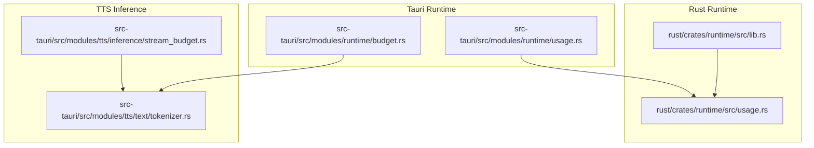
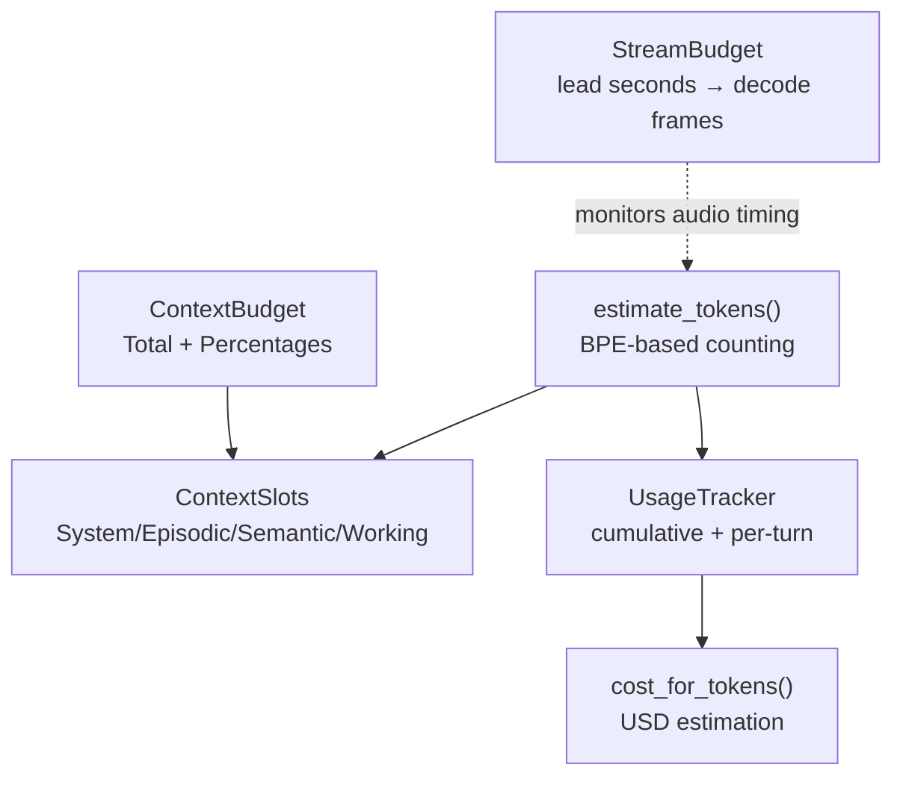
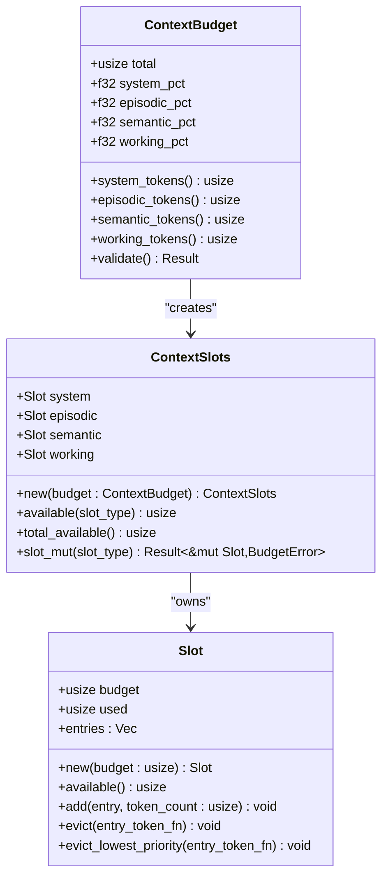
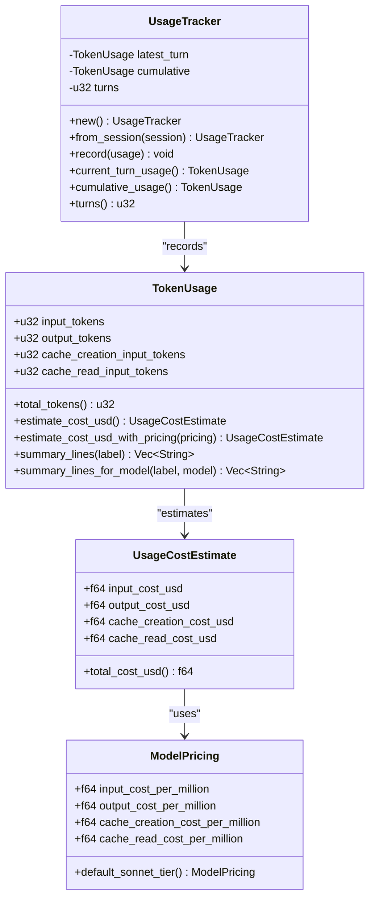
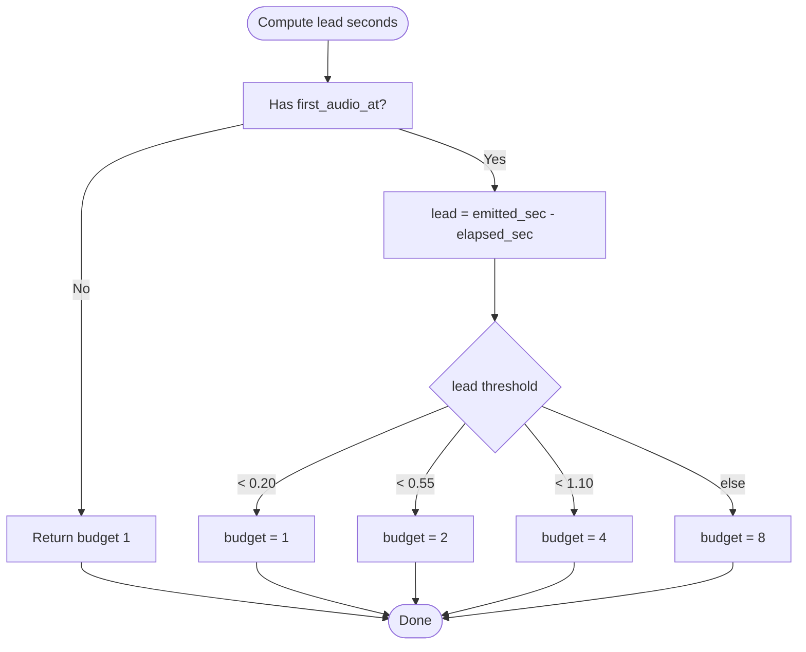
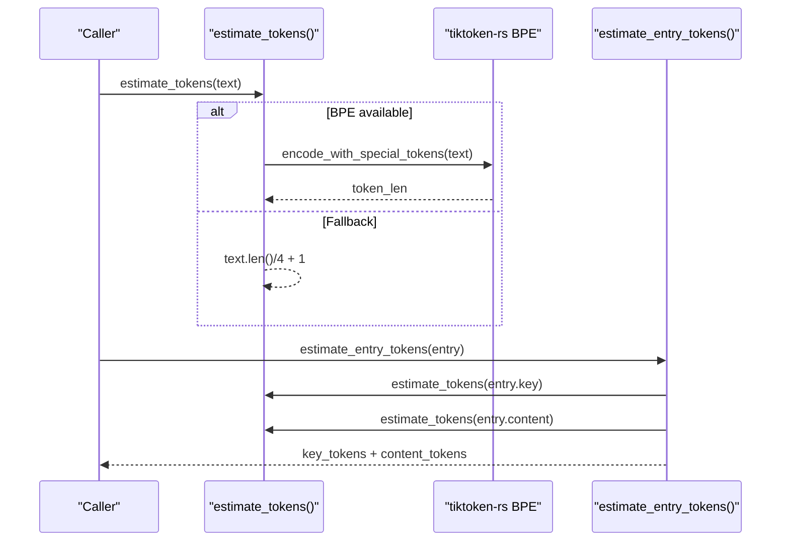
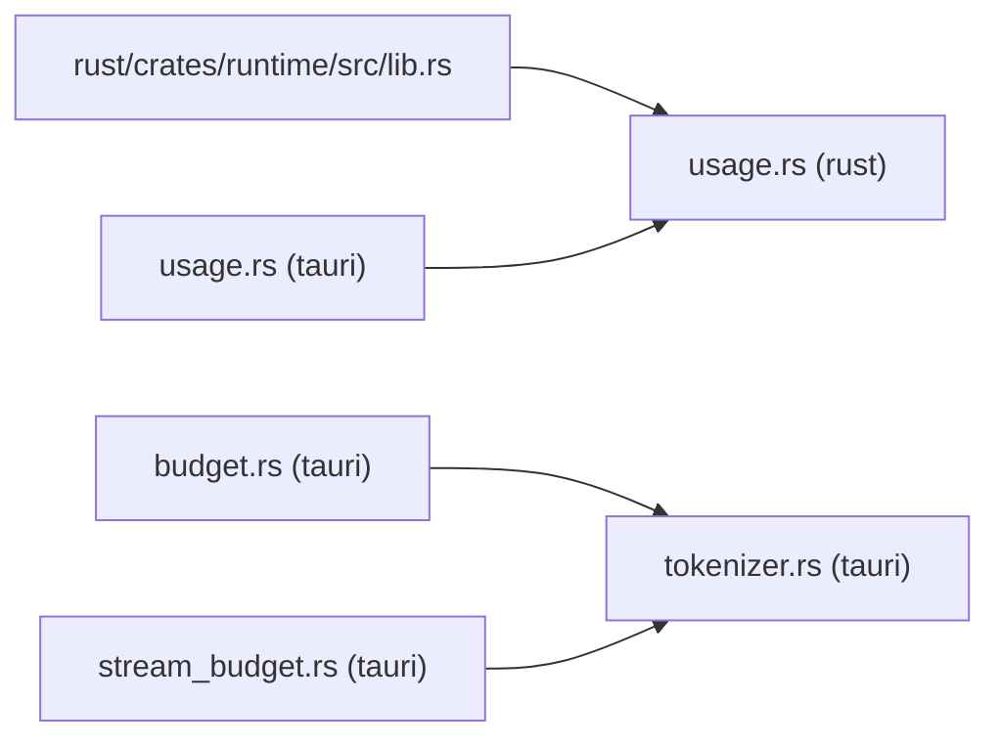

# Budget Tracking

<cite>
**Referenced Files in This Document**
- [budget.rs](file://src-tauri/src/modules/runtime/budget.rs)
- [usage.rs](file://rust/crates/runtime/src/usage.rs)
- [usage.rs](file://src-tauri/src/modules/runtime/usage.rs)
- [stream_budget.rs](file://src-tauri/src/modules/tts/inference/stream_budget.rs)
- [tokenizer.rs](file://src-tauri/src/modules/tts/text/tokenizer.rs)
- [ADR-004-Token-Budget-Allocation.md](file://docs/design-docs/postCLI/ADR/ADR-004-Token-Budget-Allocation.md)
- [agent-orchestrator.md](file://docs/design-docs/agent-orchestrator.md)
- [lib.rs](file://rust/crates/runtime/src/lib.rs)
</cite>

## Table of Contents
1. [Introduction](#introduction)
2. [Project Structure](#project-structure)
3. [Core Components](#core-components)
4. [Architecture Overview](#architecture-overview)
5. [Detailed Component Analysis](#detailed-component-analysis)
6. [Dependency Analysis](#dependency-analysis)
7. [Performance Considerations](#performance-considerations)
8. [Troubleshooting Guide](#troubleshooting-guide)
9. [Conclusion](#conclusion)

## Introduction
This document explains the budget tracking and usage monitoring system for token budgets, cost estimation, and resource consumption. It covers:
- Token budget allocation across memory slots (context window)
- Usage tracking for input, output, and cache tokens
- Cost estimation and reporting
- Budget enforcement and usage limits
- Resource optimization via token estimation and adaptive streaming
- Examples of initialization, tracking, and enforcement

## Project Structure
The budget and usage systems span both Rust runtime libraries and Tauri modules:
- Rust runtime crate provides token usage models and cost estimation
- Tauri runtime module manages context window budget allocation and token estimation
- TTS inference module adapts decoding budget based on streaming lead
- Tokenizer module provides deterministic token counting for text

**Diagram sources**
- [usage.rs:1-311](file://rust/crates/runtime/src/usage.rs#L1-L311)
- [lib.rs:84-86](file://rust/crates/runtime/src/lib.rs#L84-L86)
- [budget.rs:1-546](file://src-tauri/src/modules/runtime/budget.rs#L1-L546)
- [usage.rs:156-212](file://src-tauri/src/modules/runtime/usage.rs#L156-L212)
- [stream_budget.rs:1-83](file://src-tauri/src/modules/tts/inference/stream_budget.rs#L1-L83)
- [tokenizer.rs:1-199](file://src-tauri/src/modules/tts/text/tokenizer.rs#L1-L199)

**Section sources**
- [usage.rs:1-311](file://rust/crates/runtime/src/usage.rs#L1-L311)
- [lib.rs:84-86](file://rust/crates/runtime/src/lib.rs#L84-L86)
- [budget.rs:1-546](file://src-tauri/src/modules/runtime/budget.rs#L1-L546)
- [usage.rs:156-212](file://src-tauri/src/modules/runtime/usage.rs#L156-L212)
- [stream_budget.rs:1-83](file://src-tauri/src/modules/tts/inference/stream_budget.rs#L1-L83)
- [tokenizer.rs:1-199](file://src-tauri/src/modules/tts/text/tokenizer.rs#L1-L199)

## Core Components
- Context budget allocation and slot management
- Token usage tracking and cost estimation
- Streaming decode budget adaptation
- Token counting for text and memory entries

Key responsibilities:
- Allocate and enforce a total token budget across System, Episodic, Semantic, and Working memory slots
- Track cumulative and per-turn token usage and estimate USD costs
- Provide adaptive streaming budgeting for audio decoding
- Count tokens deterministically for accurate budgeting

**Section sources**
- [budget.rs:106-176](file://src-tauri/src/modules/runtime/budget.rs#L106-L176)
- [budget.rs:264-311](file://src-tauri/src/modules/runtime/budget.rs#L264-L311)
- [usage.rs:29-161](file://rust/crates/runtime/src/usage.rs#L29-L161)
- [usage.rs:163-210](file://rust/crates/runtime/src/usage.rs#L163-L210)
- [stream_budget.rs:18-54](file://src-tauri/src/modules/tts/inference/stream_budget.rs#L18-L54)
- [tokenizer.rs:314-342](file://src-tauri/src/modules/tts/text/tokenizer.rs#L314-L342)

## Architecture Overview
The system integrates three layers:
- Context window budgeting: distributes tokens across memory slots
- Usage tracking: accumulates token usage and estimates cost
- Streaming budgeting: adapts decoding frames based on lead time

**Diagram sources**
- [budget.rs:106-176](file://src-tauri/src/modules/runtime/budget.rs#L106-L176)
- [budget.rs:264-311](file://src-tauri/src/modules/runtime/budget.rs#L264-L311)
- [budget.rs:313-342](file://src-tauri/src/modules/runtime/budget.rs#L313-L342)
- [usage.rs:29-161](file://rust/crates/runtime/src/usage.rs#L29-L161)
- [usage.rs:154-161](file://rust/crates/runtime/src/usage.rs#L154-L161)
- [stream_budget.rs:18-54](file://src-tauri/src/modules/tts/inference/stream_budget.rs#L18-L54)

## Detailed Component Analysis

### Context Budget Allocation
ContextBudget defines the total token budget and slot percentages. ContextSlots instantiate per-slot budgets and track used tokens. Token estimation uses a BPE tokenizer for accuracy.

**Diagram sources**
- [budget.rs:106-176](file://src-tauri/src/modules/runtime/budget.rs#L106-L176)
- [budget.rs:264-311](file://src-tauri/src/modules/runtime/budget.rs#L264-L311)
- [budget.rs:46-104](file://src-tauri/src/modules/runtime/budget.rs#L46-L104)

**Section sources**
- [budget.rs:106-176](file://src-tauri/src/modules/runtime/budget.rs#L106-L176)
- [budget.rs:264-311](file://src-tauri/src/modules/runtime/budget.rs#L264-L311)
- [budget.rs:46-104](file://src-tauri/src/modules/runtime/budget.rs#L46-L104)
- [ADR-004-Token-Budget-Allocation.md:49-146](file://docs/design-docs/postCLI/ADR/ADR-004-Token-Budget-Allocation.md#L49-L146)

### Token Usage Tracking and Cost Estimation
TokenUsage aggregates input, output, cache creation, and cache read tokens. UsageTracker records per-turn and cumulative usage. Cost estimation converts tokens to USD using model-specific pricing tiers.

**Diagram sources**
- [usage.rs:29-161](file://rust/crates/runtime/src/usage.rs#L29-L161)
- [usage.rs:163-210](file://rust/crates/runtime/src/usage.rs#L163-L210)

**Section sources**
- [usage.rs:29-161](file://rust/crates/runtime/src/usage.rs#L29-L161)
- [usage.rs:163-210](file://rust/crates/runtime/src/usage.rs#L163-L210)
- [lib.rs:84-86](file://rust/crates/runtime/src/lib.rs#L84-L86)

### Streaming Decode Budget Adaptation
Streaming budget adjusts the number of frames decoded per step based on lead seconds between emitted audio duration and wall-clock time since first audio.

**Diagram sources**
- [stream_budget.rs:18-54](file://src-tauri/src/modules/tts/inference/stream_budget.rs#L18-L54)

**Section sources**
- [stream_budget.rs:1-83](file://src-tauri/src/modules/tts/inference/stream_budget.rs#L1-L83)

### Token Counting for Text and Entries
Token counting uses a BPE tokenizer when available, with a fallback heuristic. Memory entries are counted by combining key and content token counts.

**Diagram sources**
- [budget.rs:313-342](file://src-tauri/src/modules/runtime/budget.rs#L313-L342)
- [budget.rs:321-336](file://src-tauri/src/modules/runtime/budget.rs#L321-L336)

**Section sources**
- [budget.rs:313-342](file://src-tauri/src/modules/runtime/budget.rs#L313-L342)

## Dependency Analysis
- Rust runtime exports usage types and functions for external consumers
- Tauri runtime module depends on memory entries and uses BPE tokenization
- Stream budget depends on audio timing and sample rate
- Tokenizer is independent and deterministic

**Diagram sources**
- [lib.rs:84-86](file://rust/crates/runtime/src/lib.rs#L84-L86)
- [usage.rs:1-311](file://rust/crates/runtime/src/usage.rs#L1-L311)
- [usage.rs:156-212](file://src-tauri/src/modules/runtime/usage.rs#L156-L212)
- [budget.rs:1-546](file://src-tauri/src/modules/runtime/budget.rs#L1-L546)
- [tokenizer.rs:1-199](file://src-tauri/src/modules/tts/text/tokenizer.rs#L1-L199)
- [stream_budget.rs:1-83](file://src-tauri/src/modules/tts/inference/stream_budget.rs#L1-L83)

**Section sources**
- [lib.rs:84-86](file://rust/crates/runtime/src/lib.rs#L84-L86)
- [budget.rs:1-546](file://src-tauri/src/modules/runtime/budget.rs#L1-L546)
- [usage.rs:1-311](file://rust/crates/runtime/src/usage.rs#L1-L311)
- [usage.rs:156-212](file://src-tauri/src/modules/runtime/usage.rs#L156-L212)
- [stream_budget.rs:1-83](file://src-tauri/src/modules/tts/inference/stream_budget.rs#L1-L83)
- [tokenizer.rs:1-199](file://src-tauri/src/modules/tts/text/tokenizer.rs#L1-L199)

## Performance Considerations
- BPE tokenization is initialized once and reused; initial load cost is minimal
- Slot eviction removes entries from the front or by lowest priority to maintain budget
- Streaming decode budget scales with lead to balance latency and throughput
- Cost estimation avoids repeated conversions by caching pricing per model

## Troubleshooting Guide
Common issues and resolutions:
- Invalid budget percentages: ensure the sum equals 1.0; otherwise validation fails and falls back to defaults
- Budget exceeded errors: reduce token usage or increase total budget
- Unknown model pricing: cost estimation falls back to default tier with a note in summaries
- Streaming budget anomalies: verify emitted samples and sample rate; lead should be non-negative

**Section sources**
- [budget.rs:168-176](file://src-tauri/src/modules/runtime/budget.rs#L168-L176)
- [budget.rs:221-261](file://src-tauri/src/modules/runtime/budget.rs#L221-L261)
- [usage.rs:115-151](file://rust/crates/runtime/src/usage.rs#L115-L151)
- [stream_budget.rs:18-54](file://src-tauri/src/modules/tts/inference/stream_budget.rs#L18-L54)

## Conclusion
The budget tracking system provides a robust foundation for managing context window allocation, tracking token usage, and estimating costs. It integrates deterministic token counting, adaptive streaming, and clear enforcement boundaries across memory slots. Together with cost reporting and validation, it enables predictable resource control and optimization for both LLM interactions and TTS decoding.