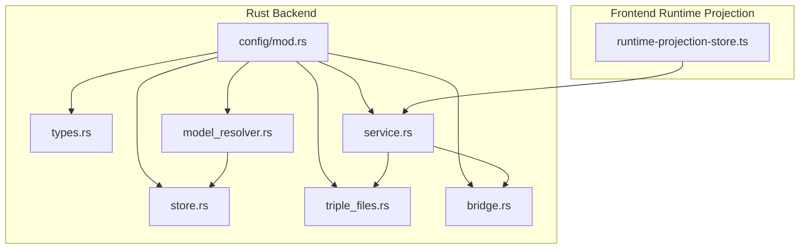
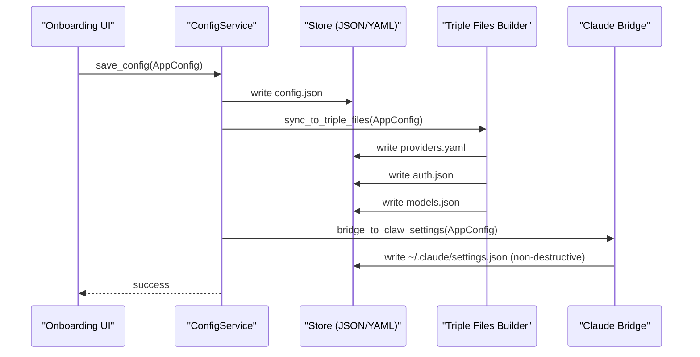
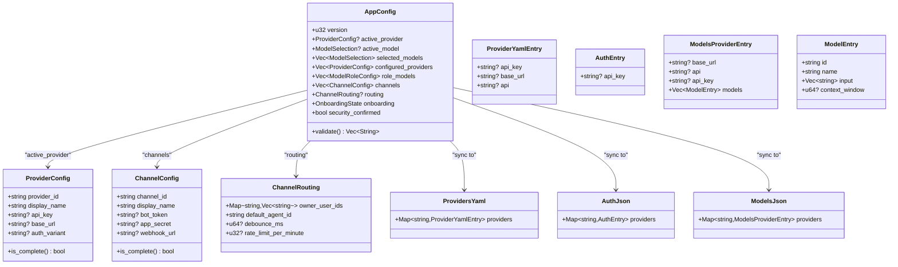
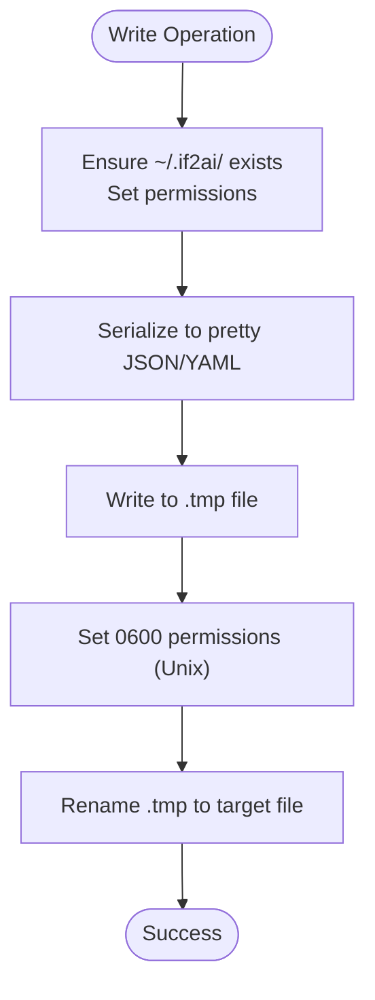
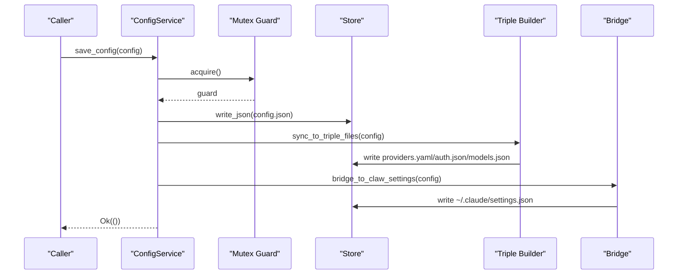
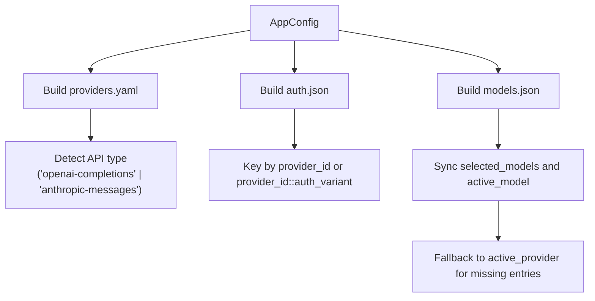
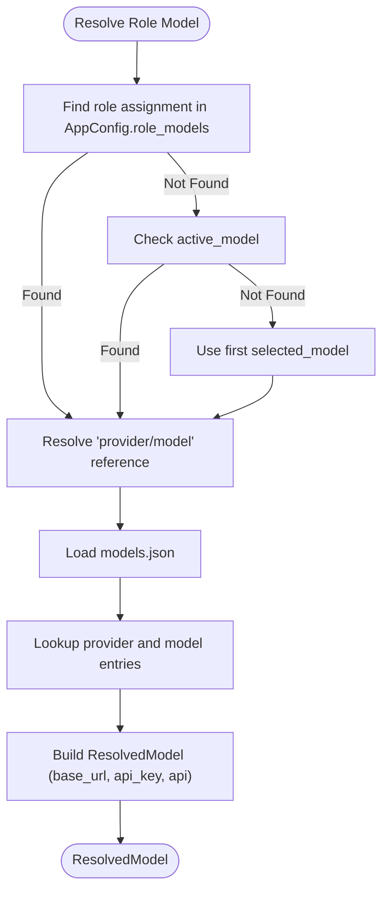
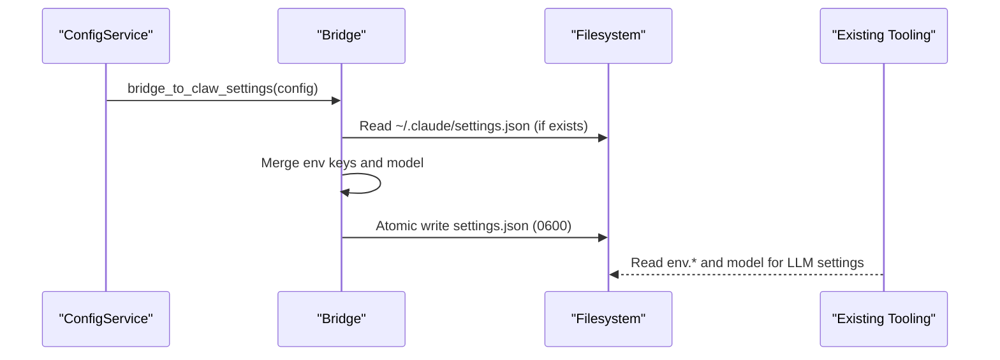
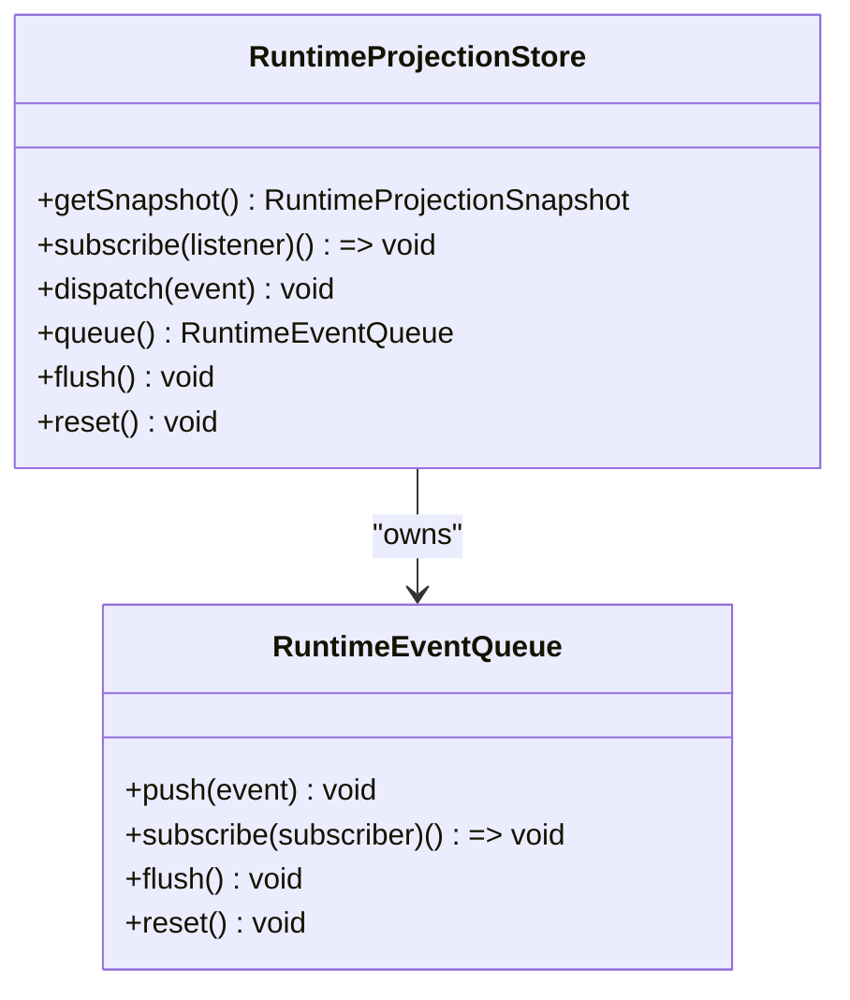
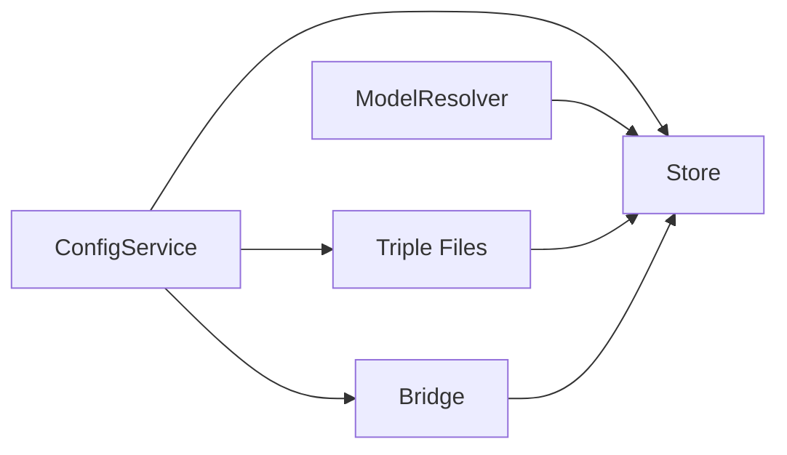

# Configuration Management

<cite>
**Referenced Files in This Document**
- [mod.rs](file://src-tauri/src/modules/config/mod.rs)
- [types.rs](file://src-tauri/src/modules/config/types.rs)
- [store.rs](file://src-tauri/src/modules/config/store.rs)
- [service.rs](file://src-tauri/src/modules/config/service.rs)
- [model_resolver.rs](file://src-tauri/src/modules/config/model_resolver.rs)
- [triple_files.rs](file://src-tauri/src/modules/config/triple_files.rs)
- [bridge.rs](file://src-tauri/src/modules/config/bridge.rs)
- [runtime-projection-store.ts](file://src/runtime-projection/runtime-projection-store.ts)
</cite>

## Table of Contents
1. [Introduction](#introduction)
2. [Project Structure](#project-structure)
3. [Core Components](#core-components)
4. [Architecture Overview](#architecture-overview)
5. [Detailed Component Analysis](#detailed-component-analysis)
6. [Dependency Analysis](#dependency-analysis)
7. [Performance Considerations](#performance-considerations)
8. [Troubleshooting Guide](#troubleshooting-guide)
9. [Conclusion](#conclusion)

## Introduction
This document explains the configuration management system that powers onboarding and runtime model resolution. It covers:
- Dual-layer configuration: a user-friendly single JSON file and a triple-file runtime format
- ProviderTransportConfig usage and model resolution strategies
- Configuration validation and runtime updates
- The configuration bridge pattern that maintains compatibility with existing tooling
- Service layer abstractions and store implementations
- Examples of initialization, model selection, and persistence patterns

## Project Structure
The configuration system is implemented in Rust under the Tauri backend and TypeScript in the frontend runtime projection layer. The Rust module organizes configuration concerns into cohesive submodules, while the frontend provides a global store for runtime projections.

**Diagram sources**
- [mod.rs:1-33](file://src-tauri/src/modules/config/mod.rs#L1-L33)
- [types.rs:1-474](file://src-tauri/src/modules/config/types.rs#L1-L474)
- [store.rs:1-302](file://src-tauri/src/modules/config/store.rs#L1-L302)
- [service.rs:1-484](file://src-tauri/src/modules/config/service.rs#L1-L484)
- [model_resolver.rs:1-377](file://src-tauri/src/modules/config/model_resolver.rs#L1-L377)
- [triple_files.rs:1-377](file://src-tauri/src/modules/config/triple_files.rs#L1-L377)
- [bridge.rs:1-237](file://src-tauri/src/modules/config/bridge.rs#L1-L237)
- [runtime-projection-store.ts:1-134](file://src/runtime-projection/runtime-projection-store.ts#L1-L134)

**Section sources**
- [mod.rs:1-33](file://src-tauri/src/modules/config/mod.rs#L1-L33)

## Core Components
- Types: Define the onboarding AppConfig (Layer 1) and runtime triple files (Layer 2) structures, including ProviderConfig, ChannelConfig, ModelSelection, and role-based model assignments.
- Store: Provides atomic file I/O for JSON/YAML with proper permissions and error handling.
- Service: Implements the unified ConfigService with dual-write to Layer 1 and Layer 2, validation, migration, and reset operations.
- Triple Files: Synchronizes AppConfig to providers.yaml, auth.json, and models.json for runtime consumption.
- Model Resolver: Resolves model references to full connection details and supports role-based routing.
- Bridge: Writes a compatible subset to ~/.claude/settings.json to maintain compatibility with existing tooling.

**Section sources**
- [types.rs:263-402](file://src-tauri/src/modules/config/types.rs#L263-L402)
- [store.rs:13-115](file://src-tauri/src/modules/config/store.rs#L13-L115)
- [service.rs:27-109](file://src-tauri/src/modules/config/service.rs#L27-L109)
- [triple_files.rs:21-36](file://src-tauri/src/modules/config/triple_files.rs#L21-L36)
- [model_resolver.rs:31-71](file://src-tauri/src/modules/config/model_resolver.rs#L31-L71)
- [bridge.rs:34-125](file://src-tauri/src/modules/config/bridge.rs#L34-L125)

## Architecture Overview
The system uses a dual-layer approach:
- Layer 1 (AppConfig): A single JSON file for onboarding and user-facing configuration.
- Layer 2 (Triple Files): providers.yaml, auth.json, and models.json for runtime resolution and compatibility.

**Diagram sources**
- [service.rs:84-109](file://src-tauri/src/modules/config/service.rs#L84-L109)
- [triple_files.rs:21-36](file://src-tauri/src/modules/config/triple_files.rs#L21-L36)
- [bridge.rs:40-125](file://src-tauri/src/modules/config/bridge.rs#L40-L125)

## Detailed Component Analysis

### Types and Data Models
- AppConfig: Central onboarding configuration with active provider, selected models, role-based assignments, channels, routing defaults, and onboarding state.
- ProviderConfig: Encapsulates provider credentials and connection settings with completeness checks.
- ChannelConfig and ChannelRouting: Define channel credentials and routing defaults.
- Triple Files: ProvidersYaml, AuthJson, ModelsJson represent the runtime triple files with provider entries, auth overrides, and model registries.

**Diagram sources**
- [types.rs:263-474](file://src-tauri/src/modules/config/types.rs#L263-L474)

**Section sources**
- [types.rs:263-474](file://src-tauri/src/modules/config/types.rs#L263-L474)

### Store Implementation
- Ensures the ~/.if2ai/ directory exists with restricted permissions.
- Provides atomic write operations for JSON and YAML using temporary files and renames.
- Offers read/write helpers for config.json, providers.yaml, models.json, auth.json, and channels-config.json.
- Returns structured errors for I/O, serialization, and deserialization failures.

**Diagram sources**
- [store.rs:74-115](file://src-tauri/src/modules/config/store.rs#L74-L115)

**Section sources**
- [store.rs:13-115](file://src-tauri/src/modules/config/store.rs#L13-L115)

### Service Layer Abstractions
- ConfigService orchestrates dual-write operations: Layer 1 (config.json) plus Layer 2 (providers.yaml, auth.json, models.json).
- Provides methods to load/save provider/channel/model, validate configuration, and reset onboarding state.
- Uses a mutex to protect concurrent writes and ensure atomicity.
- Integrates with onboarding state persistence and triggers the triple-file synchronization.

**Diagram sources**
- [service.rs:84-109](file://src-tauri/src/modules/config/service.rs#L84-L109)
- [triple_files.rs:21-36](file://src-tauri/src/modules/config/triple_files.rs#L21-L36)
- [bridge.rs:40-125](file://src-tauri/src/modules/config/bridge.rs#L40-L125)

**Section sources**
- [service.rs:27-109](file://src-tauri/src/modules/config/service.rs#L27-L109)

### Triple File Management
- Converts AppConfig into the runtime triple files:
  - providers.yaml: provider definitions with detected API type
  - auth.json: API keys keyed by provider_id or provider_id::auth_variant
  - models.json: model registry compatible with pi-coding-agent schema
- Ensures backward compatibility by falling back to active_provider when configured_providers is absent.
- Detects API type heuristically based on provider_id or base_url.

**Diagram sources**
- [triple_files.rs:21-172](file://src-tauri/src/modules/config/triple_files.rs#L21-L172)

**Section sources**
- [triple_files.rs:21-206](file://src-tauri/src/modules/config/triple_files.rs#L21-L206)

### Model Resolution Strategies
- Resolves "provider_id/model_id" references to full connection details using models.json and config.json.
- Supports role-based model routing with a fallback chain: explicit role assignment → active_model → first selected_model.
- Lists available models grouped by provider and merges configured models with builtin provider names for display.

**Diagram sources**
- [model_resolver.rs:173-202](file://src-tauri/src/modules/config/model_resolver.rs#L173-L202)

**Section sources**
- [model_resolver.rs:31-202](file://src-tauri/src/modules/config/model_resolver.rs#L31-L202)

### Configuration Bridge Pattern
- Bridges if2AI configuration to ~/.claude/settings.json non-destructively, updating only owned env keys and model.
- Maps provider-specific auth tokens and base URLs to environment variable keys expected by existing tooling.
- Preserves all other fields in settings.json to avoid breaking existing integrations.

**Diagram sources**
- [bridge.rs:40-125](file://src-tauri/src/modules/config/bridge.rs#L40-L125)

**Section sources**
- [bridge.rs:34-171](file://src-tauri/src/modules/config/bridge.rs#L34-L171)

### Frontend Runtime Projection Store
- Provides a global store for runtime projections with immutable snapshots and subscription support.
- Bridges to backend services via dispatch and queue APIs, enabling seamless integration with configuration updates.

**Diagram sources**
- [runtime-projection-store.ts:32-54](file://src/runtime-projection/runtime-projection-store.ts#L32-L54)

**Section sources**
- [runtime-projection-store.ts:1-134](file://src/runtime-projection/runtime-projection-store.ts#L1-L134)

## Dependency Analysis
- ConfigService depends on Store for file I/O, Triple Files for synchronization, and Bridge for compatibility.
- ModelResolver depends on Store for reading models.json and config.json.
- Triple Files builder depends on Types for data structures and Store for writing files.
- Bridge depends on Types for mapping and Store for file operations.

**Diagram sources**
- [service.rs:16-25](file://src-tauri/src/modules/config/service.rs#L16-L25)
- [model_resolver.rs:24-29](file://src-tauri/src/modules/config/model_resolver.rs#L24-L29)
- [triple_files.rs:13-19](file://src-tauri/src/modules/config/triple_files.rs#L13-L19)
- [bridge.rs:32-38](file://src-tauri/src/modules/config/bridge.rs#L32-L38)

**Section sources**
- [service.rs:16-25](file://src-tauri/src/modules/config/service.rs#L16-L25)
- [model_resolver.rs:24-29](file://src-tauri/src/modules/config/model_resolver.rs#L24-L29)
- [triple_files.rs:13-19](file://src-tauri/src/modules/config/triple_files.rs#L13-L19)
- [bridge.rs:32-38](file://src-tauri/src/modules/config/bridge.rs#L32-L38)

## Performance Considerations
- Atomic writes: All file writes use temporary files and atomic renames to prevent corruption and ensure consistency.
- Concurrency: A process-wide mutex guards write operations to avoid race conditions during dual-write.
- Asynchronous I/O: Uses async filesystem operations to minimize blocking during configuration persistence.
- Minimal parsing: Triple-file generation and model resolution read only the necessary files, avoiding unnecessary overhead.

## Troubleshooting Guide
Common issues and resolutions:
- Permission errors on ~/.if2ai/: Ensure the directory exists with 0700 permissions and files are written with 0600.
- Missing base_url or api_key: ProviderConfig and ChannelConfig enforce completeness; validate configuration before saving.
- Triple-file mismatch: Verify that providers.yaml, auth.json, and models.json are generated consistently from AppConfig.
- Bridge conflicts: Bridge writes only owned env keys and model; ensure ~/.claude/settings.json is not manually edited in conflicting ways.

**Section sources**
- [store.rs:44-58](file://src-tauri/src/modules/config/store.rs#L44-L58)
- [types.rs:51-63](file://src-tauri/src/modules/config/types.rs#L51-L63)
- [service.rs:267-273](file://src-tauri/src/modules/config/service.rs#L267-L273)

## Conclusion
The configuration management system provides a robust, dual-layer approach to onboarding and runtime model resolution. It ensures data integrity through atomic file operations, maintains compatibility with existing tooling via the bridge, and offers flexible model resolution with role-based routing. The service layer abstracts persistence and synchronization, while the frontend runtime projection store integrates configuration updates seamlessly.