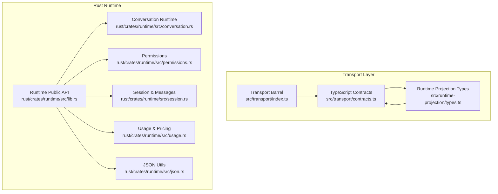
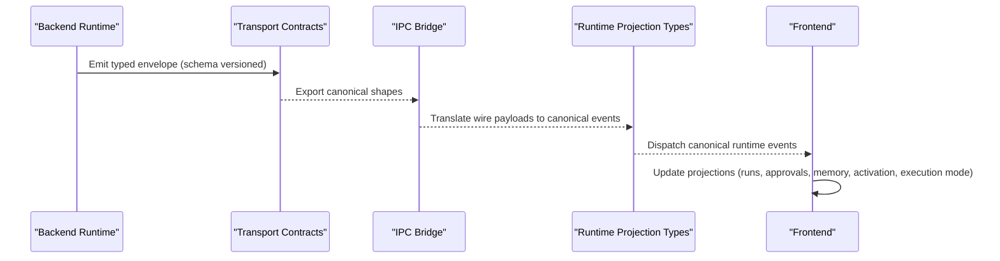
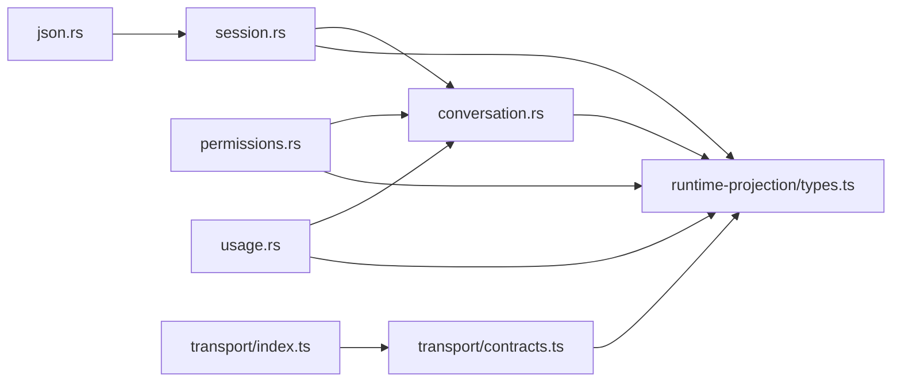

# Contract Definitions

<cite>
**Referenced Files in This Document**
- [contracts.ts](file://src/transport/contracts.ts)
- [index.ts](file://src/transport/index.ts)
- [types.ts](file://src/runtime-projection/types.ts)
- [lib.rs](file://rust/crates/runtime/src/lib.rs)
- [conversation.rs](file://rust/crates/runtime/src/conversation.rs)
- [permissions.rs](file://rust/crates/runtime/src/permissions.rs)
- [session.rs](file://rust/crates/runtime/src/session.rs)
- [usage.rs](file://rust/crates/runtime/src/usage.rs)
- [json.rs](file://rust/crates/runtime/src/json.rs)
</cite>

## Table of Contents
1. [Introduction](#introduction)
2. [Project Structure](#project-structure)
3. [Core Components](#core-components)
4. [Architecture Overview](#architecture-overview)
5. [Detailed Component Analysis](#detailed-component-analysis)
6. [Dependency Analysis](#dependency-analysis)
7. [Performance Considerations](#performance-considerations)
8. [Troubleshooting Guide](#troubleshooting-guide)
9. [Conclusion](#conclusion)

## Introduction
This document specifies the canonical runtime contract definitions that govern how the frontend consumes and interprets runtime events and decisions. It covers:
- Common envelope and correlation contracts
- Activation contracts (status, license, lifecycle actions)
- Execution-mode contracts (decision taxonomy, risk/complexity buckets, scenario profiles)
- Memory contracts (kinds, scopes, write decisions, lifecycle events)
- Parameter validation and response schemas
- Enforcement mechanisms and error handling patterns
- Integration points with runtime services and the transport boundary

The contracts are defined in two layers:
- Transport contracts: TypeScript canonical shapes and legacy wire DTOs
- Runtime contracts: Rust-side event envelopes and domain models

## Project Structure
The runtime contracts span the transport boundary and the Rust runtime:
- Transport contracts define the canonical wire shapes and legacy compatibility DTOs
- Runtime contracts define the Rust-side event envelopes and domain models
- Runtime-projection types define the frontend-facing canonical event/state shapes

**Diagram sources**
- [contracts.ts:1-539](file://src/transport/contracts.ts#L1-L539)
- [index.ts:1-10](file://src/transport/index.ts#L1-L10)
- [types.ts:1-454](file://src/runtime-projection/types.ts#L1-L454)
- [lib.rs:1-95](file://rust/crates/runtime/src/lib.rs#L1-L95)
- [conversation.rs:1-866](file://rust/crates/runtime/src/conversation.rs#L1-L866)
- [permissions.rs:1-233](file://rust/crates/runtime/src/permissions.rs#L1-L233)
- [session.rs:1-437](file://rust/crates/runtime/src/session.rs#L1-L437)
- [usage.rs:1-311](file://rust/crates/runtime/src/usage.rs#L1-L311)
- [json.rs:1-359](file://rust/crates/runtime/src/json.rs#L1-L359)

**Section sources**
- [contracts.ts:1-539](file://src/transport/contracts.ts#L1-L539)
- [index.ts:1-10](file://src/transport/index.ts#L1-L10)
- [types.ts:1-454](file://src/runtime-projection/types.ts#L1-L454)
- [lib.rs:1-95](file://rust/crates/runtime/src/lib.rs#L1-L95)

## Core Components
This section summarizes the canonical contract families and their roles.

- Common envelope
  - Runtime event type families and correlation identifiers
  - Envelope carries schema version, event type, payload family, emitted timestamp, and correlation IDs
- Activation contracts
  - Activation status kinds and failure reasons
  - License summary and activation snapshot
  - Activation lifecycle actions and timestamps
- Execution-mode contracts
  - Execution modes, risk/complexity levels, scenario profile hints
  - Classifier evidence and reason codes
- Memory contracts
  - Memory kinds, scopes, decision verdicts
  - Write decisions, lifecycle events, and after-turn batch envelopes
- Legacy wire DTOs
  - Compatibility shapes for agent-token, permission-request, memory_event channels
  - Context budget usage, recalled memory items, and stream token payloads

**Section sources**
- [contracts.ts:35-73](file://src/transport/contracts.ts#L35-L73)
- [contracts.ts:75-155](file://src/transport/contracts.ts#L75-L155)
- [contracts.ts:156-218](file://src/transport/contracts.ts#L156-L218)
- [contracts.ts:220-257](file://src/transport/contracts.ts#L220-L257)
- [contracts.ts:259-539](file://src/transport/contracts.ts#L259-L539)

## Architecture Overview
The runtime contracts define a strict separation between backend-generated envelopes and frontend projections:
- Backend emits typed envelopes with schema versioning and correlation IDs
- Transport layer exposes canonical TypeScript contracts and legacy DTOs
- Runtime-projection layer translates wire payloads into frontend-friendly event/state shapes
- Consumers (UI, harness, governance) subscribe to canonical events and maintain projections

**Diagram sources**
- [contracts.ts:35-73](file://src/transport/contracts.ts#L35-L73)
- [types.ts:46-62](file://src/runtime-projection/types.ts#L46-L62)
- [types.ts:287-436](file://src/runtime-projection/types.ts#L287-L436)

## Detailed Component Analysis

### Common Envelope and Correlation Contracts
- Event families: conversation, tool, permission, memory, activation, execution_mode, harness, system
- Correlation IDs: sessionId, projectId, runId, streamId, turnIndex
- Envelope fields: schemaVersion, eventType, payloadFamily, emittedAt, correlation, payload
- Schema version marker ensures backward compatibility and migration safety

Validation rules:
- All correlation IDs are optional; absent indicates “not applicable”
- Envelope must carry a valid schema version matching the backend’s contract version
- eventType must be one of the enumerated families
- payloadFamily is free-form per family and will narrow to typed enums in M1

Integration:
- Frontend consumes envelopes via the transport barrel export
- Runtime-projection translator reads envelopes and maps to canonical events

**Section sources**
- [contracts.ts:35-73](file://src/transport/contracts.ts#L35-L73)
- [index.ts:1-10](file://src/transport/index.ts#L1-L10)

### Activation Contracts
Activation status kinds enumerate the lifecycle states:
- checking_local, needs_activation, requesting_activation, pending_approval, redeeming, activated, offline_grace, expired, revoked, deactivated

Failure reasons:
- no_local_license_offline, server_expired, server_revoked, user_deactivated, refresh_transient, other

Activation license fields:
- licenseId, plan, issuedAt, expiresAt, lastRefreshedAt

Activation snapshot:
- status, license, allowsMainShell, correlation, capturedAt
- allowsMainShell is computed by backend; frontend must not recompute

Activation lifecycle actions:
- request, redeem, refresh, revoke_check, deactivate, local_boot_restore
- Action includes kind, payload, correlation, requestedAt

Enforcement:
- ActivationSnapshotEvent.kind is reserved for future backend emission
- Frontend must gate main shell access on allowsMainShell from the backend snapshot

**Section sources**
- [contracts.ts:75-155](file://src/transport/contracts.ts#L75-L155)

### Execution-Mode Contracts
Execution modes:
- direct_execute, auto_plan_execute, plan_then_confirm, specialized_surface

Risk and complexity levels:
- RiskLevel: low, medium, high
- ComplexityLevel: trivial, simple, moderate, complex

Scenario profile hints:
- chat, coding, research, planning, review (advisory; executionMode governs the run)

Classifier evidence:
- policyVersion, matchedRuleIds, slotSummary, ambiguousEscalated, escalationSource

Execution-mode decision:
- executionMode, riskLevel, complexityLevel, complexityScore (0.0..=1.0), reasonCodes
- routeHint (free-form string for specialized_surface)
- requiresPlan, scenarioProfileHint, classifier metadata
- Frontend must not recompute executionMode client-side

Enforcement:
- ExecutionModeDecisionEvent.kind is reserved for future backend emission
- Manual override is supported and stored separately; executionMode itself is immutable

**Section sources**
- [contracts.ts:156-218](file://src/transport/contracts.ts#L156-L218)

### Memory Contracts
Memory kinds:
- working, session_summary, episodic, pinned, compiled, reflection

Scopes:
- session, project, global

Decision verdicts:
- persisted, held_in_working, rejected, promoted, demoted, expired

Memory decision:
- memoryId, verdict, kind, scope, reasonCodes, score?, policyVersion, correlation, decidedAt

Legacy wire DTOs:
- MemoryEventPayload: event taxonomy, trace/session/project identifiers, policy decision, reason code/message, recall metadata
- MemoryContextItem: id, content, scope, relevance_score, stored_at
- MemoryAfterTurnPayload: traceVersion, caller, policyVersion, decidedAt, decisions[], quality, conflicts[]
- QualityGateResultPayload: accepted[], rejected[], warnings[], policyVersion
- ConflictResolutionPayload: outcome, reasonCodes, policyVersion
- MemoryWriteDecisionPayload: disposition, reasonCodes, objectKind, scope, evidenceId?, policyVersion, decidedAt

Enforcement:
- MemoryAfterTurnEvent fires even when decisions are empty to close audit gaps
- Frontend projections maintain rolling memory state and last-after-turn batch for governance

**Section sources**
- [contracts.ts:220-257](file://src/transport/contracts.ts#L220-L257)
- [contracts.ts:287-539](file://src/transport/contracts.ts#L287-L539)

### Permission Contracts
Permission modes:
- ReadOnly, WorkspaceWrite, DangerFullAccess, Prompt, Allow

Permission policy:
- authorize(tool_name, input, prompter?) returns Allow or Deny with reason
- Escalation rules apply for ReadOnly to WorkspaceWrite and WorkspaceWrite to DangerFullAccess
- Prompt mode defers to PermissionPrompter; missing prompter yields Deny with reason

Permission request/response:
- PermissionRequest: tool_name, input, current_mode, required_mode
- PermissionPromptDecision: Allow or Deny { reason }

Runtime integration:
- ConversationRuntime integrates permission policy and prompter during tool use
- Tool execution is gated by policy; hook feedback augments results

**Section sources**
- [permissions.rs:1-135](file://rust/crates/runtime/src/permissions.rs#L1-L135)
- [conversation.rs:264-316](file://rust/crates/runtime/src/conversation.rs#L264-L316)

### Session and Message Contracts
Session:
- version, messages: vector of ConversationMessage
- JSON serialization/deserialization with validation

ConversationMessage:
- role: System, User, Assistant, Tool
- blocks: Text, ToolUse, ToolResult
- usage: optional TokenUsage

ContentBlock variants:
- Text: text
- ToolUse: id, name, input
- ToolResult: tool_use_id, tool_name, output, is_error

TokenUsage:
- input_tokens, output_tokens, cache_creation_input_tokens, cache_read_input_tokens

UsageTracker:
- cumulative usage, latest turn usage, turn count
- reconstructs from session messages

**Section sources**
- [session.rs:1-140](file://rust/crates/runtime/src/session.rs#L1-L140)
- [session.rs:148-252](file://rust/crates/runtime/src/session.rs#L148-L252)
- [session.rs:255-329](file://rust/crates/runtime/src/session.rs#L255-L329)
- [usage.rs:29-210](file://rust/crates/runtime/src/usage.rs#L29-L210)

### JSON Utilities
JsonValue and JsonError:
- Enumerated JSON representation with parsing and rendering
- Parsing enforces strictness and validates structure
- Rendering escapes control characters and quotes

Used by session serialization and other runtime components.

**Section sources**
- [json.rs:4-113](file://rust/crates/runtime/src/json.rs#L4-L113)
- [json.rs:146-329](file://rust/crates/runtime/src/json.rs#L146-L329)

### Runtime Projection Types (Frontend Canonical Shapes)
CanonicalRuntimeEvent discriminated union:
- StreamTextDeltaEvent, StreamThinkingStartEvent, StreamThinkingDeltaEvent
- StreamToolCallUpdateEvent, StreamFinalTextOverrideEvent
- StreamCompleteEvent, StreamErrorEvent
- PermissionRequestEvent, PermissionResolvedEvent
- MemoryLifecycleEvent, MemoryWriteDecisionEvent, MemoryAfterTurnEvent
- ActivationSnapshotEvent (placeholder), ExecutionModeDecisionEvent (placeholder), ExecutionModeManualOverrideEvent

RunProjection:
- runId, text, thinking, thinkingStarted, status, taskOutcome, degradedReason, resumeAvailable, resumeCursor
- toolCalls indexed by toolCallId, last-write wins
- contextBudgetUsage, memoryItems, lastUpdatedAt

MemoryRollingProjection:
- recentEvents, lastRecallItems, writeDecisions ring, lastAfterTurn batch

ExecutionModeProjection:
- executionMode, riskLevel, complexityLevel, reasonCodes, matchedRules, manualOverride
- policyVersion, capturedAt, lastUpdatedAt

Enforcement:
- Frontend must not mutate executionMode; manual override is stored separately
- ActivationProjection remains null until backend emits snapshot

**Section sources**
- [types.ts:46-62](file://src/runtime-projection/types.ts#L46-L62)
- [types.ts:287-436](file://src/runtime-projection/types.ts#L287-L436)

## Dependency Analysis
The contracts form a layered dependency graph:
- Transport contracts depend on Rust runtime event shapes for envelopes and legacy DTOs
- Runtime-projection types depend on transport contracts for wire shapes
- Rust runtime modules depend on JSON utilities for serialization and usage for token accounting

**Diagram sources**
- [json.rs:1-359](file://rust/crates/runtime/src/json.rs#L1-L359)
- [session.rs:1-437](file://rust/crates/runtime/src/session.rs#L1-L437)
- [conversation.rs:1-866](file://rust/crates/runtime/src/conversation.rs#L1-L866)
- [permissions.rs:1-233](file://rust/crates/runtime/src/permissions.rs#L1-L233)
- [usage.rs:1-311](file://rust/crates/runtime/src/usage.rs#L1-L311)
- [types.ts:1-454](file://src/runtime-projection/types.ts#L1-L454)
- [contracts.ts:1-539](file://src/transport/contracts.ts#L1-L539)
- [index.ts:1-10](file://src/transport/index.ts#L1-L10)

**Section sources**
- [lib.rs:1-95](file://rust/crates/runtime/src/lib.rs#L1-L95)

## Performance Considerations
- Token usage tracking: cumulative and latest turn usage enable budget-aware runtime decisions
- Session compaction: runtime can compact sessions to reduce token estimates and improve throughput
- Streaming events: delta concatenation minimizes DOM updates; tool-call projections last-write wins reduce churn
- Cost estimation: model-specific pricing improves accuracy; fallback defaults ensure continuity

Recommendations:
- Monitor contextBudgetUsage to prevent token budget overruns
- Use compaction thresholds to balance memory footprint and retrieval quality
- Cache and reuse permission decisions per session to avoid redundant prompts

[No sources needed since this section provides general guidance]

## Troubleshooting Guide
Common validation and error patterns:
- Session deserialization errors: missing fields, invalid types, out-of-range values
- Runtime errors: API errors, tool errors, permission denied, session errors, config errors, max iterations exceeded
- JSON parsing errors: unexpected characters, unterminated strings, invalid numbers, trailing content
- Permission denials: insufficient escalation, missing prompter for prompt mode, explicit deny reason

Mitigations:
- Validate envelopes against schemaVersion before processing
- Ensure correlation IDs are propagated consistently across events
- Gate UI actions on activation allowsMainShell and execution-mode decision
- Log and surface policy decisions and reason codes for transparency

**Section sources**
- [session.rs:52-82](file://rust/crates/runtime/src/session.rs#L52-L82)
- [conversation.rs:61-112](file://rust/crates/runtime/src/conversation.rs#L61-L112)
- [json.rs:15-35](file://rust/crates/runtime/src/json.rs#L15-L35)
- [permissions.rs:127-134](file://rust/crates/runtime/src/permissions.rs#L127-L134)

## Conclusion
The runtime contract definitions establish a robust, versioned, and transparent interface between the backend runtime and the frontend. By adhering to the canonical envelopes, activation and execution-mode decisions, and memory lifecycle contracts, applications can enforce policy, maintain auditability, and provide explainable UX. The transport and projection layers ensure compatibility and forward evolution without breaking changes.

[No sources needed since this section summarizes without analyzing specific files]