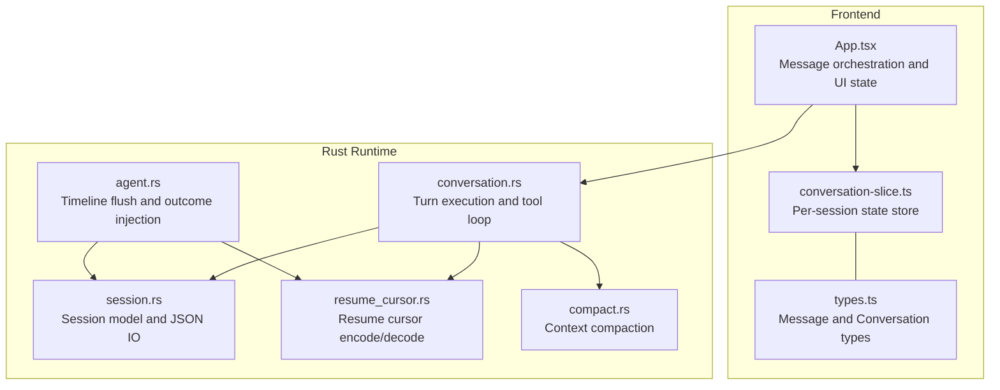
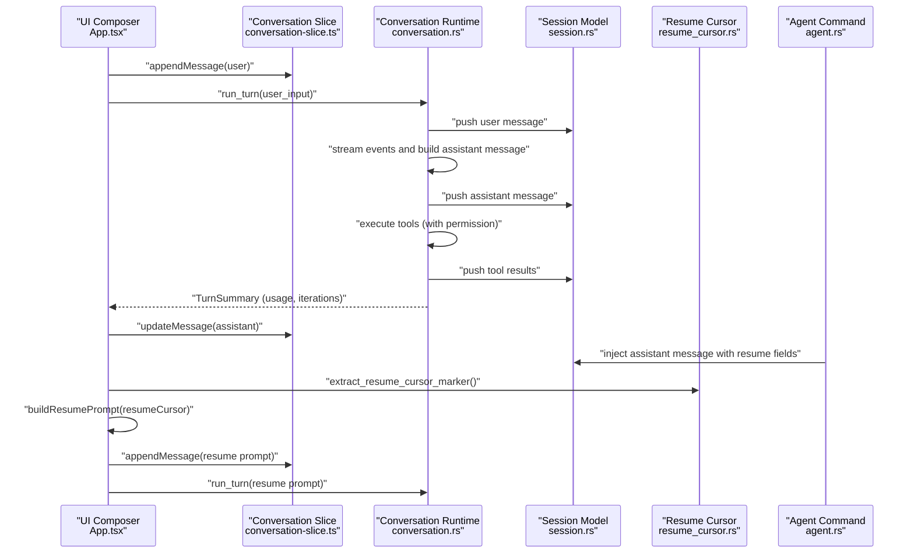
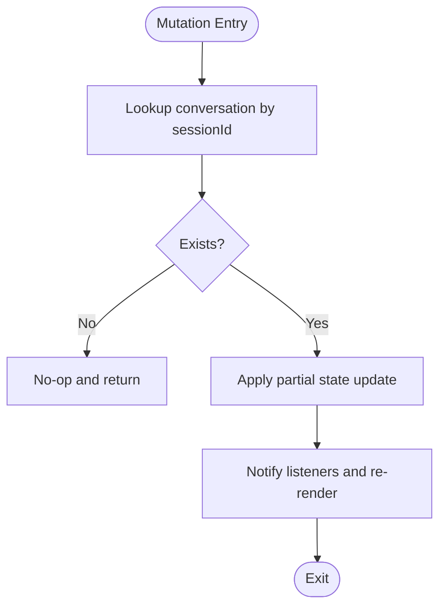
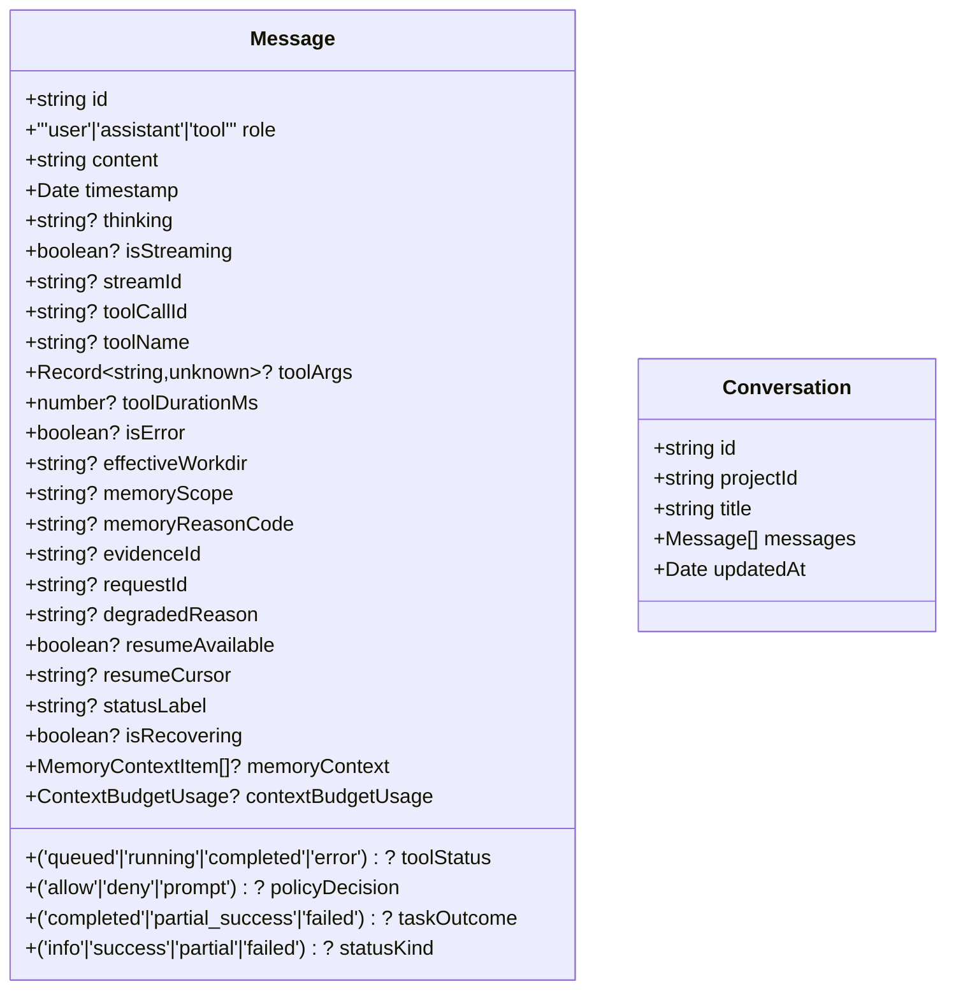
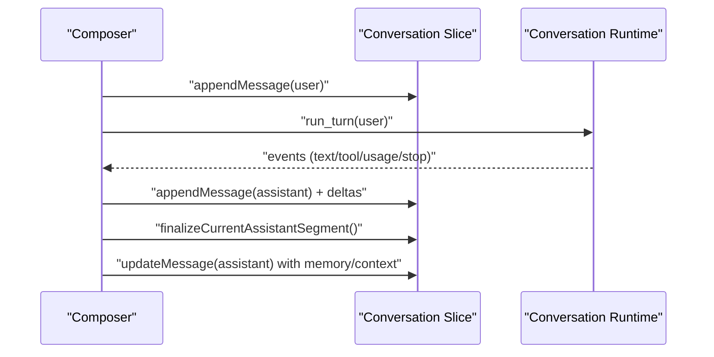
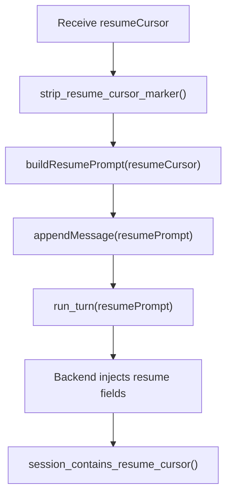
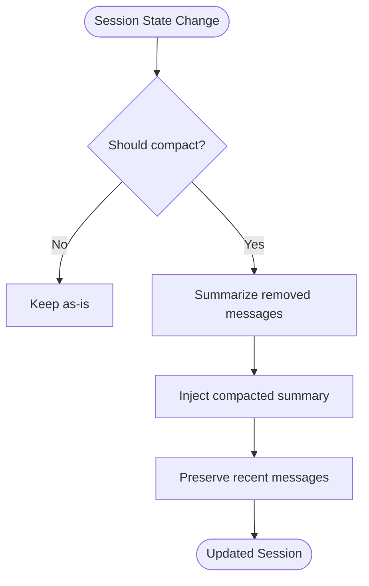
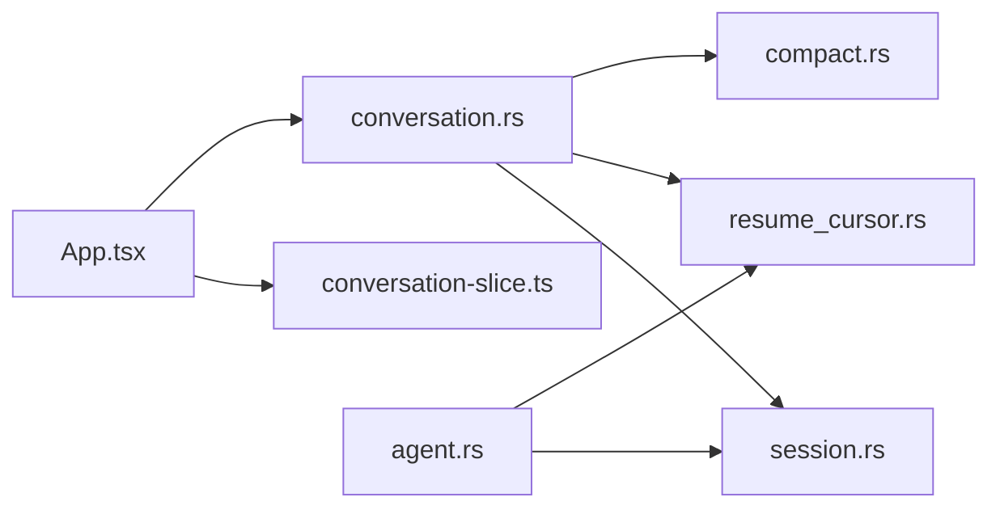

# Conversation Management

<cite>
**Referenced Files in This Document**
- [conversation-slice.ts](file://src/stores/conversation-slice.ts)
- [types.ts](file://src/modules/chat/types.ts)
- [App.tsx](file://src/App.tsx)
- [conversation.rs](file://rust/crates/runtime/src/conversation.rs)
- [session.rs](file://rust/crates/runtime/src/session.rs)
- [resume_cursor.rs](file://src-tauri/src/modules/runtime/resume_cursor.rs)
- [agent.rs](file://src-tauri/src/commands/agent.rs)
- [compact.rs](file://rust/crates/runtime/src/compact.rs)
</cite>

## Table of Contents
1. [Introduction](#introduction)
2. [Project Structure](#project-structure)
3. [Core Components](#core-components)
4. [Architecture Overview](#architecture-overview)
5. [Detailed Component Analysis](#detailed-component-analysis)
6. [Dependency Analysis](#dependency-analysis)
7. [Performance Considerations](#performance-considerations)
8. [Troubleshooting Guide](#troubleshooting-guide)
9. [Conclusion](#conclusion)

## Introduction
This document explains the conversation management system across the frontend and Rust runtime. It covers how conversation state is tracked, how message history is maintained, and how the conversation lifecycle operates. It also documents the resume cursor mechanism for resuming interrupted turns, state persistence, context preservation, message threading, and cleanup processes. Examples illustrate initialization, cursor management, and state handling.

## Project Structure
The conversation system spans three layers:
- Frontend store: manages per-session conversation state, message updates, and UI-related metadata.
- Chat orchestration: constructs messages, streams assistant deltas, and integrates with backend APIs.
- Rust runtime: executes turns, manages tool use, tracks usage, and persists sessions.

**Diagram sources**
- [conversation-slice.ts:1-248](file://src/stores/conversation-slice.ts#L1-L248)
- [types.ts:1-147](file://src/modules/chat/types.ts#L1-L147)
- [App.tsx:1312-1499](file://src/App.tsx#L1312-L1499)
- [conversation.rs:121-351](file://rust/crates/runtime/src/conversation.rs#L121-L351)
- [session.rs:47-146](file://rust/crates/runtime/src/session.rs#L47-L146)
- [resume_cursor.rs:1-96](file://src-tauri/src/modules/runtime/resume_cursor.rs#L1-L96)
- [agent.rs:2048-2069](file://src-tauri/src/commands/agent.rs#L2048-L2069)
- [compact.rs:88-113](file://rust/crates/runtime/src/compact.rs#L88-L113)

**Section sources**
- [conversation-slice.ts:1-248](file://src/stores/conversation-slice.ts#L1-L248)
- [types.ts:1-147](file://src/modules/chat/types.ts#L1-L147)
- [App.tsx:1312-1499](file://src/App.tsx#L1312-L1499)
- [conversation.rs:121-351](file://rust/crates/runtime/src/conversation.rs#L121-L351)
- [session.rs:47-146](file://rust/crates/runtime/src/session.rs#L47-L146)
- [resume_cursor.rs:1-96](file://src-tauri/src/modules/runtime/resume_cursor.rs#L1-L96)
- [agent.rs:2048-2069](file://src-tauri/src/commands/agent.rs#L2048-L2069)
- [compact.rs:88-113](file://rust/crates/runtime/src/compact.rs#L88-L113)

## Core Components
- Conversation slice: a React external store that holds per-session conversations, loading flags, todos, title states, and stream abort handles. It exposes mutation functions for appending/updating messages, clearing messages, removing sessions, managing loading and todos, title state transitions, and stream abort handles.
- Message and conversation types: define the shape of messages (roles, content, tool calls, memory context, resume fields) and conversations (id, project, title, messages, timestamps).
- Conversation runtime: orchestrates a turn by building requests, streaming assistant events, parsing content blocks, executing tools with permission checks, and recording usage. It supports compaction and token budget enforcement.
- Session model: serializable conversation state with message arrays and JSON roundtrip support.
- Resume cursor: encodes a resume token with stream identity, tool loop iteration, and token count; provides parsing and detection helpers.
- Timeline flush and outcome injection: injects assistant messages with resume availability and cursor into the session timeline.

**Section sources**
- [conversation-slice.ts:19-31](file://src/stores/conversation-slice.ts#L19-L31)
- [types.ts:21-82](file://src/modules/chat/types.ts#L21-L82)
- [conversation.rs:121-351](file://rust/crates/runtime/src/conversation.rs#L121-L351)
- [session.rs:47-146](file://rust/crates/runtime/src/session.rs#L47-L146)
- [resume_cursor.rs:8-40](file://src-tauri/src/modules/runtime/resume_cursor.rs#L8-L40)
- [agent.rs:2048-2069](file://src-tauri/src/commands/agent.rs#L2048-L2069)

## Architecture Overview
The conversation lifecycle integrates frontend orchestration with Rust runtime execution and persistence.

**Diagram sources**
- [App.tsx:1312-1499](file://src/App.tsx#L1312-L1499)
- [conversation-slice.ts:79-111](file://src/stores/conversation-slice.ts#L79-L111)
- [conversation.rs:191-325](file://rust/crates/runtime/src/conversation.rs#L191-L325)
- [session.rs:47-146](file://rust/crates/runtime/src/session.rs#L47-L146)
- [resume_cursor.rs:80-95](file://src-tauri/src/modules/runtime/resume_cursor.rs#L80-L95)
- [agent.rs:2048-2069](file://src-tauri/src/commands/agent.rs#L2048-L2069)

## Detailed Component Analysis

### Conversation State Tracking (Frontend)
- Per-session conversation storage keyed by session ID.
- Loading flags, per-session todos, title stage tracking, and stream abort handles are maintained separately for clean separation of concerns.
- Mutation functions:
  - Upsert conversation
  - Append message and update message by ID
  - Clear messages and remove session (including associated metadata)
  - Toggle loading, set todos, initialize and advance title stages, increment auto-rename counter
  - Register and clear stream abort handles

**Diagram sources**
- [conversation-slice.ts:79-111](file://src/stores/conversation-slice.ts#L79-L111)

**Section sources**
- [conversation-slice.ts:19-31](file://src/stores/conversation-slice.ts#L19-L31)
- [conversation-slice.ts:69-156](file://src/stores/conversation-slice.ts#L69-L156)
- [conversation-slice.ts:167-228](file://src/stores/conversation-slice.ts#L167-L228)

### Message History Management and Threading
- Messages are typed with roles (user, assistant, tool) and content blocks (text, tool_use, tool_result).
- Assistant messages can contain interleaved text and tool_use blocks; tool results are appended as tool role messages.
- The frontend composes initial user messages and synthesizes assistant messages with streaming deltas, then finalizes them.

**Diagram sources**
- [types.ts:21-82](file://src/modules/chat/types.ts#L21-L82)

**Section sources**
- [types.ts:21-82](file://src/modules/chat/types.ts#L21-L82)

### Conversation Lifecycle Orchestration (Frontend)
- Initialization: when no active session exists, a new session is created and a placeholder conversation is synthesized until the first assistant message arrives.
- Streaming: assistant messages are created lazily; deltas accumulate and are flushed at animation frames to minimize re-renders.
- Finalization: assistant segments are finalized when the stream stops; streaming flags and status labels are cleared.
- Auto-title: sessions are auto-renamed based on content and title stage transitions.

**Diagram sources**
- [App.tsx:1312-1499](file://src/App.tsx#L1312-L1499)
- [conversation-slice.ts:79-111](file://src/stores/conversation-slice.ts#L79-L111)

**Section sources**
- [App.tsx:1312-1499](file://src/App.tsx#L1312-L1499)
- [conversation-slice.ts:79-111](file://src/stores/conversation-slice.ts#L79-L111)

### Resume Cursor Functionality and Resumption
- Resume cursor encoding: a structured string containing stream identity, tool loop iteration, and token count.
- Extraction: frontend extracts the resume cursor from a special marker in user input and builds a resume prompt.
- Backend injection: agent command injects assistant messages with resume availability and cursor into the session timeline.
- Detection: runtime verifies if a given cursor matches a resume point in the session.

**Diagram sources**
- [resume_cursor.rs:15-55](file://src-tauri/src/modules/runtime/resume_cursor.rs#L15-L55)
- [App.tsx:1312-1314](file://src/App.tsx#L1312-L1314)
- [agent.rs:2048-2069](file://src-tauri/src/commands/agent.rs#L2048-L2069)

**Section sources**
- [resume_cursor.rs:15-55](file://src-tauri/src/modules/runtime/resume_cursor.rs#L15-L55)
- [App.tsx:1312-1314](file://src/App.tsx#L1312-L1314)
- [agent.rs:2048-2069](file://src-tauri/src/commands/agent.rs#L2048-L2069)

### Conversation Context Preservation and Cleanup
- Context preservation: the runtime can compact older messages into a summary while preserving recent context, optionally suppressing follow-up questions to encourage direct resume.
- Cleanup: removing a session clears conversation state and associated metadata (loading flags, todos, title states, abort handles).

**Diagram sources**
- [compact.rs:88-113](file://rust/crates/runtime/src/compact.rs#L88-L113)
- [conversation-slice.ts:127-156](file://src/stores/conversation-slice.ts#L127-L156)

**Section sources**
- [compact.rs:88-113](file://rust/crates/runtime/src/compact.rs#L88-L113)
- [conversation-slice.ts:127-156](file://src/stores/conversation-slice.ts#L127-L156)

### Example Scenarios

#### Conversation Initialization
- If no active session exists, a new session is created and a placeholder conversation is synthesized until the first assistant message arrives. The UI composes a user message and initializes streaming.

**Section sources**
- [App.tsx:1327-1355](file://src/App.tsx#L1327-L1355)

#### Cursor Management
- Extract resume cursor from a message with a special marker and build a resume prompt that instructs the model to continue from the cursor without repeating confirmed side effects.

**Section sources**
- [App.tsx:1312-1314](file://src/App.tsx#L1312-L1314)
- [resume_cursor.rs:80-95](file://src-tauri/src/modules/runtime/resume_cursor.rs#L80-L95)

#### Conversation State Handling
- Append user messages, create and finalize assistant segments, update messages with memory context and resume fields, and manage loading flags and todos.

**Section sources**
- [conversation-slice.ts:79-111](file://src/stores/conversation-slice.ts#L79-L111)
- [App.tsx:1381-1499](file://src/App.tsx#L1381-L1499)

## Dependency Analysis
The frontend depends on the Rust runtime for execution and on the session model for persistence. The resume cursor logic bridges frontend and backend outcomes.

**Diagram sources**
- [App.tsx:1312-1499](file://src/App.tsx#L1312-L1499)
- [conversation-slice.ts:1-248](file://src/stores/conversation-slice.ts#L1-L248)
- [conversation.rs:121-351](file://rust/crates/runtime/src/conversation.rs#L121-L351)
- [session.rs:47-146](file://rust/crates/runtime/src/session.rs#L47-L146)
- [resume_cursor.rs:1-96](file://src-tauri/src/modules/runtime/resume_cursor.rs#L1-L96)
- [agent.rs:2048-2069](file://src-tauri/src/commands/agent.rs#L2048-L2069)
- [compact.rs:88-113](file://rust/crates/runtime/src/compact.rs#L88-L113)

**Section sources**
- [App.tsx:1312-1499](file://src/App.tsx#L1312-L1499)
- [conversation-slice.ts:1-248](file://src/stores/conversation-slice.ts#L1-L248)
- [conversation.rs:121-351](file://rust/crates/runtime/src/conversation.rs#L121-L351)
- [session.rs:47-146](file://rust/crates/runtime/src/session.rs#L47-L146)
- [resume_cursor.rs:1-96](file://src-tauri/src/modules/runtime/resume_cursor.rs#L1-L96)
- [agent.rs:2048-2069](file://src-tauri/src/commands/agent.rs#L2048-L2069)
- [compact.rs:88-113](file://rust/crates/runtime/src/compact.rs#L88-L113)

## Performance Considerations
- Streaming deltas are batched using animation frames to reduce re-renders during long assistant responses.
- Token budget enforcement prevents excessive memory growth; compaction reduces context size when thresholds are exceeded.
- JSON serialization/deserialization of sessions is straightforward and efficient for typical conversation sizes.

## Troubleshooting Guide
- Resume cursor mismatch: ensure the extracted cursor matches a resume point in the session timeline; otherwise, the runtime will not recognize a valid resume location.
- Empty assistant stream: the runtime expects a stop event; absence leads to an error indicating the stream did not finish properly.
- Unknown tool: attempting to execute an unregistered tool results in an error; verify tool registration and permissions.
- Session not found: updating or appending messages requires an existing conversation; create a session first if none exists.

**Section sources**
- [resume_cursor.rs:42-55](file://src-tauri/src/modules/runtime/resume_cursor.rs#L42-L55)
- [conversation.rs:377-386](file://rust/crates/runtime/src/conversation.rs#L377-L386)
- [conversation.rs:452-458](file://rust/crates/runtime/src/conversation.rs#L452-L458)
- [App.tsx:1327-1355](file://src/App.tsx#L1327-L1355)

## Conclusion
The conversation management system combines a reactive frontend store with a robust Rust runtime to deliver reliable conversation state tracking, message threading, and resumable turns. The resume cursor mechanism enables safe continuation of interrupted tasks, while compaction and persistence help maintain performance and context integrity across long sessions.