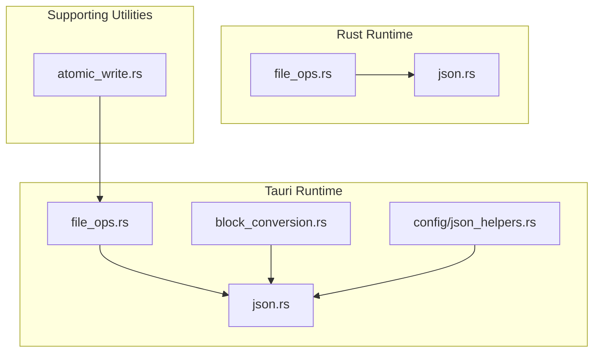
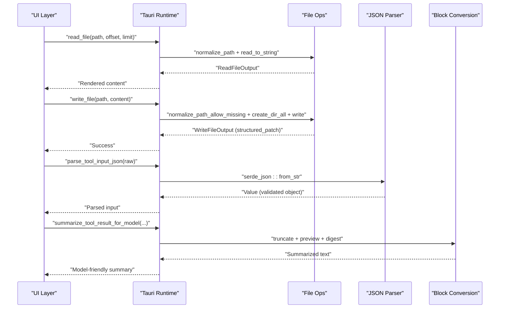
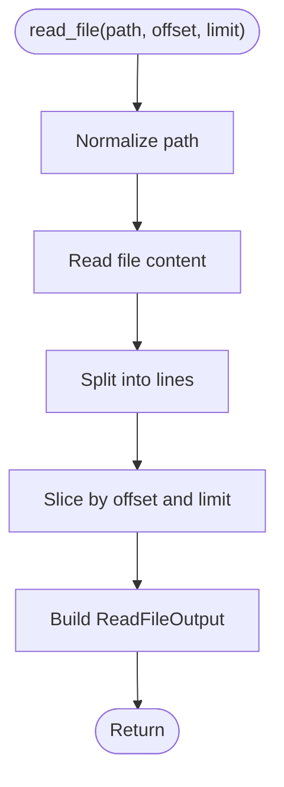
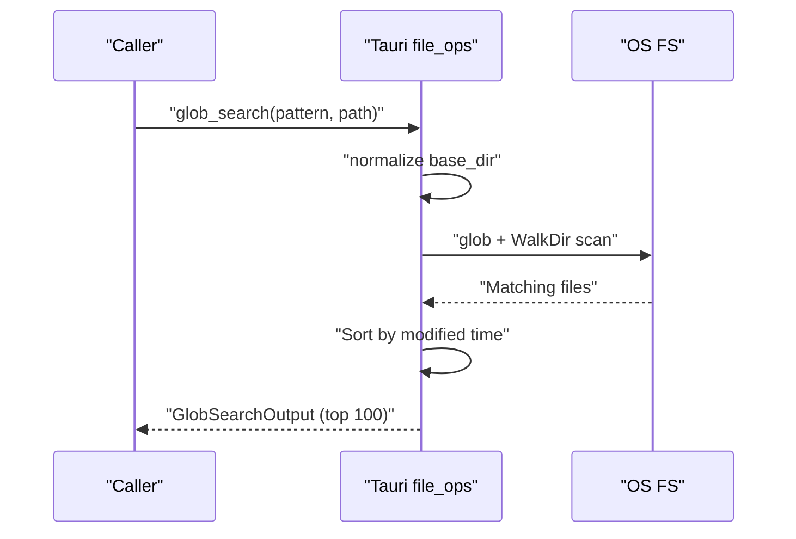
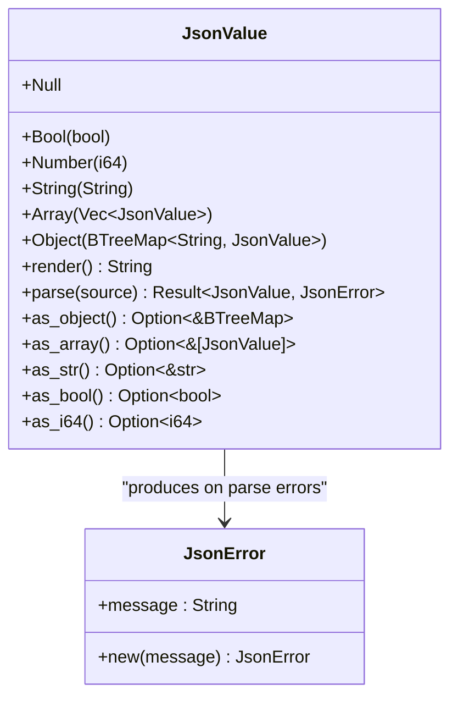
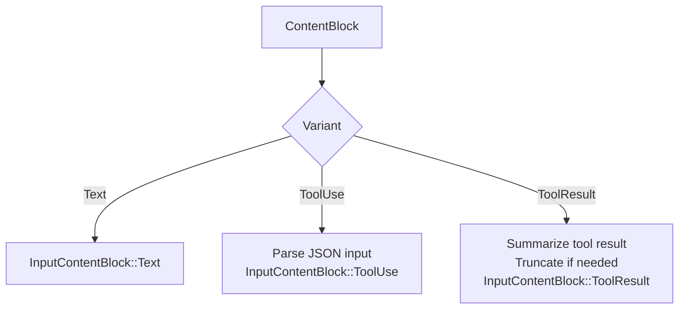
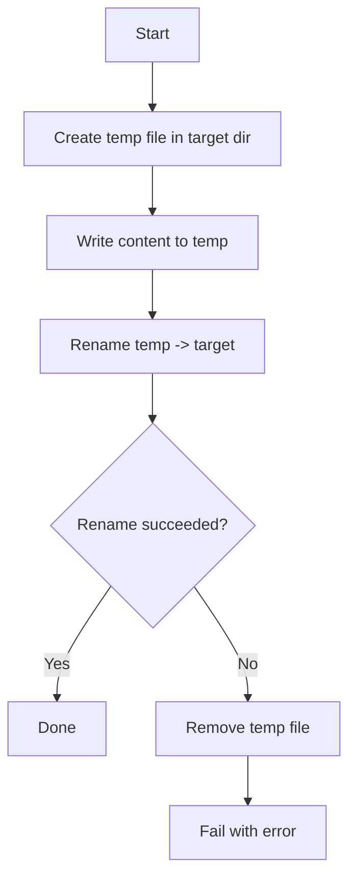
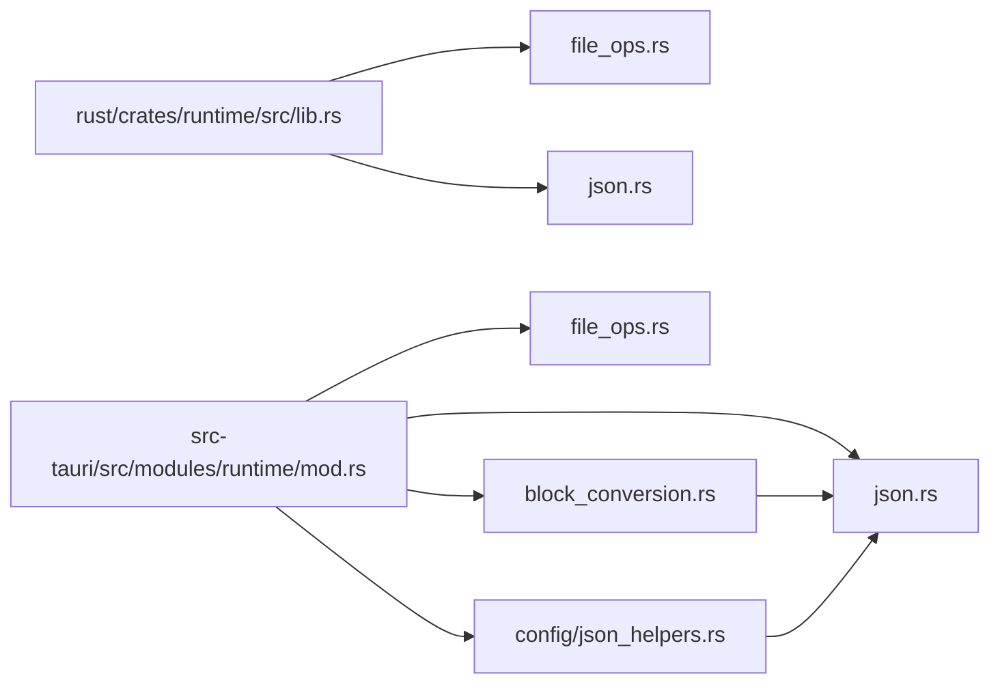

# File Operations

<cite>
**Referenced Files in This Document**
- [file_ops.rs](file://rust/crates/runtime/src/file_ops.rs)
- [json.rs](file://rust/crates/runtime/src/json.rs)
- [file_ops.rs](file://src-tauri/src/modules/runtime/file_ops.rs)
- [json.rs](file://src-tauri/src/modules/runtime/json.rs)
- [block_conversion.rs](file://src-tauri/src/modules/runtime/block_conversion.rs)
- [atomic_write.rs](file://src-tauri/src/modules/skills/manager/atomic_write.rs)
- [lib.rs](file://rust/crates/runtime/src/lib.rs)
- [mod.rs](file://src-tauri/src/modules/runtime/mod.rs)
- [json_helpers.rs](file://src-tauri/src/modules/runtime/config/json_helpers.rs)
</cite>

## Table of Contents
1. [Introduction](#introduction)
2. [Project Structure](#project-structure)
3. [Core Components](#core-components)
4. [Architecture Overview](#architecture-overview)
5. [Detailed Component Analysis](#detailed-component-analysis)
6. [Dependency Analysis](#dependency-analysis)
7. [Performance Considerations](#performance-considerations)
8. [Troubleshooting Guide](#troubleshooting-guide)
9. [Conclusion](#conclusion)

## Introduction
This document explains the file operations subsystem, focusing on file I/O handling, JSON processing utilities, and block conversion mechanisms. It covers:
- Safe file read/write/edit operations and search utilities
- JSON serialization/deserialization and runtime JSON model
- Block conversion patterns for tool results and content blocks
- Safety measures, temporary file management, and data transformation processes
- Practical workflows and examples for common tasks

## Project Structure
The file operations subsystem spans two layers:
- Rust crate runtime: core file operations and JSON utilities
- Tauri runtime module: mirror implementations plus block conversion and configuration JSON helpers

**Diagram sources**
- [file_ops.rs:1-551](file://rust/crates/runtime/src/file_ops.rs#L1-L551)
- [json.rs:1-359](file://rust/crates/runtime/src/json.rs#L1-L359)
- [file_ops.rs:1-553](file://src-tauri/src/modules/runtime/file_ops.rs#L1-L553)
- [json.rs:1-361](file://src-tauri/src/modules/runtime/json.rs#L1-L361)
- [block_conversion.rs:1-90](file://src-tauri/src/modules/runtime/block_conversion.rs#L1-L90)
- [json_helpers.rs:1-250](file://src-tauri/src/modules/runtime/config/json_helpers.rs#L1-L250)
- [atomic_write.rs:1-267](file://src-tauri/src/modules/skills/manager/atomic_write.rs#L1-L267)

**Section sources**
- [lib.rs:37-41](file://rust/crates/runtime/src/lib.rs#L37-L41)
- [mod.rs:14-16](file://src-tauri/src/modules/runtime/mod.rs#L14-L16)

## Core Components
- File operations (Rust): read_file, write_file, edit_file, glob_search, grep_search, patch generation
- File operations (Tauri): equivalent APIs mirroring Rust runtime
- JSON utilities (Rust/Tauri): JsonValue AST, parser, renderer, and helpers
- Block conversion: tool input parsing, tool result summarization, truncation, and content block translation
- Safety utilities: atomic write using temp file + rename pattern

Key responsibilities:
- Normalize and validate paths, enforce safe directory traversal
- Provide structured diffs for edits and writes
- Support glob and regex-based file search with limits and filters
- Render and parse JSON safely with robust error reporting
- Convert runtime content blocks to provider-facing blocks and summarize tool results

**Section sources**
- [file_ops.rs:132-178](file://rust/crates/runtime/src/file_ops.rs#L132-L178)
- [file_ops.rs:134-180](file://src-tauri/src/modules/runtime/file_ops.rs#L134-L180)
- [json.rs:6-115](file://rust/crates/runtime/src/json.rs#L6-L115)
- [json.rs:6-115](file://src-tauri/src/modules/runtime/json.rs#L6-L115)
- [block_conversion.rs:20-89](file://src-tauri/src/modules/runtime/block_conversion.rs#L20-L89)
- [atomic_write.rs:69-94](file://src-tauri/src/modules/skills/manager/atomic_write.rs#L69-L94)

## Architecture Overview
The subsystem integrates file I/O, JSON processing, and block conversion across layers. Rust runtime provides foundational operations; Tauri runtime exposes them to the UI and orchestrates higher-level transformations.

**Diagram sources**
- [file_ops.rs:134-180](file://src-tauri/src/modules/runtime/file_ops.rs#L134-L180)
- [json.rs:65-74](file://src-tauri/src/modules/runtime/json.rs#L65-L74)
- [block_conversion.rs:20-63](file://src-tauri/src/modules/runtime/block_conversion.rs#L20-L63)

## Detailed Component Analysis

### File I/O Handling (Rust Runtime)
- read_file: resolves absolute path, reads content, slices by offset/limit, counts lines
- write_file: creates parent directories, writes content, computes structured patch
- edit_file: validates differences, replaces globally or once, writes back, patches
- glob_search: expands patterns, sorts by modification time, caps results
- grep_search: regex search across files with filters, supports count/content modes, applies limits
- Path normalization: canonicalize or allow missing parents; fallback to join with current dir

Safety and correctness:
- Canonicalization prevents directory traversal
- Parent creation avoids race conditions
- Structured patch generation captures unified diff-like hunks
- Limits and offsets prevent unbounded memory usage

**Diagram sources**
- [file_ops.rs:132-156](file://rust/crates/runtime/src/file_ops.rs#L132-L156)

**Section sources**
- [file_ops.rs:132-178](file://rust/crates/runtime/src/file_ops.rs#L132-L178)
- [file_ops.rs:220-261](file://rust/crates/runtime/src/file_ops.rs#L220-L261)
- [file_ops.rs:263-370](file://rust/crates/runtime/src/file_ops.rs#L263-L370)
- [file_ops.rs:448-478](file://rust/crates/runtime/src/file_ops.rs#L448-L478)

### File I/O Handling (Tauri Runtime)
Mirrors Rust runtime with identical signatures and behaviors. Includes:
- read_file, write_file, edit_file
- glob_search, grep_search
- Path normalization and filtering
- Structured patch generation

**Diagram sources**
- [file_ops.rs:222-263](file://src-tauri/src/modules/runtime/file_ops.rs#L222-L263)

**Section sources**
- [file_ops.rs:134-180](file://src-tauri/src/modules/runtime/file_ops.rs#L134-L180)
- [file_ops.rs:222-263](file://src-tauri/src/modules/runtime/file_ops.rs#L222-L263)
- [file_ops.rs:265-372](file://src-tauri/src/modules/runtime/file_ops.rs#L265-L372)
- [file_ops.rs:450-480](file://src-tauri/src/modules/runtime/file_ops.rs#L450-L480)

### JSON Processing Utilities (Rust)
- JsonValue: in-memory representation supporting null, bool, number, string, array, object
- Parser: recursive descent parser with strict validation and error messages
- Renderer: escapes control characters and produces compact JSON
- Helper traits: as_object/as_array/as_str/as_bool/as_i64 for safe casting

**Diagram sources**
- [json.rs:4-115](file://rust/crates/runtime/src/json.rs#L4-L115)

**Section sources**
- [json.rs:6-115](file://rust/crates/runtime/src/json.rs#L6-L115)
- [json.rs:146-331](file://rust/crates/runtime/src/json.rs#L146-L331)

### JSON Processing Utilities (Tauri)
Same model and parser as Rust runtime, used for configuration and tool input parsing.

**Section sources**
- [json.rs:6-115](file://src-tauri/src/modules/runtime/json.rs#L6-L115)
- [json.rs:148-331](file://src-tauri/src/modules/runtime/json.rs#L148-L331)

### Configuration JSON Helpers (Tauri)
Provides typed extraction helpers for runtime configuration:
- Expect/optional getters for strings, booleans, integers
- String arrays and string maps
- Boolean maps
- Deep merge for objects
- Unique collection helpers

These are used to parse settings.json and project.json safely.

**Section sources**
- [json_helpers.rs:12-250](file://src-tauri/src/modules/runtime/config/json_helpers.rs#L12-L250)

### Block Conversion Mechanisms
Converts runtime ContentBlocks to provider-facing InputContentBlocks and summarizes tool results for model consumption:
- parse_tool_input_json: validates and parses tool input JSON
- truncate_tool_result_for_model: caps length and annotates truncation
- summarize_tool_result_for_model: builds a compact summary with preview, digest, and status
- runtime_block_to_input_block: translates ContentBlock variants to InputContentBlock

**Diagram sources**
- [block_conversion.rs:65-89](file://src-tauri/src/modules/runtime/block_conversion.rs#L65-L89)

**Section sources**
- [block_conversion.rs:20-89](file://src-tauri/src/modules/runtime/block_conversion.rs#L20-L89)

### Temporary File Management and Safety
Atomic write pattern using a temporary file followed by an atomic rename:
- Creates a temp file in the same directory as the target
- Writes content and flushes
- Renames temp to target (atomic on same filesystem)
- Cleans up temp file on failure

**Diagram sources**
- [atomic_write.rs:69-94](file://src-tauri/src/modules/skills/manager/atomic_write.rs#L69-L94)

**Section sources**
- [atomic_write.rs:1-267](file://src-tauri/src/modules/skills/manager/atomic_write.rs#L1-L267)

## Dependency Analysis
- Rust runtime exports file_ops and json re-exports for consumers
- Tauri runtime module re-exports file_ops and json for UI integration
- Block conversion depends on runtime session ContentBlock and API InputContentBlock
- JSON helpers depend on runtime JsonValue for config parsing

**Diagram sources**
- [lib.rs:37-41](file://rust/crates/runtime/src/lib.rs#L37-L41)
- [mod.rs:14-16](file://src-tauri/src/modules/runtime/mod.rs#L14-L16)

**Section sources**
- [lib.rs:37-41](file://rust/crates/runtime/src/lib.rs#L37-L41)
- [mod.rs:14-16](file://src-tauri/src/modules/runtime/mod.rs#L14-L16)

## Performance Considerations
- Search limits: grep_search caps matches and offsets; glob_search truncates to 100 files
- Streaming reads: read_file slices lines; avoid reading entire large files when not needed
- Patch generation: make_patch concatenates lines; consider chunking for very large diffs
- JSON rendering: renderer preallocates capacity; avoid repeated small allocations
- Atomic writes: minimize disk churn by batching updates and using temp files

## Troubleshooting Guide
Common issues and resolutions:
- Invalid path or permission denied: ensure paths are normalized and canonicalized; verify directory permissions
- Unmatched glob patterns: confirm pattern syntax and base directory; check file existence
- JSON parse errors: validate input; use JsonError messages to pinpoint malformed segments
- Truncated results: adjust head_limit and offset; note applied_limit/applied_offset in grep output
- Atomic write failures: verify filesystem supports atomic rename; ensure sufficient disk space

**Section sources**
- [file_ops.rs:263-370](file://rust/crates/runtime/src/file_ops.rs#L263-L370)
- [json.rs:19-35](file://rust/crates/runtime/src/json.rs#L19-L35)
- [atomic_write.rs:69-94](file://src-tauri/src/modules/skills/manager/atomic_write.rs#L69-L94)

## Conclusion
The file operations subsystem provides robust, safe, and efficient file I/O, flexible JSON processing, and structured block conversion. It balances usability with safety through path normalization, atomic writes, and bounded search results, while offering clear APIs for both Rust and Tauri layers.