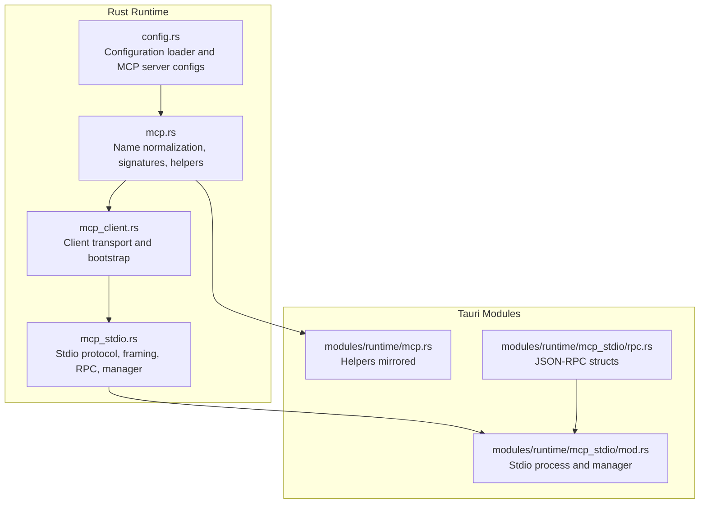
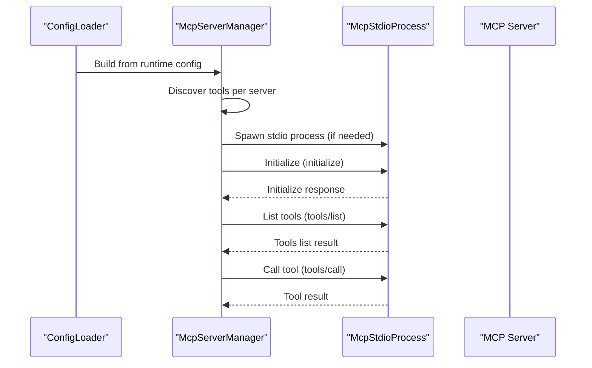
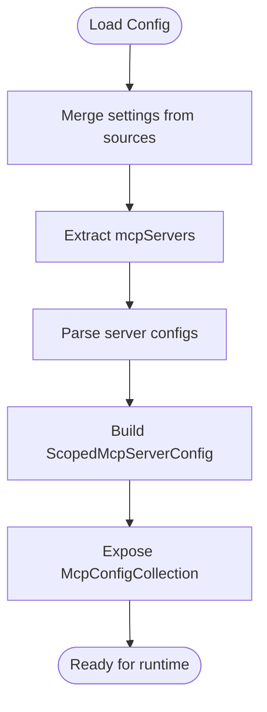
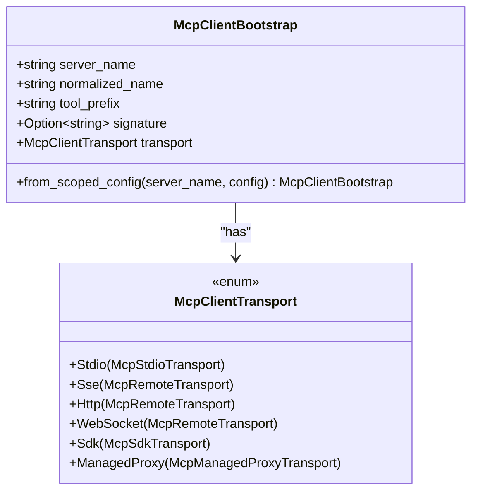
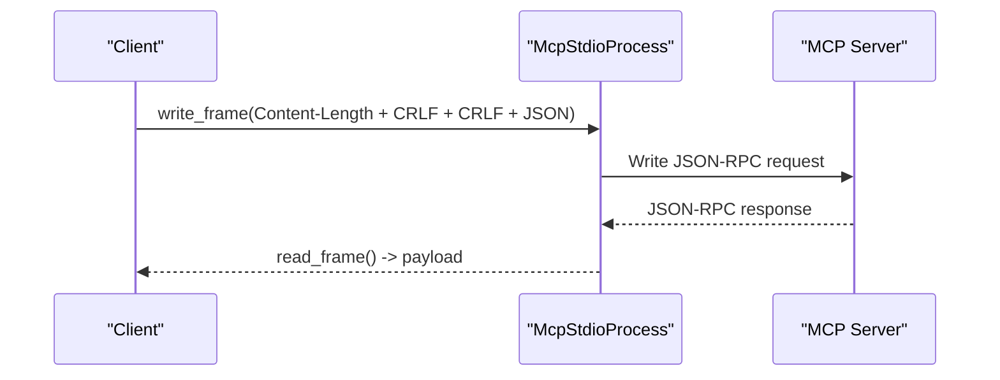
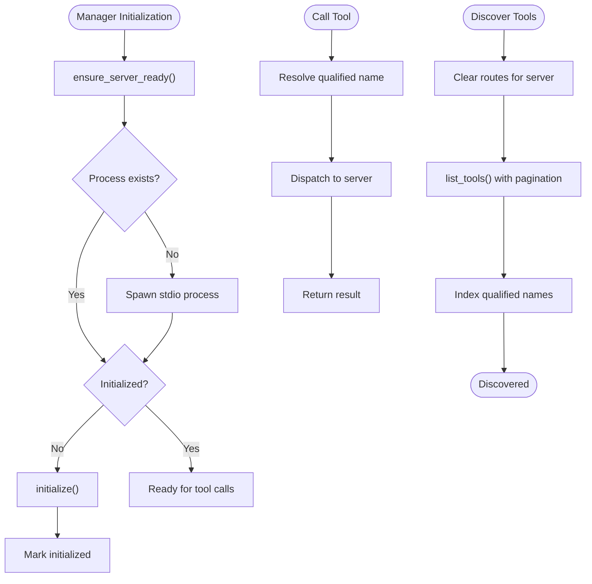
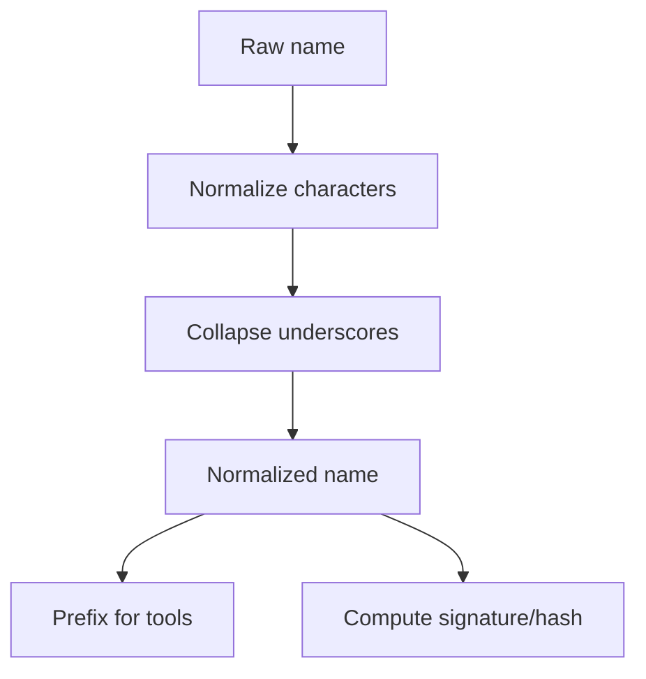
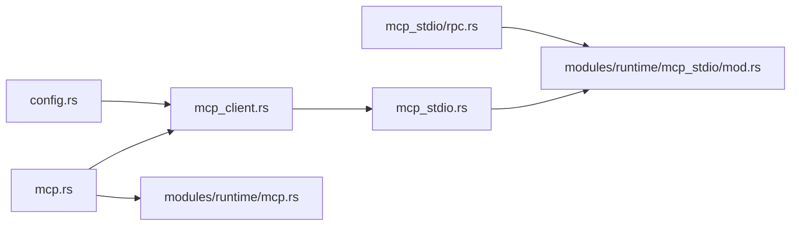

# MCP Integration

<cite>
**Referenced Files in This Document**
- [mcp.rs](file://rust/crates/runtime/src/mcp.rs)
- [mcp_client.rs](file://rust/crates/runtime/src/mcp_client.rs)
- [mcp_stdio.rs](file://rust/crates/runtime/src/mcp_stdio.rs)
- [config.rs](file://rust/crates/runtime/src/config.rs)
- [bootstrap.rs](file://rust/crates/runtime/src/bootstrap.rs)
- [mcp.rs](file://src-tauri/src/modules/runtime/mcp.rs)
- [mcp_stdio/mod.rs](file://src-tauri/src/modules/runtime/mcp_stdio/mod.rs)
- [mcp_stdio/rpc.rs](file://src-tauri/src/modules/runtime/mcp_stdio/rpc.rs)
</cite>

## Table of Contents
1. [Introduction](#introduction)
2. [Project Structure](#project-structure)
3. [Core Components](#core-components)
4. [Architecture Overview](#architecture-overview)
5. [Detailed Component Analysis](#detailed-component-analysis)
6. [Dependency Analysis](#dependency-analysis)
7. [Performance Considerations](#performance-considerations)
8. [Troubleshooting Guide](#troubleshooting-guide)
9. [Conclusion](#conclusion)

## Introduction
This document describes the Model Context Protocol (MCP) integration system in the project. It explains how the MCP client is implemented, how stdio communication is handled, and how protocol messages are processed. It also documents server discovery, client initialization, and message routing mechanisms. The stdio protocol implementation, message serialization, and error handling are covered, along with practical examples of MCP client setup, stdio communication, and protocol message handling.

## Project Structure
The MCP integration spans both Rust runtime components and Tauri modules:
- Rust runtime: configuration parsing, MCP client transport abstraction, stdio protocol handling, and server management
- Tauri modules: runtime module re-exports and stdio RPC primitives extracted into separate modules

**Diagram sources**
- [config.rs:1-1295](file://rust/crates/runtime/src/config.rs#L1-L1295)
- [mcp.rs:1-301](file://rust/crates/runtime/src/mcp.rs#L1-L301)
- [mcp_client.rs:1-235](file://rust/crates/runtime/src/mcp_client.rs#L1-L235)
- [mcp_stdio.rs:1-1721](file://rust/crates/runtime/src/mcp_stdio.rs#L1-L1721)
- [mcp.rs:1-303](file://src-tauri/src/modules/runtime/mcp.rs#L1-L303)
- [mcp_stdio/mod.rs:380-621](file://src-tauri/src/modules/runtime/mcp_stdio/mod.rs#L380-L621)
- [mcp_stdio/rpc.rs:1-55](file://src-tauri/src/modules/runtime/mcp_stdio/rpc.rs#L1-L55)

**Section sources**
- [config.rs:1-1295](file://rust/crates/runtime/src/config.rs#L1-L1295)
- [mcp.rs:1-301](file://rust/crates/runtime/src/mcp.rs#L1-L301)
- [mcp_client.rs:1-235](file://rust/crates/runtime/src/mcp_client.rs#L1-L235)
- [mcp_stdio.rs:1-1721](file://rust/crates/runtime/src/mcp_stdio.rs#L1-L1721)
- [mcp.rs:1-303](file://src-tauri/src/modules/runtime/mcp.rs#L1-L303)
- [mcp_stdio/mod.rs:380-621](file://src-tauri/src/modules/runtime/mcp_stdio/mod.rs#L380-L621)
- [mcp_stdio/rpc.rs:1-55](file://src-tauri/src/modules/runtime/mcp_stdio/rpc.rs#L1-L55)

## Core Components
- Configuration loader and MCP server configuration parsing
- MCP client transport abstraction and bootstrap
- Stdio protocol framing and JSON-RPC message handling
- MCP server manager for discovery, initialization, and tool routing
- Name normalization and signature computation for MCP servers

Key responsibilities:
- Parse and merge configuration from multiple sources
- Convert configuration into transport-specific client bootstraps
- Manage stdio processes, initialize servers, and route tool calls
- Provide stable signatures and normalized names for MCP tool qualification

**Section sources**
- [config.rs:64-492](file://rust/crates/runtime/src/config.rs#L64-L492)
- [mcp_client.rs:48-118](file://rust/crates/runtime/src/mcp_client.rs#L48-L118)
- [mcp.rs:65-120](file://rust/crates/runtime/src/mcp.rs#L65-L120)
- [mcp_stdio.rs:311-571](file://rust/crates/runtime/src/mcp_stdio.rs#L311-L571)

## Architecture Overview
The MCP integration follows a layered architecture:
- Configuration layer: discovers and merges MCP server configurations
- Transport layer: abstracts stdio, HTTP/SSE, WS, SDK, and managed proxy transports
- Protocol layer: stdio framing and JSON-RPC 2.0 message exchange
- Management layer: server lifecycle, tool discovery, and routing

**Diagram sources**
- [config.rs:226-259](file://rust/crates/runtime/src/config.rs#L226-L259)
- [mcp_stdio.rs:359-470](file://rust/crates/runtime/src/mcp_stdio.rs#L359-L470)
- [mcp_stdio.rs:580-766](file://rust/crates/runtime/src/mcp_stdio.rs#L580-L766)

## Detailed Component Analysis

### Configuration and Discovery
- The configuration loader merges settings from user, project, and local sources, extracting MCP server definitions
- Each server definition supports multiple transports (stdio, http/sse/ws, sdk, managed proxy)
- The runtime exposes a collection of MCP servers with transport metadata

**Diagram sources**
- [config.rs:196-259](file://rust/crates/runtime/src/config.rs#L196-L259)
- [config.rs:525-550](file://rust/crates/runtime/src/config.rs#L525-L550)
- [config.rs:700-735](file://rust/crates/runtime/src/config.rs#L700-L735)

**Section sources**
- [config.rs:196-259](file://rust/crates/runtime/src/config.rs#L196-L259)
- [config.rs:525-550](file://rust/crates/runtime/src/config.rs#L525-L550)
- [config.rs:700-735](file://rust/crates/runtime/src/config.rs#L700-L735)

### Client Transport Abstraction
- The client transport enum encapsulates stdio, HTTP/SSE, WS, SDK, and managed proxy transports
- A bootstrap object carries server name, normalized name, tool prefix, signature, and transport details
- Authentication support is included for HTTP/SSE variants via OAuth configuration

**Diagram sources**
- [mcp_client.rs:6-106](file://rust/crates/runtime/src/mcp_client.rs#L6-L106)
- [mcp_client.rs:48-67](file://rust/crates/runtime/src/mcp_client.rs#L48-L67)

**Section sources**
- [mcp_client.rs:6-106](file://rust/crates/runtime/src/mcp_client.rs#L6-L106)
- [mcp_client.rs:48-67](file://rust/crates/runtime/src/mcp_client.rs#L48-L67)

### Stdio Protocol Implementation
- Framing: Content-Length header followed by CRLF and payload
- JSON-RPC 2.0 requests and responses with untagged IDs
- Process spawning with environment injection
- Methods for initialize, tools/list, tools/call, resources/list, resources/read

**Diagram sources**
- [mcp_stdio.rs:640-675](file://rust/crates/runtime/src/mcp_stdio.rs#L640-L675)
- [mcp_stdio.rs:677-687](file://rust/crates/runtime/src/mcp_stdio.rs#L677-L687)
- [mcp_stdio/mod.rs:455-490](file://src-tauri/src/modules/runtime/mcp_stdio/mod.rs#L455-L490)
- [mcp_stdio/rpc.rs:10-55](file://src-tauri/src/modules/runtime/mcp_stdio/rpc.rs#L10-L55)

**Section sources**
- [mcp_stdio.rs:640-687](file://rust/crates/runtime/src/mcp_stdio.rs#L640-L687)
- [mcp_stdio/mod.rs:455-490](file://src-tauri/src/modules/runtime/mcp_stdio/mod.rs#L455-L490)
- [mcp_stdio/rpc.rs:10-55](file://src-tauri/src/modules/runtime/mcp_stdio/rpc.rs#L10-L55)

### Server Management and Routing
- The manager tracks servers, ensures readiness, initializes when needed, and routes tool calls
- Tool discovery aggregates tools across servers and builds a qualified name index
- Tool calls resolve qualified names to raw tool names and dispatch to the correct server

**Diagram sources**
- [mcp_stdio.rs:507-571](file://rust/crates/runtime/src/mcp_stdio.rs#L507-L571)
- [mcp_stdio.rs:359-431](file://rust/crates/runtime/src/mcp_stdio.rs#L359-L431)
- [mcp_stdio.rs:433-470](file://rust/crates/runtime/src/mcp_stdio.rs#L433-L470)

**Section sources**
- [mcp_stdio.rs:507-571](file://rust/crates/runtime/src/mcp_stdio.rs#L507-L571)
- [mcp_stdio.rs:359-470](file://rust/crates/runtime/src/mcp_stdio.rs#L359-L470)

### Name Normalization and Signatures
- Server and tool names are normalized to safe identifiers
- Signatures help detect configuration changes and proxy URL unwrapping for stable hashing
- Scoped configuration hashing ignores scope but captures content differences

**Diagram sources**
- [mcp.rs:7-37](file://rust/crates/runtime/src/mcp.rs#L7-L37)
- [mcp.rs:65-120](file://rust/crates/runtime/src/mcp.rs#L65-L120)

**Section sources**
- [mcp.rs:7-37](file://rust/crates/runtime/src/mcp.rs#L7-L37)
- [mcp.rs:65-120](file://rust/crates/runtime/src/mcp.rs#L65-L120)

## Dependency Analysis
- The stdio manager depends on the configuration collection and bootstrap transport
- The stdio process depends on the stdio transport configuration and environment
- The RPC primitives are shared between Rust runtime and Tauri modules

**Diagram sources**
- [config.rs:64-492](file://rust/crates/runtime/src/config.rs#L64-L492)
- [mcp_client.rs:6-106](file://rust/crates/runtime/src/mcp_client.rs#L6-L106)
- [mcp_stdio.rs:1-1721](file://rust/crates/runtime/src/mcp_stdio.rs#L1-L1721)
- [mcp.rs:1-301](file://rust/crates/runtime/src/mcp.rs#L1-L301)
- [mcp_stdio/rpc.rs:1-55](file://src-tauri/src/modules/runtime/mcp_stdio/rpc.rs#L1-L55)
- [mcp_stdio/mod.rs:380-621](file://src-tauri/src/modules/runtime/mcp_stdio/mod.rs#L380-L621)
- [mcp.rs:1-303](file://src-tauri/src/modules/runtime/mcp.rs#L1-L303)

**Section sources**
- [config.rs:64-492](file://rust/crates/runtime/src/config.rs#L64-L492)
- [mcp_client.rs:6-106](file://rust/crates/runtime/src/mcp_client.rs#L6-L106)
- [mcp_stdio.rs:1-1721](file://rust/crates/runtime/src/mcp_stdio.rs#L1-L1721)
- [mcp.rs:1-301](file://rust/crates/runtime/src/mcp.rs#L1-L301)
- [mcp_stdio/rpc.rs:1-55](file://src-tauri/src/modules/runtime/mcp_stdio/rpc.rs#L1-L55)
- [mcp_stdio/mod.rs:380-621](file://src-tauri/src/modules/runtime/mcp_stdio/mod.rs#L380-L621)
- [mcp.rs:1-303](file://src-tauri/src/modules/runtime/mcp.rs#L1-L303)

## Performance Considerations
- Process reuse: The manager keeps initialized stdio processes to avoid repeated startup costs
- Pagination: Tools listing uses cursors to handle large tool sets efficiently
- Minimal allocations: Framing and JSON serialization are straightforward to reduce overhead
- Environment injection: Applying environment variables during spawn avoids extra setup steps

## Troubleshooting Guide
Common errors and handling:
- Unknown tool: Raised when a qualified tool name is not indexed
- Unknown server: Raised when a server is not present in the manager
- JSON-RPC errors: Propagated with method and error details
- IO errors: Wraps stdio process IO failures
- Invalid response: Ensures required fields are present in responses

Recovery strategies:
- Verify server configuration and transport types
- Confirm tool names are properly qualified
- Check stdio process health and stderr logs
- Validate JSON-RPC responses and required fields

**Section sources**
- [mcp_stdio.rs:220-286](file://rust/crates/runtime/src/mcp_stdio.rs#L220-L286)
- [mcp_stdio.rs:433-470](file://rust/crates/runtime/src/mcp_stdio.rs#L433-L470)
- [mcp_stdio.rs:507-571](file://rust/crates/runtime/src/mcp_stdio.rs#L507-L571)

## Conclusion
The MCP integration provides a robust, extensible framework for connecting to MCP servers via stdio and other transports. The configuration-driven approach, combined with a clear separation of concerns across layers, enables reliable discovery, initialization, and tool invocation. The stdio protocol implementation and JSON-RPC handling are designed for simplicity and reliability, with strong error reporting and process lifecycle management.