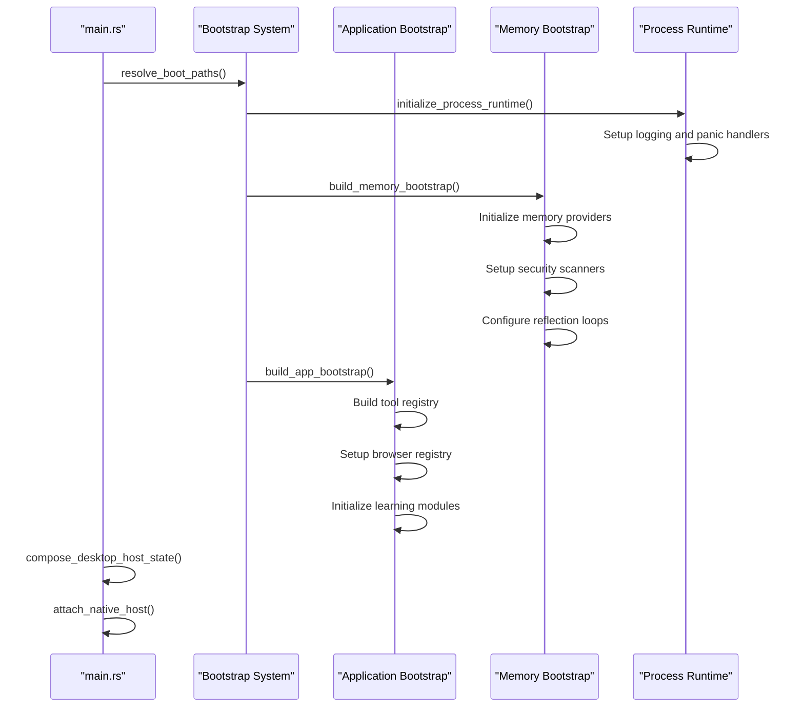
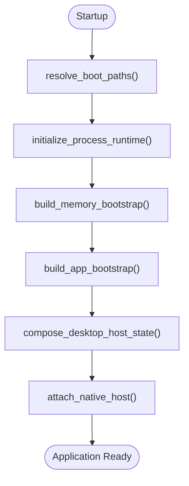
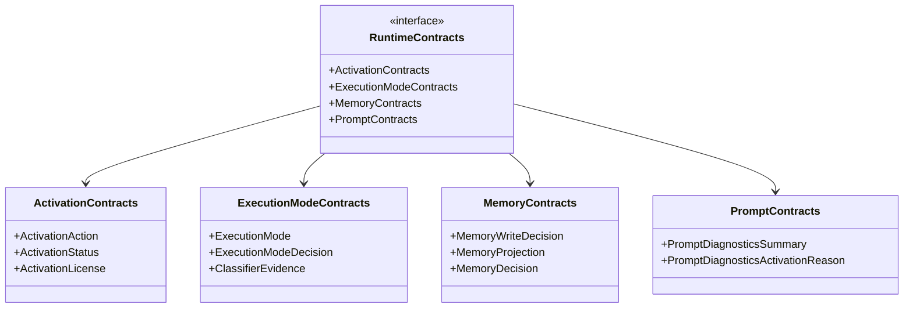
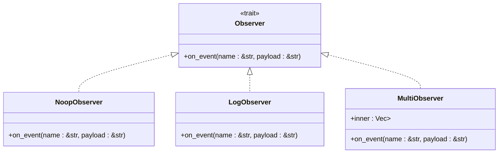
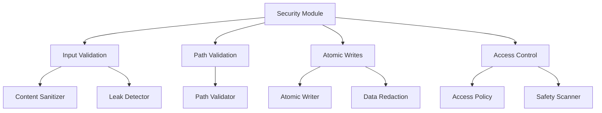
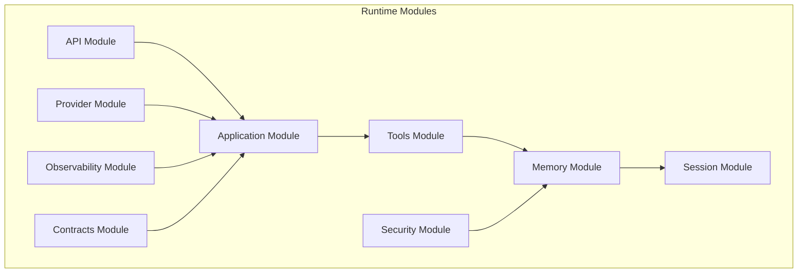
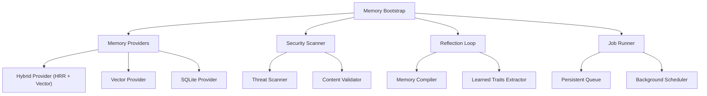
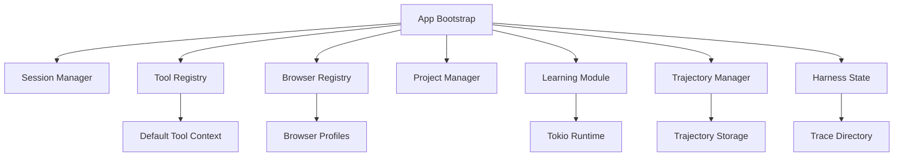
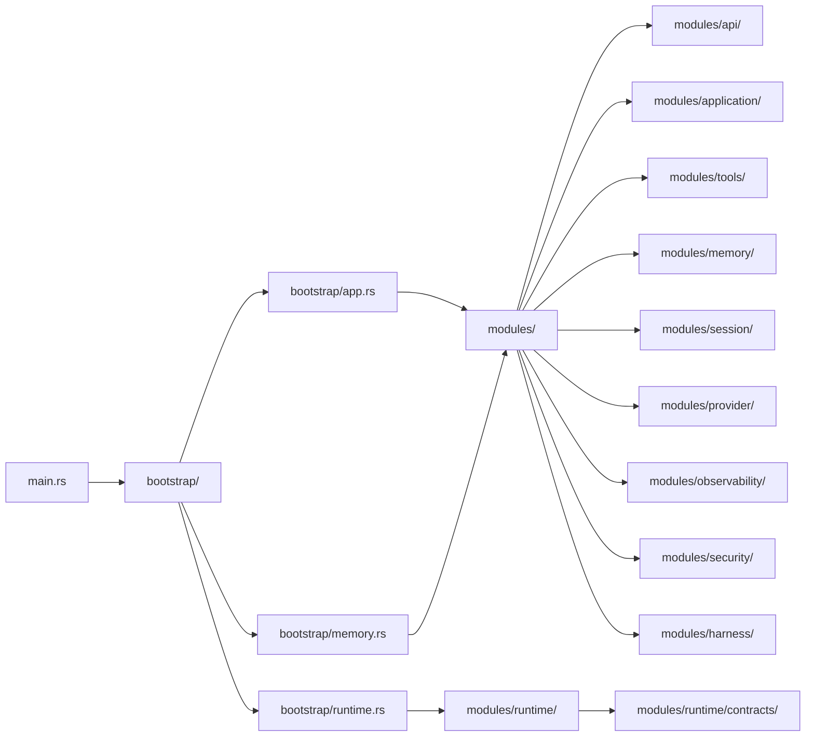

# Runtime Services

<cite>
**Referenced Files in This Document**
- [main.rs](file://src-tauri/src/main.rs)
- [lib.rs](file://src-tauri/src/lib.rs)
- [bootstrap/mod.rs](file://src-tauri/src/bootstrap/mod.rs)
- [bootstrap/app.rs](file://src-tauri/src/bootstrap/app.rs)
- [bootstrap/memory.rs](file://src-tauri/src/bootstrap/memory.rs)
- [bootstrap/runtime.rs](file://src-tauri/src/bootstrap/runtime.rs)
- [modules/mod.rs](file://src-tauri/src/modules/mod.rs)
- [modules/observability/mod.rs](file://src-tauri/src/modules/observability/mod.rs)
- [modules/security/mod.rs](file://src-tauri/src/modules/security/mod.rs)
- [modules/runtime/contracts/mod.rs](file://src-tauri/src/modules/runtime/contracts/mod.rs)
- [modules/runtime/config/mod.rs](file://src-tauri/src/modules/runtime/config/mod.rs)
- [modules/runtime/bootstrap.rs](file://src-tauri/src/modules/runtime/bootstrap.rs)
- [modules/application/turn_service/mod.rs](file://src-tauri/src/modules/application/turn_service/mod.rs)
- [modules/memory/mod.rs](file://src-tauri/src/modules/memory/mod.rs)
- [modules/tools/mod.rs](file://src-tauri/src/modules/tools/mod.rs)
- [modules/session/mod.rs](file://src-tauri/src/modules/session/mod.rs)
- [modules/provider/mod.rs](file://src-tauri/src/modules/provider/mod.rs)
- [modules/harness/mod.rs](file://src-tauri/src/modules/harness/mod.rs)
</cite>

## Update Summary
**Changes Made**
- Updated bootstrap system architecture with new modular bootstrap system (app.rs, memory.rs, runtime.rs)
- Added enhanced lifecycle management with dual-trait contract system
- Integrated observability and safety modules into the runtime architecture
- Restructured runtime services into unified modules system
- Added new canonical contracts for runtime-facing interfaces

## Table of Contents
1. [Introduction](#introduction)
2. [Project Structure](#project-structure)
3. [Core Components](#core-components)
4. [Architecture Overview](#architecture-overview)
5. [Detailed Component Analysis](#detailed-component-analysis)
6. [Dependency Analysis](#dependency-analysis)
7. [Performance Considerations](#performance-considerations)
8. [Troubleshooting Guide](#troubleshooting-guide)
9. [Conclusion](#conclusion)
10. [Appendices](#appendices)

## Introduction
This document explains the runtime services module architecture, focusing on the new unified bootstrap system, enhanced lifecycle management, canonical contracts, and integrated observability and safety modules. The architecture has evolved from a simple runtime crate to a comprehensive modular system that separates concerns across distinct functional domains while maintaining clean interfaces and robust safety guarantees.

## Project Structure
The runtime system is now organized into a unified modular architecture that separates concerns across distinct functional domains. The bootstrap system has been redesigned with dedicated modules for application setup, memory management, and runtime initialization.

```mermaid
graph TB
subgraph "Unified Runtime Architecture"
MAIN["main.rs"]
BOOT["bootstrap/"]
BOOT_APP["bootstrap/app.rs"]
BOOT_MEM["bootstrap/memory.rs"]
BOOT_RT["bootstrap/runtime.rs"]
MOD["modules/"]
OBS["modules/observability/"]
SEC["modules/security/"]
CONTRACTS["modules/runtime/contracts/"]
RUNTIME["modules/runtime/"]
API["modules/api/"]
TOOLS["modules/tools/"]
MEMORY["modules/memory/"]
SESSION["modules/session/"]
PROVIDER["modules/provider/"]
HARNESS["modules/harness/"]
END
MAIN --> BOOT
BOOT --> BOOT_APP
BOOT --> BOOT_MEM
BOOT --> BOOT_RT
BOOT_APP --> MOD
BOOT_MEM --> MOD
BOOT_RT --> RUNTIME
MOD --> OBS
MOD --> SEC
MOD --> CONTRACTS
MOD --> RUNTIME
MOD --> API
MOD --> TOOLS
MOD --> MEMORY
MOD --> SESSION
MOD --> PROVIDER
MOD --> HARNESS
```

**Diagram sources**
- [main.rs:1-46](file://src-tauri/src/main.rs#L1-L46)
- [bootstrap/mod.rs:1-135](file://src-tauri/src/bootstrap/mod.rs#L1-L135)
- [modules/mod.rs:1-74](file://src-tauri/src/modules/mod.rs#L1-L74)

**Section sources**
- [main.rs:1-46](file://src-tauri/src/main.rs#L1-L46)
- [bootstrap/mod.rs:1-135](file://src-tauri/src/bootstrap/mod.rs#L1-L135)
- [modules/mod.rs:1-74](file://src-tauri/src/modules/mod.rs#L1-L74)

## Core Components
- **Unified Bootstrap System**: Modular bootstrap with dedicated modules for application setup, memory management, and runtime initialization
- **Enhanced Lifecycle Management**: Dual-trait contract system providing canonical interfaces for runtime components
- **Integrated Observability**: Pluggable observer pattern with multiple backends (noop, log, multi) for lifecycle event monitoring
- **Safety Modules**: Layered security system for memory operations including input validation, path safety, and atomic writes
- **Canonical Contracts**: Stable runtime-facing interfaces shared between backend and frontend
- **Modular Runtime**: Separated concerns across API integration, tool execution, memory management, and session handling
- **Memory Management**: Advanced memory systems with hybrid providers, security scanning, and reflection loops
- **Tool System**: Comprehensive tool registry with context-aware execution and security validation
- **Session Management**: Persistent session handling with JSON serialization and usage tracking
- **Provider Integration**: Flexible LLM provider system with resilience and caching layers

**Section sources**
- [bootstrap/app.rs:1-139](file://src-tauri/src/bootstrap/app.rs#L1-L139)
- [bootstrap/memory.rs:1-311](file://src-tauri/src/bootstrap/memory.rs#L1-L311)
- [bootstrap/runtime.rs:1-60](file://src-tauri/src/bootstrap/runtime.rs#L1-L60)
- [modules/observability/mod.rs:1-72](file://src-tauri/src/modules/observability/mod.rs#L1-L72)
- [modules/security/mod.rs:1-28](file://src-tauri/src/modules/security/mod.rs#L1-L28)
- [modules/runtime/contracts/mod.rs:1-60](file://src-tauri/src/modules/runtime/contracts/mod.rs#L1-L60)

## Architecture Overview
The new architecture follows a three-tier bootstrap pattern: process initialization, application bootstrap, and runtime configuration. This provides clean separation of concerns and enables flexible initialization sequences.



**Diagram sources**
- [main.rs:7-45](file://src-tauri/src/main.rs#L7-L45)
- [bootstrap/mod.rs:60-70](file://src-tauri/src/bootstrap/mod.rs#L60-L70)
- [bootstrap/app.rs:6-74](file://src-tauri/src/bootstrap/app.rs#L6-L74)
- [bootstrap/memory.rs:22-166](file://src-tauri/src/bootstrap/memory.rs#L22-L166)
- [bootstrap/runtime.rs:6-30](file://src-tauri/src/bootstrap/runtime.rs#L6-L30)

## Detailed Component Analysis

### Unified Bootstrap System
The bootstrap system has been redesigned with three dedicated modules that handle specific aspects of application initialization:

- **Process Runtime**: Initializes logging, panic handling, and runtime configuration
- **Memory Bootstrap**: Sets up memory providers, security scanners, and reflection systems  
- **Application Bootstrap**: Builds the complete application state with tools, browsers, and learning modules



**Diagram sources**
- [bootstrap/mod.rs:60-70](file://src-tauri/src/bootstrap/mod.rs#L60-L70)
- [bootstrap/runtime.rs:6-30](file://src-tauri/src/bootstrap/runtime.rs#L6-L30)
- [bootstrap/memory.rs:22-166](file://src-tauri/src/bootstrap/memory.rs#L22-L166)
- [bootstrap/app.rs:6-74](file://src-tauri/src/bootstrap/app.rs#L6-L74)

**Section sources**
- [bootstrap/mod.rs:12-70](file://src-tauri/src/bootstrap/mod.rs#L12-L70)
- [bootstrap/runtime.rs:1-60](file://src-tauri/src/bootstrap/runtime.rs#L1-L60)
- [bootstrap/memory.rs:1-311](file://src-tauri/src/bootstrap/memory.rs#L1-L311)
- [bootstrap/app.rs:1-139](file://src-tauri/src/bootstrap/app.rs#L1-L139)

### Enhanced Lifecycle Management with Dual-Trait Contracts
The runtime now implements a dual-trait contract system that provides canonical interfaces for different aspects of the runtime:

- **Activation Contracts**: Handle runtime activation states and licensing
- **Execution Mode Contracts**: Manage different execution modes and routing decisions  
- **Memory Contracts**: Control memory operations and write decisions
- **Prompt Contracts**: Handle prompt diagnostics and activation tracking



**Diagram sources**
- [modules/runtime/contracts/mod.rs:33-60](file://src-tauri/src/modules/runtime/contracts/mod.rs#L33-L60)

**Section sources**
- [modules/runtime/contracts/mod.rs:1-60](file://src-tauri/src/modules/runtime/contracts/mod.rs#L1-L60)

### Integrated Observability System
The observability module provides a pluggable observer pattern that allows different backends for lifecycle event monitoring:

- **NoopObserver**: Default observer that discards events (zero overhead)
- **LogObserver**: Writes events to tracing logs with dedicated target filtering
- **MultiObserver**: Fan-out to multiple observers for complex monitoring scenarios



**Diagram sources**
- [modules/observability/mod.rs:8-51](file://src-tauri/src/modules/observability/mod.rs#L8-L51)

**Section sources**
- [modules/observability/mod.rs:1-72](file://src-tauri/src/modules/observability/mod.rs#L1-L72)

### Safety and Security Modules
The security module provides layered defense mechanisms for memory operations:

- **Input Validation**: Sanitization of keys and content to prevent injection attacks
- **Path Validation**: Prevention of directory traversal and unsafe path operations  
- **Atomic Writes**: Crash-safe file operations using atomic write patterns
- **Memory Access Control**: Category-based permissions for different memory operations



**Diagram sources**
- [modules/security/mod.rs:1-28](file://src-tauri/src/modules/security/mod.rs#L1-L28)

**Section sources**
- [modules/security/mod.rs:1-28](file://src-tauri/src/modules/security/mod.rs#L1-L28)

### Modular Runtime Architecture
The runtime system is now organized into distinct modules that handle specific functional domains:

- **API Module**: LLM provider integration and client management
- **Application Module**: Core agent loop, turn service, and execution coordination
- **Tools Module**: Tool registry, execution, and context management
- **Memory Module**: Advanced memory systems with hybrid providers and reflection loops
- **Session Module**: Session management with JSON persistence and usage tracking
- **Provider Module**: LLM provider abstraction with resilience and caching



**Diagram sources**
- [modules/mod.rs:15-41](file://src-tauri/src/modules/mod.rs#L15-L41)

**Section sources**
- [modules/mod.rs:1-74](file://src-tauri/src/modules/mod.rs#L1-L74)

### Memory Management and Reflection Loops
The memory bootstrap system provides advanced memory management with hybrid providers and reflection capabilities:

- **Hybrid Memory Providers**: Combines HRR (Hierarchical Retrieval and Ranking) with vector databases
- **Reflection Loops**: Automated memory compilation and trait extraction processes
- **Security Scanning**: Built-in threat detection and content validation
- **Job Management**: Persistent job queue for background memory operations



**Diagram sources**
- [bootstrap/memory.rs:22-166](file://src-tauri/src/bootstrap/memory.rs#L22-L166)

**Section sources**
- [bootstrap/memory.rs:1-311](file://src-tauri/src/bootstrap/memory.rs#L1-L311)

### Application Bootstrap and Service Composition
The application bootstrap creates a comprehensive application state with integrated services:

- **Session Manager**: Manages conversation sessions with project context
- **Tool Registry**: Centralized tool management with context-aware execution
- **Browser Registry**: Chromium automation with profile management
- **Learning Modules**: Self-improvement and trajectory management systems
- **Harness Integration**: Optional testing and evaluation framework



**Diagram sources**
- [bootstrap/app.rs:6-74](file://src-tauri/src/bootstrap/app.rs#L6-L74)

**Section sources**
- [bootstrap/app.rs:1-139](file://src-tauri/src/bootstrap/app.rs#L1-L139)

## Dependency Analysis
The unified architecture maintains clear separation of concerns with well-defined dependency relationships:



**Diagram sources**
- [main.rs:1-46](file://src-tauri/src/main.rs#L1-L46)
- [bootstrap/mod.rs:1-135](file://src-tauri/src/bootstrap/mod.rs#L1-L135)
- [modules/mod.rs:1-74](file://src-tauri/src/modules/mod.rs#L1-L74)

**Section sources**
- [main.rs:1-46](file://src-tauri/src/main.rs#L1-L46)
- [bootstrap/mod.rs:1-135](file://src-tauri/src/bootstrap/mod.rs#L1-L135)
- [modules/mod.rs:1-74](file://src-tauri/src/modules/mod.rs#L1-L74)

## Performance Considerations
- **Lazy Initialization**: Memory providers are created on-demand with fallback mechanisms
- **Asynchronous Operations**: Long-running operations use async/await patterns with timeouts
- **Resource Pooling**: Connection pools for database operations and provider reuse
- **Efficient Logging**: Pluggable observer pattern with zero-overhead default implementation
- **Memory Optimization**: Hybrid providers combine performance with scalability

## Troubleshooting Guide
- **Bootstrap Failures**: Check boot path resolution and environment variable overrides
- **Memory Provider Issues**: Verify database paths and fallback mechanisms are functioning
- **Observability Configuration**: Set IF2AI_OBSERVER environment variable for log-based observation
- **Security Violations**: Review threat scanner logs and path validation failures
- **Contract Interface Issues**: Ensure proper implementation of canonical contract traits

**Section sources**
- [bootstrap/mod.rs:60-90](file://src-tauri/src/bootstrap/mod.rs#L60-L90)
- [bootstrap/runtime.rs:32-60](file://src-tauri/src/bootstrap/runtime.rs#L32-L60)
- [modules/observability/mod.rs:58-66](file://src-tauri/src/modules/observability/mod.rs#L58-L66)

## Conclusion
The unified runtime services architecture provides a robust foundation for scalable AI agent applications. The new modular bootstrap system, dual-trait contract framework, integrated observability, and comprehensive safety modules create a maintainable and extensible platform. The separation of concerns across distinct functional domains enables focused development while maintaining clean interfaces and strong safety guarantees.

## Appendices

### Examples

- **Unified Bootstrap Initialization**
  - Resolve boot paths, initialize process runtime, and build application bootstrap
  - Reference: [main.rs:7-29](file://src-tauri/src/main.rs#L7-L29)

- **Memory Provider Setup**
  - Initialize hybrid memory providers with fallback to vector and SQLite
  - Reference: [bootstrap/memory.rs:204-270](file://src-tauri/src/bootstrap/memory.rs#L204-L270)

- **Observability Configuration**
  - Set up pluggable observer pattern with log backend
  - Reference: [modules/observability/mod.rs:58-71](file://src-tauri/src/modules/observability/mod.rs#L58-L71)

- **Security Module Integration**
  - Implement layered security with threat scanning and atomic writes
  - Reference: [bootstrap/memory.rs:14-20](file://src-tauri/src/bootstrap/memory.rs#L14-L20)

- **Canonical Contract Implementation**
  - Define runtime-facing interfaces for activation, execution, and memory operations
  - Reference: [modules/runtime/contracts/mod.rs:33-60](file://src-tauri/src/modules/runtime/contracts/mod.rs#L33-L60)

- **Application Service Composition**
  - Build comprehensive application state with integrated services
  - Reference: [bootstrap/app.rs:6-74](file://src-tauri/src/bootstrap/app.rs#L6-L74)

- **Process Runtime Configuration**
  - Initialize logging, panic handlers, and runtime configuration
  - Reference: [bootstrap/runtime.rs:6-30](file://src-tauri/src/bootstrap/runtime.rs#L6-L30)