# Runtime Services

<cite>
**Referenced Files in This Document**
- [lib.rs](file://rust/crates/runtime/src/lib.rs)
- [bootstrap.rs](file://rust/crates/runtime/src/bootstrap.rs)
- [config.rs](file://rust/crates/runtime/src/config.rs)
- [session.rs](file://rust/crates/runtime/src/session.rs)
- [conversation.rs](file://rust/crates/runtime/src/conversation.rs)
- [mcp.rs](file://rust/crates/runtime/src/mcp.rs)
- [oauth.rs](file://rust/crates/runtime/src/oauth.rs)
- [permissions.rs](file://rust/crates/runtime/src/permissions.rs)
- [usage.rs](file://rust/crates/runtime/src/usage.rs)
- [prompt.rs](file://rust/crates/runtime/src/prompt.rs)
- [compact.rs](file://rust/crates/runtime/src/compact.rs)
- [hooks.rs](file://rust/crates/runtime/src/hooks.rs)
- [json.rs](file://rust/crates/runtime/src/json.rs)
- [sandbox.rs](file://rust/crates/runtime/src/sandbox.rs)
- [file_ops.rs](file://rust/crates/runtime/src/file_ops.rs)
</cite>

## Table of Contents
1. [Introduction](#introduction)
2. [Project Structure](#project-structure)
3. [Core Components](#core-components)
4. [Architecture Overview](#architecture-overview)
5. [Detailed Component Analysis](#detailed-component-analysis)
6. [Dependency Analysis](#dependency-analysis)
7. [Performance Considerations](#performance-considerations)
8. [Troubleshooting Guide](#troubleshooting-guide)
9. [Conclusion](#conclusion)
10. [Appendices](#appendices)

## Introduction
This document explains the runtime services module architecture, focusing on configuration management, contracts, bootstrap processes, budget management, conversation handling, file operations, session lifecycle, MCP integration, OAuth handling, permissions, usage tracking, prompt processing, sandbox operations, and compaction/snapshots. It also provides examples of runtime initialization, configuration loading, and service lifecycle management.

## Project Structure
The runtime crate exposes a cohesive set of modules that define contracts, orchestrate conversations, manage sessions, handle configuration, and integrate with external systems (MCP, OAuth, sandboxing). Public re-exports in the crate root expose the primary APIs for consumers.

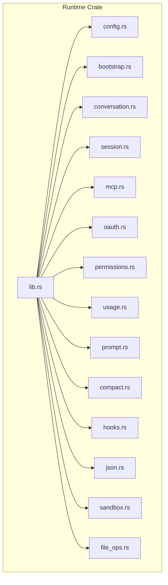

**Diagram sources**
- [lib.rs:1-95](file://rust/crates/runtime/src/lib.rs#L1-L95)

**Section sources**
- [lib.rs:1-95](file://rust/crates/runtime/src/lib.rs#L1-L95)

## Core Components
- Configuration Management: Loads and merges settings from multiple sources, parses feature flags (hooks, plugins, MCP, OAuth, model, permissions, sandbox), and exposes typed configuration.
- Bootstrap: Defines ordered phases for runtime initialization and fast-path optimizations.
- Conversation Runtime: Orchestrates turns, enforces budgets, manages permissions, runs hooks, and tracks usage.
- Session Management: Encodes conversation history and token usage into a portable JSON format.
- MCP Integration: Normalizes tool names, computes signatures, and manages transports (stdio, SSE, HTTP, WS, SDK, managed proxy).
- OAuth: PKCE generation, authorization callbacks, token storage, and credential helpers.
- Permissions: Mode-based policies with escalation prompts and tool-specific requirements.
- Usage Tracking: Token usage aggregation and cost estimation per model tier.
- Prompt Building: Composes system prompts from project context, instruction files, and runtime config.
- Compaction/Snapshots: Automatic summarization and continuation messages to reduce context size.
- Hooks: Pre/post tool-use shell commands with standardized payloads and outcomes.
- JSON Utilities: Lightweight JSON AST and parser for robust config parsing.
- Sandbox: Container detection, request resolution, and Linux unshare-based sandbox launcher.

**Section sources**
- [config.rs:1-800](file://rust/crates/runtime/src/config.rs#L1-L800)
- [bootstrap.rs:1-57](file://rust/crates/runtime/src/bootstrap.rs#L1-L57)
- [conversation.rs:1-800](file://rust/crates/runtime/src/conversation.rs#L1-L800)
- [session.rs:1-437](file://rust/crates/runtime/src/session.rs#L1-L437)
- [mcp.rs:1-301](file://rust/crates/runtime/src/mcp.rs#L1-L301)
- [oauth.rs:1-590](file://rust/crates/runtime/src/oauth.rs#L1-L590)
- [permissions.rs:1-233](file://rust/crates/runtime/src/permissions.rs#L1-L233)
- [usage.rs:1-311](file://rust/crates/runtime/src/usage.rs#L1-L311)
- [prompt.rs:1-796](file://rust/crates/runtime/src/prompt.rs#L1-L796)
- [compact.rs:1-703](file://rust/crates/runtime/src/compact.rs#L1-L703)
- [hooks.rs:1-358](file://rust/crates/runtime/src/hooks.rs#L1-L358)
- [json.rs:1-359](file://rust/crates/runtime/src/json.rs#L1-L359)
- [sandbox.rs:1-365](file://rust/crates/runtime/src/sandbox.rs#L1-L365)
- [file_ops.rs:1-551](file://rust/crates/runtime/src/file_ops.rs#L1-L551)

## Architecture Overview
The runtime orchestrates a conversation loop with the following flow:
- Load configuration and initialize bootstrap phases.
- Build system prompt from project context and settings.
- Run turns: stream assistant responses, parse tool use events, enforce permissions, run hooks, execute tools, and record usage.
- Compact sessions when approaching token limits.
- Persist sessions and track costs.

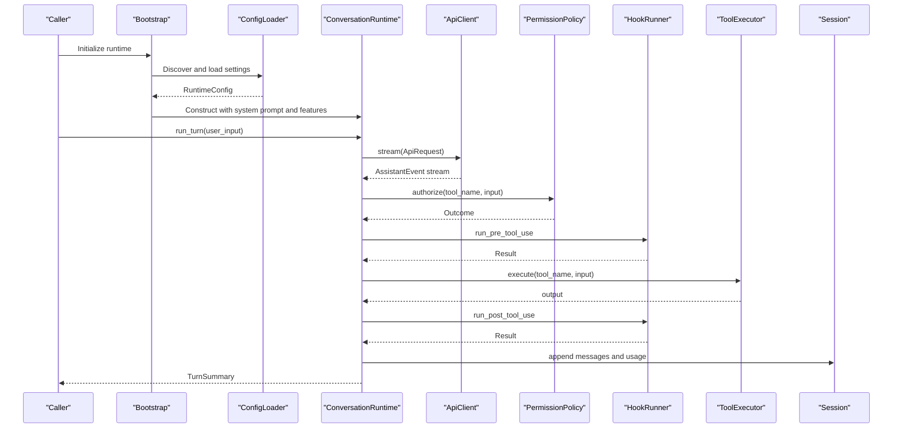

**Diagram sources**
- [bootstrap.rs:17-56](file://rust/crates/runtime/src/bootstrap.rs#L17-L56)
- [config.rs:170-260](file://rust/crates/runtime/src/config.rs#L170-L260)
- [conversation.rs:121-351](file://rust/crates/runtime/src/conversation.rs#L121-L351)
- [session.rs:83-140](file://rust/crates/runtime/src/session.rs#L83-L140)

## Detailed Component Analysis

### Configuration Management
- Sources: User, project, and local settings are discovered and merged.
- Feature flags: hooks, plugins, MCP servers, OAuth, model, permissions, sandbox.
- Parsing: Robust JSON parsing with typed extraction and validation.
- Resolution: Permission mode and sandbox defaults are resolved from merged settings.

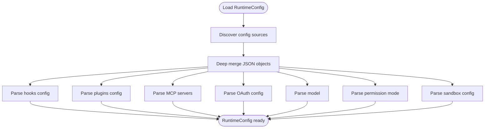

**Diagram sources**
- [config.rs:170-260](file://rust/crates/runtime/src/config.rs#L170-L260)
- [config.rs:559-698](file://rust/crates/runtime/src/config.rs#L559-L698)

**Section sources**
- [config.rs:170-331](file://rust/crates/runtime/src/config.rs#L170-L331)
- [config.rs:429-471](file://rust/crates/runtime/src/config.rs#L429-L471)

### Bootstrap Processes
- Ordered phases define startup order and fast-path optimizations.
- Deduplicated phase lists ensure idempotent initialization.

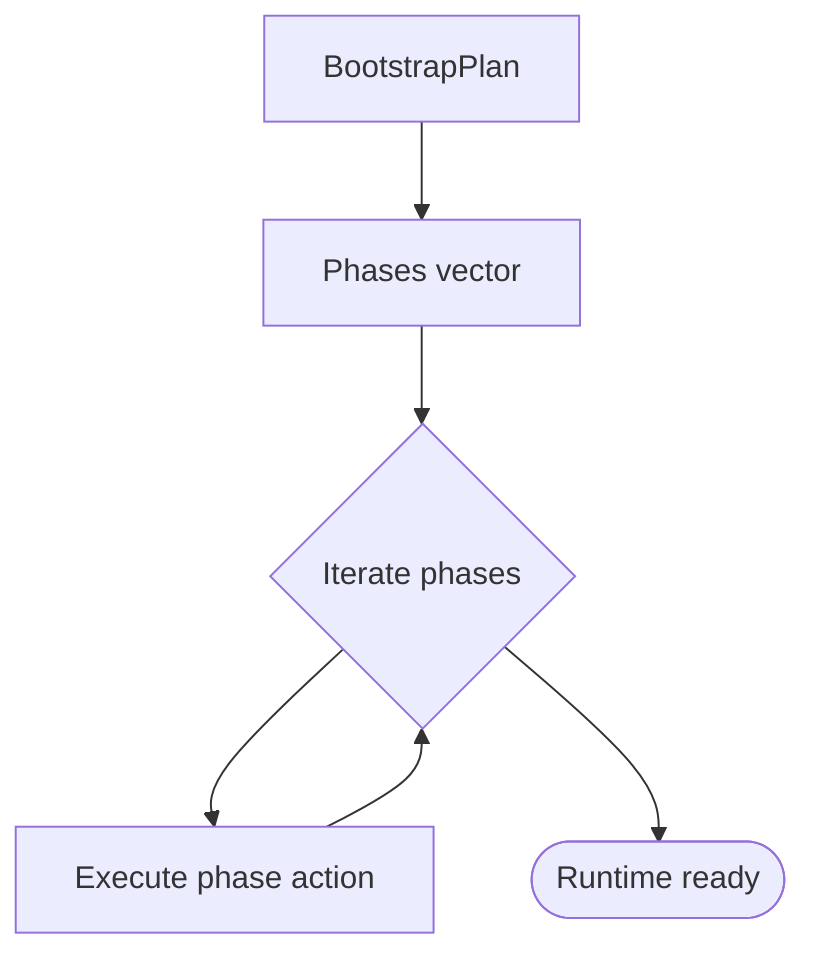

**Diagram sources**
- [bootstrap.rs:17-56](file://rust/crates/runtime/src/bootstrap.rs#L17-L56)

**Section sources**
- [bootstrap.rs:1-57](file://rust/crates/runtime/src/bootstrap.rs#L1-L57)

### Budget Management and Token Usage
- Conversation runtime enforces max iterations and optional token budget.
- UsageTracker aggregates token usage per turn and cumulatively.
- Cost estimation uses model-specific pricing tiers.

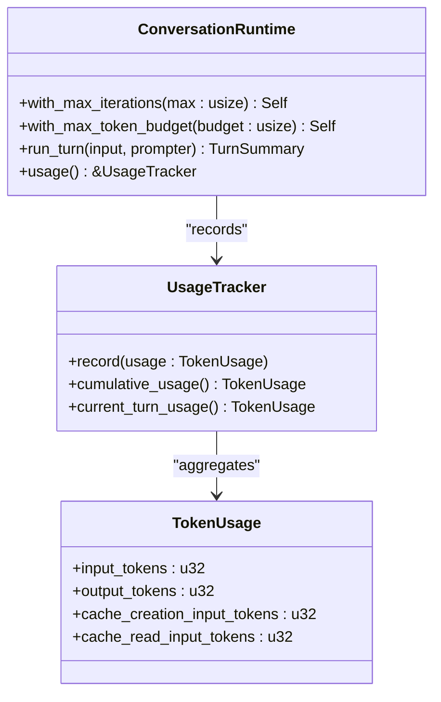

**Diagram sources**
- [conversation.rs:121-351](file://rust/crates/runtime/src/conversation.rs#L121-L351)
- [usage.rs:163-210](file://rust/crates/runtime/src/usage.rs#L163-L210)

**Section sources**
- [conversation.rs:220-234](file://rust/crates/runtime/src/conversation.rs#L220-L234)
- [usage.rs:163-210](file://rust/crates/runtime/src/usage.rs#L163-L210)

### Conversation Handling
- Assistant events are streamed and assembled into a single assistant message.
- Tool use blocks trigger permission checks, hook execution, and tool invocation.
- Results are appended to the session with usage updates.

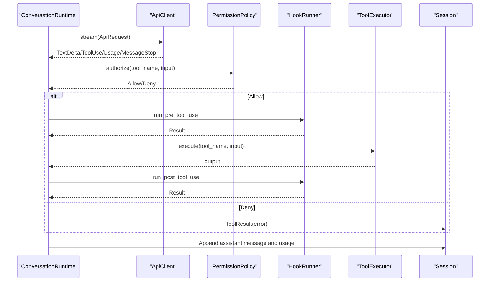

**Diagram sources**
- [conversation.rs:191-325](file://rust/crates/runtime/src/conversation.rs#L191-L325)

**Section sources**
- [conversation.rs:191-325](file://rust/crates/runtime/src/conversation.rs#L191-L325)

### Session Lifecycle Management
- Sessions persist as JSON with version and messages.
- Messages include roles, content blocks, and optional usage.
- Tokens are estimated for budget enforcement and compaction decisions.

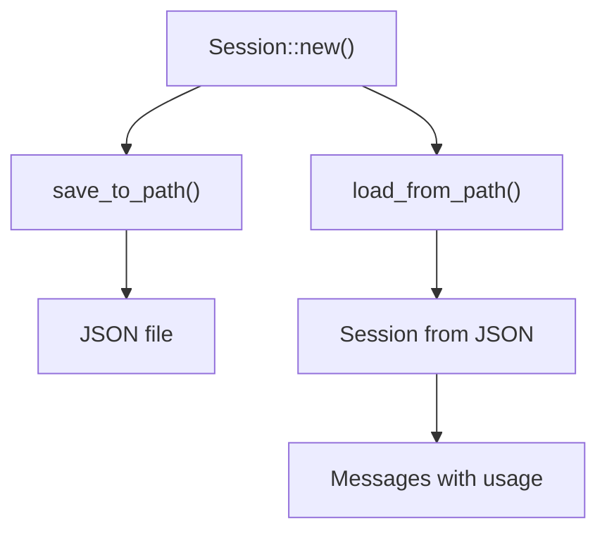

**Diagram sources**
- [session.rs:83-140](file://rust/crates/runtime/src/session.rs#L83-L140)
- [compact.rs:32-47](file://rust/crates/runtime/src/compact.rs#L32-L47)

**Section sources**
- [session.rs:47-140](file://rust/crates/runtime/src/session.rs#L47-L140)
- [compact.rs:89-131](file://rust/crates/runtime/src/compact.rs#L89-L131)

### MCP Integration
- Tool name normalization and server signature computation.
- Transport selection and scoped configuration hashing.
- Proxy URL unwrapping for stable matching.

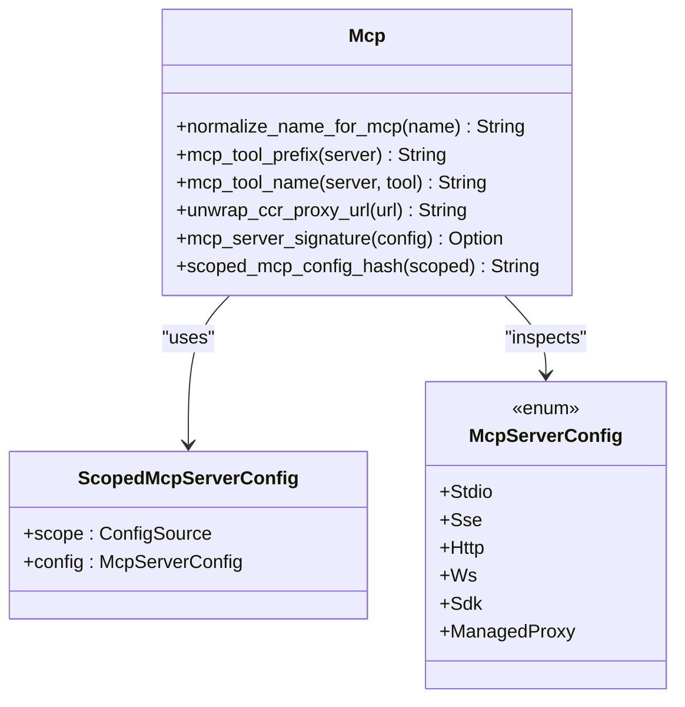

**Diagram sources**
- [mcp.rs:65-118](file://rust/crates/runtime/src/mcp.rs#L65-L118)
- [config.rs:86-127](file://rust/crates/runtime/src/config.rs#L86-L127)

**Section sources**
- [mcp.rs:1-301](file://rust/crates/runtime/src/mcp.rs#L1-L301)
- [config.rs:65-127](file://rust/crates/runtime/src/config.rs#L65-L127)

### OAuth Handling
- PKCE pair generation and challenge computation.
- Authorization URL building and callback parsing.
- Credential storage and retrieval with safe file writes.

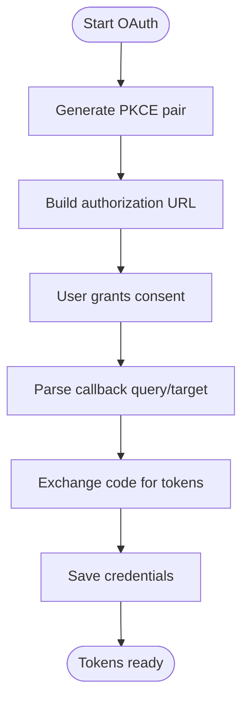

**Diagram sources**
- [oauth.rs:234-318](file://rust/crates/runtime/src/oauth.rs#L234-L318)
- [oauth.rs:262-292](file://rust/crates/runtime/src/oauth.rs#L262-L292)

**Section sources**
- [oauth.rs:12-111](file://rust/crates/runtime/src/oauth.rs#L12-L111)
- [oauth.rs:234-318](file://rust/crates/runtime/src/oauth.rs#L234-L318)

### Permissions System
- Modes: read-only, workspace-write, danger-full-access, prompt, allow.
- Tool-specific requirements and escalation prompts.
- Outcome: allow/deny with reasons.

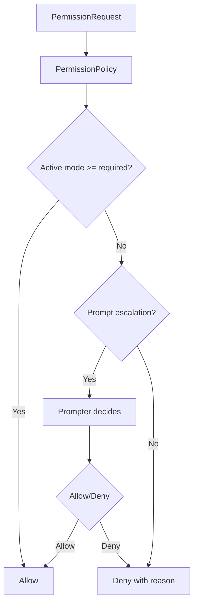

**Diagram sources**
- [permissions.rs:89-134](file://rust/crates/runtime/src/permissions.rs#L89-L134)

**Section sources**
- [permissions.rs:1-135](file://rust/crates/runtime/src/permissions.rs#L1-L135)

### Usage Tracking and Cost Estimation
- TokenUsage aggregates input/output/cache metrics.
- Pricing tiers for different models.
- Summary lines with cost breakdown.

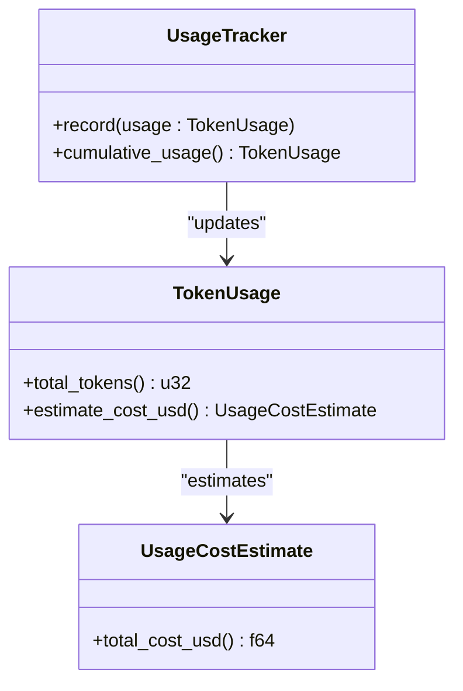

**Diagram sources**
- [usage.rs:80-152](file://rust/crates/runtime/src/usage.rs#L80-L152)
- [usage.rs:163-210](file://rust/crates/runtime/src/usage.rs#L163-L210)

**Section sources**
- [usage.rs:1-311](file://rust/crates/runtime/src/usage.rs#L1-L311)

### Prompt Processing
- SystemPromptBuilder composes sections: intro, system, doing tasks, actions, dynamic boundary, environment, project context, instruction files, runtime config, and appended sections.
- ProjectContext discovers instruction files and Git snapshots.
- ConfigLoader loads settings for inclusion in prompts.

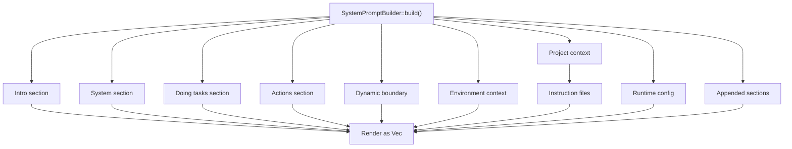

**Diagram sources**
- [prompt.rs:144-171](file://rust/crates/runtime/src/prompt.rs#L144-L171)
- [prompt.rs:414-428](file://rust/crates/runtime/src/prompt.rs#L414-L428)

**Section sources**
- [prompt.rs:85-195](file://rust/crates/runtime/src/prompt.rs#L85-L195)
- [prompt.rs:202-286](file://rust/crates/runtime/src/prompt.rs#L202-L286)
- [prompt.rs:414-428](file://rust/crates/runtime/src/prompt.rs#L414-L428)

### File Operations
- Read, write, edit files with structured patch output.
- Glob search and grep search with filters and limits.
- Path normalization and safety checks.

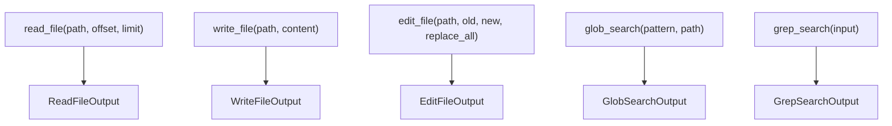

**Diagram sources**
- [file_ops.rs:132-178](file://rust/crates/runtime/src/file_ops.rs#L132-L178)
- [file_ops.rs:180-218](file://rust/crates/runtime/src/file_ops.rs#L180-L218)
- [file_ops.rs:220-261](file://rust/crates/runtime/src/file_ops.rs#L220-L261)
- [file_ops.rs:263-370](file://rust/crates/runtime/src/file_ops.rs#L263-L370)

**Section sources**
- [file_ops.rs:1-551](file://rust/crates/runtime/src/file_ops.rs#L1-L551)

### Sandbox Operations
- Detect container environments from multiple signals.
- Resolve sandbox request from config with overrides.
- Build Linux unshare command with namespace/network isolation and filesystem modes.

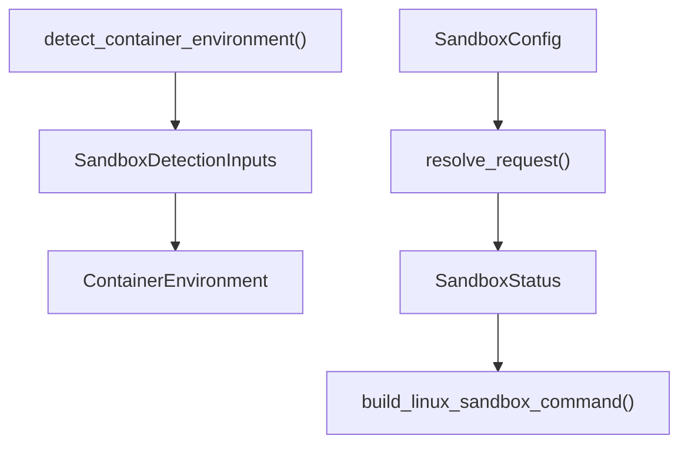

**Diagram sources**
- [sandbox.rs:109-159](file://rust/crates/runtime/src/sandbox.rs#L109-L159)
- [sandbox.rs:162-208](file://rust/crates/runtime/src/sandbox.rs#L162-L208)
- [sandbox.rs:211-262](file://rust/crates/runtime/src/sandbox.rs#L211-L262)

**Section sources**
- [sandbox.rs:1-365](file://rust/crates/runtime/src/sandbox.rs#L1-L365)

### Hooks and Feedback
- Pre/post tool-use hooks execute shell commands with JSON payloads.
- Outcomes: allow, deny (with message), warn (with message).
- Environment variables expose tool metadata.

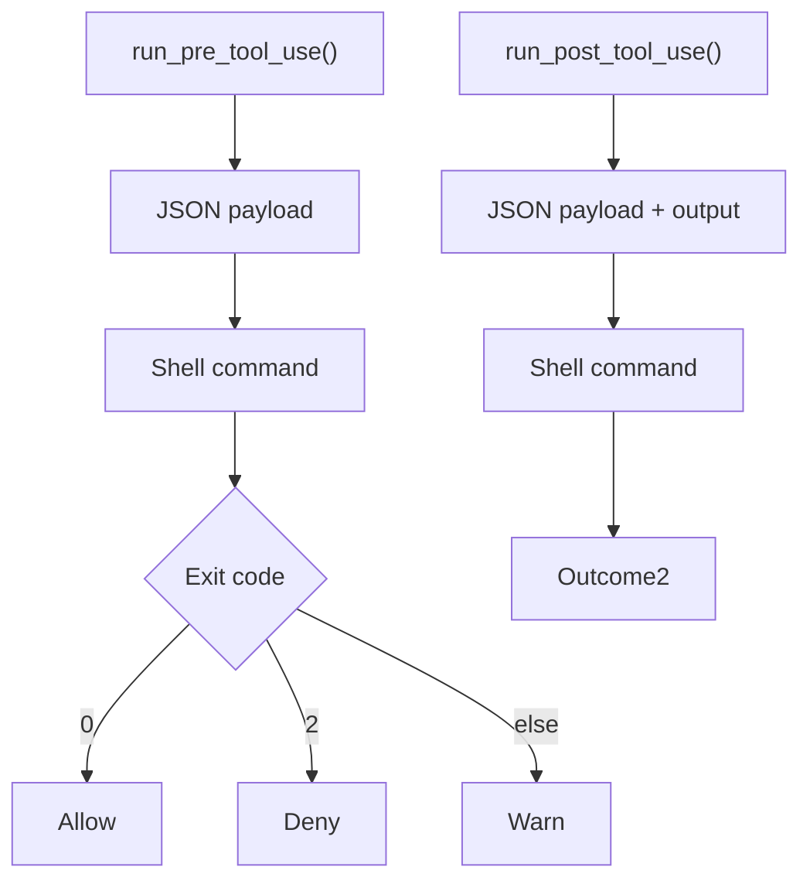

**Diagram sources**
- [hooks.rs:76-103](file://rust/crates/runtime/src/hooks.rs#L76-L103)
- [hooks.rs:164-213](file://rust/crates/runtime/src/hooks.rs#L164-L213)

**Section sources**
- [hooks.rs:1-358](file://rust/crates/runtime/src/hooks.rs#L1-L358)

### Compaction and Snapshot Management
- Estimate session tokens and decide compaction.
- Summarize older messages and inject a system continuation message.
- Preserve recent messages and merge summaries across compactions.

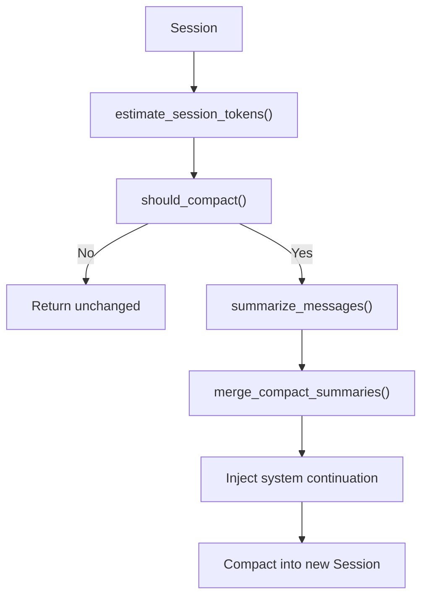

**Diagram sources**
- [compact.rs:32-47](file://rust/crates/runtime/src/compact.rs#L32-L47)
- [compact.rs:89-131](file://rust/crates/runtime/src/compact.rs#L89-L131)

**Section sources**
- [compact.rs:1-703](file://rust/crates/runtime/src/compact.rs#L1-L703)

### Logical Day Calculations and Timeline Flushing
- Not implemented in the referenced runtime module. Timeline flushing and logical day calculations appear to be handled elsewhere in the broader system.

[No sources needed since this section does not analyze specific files]

## Dependency Analysis
The runtime crate composes modules with clear boundaries and minimal coupling:
- lib.rs re-exports public APIs.
- conversation.rs depends on session.rs, permissions.rs, hooks.rs, usage.rs, and compact.rs.
- config.rs integrates with json.rs for parsing.
- mcp.rs depends on config.rs for server definitions.
- oauth.rs depends on config.rs for OAuth settings.
- sandbox.rs is standalone but integrates with OS/container detection.
- file_ops.rs uses external crates for globbing and regex.

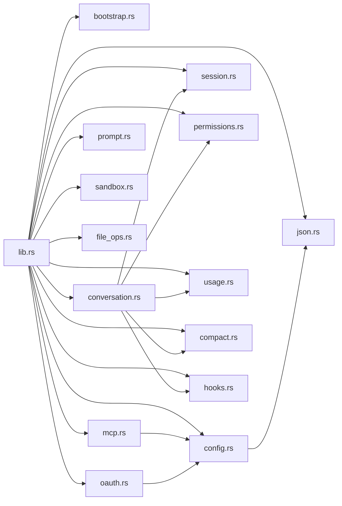

**Diagram sources**
- [lib.rs:1-95](file://rust/crates/runtime/src/lib.rs#L1-L95)

**Section sources**
- [lib.rs:1-95](file://rust/crates/runtime/src/lib.rs#L1-L95)

## Performance Considerations
- Token budget enforcement prevents excessive context growth.
- Compaction reduces token usage by summarizing older messages while preserving recent context.
- File operations use streaming and limits to avoid heavy IO.
- Sandbox detection avoids expensive operations when not applicable.

[No sources needed since this section provides general guidance]

## Troubleshooting Guide
- Configuration errors: ConfigLoader returns structured errors for IO and parse failures; check discovered paths and JSON validity.
- Conversation runtime errors: Max iterations exceeded, session errors, and permission denials surface actionable messages.
- OAuth callback parsing: Ensure correct path and query encoding; verify state and PKCE parameters.
- Sandbox status: Review fallback reasons for unavailable features (Linux with unshare, allow-list without mounts).

**Section sources**
- [config.rs:146-167](file://rust/crates/runtime/src/config.rs#L146-L167)
- [conversation.rs:61-111](file://rust/crates/runtime/src/conversation.rs#L61-L111)
- [oauth.rs:294-318](file://rust/crates/runtime/src/oauth.rs#L294-L318)
- [sandbox.rs:162-208](file://rust/crates/runtime/src/sandbox.rs#L162-L208)

## Conclusion
The runtime services module provides a robust foundation for conversational AI workflows: flexible configuration, secure permission controls, reliable session persistence, efficient budgeting and compaction, and extensible integrations via MCP and OAuth. Hooks and sandboxing enable safe customization and isolation. Together, these components support scalable, maintainable, and auditable runtime behavior.

## Appendices

### Examples

- Runtime Initialization and Bootstrap
  - Define a bootstrap plan and execute ordered phases.
  - Reference: [bootstrap.rs:22-56](file://rust/crates/runtime/src/bootstrap.rs#L22-L56)

- Configuration Loading
  - Discover and load settings from user, project, and local sources.
  - Reference: [config.rs:196-260](file://rust/crates/runtime/src/config.rs#L196-L260)

- Service Lifecycle Management
  - Construct ConversationRuntime with system prompt and features.
  - Reference: [conversation.rs:138-177](file://rust/crates/runtime/src/conversation.rs#L138-L177)

- Session Persistence
  - Save and restore sessions with usage metadata.
  - Reference: [session.rs:92-140](file://rust/crates/runtime/src/session.rs#L92-L140)

- Budget Enforcement
  - Enforce max iterations and token budget during turns.
  - Reference: [conversation.rs:220-234](file://rust/crates/runtime/src/conversation.rs#L220-L234)

- MCP Tool Naming and Signatures
  - Normalize names and compute stable signatures for MCP servers.
  - Reference: [mcp.rs:7-81](file://rust/crates/runtime/src/mcp.rs#L7-L81)

- OAuth Authorization Flow
  - Generate PKCE, build authorization URL, parse callback, and save tokens.
  - Reference: [oauth.rs:234-292](file://rust/crates/runtime/src/oauth.rs#L234-L292)

- Permissions and Escalation
  - Authorize tools based on mode and requirements; prompt when escalating.
  - Reference: [permissions.rs:89-134](file://rust/crates/runtime/src/permissions.rs#L89-L134)

- Usage Tracking and Cost Estimation
  - Record usage per turn and estimate costs by model.
  - Reference: [usage.rs:177-210](file://rust/crates/runtime/src/usage.rs#L177-L210)

- Prompt Composition
  - Build system prompt from project context and runtime config.
  - Reference: [prompt.rs:144-171](file://rust/crates/runtime/src/prompt.rs#L144-L171)

- File Operations
  - Read/write/edit files and search with glob/grep.
  - Reference: [file_ops.rs:132-178](file://rust/crates/runtime/src/file_ops.rs#L132-L178)

- Sandbox Detection and Launch
  - Detect container environment and build unshare command.
  - Reference: [sandbox.rs:109-159](file://rust/crates/runtime/src/sandbox.rs#L109-L159)