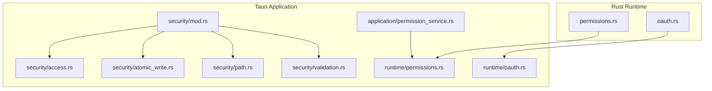
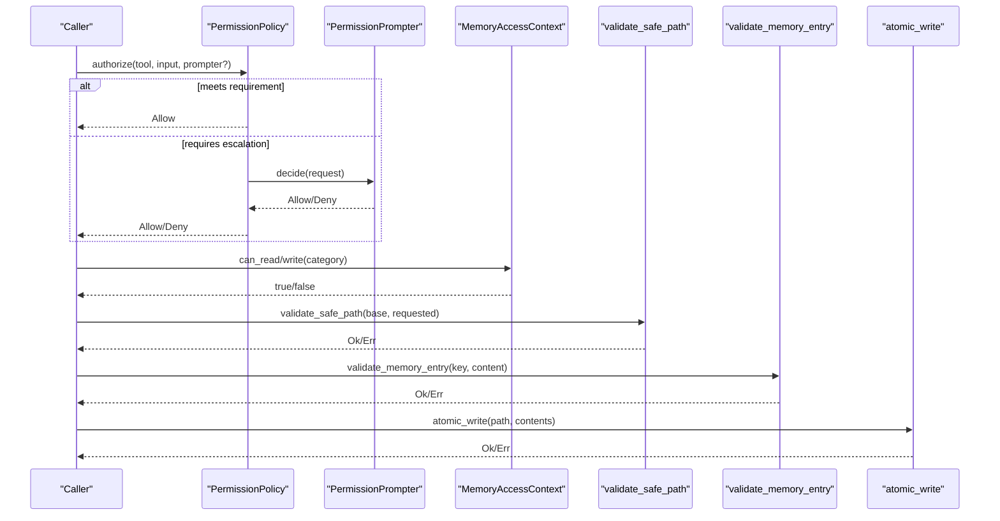
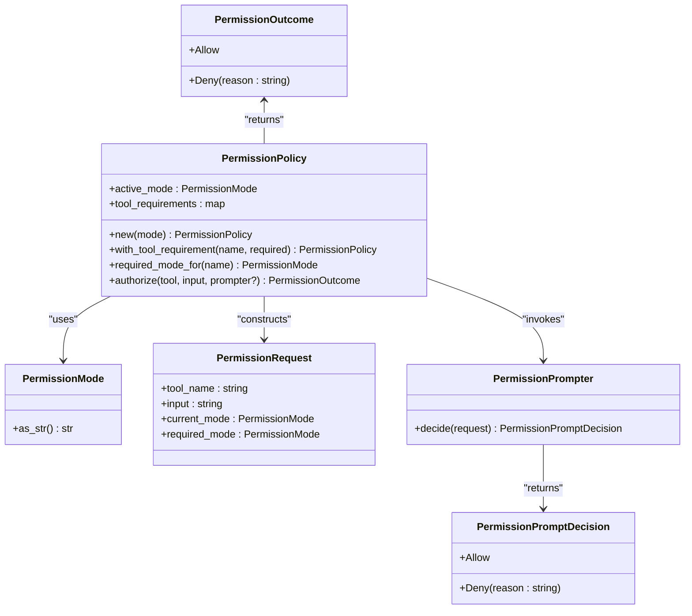
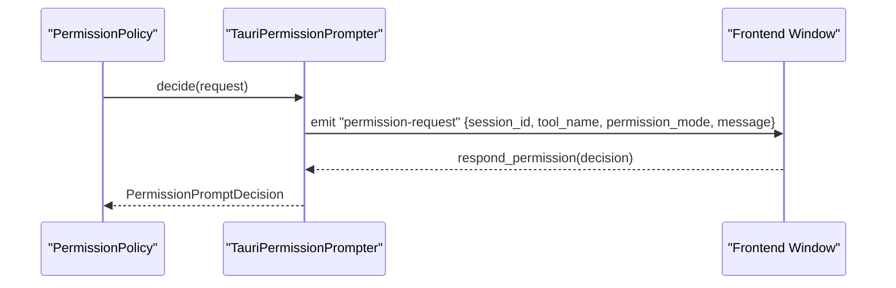
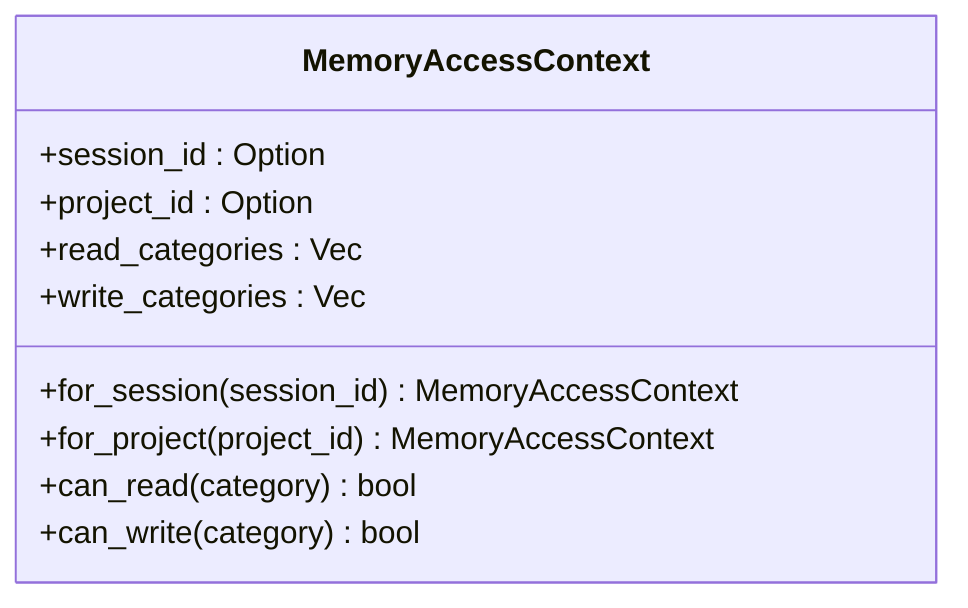
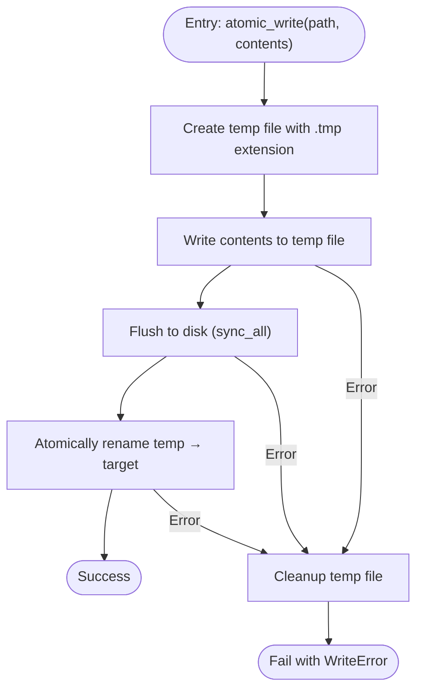
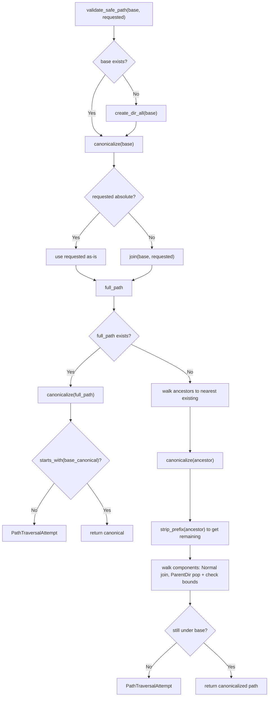
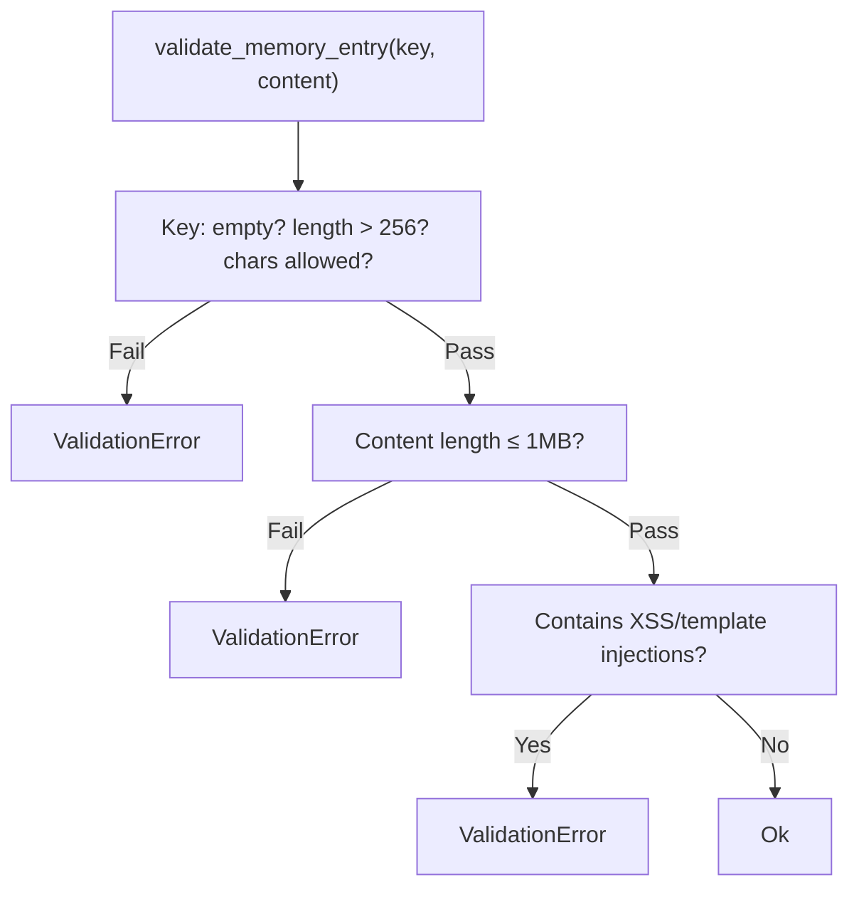
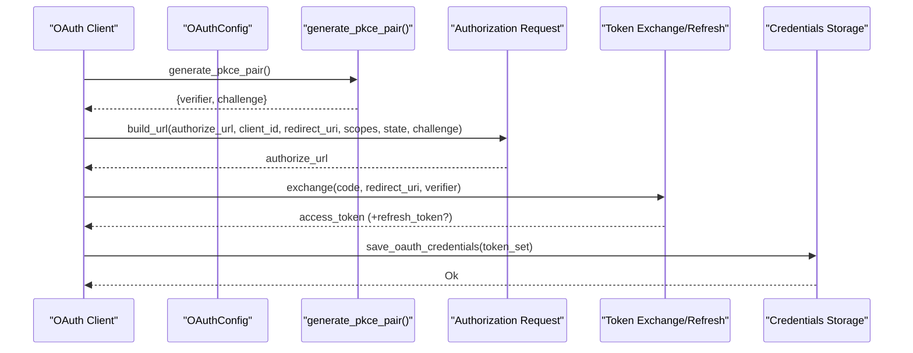
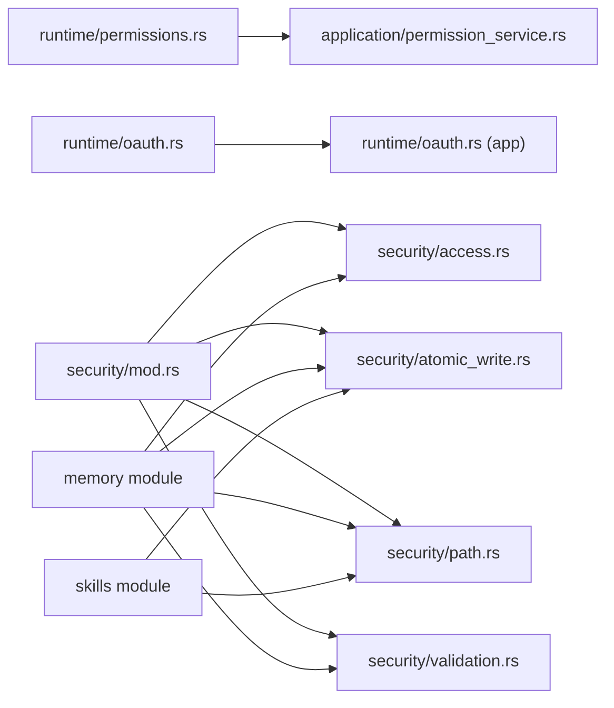

# Security & Permissions

<cite>
**Referenced Files in This Document**
- [permissions.rs](file://rust/crates/runtime/src/permissions.rs)
- [oauth.rs](file://rust/crates/runtime/src/oauth.rs)
- [mod.rs](file://src-tauri/src/modules/security/mod.rs)
- [access.rs](file://src-tauri/src/modules/security/access.rs)
- [atomic_write.rs](file://src-tauri/src/modules/security/atomic_write.rs)
- [path.rs](file://src-tauri/src/modules/security/path.rs)
- [validation.rs](file://src-tauri/src/modules/security/validation.rs)
- [permission_service.rs](file://src-tauri/src/modules/application/permission_service.rs)
- [permissions.rs](file://src-tauri/src/modules/runtime/permissions.rs)
- [oauth.rs](file://src-tauri/src/modules/runtime/oauth.rs)
</cite>

## Table of Contents
1. [Introduction](#introduction)
2. [Project Structure](#project-structure)
3. [Core Components](#core-components)
4. [Architecture Overview](#architecture-overview)
5. [Detailed Component Analysis](#detailed-component-analysis)
6. [Dependency Analysis](#dependency-analysis)
7. [Performance Considerations](#performance-considerations)
8. [Troubleshooting Guide](#troubleshooting-guide)
9. [Conclusion](#conclusion)

## Introduction
This document explains the security and permissions system across the Rust runtime and Tauri application layers. It covers:
- Permission checking mechanisms and escalation flows
- OAuth integration with PKCE and credential storage
- Access control patterns for memory categories
- Atomic write operations for crash-safe persistence
- Path validation and input validation rules
- Security policies, enforcement logic, and validation procedures

## Project Structure
Security and permissions are implemented across two primary areas:
- Rust runtime crate: permission model, OAuth primitives, and shared types
- Tauri application: security modules (path, validation, access, atomic write), permission service bridge, and OAuth utilities

**Diagram sources**
- [permissions.rs:1-233](file://rust/crates/runtime/src/permissions.rs#L1-L233)
- [oauth.rs:1-590](file://rust/crates/runtime/src/oauth.rs#L1-L590)
- [mod.rs:1-26](file://src-tauri/src/modules/security/mod.rs#L1-L26)
- [access.rs:1-104](file://src-tauri/src/modules/security/access.rs#L1-L104)
- [atomic_write.rs:1-122](file://src-tauri/src/modules/security/atomic_write.rs#L1-L122)
- [path.rs:1-145](file://src-tauri/src/modules/security/path.rs#L1-L145)
- [validation.rs:1-142](file://src-tauri/src/modules/security/validation.rs#L1-L142)
- [permission_service.rs:1-158](file://src-tauri/src/modules/application/permission_service.rs#L1-L158)
- [permissions.rs:1-248](file://src-tauri/src/modules/runtime/permissions.rs#L1-L248)
- [oauth.rs:1-595](file://src-tauri/src/modules/runtime/oauth.rs#L1-L595)

**Section sources**
- [mod.rs:1-26](file://src-tauri/src/modules/security/mod.rs#L1-L26)
- [permissions.rs:1-233](file://rust/crates/runtime/src/permissions.rs#L1-L233)
- [oauth.rs:1-590](file://rust/crates/runtime/src/oauth.rs#L1-L590)

## Core Components
- Permission model and policy engine
- OAuth 2.0 with PKCE and credential storage
- Memory access control by category
- Atomic write operations for crash-safe persistence
- Path validation against traversal attempts
- Input validation for memory entries

**Section sources**
- [permissions.rs:1-233](file://rust/crates/runtime/src/permissions.rs#L1-L233)
- [oauth.rs:1-590](file://rust/crates/runtime/src/oauth.rs#L1-L590)
- [access.rs:1-104](file://src-tauri/src/modules/security/access.rs#L1-L104)
- [atomic_write.rs:1-122](file://src-tauri/src/modules/security/atomic_write.rs#L1-L122)
- [path.rs:1-145](file://src-tauri/src/modules/security/path.rs#L1-L145)
- [validation.rs:1-142](file://src-tauri/src/modules/security/validation.rs#L1-L142)

## Architecture Overview
The system enforces layered security:
- Policy evaluation determines whether a tool invocation is permitted
- For escalated actions, a prompter requests explicit user consent
- Memory operations are validated, scoped, and written atomically
- Paths are strictly validated to prevent traversal
- Inputs are sanitized and checked for injection patterns

**Diagram sources**
- [permissions.rs:88-134](file://rust/crates/runtime/src/permissions.rs#L88-L134)
- [permission_service.rs:43-86](file://src-tauri/src/modules/application/permission_service.rs#L43-L86)
- [access.rs:49-57](file://src-tauri/src/modules/security/access.rs#L49-L57)
- [path.rs:10-78](file://src-tauri/src/modules/security/path.rs#L10-L78)
- [validation.rs:6-34](file://src-tauri/src/modules/security/validation.rs#L6-L34)
- [atomic_write.rs:16-45](file://src-tauri/src/modules/security/atomic_write.rs#L16-L45)

## Detailed Component Analysis

### Permission Model and Policy Engine
- PermissionMode defines five levels: ReadOnly, WorkspaceWrite, DangerFullAccess, Prompt, Allow
- PermissionPolicy binds an active mode to per-tool requirements
- Authorization logic:
  - If active mode equals Allow or is greater than or equal to required, allow
  - Otherwise, if current mode is Prompt or WorkspaceWrite escalating to DangerFullAccess, consult prompter
  - Deny otherwise with a reason

**Diagram sources**
- [permissions.rs:3-135](file://rust/crates/runtime/src/permissions.rs#L3-L135)
- [permissions.rs:5-150](file://src-tauri/src/modules/runtime/permissions.rs#L5-L150)

**Section sources**
- [permissions.rs:1-233](file://rust/crates/runtime/src/permissions.rs#L1-L233)
- [permissions.rs:1-248](file://src-tauri/src/modules/runtime/permissions.rs#L1-L248)

### Permission Prompt Bridge (Tauri)
- Bridges synchronous PermissionPrompter with asynchronous Tauri IPC
- Emits a permission-request event and waits up to 60 seconds for a response
- Parses permission_mode strings into PermissionMode

**Diagram sources**
- [permission_service.rs:43-86](file://src-tauri/src/modules/application/permission_service.rs#L43-L86)

**Section sources**
- [permission_service.rs:1-158](file://src-tauri/src/modules/application/permission_service.rs#L1-L158)

### Memory Access Control (Category-Based)
- MemoryAccessContext defines read/write categories per session or project
- Session contexts: read Conversation and Daily; write Conversation
- Project contexts: read/write Core, Daily, Conversation, and Custom("project")

**Diagram sources**
- [access.rs:8-58](file://src-tauri/src/modules/security/access.rs#L8-L58)

**Section sources**
- [access.rs:1-104](file://src-tauri/src/modules/security/access.rs#L1-L104)

### Atomic Write Operations
- Writes to a temporary file, flushes to disk, then atomically renames to the target
- Provides typed helpers for binary and pretty-printed JSON
- Errors encapsulate I/O and serialization failures

**Diagram sources**
- [atomic_write.rs:16-45](file://src-tauri/src/modules/security/atomic_write.rs#L16-L45)

**Section sources**
- [atomic_write.rs:1-122](file://src-tauri/src/modules/security/atomic_write.rs#L1-L122)

### Path Validation (Traversal Prevention)
- Canonicalizes base and requested paths
- Rejects attempts to escape the base directory via parent navigation or symlinks
- Supports both existing and non-existing paths

**Diagram sources**
- [path.rs:10-78](file://src-tauri/src/modules/security/path.rs#L10-L78)

**Section sources**
- [path.rs:1-145](file://src-tauri/src/modules/security/path.rs#L1-L145)

### Input Validation (Memory Entries)
- Enforces key constraints: non-empty, length limit, allowed characters
- Enforces content constraints: size cap and injection pattern detection
- Returns structured errors for diagnostics

**Diagram sources**
- [validation.rs:6-34](file://src-tauri/src/modules/security/validation.rs#L6-L34)

**Section sources**
- [validation.rs:1-142](file://src-tauri/src/modules/security/validation.rs#L1-L142)

### OAuth Integration (PKCE, Credentials Storage)
- Generates PKCE code pairs and state
- Builds authorization URLs and token exchange/refresh forms
- Persists credentials to a JSON file with atomic write semantics for the credentials file
- Parses OAuth callbacks and validates the callback path

**Diagram sources**
- [oauth.rs:234-325](file://rust/crates/runtime/src/oauth.rs#L234-L325)
- [oauth.rs:113-232](file://rust/crates/runtime/src/oauth.rs#L113-L232)
- [oauth.rs:276-292](file://rust/crates/runtime/src/oauth.rs#L276-L292)

**Section sources**
- [oauth.rs:1-590](file://rust/crates/runtime/src/oauth.rs#L1-L590)
- [oauth.rs:1-595](file://src-tauri/src/modules/runtime/oauth.rs#L1-L595)

## Dependency Analysis
- Runtime permission types and policy are re-exported into the Tauri runtime module for application use
- Application permission service depends on runtime permission types and emits IPC events
- Security modules are consumed by memory, skills, voice, and browser modules
- OAuth utilities are shared between runtime and application layers

**Diagram sources**
- [permissions.rs:1-248](file://src-tauri/src/modules/runtime/permissions.rs#L1-L248)
- [permission_service.rs:1-158](file://src-tauri/src/modules/application/permission_service.rs#L1-L158)
- [oauth.rs:1-595](file://src-tauri/src/modules/runtime/oauth.rs#L1-L595)
- [mod.rs:1-26](file://src-tauri/src/modules/security/mod.rs#L1-L26)

**Section sources**
- [mod.rs:1-26](file://src-tauri/src/modules/security/mod.rs#L1-L26)
- [permission_service.rs:1-158](file://src-tauri/src/modules/application/permission_service.rs#L1-L158)
- [permissions.rs:1-248](file://src-tauri/src/modules/runtime/permissions.rs#L1-L248)
- [oauth.rs:1-595](file://src-tauri/src/modules/runtime/oauth.rs#L1-L595)

## Performance Considerations
- Atomic writes incur a small overhead due to temporary file creation and fsync; appropriate for safety, minimal impact on typical memory operations
- Path canonicalization and traversal checks add negligible cost compared to filesystem operations
- Input validation is linear in key and content sizes; limits guard against excessive work
- Permission checks are constant-time lookups with a small map of tool requirements

## Troubleshooting Guide
Common issues and resolutions:
- Permission denied during escalation
  - Cause: Active mode insufficient for tool requirement
  - Resolution: Switch to a higher permission mode or approve escalation prompt
  - Evidence: Denial reason indicates required vs current mode
  - Section sources
    - [permissions.rs:127-134](file://rust/crates/runtime/src/permissions.rs#L127-L134)
    - [permissions.rs:142-149](file://src-tauri/src/modules/runtime/permissions.rs#L142-L149)

- Prompt timeout or missing frontend handler
  - Cause: Prompter waiting for response timed out or no handler registered
  - Resolution: Ensure the frontend listens for permission-request and responds with respond_permission
  - Section sources
    - [permission_service.rs:69-85](file://src-tauri/src/modules/application/permission_service.rs#L69-L85)

- Path traversal attempt
  - Cause: Requested path escapes base directory or uses unsafe components
  - Resolution: Use only subpaths under allowed base; avoid parent directory navigation
  - Section sources
    - [path.rs:37-77](file://src-tauri/src/modules/security/path.rs#L37-L77)

- Injection or oversized content rejected
  - Cause: Content contains suspicious patterns or exceeds size limits
  - Resolution: Sanitize content and reduce size; adhere to allowed key formats
  - Section sources
    - [validation.rs:22-34](file://src-tauri/src/modules/security/validation.rs#L22-L34)

- Atomic write failure
  - Cause: Disk I/O or rename failure; temp file cleanup issues
  - Resolution: Verify disk space and permissions; retry; inspect temp file artifacts
  - Section sources
    - [atomic_write.rs:58-65](file://src-tauri/src/modules/security/atomic_write.rs#L58-L65)

## Conclusion
The system combines a robust permission policy, secure OAuth flows, strict path and input validation, and crash-safe atomic writes to deliver a layered security model. Applications enforce access control at the memory category level, gate dangerous operations behind escalation prompts, and persist data safely using atomic file operations. Adhering to the documented policies and validation rules ensures secure operation across modules.