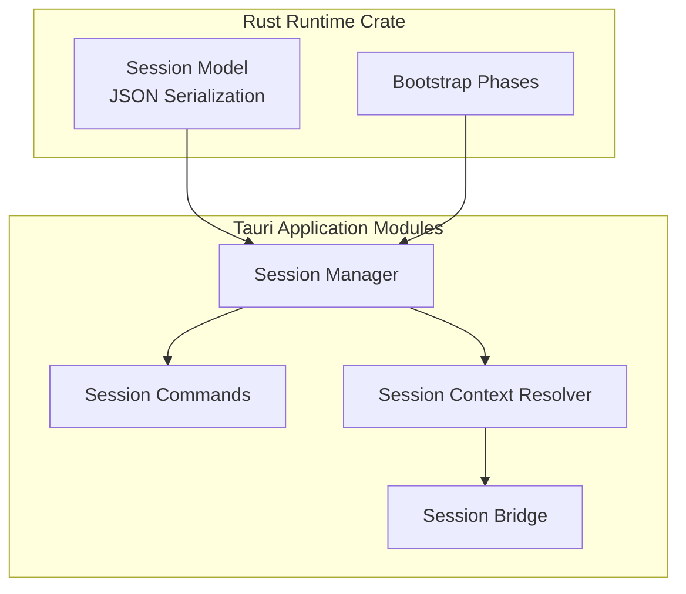
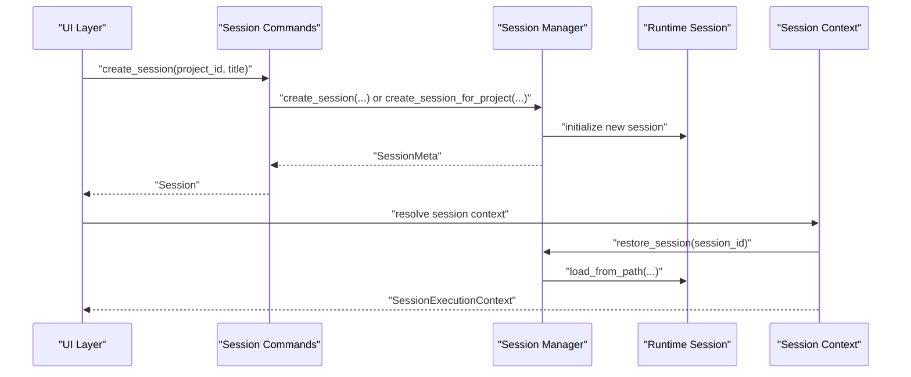
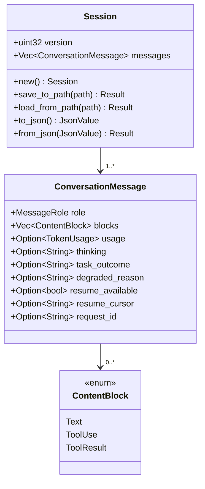
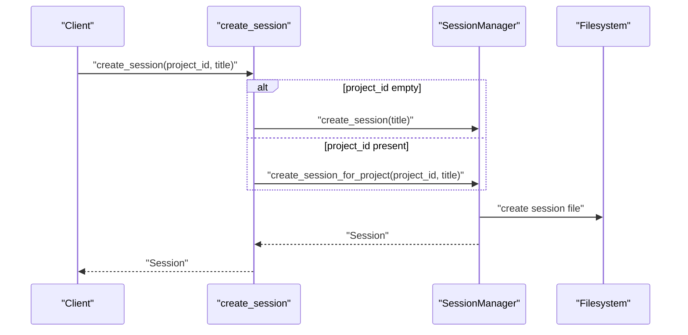
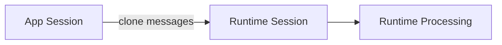
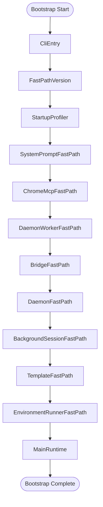
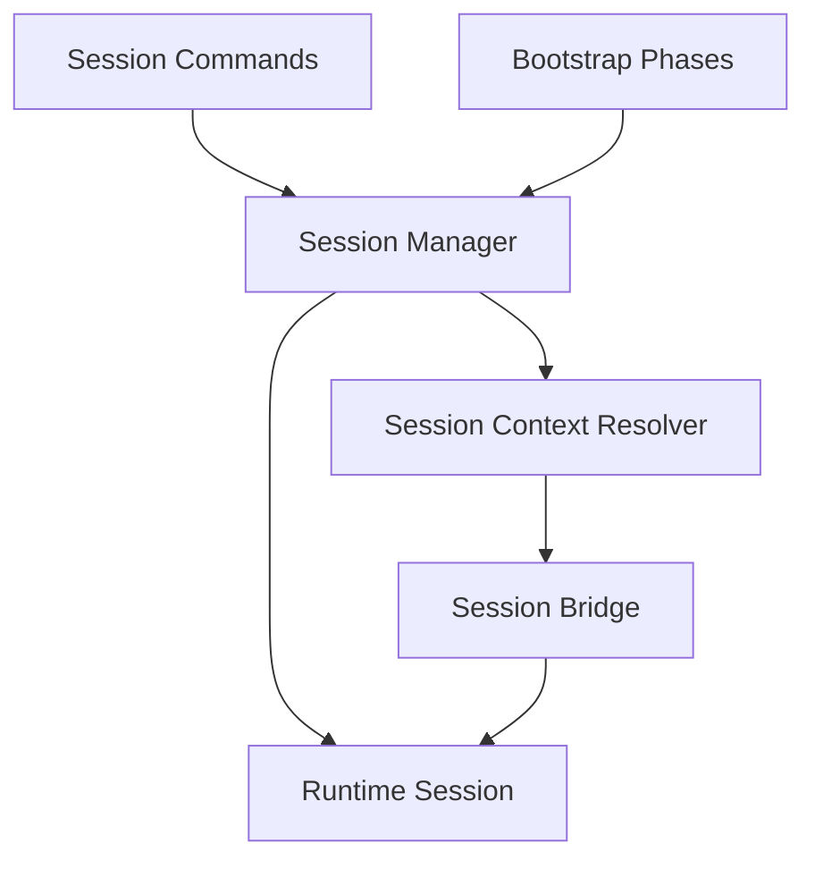

# Session Lifecycle

<cite>
**Referenced Files in This Document**
- [session.rs](file://rust/crates/runtime/src/session.rs)
- [session.rs](file://src-tauri/src/modules/runtime/session.rs)
- [session.rs](file://src-tauri/src/commands/session.rs)
- [session_context.rs](file://src-tauri/src/modules/control_plane/session_context.rs)
- [session_bridge.rs](file://src-tauri/src/modules/control_plane/session_bridge.rs)
- [bootstrap.rs](file://rust/crates/runtime/src/bootstrap.rs)
- [bootstrap.rs](file://src-tauri/src/modules/runtime/bootstrap.rs)
- [lib.rs](file://src-tauri/src/lib.rs)
</cite>

## Table of Contents
1. [Introduction](#introduction)
2. [Project Structure](#project-structure)
3. [Core Components](#core-components)
4. [Architecture Overview](#architecture-overview)
5. [Detailed Component Analysis](#detailed-component-analysis)
6. [Dependency Analysis](#dependency-analysis)
7. [Performance Considerations](#performance-considerations)
8. [Troubleshooting Guide](#troubleshooting-guide)
9. [Conclusion](#conclusion)

## Introduction
This document describes the session lifecycle management system in the If2Ai project. It explains how sessions are created, initialized, maintained, and terminated; how bootstrap procedures prepare the runtime; how session state is managed and persisted; and how snapshot-like functionality supports restoration and continuity. It also covers session isolation, resource allocation, and cleanup mechanisms, with practical examples of session startup, bootstrap configuration, and shutdown procedures.

## Project Structure
The session lifecycle spans both the Rust runtime crate and the Tauri application modules:
- Rust runtime crate defines the canonical session model and JSON serialization for persistence.
- Tauri modules define the application-level session manager, commands, and control-plane integration.
- Bootstrap phases orchestrate the runtime initialization sequence.

**Diagram sources**
- [session.rs:47-140](file://rust/crates/runtime/src/session.rs#L47-L140)
- [session.rs:62-155](file://src-tauri/src/modules/runtime/session.rs#L62-L155)
- [session.rs:10-135](file://src-tauri/src/commands/session.rs#L10-L135)
- [session_context.rs:52-137](file://src-tauri/src/modules/control_plane/session_context.rs#L52-L137)
- [session_bridge.rs:11-33](file://src-tauri/src/modules/control_plane/session_bridge.rs#L11-L33)
- [bootstrap.rs:17-56](file://rust/crates/runtime/src/bootstrap.rs#L17-L56)
- [bootstrap.rs:19-58](file://src-tauri/src/modules/runtime/bootstrap.rs#L19-L58)

**Section sources**
- [lib.rs:6-23](file://src-tauri/src/lib.rs#L6-L23)

## Core Components
- Session model and persistence: Defines the conversation message structure, content blocks, and JSON serialization/deserialization for saving and restoring sessions.
- Application session manager: Manages session lifecycle operations (create, list, delete, rename, pin, enable/disable memory) and integrates with the runtime session model.
- Control-plane session context: Resolves execution context for tools and commands bound to a session, including workdir and permission mode.
- Session bridge: Converts between application and runtime session representations for internal processing.
- Bootstrap phases: Defines the ordered runtime initialization sequence that prepares the environment for session execution.

Key responsibilities:
- Creation: Initialize a new session with default metadata and empty message list.
- Initialization: Load persisted state, apply bootstrap phases, and prepare runtime context.
- Termination: Persist final state, release resources, and clean up artifacts.
- Snapshot: Provide a structured representation suitable for persistence and restoration.

**Section sources**
- [session.rs:47-140](file://rust/crates/runtime/src/session.rs#L47-L140)
- [session.rs:62-155](file://src-tauri/src/modules/runtime/session.rs#L62-L155)
- [session.rs:10-135](file://src-tauri/src/commands/session.rs#L10-L135)
- [session_context.rs:52-137](file://src-tauri/src/modules/control_plane/session_context.rs#L52-L137)
- [session_bridge.rs:11-33](file://src-tauri/src/modules/control_plane/session_bridge.rs#L11-L33)
- [bootstrap.rs:17-56](file://rust/crates/runtime/src/bootstrap.rs#L17-L56)

## Architecture Overview
The session lifecycle is orchestrated by Tauri commands that delegate to the session manager. The manager coordinates with the runtime session model and control-plane context resolution. Bootstrap phases prepare the runtime environment before session execution begins.

**Diagram sources**
- [session.rs:14-34](file://src-tauri/src/commands/session.rs#L14-L34)
- [session_context.rs:69-88](file://src-tauri/src/modules/control_plane/session_context.rs#L69-L88)
- [session.rs:112-115](file://src-tauri/src/modules/runtime/session.rs#L112-L115)

## Detailed Component Analysis

### Session Model and Persistence
The session model encapsulates conversation messages and their content blocks, with robust JSON serialization and deserialization. It supports:
- Versioned storage to handle schema evolution.
- Message roles (system, user, assistant, tool) and content blocks (text, tool_use, tool_result).
- Optional fields for advanced runtime features (thinking, task outcome, degraded reason, resume info, request ID).
- Token usage tracking for cost and telemetry.

**Diagram sources**
- [session.rs:47-140](file://rust/crates/runtime/src/session.rs#L47-L140)
- [session.rs:62-155](file://src-tauri/src/modules/runtime/session.rs#L62-L155)

**Section sources**
- [session.rs:83-140](file://rust/crates/runtime/src/session.rs#L83-L140)
- [session.rs:98-155](file://src-tauri/src/modules/runtime/session.rs#L98-L155)

### Application Session Management
The Tauri module exposes commands for session lifecycle operations:
- Create session (legacy or project-scoped).
- List sessions (legacy and project-scoped).
- Delete session.
- Rename session.
- Pin/unpin session.
- Enable/disable session memory.
- Restore session with messages.

These commands delegate to the session manager, which coordinates persistence and state updates.

**Diagram sources**
- [session.rs:14-34](file://src-tauri/src/commands/session.rs#L14-L34)

**Section sources**
- [session.rs:10-135](file://src-tauri/src/commands/session.rs#L10-L135)

### Control-Plane Session Context Resolution
The session context resolver builds an immutable execution context for a given session:
- Determines project ownership and workdir.
- Falls back to current directory if project resolution fails.
- Produces a context with session ID, project ID, workdir, and permission mode.

**Diagram sources**
- [session_context.rs:69-137](file://src-tauri/src/modules/control_plane/session_context.rs#L69-L137)

**Section sources**
- [session_context.rs:52-137](file://src-tauri/src/modules/control_plane/session_context.rs#L52-L137)

### Session Bridge
The bridge converts between application and runtime session representations:
- Extracts messages from the application session.
- Preserves version and message history for runtime consumption.

**Diagram sources**
- [session_bridge.rs:11-20](file://src-tauri/src/modules/control_plane/session_bridge.rs#L11-L20)

**Section sources**
- [session_bridge.rs:11-33](file://src-tauri/src/modules/control_plane/session_bridge.rs#L11-L33)

### Bootstrap Procedures
Bootstrap phases define the ordered runtime initialization sequence:
- CLI entry, fast-path checks, startup profiling, system prompt fast-path, Chrome MCP fast-path, daemon worker fast-path, bridge fast-path, daemon fast-path, background session fast-path, template fast-path, environment runner fast-path, main runtime.

These phases ensure the environment is ready before session execution begins.

**Diagram sources**
- [bootstrap.rs:17-56](file://rust/crates/runtime/src/bootstrap.rs#L17-L56)
- [bootstrap.rs:19-58](file://src-tauri/src/modules/runtime/bootstrap.rs#L19-L58)

**Section sources**
- [bootstrap.rs:17-56](file://rust/crates/runtime/src/bootstrap.rs#L17-L56)
- [bootstrap.rs:19-58](file://src-tauri/src/modules/runtime/bootstrap.rs#L19-L58)

## Dependency Analysis
The session lifecycle depends on:
- Runtime session model for data structures and persistence.
- Tauri commands for user-triggered operations.
- Control-plane context resolver for execution scoping.
- Bootstrap phases for environment readiness.

**Diagram sources**
- [session.rs:14-34](file://src-tauri/src/commands/session.rs#L14-L34)
- [session_context.rs:52-137](file://src-tauri/src/modules/control_plane/session_context.rs#L52-L137)
- [session_bridge.rs:11-33](file://src-tauri/src/modules/control_plane/session_bridge.rs#L11-L33)
- [bootstrap.rs:17-56](file://rust/crates/runtime/src/bootstrap.rs#L17-L56)

**Section sources**
- [session.rs:10-135](file://src-tauri/src/commands/session.rs#L10-L135)
- [session_context.rs:52-137](file://src-tauri/src/modules/control_plane/session_context.rs#L52-L137)
- [session_bridge.rs:11-33](file://src-tauri/src/modules/control_plane/session_bridge.rs#L11-L33)
- [bootstrap.rs:17-56](file://rust/crates/runtime/src/bootstrap.rs#L17-L56)

## Performance Considerations
- Prefer incremental updates to minimize filesystem writes during active sessions.
- Use lazy deserialization when restoring sessions to reduce memory footprint.
- Batch context resolution operations to avoid redundant lookups.
- Keep bootstrap phases minimal and ordered to reduce startup latency.

## Troubleshooting Guide
Common issues and resolutions:
- Session restore failures: Verify file existence and JSON validity; ensure version compatibility.
- Project resolution errors: Confirm project exists and workdir is accessible; fallback behavior logs warnings.
- Context fingerprinting: Use logging to diagnose session and workdir binding mismatches.
- Bootstrap phase ordering: Ensure all required phases are included and executed in order.

**Section sources**
- [session.rs:112-140](file://rust/crates/runtime/src/session.rs#L112-L140)
- [session_context.rs:108-118](file://src-tauri/src/modules/control_plane/session_context.rs#L108-L118)

## Conclusion
The session lifecycle system combines a robust runtime session model with Tauri commands and control-plane context resolution. Bootstrap phases prepare the environment, while persistence ensures continuity across restarts. The bridge and context resolver enforce session isolation and proper resource allocation, enabling reliable session startup, execution, and shutdown.