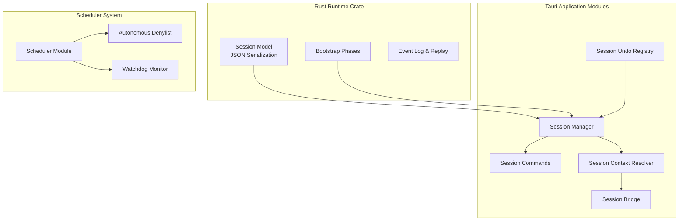
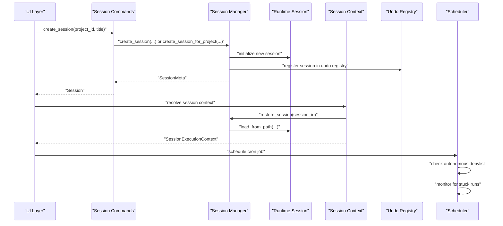
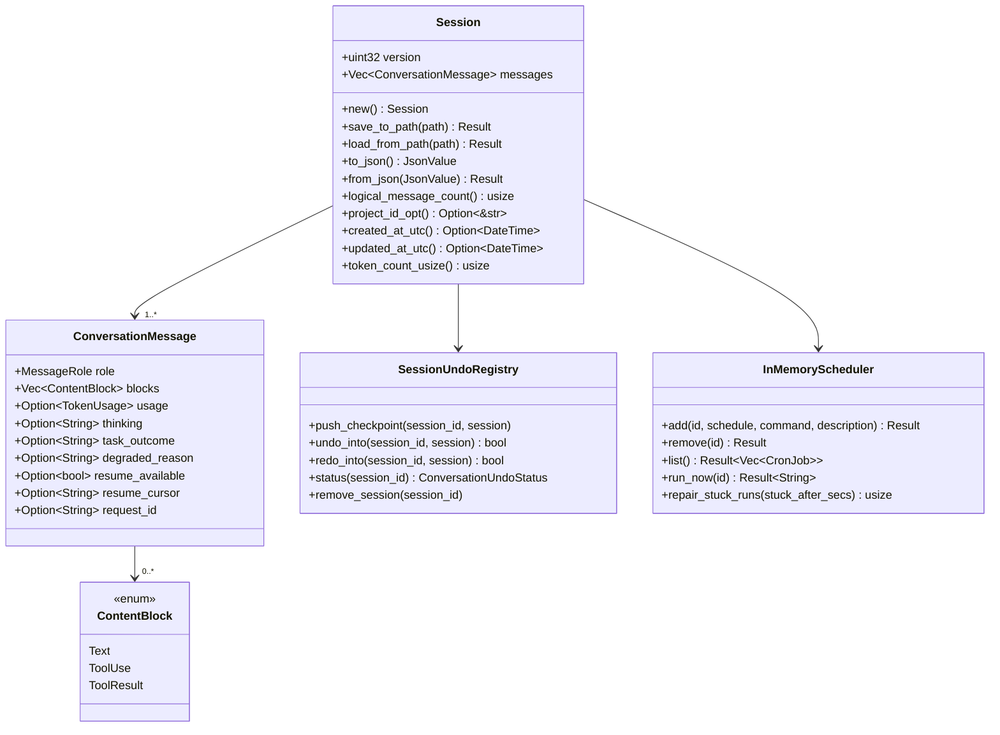
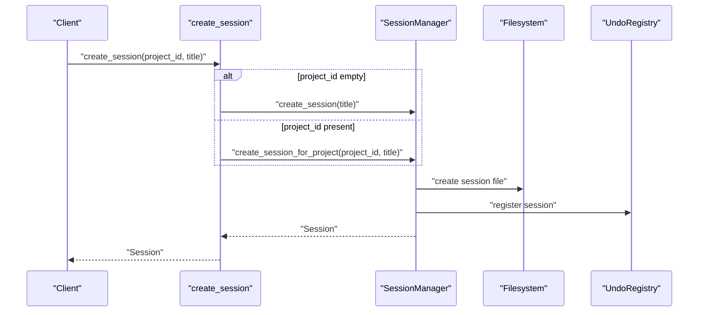
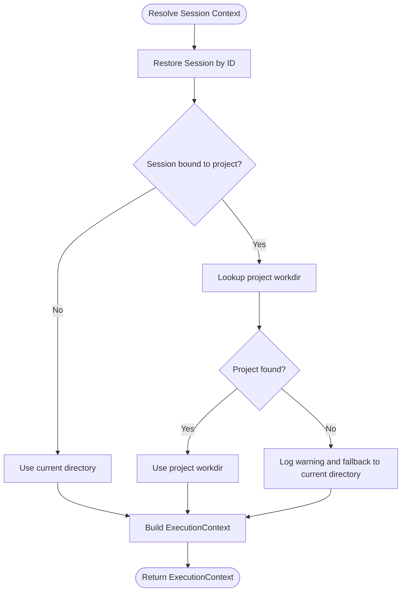
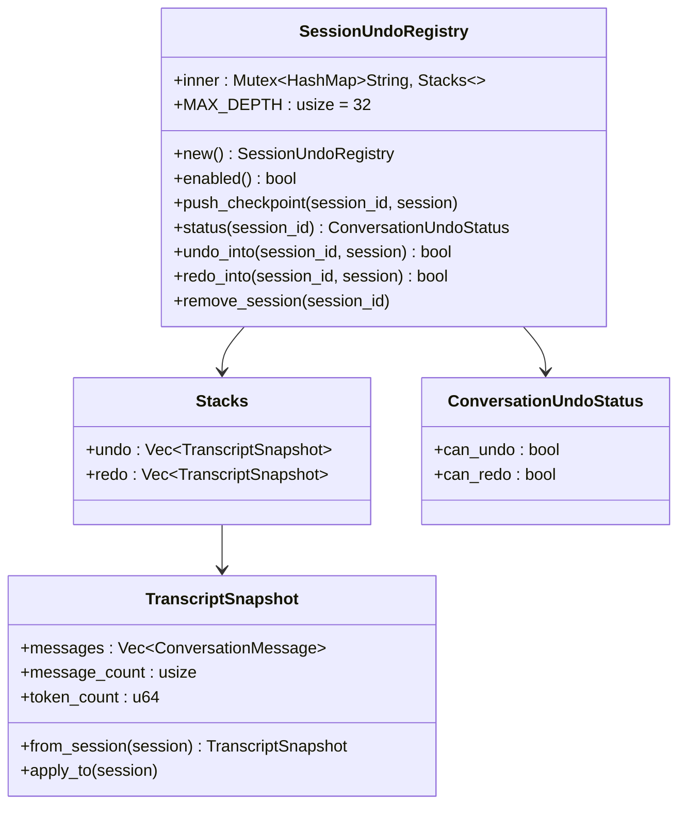
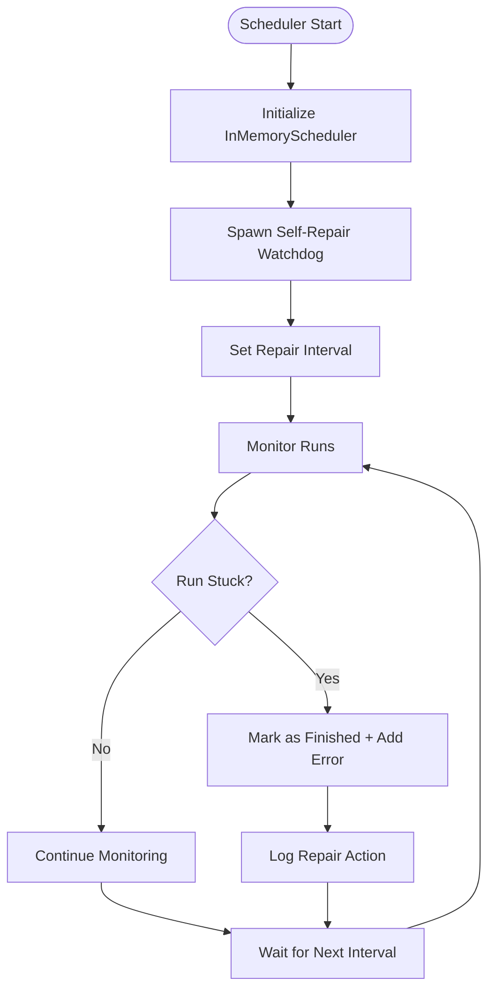
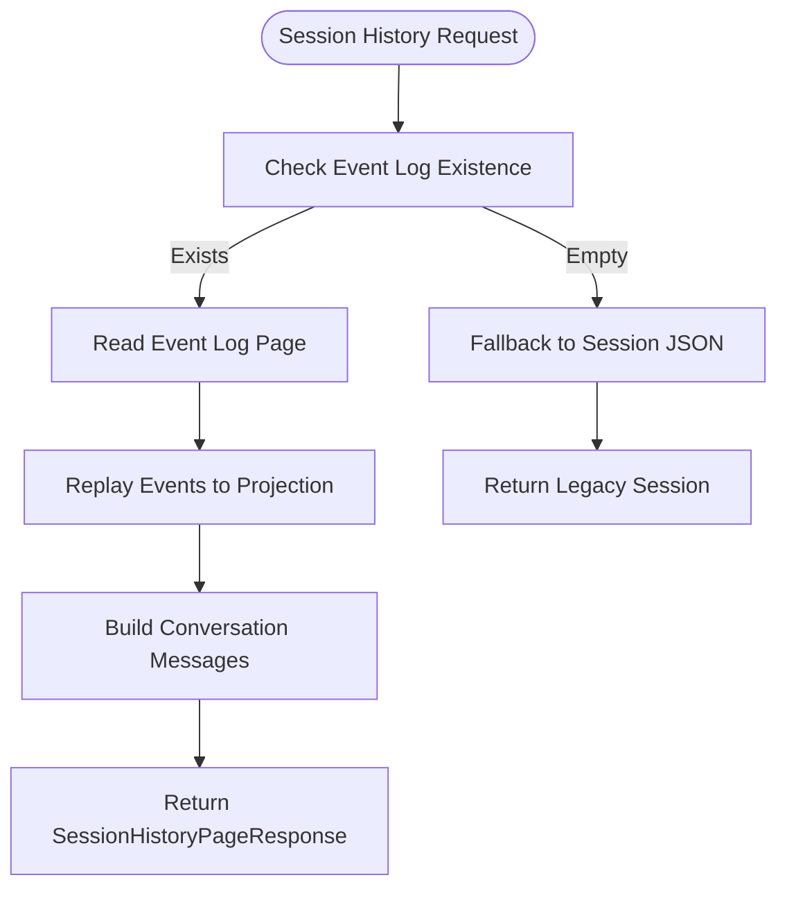
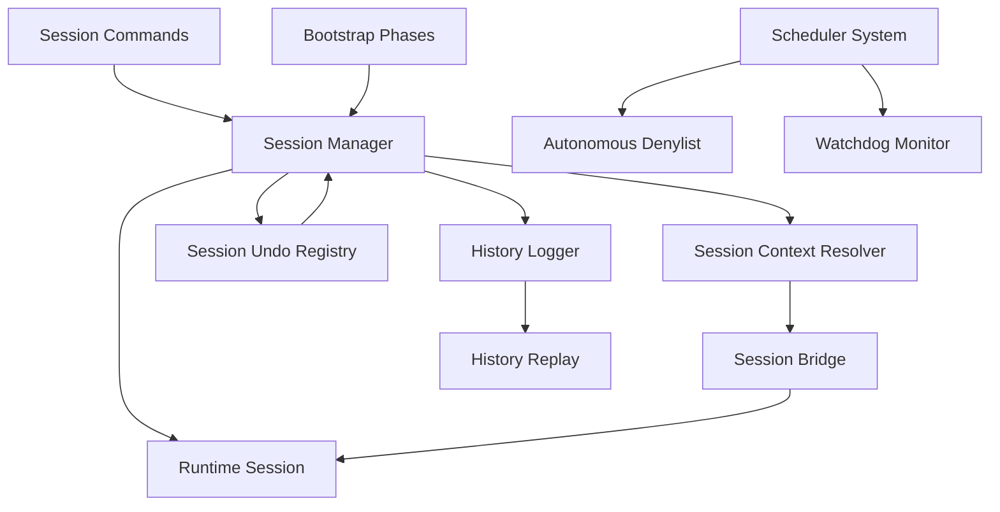

# Session Lifecycle

<cite>
**Referenced Files in This Document**
- [session.rs](file://rust/crates/runtime/src/session.rs)
- [session.rs](file://src-tauri/src/modules/runtime/session.rs)
- [session.rs](file://src-tauri/src/commands/session.rs)
- [session_context.rs](file://src-tauri/src/modules/control_plane/session_context.rs)
- [session_bridge.rs](file://src-tauri/src/modules/control_plane/session_bridge.rs)
- [bootstrap.rs](file://rust/crates/runtime/src/bootstrap.rs)
- [bootstrap.rs](file://src-tauri/src/modules/runtime/bootstrap.rs)
- [lib.rs](file://src-tauri/src/lib.rs)
- [session_undo.rs](file://src-tauri/src/modules/session/session_undo.rs)
- [manager.rs](file://src-tauri/src/modules/session/manager.rs)
- [mod.rs](file://src-tauri/src/modules/session/mod.rs)
- [scheduler_mod.rs](file://src-tauri/src/modules/scheduler/mod.rs)
- [autonomous_denylist.rs](file://src-tauri/src/modules/scheduler/autonomous_denylist.rs)
- [history.rs](file://src-tauri/src/modules/runtime/history.rs)
</cite>

## Update Summary
**Changes Made**
- Added comprehensive documentation for session undo registry with Tauri commands
- Documented scheduler watchdog with stuck detection and autonomous denylist boundaries
- Enhanced session persistence documentation with event log replay and paging
- Updated session lifecycle to include new checkpointing and recovery mechanisms
- Added documentation for enhanced session memory management features

## Table of Contents
1. [Introduction](#introduction)
2. [Project Structure](#project-structure)
3. [Core Components](#core-components)
4. [Architecture Overview](#architecture-overview)
5. [Detailed Component Analysis](#detailed-component-analysis)
6. [New Session Management Features](#new-session-management-features)
7. [Dependency Analysis](#dependency-analysis)
8. [Performance Considerations](#performance-considerations)
9. [Troubleshooting Guide](#troubleshooting-guide)
10. [Conclusion](#conclusion)

## Introduction
This document describes the session lifecycle management system in the If2Ai project. It explains how sessions are created, initialized, maintained, and terminated; how bootstrap procedures prepare the runtime; how session state is managed and persisted; and how snapshot-like functionality supports restoration and continuity. The system now includes advanced features such as session undo registry with Tauri commands, scheduler watchdog with stuck detection, autonomous denylist boundaries, and enhanced session persistence with event log replay and paging.

## Project Structure
The session lifecycle spans both the Rust runtime crate and the Tauri application modules:
- Rust runtime crate defines the canonical session model and JSON serialization for persistence.
- Tauri modules define the application-level session manager, commands, and control-plane integration.
- Bootstrap phases orchestrate the runtime initialization sequence.
- New session undo registry provides ephemeral undo/redo functionality.
- Scheduler module manages cron jobs with autonomous denylist enforcement and watchdog monitoring.
- Enhanced persistence system supports event log replay and pagination.

**Diagram sources**
- [session.rs:47-140](file://rust/crates/runtime/src/session.rs#L47-L140)
- [session.rs:62-155](file://src-tauri/src/modules/runtime/session.rs#L62-L155)
- [session.rs:10-135](file://src-tauri/src/commands/session.rs#L10-L135)
- [session_context.rs:52-137](file://src-tauri/src/modules/control_plane/session_context.rs#L52-L137)
- [session_bridge.rs:11-33](file://src-tauri/src/modules/control_plane/session_bridge.rs#L11-L33)
- [session_undo.rs:55-178](file://src-tauri/src/modules/session/session_undo.rs#L55-L178)
- [scheduler_mod.rs:1-351](file://src-tauri/src/modules/scheduler/mod.rs#L1-L351)
- [autonomous_denylist.rs:1-39](file://src-tauri/src/modules/scheduler/autonomous_denylist.rs#L1-L39)
- [history.rs:1-510](file://src-tauri/src/modules/runtime/history.rs#L1-L510)

**Section sources**
- [lib.rs:6-23](file://src-tauri/src/lib.rs#L6-L23)

## Core Components
- Session model and persistence: Defines the conversation message structure, content blocks, and JSON serialization/deserialization for saving and restoring sessions.
- Application session manager: Manages session lifecycle operations (create, list, delete, rename, pin, enable/disable memory) and integrates with the runtime session model.
- Control-plane session context: Resolves execution context for tools and commands bound to a session, including workdir and permission mode.
- Session bridge: Converts between application and runtime session representations for internal processing.
- Bootstrap phases: Defines the ordered runtime initialization sequence that prepares the environment for session execution.
- **New**: Session undo registry: Provides ephemeral undo/redo functionality with configurable depth and environment-based enablement.
- **New**: Scheduler system: Manages cron jobs with autonomous denylist enforcement and watchdog monitoring for stuck executions.
- **New**: Enhanced persistence: Supports event log replay and pagination for historical session reconstruction.

Key responsibilities:
- Creation: Initialize a new session with default metadata and empty message list.
- Initialization: Load persisted state, apply bootstrap phases, and prepare runtime context.
- Termination: Persist final state, release resources, and clean up artifacts.
- Snapshot: Provide a structured representation suitable for persistence and restoration.
- **New**: Undo/Redo: Maintain ephemeral transcript snapshots for user interaction recovery.
- **New**: Monitoring: Detect and repair stuck scheduled operations automatically.

**Section sources**
- [session.rs:47-140](file://rust/crates/runtime/src/session.rs#L47-L140)
- [session.rs:62-155](file://src-tauri/src/modules/runtime/session.rs#L62-L155)
- [session.rs:10-135](file://src-tauri/src/commands/session.rs#L10-L135)
- [session_context.rs:52-137](file://src-tauri/src/modules/control_plane/session_context.rs#L52-L137)
- [session_bridge.rs:11-33](file://src-tauri/src/modules/control_plane/session_bridge.rs#L11-L33)
- [bootstrap.rs:17-56](file://rust/crates/runtime/src/bootstrap.rs#L17-L56)
- [session_undo.rs:55-178](file://src-tauri/src/modules/session/session_undo.rs#L55-L178)
- [scheduler_mod.rs:1-351](file://src-tauri/src/modules/scheduler/mod.rs#L1-L351)

## Architecture Overview
The session lifecycle is orchestrated by Tauri commands that delegate to the session manager. The manager coordinates with the runtime session model and control-plane context resolution. Bootstrap phases prepare the runtime environment before session execution begins. The new undo registry provides ephemeral state recovery, while the scheduler system monitors and maintains system health.

**Diagram sources**
- [session.rs:14-34](file://src-tauri/src/commands/session.rs#L14-L34)
- [session_context.rs:69-88](file://src-tauri/src/modules/control_plane/session_context.rs#L69-L88)
- [session.rs:112-115](file://src-tauri/src/modules/runtime/session.rs#L112-L115)
- [session_undo.rs:103-115](file://src-tauri/src/modules/session/session_undo.rs#L103-L115)
- [scheduler_mod.rs:248-311](file://src-tauri/src/modules/scheduler/mod.rs#L248-L311)

## Detailed Component Analysis

### Session Model and Persistence
The session model encapsulates conversation messages and their content blocks, with robust JSON serialization and deserialization. It supports:
- Versioned storage to handle schema evolution.
- Message roles (system, user, assistant, tool) and content blocks (text, tool_use, tool_result).
- Optional fields for advanced runtime features (thinking, task outcome, degraded reason, resume info, request ID).
- Token usage tracking for cost and telemetry.
- Enhanced persistence with event log replay and pagination support.

**Diagram sources**
- [session.rs:47-140](file://rust/crates/runtime/src/session.rs#L47-L140)
- [session.rs:62-155](file://src-tauri/src/modules/runtime/session.rs#L62-L155)
- [session_undo.rs:55-178](file://src-tauri/src/modules/session/session_undo.rs#L55-L178)
- [scheduler_mod.rs:91-237](file://src-tauri/src/modules/scheduler/mod.rs#L91-L237)

**Section sources**
- [session.rs:83-140](file://rust/crates/runtime/src/session.rs#L83-L140)
- [session.rs:98-155](file://src-tauri/src/modules/runtime/session.rs#L98-L155)
- [manager.rs:144-327](file://src-tauri/src/modules/session/manager.rs#L144-L327)

### Application Session Management
The Tauri module exposes commands for session lifecycle operations:
- Create session (legacy or project-scoped).
- List sessions (legacy and project-scoped).
- Delete session.
- Rename session.
- Pin/unpin session.
- Enable/disable session memory.
- Restore session with messages.
- **New**: Undo/redo operations with status checking.
- **New**: Session history paging with event log replay.

These commands delegate to the session manager, which coordinates persistence and state updates.

**Diagram sources**
- [session.rs:14-34](file://src-tauri/src/commands/session.rs#L14-L34)
- [session_undo.rs:103-115](file://src-tauri/src/modules/session/session_undo.rs#L103-L115)

**Section sources**
- [session.rs:10-135](file://src-tauri/src/commands/session.rs#L10-L135)
- [session.rs:330-360](file://src-tauri/src/commands/session.rs#L330-L360)

### Control-Plane Session Context Resolution
The session context resolver builds an immutable execution context for a given session:
- Determines project ownership and workdir.
- Falls back to current directory if project resolution fails.
- Produces a context with session ID, project ID, workdir, and permission mode.

**Diagram sources**
- [session_context.rs:69-137](file://src-tauri/src/modules/control_plane/session_context.rs#L69-L137)

**Section sources**
- [session_context.rs:52-137](file://src-tauri/src/modules/control_plane/session_context.rs#L52-L137)

### Session Bridge
The bridge converts between application and runtime session representations:
- Extracts messages from the application session.
- Preserves version and message history for runtime consumption.

**Diagram sources**
- [session_bridge.rs:11-20](file://src-tauri/src/modules/control_plane/session_bridge.rs#L11-L20)

**Section sources**
- [session_bridge.rs:11-33](file://src-tauri/src/modules/control_plane/session_bridge.rs#L11-L33)

### Bootstrap Procedures
Bootstrap phases define the ordered runtime initialization sequence:
- CLI entry, fast-path checks, startup profiling, system prompt fast-path, Chrome MCP fast-path, daemon worker fast-path, bridge fast-path, daemon fast-path, background session fast-path, template fast-path, environment runner fast-path, main runtime.

These phases ensure the environment is ready before session execution begins.

**Diagram sources**
- [bootstrap.rs:17-56](file://rust/crates/runtime/src/bootstrap.rs#L17-L56)
- [bootstrap.rs:19-58](file://src-tauri/src/modules/runtime/bootstrap.rs#L19-L58)

**Section sources**
- [bootstrap.rs:17-56](file://rust/crates/runtime/src/bootstrap.rs#L17-L56)
- [bootstrap.rs:19-58](file://src-tauri/src/modules/runtime/bootstrap.rs#L19-L58)

## New Session Management Features

### Session Undo Registry
The session undo registry provides ephemeral undo/redo functionality for conversation transcripts:
- Maintains in-memory undo/redo stacks with configurable depth (default 32 levels).
- Environment-based enablement controlled by IF2AI_CONVERSATION_UNDO variable.
- Automatic checkpoint creation before user turns and classic invalidation behavior.
- Thread-safe operation using mutex protection with poison handling.

**Diagram sources**
- [session_undo.rs:55-178](file://src-tauri/src/modules/session/session_undo.rs#L55-L178)

**Section sources**
- [session_undo.rs:1-178](file://src-tauri/src/modules/session/session_undo.rs#L1-L178)
- [session.rs:330-360](file://src-tauri/src/commands/session.rs#L330-L360)

### Scheduler Watchdog with Stuck Detection
The scheduler system provides comprehensive monitoring and maintenance:
- Cron job scheduling with standard cron expressions.
- Autonomous denylist enforcement for safety in headless contexts.
- Self-repair watchdog that detects and repairs stuck cron runs.
- Unified configuration using IF2AI_STUCK_AFTER_SECS environment variable.
- Fallback to dedicated thread when no Tokio runtime is available.

**Diagram sources**
- [scheduler_mod.rs:248-311](file://src-tauri/src/modules/scheduler/mod.rs#L248-L311)
- [autonomous_denylist.rs:23-39](file://src-tauri/src/modules/scheduler/autonomous_denylist.rs#L23-L39)

**Section sources**
- [scheduler_mod.rs:1-351](file://src-tauri/src/modules/scheduler/mod.rs#L1-L351)
- [autonomous_denylist.rs:1-39](file://src-tauri/src/modules/scheduler/autonomous_denylist.rs#L1-L39)

### Enhanced Session Persistence with Event Log Replay
The enhanced persistence system supports historical session reconstruction:
- Canonical run event log for append-only recording of session activities.
- Paging support with cursor-based navigation and configurable limits.
- Stable replay engine that reconstructs conversation projections from events.
- Fallback compatibility with legacy session.json files.
- Comprehensive coverage of user, assistant, thinking, tool_use, tool_result, and completion events.

**Diagram sources**
- [history.rs:18-115](file://src-tauri/src/modules/runtime/history.rs#L18-L115)
- [history.rs:117-130](file://src-tauri/src/modules/runtime/history.rs#L117-L130)
- [session.rs:369-412](file://src-tauri/src/commands/session.rs#L369-L412)

**Section sources**
- [history.rs:1-510](file://src-tauri/src/modules/runtime/history.rs#L1-L510)
- [session.rs:369-412](file://src-tauri/src/commands/session.rs#L369-L412)

### Session Memory Management Enhancements
Enhanced memory management provides granular control over session memory operations:
- Per-session memory toggle with persistent state tracking.
- Timestamp-based silence windows for compile pipeline filtering.
- Master switch integration with three-state logic (master OFF → false; master ON + session toggle → effective state).
- Non-destructive toggling that preserves session integrity.

**Section sources**
- [manager.rs:721-744](file://src-tauri/src/modules/session/manager.rs#L721-L744)
- [session.rs:261-281](file://src-tauri/src/commands/session.rs#L261-L281)

## Dependency Analysis
The session lifecycle depends on:
- Runtime session model for data structures and persistence.
- Tauri commands for user-triggered operations.
- Control-plane context resolver for execution scoping.
- Bootstrap phases for environment readiness.
- **New**: Session undo registry for ephemeral state recovery.
- **New**: Scheduler system for automated maintenance and monitoring.
- **New**: Event log system for historical session reconstruction.

**Diagram sources**
- [session.rs:14-34](file://src-tauri/src/commands/session.rs#L14-L34)
- [session_context.rs:52-137](file://src-tauri/src/modules/control_plane/session_context.rs#L52-L137)
- [session_bridge.rs:11-33](file://src-tauri/src/modules/control_plane/session_bridge.rs#L11-L33)
- [bootstrap.rs:17-56](file://rust/crates/runtime/src/bootstrap.rs#L17-L56)
- [session_undo.rs:55-178](file://src-tauri/src/modules/session/session_undo.rs#L55-L178)
- [scheduler_mod.rs:1-351](file://src-tauri/src/modules/scheduler/mod.rs#L1-L351)
- [history.rs:1-510](file://src-tauri/src/modules/runtime/history.rs#L1-L510)

**Section sources**
- [session.rs:10-135](file://src-tauri/src/commands/session.rs#L10-L135)
- [session_context.rs:52-137](file://src-tauri/src/modules/control_plane/session_context.rs#L52-L137)
- [session_bridge.rs:11-33](file://src-tauri/src/modules/control_plane/session_bridge.rs#L11-L33)
- [bootstrap.rs:17-56](file://rust/crates/runtime/src/bootstrap.rs#L17-L56)
- [session_undo.rs:55-178](file://src-tauri/src/modules/session/session_undo.rs#L55-L178)
- [scheduler_mod.rs:1-351](file://src-tauri/src/modules/scheduler/mod.rs#L1-L351)

## Performance Considerations
- Prefer incremental updates to minimize filesystem writes during active sessions.
- Use lazy deserialization when restoring sessions to reduce memory footprint.
- Batch context resolution operations to avoid redundant lookups.
- Keep bootstrap phases minimal and ordered to reduce startup latency.
- **New**: Configure undo registry depth appropriately for memory constraints.
- **New**: Set scheduler watchdog intervals based on system load and criticality.
- **New**: Use event log paging to manage large session histories efficiently.

## Troubleshooting Guide
Common issues and resolutions:
- Session restore failures: Verify file existence and JSON validity; ensure version compatibility.
- Project resolution errors: Confirm project exists and workdir is accessible; fallback behavior logs warnings.
- Context fingerprinting: Use logging to diagnose session and workdir binding mismatches.
- Bootstrap phase ordering: Ensure all required phases are included and executed in order.
- **New**: Undo registry issues: Check IF2AI_CONVERSATION_UNDO environment variable; verify session registration.
- **New**: Scheduler stuck runs: Monitor watchdog logs; adjust IF2AI_STUCK_AFTER_SECS and repair intervals.
- **New**: Event log replay failures: Verify event log integrity; use fallback session.json when needed.
- **New**: Memory toggle conflicts: Check master switch state and session-specific overrides.

**Section sources**
- [session.rs:112-140](file://rust/crates/runtime/src/session.rs#L112-L140)
- [session_context.rs:108-118](file://src-tauri/src/modules/control_plane/session_context.rs#L108-L118)
- [session_undo.rs:92-100](file://src-tauri/src/modules/session/session_undo.rs#L92-L100)
- [scheduler_mod.rs:248-311](file://src-tauri/src/modules/scheduler/mod.rs#L248-L311)

## Conclusion
The session lifecycle system combines a robust runtime session model with Tauri commands and control-plane context resolution. Bootstrap phases prepare the environment, while persistence ensures continuity across restarts. The bridge and context resolver enforce session isolation and proper resource allocation. The new session undo registry provides user-friendly state recovery, the scheduler system ensures system reliability through watchdog monitoring, and the enhanced persistence system supports comprehensive historical session reconstruction. Together these features enable reliable session startup, execution, and shutdown with advanced operational capabilities.