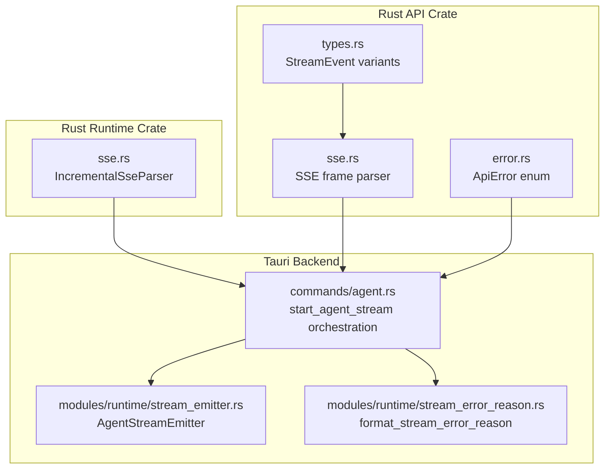
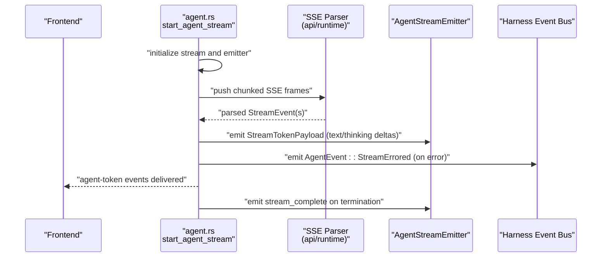
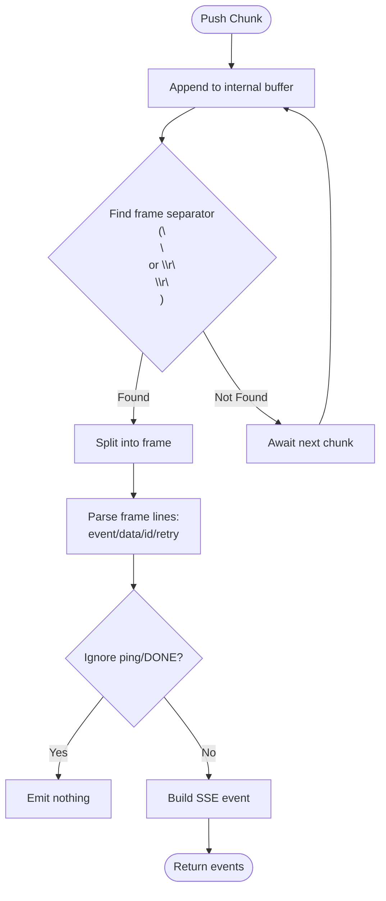
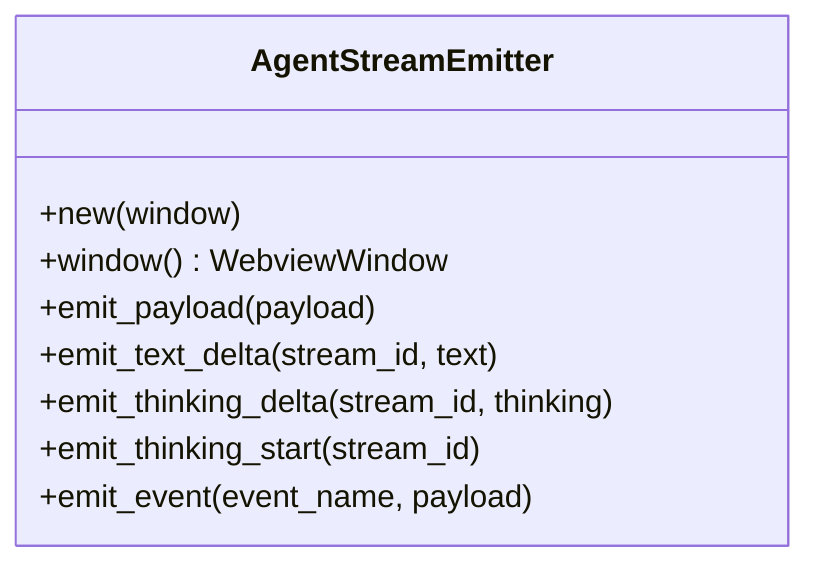
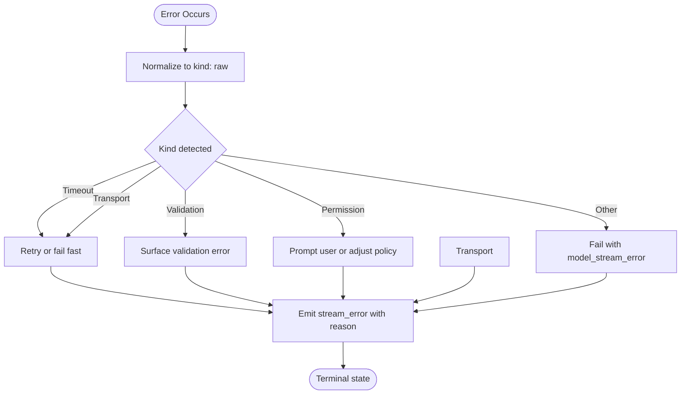
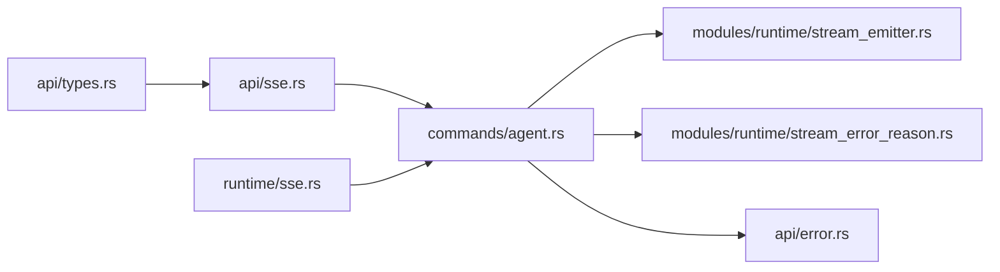

# Streaming Processing

<cite>
**Referenced Files in This Document**
- [sse.rs](file://rust/crates/api/src/sse.rs)
- [types.rs](file://rust/crates/api/src/types.rs)
- [error.rs](file://rust/crates/api/src/error.rs)
- [sse.rs](file://rust/crates/runtime/src/sse.rs)
- [stream_emitter.rs](file://src-tauri/src/modules/runtime/stream_emitter.rs)
- [stream_error_reason.rs](file://src-tauri/src/modules/runtime/stream_error_reason.rs)
- [agent.rs](file://src-tauri/src/commands/agent.rs)
- [GFR-004-extract-stream-emitter.md](file://docs/packs/refactor/GFR-004-extract-stream-emitter.md)
- [GFR-005b-extract-stream-error-reason.md](file://docs/packs/refactor/GFR-005b-extract-stream-error-reason.md)
- [phase-m1-memory-and-stream-file-level-plan.md](file://docs/_legacy/exec-plans/active/phase-m1-memory-and-stream-file-level-plan.md)
</cite>

## Table of Contents
1. [Introduction](#introduction)
2. [Project Structure](#project-structure)
3. [Core Components](#core-components)
4. [Architecture Overview](#architecture-overview)
5. [Detailed Component Analysis](#detailed-component-analysis)
6. [Dependency Analysis](#dependency-analysis)
7. [Performance Considerations](#performance-considerations)
8. [Troubleshooting Guide](#troubleshooting-guide)
9. [Conclusion](#conclusion)

## Introduction
This document explains the streaming processing system that powers real-time generation and event delivery in the application. It covers:
- How streams are emitted to the frontend via a unified emitter
- How Server-Sent Events (SSE) frames are parsed and transformed into structured events
- How errors are classified, propagated, and surfaced to the UI
- The lifecycle of a streaming session from initialization to completion or failure
- Practical examples of initializing a stream, handling errors, and processing SSE events

## Project Structure
The streaming pipeline spans Rust backend crates and Tauri command handlers:
- SSE parsing and event types live in two Rust crates for API and runtime contexts
- A centralized stream emitter encapsulates event emission to the frontend
- Error classification utilities normalize error reasons for consistent reporting
- The agent command orchestrates streaming, integrates SSE parsing, and emits UI events

**Diagram sources**
- [types.rs:216-224](file://rust/crates/api/src/types.rs#L216-L224)
- [sse.rs:1-106](file://rust/crates/api/src/sse.rs#L1-L106)
- [error.rs:1-136](file://rust/crates/api/src/error.rs#L1-L136)
- [sse.rs:1-129](file://rust/crates/runtime/src/sse.rs#L1-L129)
- [agent.rs:1-200](file://src-tauri/src/commands/agent.rs#L1-L200)
- [stream_emitter.rs:212-277](file://src-tauri/src/modules/runtime/stream_emitter.rs#L212-L277)
- [stream_error_reason.rs:1-35](file://src-tauri/src/modules/runtime/stream_error_reason.rs#L1-L35)

**Section sources**
- [types.rs:1-224](file://rust/crates/api/src/types.rs#L1-L224)
- [sse.rs:1-106](file://rust/crates/api/src/sse.rs#L1-L106)
- [sse.rs:1-129](file://rust/crates/runtime/src/sse.rs#L1-L129)
- [stream_emitter.rs:212-277](file://src-tauri/src/modules/runtime/stream_emitter.rs#L212-L277)
- [stream_error_reason.rs:1-35](file://src-tauri/src/modules/runtime/stream_error_reason.rs#L1-L35)
- [agent.rs:1-200](file://src-tauri/src/commands/agent.rs#L1-L200)

## Core Components
- StreamEvent model: Defines structured streaming events (start, delta, stop) for content blocks and messages.
- SSE parsers: Two parsers handle incremental and framed SSE parsing with robust frame separation and JSON payload extraction.
- AgentStreamEmitter: A thin wrapper around the Tauri window that emits a unified event type to the frontend.
- Error classification: Normalizes backend errors into stable reason kinds for UI and diagnostics.
- Agent orchestration: The agent command wires together streaming, SSE parsing, and event emission.

**Section sources**
- [types.rs:166-224](file://rust/crates/api/src/types.rs#L166-L224)
- [sse.rs:1-106](file://rust/crates/api/src/sse.rs#L1-L106)
- [sse.rs:1-129](file://rust/crates/runtime/src/sse.rs#L1-L129)
- [stream_emitter.rs:212-277](file://src-tauri/src/modules/runtime/stream_emitter.rs#L212-L277)
- [stream_error_reason.rs:1-35](file://src-tauri/src/modules/runtime/stream_error_reason.rs#L1-L35)
- [agent.rs:1-200](file://src-tauri/src/commands/agent.rs#L1-L200)

## Architecture Overview
The streaming architecture follows a clear flow:
- The agent command initiates a streaming request and prepares a session-scoped emitter
- SSE frames arrive incrementally and are parsed into structured events
- Each event triggers an emission to the frontend via the stream emitter
- Errors are captured, normalized, and emitted as a terminal stream_error event
- The lifecycle concludes with a stream_complete event when the stream ends

**Diagram sources**
- [agent.rs:1536-1651](file://src-tauri/src/commands/agent.rs#L1536-L1651)
- [sse.rs:15-38](file://rust/crates/api/src/sse.rs#L15-L38)
- [sse.rs:26-54](file://rust/crates/runtime/src/sse.rs#L26-L54)
- [stream_emitter.rs:246-277](file://src-tauri/src/modules/runtime/stream_emitter.rs#L246-L277)

## Detailed Component Analysis

### SSE Parsing and Frame Handling
Two parsers implement SSE semantics:
- API crate parser: Buffers bytes, detects frame boundaries, ignores ping/DONE frames, and deserializes JSON payloads into StreamEvent variants.
- Runtime crate incremental parser: Processes UTF-8 chunks line-by-line, aggregates data fields across multiple lines, and emits complete SSE events.

**Diagram sources**
- [sse.rs:15-61](file://rust/crates/api/src/sse.rs#L15-L61)
- [sse.rs:26-96](file://rust/crates/runtime/src/sse.rs#L26-L96)

**Section sources**
- [sse.rs:1-106](file://rust/crates/api/src/sse.rs#L1-L106)
- [sse.rs:1-129](file://rust/crates/runtime/src/sse.rs#L1-L129)

### Stream Emission Mechanisms
The AgentStreamEmitter provides a single boundary for emitting streaming tokens and markers to the frontend:
- emit_payload: Emits a StreamTokenPayload under the unified event name
- Convenience methods: emit_text_delta, emit_thinking_delta, emit_thinking_start
- Fallback emit_event: For non-standard events during transitional periods

**Diagram sources**
- [stream_emitter.rs:212-277](file://src-tauri/src/modules/runtime/stream_emitter.rs#L212-L277)

**Section sources**
- [stream_emitter.rs:212-277](file://src-tauri/src/modules/runtime/stream_emitter.rs#L212-L277)

### Error Reason Handling and Propagation
Errors encountered during streaming are normalized into stable reason kinds:
- format_stream_error_reason: Converts raw errors into a kind: raw format based on keywords
- is_network_timeout_reason: Detects network timeout conditions for retry decisions
- Agent orchestration: Emits a terminal stream_error event with the reason and optional harness event

**Diagram sources**
- [stream_error_reason.rs:8-34](file://src-tauri/src/modules/runtime/stream_error_reason.rs#L8-L34)
- [agent.rs:1536-1651](file://src-tauri/src/commands/agent.rs#L1536-L1651)

**Section sources**
- [stream_error_reason.rs:1-35](file://src-tauri/src/modules/runtime/stream_error_reason.rs#L1-L35)
- [agent.rs:1536-1651](file://src-tauri/src/commands/agent.rs#L1536-L1651)

### SSE Protocol Implementation
The SSE implementation supports:
- Multi-line data aggregation across multiple data: fields
- Ignoring comments and ping events
- Recognizing [DONE] sentinel to terminate cleanly
- Robust frame detection supporting both LF and CRLF separators

Key behaviors:
- parse_frame ignores empty frames and ping events
- SseParser.finish handles trailing frames
- IncrementalSseParser accumulates partial lines and emits complete events

**Section sources**
- [sse.rs:63-101](file://rust/crates/api/src/sse.rs#L63-L101)
- [sse.rs:56-96](file://rust/crates/runtime/src/sse.rs#L56-L96)

### Stream Lifecycle and Event Broadcasting
Lifecycle stages:
- Initialization: Create a session-scoped AgentStreamEmitter bound to the Tauri window
- Streaming: Push SSE chunks, parse events, and emit text_delta/thinking_delta/thinking_start
- Completion: Emit stream_complete when the stream finishes
- Failure: Emit stream_error with a normalized reason and optionally emit a harness event

Integration points:
- StreamTokenPayload carries event_type, stream_id, and content-specific fields
- Harness event bus receives AgentEvent::StreamErrored for observability

**Section sources**
- [stream_emitter.rs:212-277](file://src-tauri/src/modules/runtime/stream_emitter.rs#L212-L277)
- [phase-m1-memory-and-stream-file-level-plan.md:216-275](file://docs/_legacy/exec-plans/active/phase-m1-memory-and-stream-file-level-plan.md#L216-L275)
- [GFR-004-extract-stream-emitter.md:1-62](file://docs/packs/refactor/GFR-004-extract-stream-emitter.md#L1-L62)
- [GFR-005b-extract-stream-error-reason.md:104-127](file://docs/packs/refactor/GFR-005b-extract-stream-error-reason.md#L104-L127)

## Dependency Analysis
The streaming subsystem exhibits clean separation of concerns:
- API crate: Defines event models and SSE parsing tailored for HTTP responses
- Runtime crate: Provides incremental parsing suitable for streaming IO
- Tauri backend: Orchestrates the lifecycle, normalizes errors, and emits UI events
- Refactoring artifacts: GFR-004 consolidates emissions; GFR-005b extracts error classification

**Diagram sources**
- [types.rs:216-224](file://rust/crates/api/src/types.rs#L216-L224)
- [sse.rs:1-106](file://rust/crates/api/src/sse.rs#L1-L106)
- [sse.rs:1-129](file://rust/crates/runtime/src/sse.rs#L1-L129)
- [agent.rs:1-200](file://src-tauri/src/commands/agent.rs#L1-L200)
- [stream_emitter.rs:212-277](file://src-tauri/src/modules/runtime/stream_emitter.rs#L212-L277)
- [stream_error_reason.rs:1-35](file://src-tauri/src/modules/runtime/stream_error_reason.rs#L1-L35)
- [error.rs:1-136](file://rust/crates/api/src/error.rs#L1-L136)

**Section sources**
- [types.rs:1-224](file://rust/crates/api/src/types.rs#L1-L224)
- [sse.rs:1-106](file://rust/crates/api/src/sse.rs#L1-L106)
- [sse.rs:1-129](file://rust/crates/runtime/src/sse.rs#L1-L129)
- [agent.rs:1-200](file://src-tauri/src/commands/agent.rs#L1-L200)
- [stream_emitter.rs:212-277](file://src-tauri/src/modules/runtime/stream_emitter.rs#L212-L277)
- [stream_error_reason.rs:1-35](file://src-tauri/src/modules/runtime/stream_error_reason.rs#L1-L35)
- [error.rs:1-136](file://rust/crates/api/src/error.rs#L1-L136)

## Performance Considerations
- Incremental parsing minimizes allocations by processing chunks line-by-line
- SSE frame detection avoids unnecessary copies by slicing buffers
- Payload deserialization occurs only when complete frames are available
- Emission failures are logged at trace level and do not block the agent loop

## Troubleshooting Guide
Common scenarios and remedies:
- Empty or ping frames: Expected behavior; frames are ignored
- [DONE] sentinel: Terminates the stream gracefully
- Network timeouts: May trigger limited retries depending on orchestration logic
- JSON parse errors: Surface as invalid SSE frames; inspect raw payloads
- Emission failures: Logged at trace level; UI remains unaffected

Operational checks:
- Verify SSE frame boundaries and data aggregation across data: lines
- Confirm stream_error reason kinds for consistent diagnostics
- Ensure the emitter window remains valid for the duration of the stream

**Section sources**
- [sse.rs:85-101](file://rust/crates/api/src/sse.rs#L85-L101)
- [sse.rs:56-96](file://rust/crates/runtime/src/sse.rs#L56-L96)
- [error.rs:28-32](file://rust/crates/api/src/error.rs#L28-L32)
- [stream_emitter.rs:268-277](file://src-tauri/src/modules/runtime/stream_emitter.rs#L268-L277)

## Conclusion
The streaming processing system combines robust SSE parsing, a centralized emitter, and normalized error handling to deliver reliable, observable, and user-friendly streaming experiences. The modular design enables incremental improvements and consistent event semantics across the agent loop and frontend.