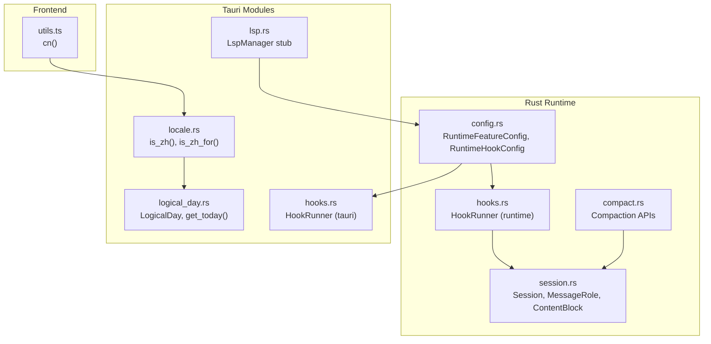
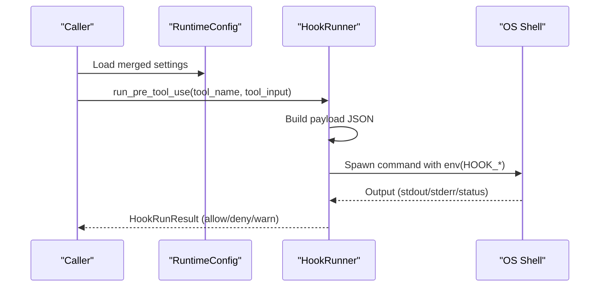
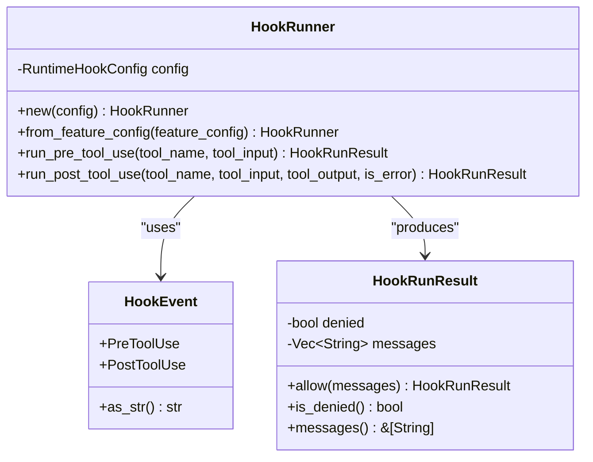
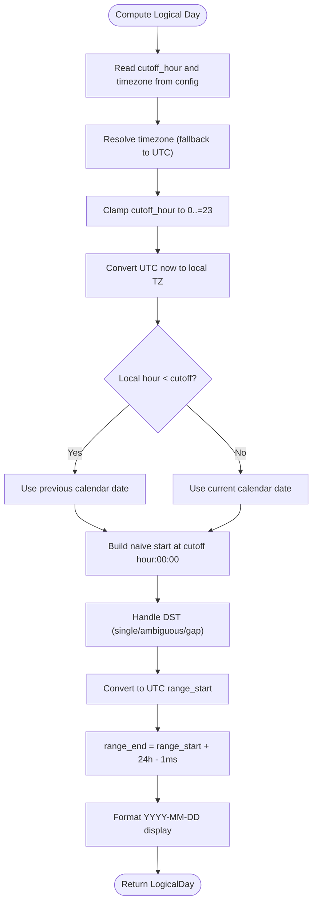
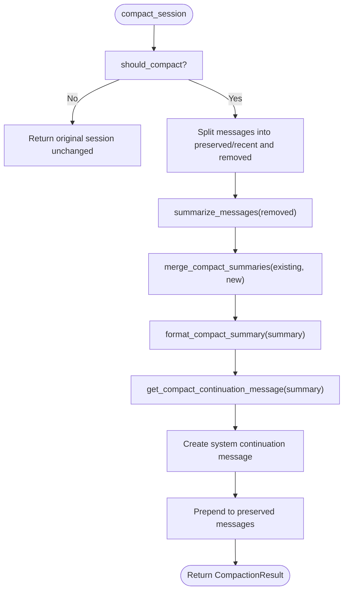
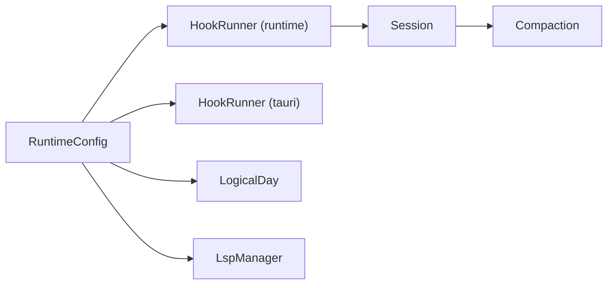

# Utility Services

<cite>
**Referenced Files in This Document**
- [hooks.rs](file://rust/crates/runtime/src/hooks.rs)
- [hooks.rs](file://rust/crates/plugins/src/hooks.rs)
- [hooks.rs](file://src-tauri/src/modules/runtime/hooks.rs)
- [config.rs](file://rust/crates/runtime/src/config.rs)
- [compact.rs](file://rust/crates/runtime/src/compact.rs)
- [locale.rs](file://src-tauri/src/modules/runtime/locale.rs)
- [logical_day.rs](file://src-tauri/src/modules/runtime/logical_day.rs)
- [lsp.rs](file://src-tauri/src/modules/runtime/lsp.rs)
- [session.rs](file://rust/crates/runtime/src/session.rs)
- [utils.ts](file://src/lib/utils.ts)
</cite>

## Table of Contents
1. [Introduction](#introduction)
2. [Project Structure](#project-structure)
3. [Core Components](#core-components)
4. [Architecture Overview](#architecture-overview)
5. [Detailed Component Analysis](#detailed-component-analysis)
6. [Dependency Analysis](#dependency-analysis)
7. [Performance Considerations](#performance-considerations)
8. [Troubleshooting Guide](#troubleshooting-guide)
9. [Conclusion](#conclusion)
10. [Appendices](#appendices)

## Introduction
This document describes the utility services subsystem responsible for runtime configuration, localization, logical day calculations, compaction of conversational sessions, and hook-based tool invocation controls. It also outlines the current state of Language Server Protocol (LSP) integration and provides practical guidance for configuring locale, setting up hooks, and performing logical day computations.

## Project Structure
The utility services span Rust runtime crates, Tauri modules, and shared frontend helpers:
- Runtime configuration and feature toggles are defined in the runtime crate’s configuration module.
- Hook execution engines exist in both the runtime and plugin crates, plus a Tauri-side variant for UI/runtime coordination.
- Localization helpers and logical day utilities live under the Tauri runtime modules.
- Session compaction logic resides in the runtime crate and operates on structured conversation sessions.
- Frontend helper utilities provide lightweight shared functionality.

**Diagram sources**
- [config.rs:48-62](file://rust/crates/runtime/src/config.rs#L48-L62)
- [hooks.rs:49-103](file://rust/crates/runtime/src/hooks.rs#L49-L103)
- [compact.rs:88-131](file://rust/crates/runtime/src/compact.rs#L88-L131)
- [session.rs:46-50](file://rust/crates/runtime/src/session.rs#L46-L50)
- [hooks.rs:49-103](file://src-tauri/src/modules/runtime/hooks.rs#L49-L103)
- [locale.rs:27-39](file://src-tauri/src/modules/runtime/locale.rs#L27-L39)
- [logical_day.rs:31-42](file://src-tauri/src/modules/runtime/logical_day.rs#L31-L42)
- [lsp.rs:39-49](file://src-tauri/src/modules/runtime/lsp.rs#L39-L49)
- [utils.ts:4-6](file://src/lib/utils.ts#L4-L6)

**Section sources**
- [config.rs:48-62](file://rust/crates/runtime/src/config.rs#L48-L62)
- [hooks.rs:49-103](file://rust/crates/runtime/src/hooks.rs#L49-L103)
- [compact.rs:88-131](file://rust/crates/runtime/src/compact.rs#L88-L131)
- [session.rs:46-50](file://rust/crates/runtime/src/session.rs#L46-L50)
- [hooks.rs:49-103](file://src-tauri/src/modules/runtime/hooks.rs#L49-L103)
- [locale.rs:27-39](file://src-tauri/src/modules/runtime/locale.rs#L27-L39)
- [logical_day.rs:31-42](file://src-tauri/src/modules/runtime/logical_day.rs#L31-L42)
- [lsp.rs:39-49](file://src-tauri/src/modules/runtime/lsp.rs#L39-L49)
- [utils.ts:4-6](file://src/lib/utils.ts#L4-L6)

## Core Components
- Runtime configuration and feature toggles define hook policies, plugin enablement, MCP servers, OAuth, model selection, permissions, and sandboxing.
- Hook runners enforce pre/post tool-use policies via external commands and capture outcomes.
- Session compaction summarizes older messages and preserves recent ones to reduce token usage.
- Localization helpers detect UI language and expose pure predicates for language checks.
- Logical day utilities compute inclusive UTC boundaries for daily aggregation using configurable cutoff hours and timezones.
- LSP integration is currently a stub; full implementation is planned for future development.
- Frontend utility functions provide shared helpers.

**Section sources**
- [config.rs:48-62](file://rust/crates/runtime/src/config.rs#L48-L62)
- [hooks.rs:49-103](file://rust/crates/runtime/src/hooks.rs#L49-L103)
- [compact.rs:88-131](file://rust/crates/runtime/src/compact.rs#L88-L131)
- [locale.rs:27-39](file://src-tauri/src/modules/runtime/locale.rs#L27-L39)
- [logical_day.rs:31-42](file://src-tauri/src/modules/runtime/logical_day.rs#L31-L42)
- [lsp.rs:39-49](file://src-tauri/src/modules/runtime/lsp.rs#L39-L49)
- [utils.ts:4-6](file://src/lib/utils.ts#L4-L6)

## Architecture Overview
The utility services integrate configuration-driven policies with runtime actions:
- Configuration discovery and merging feed feature toggles to hook runners and compaction logic.
- Hooks execute external commands with structured payloads and environment variables, returning allow/deny/warn outcomes.
- Compaction transforms conversation sessions into a summarized form while preserving recent context.
- Localization and logical day utilities centralize language and temporal boundaries for memory and prompt builders.

**Diagram sources**
- [config.rs:226-259](file://rust/crates/runtime/src/config.rs#L226-L259)
- [hooks.rs:105-162](file://rust/crates/runtime/src/hooks.rs#L105-L162)
- [hooks.rs:105-182](file://src-tauri/src/modules/runtime/hooks.rs#L105-L182)

## Detailed Component Analysis

### Locale Handling
Locale utilities centralize UI language detection and expose a pure predicate for Chinese language checks. The runtime configuration supplies the active language tag, enabling prompt builders and UI components to adapt output accordingly.

- is_zh(): Reads the current runtime language and returns true for languages starting with "zh".
- is_zh_for(lang): Pure helper to test language prefixes without global state.

Examples:
- Configure language in settings.json under the language field to influence is_zh().
- Use is_zh_for() in unit tests to validate language-specific behavior.

**Section sources**
- [locale.rs:27-39](file://src-tauri/src/modules/runtime/locale.rs#L27-L39)
- [config.rs:631-657](file://rust/crates/runtime/src/config.rs#L631-L657)

### LSP Integration
The LSP module is currently a stub with data structures for context enrichment, server configuration, diagnostics, and symbol locations. The LspManager is default-initialized and not actively connected. Full integration will be implemented in future slices.

- LspContextEnrichment: Holds rendered prompt sections.
- LspServerConfig: Defines server metadata (name, command, args).
- LspError: Enumerates not-found and connection-failed conditions.
- LspManager: Container for server configurations.
- Diagnostic, SymbolLocation, Range, Position, and Severity types model LSP artifacts.

Example:
- Initialize an LspManager and register server configs in settings.json under mcpServers for future use.

**Section sources**
- [lsp.rs:8-103](file://src-tauri/src/modules/runtime/lsp.rs#L8-L103)
- [config.rs:525-550](file://rust/crates/runtime/src/config.rs#L525-L550)

### Hook Management
Three hook implementations exist: runtime, plugin, and Tauri-side. They share a common pattern:
- HookEvent: PreToolUse, PostToolUse.
- HookRunner: Executes configured commands, sets environment variables, streams payload via stdin, and interprets exit codes.
- Outcomes: Allow (exit 0), Deny (exit 2), Warn (other non-zero).

Key behaviors:
- Payload includes hook_event_name, tool_name, tool_input (parsed JSON), tool_input_json (raw JSON), tool_output, tool_result_is_error.
- Environment variables: HOOK_EVENT, HOOK_TOOL_NAME, HOOK_TOOL_INPUT, HOOK_TOOL_IS_ERROR, HOOK_TOOL_OUTPUT (when present).
- Exit code semantics: 0 allow, 2 deny, others warn with optional captured stdout/stderr.

**Diagram sources**
- [hooks.rs:8-47](file://rust/crates/runtime/src/hooks.rs#L8-L47)
- [hooks.rs:49-103](file://rust/crates/runtime/src/hooks.rs#L49-L103)

**Section sources**
- [hooks.rs:49-103](file://rust/crates/runtime/src/hooks.rs#L49-L103)
- [hooks.rs:50-93](file://rust/crates/plugins/src/hooks.rs#L50-L93)
- [hooks.rs:49-103](file://src-tauri/src/modules/runtime/hooks.rs#L49-L103)

### Logical Day Calculations
Logical day utilities define inclusive UTC boundaries for daily aggregation using a configurable cutoff hour and timezone. The system resolves IANA timezones, handles DST transitions robustly, and exposes convenience getters.

Core types and functions:
- LogicalDay: date, range_start (inclusive UTC), range_end (inclusive UTC), display (YYYY-MM-DD).
- get_logical_day(now, cutoff_hour, tz): Computes logical day for a given UTC instant.
- logical_day_for_date(date, cutoff_hour, tz): Computes logical day for a calendar date.
- get_today(): Reads cutoff and timezone from runtime config and returns today’s logical day.
- resolve_timezone(name): Parses IANA timezone with fallback to UTC.
- clamp_cutoff(hour): Clamps cutoff to 0..=23.

**Diagram sources**
- [logical_day.rs:50-130](file://src-tauri/src/modules/runtime/logical_day.rs#L50-L130)
- [logical_day.rs:140-144](file://src-tauri/src/modules/runtime/logical_day.rs#L140-L144)

**Section sources**
- [logical_day.rs:31-42](file://src-tauri/src/modules/runtime/logical_day.rs#L31-L42)
- [logical_day.rs:50-130](file://src-tauri/src/modules/runtime/logical_day.rs#L50-L130)
- [logical_day.rs:140-144](file://src-tauri/src/modules/runtime/logical_day.rs#L140-L144)
- [logical_day.rs:149-164](file://src-tauri/src/modules/runtime/logical_day.rs#L149-L164)

### Compaction Processes
The compaction engine summarizes older conversation messages into a system-generated summary while preserving recent messages. It estimates token usage, decides whether to compact, and formats a continuation message.

Key functions:
- should_compact(session, config): Determines if the session qualifies for compaction.
- compact_session(session, config): Produces a CompactionResult with summary, formatted summary, compacted session, and removed count.
- format_compact_summary(summary): Extracts and formats highlighted sections.
- get_compact_continuation_message(summary, suppress_follow_up_questions, recent_messages_preserved): Builds the system message guiding continuation.
- estimate_session_tokens(session): Estimates total tokens across messages.
- Helper utilities: summarize_messages, merge_compact_summaries, extract_existing_compacted_summary, and formatting helpers.

**Diagram sources**
- [compact.rs:88-131](file://rust/crates/runtime/src/compact.rs#L88-L131)
- [compact.rs:143-228](file://rust/crates/runtime/src/compact.rs#L143-L228)
- [compact.rs:230-263](file://rust/crates/runtime/src/compact.rs#L230-L263)

**Section sources**
- [compact.rs:37-47](file://rust/crates/runtime/src/compact.rs#L37-L47)
- [compact.rs:88-131](file://rust/crates/runtime/src/compact.rs#L88-L131)
- [compact.rs:49-86](file://rust/crates/runtime/src/compact.rs#L49-L86)
- [session.rs:46-50](file://rust/crates/runtime/src/session.rs#L46-L50)

### Utility Functions and Helper Services
- Frontend utility: cn(...) merges Tailwind classes safely using clsx and tailwind-merge.
- Localization helpers: is_zh() and is_zh_for() provide language checks for prompt builders and UI components.

**Section sources**
- [utils.ts:4-6](file://src/lib/utils.ts#L4-L6)
- [locale.rs:27-39](file://src-tauri/src/modules/runtime/locale.rs#L27-L39)

## Dependency Analysis
- Hook runners depend on configuration for command lists and environment variables.
- Compaction depends on session message structures and token estimation.
- Logical day utilities depend on runtime configuration for timezone and cutoff settings.
- LSP stub depends on configuration for MCP server definitions.

**Diagram sources**
- [config.rs:226-331](file://rust/crates/runtime/src/config.rs#L226-L331)
- [hooks.rs:49-103](file://rust/crates/runtime/src/hooks.rs#L49-L103)
- [hooks.rs:49-103](file://src-tauri/src/modules/runtime/hooks.rs#L49-L103)
- [logical_day.rs:140-144](file://src-tauri/src/modules/runtime/logical_day.rs#L140-L144)
- [lsp.rs:39-49](file://src-tauri/src/modules/runtime/lsp.rs#L39-L49)
- [session.rs:46-50](file://rust/crates/runtime/src/session.rs#L46-L50)
- [compact.rs:88-131](file://rust/crates/runtime/src/compact.rs#L88-L131)

**Section sources**
- [config.rs:226-331](file://rust/crates/runtime/src/config.rs#L226-L331)
- [hooks.rs:49-103](file://rust/crates/runtime/src/hooks.rs#L49-L103)
- [hooks.rs:49-103](file://src-tauri/src/modules/runtime/hooks.rs#L49-L103)
- [logical_day.rs:140-144](file://src-tauri/src/modules/runtime/logical_day.rs#L140-L144)
- [lsp.rs:39-49](file://src-tauri/src/modules/runtime/lsp.rs#L39-L49)
- [session.rs:46-50](file://rust/crates/runtime/src/session.rs#L46-L50)
- [compact.rs:88-131](file://rust/crates/runtime/src/compact.rs#L88-L131)

## Performance Considerations
- Hook execution spawns external processes per command; batch or minimize hook commands to reduce overhead.
- Compaction token estimation is linear in message count; tune preserve_recent_messages and max_estimated_tokens to balance context retention and performance.
- Logical day computation is O(1) per call; caching results within a request lifecycle avoids repeated timezone parsing.
- LSP stub is inactive; avoid unnecessary initialization until integration is implemented.

## Troubleshooting Guide
- Hooks deny unexpectedly:
  - Verify exit code semantics: 0 allow, 2 deny, others warn.
  - Confirm environment variables are set (HOOK_EVENT, HOOK_TOOL_NAME, HOOK_TOOL_INPUT, HOOK_TOOL_IS_ERROR, HOOK_TOOL_OUTPUT).
  - Inspect captured stdout/stderr for denial reasons.
- Hooks fail to start:
  - Check command availability and permissions; ensure shell compatibility across platforms.
- Compaction not triggered:
  - Increase max_estimated_tokens or reduce preserved recent messages to meet thresholds.
  - Ensure session contains sufficient older messages beyond the preserved window.
- Logical day anomalies:
  - Validate timezone name resolution; unknown zones fall back to UTC.
  - DST gaps and overlaps are handled; confirm expected behavior for ambiguous or non-existent local times.
- LSP integration:
  - LspManager is a stub; configure MCP servers in settings.json for future LSP features.

**Section sources**
- [hooks.rs:164-213](file://rust/crates/runtime/src/hooks.rs#L164-L213)
- [hooks.rs:184-233](file://src-tauri/src/modules/runtime/hooks.rs#L184-L233)
- [compact.rs:37-47](file://rust/crates/runtime/src/compact.rs#L37-L47)
- [logical_day.rs:149-164](file://src-tauri/src/modules/runtime/logical_day.rs#L149-L164)
- [lsp.rs:39-49](file://src-tauri/src/modules/runtime/lsp.rs#L39-L49)

## Conclusion
The utility services subsystem provides robust foundations for configuration-driven behavior, localized UI language support, precise logical day boundaries, efficient session compaction, and extensible hook enforcement. While LSP integration remains a stub, the modular design supports incremental enhancement without disrupting existing components.

## Appendices

### Examples Index
- Locale configuration:
  - Set language in settings.json to influence is_zh().
  - Reference: [config.rs:631-657](file://rust/crates/runtime/src/config.rs#L631-L657), [locale.rs:27-39](file://src-tauri/src/modules/runtime/locale.rs#L27-L39)
- LSP setup:
  - Register servers in settings.json under mcpServers for future LSP integration.
  - Reference: [config.rs:525-550](file://rust/crates/runtime/src/config.rs#L525-L550), [lsp.rs:39-49](file://src-tauri/src/modules/runtime/lsp.rs#L39-L49)
- Hook registration:
  - Define PreToolUse and PostToolUse commands in settings.json hooks section.
  - Reference: [config.rs:559-573](file://rust/crates/runtime/src/config.rs#L559-L573), [hooks.rs:105-162](file://rust/crates/runtime/src/hooks.rs#L105-L162)
- Logical day calculation:
  - Use get_today() to compute the current logical day with resolved timezone and cutoff.
  - Reference: [logical_day.rs:140-144](file://src-tauri/src/modules/runtime/logical_day.rs#L140-L144)