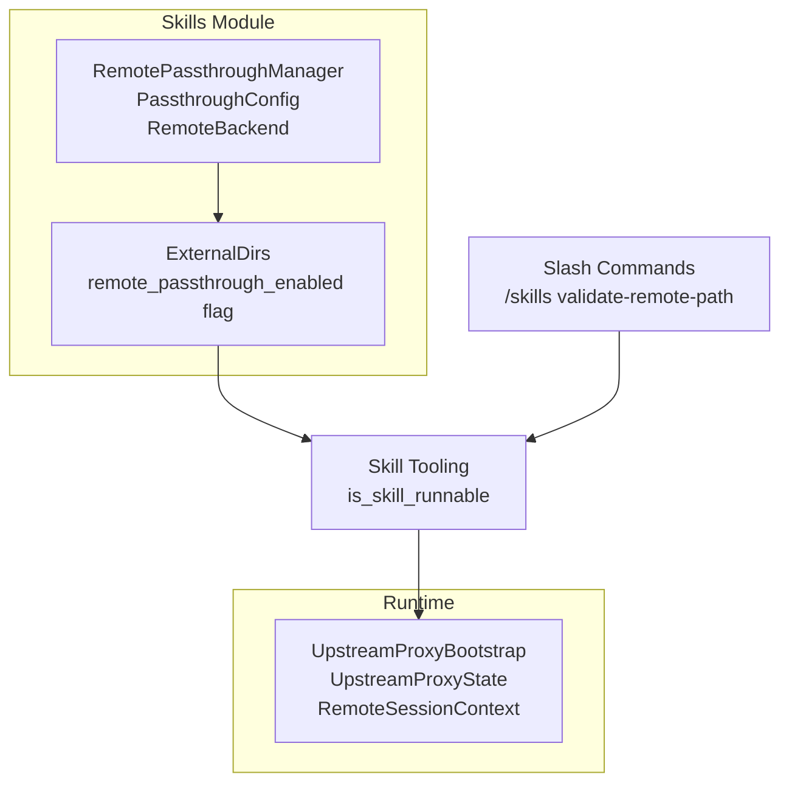
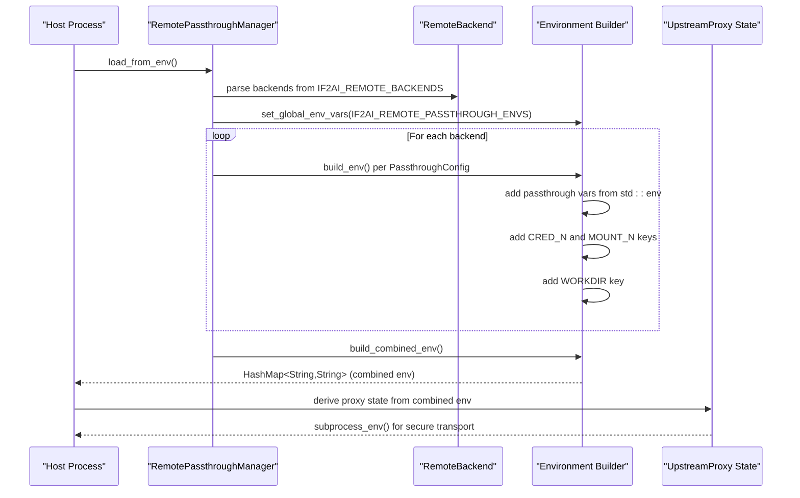
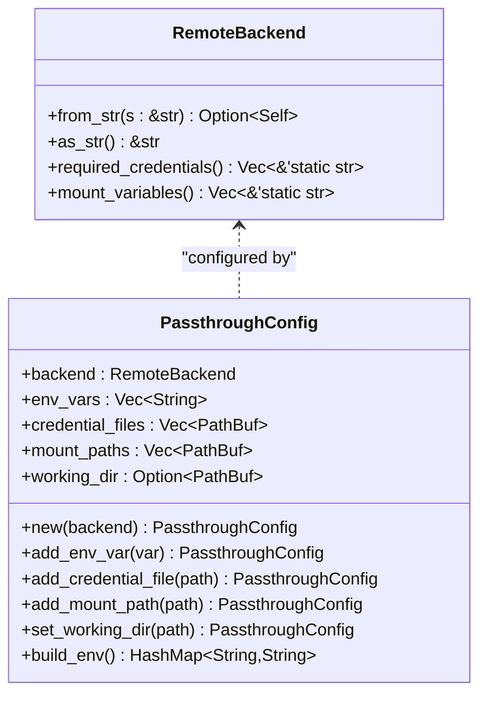
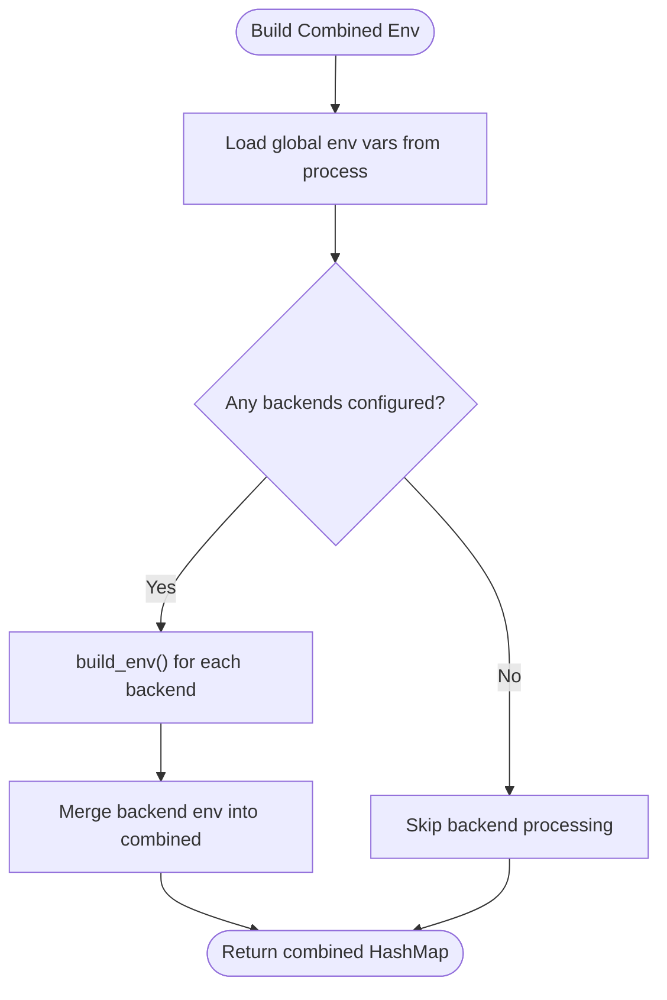
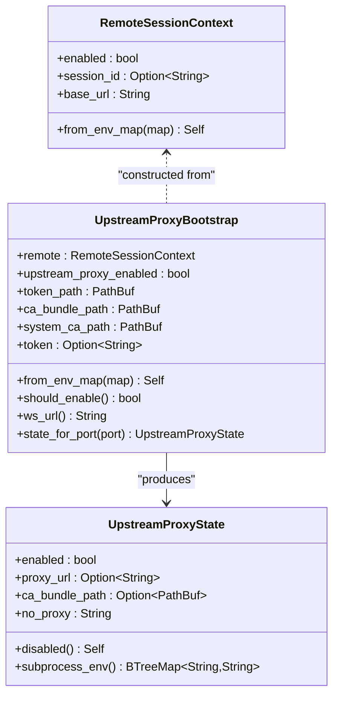
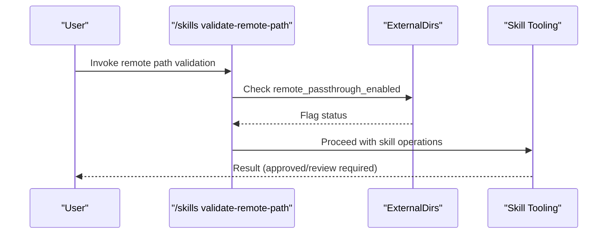
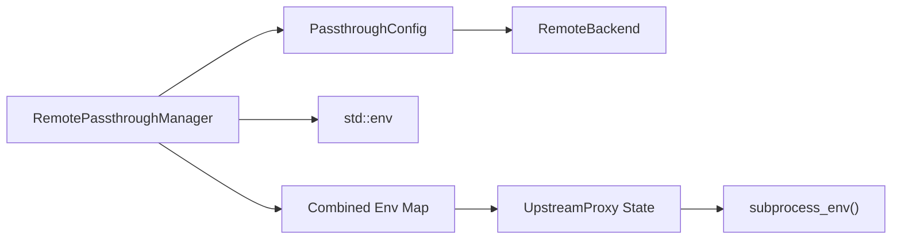

# Remote Passthrough

<cite>
**Referenced Files in This Document**
- [remote_passthrough.rs](file://src-tauri/src/modules/skills/remote_passthrough.rs)
- [remote.rs](file://rust/crates/runtime/src/remote.rs)
- [remote.rs](file://src-tauri/src/modules/runtime/remote.rs)
- [mod.rs](file://src-tauri/src/modules/skills/mod.rs)
- [external_dirs.rs](file://src-tauri/src/modules/skills/external_dirs.rs)
- [slash.rs](file://src-tauri/src/commands/slash.rs)
- [skill.rs](file://src-tauri/src/modules/tools/builtin/skill.rs)
</cite>

## Table of Contents
1. [Introduction](#introduction)
2. [Project Structure](#project-structure)
3. [Core Components](#core-components)
4. [Architecture Overview](#architecture-overview)
5. [Detailed Component Analysis](#detailed-component-analysis)
6. [Dependency Analysis](#dependency-analysis)
7. [Performance Considerations](#performance-considerations)
8. [Troubleshooting Guide](#troubleshooting-guide)
9. [Conclusion](#conclusion)

## Introduction
This document explains the remote passthrough functionality that enables environment variable and credential propagation into remote execution backends for skills. It covers supported backends, configuration mechanisms, environment variable handling, security considerations, and integration points with the broader skills system. The goal is to help developers configure secure remote execution contexts and understand how environment variables and credentials are mapped and transmitted.

## Project Structure
The remote passthrough feature spans two primary areas:
- Skills module: defines backend types, configuration, and environment building logic
- Runtime remote helpers: provide upstream proxy and secure communication utilities used during remote execution

**Diagram sources**
- [remote_passthrough.rs:27-96](file://src-tauri/src/modules/skills/remote_passthrough.rs#L27-L96)
- [remote_passthrough.rs:98-197](file://src-tauri/src/modules/skills/remote_passthrough.rs#L98-L197)
- [remote_passthrough.rs:199-322](file://src-tauri/src/modules/skills/remote_passthrough.rs#L199-L322)
- [external_dirs.rs:31-45](file://src-tauri/src/modules/skills/external_dirs.rs#L31-L45)
- [external_dirs.rs:137-153](file://src-tauri/src/modules/skills/external_dirs.rs#L137-L153)
- [remote.rs:43-149](file://src-tauri/src/modules/runtime/remote.rs#L43-L149)
- [remote.rs:151-185](file://src-tauri/src/modules/runtime/remote.rs#L151-L185)
- [slash.rs:571-599](file://src-tauri/src/commands/slash.rs#L571-L599)
- [skill.rs:282-307](file://src-tauri/src/modules/tools/builtin/skill.rs#L282-L307)

**Section sources**
- [mod.rs:10-11](file://src-tauri/src/modules/skills/mod.rs#L10-L11)
- [remote_passthrough.rs:1-7](file://src-tauri/src/modules/skills/remote_passthrough.rs#L1-L7)
- [remote.rs:1-22](file://src-tauri/src/modules/runtime/remote.rs#L1-L22)

## Core Components
- RemoteBackend: enumerates supported remote execution backends (Docker, Singularity, Modal, SSH, Daytona)
- PassthroughConfig: encapsulates per-backend environment variable passthrough, credential file mounts, mount paths, and working directory
- RemotePassthroughManager: aggregates configurations, loads from environment, and builds a combined environment for remote execution
- Runtime remote helpers: provide upstream proxy and secure communication utilities used during remote execution

Key responsibilities:
- Map environment variables from host to remote contexts
- Attach credential file paths and mount points per backend
- Combine global and backend-specific environment variables
- Support environment-driven configuration via IF2AI_* variables

**Section sources**
- [remote_passthrough.rs:27-96](file://src-tauri/src/modules/skills/remote_passthrough.rs#L27-L96)
- [remote_passthrough.rs:98-197](file://src-tauri/src/modules/skills/remote_passthrough.rs#L98-L197)
- [remote_passthrough.rs:199-322](file://src-tauri/src/modules/skills/remote_passthrough.rs#L199-L322)
- [remote.rs:43-149](file://src-tauri/src/modules/runtime/remote.rs#L43-L149)
- [remote.rs:151-185](file://src-tauri/src/modules/runtime/remote.rs#L151-L185)

## Architecture Overview
The remote passthrough pipeline collects environment variables and credentials, constructs backend-specific keys, and produces a unified environment map for remote execution. The runtime module augments this with upstream proxy and secure communication helpers.

**Diagram sources**
- [remote_passthrough.rs:294-321](file://src-tauri/src/modules/skills/remote_passthrough.rs#L294-L321)
- [remote_passthrough.rs:271-292](file://src-tauri/src/modules/skills/remote_passthrough.rs#L271-L292)
- [remote_passthrough.rs:157-196](file://src-tauri/src/modules/skills/remote_passthrough.rs#L157-L196)
- [remote.rs:91-149](file://src-tauri/src/modules/runtime/remote.rs#L91-L149)
- [remote.rs:162-184](file://src-tauri/src/modules/runtime/remote.rs#L162-L184)

## Detailed Component Analysis

### RemoteBackend and PassthroughConfig
- RemoteBackend supports Docker, Singularity, Modal, SSH, and Daytona
- Required credentials differ by backend (e.g., Modal requires API token and endpoint)
- PassthroughConfig holds:
  - env_vars: names of environment variables to pass through
  - credential_files: local paths to credential files to expose in remote context
  - mount_paths: additional mount paths for the backend
  - working_dir: working directory inside the remote execution context
- build_env() constructs a backend-specific environment map:
  - Adds passthrough variables present in current process environment
  - Adds credential file paths under keys like "<BACKEND>_CRED_N"
  - Adds mount paths under keys like "<BACKEND>_MOUNT_N"
  - Adds working directory under key "<BACKEND>_WORKDIR"

**Diagram sources**
- [remote_passthrough.rs:27-96](file://src-tauri/src/modules/skills/remote_passthrough.rs#L27-L96)
- [remote_passthrough.rs:98-197](file://src-tauri/src/modules/skills/remote_passthrough.rs#L98-L197)

**Section sources**
- [remote_passthrough.rs:27-96](file://src-tauri/src/modules/skills/remote_passthrough.rs#L27-L96)
- [remote_passthrough.rs:98-197](file://src-tauri/src/modules/skills/remote_passthrough.rs#L98-L197)

### RemotePassthroughManager
- Maintains a list of configured backends and global environment variables
- Supports adding backends from string identifiers and loading configuration from environment variables
- build_combined_env() merges:
  - Global environment variables present in current process environment
  - Backend-specific environment variables built from each PassthroughConfig

**Diagram sources**
- [remote_passthrough.rs:271-292](file://src-tauri/src/modules/skills/remote_passthrough.rs#L271-L292)

**Section sources**
- [remote_passthrough.rs:199-322](file://src-tauri/src/modules/skills/remote_passthrough.rs#L199-L322)
- [remote_passthrough.rs:271-292](file://src-tauri/src/modules/skills/remote_passthrough.rs#L271-L292)

### Runtime Remote Helpers
The runtime module provides:
- RemoteSessionContext: parses remote execution flags and base URL from environment
- UpstreamProxyBootstrap: derives whether upstream proxy should be enabled and constructs proxy state
- UpstreamProxyState: produces subprocess environment variables for HTTPS_PROXY, NO_PROXY, and certificate bundles
- Helper functions for token reading and WS URL construction

These helpers integrate with the combined environment produced by RemotePassthroughManager to establish secure transport and proxy configuration for remote sessions.

**Diagram sources**
- [remote.rs:43-149](file://src-tauri/src/modules/runtime/remote.rs#L43-L149)
- [remote.rs:151-185](file://src-tauri/src/modules/runtime/remote.rs#L151-L185)

**Section sources**
- [remote.rs:43-149](file://src-tauri/src/modules/runtime/remote.rs#L43-L149)
- [remote.rs:151-185](file://src-tauri/src/modules/runtime/remote.rs#L151-L185)

### Integration with Skills and External Dirs
- ExternalDirs tracks a remote_passthrough_enabled flag that can be toggled to enable passthrough for external skill directories
- Skill tooling enforces review and approval gating for skills, including remote quarantine scenarios
- Slash commands provide a way to validate remote distribution paths for skills

**Diagram sources**
- [slash.rs:571-599](file://src-tauri/src/commands/slash.rs#L571-L599)
- [external_dirs.rs:31-45](file://src-tauri/src/modules/skills/external_dirs.rs#L31-L45)
- [external_dirs.rs:137-153](file://src-tauri/src/modules/skills/external_dirs.rs#L137-L153)
- [skill.rs:282-307](file://src-tauri/src/modules/tools/builtin/skill.rs#L282-L307)

**Section sources**
- [external_dirs.rs:31-45](file://src-tauri/src/modules/skills/external_dirs.rs#L31-L45)
- [external_dirs.rs:137-153](file://src-tauri/src/modules/skills/external_dirs.rs#L137-L153)
- [slash.rs:571-599](file://src-tauri/src/commands/slash.rs#L571-L599)
- [skill.rs:282-307](file://src-tauri/src/modules/tools/builtin/skill.rs#L282-L307)

## Dependency Analysis
- RemotePassthroughManager depends on PassthroughConfig and RemoteBackend to construct environment maps
- PassthroughConfig depends on std::env for passthrough variables and uses backend-specific key templates
- Runtime remote helpers depend on environment-derived flags and token files to produce secure subprocess environments
- Skills module integrates passthrough with external directories and skill lifecycle checks

**Diagram sources**
- [remote_passthrough.rs:199-322](file://src-tauri/src/modules/skills/remote_passthrough.rs#L199-L322)
- [remote_passthrough.rs:98-197](file://src-tauri/src/modules/skills/remote_passthrough.rs#L98-L197)
- [remote.rs:162-184](file://src-tauri/src/modules/runtime/remote.rs#L162-L184)

**Section sources**
- [remote_passthrough.rs:199-322](file://src-tauri/src/modules/skills/remote_passthrough.rs#L199-L322)
- [remote.rs:162-184](file://src-tauri/src/modules/runtime/remote.rs#L162-L184)

## Performance Considerations
- Environment variable collection is O(N) in the number of variables requested; keep lists concise
- Credential and mount path expansion is O(M) per backend; avoid excessive mounts
- Token and CA bundle reads are file I/O bound; cache results at the process level if reused frequently
- Prefer enabling passthrough only for required backends to minimize overhead

## Troubleshooting Guide
Common issues and resolutions:
- Invalid backend identifier
  - Symptom: Backend parsing fails when loading from environment
  - Resolution: Ensure IF2AI_REMOTE_BACKENDS contains valid backend names (e.g., docker, modal, ssh)
  - Section sources
    - [remote_passthrough.rs:231-238](file://src-tauri/src/modules/skills/remote_passthrough.rs#L231-L238)
- Missing required credentials
  - Symptom: Backends requiring credentials fail to initialize
  - Resolution: Provide required environment variables for the selected backend (e.g., MODAL_API_TOKEN, DAYTONA_API_KEY)
  - Section sources
    - [remote_passthrough.rs:68-77](file://src-tauri/src/modules/skills/remote_passthrough.rs#L68-L77)
- Passthrough variables not appearing in remote context
  - Symptom: Variables absent from combined environment
  - Resolution: Confirm variables exist in current process environment and are included in IF2AI_REMOTE_PASSTHROUGH_ENVS
  - Section sources
    - [remote_passthrough.rs:294-321](file://src-tauri/src/modules/skills/remote_passthrough.rs#L294-L321)
    - [remote_passthrough.rs:164-169](file://src-tauri/src/modules/skills/remote_passthrough.rs#L164-L169)
- Upstream proxy not applied
  - Symptom: Secure transport not established
  - Resolution: Ensure CLAW_CODE_REMOTE, CCR_UPSTREAM_PROXY_ENABLED, and session token are present; verify CA bundle path
  - Section sources
    - [remote.rs:91-149](file://src-tauri/src/modules/runtime/remote.rs#L91-L149)
    - [remote.rs:162-184](file://src-tauri/src/modules/runtime/remote.rs#L162-L184)

## Conclusion
Remote passthrough enables secure and flexible propagation of environment variables, credentials, and mount points into remote execution backends for skills. By combining environment-driven configuration with backend-specific key templates and integrating with runtime helpers for secure transport, the system supports robust remote execution while maintaining clear separation of concerns and strong security defaults.