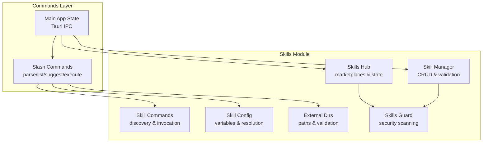
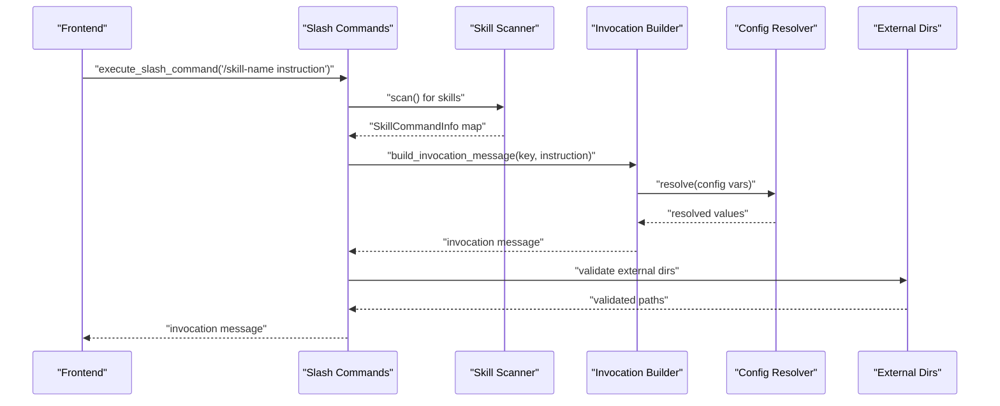
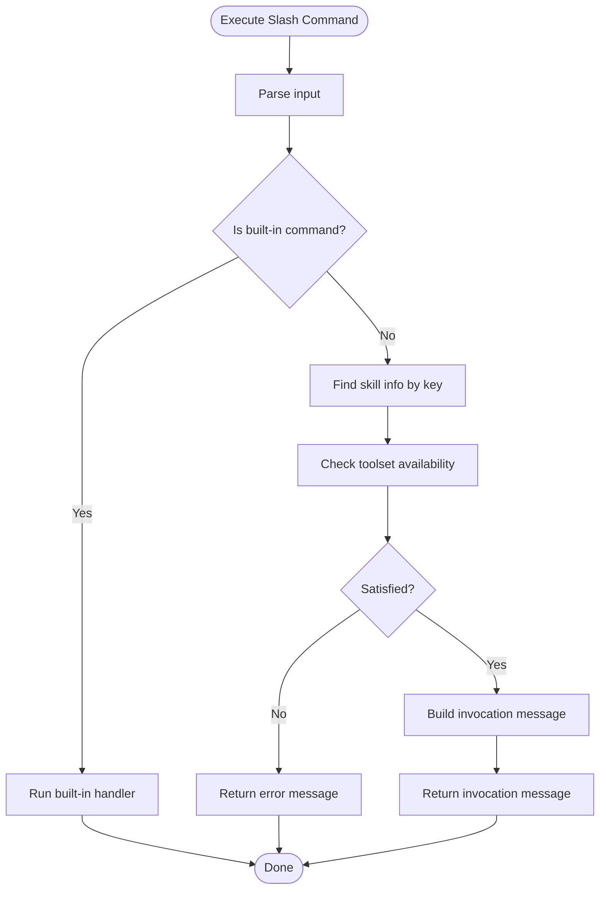
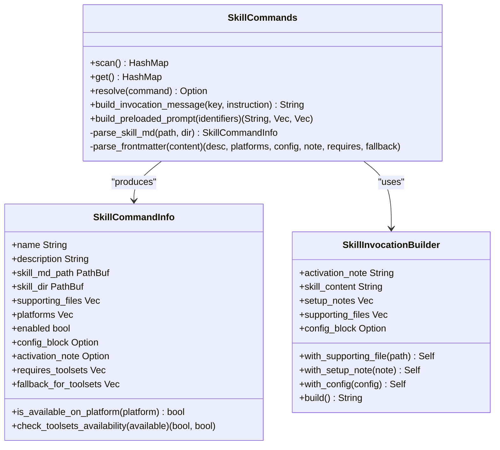
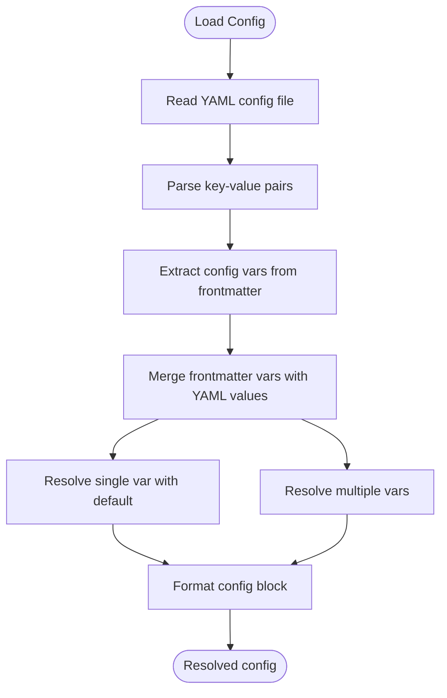
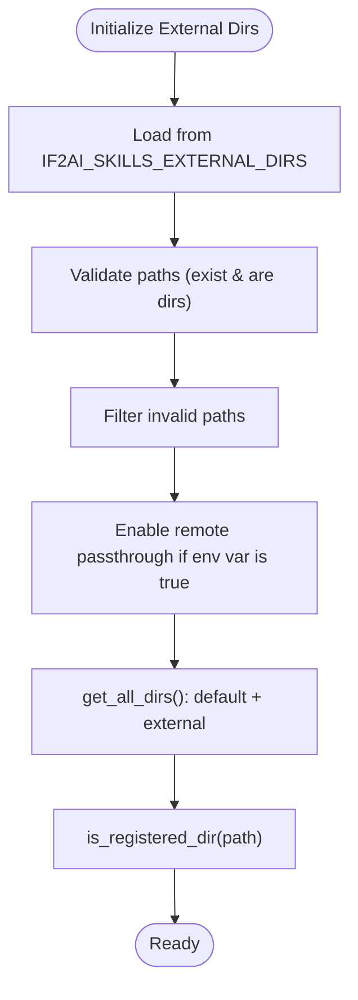
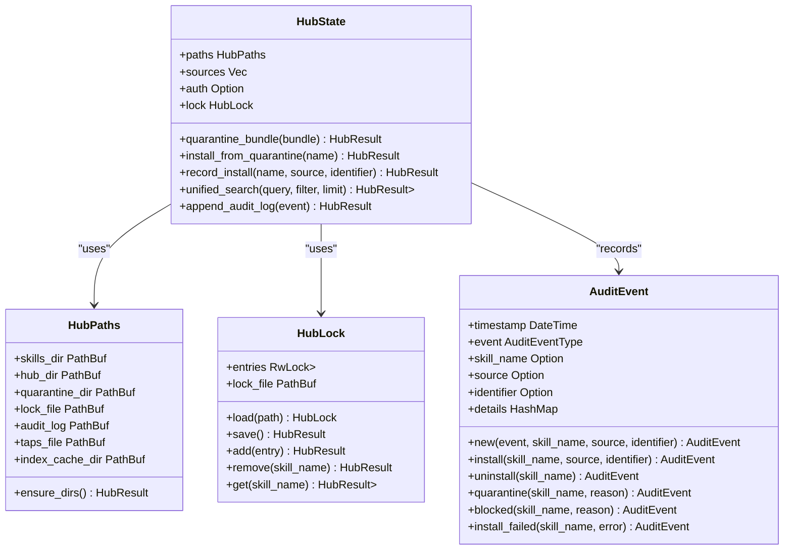
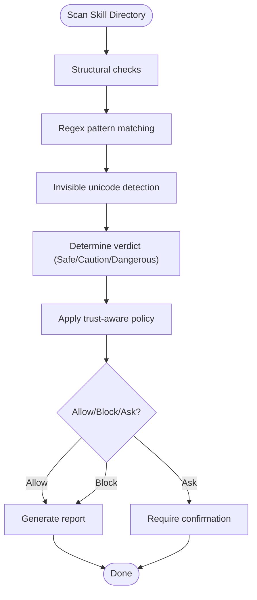
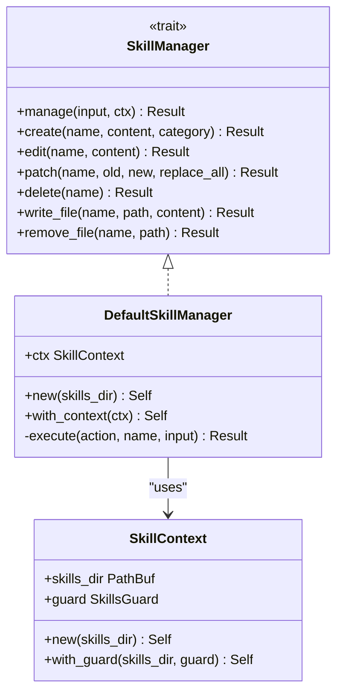
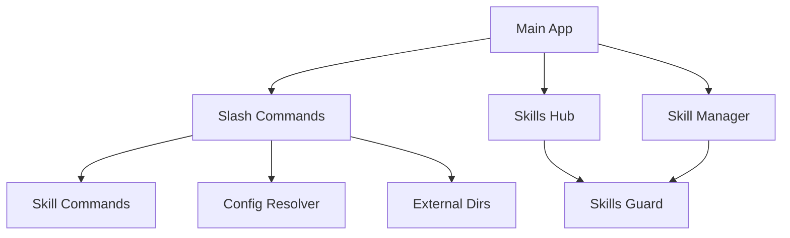

# Skills Commands & Configuration

<cite>
**Referenced Files in This Document**
- [slash.rs](file://src-tauri/src/commands/slash.rs)
- [commands.rs](file://src-tauri/src/modules/skills/commands.rs)
- [config.rs](file://src-tauri/src/modules/skills/config.rs)
- [external_dirs.rs](file://src-tauri/src/modules/skills/external_dirs.rs)
- [mod.rs](file://src-tauri/src/modules/skills/mod.rs)
- [hub/mod.rs](file://src-tauri/src/modules/skills/hub/mod.rs)
- [hub/state.rs](file://src-tauri/src/modules/skills/hub/state.rs)
- [hub/types.rs](file://src-tauri/src/modules/skills/hub/types.rs)
- [guard/mod.rs](file://src-tauri/src/modules/skills/guard/mod.rs)
- [manager/mod.rs](file://src-tauri/src/modules/skills/manager/mod.rs)
- [main.rs](file://src-tauri/src/main.rs)
</cite>

## Table of Contents
1. [Introduction](#introduction)
2. [Project Structure](#project-structure)
3. [Core Components](#core-components)
4. [Architecture Overview](#architecture-overview)
5. [Detailed Component Analysis](#detailed-component-analysis)
6. [Dependency Analysis](#dependency-analysis)
7. [Performance Considerations](#performance-considerations)
8. [Troubleshooting Guide](#troubleshooting-guide)
9. [Conclusion](#conclusion)

## Introduction
This document explains the skills commands and configuration system that integrates slash commands with external directory support. It covers command registration and execution patterns, configuration management, external directory discovery and validation, environment variable handling, runtime settings, and integration with the broader skills ecosystem. The goal is to provide a comprehensive understanding for both developers and operators who need to define, configure, and deploy skills effectively.

## Project Structure
The skills system spans multiple modules and command handlers:
- Slash command integration exposes parsing, listing, suggesting, and executing skills-based commands to the frontend.
- Skill command discovery scans directories for skills defined by SKILL.md and metadata.
- Configuration management extracts and resolves skill configuration variables from frontmatter and external config files.
- External directories support allows skills to be loaded from additional locations beyond the default ~/.if2ai/skills/.
- Skills hub provides multi-source marketplace adapters for discovering and installing skills.
- Security guard performs static analysis and trust-aware policy decisions for externally sourced skills.
- Manager provides CRUD operations for skills with security scanning and validation.

**Diagram sources**
- [slash.rs:210-344](file://src-tauri/src/commands/slash.rs#L210-L344)
- [commands.rs:228-402](file://src-tauri/src/modules/skills/commands.rs#L228-L402)
- [config.rs:77-200](file://src-tauri/src/modules/skills/config.rs#L77-L200)
- [external_dirs.rs:64-240](file://src-tauri/src/modules/skills/external_dirs.rs#L64-L240)
- [hub/mod.rs:34-47](file://src-tauri/src/modules/skills/hub/mod.rs#L34-L47)
- [guard/mod.rs:95-183](file://src-tauri/src/modules/skills/guard/mod.rs#L95-L183)
- [manager/mod.rs:88-133](file://src-tauri/src/modules/skills/manager/mod.rs#L88-L133)
- [main.rs:1-226](file://src-tauri/src/main.rs#L1-L226)

**Section sources**
- [slash.rs:1-800](file://src-tauri/src/commands/slash.rs#L1-L800)
- [commands.rs:1-788](file://src-tauri/src/modules/skills/commands.rs#L1-L788)
- [config.rs:1-419](file://src-tauri/src/modules/skills/config.rs#L1-L419)
- [external_dirs.rs:1-338](file://src-tauri/src/modules/skills/external_dirs.rs#L1-L338)
- [hub/mod.rs:1-101](file://src-tauri/src/modules/skills/hub/mod.rs#L1-L101)
- [guard/mod.rs:1-809](file://src-tauri/src/modules/skills/guard/mod.rs#L1-L809)
- [manager/mod.rs:1-417](file://src-tauri/src/modules/skills/manager/mod.rs#L1-L417)
- [main.rs:1-800](file://src-tauri/src/main.rs#L1-L800)

## Core Components
- Slash command integration: Implements parse, list, suggest, and execute for built-in and skills-based commands. It resolves skill invocations and validates toolset availability before execution.
- Skill command discovery: Scans directories for skills, parses SKILL.md frontmatter, and builds invocation messages with supporting files and configuration blocks.
- Configuration management: Extracts skill configuration variables from frontmatter and resolves them from YAML config files, enabling interactive prompts and runtime configuration.
- External directories: Manages additional skill directories beyond the default, validates paths, and supports environment variable configuration.
- Skills hub: Provides multi-source adapters (GitHub, skills.sh, ClawHub, Claude Marketplace, LobeHub, WellKnown, Optional) with state management for quarantine, locks, and audit logs.
- Security guard: Performs static analysis for threats, enforces trust-aware policies, and computes content hashes for integrity tracking.
- Manager: Offers CRUD operations for skills with security scanning and validation, ensuring safe mutations.

**Section sources**
- [slash.rs:210-652](file://src-tauri/src/commands/slash.rs#L210-L652)
- [commands.rs:228-604](file://src-tauri/src/modules/skills/commands.rs#L228-L604)
- [config.rs:77-315](file://src-tauri/src/modules/skills/config.rs#L77-L315)
- [external_dirs.rs:64-240](file://src-tauri/src/modules/skills/external_dirs.rs#L64-L240)
- [hub/mod.rs:34-47](file://src-tauri/src/modules/skills/hub/mod.rs#L34-L47)
- [guard/mod.rs:95-520](file://src-tauri/src/modules/skills/guard/mod.rs#L95-L520)
- [manager/mod.rs:88-286](file://src-tauri/src/modules/skills/manager/mod.rs#L88-L286)

## Architecture Overview
The system orchestrates slash commands, skill discovery, configuration, and security checks. The main application initializes state and registers Tauri commands. Slash commands route to skill resolution and invocation builders, which integrate with configuration resolvers and external directory managers. Skills hub and guard provide marketplace integration and security enforcement.

**Diagram sources**
- [slash.rs:269-344](file://src-tauri/src/commands/slash.rs#L269-L344)
- [commands.rs:262-402](file://src-tauri/src/modules/skills/commands.rs#L262-L402)
- [config.rs:150-173](file://src-tauri/src/modules/skills/config.rs#L150-L173)
- [external_dirs.rs:161-171](file://src-tauri/src/modules/skills/external_dirs.rs#L161-L171)

**Section sources**
- [slash.rs:210-344](file://src-tauri/src/commands/slash.rs#L210-L344)
- [commands.rs:228-402](file://src-tauri/src/modules/skills/commands.rs#L228-L402)
- [config.rs:77-200](file://src-tauri/src/modules/skills/config.rs#L77-L200)
- [external_dirs.rs:161-240](file://src-tauri/src/modules/skills/external_dirs.rs#L161-L240)

## Detailed Component Analysis

### Slash Commands Integration
Slash commands expose parse, list, suggest, and execute functionality. Built-in commands include help, clear, skills listing, and agents listing. Skills-based commands are resolved by scanning directories and building invocation messages that embed skill content and configuration.

Key behaviors:
- Parse slash command input and match against known commands.
- List registered slash commands and suggest skills based on discovered directories.
- Execute commands by resolving skill invocations and validating toolset availability.
- Support skill state management (enable/disable) and distribution artifact validation.

**Diagram sources**
- [slash.rs:212-344](file://src-tauri/src/commands/slash.rs#L212-L344)
- [slash.rs:123-180](file://src-tauri/src/commands/slash.rs#L123-L180)

**Section sources**
- [slash.rs:210-652](file://src-tauri/src/commands/slash.rs#L210-L652)

### Skill Commands Discovery and Invocation
The skill commands module scans directories for skills, parses SKILL.md frontmatter, and builds invocation messages. It supports normalized command keys, platform compatibility checks, and conditional activation based on toolsets.

Key behaviors:
- Scan skills directory recursively, excluding hidden directories.
- Parse frontmatter for description, platforms, configuration blocks, and toolset requirements.
- Build invocation messages with activation notes, setup notes, skill content, configuration, and supporting files.
- Provide preloaded prompts for session initialization.

**Diagram sources**
- [commands.rs:228-604](file://src-tauri/src/modules/skills/commands.rs#L228-L604)
- [commands.rs:148-226](file://src-tauri/src/modules/skills/commands.rs#L148-L226)

**Section sources**
- [commands.rs:228-604](file://src-tauri/src/modules/skills/commands.rs#L228-L604)

### Configuration Management
Configuration variables are extracted from skill frontmatter and resolved from YAML config files. The resolver supports default values, interactive prompts, and skill-specific key filtering.

Key behaviors:
- Extract config variables from frontmatter (top-level and hermes sections).
- Parse YAML config files into key-value pairs.
- Resolve single and multiple variables, returning defaults when absent.
- Format resolved configuration blocks for inclusion in invocation messages.

**Diagram sources**
- [config.rs:98-200](file://src-tauri/src/modules/skills/config.rs#L98-L200)
- [config.rs:215-281](file://src-tauri/src/modules/skills/config.rs#L215-L281)
- [config.rs:287-315](file://src-tauri/src/modules/skills/config.rs#L287-L315)

**Section sources**
- [config.rs:77-315](file://src-tauri/src/modules/skills/config.rs#L77-L315)

### External Directories Support
External directories allow skills to be loaded from additional locations beyond the default ~/.if2ai/skills/. Paths are validated, and environment variables control configuration and remote passthrough.

Key behaviors:
- Load external directories from environment variable IF2AI_SKILLS_EXTERNAL_DIRS.
- Validate that paths exist and are directories; filter invalid entries.
- Enable remote passthrough via IF2AI_SKILLS_REMOTE_PASSTHROUGH.
- Provide methods to check if a path is within registered directories and to list all directories.

**Diagram sources**
- [external_dirs.rs:195-240](file://src-tauri/src/modules/skills/external_dirs.rs#L195-L240)
- [external_dirs.rs:161-193](file://src-tauri/src/modules/skills/external_dirs.rs#L161-L193)

**Section sources**
- [external_dirs.rs:64-240](file://src-tauri/src/modules/skills/external_dirs.rs#L64-L240)

### Skills Hub and State Management
The skills hub provides multiple source adapters and manages state for quarantine, locks, and audit logs. It deduplicates results by trust level and supports unified search across sources.

Key behaviors:
- Create a router of skill sources (GitHub, skills.sh, ClawHub, Claude Marketplace, LobeHub, WellKnown, Optional).
- Manage hub paths (.hub directory structure) and ensure required directories exist.
- Maintain a lock file tracking installed skills and provide add/remove/get operations.
- Quarantine bundles and install from quarantine; record audit events.
- Perform unified search across sources with trust-aware deduplication.

**Diagram sources**
- [hub/state.rs:16-59](file://src-tauri/src/modules/skills/hub/state.rs#L16-L59)
- [hub/state.rs:87-167](file://src-tauri/src/modules/skills/hub/state.rs#L87-L167)
- [hub/state.rs:169-292](file://src-tauri/src/modules/skills/hub/state.rs#L169-L292)
- [hub/state.rs:304-499](file://src-tauri/src/modules/skills/hub/state.rs#L304-L499)

**Section sources**
- [hub/mod.rs:34-47](file://src-tauri/src/modules/skills/hub/mod.rs#L34-L47)
- [hub/state.rs:16-59](file://src-tauri/src/modules/skills/hub/state.rs#L16-L59)
- [hub/state.rs:304-499](file://src-tauri/src/modules/skills/hub/state.rs#L304-L499)
- [hub/types.rs:10-50](file://src-tauri/src/modules/skills/hub/types.rs#L10-L50)

### Security Guard and Policy
The security guard performs static analysis for threats across files and commands, enforces trust-aware policies, and computes content hashes for integrity tracking.

Key behaviors:
- Scan directories recursively for structural anomalies and threat patterns.
- Detect invisible unicode and enforce severity thresholds for verdict determination.
- Determine allow/block/ask decisions based on trust level and findings.
- Provide formatted reports and runtime command scanning.

**Diagram sources**
- [guard/mod.rs:115-183](file://src-tauri/src/modules/skills/guard/mod.rs#L115-L183)
- [guard/mod.rs:341-356](file://src-tauri/src/modules/skills/guard/mod.rs#L341-L356)
- [guard/mod.rs:358-402](file://src-tauri/src/modules/skills/guard/mod.rs#L358-L402)

**Section sources**
- [guard/mod.rs:95-520](file://src-tauri/src/modules/skills/guard/mod.rs#L95-L520)

### Skill Manager Operations
The skill manager provides CRUD operations for skills with security scanning and validation. It integrates with the security guard and enforces allowed subdirectories.

Key behaviors:
- Create/edit/patch/delete skills and manage supporting files.
- Validate operations against allowed subdirectories and security guard.
- Execute actions atomically with error handling and reporting.

**Diagram sources**
- [manager/mod.rs:88-133](file://src-tauri/src/modules/skills/manager/mod.rs#L88-L133)
- [manager/mod.rs:135-286](file://src-tauri/src/modules/skills/manager/mod.rs#L135-L286)
- [manager/mod.rs:61-86](file://src-tauri/src/modules/skills/manager/mod.rs#L61-L86)

**Section sources**
- [manager/mod.rs:88-286](file://src-tauri/src/modules/skills/manager/mod.rs#L88-L286)

## Dependency Analysis
The skills system exhibits clear module boundaries and controlled coupling:
- Slash commands depend on skill commands for discovery and invocation, and on configuration for variable resolution.
- External directories support is used by slash commands to validate and enumerate skill roots.
- Skills hub and guard operate independently but integrate with manager and stateful operations.
- Main application registers Tauri commands and manages global state.

**Diagram sources**
- [slash.rs:80-121](file://src-tauri/src/commands/slash.rs#L80-L121)
- [commands.rs:262-321](file://src-tauri/src/modules/skills/commands.rs#L262-L321)
- [config.rs:150-200](file://src-tauri/src/modules/skills/config.rs#L150-L200)
- [external_dirs.rs:161-171](file://src-tauri/src/modules/skills/external_dirs.rs#L161-L171)
- [hub/mod.rs:34-47](file://src-tauri/src/modules/skills/hub/mod.rs#L34-L47)
- [guard/mod.rs:95-183](file://src-tauri/src/modules/skills/guard/mod.rs#L95-L183)
- [manager/mod.rs:88-133](file://src-tauri/src/modules/skills/manager/mod.rs#L88-L133)
- [main.rs:1-226](file://src-tauri/src/main.rs#L1-L226)

**Section sources**
- [slash.rs:80-121](file://src-tauri/src/commands/slash.rs#L80-L121)
- [commands.rs:262-321](file://src-tauri/src/modules/skills/commands.rs#L262-L321)
- [config.rs:150-200](file://src-tauri/src/modules/skills/config.rs#L150-L200)
- [external_dirs.rs:161-171](file://src-tauri/src/modules/skills/external_dirs.rs#L161-L171)
- [hub/mod.rs:34-47](file://src-tauri/src/modules/skills/hub/mod.rs#L34-L47)
- [guard/mod.rs:95-183](file://src-tauri/src/modules/skills/guard/mod.rs#L95-L183)
- [manager/mod.rs:88-133](file://src-tauri/src/modules/skills/manager/mod.rs#L88-L133)
- [main.rs:1-226](file://src-tauri/src/main.rs#L1-L226)

## Performance Considerations
- Directory scanning: Skill discovery reads directory entries and parses SKILL.md; caching reduces repeated scans. Consider limiting excluded directories and avoiding deep recursion in large trees.
- Configuration resolution: YAML parsing is linear in lines; keep config files concise and avoid excessive nesting.
- External directories: Validate paths once and reuse results; filter invalid entries early to minimize filesystem calls.
- Security scanning: Regex scanning and recursive traversal can be expensive; restrict to text files and apply structural limits to reduce overhead.
- Hub operations: Unified search aggregates results across sources; deduplication by trust rank is O(n log n) due to sorting; consider pagination and source filters.

[No sources needed since this section provides general guidance]

## Troubleshooting Guide
Common issues and resolutions:
- Unknown command: Slash command parsing returns an error when a skill is not found; verify skill name normalization and directory discovery.
- Toolset unavailable: Skills requiring toolsets that are not available will fail; ensure required tools are registered and available.
- External directory errors: Invalid or non-existent paths produce warnings; check IF2AI_SKILLS_EXTERNAL_DIRS and ensure absolute paths.
- Distribution artifact validation: Checksum mismatches or invalid signatures block remote distributions; verify channel, checksum, and signature.
- Security scanning: Dangerous verdicts block installation; review findings and adjust trust level or sanitize content.
- Hub state: Lock file corruption or missing entries can cause installation failures; reload lock and audit logs for diagnostics.

**Section sources**
- [slash.rs:308-344](file://src-tauri/src/commands/slash.rs#L308-L344)
- [slash.rs:654-716](file://src-tauri/src/commands/slash.rs#L654-L716)
- [external_dirs.rs:221-239](file://src-tauri/src/modules/skills/external_dirs.rs#L221-L239)
- [guard/mod.rs:341-356](file://src-tauri/src/modules/skills/guard/mod.rs#L341-L356)
- [hub/state.rs:105-131](file://src-tauri/src/modules/skills/hub/state.rs#L105-L131)

## Conclusion
The skills commands and configuration system integrates slash commands with robust skill discovery, configuration resolution, external directory support, and security enforcement. By leveraging modular components—slash commands, skill commands, configuration, external directories, hub state, security guard, and manager—the system provides a secure, extensible foundation for managing skills across diverse environments. Operators should validate external directories, configure environment variables appropriately, and rely on security scanning and hub state management to maintain a safe and organized skills ecosystem.