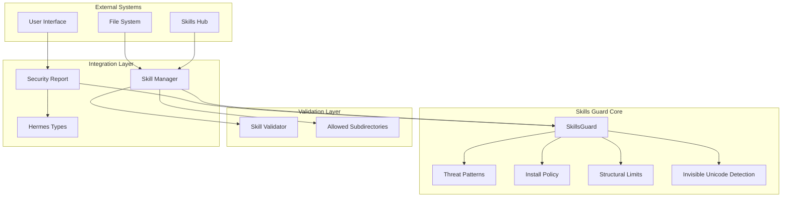
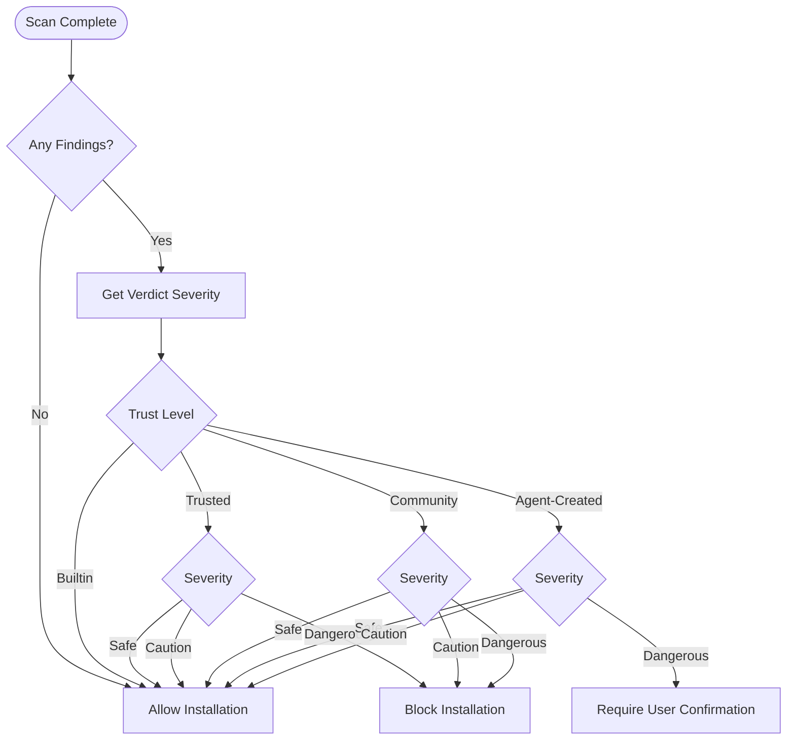
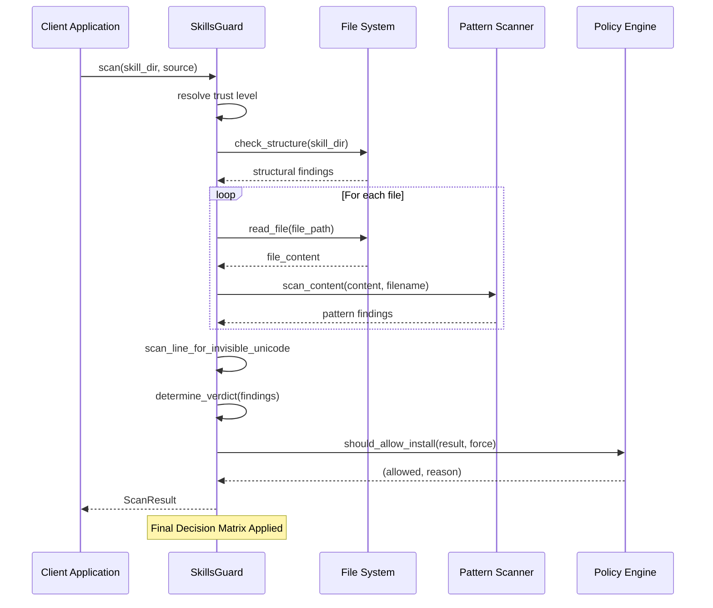
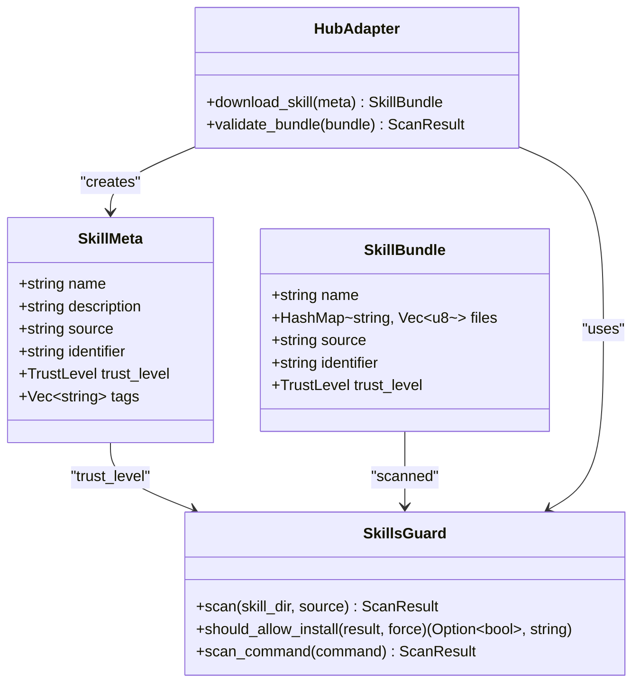
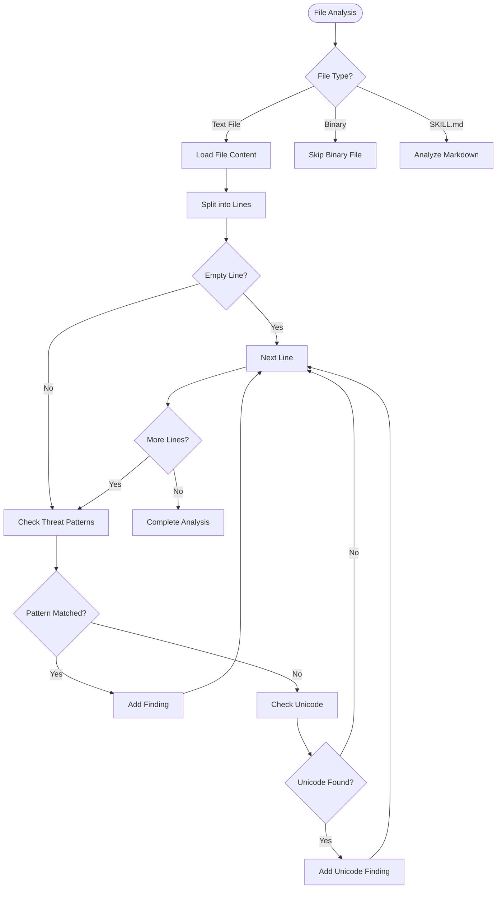
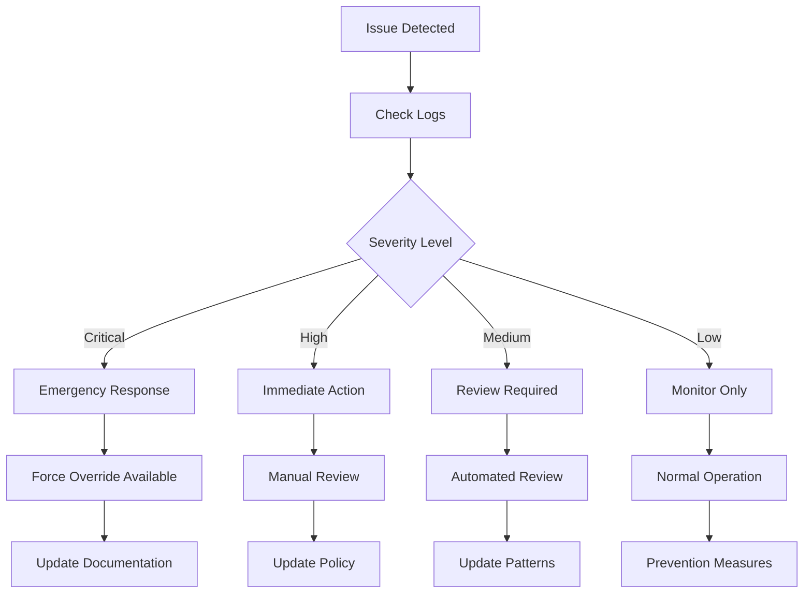

# Skills Guard System

<cite>
**Referenced Files in This Document**
- [mod.rs](file://src-tauri/src/modules/skills/guard/mod.rs)
- [threat_patterns.rs](file://src-tauri/src/modules/skills/guard/threat_patterns.rs)
- [policy.rs](file://src-tauri/src/modules/skills/guard/policy.rs)
- [structural_limits.rs](file://src-tauri/src/modules/skills/guard/structural_limits.rs)
- [invisible_unicode.rs](file://src-tauri/src/modules/skills/guard/invisible_unicode.rs)
- [validator.rs](file://src-tauri/src/modules/skills/manager/validator.rs)
- [actions.rs](file://src-tauri/src/modules/skills/manager/actions.rs)
- [types.ts](file://src/modules/skills/types.ts)
- [SkillSecurityReport.tsx](file://src/modules/skills/SkillSecurityReport.tsx)
- [types.rs](file://src-tauri/src/modules/skills/hub/types.rs)
</cite>

## Table of Contents
1. [Introduction](#introduction)
2. [System Architecture](#system-architecture)
3. [Core Components](#core-components)
4. [Threat Pattern Categories](#threat-pattern-categories)
5. [Security Policy Enforcement](#security-policy-enforcement)
6. [Guard Implementation Workflow](#guard-implementation-workflow)
7. [Integration with Skills System](#integration-with-skills-system)
8. [Security Scanning Processes](#security-scanning-processes)
9. [Configuration Examples](#configuration-examples)
10. [Performance Considerations](#performance-considerations)
11. [Troubleshooting Guide](#troubleshooting-guide)
12. [Conclusion](#conclusion)

## Introduction

The Skills Guard System is a comprehensive security framework designed to protect the skills ecosystem from malicious installations and unsafe content. This system provides threat scanning capabilities across 60+ predefined threat patterns organized into 15 distinct categories, implementing policy-based validation and structural limits enforcement to ensure the integrity and safety of the skills environment.

The system serves as a critical security layer in the skills control plane, automatically scanning skill packages before installation to prevent potentially harmful content from being deployed. It combines static analysis techniques with dynamic policy enforcement to create a robust defense mechanism against various attack vectors while maintaining flexibility for legitimate skill development.

## System Architecture

The Skills Guard System follows a modular architecture with clear separation of concerns across threat detection, policy enforcement, and integration layers.



**Diagram sources**
- [mod.rs:95-520](file://src-tauri/src/modules/skills/guard/mod.rs#L95-L520)
- [policy.rs:120-216](file://src-tauri/src/modules/skills/guard/policy.rs#L120-L216)
- [validator.rs:29-194](file://src-tauri/src/modules/skills/manager/validator.rs#L29-L194)

The architecture consists of four primary layers:

1. **Core Guard Engine**: Handles threat pattern matching, policy evaluation, and structural analysis
2. **Validation Layer**: Enforces skill content standards and file system boundaries
3. **Integration Layer**: Bridges the security system with the broader skills infrastructure
4. **External Interfaces**: Connects to skills hubs, file systems, and user interfaces

## Core Components

### SkillsGuard Engine

The central component responsible for orchestrating the entire security scanning process. It manages the complete workflow from initial threat detection to final policy enforcement decisions.

Key responsibilities include:
- Loading and managing threat patterns
- Executing recursive file scanning
- Coordinating multiple detection mechanisms
- Generating comprehensive security reports
- Integrating with policy enforcement systems

### Threat Pattern Management

The system maintains a comprehensive database of 60+ threat patterns organized into 15 categories, each designed to detect specific types of security vulnerabilities and malicious activities.

### Policy Enforcement System

Implements trust-level aware installation decisions with nuanced handling for different source types and threat severity levels.

### Structural Limits Enforcement

Enforces file system boundaries and content size limitations to prevent resource exhaustion and unauthorized access patterns.

**Section sources**
- [mod.rs:95-520](file://src-tauri/src/modules/skills/guard/mod.rs#L95-L520)
- [threat_patterns.rs:91-983](file://src-tauri/src/modules/skills/guard/threat_patterns.rs#L91-L983)
- [policy.rs:120-216](file://src-tauri/src/modules/skills/guard/policy.rs#L120-L216)
- [structural_limits.rs:66-222](file://src-tauri/src/modules/skills/guard/structural_limits.rs#L66-L222)

## Threat Pattern Categories

The Skills Guard System categorizes threats into 15 distinct categories, each addressing specific attack vectors and security concerns:

### 1. Exfiltration Patterns
Detects data leakage mechanisms including:
- Secret variable exposure in HTTP requests
- Environment variable dumping
- Credential store access
- Base64 encoded data transmission
- SSH and AWS credential exposure

### 2. Injection Attacks
Covers prompt injection and code injection techniques:
- Role hijacking attempts
- System prompt manipulation
- HTML comment injection
- Hidden div injection
- Conditional deception patterns

### 3. Destructive Operations
Identifies potentially harmful system modifications:
- Recursive directory deletion
- System file overwriting
- Permission modifications
- Filesystem formatting
- Disk write operations

### 4. Persistence Mechanisms
Detects attempts to establish lasting presence:
- Cron job modifications
- Shell startup file access
- SSH backdoor establishment
- Systemd service creation
- Sudoers file modifications

### 5. Network Access Patterns
Covers network-based attack vectors:
- Reverse shell establishment
- Tunnel service usage
- Hardcoded IP addresses
- Webhook service references
- Paste service utilization

### 6. Obfuscation Techniques
Identifies code obfuscation and evasion methods:
- Base64 decoding with execution
- Hex encoding patterns
- Eval and exec function usage
- Character code construction
- String manipulation techniques

### 7. Process Execution
Detects unauthorized process spawning:
- Subprocess execution calls
- Shell command invocation
- Child process creation
- Runtime.exec() usage
- Command substitution patterns

### 8. Path Traversal
Prevents directory traversal attacks:
- Relative path traversal sequences
- System file access attempts
- Process introspection
- Shared memory access
- Deep traversal patterns

### 9. Cryptocurrency Mining
Blocks mining-related activities:
- Mining software references
- Cryptocurrency wallet addresses
- Mining pool connections
- Hashrate indicators
- Difficulty parameters

### 10. Supply Chain Attacks
Detects malicious dependency management:
- Download-and-execute patterns
- Unpinned dependency installations
- Remote resource fetching
- Git repository cloning
- Docker image pulling

### 11. Privilege Escalation
Identifies attempts to gain elevated privileges:
- Sudo usage patterns
- Setuid/setgid operations
- NOPASSWD configurations
- Capability modifications
- Allowed tools declarations

### 12. Credential Exposure
Covers sensitive data exposure:
- Hardcoded API keys and tokens
- Private key embedding
- GitHub personal access tokens
- Cloud service credentials
- Authentication token patterns

### 13. Agent Configuration Persistence
Detects attempts to modify agent behavior:
- Agent configuration file access
- Hermes configuration modifications
- Other agent settings manipulation
- Persistent instruction injection

### 14. Context Window Exfiltration
Prevents conversation history theft:
- Conversation history output requests
- Context sharing instructions
- Message forwarding patterns
- Chat history transmission

### 15. Invisible Unicode Characters
Detects text hiding and injection:
- Zero-width character usage
- Bidirectional text manipulation
- Invisible formatting characters
- Text overlay techniques

**Section sources**
- [threat_patterns.rs:45-89](file://src-tauri/src/modules/skills/guard/threat_patterns.rs#L45-L89)
- [threat_patterns.rs:91-963](file://src-tauri/src/modules/skills/guard/threat_patterns.rs#L91-L963)

## Security Policy Enforcement

The policy enforcement system implements trust-level aware decision making with sophisticated handling for different source types and threat scenarios.

### Trust Level Classification

The system recognizes four trust levels with distinct security policies:

| Trust Level | Description | Policy Behavior |
|-------------|-------------|----------------|
| **Builtin** | Skills packaged with the application | Never scanned, always trusted, allows all findings |
| **Trusted** | Official skill repositories (openai/skills, anthropics/skills) | Allows caution verdicts, blocks dangerous |
| **Community** | Public skill repositories | Blocks all findings, requires manual override |
| **Agent-Created** | Skills generated by the AI agent | Dangerous verdict triggers user confirmation |

### Decision Matrix

The policy enforcement follows a comprehensive decision matrix that varies based on trust level and threat severity:



**Diagram sources**
- [policy.rs:122-216](file://src-tauri/src/modules/skills/guard/policy.rs#L122-L216)

### Force Override Mechanism

The system supports a force override mechanism for blocked installations, allowing administrators to bypass security restrictions when explicitly justified.

**Section sources**
- [policy.rs:31-216](file://src-tauri/src/modules/skills/guard/policy.rs#L31-L216)
- [actions.rs:144-189](file://src-tauri/src/modules/skills/manager/actions.rs#L144-L189)

## Guard Implementation Workflow

The Skills Guard System implements a comprehensive scanning workflow that systematically analyzes skill content across multiple dimensions.

### Scan Execution Pipeline



**Diagram sources**
- [mod.rs:130-183](file://src-tauri/src/modules/skills/guard/mod.rs#L130-L183)
- [mod.rs:427-441](file://src-tauri/src/modules/skills/guard/mod.rs#L427-L441)

### Multi-Layered Detection Approach

The system employs a multi-layered detection strategy that analyzes content at different abstraction levels:

1. **Structural Analysis**: File count, size limits, binary file detection
2. **Pattern Matching**: Regex-based threat pattern detection
3. **Unicode Analysis**: Invisible character and formatting detection
4. **Policy Evaluation**: Trust-level based decision making

### Content Hash Generation

The system generates cryptographic hashes for skill content to enable integrity verification and change detection across installations.

**Section sources**
- [mod.rs:130-520](file://src-tauri/src/modules/skills/guard/mod.rs#L130-L520)
- [structural_limits.rs:522-557](file://src-tauri/src/modules/skills/guard/structural_limits.rs#L522-L557)

## Integration with Skills System

The Skills Guard System integrates seamlessly with the broader skills infrastructure, providing security validation at multiple touchpoints in the skills lifecycle.

### Skills Hub Integration

The system integrates with skills hubs to enforce security policies during skill discovery and installation:



**Diagram sources**
- [types.rs:10-50](file://src-tauri/src/modules/skills/hub/types.rs#L10-L50)
- [mod.rs:95-183](file://src-tauri/src/modules/skills/guard/mod.rs#L95-L183)

### Frontend Integration

The security reporting system provides comprehensive visualization of scan results through React components:

| Component | Purpose | Features |
|-----------|---------|----------|
| **SkillSecurityReport** | Comprehensive security display | Severity-based coloring, finding details, verdict badges |
| **ScanResult Interface** | TypeScript integration | Mirrors Rust backend types, severity mapping |
| **Trust Level Display** | Source classification | Color-coded labels, localized descriptions |

### Atomic Write Operations

The system implements atomic file operations to ensure filesystem consistency during security validation and skill management operations.

**Section sources**
- [types.ts:12-48](file://src/modules/skills/types.ts#L12-L48)
- [SkillSecurityReport.tsx:115-185](file://src/modules/skills/SkillSecurityReport.tsx#L115-L185)
- [actions.rs:20-57](file://src-tauri/src/modules/skills/manager/actions.rs#L20-L57)

## Security Scanning Processes

The Skills Guard System implements comprehensive scanning processes that analyze skill content through multiple detection mechanisms.

### Static Content Analysis

The system performs comprehensive static analysis of skill files using regular expression patterns optimized for threat detection:



**Diagram sources**
- [mod.rs:185-247](file://src-tauri/src/modules/skills/guard/mod.rs#L185-L247)
- [invisible_unicode.rs:135-162](file://src-tauri/src/modules/skills/guard/invisible_unicode.rs#L135-L162)

### Runtime Command Scanning

The system extends its protection to runtime command execution, scanning command strings for potential security threats before execution.

### Structural Integrity Checks

Beyond content analysis, the system enforces structural limits to prevent resource abuse and unauthorized access patterns:

| Limit Type | Threshold | Detection Method |
|------------|-----------|------------------|
| **File Count** | 50 files | Directory traversal counting |
| **Total Size** | 1024 KB | Recursive size calculation |
| **Single File** | 256 KB | Individual file size checking |
| **Binary Files** | Prohibited | File extension validation |
| **Symlinks** | Safe paths only | Canonical path resolution |

**Section sources**
- [mod.rs:185-339](file://src-tauri/src/modules/skills/guard/mod.rs#L185-L339)
- [structural_limits.rs:66-222](file://src-tauri/src/modules/skills/guard/structural_limits.rs#L66-L222)

## Configuration Examples

### Threat Pattern Configuration

The system uses a structured approach to define and manage threat patterns:

```rust
// Example pattern definition
make_threat(
    r"curl\s+[^\n]*\$\{?\w*(KEY|TOKEN|SECRET|PASSWORD|CREDENTIAL|API)",
    "env_exfil_curl",
    Severity::Critical,
    ThreatCategory::Exfiltration,
    "curl command interpolating secret environment variable",
)
```

Each pattern includes:
- **Regex Pattern**: Specific threat detection logic
- **Pattern ID**: Unique identifier for reporting
- **Severity Level**: Critical, High, Medium, or Low
- **Category**: Threat classification
- **Description**: Human-readable explanation

### Policy Configuration

Trust level resolution follows explicit rules:

| Source Pattern | Trust Level | Resolution Logic |
|----------------|-------------|------------------|
| `"builtin"` | Builtin | Direct match |
| `"openai/skills"` | Trusted | Official repository |
| `"anthropics/skills"` | Trusted | Official repository |
| `"agent-created"` | AgentCreated | Dynamic generation |
| `"community/*"` | Community | Default fallback |

### Structural Limits Configuration

The system enforces configurable limits:

```rust
// Maximum file count per skill
pub const MAX_FILE_COUNT: usize = 50;

// Maximum total skill size (KB)
pub const MAX_TOTAL_SIZE_KB: usize = 1024;

// Maximum individual file size (KB)
pub const MAX_SINGLE_FILE_KB: usize = 256;
```

**Section sources**
- [threat_patterns.rs:965-983](file://src-tauri/src/modules/skills/guard/threat_patterns.rs#L965-L983)
- [policy.rs:31-57](file://src-tauri/src/modules/skills/guard/policy.rs#L31-L57)
- [structural_limits.rs:10-31](file://src-tauri/src/modules/skills/guard/structural_limits.rs#L10-L31)

## Performance Considerations

The Skills Guard System is designed with performance optimization in mind to minimize impact on user experience while maintaining comprehensive security coverage.

### Optimization Strategies

1. **Lazy Pattern Loading**: Threat patterns are loaded on-demand using lazy initialization
2. **Efficient File Walking**: Optimized directory traversal with early termination
3. **Memory Management**: Streaming file processing to handle large skill packages
4. **Parallel Processing**: Concurrent scanning of multiple files when possible
5. **Cache Utilization**: Reuse of compiled regex patterns across scans

### Complexity Analysis

| Operation | Time Complexity | Space Complexity |
|-----------|----------------|------------------|
| **Pattern Matching** | O(n × m) per file | O(k) where k = matches |
| **File Scanning** | O(f × p) where f=file count, p=patterns | O(m) where m=matches |
| **Directory Traversal** | O(d) where d=directory depth | O(d) recursion stack |
| **Policy Evaluation** | O(1) | O(1) |

Where:
- n = number of characters in file content
- m = number of threat patterns
- f = number of files
- p = number of patterns per file
- d = directory depth
- k = number of matches found

### Scalability Features

The system scales efficiently with:
- **Large File Support**: Streaming processing prevents memory overflow
- **Incremental Scanning**: Ability to scan partial content for performance
- **Pattern Caching**: Compiled regex patterns reduce repeated compilation overhead
- **Resource Limits**: Configurable timeouts and memory usage caps

## Troubleshooting Guide

### Common Issues and Solutions

#### Scan Performance Issues

**Symptoms**: Slow scanning performance with large skill packages
**Solutions**:
- Verify file size limits are appropriate for your use case
- Check for excessive binary files that trigger warnings
- Monitor system resource usage during scanning
- Consider increasing timeout thresholds for large packages

#### False Positive Detection

**Symptoms**: Legitimate code flagged as malicious
**Solutions**:
- Review threat pattern categories and adjust severity levels
- Use force override for verified safe content
- Customize pattern matching for specific use cases
- Implement whitelist patterns for known good code

#### Installation Blocking

**Symptoms**: Skills blocked despite appearing safe
**Solutions**:
- Review trust level assignments for the skill source
- Check policy configuration for the specific trust level
- Use force override with proper justification
- Contact administrators for manual approval

### Diagnostic Tools

The system provides comprehensive logging and reporting capabilities:



**Diagram sources**
- [mod.rs:358-402](file://src-tauri/src/modules/skills/guard/mod.rs#L358-L402)

### Debug Information

Key diagnostic information available:
- **Scan Results**: Complete finding details with pattern IDs
- **Trust Level Resolution**: Source-to-trust mapping
- **Policy Decisions**: Reasoning behind installation decisions
- **Performance Metrics**: Scan duration and resource usage
- **Error Details**: Specific failure reasons and locations

**Section sources**
- [mod.rs:358-520](file://src-tauri/src/modules/skills/guard/mod.rs#L358-L520)
- [actions.rs:28-57](file://src-tauri/src/modules/skills/manager/actions.rs#L28-L57)

## Conclusion

The Skills Guard System represents a comprehensive and robust security solution for protecting skills ecosystems from malicious content and unsafe practices. Through its multi-layered detection approach, trust-aware policy enforcement, and seamless integration with the broader skills infrastructure, it provides essential security guarantees while maintaining flexibility for legitimate skill development and deployment.

The system's 60+ threat patterns across 15 categories, combined with structural limits enforcement and invisible unicode detection, creates a defense-in-depth strategy that addresses both obvious and subtle security threats. The policy enforcement system's nuanced handling of different trust levels ensures appropriate security measures for various skill sources while preserving the ability to approve legitimate content.

Key strengths of the system include:
- **Comprehensive Coverage**: Multi-dimensional threat detection across all skill content
- **Flexible Policies**: Trust-level aware decision making with appropriate escalation
- **Performance Optimization**: Efficient scanning with minimal user impact
- **Developer-Friendly**: Clear reporting and diagnostic capabilities
- **Future-Proof**: Extensible pattern system for evolving threat landscapes

The Skills Guard System establishes a foundation for secure skills deployment while enabling innovation and rapid iteration in the skills ecosystem. Its integration with the broader skills infrastructure ensures that security becomes a seamless part of the development and deployment workflow rather than an obstacle to productivity.