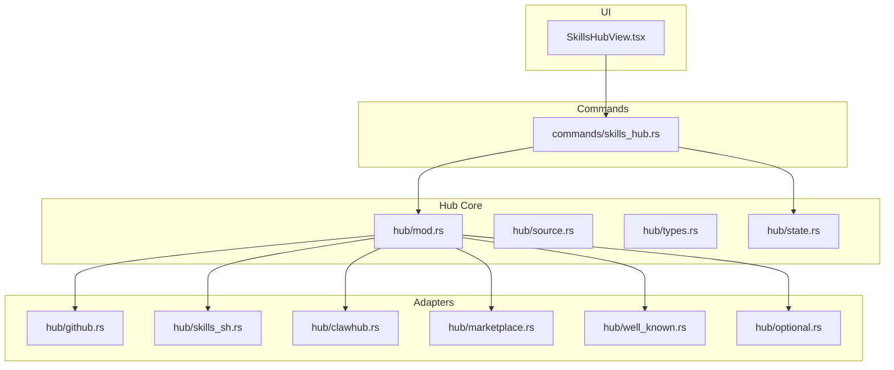
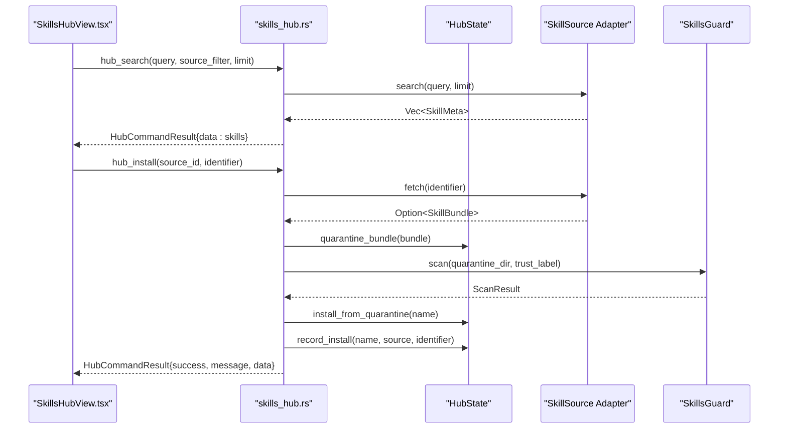
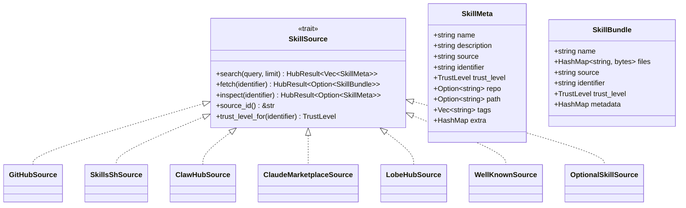
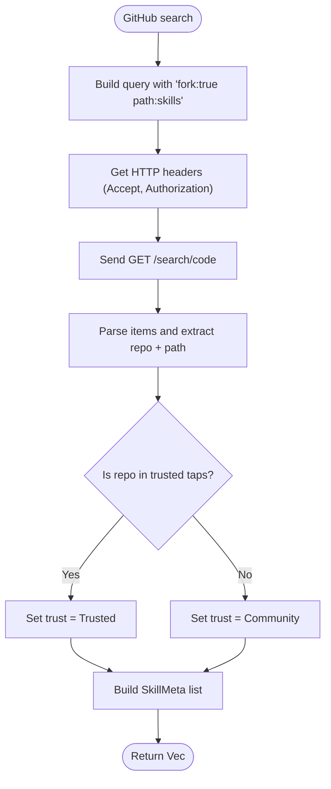
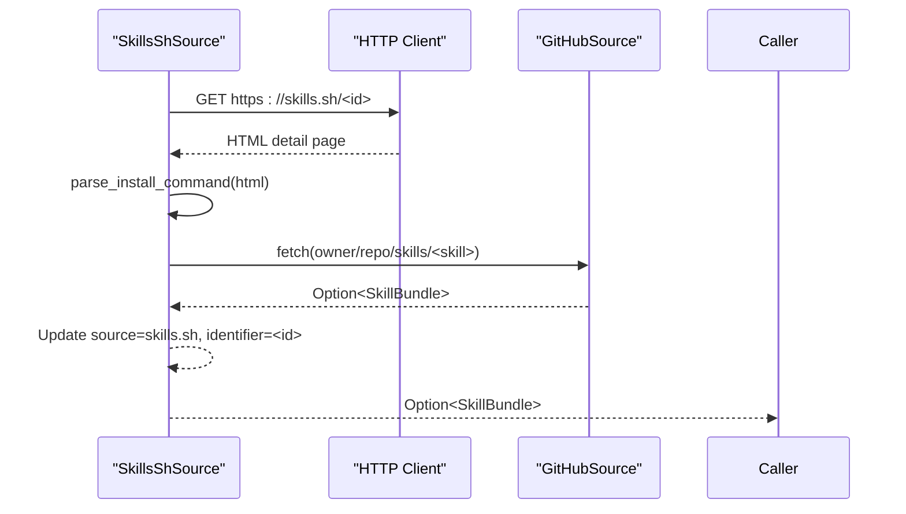
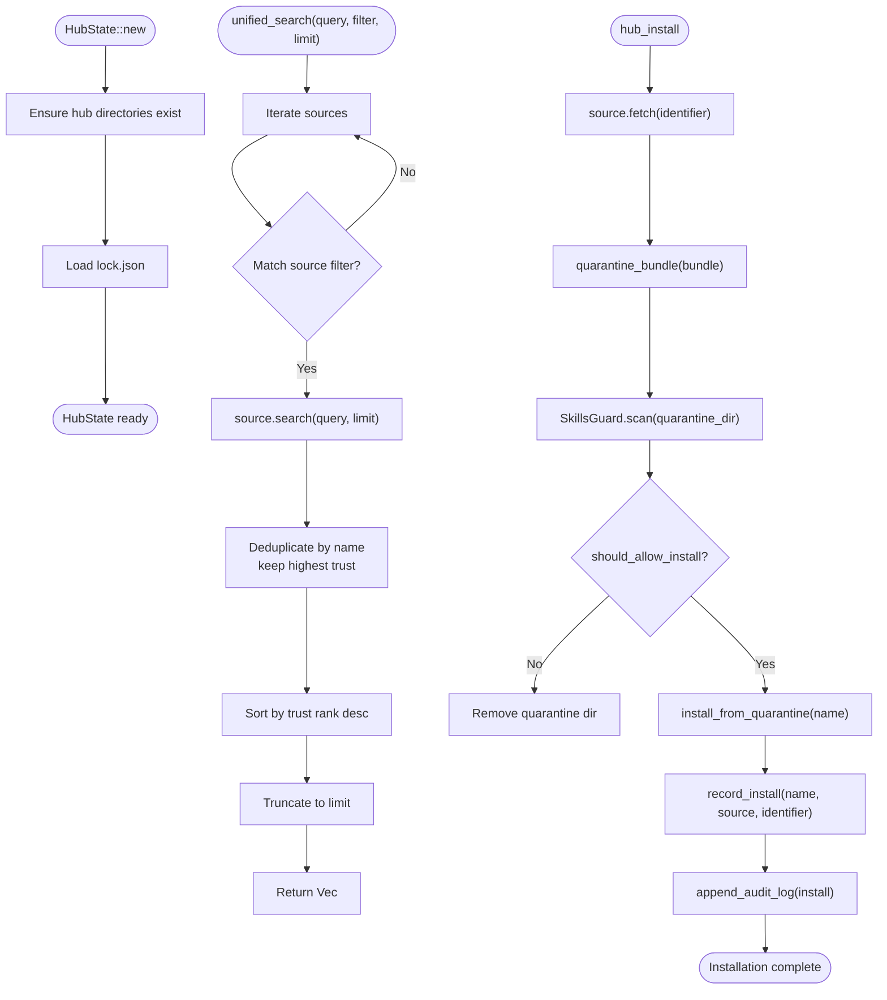
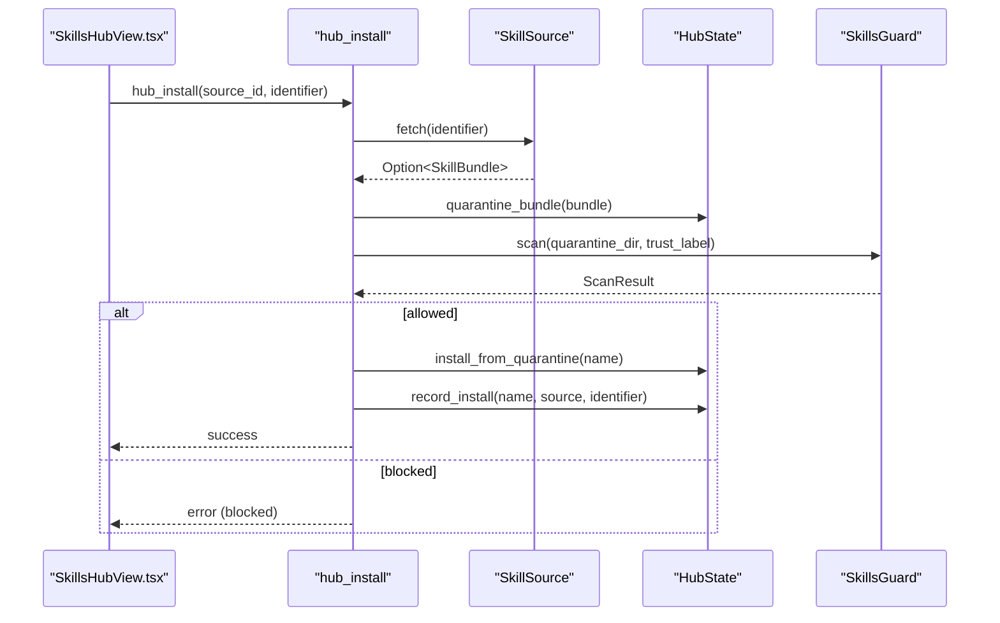
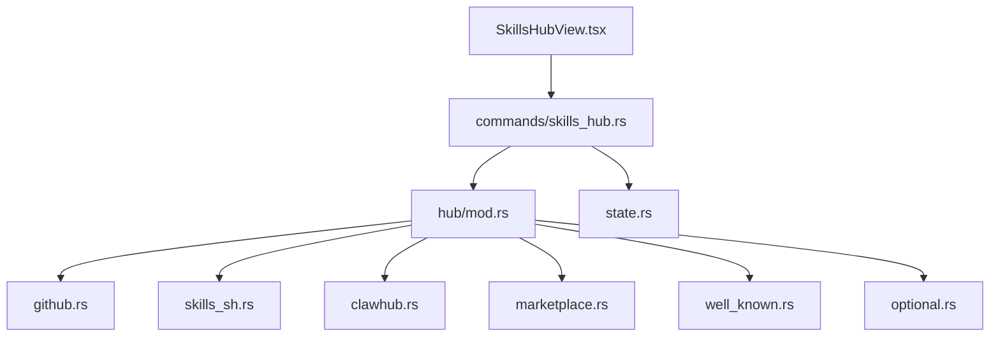

# Skills Hub Integration

<cite>
**Referenced Files in This Document**
- [mod.rs](file://src-tauri/src/modules/skills/hub/mod.rs)
- [source.rs](file://src-tauri/src/modules/skills/hub/source.rs)
- [types.rs](file://src-tauri/src/modules/skills/hub/types.rs)
- [state.rs](file://src-tauri/src/modules/skills/hub/state.rs)
- [github.rs](file://src-tauri/src/modules/skills/hub/github.rs)
- [clawhub.rs](file://src-tauri/src/modules/skills/hub/clawhub.rs)
- [marketplace.rs](file://src-tauri/src/modules/skills/hub/marketplace.rs)
- [well_known.rs](file://src-tauri/src/modules/skills/hub/well_known.rs)
- [optional.rs](file://src-tauri/src/modules/skills/hub/optional.rs)
- [skills_sh.rs](file://src-tauri/src/modules/skills/hub/skills_sh.rs)
- [skills_hub.rs](file://src-tauri/src/commands/skills_hub.rs)
- [SkillsHubView.tsx](file://src/modules/skills/SkillsHubView.tsx)
</cite>

## Table of Contents
1. [Introduction](#introduction)
2. [Project Structure](#project-structure)
3. [Core Components](#core-components)
4. [Architecture Overview](#architecture-overview)
5. [Detailed Component Analysis](#detailed-component-analysis)
6. [Dependency Analysis](#dependency-analysis)
7. [Performance Considerations](#performance-considerations)
8. [Troubleshooting Guide](#troubleshooting-guide)
9. [Conclusion](#conclusion)

## Introduction
This document describes the skills hub integration system that powers multi-source skill marketplace discovery and installation. It covers the hub state management, adapter pattern for integrating multiple sources (GitHub, skills.sh, ClawHub, Claude Marketplace, LobeHub, Well-Known, Optional), and the end-to-end workflow for skill sourcing, security scanning, and installation. The system provides a unified interface for browsing, searching, and installing skills while maintaining security through quarantine, trust levels, and audit logging.

## Project Structure
The skills hub is implemented in Rust under the Tauri backend and TypeScript/React for the UI. The core hub logic resides in the `src-tauri/src/modules/skills/hub/` directory, with command handlers in `src-tauri/src/commands/skills_hub.rs`. The UI component for browsing skills is located at `src/modules/skills/SkillsHubView.tsx`.

**Diagram sources**
- [mod.rs:12-31](file://src-tauri/src/modules/skills/hub/mod.rs#L12-L31)
- [github.rs:104-353](file://src-tauri/src/modules/skills/hub/github.rs#L104-L353)
- [skills_sh.rs:14-232](file://src-tauri/src/modules/skills/hub/skills_sh.rs#L14-L232)
- [clawhub.rs:12-61](file://src-tauri/src/modules/skills/hub/clawhub.rs#L12-L61)
- [marketplace.rs:12-91](file://src-tauri/src/modules/skills/hub/marketplace.rs#L12-L91)
- [well_known.rs:12-61](file://src-tauri/src/modules/skills/hub/well_known.rs#L12-L61)
- [optional.rs:12-54](file://src-tauri/src/modules/skills/hub/optional.rs#L12-L54)
- [state.rs:304-499](file://src-tauri/src/modules/skills/hub/state.rs#L304-L499)
- [skills_hub.rs:1-800](file://src-tauri/src/commands/skills_hub.rs#L1-L800)
- [SkillsHubView.tsx:1-425](file://src/modules/skills/SkillsHubView.tsx#L1-L425)

**Section sources**
- [mod.rs:1-32](file://src-tauri/src/modules/skills/hub/mod.rs#L1-L32)
- [skills_hub.rs:1-800](file://src-tauri/src/commands/skills_hub.rs#L1-L800)
- [SkillsHubView.tsx:1-425](file://src/modules/skills/SkillsHubView.tsx#L1-L425)

## Core Components
- SkillSource trait: Defines the contract for all hub adapters, including search, fetch, inspect, source identification, and trust level determination.
- Hub types: SkillMeta and SkillBundle define the metadata and file content structures used across sources.
- Hub state: Manages hub directories, lock file, quarantine, audit logs, and unified search with deduplication by trust rank.
- Adapter implementations: GitHub, skills.sh, ClawHub, Claude Marketplace, LobeHub, Well-Known, and Optional sources.
- Commands: Tauri commands for browsing, searching, inspecting, installing, auditing, snapshotting, and managing taps.
- UI: SkillsHubView provides a searchable, source-filterable grid of skills with trust indicators and install actions.

**Section sources**
- [source.rs:11-36](file://src-tauri/src/modules/skills/hub/source.rs#L11-L36)
- [types.rs:10-50](file://src-tauri/src/modules/skills/hub/types.rs#L10-L50)
- [state.rs:16-35](file://src-tauri/src/modules/skills/hub/state.rs#L16-L35)
- [state.rs:304-499](file://src-tauri/src/modules/skills/hub/state.rs#L304-L499)
- [mod.rs:34-47](file://src-tauri/src/modules/skills/hub/mod.rs#L34-L47)

## Architecture Overview
The system follows a modular adapter pattern with a central hub orchestrating multiple sources. The UI triggers commands that coordinate with the hub state, which in turn delegates to adapters. Installation involves fetching from a source, writing to quarantine, performing a security scan, and moving to the skills directory upon approval.

**Diagram sources**
- [SkillsHubView.tsx:72-129](file://src/modules/skills/SkillsHubView.tsx#L72-L129)
- [skills_hub.rs:132-187](file://src-tauri/src/commands/skills_hub.rs#L132-L187)
- [skills_hub.rs:448-559](file://src-tauri/src/commands/skills_hub.rs#L448-L559)
- [state.rs:341-415](file://src-tauri/src/modules/skills/hub/state.rs#L341-L415)
- [github.rs:222-283](file://src-tauri/src/modules/skills/hub/github.rs#L222-L283)

## Detailed Component Analysis

### Adapter Pattern and Hub Types
The SkillSource trait defines the interface that all adapters must implement. Hub types encapsulate skill metadata and bundles, enabling uniform handling across sources.

**Diagram sources**
- [source.rs:11-36](file://src-tauri/src/modules/skills/hub/source.rs#L11-L36)
- [types.rs:10-50](file://src-tauri/src/modules/skills/hub/types.rs#L10-L50)
- [github.rs:104-353](file://src-tauri/src/modules/skills/hub/github.rs#L104-L353)
- [skills_sh.rs:14-232](file://src-tauri/src/modules/skills/hub/skills_sh.rs#L14-L232)
- [clawhub.rs:12-61](file://src-tauri/src/modules/skills/hub/clawhub.rs#L12-L61)
- [marketplace.rs:12-91](file://src-tauri/src/modules/skills/hub/marketplace.rs#L12-L91)
- [well_known.rs:12-61](file://src-tauri/src/modules/skills/hub/well_known.rs#L12-L61)
- [optional.rs:12-54](file://src-tauri/src/modules/skills/hub/optional.rs#L12-L54)

**Section sources**
- [source.rs:11-36](file://src-tauri/src/modules/skills/hub/source.rs#L11-L36)
- [types.rs:10-50](file://src-tauri/src/modules/skills/hub/types.rs#L10-L50)

### GitHub Adapter
The GitHub adapter integrates with the GitHub API to search for skills, fetch skill bundles, and inspect metadata. It supports multiple authentication modes and determines trust levels based on a curated list of trusted repositories.

Key behaviors:
- Authentication via PAT, GitHub CLI, or anonymous access.
- Search using GitHub code search with a skills path convention.
- Fetching SKILL.md content and constructing a minimal bundle.
- Trust level determined by repository membership in trusted taps.

**Diagram sources**
- [github.rs:145-199](file://src-tauri/src/modules/skills/hub/github.rs#L145-L199)
- [github.rs:222-226](file://src-tauri/src/modules/skills/hub/github.rs#L222-L226)

**Section sources**
- [github.rs:14-20](file://src-tauri/src/modules/skills/hub/github.rs#L14-L20)
- [github.rs:22-102](file://src-tauri/src/modules/skills/hub/github.rs#L22-L102)
- [github.rs:145-199](file://src-tauri/src/modules/skills/hub/github.rs#L145-L199)
- [github.rs:222-353](file://src-tauri/src/modules/skills/hub/github.rs#L222-L353)

### skills.sh Adapter
The skills.sh adapter acts as a registry front-end that discovers the underlying GitHub repository and skill path from a skills.sh detail page, then delegates to the GitHub adapter for actual fetching and inspection.

Integration pattern:
- Fetch detail page HTML.
- Parse install command to extract GitHub repository and skill name.
- Attempt multiple candidate paths on GitHub until a bundle is found.
- Update source and identifier metadata to reflect skills.sh.

**Diagram sources**
- [skills_sh.rs:45-62](file://src-tauri/src/modules/skills/hub/skills_sh.rs#L45-L62)
- [skills_sh.rs:64-84](file://src-tauri/src/modules/skills/hub/skills_sh.rs#L64-L84)
- [skills_sh.rs:86-114](file://src-tauri/src/modules/skills/hub/skills_sh.rs#L86-L114)
- [skills_sh.rs:170-193](file://src-tauri/src/modules/skills/hub/skills_sh.rs#L170-L193)

**Section sources**
- [skills_sh.rs:14-40](file://src-tauri/src/modules/skills/hub/skills_sh.rs#L14-L40)
- [skills_sh.rs:117-232](file://src-tauri/src/modules/skills/hub/skills_sh.rs#L117-L232)

### ClawHub, Marketplace, Well-Known, and Optional Adapters
These adapters currently expose the SkillSource interface but are marked as TODO for implementation. They provide placeholders for future integrations and maintain consistent trust levels per source type.

- ClawHubSource: Community trust level.
- ClaudeMarketplaceSource and LobeHubSource: Community trust level.
- WellKnownSource: Community trust level.
- OptionalSkillSource: Builtin trust level.

**Section sources**
- [clawhub.rs:12-61](file://src-tauri/src/modules/skills/hub/clawhub.rs#L12-L61)
- [marketplace.rs:12-91](file://src-tauri/src/modules/skills/hub/marketplace.rs#L12-L91)
- [well_known.rs:12-61](file://src-tauri/src/modules/skills/hub/well_known.rs#L12-L61)
- [optional.rs:12-54](file://src-tauri/src/modules/skills/hub/optional.rs#L12-L54)

### Hub State Management
Hub state coordinates directory layout, lock management, quarantine, audit logging, and unified search. It ensures deterministic results by deduplicating skills by name and selecting the highest trust level.

Key responsibilities:
- Directory management: creates hub directories and ensures they exist.
- Lock management: maintains a JSON lock file of installed skills with timestamps and identifiers.
- Quarantine: writes fetched bundles to a quarantine area for security scanning.
- Audit: records events (install, uninstall, quarantine, block) to a JSON log.
- Unified search: aggregates results from all sources, applies source filters, and sorts by trust rank.

**Diagram sources**
- [state.rs:318-339](file://src-tauri/src/modules/skills/hub/state.rs#L318-L339)
- [state.rs:434-486](file://src-tauri/src/modules/skills/hub/state.rs#L434-L486)
- [state.rs:341-415](file://src-tauri/src/modules/skills/hub/state.rs#L341-L415)
- [state.rs:417-432](file://src-tauri/src/modules/skills/hub/state.rs#L417-L432)
- [state.rs:488-498](file://src-tauri/src/modules/skills/hub/state.rs#L488-L498)

**Section sources**
- [state.rs:16-70](file://src-tauri/src/modules/skills/hub/state.rs#L16-L70)
- [state.rs:87-167](file://src-tauri/src/modules/skills/hub/state.rs#L87-L167)
- [state.rs:304-499](file://src-tauri/src/modules/skills/hub/state.rs#L304-L499)

### Commands and Workflows
The Tauri commands implement the CLI-style operations for the hub:
- Browse: Lists skills from all sources (optionally filtered by source).
- Search: Aggregates results across sources with trust-based sorting.
- Inspect: Retrieves detailed metadata and file listing for a skill.
- Install: Full pipeline including fetch, quarantine, scan, and installation.
- Audit: Scans installed skills for security issues.
- Snapshot: Exports and imports hub configuration and installed skills.
- Tap management: Adds/removes custom GitHub sources (taps).

**Diagram sources**
- [skills_hub.rs:448-559](file://src-tauri/src/commands/skills_hub.rs#L448-L559)
- [state.rs:341-415](file://src-tauri/src/modules/skills/hub/state.rs#L341-L415)

**Section sources**
- [skills_hub.rs:81-126](file://src-tauri/src/commands/skills_hub.rs#L81-L126)
- [skills_hub.rs:132-187](file://src-tauri/src/commands/skills_hub.rs#L132-L187)
- [skills_hub.rs:203-249](file://src-tauri/src/commands/skills_hub.rs#L203-L249)
- [skills_hub.rs:448-559](file://src-tauri/src/commands/skills_hub.rs#L448-L559)
- [skills_hub.rs:335-391](file://src-tauri/src/commands/skills_hub.rs#L335-L391)
- [skills_hub.rs:598-705](file://src-tauri/src/commands/skills_hub.rs#L598-L705)
- [skills_hub.rs:711-800](file://src-tauri/src/commands/skills_hub.rs#L711-L800)

### UI Integration
The SkillsHubView component provides:
- A search bar with Enter-key submission.
- Source filter tabs for GitHub, skills.sh, ClawHub, Marketplace, and Built-in.
- Grouped results by source with trust badges and tag chips.
- Install buttons disabled for already-installed skills.
- A modal for detailed skill inspection.

**Section sources**
- [SkillsHubView.tsx:44-60](file://src/modules/skills/SkillsHubView.tsx#L44-L60)
- [SkillsHubView.tsx:72-129](file://src/modules/skills/SkillsHubView.tsx#L72-L129)
- [SkillsHubView.tsx:189-322](file://src/modules/skills/SkillsHubView.tsx#L189-L322)

## Dependency Analysis
The hub module composes multiple adapters and exposes a unified router. The commands depend on the hub state and adapters to implement end-to-end workflows. The UI depends on commands for data and actions.

**Diagram sources**
- [mod.rs:34-47](file://src-tauri/src/modules/skills/hub/mod.rs#L34-L47)
- [skills_hub.rs:1-31](file://src-tauri/src/commands/skills_hub.rs#L1-L31)

**Section sources**
- [mod.rs:34-47](file://src-tauri/src/modules/skills/hub/mod.rs#L34-L47)
- [skills_hub.rs:1-31](file://src-tauri/src/commands/skills_hub.rs#L1-L31)

## Performance Considerations
- Parallelism: The current implementation iterates through sources sequentially during search. For improved responsiveness, consider concurrent source queries with bounded concurrency and early termination when limits are reached.
- Caching: Implement index caching for frequently accessed sources (e.g., GitHub) to reduce repeated network calls.
- Deduplication cost: The unified search uses a HashMap keyed by skill name; ensure efficient hashing and consider pre-sorting to minimize comparisons.
- I/O: Quarantine and installation involve filesystem operations; batch writes and avoid unnecessary copies.

## Troubleshooting Guide
Common issues and remedies:
- Authentication failures: Verify PAT or GitHub CLI token availability for GitHub adapter.
- Network errors: Confirm connectivity and rate limits; consider retry logic with backoff.
- Parsing errors: Validate skill manifests and ensure proper UTF-8 decoding.
- Installation blocked: Review security scan findings and adjust trust policies accordingly.
- Missing skills after uninstall: Ensure lock file updates and cache invalidation occur.

**Section sources**
- [types.rs:69-90](file://src-tauri/src/modules/skills/hub/types.rs#L69-L90)
- [github.rs:66-101](file://src-tauri/src/modules/skills/hub/github.rs#L66-L101)
- [skills_hub.rs:502-513](file://src-tauri/src/commands/skills_hub.rs#L502-L513)

## Conclusion
The skills hub integration system provides a robust, extensible foundation for multi-source skill discovery and installation. By leveraging a consistent adapter interface, centralized state management, and a secure installation pipeline, it enables users to safely explore, evaluate, and integrate skills from various marketplaces. Future enhancements can focus on parallelized source queries, caching strategies, and expanded marketplace integrations.