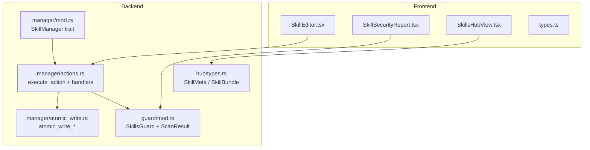
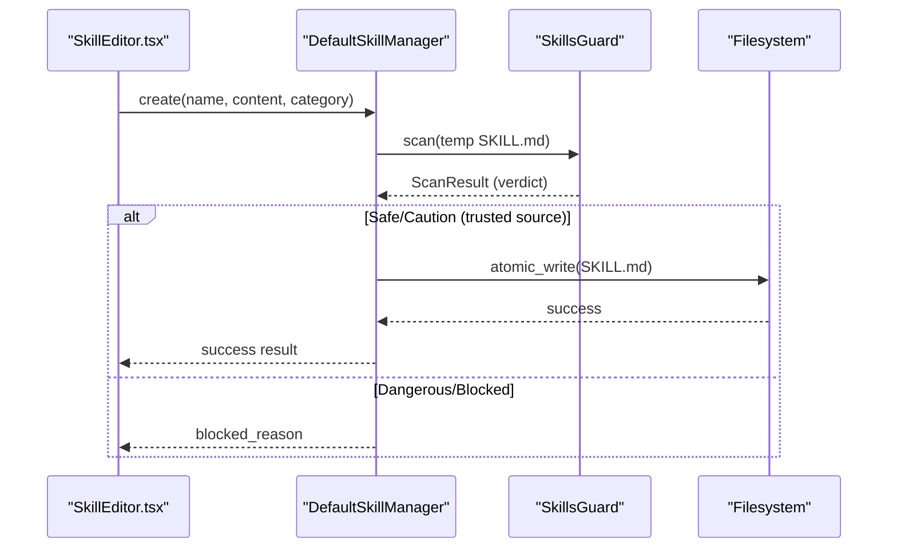
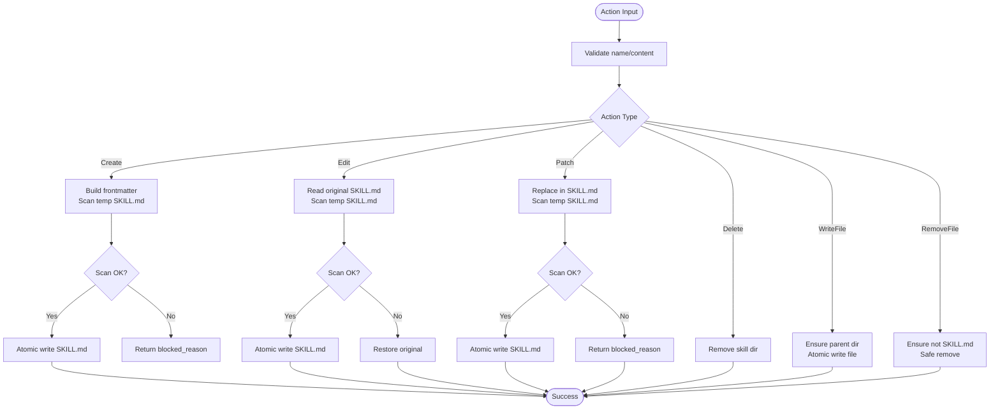
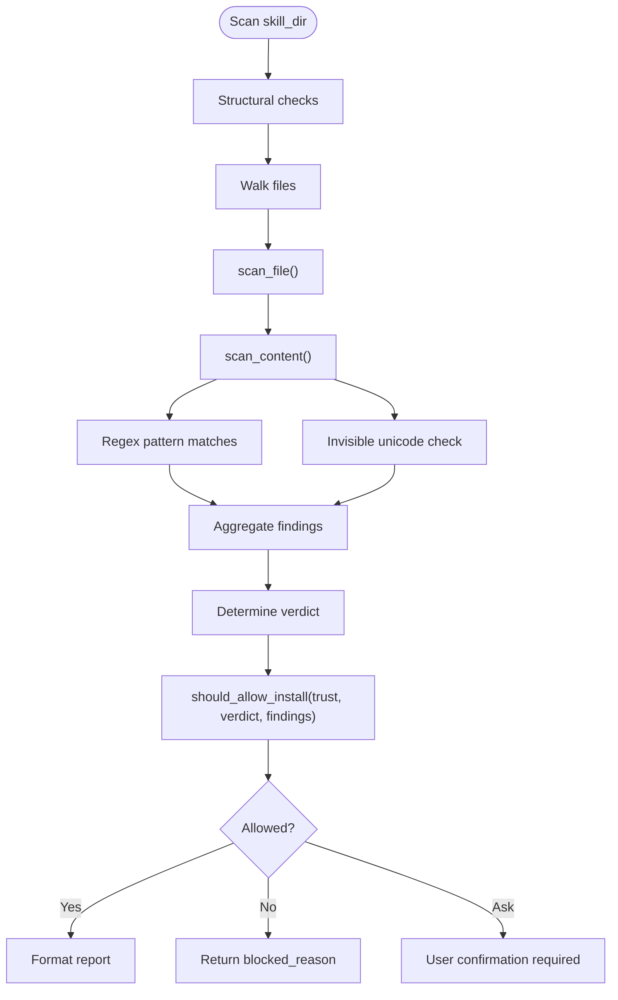
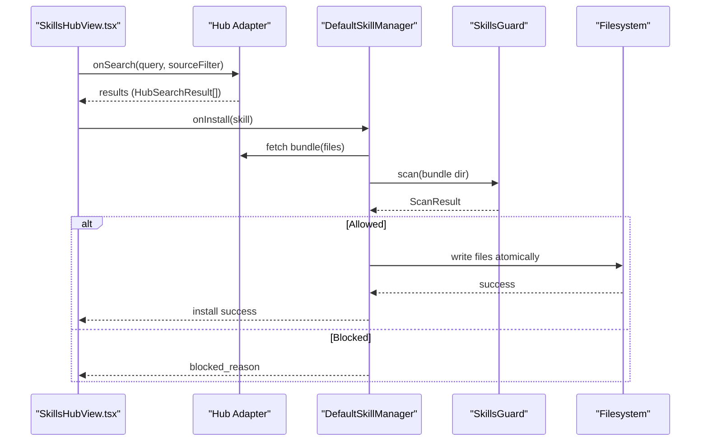
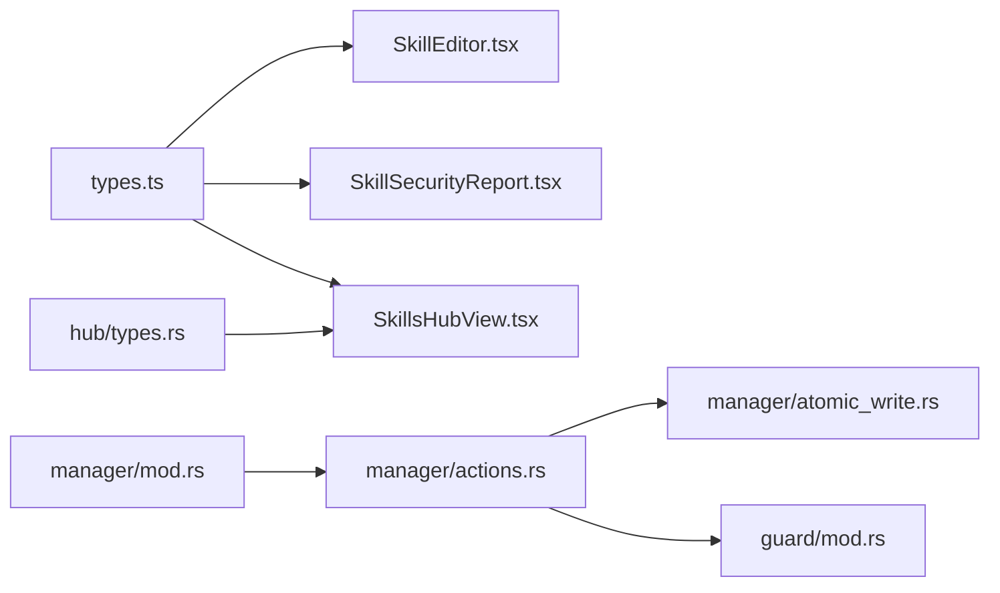

# Skills Management

<cite>
**Referenced Files in This Document**
- [types.ts](file://src/modules/skills/types.ts)
- [index.ts](file://src/modules/skills/index.ts)
- [SkillEditor.tsx](file://src/modules/skills/SkillEditor.tsx)
- [SkillSecurityReport.tsx](file://src/modules/skills/SkillSecurityReport.tsx)
- [SkillsHubView.tsx](file://src/modules/skills/SkillsHubView.tsx)
- [mod.rs](file://src-tauri/src/modules/skills/manager/mod.rs)
- [actions.rs](file://src-tauri/src/modules/skills/manager/actions.rs)
- [atomic_write.rs](file://src-tauri/src/modules/skills/manager/atomic_write.rs)
- [mod.rs (guard)](file://src-tauri/src/modules/skills/guard/mod.rs)
- [types.rs (hub)](file://src-tauri/src/modules/skills/hub/types.rs)
- [Skill-Control-Plane-v2.md](file://docs/design-docs/postCLI/Skill-Control-Plane-v2.md)
</cite>

## Table of Contents
1. [Introduction](#introduction)
2. [Project Structure](#project-structure)
3. [Core Components](#core-components)
4. [Architecture Overview](#architecture-overview)
5. [Detailed Component Analysis](#detailed-component-analysis)
6. [Dependency Analysis](#dependency-analysis)
7. [Performance Considerations](#performance-considerations)
8. [Troubleshooting Guide](#troubleshooting-guide)
9. [Conclusion](#conclusion)

## Introduction
This document describes the skills management system that powers the creation, editing, validation, and lifecycle management of skills in the application. It covers both the frontend UI components for authoring and reviewing skills and the backend Rust implementation for secure CRUD operations, atomic writes, and security scanning. It also documents integration with external skill hubs and remote passthrough mechanisms, along with validation rules, type definitions, and state transitions.

## Project Structure
The skills management system spans both the frontend and backend:

- Frontend (React):
  - SkillEditor: form-based editor for SKILL.md frontmatter with validation
  - SkillSecurityReport: rendering of security scan results
  - SkillsHubView: browsing and installing skills from multiple sources
  - Shared types for security findings, trust levels, hub results, and configuration variables

- Backend (Rust):
  - SkillManager trait and DefaultSkillManager implementation
  - Action handlers for Create/Edit/Patch/Delete and supporting file operations
  - Atomic write utilities ensuring crash-safe file updates
  - SkillsGuard security scanner with trust-aware policies
  - Hub types for skill metadata and bundles



**Diagram sources**
- [SkillEditor.tsx:1-360](file://src/modules/skills/SkillEditor.tsx#L1-L360)
- [SkillSecurityReport.tsx:1-188](file://src/modules/skills/SkillSecurityReport.tsx#L1-L188)
- [SkillsHubView.tsx:1-425](file://src/modules/skills/SkillsHubView.tsx#L1-L425)
- [types.ts:1-157](file://src/modules/skills/types.ts#L1-L157)
- [mod.rs:1-417](file://src-tauri/src/modules/skills/manager/mod.rs#L1-L417)
- [actions.rs:1-625](file://src-tauri/src/modules/skills/manager/actions.rs#L1-L625)
- [atomic_write.rs:1-268](file://src-tauri/src/modules/skills/manager/atomic_write.rs#L1-L268)
- [mod.rs (guard):1-809](file://src-tauri/src/modules/skills/guard/mod.rs#L1-L809)
- [types.rs (hub):1-118](file://src-tauri/src/modules/skills/hub/types.rs#L1-L118)

**Section sources**
- [index.ts:1-9](file://src/modules/skills/index.ts#L1-L9)
- [types.ts:1-157](file://src/modules/skills/types.ts#L1-L157)
- [SkillEditor.tsx:1-360](file://src/modules/skills/SkillEditor.tsx#L1-L360)
- [SkillSecurityReport.tsx:1-188](file://src/modules/skills/SkillSecurityReport.tsx#L1-L188)
- [SkillsHubView.tsx:1-425](file://src/modules/skills/SkillsHubView.tsx#L1-L425)
- [mod.rs:1-417](file://src-tauri/src/modules/skills/manager/mod.rs#L1-L417)
- [actions.rs:1-625](file://src-tauri/src/modules/skills/manager/actions.rs#L1-L625)
- [atomic_write.rs:1-268](file://src-tauri/src/modules/skills/manager/atomic_write.rs#L1-L268)
- [mod.rs (guard):1-809](file://src-tauri/src/modules/skills/guard/mod.rs#L1-L809)
- [types.rs (hub):1-118](file://src-tauri/src/modules/skills/hub/types.rs#L1-L118)

## Core Components
- Frontend types and UI:
  - SecurityFinding, ScanResult, TrustLevel, HubSearchResult, SkillBundle, SkillConfigVar, SkillFrontmatter
  - SkillEditor: validates frontmatter and generates SKILL.md content
  - SkillSecurityReport: renders scan results with severity and trust labels
  - SkillsHubView: search/filter/install skills from multiple sources

- Backend manager and actions:
  - SkillManager trait and DefaultSkillManager
  - execute_action dispatches Create/Edit/Patch/Delete/WriteFile/RemoveFile
  - Atomic write utilities for crash-safe file operations
  - SkillsGuard security scanner with trust-aware policy decisions

**Section sources**
- [types.ts:1-157](file://src/modules/skills/types.ts#L1-L157)
- [SkillEditor.tsx:58-113](file://src/modules/skills/SkillEditor.tsx#L58-L113)
- [SkillSecurityReport.tsx:115-185](file://src/modules/skills/SkillSecurityReport.tsx#L115-L185)
- [SkillsHubView.tsx:62-322](file://src/modules/skills/SkillsHubView.tsx#L62-L322)
- [mod.rs:88-286](file://src-tauri/src/modules/skills/manager/mod.rs#L88-L286)
- [actions.rs:144-189](file://src-tauri/src/modules/skills/manager/actions.rs#L144-L189)
- [atomic_write.rs:48-183](file://src-tauri/src/modules/skills/manager/atomic_write.rs#L48-L183)
- [mod.rs (guard):95-520](file://src-tauri/src/modules/skills/guard/mod.rs#L95-L520)

## Architecture Overview
The system enforces a strict security-first workflow:
- Frontend collects user input and validates it locally
- Backend performs security scans before any mutation
- Atomic writes ensure crash-consistent file system updates
- Trust levels and policy decisions govern acceptance of external skills



**Diagram sources**
- [SkillEditor.tsx:94-113](file://src/modules/skills/SkillEditor.tsx#L94-L113)
- [mod.rs:165-286](file://src-tauri/src/modules/skills/manager/mod.rs#L165-L286)
- [actions.rs:191-250](file://src-tauri/src/modules/skills/manager/actions.rs#L191-L250)
- [mod.rs (guard):130-183](file://src-tauri/src/modules/skills/guard/mod.rs#L130-L183)
- [atomic_write.rs:48-110](file://src-tauri/src/modules/skills/manager/atomic_write.rs#L48-L110)

## Detailed Component Analysis

### Frontend Types and UI
- Security types:
  - SecurityFinding mirrors backend findings with pattern_id, severity, category, file, line, match_text, description
  - ScanResult includes skill_name, source, trust_level, verdict, findings, scanned_at, summary
  - TrustLevel union type and display labels
- Editor:
  - Validates name (lowercase alphanumeric and hyphens, max length), description (max length), platforms (whitelist), and config variables (key presence, description length)
  - Generates frontmatter and SKILL.md content preview
- Security report:
  - Renders verdict badges, severity icons/colors, and findings list
- Hub view:
  - Search across sources, filter by source/trust level, and install actions

```mermaid
classDiagram
class SecurityFinding {
+string pattern_id
+string severity
+string category
+string file
+number line
+string match_text
+string description
}
class ScanResult {
+string skill_name
+string source
+TrustLevel trust_level
+string verdict
+SecurityFinding[] findings
+string scanned_at
+string summary
}
class TrustLevel {
<<union>>
"builtin"|"trusted"|"community"|"agent-created"
}
class SkillEditor {
+validate()
+handleSave()
+addConfigVar()
+updateConfigVar()
+removeConfigVar()
+togglePlatform()
}
class SkillSecurityReport {
+render()
}
class SkillsHubView {
+handleSearch()
+filteredResults()
+groupedBySource()
}
ScanResult --> SecurityFinding : "contains"
SkillEditor --> ScanResult : "generates preview"
SkillsHubView --> ScanResult : "displays trust/verdict"
```

**Diagram sources**
- [types.ts:12-48](file://src/modules/skills/types.ts#L12-L48)
- [types.ts:54-54](file://src/modules/skills/types.ts#L54-L54)
- [SkillEditor.tsx:58-142](file://src/modules/skills/SkillEditor.tsx#L58-L142)
- [SkillSecurityReport.tsx:115-185](file://src/modules/skills/SkillSecurityReport.tsx#L115-L185)
- [SkillsHubView.tsx:62-322](file://src/modules/skills/SkillsHubView.tsx#L62-L322)

**Section sources**
- [types.ts:12-157](file://src/modules/skills/types.ts#L12-L157)
- [SkillEditor.tsx:58-142](file://src/modules/skills/SkillEditor.tsx#L58-L142)
- [SkillSecurityReport.tsx:115-185](file://src/modules/skills/SkillSecurityReport.tsx#L115-L185)
- [SkillsHubView.tsx:62-322](file://src/modules/skills/SkillsHubView.tsx#L62-L322)

### Backend Manager and Actions
- SkillManageAction variants: Create, Edit, Patch, Delete, WriteFile, RemoveFile
- execute_action validates inputs, resolves skill directory, and dispatches to handlers
- Handlers:
  - Create: builds frontmatter, scans in temp dir, then atomic write
  - Edit: reads original, scans temp, rollback on failure
  - Patch: finds and replaces in SKILL.md, scans temp, rollback on failure
  - Delete: removes skill directory
  - WriteFile/RemoveFile: validate allowed subdirectories, enforce file size limits, atomic write/remove
- Atomic write:
  - Uses temp file + rename for crash safety
  - Supports rollback with backup restoration



**Diagram sources**
- [actions.rs:144-482](file://src-tauri/src/modules/skills/manager/actions.rs#L144-L482)
- [atomic_write.rs:48-183](file://src-tauri/src/modules/skills/manager/atomic_write.rs#L48-L183)

**Section sources**
- [actions.rs:82-189](file://src-tauri/src/modules/skills/manager/actions.rs#L82-L189)
- [actions.rs:191-482](file://src-tauri/src/modules/skills/manager/actions.rs#L191-L482)
- [atomic_write.rs:48-183](file://src-tauri/src/modules/skills/manager/atomic_write.rs#L48-L183)
- [mod.rs:88-286](file://src-tauri/src/modules/skills/manager/mod.rs#L88-L286)

### Security Scanner and Policy
- SkillsGuard scans recursively:
  - Structural checks (file counts, sizes, symlinks)
  - Regex-based threat patterns
  - Invisible Unicode detection
- Verdict computation: Safe, Caution, Dangerous
- Trust-aware policy:
  - builtin: always allowed
  - trusted: caution findings allowed
  - community: any findings blocked unless forced
  - agent-created: dangerous verdict triggers “ask” (not block)
- Runtime command scanning for bash execution safety



**Diagram sources**
- [mod.rs (guard):130-520](file://src-tauri/src/modules/skills/guard/mod.rs#L130-L520)

**Section sources**
- [mod.rs (guard):13-520](file://src-tauri/src/modules/skills/guard/mod.rs#L13-L520)

### Hub Integration and Remote Passthrough
- Hub types:
  - SkillMeta: name, description, source, identifier, trust_level, repo, path, tags, extra
  - SkillBundle: name, files map, source, identifier, trust_level, metadata
  - HubResult and HubError for network/auth/io handling
- SkillsHubView:
  - Search across sources (github, skills.sh, clawhub, marketplace, builtin)
  - Filter by trust level and tags
  - Install flow invokes backend actions to download and place files
- Remote passthrough:
  - Backend supports scanning and installation of skills from external sources
  - Trust level resolution influences policy decisions



**Diagram sources**
- [SkillsHubView.tsx:62-322](file://src/modules/skills/SkillsHubView.tsx#L62-L322)
- [types.rs (hub):10-50](file://src-tauri/src/modules/skills/hub/types.rs#L10-L50)
- [actions.rs:191-250](file://src-tauri/src/modules/skills/manager/actions.rs#L191-L250)
- [mod.rs (guard):130-183](file://src-tauri/src/modules/skills/guard/mod.rs#L130-L183)

**Section sources**
- [types.rs (hub):10-118](file://src-tauri/src/modules/skills/hub/types.rs#L10-L118)
- [SkillsHubView.tsx:62-322](file://src/modules/skills/SkillsHubView.tsx#L62-L322)

## Dependency Analysis
- Frontend depends on shared types for security and hub interactions
- Backend manager depends on:
  - SkillsGuard for security scanning
  - Atomic write utilities for crash-safe file operations
  - Hub types for external skill metadata and bundles
- Action handlers depend on validators and allowed subdirectories for file operations



**Diagram sources**
- [types.ts:1-157](file://src/modules/skills/types.ts#L1-L157)
- [SkillEditor.tsx:1-360](file://src/modules/skills/SkillEditor.tsx#L1-L360)
- [SkillSecurityReport.tsx:1-188](file://src/modules/skills/SkillSecurityReport.tsx#L1-L188)
- [SkillsHubView.tsx:1-425](file://src/modules/skills/SkillsHubView.tsx#L1-L425)
- [mod.rs:1-417](file://src-tauri/src/modules/skills/manager/mod.rs#L1-L417)
- [actions.rs:1-625](file://src-tauri/src/modules/skills/manager/actions.rs#L1-L625)
- [atomic_write.rs:1-268](file://src-tauri/src/modules/skills/manager/atomic_write.rs#L1-L268)
- [mod.rs (guard):1-809](file://src-tauri/src/modules/skills/guard/mod.rs#L1-L809)
- [types.rs (hub):1-118](file://src-tauri/src/modules/skills/hub/types.rs#L1-L118)

**Section sources**
- [mod.rs:1-417](file://src-tauri/src/modules/skills/manager/mod.rs#L1-L417)
- [actions.rs:1-625](file://src-tauri/src/modules/skills/manager/actions.rs#L1-L625)
- [atomic_write.rs:1-268](file://src-tauri/src/modules/skills/manager/atomic_write.rs#L1-L268)
- [mod.rs (guard):1-809](file://src-tauri/src/modules/skills/guard/mod.rs#L1-L809)
- [types.rs (hub):1-118](file://src-tauri/src/modules/skills/hub/types.rs#L1-L118)

## Performance Considerations
- Scanning scales with file count and size; keep skill directories minimal and avoid large binary assets
- Atomic writes minimize partial writes and reduce retries; ensure temp and target directories are on the same filesystem
- Frontend validation reduces unnecessary backend calls by catching errors early
- Trust-aware policy avoids scanning trusted sources when possible

## Troubleshooting Guide
- Validation failures:
  - Name must be lowercase alphanumeric and hyphens, under 64 chars
  - Description must be under 1024 chars
  - Platforms must be from supported whitelist
  - Config variables require non-empty keys and descriptions under 256 chars
- Security scan blocked:
  - Review findings and adjust content; consider reducing severity or removing risky patterns
  - For agent-created skills with dangerous verdict, user confirmation may be required
- File operations:
  - Allowed subdirectories enforced for WriteFile; ensure paths are within permitted sets
  - Cannot remove SKILL.md via RemoveFile
  - Atomic write failures trigger cleanup and rollback where applicable

**Section sources**
- [SkillEditor.tsx:58-92](file://src/modules/skills/SkillEditor.tsx#L58-L92)
- [actions.rs:400-482](file://src-tauri/src/modules/skills/manager/actions.rs#L400-L482)
- [atomic_write.rs:130-183](file://src-tauri/src/modules/skills/manager/atomic_write.rs#L130-L183)
- [mod.rs (guard):341-356](file://src-tauri/src/modules/skills/guard/mod.rs#L341-L356)

## Conclusion
The skills management system combines a robust frontend authoring experience with a secure, trust-aware backend. It enforces validation, security scanning, and atomic writes to maintain a reliable and safe skill lifecycle. Integration with external hubs and remote passthrough enables discovery and installation of skills while preserving system integrity through policy-driven decisions.