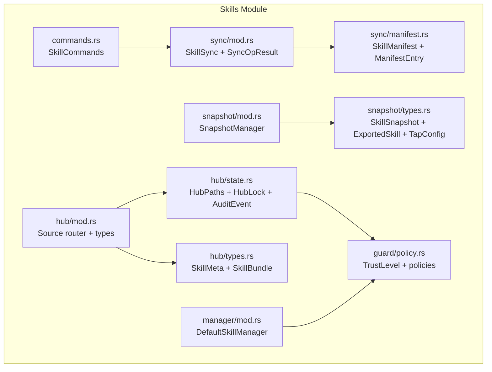
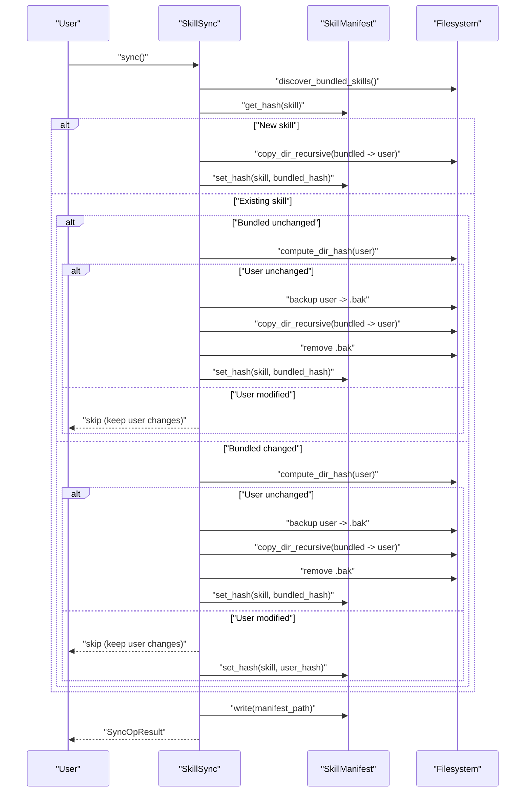
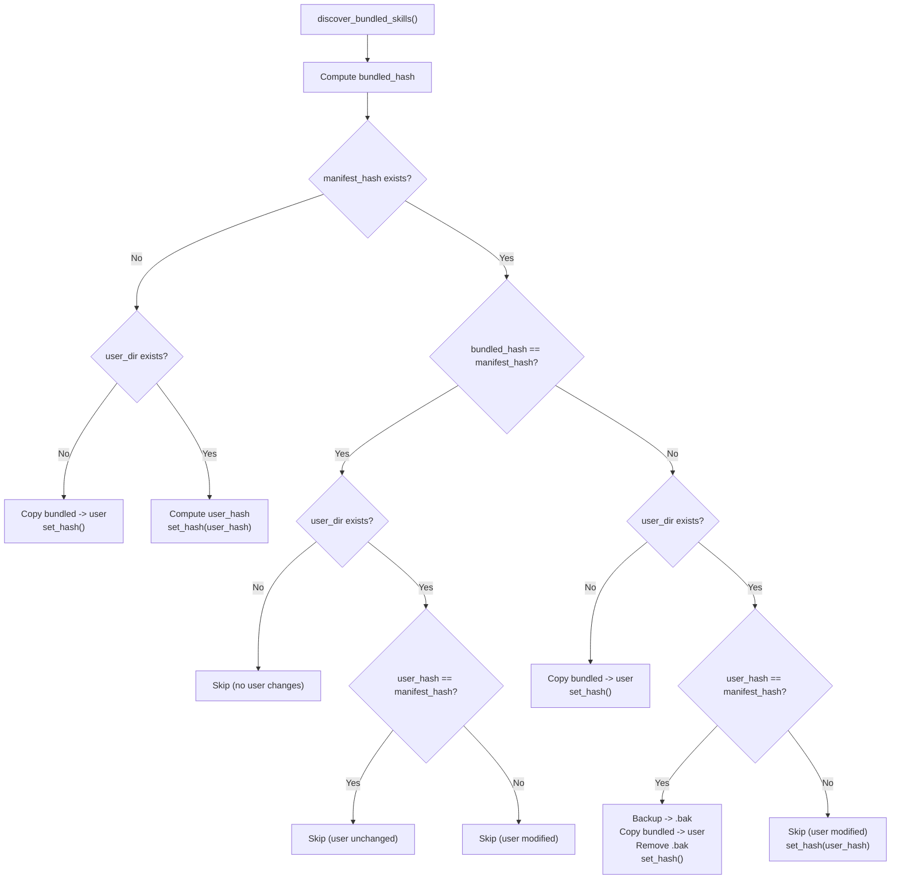
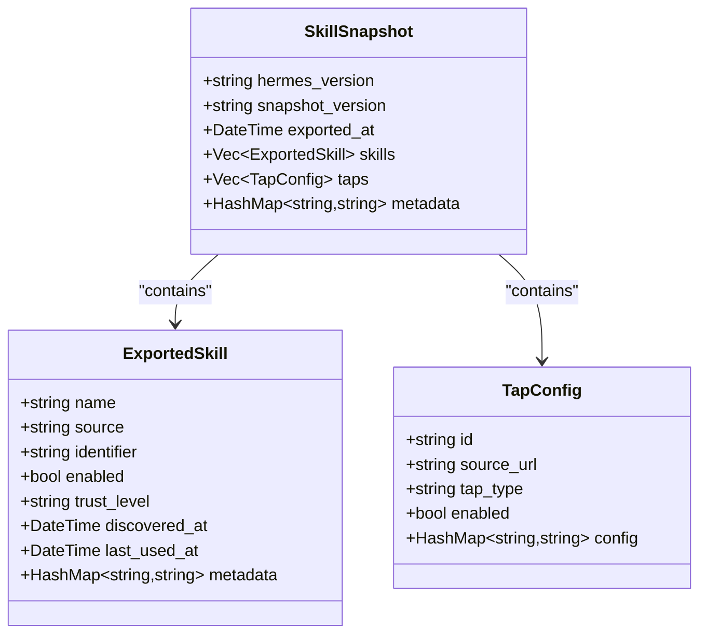
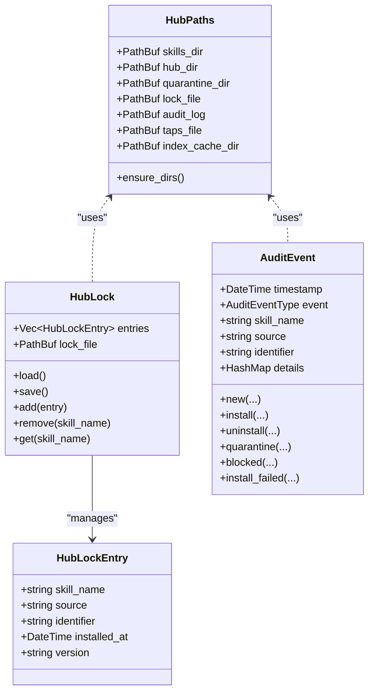
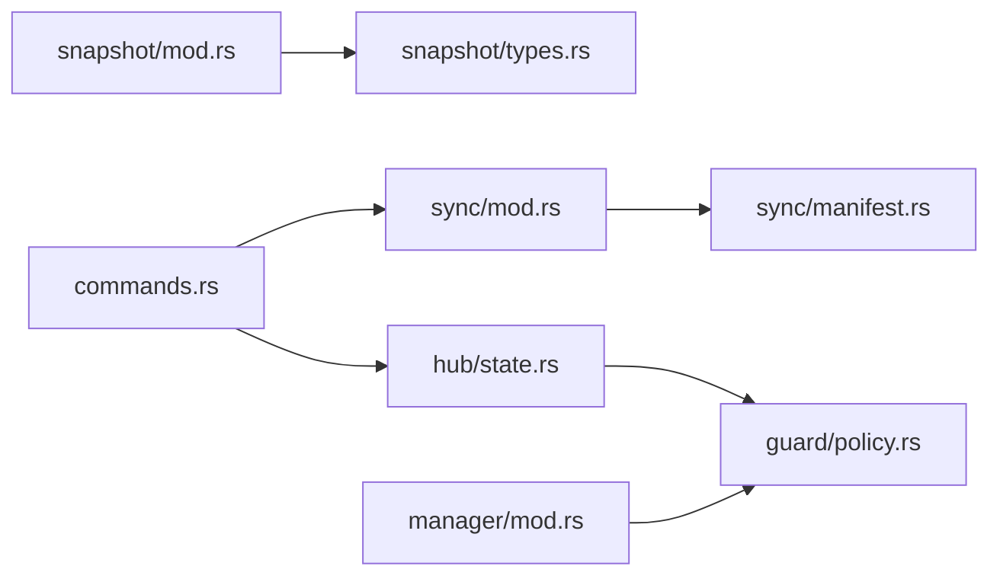

# Skills Synchronization

<cite>
**Referenced Files in This Document**
- [src-tauri/src/modules/skills/mod.rs](file://src-tauri/src/modules/skills/mod.rs)
- [src-tauri/src/modules/skills/sync/mod.rs](file://src-tauri/src/modules/skills/sync/mod.rs)
- [src-tauri/src/modules/skills/sync/manifest.rs](file://src-tauri/src/modules/skills/sync/manifest.rs)
- [src-tauri/src/modules/skills/snapshot/mod.rs](file://src-tauri/src/modules/skills/snapshot/mod.rs)
- [src-tauri/src/modules/skills/snapshot/types.rs](file://src-tauri/src/modules/skills/snapshot/types.rs)
- [src-tauri/src/modules/skills/hub/mod.rs](file://src-tauri/src/modules/skills/hub/mod.rs)
- [src-tauri/src/modules/skills/hub/state.rs](file://src-tauri/src/modules/skills/hub/state.rs)
- [src-tauri/src/modules/skills/hub/types.rs](file://src-tauri/src/modules/skills/hub/types.rs)
- [src-tauri/src/modules/skills/commands.rs](file://src-tauri/src/modules/skills/commands.rs)
- [src-tauri/src/modules/skills/manager/mod.rs](file://src-tauri/src/modules/skills/manager/mod.rs)
- [src-tauri/src/modules/skills/guard/policy.rs](file://src-tauri/src/modules/skills/guard/policy.rs)
</cite>

## Table of Contents
1. [Introduction](#introduction)
2. [Project Structure](#project-structure)
3. [Core Components](#core-components)
4. [Architecture Overview](#architecture-overview)
5. [Detailed Component Analysis](#detailed-component-analysis)
6. [Dependency Analysis](#dependency-analysis)
7. [Performance Considerations](#performance-considerations)
8. [Troubleshooting Guide](#troubleshooting-guide)
9. [Conclusion](#conclusion)

## Introduction
This document describes the skills synchronization system that powers manifest-based bundled skill synchronization in the if2Ai codebase. It covers:
- Manifest parsing and version handling
- Skill bundling and synchronization workflows
- Snapshot functionality for export/import of skills configuration
- Synchronization state management and conflict resolution
- Examples of manifest creation, skill bundling, synchronization triggers, and snapshot operations

The system ensures that bundled skills are safely synchronized into user directories while tracking changes via a manifest, preventing accidental overwrites of user modifications, and providing robust snapshot-based import/export capabilities.

## Project Structure
The skills subsystem is organized into cohesive modules:
- sync: Manifest-based synchronization of bundled skills
- snapshot: Export/import of skills configuration snapshots
- hub: Multi-source skill marketplace adapters and state management
- commands: Slash command integration for skill invocation
- manager: CRUD operations for skill directories with security scanning
- guard: Threat scanning and policy enforcement



**Diagram sources**
- [src-tauri/src/modules/skills/sync/mod.rs:1-394](file://src-tauri/src/modules/skills/sync/mod.rs#L1-L394)
- [src-tauri/src/modules/skills/sync/manifest.rs:1-258](file://src-tauri/src/modules/skills/sync/manifest.rs#L1-L258)
- [src-tauri/src/modules/skills/snapshot/mod.rs:1-421](file://src-tauri/src/modules/skills/snapshot/mod.rs#L1-L421)
- [src-tauri/src/modules/skills/snapshot/types.rs:1-310](file://src-tauri/src/modules/skills/snapshot/types.rs#L1-L310)
- [src-tauri/src/modules/skills/hub/mod.rs:1-101](file://src-tauri/src/modules/skills/hub/mod.rs#L1-L101)
- [src-tauri/src/modules/skills/hub/state.rs:1-617](file://src-tauri/src/modules/skills/hub/state.rs#L1-L617)
- [src-tauri/src/modules/skills/hub/types.rs:1-118](file://src-tauri/src/modules/skills/hub/types.rs#L1-L118)
- [src-tauri/src/modules/skills/commands.rs:1-788](file://src-tauri/src/modules/skills/commands.rs#L1-L788)
- [src-tauri/src/modules/skills/manager/mod.rs:1-417](file://src-tauri/src/modules/skills/manager/mod.rs#L1-L417)
- [src-tauri/src/modules/skills/guard/policy.rs](file://src-tauri/src/modules/skills/guard/policy.rs)

**Section sources**
- [src-tauri/src/modules/skills/mod.rs:1-22](file://src-tauri/src/modules/skills/mod.rs#L1-L22)

## Core Components
- SkillSync: Discovers bundled skills, computes directory hashes, and performs synchronization with conflict-aware updates and backups.
- SkillManifest: Tracks bundled skill hashes across versions, supports v1/v2 formats, and writes atomically.
- SnapshotManager: Exports and imports skills configuration snapshots with validation and listing capabilities.
- SkillSnapshot: Data model for snapshot format including skills, taps, and metadata.
- HubState: Manages hub paths, lock file, quarantine, audit logs, and unified search with trust-based deduplication.
- DefaultSkillManager: Provides CRUD operations for skills with security scanning and atomic writes.

**Section sources**
- [src-tauri/src/modules/skills/sync/mod.rs:32-273](file://src-tauri/src/modules/skills/sync/mod.rs#L32-L273)
- [src-tauri/src/modules/skills/sync/manifest.rs:65-173](file://src-tauri/src/modules/skills/sync/manifest.rs#L65-L173)
- [src-tauri/src/modules/skills/snapshot/mod.rs:31-258](file://src-tauri/src/modules/skills/snapshot/mod.rs#L31-L258)
- [src-tauri/src/modules/skills/snapshot/types.rs:12-179](file://src-tauri/src/modules/skills/snapshot/types.rs#L12-L179)
- [src-tauri/src/modules/skills/hub/state.rs:304-499](file://src-tauri/src/modules/skills/hub/state.rs#L304-L499)
- [src-tauri/src/modules/skills/manager/mod.rs:88-286](file://src-tauri/src/modules/skills/manager/mod.rs#L88-L286)

## Architecture Overview
The synchronization system integrates manifest tracking, snapshot operations, and hub state management to provide a robust skills lifecycle:



**Diagram sources**
- [src-tauri/src/modules/skills/sync/mod.rs:132-272](file://src-tauri/src/modules/skills/sync/mod.rs#L132-L272)
- [src-tauri/src/modules/skills/sync/manifest.rs:113-146](file://src-tauri/src/modules/skills/sync/manifest.rs#L113-L146)

## Detailed Component Analysis

### Manifest Parsing and Version Handling
- Format support:
  - v1: Plain skill names per line
  - v2: "name:hash" per line with automatic detection
- Atomic write: Uses temporary file + rename to ensure consistency
- Error handling: Dedicated SyncError enum covering IO, parse, and other failures

```mermaid
flowchart TD
Start(["Read manifest"]) --> Exists{"Manifest exists?"}
Exists --> |No| ReturnEmpty["Return empty manifest"]
Exists --> |Yes| Parse["Parse lines"]
Parse --> LineType{"Line format?"}
LineType --> |v2 "name:hash"| InsertV2["Insert into entries"]
LineType --> |Plain name| InsertV1["Insert with empty hash"]
InsertV2 --> Done(["Done"])
InsertV1 --> Done
ReturnEmpty --> Done
```

**Diagram sources**
- [src-tauri/src/modules/skills/sync/manifest.rs:79-111](file://src-tauri/src/modules/skills/sync/manifest.rs#L79-L111)

**Section sources**
- [src-tauri/src/modules/skills/sync/manifest.rs:10-173](file://src-tauri/src/modules/skills/sync/manifest.rs#L10-L173)

### Skill Bundling and Synchronization Workflows
- Discovery: Scans bundled directory for subdirectories containing a skill manifest file
- Hash computation: Recursively collects files, sorts by path, and computes a combined MD5 hash
- Conflict resolution:
  - New bundled skills are copied
  - Existing bundled unchanged: update only if user did not modify
  - Existing bundled changed: update only if user did not modify; otherwise preserve user changes
  - Backup strategy: temporary .bak during updates to rollback on failure
- Cleanup: Removes entries from manifest for skills no longer bundled



**Diagram sources**
- [src-tauri/src/modules/skills/sync/mod.rs:139-272](file://src-tauri/src/modules/skills/sync/mod.rs#L139-L272)

**Section sources**
- [src-tauri/src/modules/skills/sync/mod.rs:81-273](file://src-tauri/src/modules/skills/sync/mod.rs#L81-L273)

### Snapshot Functionality: Types and Serialization
- Snapshot types:
  - SkillSnapshot: Top-level container with versioning, export timestamp, skills, taps, and metadata
  - ExportedSkill: Describes a skill with source, identifier, enablement, trust level, timestamps, and metadata
  - TapConfig: Describes a tap with id, URL, type, enablement, and config
- Serialization: Uses serde JSON with pretty-printing for exports
- Validation: Ensures required fields (versions, skill/tap identifiers) are present



**Diagram sources**
- [src-tauri/src/modules/skills/snapshot/types.rs:16-179](file://src-tauri/src/modules/skills/snapshot/types.rs#L16-L179)

**Section sources**
- [src-tauri/src/modules/skills/snapshot/types.rs:9-179](file://src-tauri/src/modules/skills/snapshot/types.rs#L9-L179)
- [src-tauri/src/modules/skills/snapshot/mod.rs:75-258](file://src-tauri/src/modules/skills/snapshot/mod.rs#L75-L258)

### Synchronization State Management and Conflict Resolution
- HubPaths: Defines directory layout for skills, hub state, quarantine, lock, audit, and index cache
- HubLock: Thread-safe lock file tracking installed skills with add/remove/get/save operations
- AuditEvent: Structured events for install/uninstall/update/quarantine/blocked/failed actions
- Unified search: Aggregates results from multiple sources with trust-based deduplication



**Diagram sources**
- [src-tauri/src/modules/skills/hub/state.rs:16-167](file://src-tauri/src/modules/skills/hub/state.rs#L16-L167)
- [src-tauri/src/modules/skills/hub/state.rs:169-292](file://src-tauri/src/modules/skills/hub/state.rs#L169-L292)

**Section sources**
- [src-tauri/src/modules/skills/hub/state.rs:16-499](file://src-tauri/src/modules/skills/hub/state.rs#L16-L499)

### Skill Commands Integration
- SkillCommands scans skills directories, parses SKILL.md frontmatter, and builds normalized command keys
- Supports platform filtering, toolset requirements, and conditional activation
- Builds invocation messages with setup notes, supporting files, and configuration blocks

**Section sources**
- [src-tauri/src/modules/skills/commands.rs:228-440](file://src-tauri/src/modules/skills/commands.rs#L228-L440)

### Skill Manager and Security
- DefaultSkillManager provides create/edit/patch/delete/write_file/remove_file operations
- Integrates with SkillsGuard for security scanning and validation
- Uses atomic write utilities to ensure safe file mutations

**Section sources**
- [src-tauri/src/modules/skills/manager/mod.rs:88-286](file://src-tauri/src/modules/skills/manager/mod.rs#L88-L286)

## Dependency Analysis
Key relationships:
- sync depends on sync/manifest for hash tracking and manifest persistence
- snapshot depends on snapshot/types for serialization and validation
- hub/state depends on guard/policy for trust levels and policy enforcement
- commands integrates with sync for skill discovery and with hub for source-based skills
- manager integrates with guard for security scanning



**Diagram sources**
- [src-tauri/src/modules/skills/sync/mod.rs:1-12](file://src-tauri/src/modules/skills/sync/mod.rs#L1-L12)
- [src-tauri/src/modules/skills/snapshot/mod.rs:1-13](file://src-tauri/src/modules/skills/snapshot/mod.rs#L1-L13)
- [src-tauri/src/modules/skills/hub/state.rs:1-14](file://src-tauri/src/modules/skills/hub/state.rs#L1-L14)
- [src-tauri/src/modules/skills/commands.rs:1-11](file://src-tauri/src/modules/skills/commands.rs#L1-L11)
- [src-tauri/src/modules/skills/manager/mod.rs:23-24](file://src-tauri/src/modules/skills/manager/mod.rs#L23-L24)

**Section sources**
- [src-tauri/src/modules/skills/mod.rs:13-21](file://src-tauri/src/modules/skills/mod.rs#L13-L21)

## Performance Considerations
- Hash computation: Recursively traverses directories and sorts file paths; complexity proportional to total files and bytes processed
- Atomic writes: Temporary file + rename minimizes partial writes and improves reliability
- Backup strategy: .bak files are used during updates; ensure sufficient disk space
- Hub search: Aggregates results across multiple sources; consider limiting query scope and using source filters

## Troubleshooting Guide
Common issues and resolutions:
- Manifest parse errors: Verify v1/v2 format correctness and absence of malformed lines
- Sync failures: Check filesystem permissions, available disk space, and presence of .bak files
- Snapshot import errors: Validate required fields (versions, identifiers) and JSON syntax
- Hub lock poisoned: Restart application to release RwLock; inspect lock file integrity
- Security blocked: Review guard policy violations and adjust trust levels or sanitize content

**Section sources**
- [src-tauri/src/modules/skills/sync/manifest.rs:10-26](file://src-tauri/src/modules/skills/sync/manifest.rs#L10-L26)
- [src-tauri/src/modules/skills/snapshot/mod.rs:15-26](file://src-tauri/src/modules/skills/snapshot/mod.rs#L15-L26)
- [src-tauri/src/modules/skills/hub/state.rs:106-131](file://src-tauri/src/modules/skills/hub/state.rs#L106-L131)

## Conclusion
The skills synchronization system provides a robust foundation for managing bundled skills with manifest-based tracking, conflict-aware updates, and snapshot-based portability. By combining manifest hashing, atomic writes, and structured state management, it ensures reliable upgrades while preserving user modifications. The snapshot and hub integrations further enhance portability and discoverability, enabling seamless skill lifecycle management across environments.