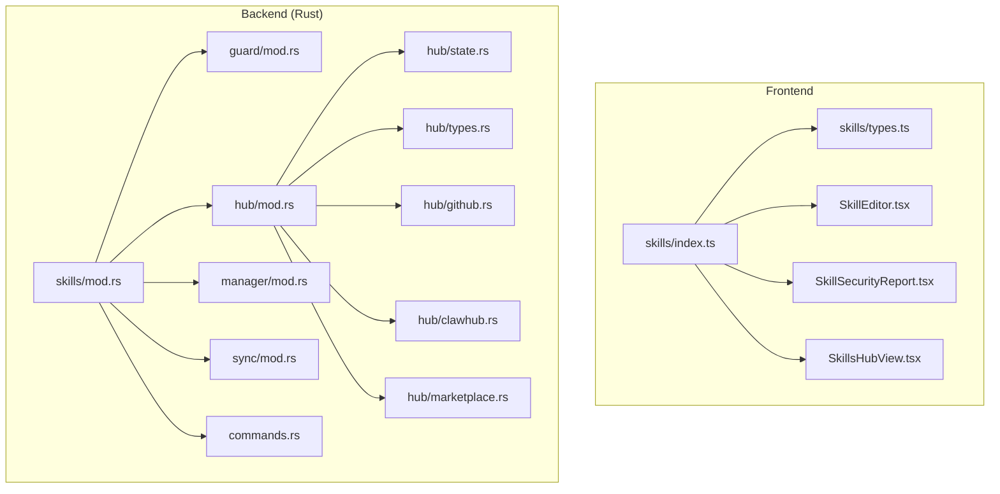
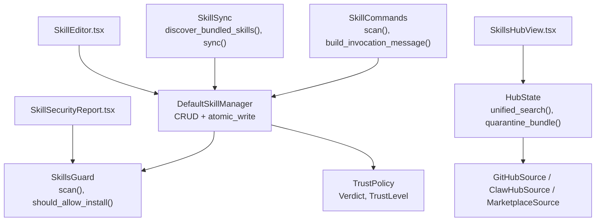
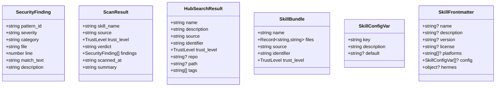
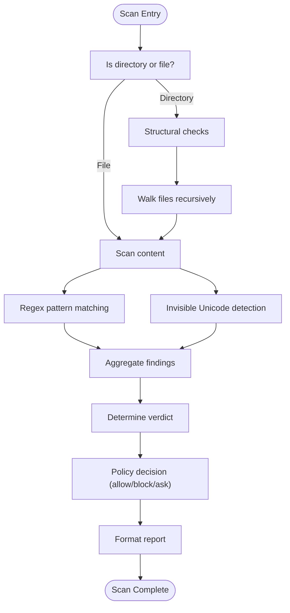
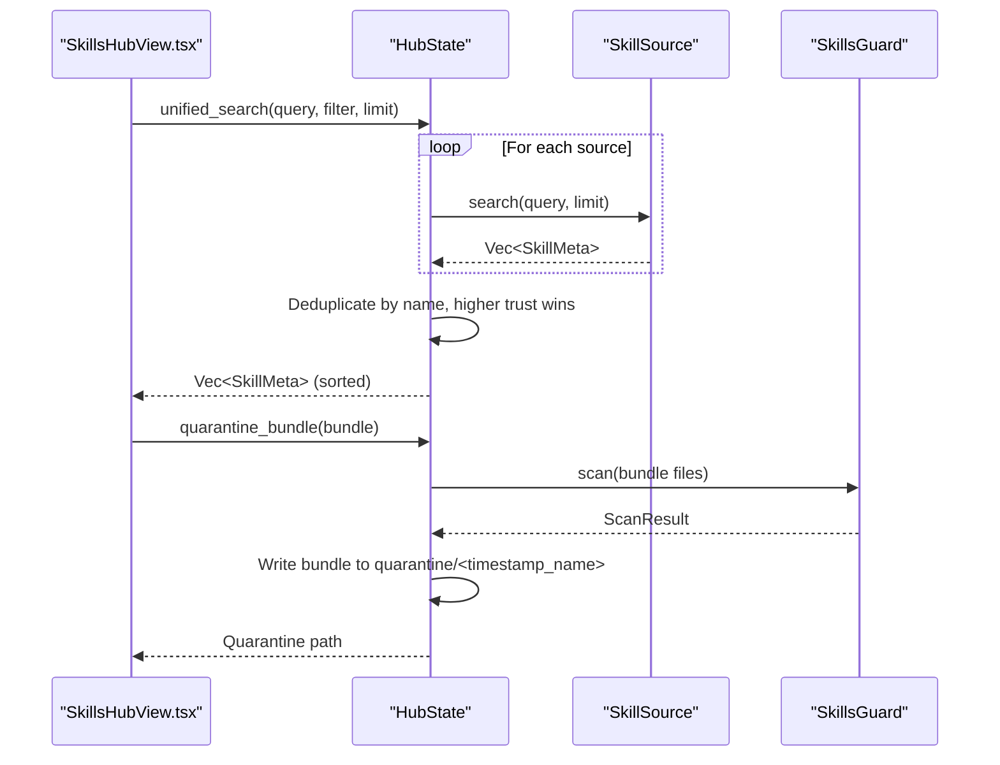
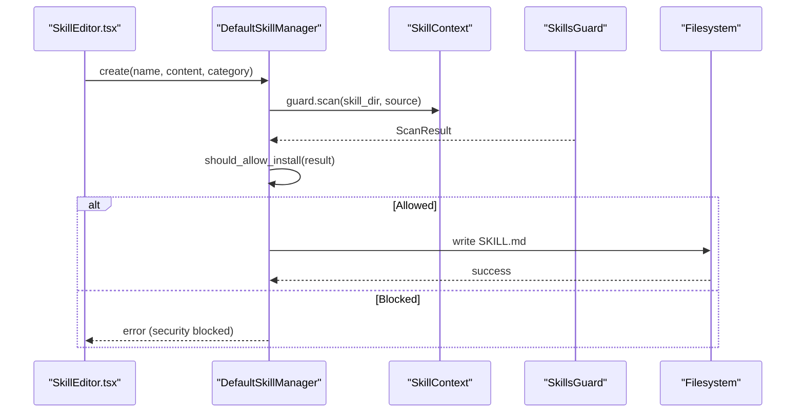
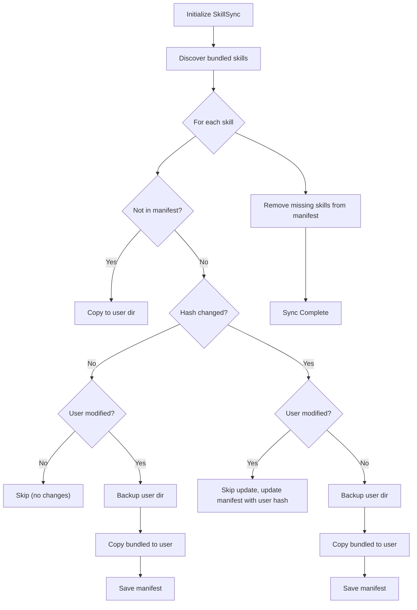
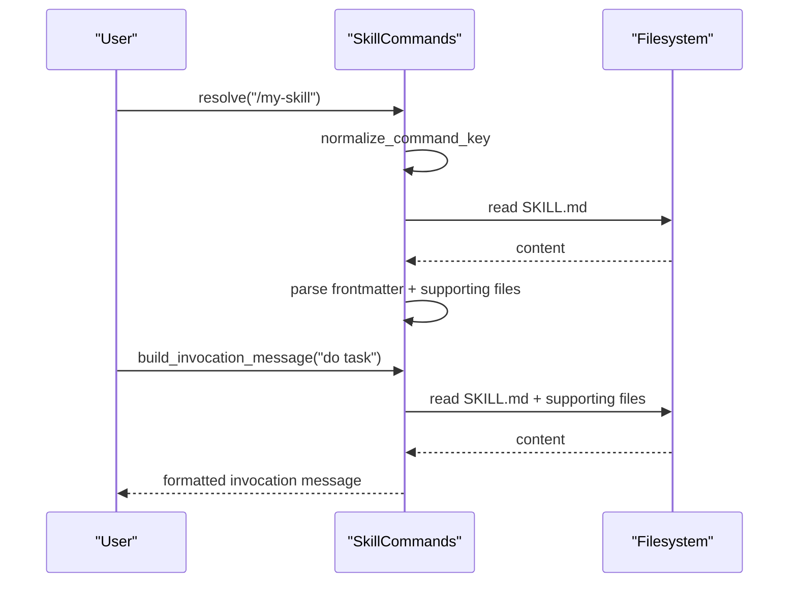
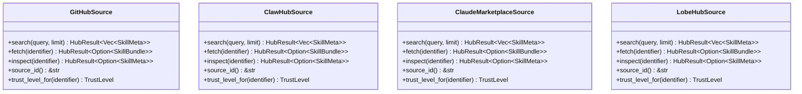
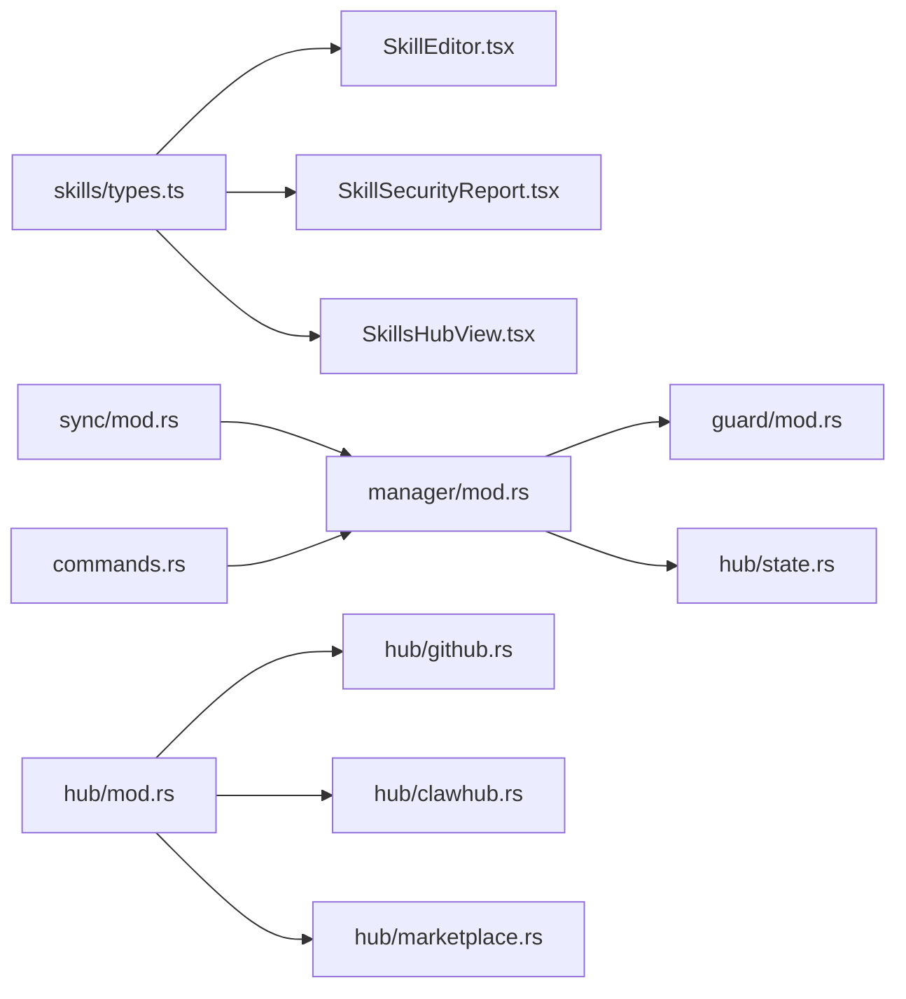

# Skills System Modules

<cite>
**Referenced Files in This Document**
- [src/modules/skills/index.ts](file://src/modules/skills/index.ts)
- [src/modules/skills/types.ts](file://src/modules/skills/types.ts)
- [src/modules/skills/SkillEditor.tsx](file://src/modules/skills/SkillEditor.tsx)
- [src/modules/skills/SkillSecurityReport.tsx](file://src/modules/skills/SkillSecurityReport.tsx)
- [src/modules/skills/SkillsHubView.tsx](file://src/modules/skills/SkillsHubView.tsx)
- [src-tauri/src/modules/skills/mod.rs](file://src-tauri/src/modules/skills/mod.rs)
- [src-tauri/src/modules/skills/guard/mod.rs](file://src-tauri/src/modules/skills/guard/mod.rs)
- [src-tauri/src/modules/skills/hub/mod.rs](file://src-tauri/src/modules/skills/hub/mod.rs)
- [src-tauri/src/modules/skills/hub/state.rs](file://src-tauri/src/modules/skills/hub/state.rs)
- [src-tauri/src/modules/skills/hub/types.rs](file://src-tauri/src/modules/skills/hub/types.rs)
- [src-tauri/src/modules/skills/hub/github.rs](file://src-tauri/src/modules/skills/hub/github.rs)
- [src-tauri/src/modules/skills/hub/clawhub.rs](file://src-tauri/src/modules/skills/hub/clawhub.rs)
- [src-tauri/src/modules/skills/hub/marketplace.rs](file://src-tauri/src/modules/skills/hub/marketplace.rs)
- [src-tauri/src/modules/skills/manager/mod.rs](file://src-tauri/src/modules/skills/manager/mod.rs)
- [src-tauri/src/modules/skills/sync/mod.rs](file://src-tauri/src/modules/skills/sync/mod.rs)
- [src-tauri/src/modules/skills/commands.rs](file://src-tauri/src/modules/skills/commands.rs)
</cite>

## Table of Contents
1. [Introduction](#introduction)
2. [Project Structure](#project-structure)
3. [Core Components](#core-components)
4. [Architecture Overview](#architecture-overview)
5. [Detailed Component Analysis](#detailed-component-analysis)
6. [Dependency Analysis](#dependency-analysis)
7. [Performance Considerations](#performance-considerations)
8. [Troubleshooting Guide](#troubleshooting-guide)
9. [Conclusion](#conclusion)

## Introduction
This document describes the skills system modules that power skill discovery, management, security scanning, synchronization, and remote passthrough within the application. It explains how the frontend UI integrates with the Rust backend to provide a secure, auditable, and extensible skill ecosystem. Topics include:
- Skills hub integration across multiple sources (GitHub, skills.sh, ClawHub, Claude Marketplace, LobeHub, Well-Known, Optional)
- Guard systems and security policies
- Skill management, synchronization, and remote passthrough mechanisms
- State management and well-known skill integration
- Skill validation, atomic write operations, and manifest handling
- Examples of skill registration, security scanning, synchronization workflows, and remote skill management

## Project Structure
The skills system spans both the frontend React module and the Rust backend module:
- Frontend: UI components for editing, security reporting, and hub browsing
- Backend: Guard (security scanner), Hub (multi-source adapters), Manager (CRUD), Sync (manifest-based sync), Commands (slash command integration), and Remote Passthrough

**Diagram sources**
- [src/modules/skills/index.ts:1-9](file://src/modules/skills/index.ts#L1-L9)
- [src-tauri/src/modules/skills/mod.rs:1-22](file://src-tauri/src/modules/skills/mod.rs#L1-L22)

**Section sources**
- [src/modules/skills/index.ts:1-9](file://src/modules/skills/index.ts#L1-L9)
- [src-tauri/src/modules/skills/mod.rs:1-22](file://src-tauri/src/modules/skills/mod.rs#L1-L22)

## Core Components
- Frontend Types and UI:
  - Shared TypeScript interfaces for security findings, scan results, hub search results, bundles, and configuration variables
  - Editor for creating and editing skill frontmatter with validation
  - Security report renderer mirroring backend scan results
  - Hub view for unified search across multiple sources with filtering and installation
- Backend Guard:
  - Static and runtime scanning for threat patterns, structural limits, and invisible Unicode
  - Trust-aware policy decisions for installation
- Hub:
  - Multi-source adapters (GitHub, skills.sh, ClawHub, Claude Marketplace, LobeHub, Well-Known, Optional)
  - State management (lock, quarantine, audit logs, index cache)
  - Unified search with trust-based deduplication
- Manager:
  - CRUD operations for skills with security scanning integrated
  - Atomic write operations and validation
- Sync:
  - Manifest-based synchronization of bundled skills with change tracking and user modification protection
- Commands:
  - Slash command integration for invoking skills with platform and toolset gating
- Remote Passthrough:
  - Environment variable passthrough to remote backend environments

**Section sources**
- [src/modules/skills/types.ts:1-157](file://src/modules/skills/types.ts#L1-L157)
- [src/modules/skills/SkillEditor.tsx:1-360](file://src/modules/skills/SkillEditor.tsx#L1-L360)
- [src/modules/skills/SkillSecurityReport.tsx:1-188](file://src/modules/skills/SkillSecurityReport.tsx#L1-L188)
- [src/modules/skills/SkillsHubView.tsx:1-425](file://src/modules/skills/SkillsHubView.tsx#L1-L425)
- [src-tauri/src/modules/skills/guard/mod.rs:1-800](file://src-tauri/src/modules/skills/guard/mod.rs#L1-L800)
- [src-tauri/src/modules/skills/hub/mod.rs:1-101](file://src-tauri/src/modules/skills/hub/mod.rs#L1-L101)
- [src-tauri/src/modules/skills/hub/state.rs:1-617](file://src-tauri/src/modules/skills/hub/state.rs#L1-L617)
- [src-tauri/src/modules/skills/hub/types.rs:1-118](file://src-tauri/src/modules/skills/hub/types.rs#L1-L118)
- [src-tauri/src/modules/skills/manager/mod.rs:1-417](file://src-tauri/src/modules/skills/manager/mod.rs#L1-L417)
- [src-tauri/src/modules/skills/sync/mod.rs:1-394](file://src-tauri/src/modules/skills/sync/mod.rs#L1-L394)
- [src-tauri/src/modules/skills/commands.rs:1-788](file://src-tauri/src/modules/skills/commands.rs#L1-L788)

## Architecture Overview
The skills system architecture integrates frontend UI with backend services:
- Frontend components render hub search results, security reports, and skill editors
- Backend services provide security scanning, hub adapters, state management, synchronization, and command invocation
- Communication occurs via Tauri commands and filesystem operations

**Diagram sources**
- [src/modules/skills/SkillEditor.tsx:1-360](file://src/modules/skills/SkillEditor.tsx#L1-L360)
- [src/modules/skills/SkillSecurityReport.tsx:1-188](file://src/modules/skills/SkillSecurityReport.tsx#L1-L188)
- [src/modules/skills/SkillsHubView.tsx:1-425](file://src/modules/skills/SkillsHubView.tsx#L1-L425)
- [src-tauri/src/modules/skills/guard/mod.rs:1-800](file://src-tauri/src/modules/skills/guard/mod.rs#L1-L800)
- [src-tauri/src/modules/skills/hub/state.rs:1-617](file://src-tauri/src/modules/skills/hub/state.rs#L1-L617)
- [src-tauri/src/modules/skills/manager/mod.rs:1-417](file://src-tauri/src/modules/skills/manager/mod.rs#L1-L417)
- [src-tauri/src/modules/skills/sync/mod.rs:1-394](file://src-tauri/src/modules/skills/sync/mod.rs#L1-L394)
- [src-tauri/src/modules/skills/commands.rs:1-788](file://src-tauri/src/modules/skills/commands.rs#L1-L788)

## Detailed Component Analysis

### Frontend: Types, Editor, Security Report, Hub View
- Types:
  - SecurityFinding and ScanResult mirror backend structures for consistent UI rendering
  - HubSearchResult and SkillBundle define hub metadata and downloadable bundles
  - SkillConfigVar and SkillFrontmatter define editable skill metadata
  - Severity and TrustLevel enums plus display helpers
- SkillEditor:
  - Real-time validation for name, description, platforms, and configuration variables
  - Generates standardized frontmatter preview and triggers onSave with validated data
- SkillSecurityReport:
  - Renders scan results with severity badges, category labels, and compact/expanded modes
- SkillsHubView:
  - Unified search across sources with source filters and trust labels
  - Displays results grouped by source, supports installation and detail modal

**Diagram sources**
- [src/modules/skills/types.ts:1-157](file://src/modules/skills/types.ts#L1-L157)

**Section sources**
- [src/modules/skills/types.ts:1-157](file://src/modules/skills/types.ts#L1-L157)
- [src/modules/skills/SkillEditor.tsx:1-360](file://src/modules/skills/SkillEditor.tsx#L1-L360)
- [src/modules/skills/SkillSecurityReport.tsx:1-188](file://src/modules/skills/SkillSecurityReport.tsx#L1-L188)
- [src/modules/skills/SkillsHubView.tsx:1-425](file://src/modules/skills/SkillsHubView.tsx#L1-L425)

### Backend: Guard and Security Policies
- SkillsGuard:
  - Scans directories and files for threat patterns, structural anomalies, and invisible Unicode
  - Computes overall verdict (Safe/Caution/Dangerous) and builds human-readable summaries
  - Supports runtime command scanning for safety during execution
  - Exposes should_allow_install with trust-aware policy decisions
- Trust and Policy:
  - Trust levels: builtin, trusted, community, agent-created
  - Install policy evaluates findings count, severity, and trust level to decide allow/block/ask

**Diagram sources**
- [src-tauri/src/modules/skills/guard/mod.rs:115-520](file://src-tauri/src/modules/skills/guard/mod.rs#L115-L520)

**Section sources**
- [src-tauri/src/modules/skills/guard/mod.rs:1-800](file://src-tauri/src/modules/skills/guard/mod.rs#L1-L800)

### Backend: Hub Integration and State Management
- Hub Module:
  - Creates a router of skill sources (GitHub, skills.sh, ClawHub, Claude Marketplace, LobeHub, Well-Known, Optional)
  - Provides unified search with trust-based deduplication and sorting
- Hub State:
  - Manages HubPaths (.if2ai/skills/.hub), lock.json, audit.log, index-cache
  - Quarantines suspicious bundles and installs from quarantine
  - Records audit events for install/uninstall/update/quarantine/blocked/failed
- Hub Types:
  - SkillMeta and SkillBundle define hub metadata and downloadable content
  - HubError and HubResult unify error handling across sources

**Diagram sources**
- [src-tauri/src/modules/skills/hub/state.rs:434-486](file://src-tauri/src/modules/skills/hub/state.rs#L434-L486)
- [src-tauri/src/modules/skills/hub/mod.rs:34-47](file://src-tauri/src/modules/skills/hub/mod.rs#L34-L47)
- [src-tauri/src/modules/skills/guard/mod.rs:130-183](file://src-tauri/src/modules/skills/guard/mod.rs#L130-L183)

**Section sources**
- [src-tauri/src/modules/skills/hub/mod.rs:1-101](file://src-tauri/src/modules/skills/hub/mod.rs#L1-L101)
- [src-tauri/src/modules/skills/hub/state.rs:1-617](file://src-tauri/src/modules/skills/hub/state.rs#L1-L617)
- [src-tauri/src/modules/skills/hub/types.rs:1-118](file://src-tauri/src/modules/skills/hub/types.rs#L1-L118)

### Backend: Manager, Atomic Writes, and Validation
- DefaultSkillManager:
  - Implements CRUD operations (create, edit, patch, delete, write_file, remove_file)
  - Integrates SkillsGuard for security scanning before mutations
  - Executes actions with SkillContext (skills_dir + guard)
- Atomic Write:
  - atomic_write and atomic_write_str provide atomic file writes with configurable options
- Validator:
  - AllowedSubdirs and SkillValidator enforce safe subdirectories and content constraints

**Diagram sources**
- [src-tauri/src/modules/skills/manager/mod.rs:135-286](file://src-tauri/src/modules/skills/manager/mod.rs#L135-L286)
- [src-tauri/src/modules/skills/guard/mod.rs:341-356](file://src-tauri/src/modules/skills/guard/mod.rs#L341-L356)

**Section sources**
- [src-tauri/src/modules/skills/manager/mod.rs:1-417](file://src-tauri/src/modules/skills/manager/mod.rs#L1-L417)

### Backend: Synchronization and Manifest Handling
- SkillSync:
  - Discovers bundled skills by locating SKILL.md
  - Computes directory hashes (MD5) and performs full sync
  - Protects user modifications by comparing user vs manifest hashes
  - Backs up user directories before updates and cleans removed entries
- Manifest:
  - Tracks bundled skill hashes and updates on sync
  - Persists to .manifest file

**Diagram sources**
- [src-tauri/src/modules/skills/sync/mod.rs:132-272](file://src-tauri/src/modules/skills/sync/mod.rs#L132-L272)

**Section sources**
- [src-tauri/src/modules/skills/sync/mod.rs:1-394](file://src-tauri/src/modules/skills/sync/mod.rs#L1-L394)

### Backend: Commands and Remote Passthrough
- SkillCommands:
  - Scans skills directory for SKILL.md and parses frontmatter
  - Normalizes command keys and resolves invocations
  - Builds invocation messages with activation notes, setup notes, and supporting files
  - Supports platform compatibility and toolset gating
- Remote Passthrough:
  - Environment variable passthrough to remote backend environments

**Diagram sources**
- [src-tauri/src/modules/skills/commands.rs:228-402](file://src-tauri/src/modules/skills/commands.rs#L228-L402)

**Section sources**
- [src-tauri/src/modules/skills/commands.rs:1-788](file://src-tauri/src/modules/skills/commands.rs#L1-L788)

### Hub Sources: GitHub, ClawHub, Marketplace
- GitHubSource:
  - Searches repositories for skills, inspects metadata, and fetches SKILL.md content
  - Trust level determined by TAPs (trusted agent packages)
- ClawHubSource and MarketplaceSource:
  - Placeholder implementations with stubbed search/fetch/inspect
  - Trust levels set to Community by default
- Well-Known and Optional:
  - Integrated into the hub router for built-in and optional skills

**Diagram sources**
- [src-tauri/src/modules/skills/hub/github.rs:104-353](file://src-tauri/src/modules/skills/hub/github.rs#L104-L353)
- [src-tauri/src/modules/skills/hub/clawhub.rs:12-61](file://src-tauri/src/modules/skills/hub/clawhub.rs#L12-L61)
- [src-tauri/src/modules/skills/hub/marketplace.rs:12-91](file://src-tauri/src/modules/skills/hub/marketplace.rs#L12-L91)

**Section sources**
- [src-tauri/src/modules/skills/hub/github.rs:1-412](file://src-tauri/src/modules/skills/hub/github.rs#L1-L412)
- [src-tauri/src/modules/skills/hub/clawhub.rs:1-82](file://src-tauri/src/modules/skills/hub/clawhub.rs#L1-L82)
- [src-tauri/src/modules/skills/hub/marketplace.rs:1-123](file://src-tauri/src/modules/skills/hub/marketplace.rs#L1-L123)

## Dependency Analysis
- Frontend-to-Backend:
  - UI components depend on shared TypeScript types
  - Backend modules expose capabilities via Tauri commands and filesystem operations
- Internal Coupling:
  - Manager depends on Guard for security scanning
  - HubState orchestrates sources and state files
  - Sync relies on Manager and manifest persistence
  - Commands rely on filesystem parsing of SKILL.md
- External Dependencies:
  - GitHub API for repository search and content retrieval
  - reqwest for HTTP requests in hub adapters
  - serde/json for serialization/deserialization

**Diagram sources**
- [src/modules/skills/types.ts:1-157](file://src/modules/skills/types.ts#L1-L157)
- [src-tauri/src/modules/skills/manager/mod.rs:1-417](file://src-tauri/src/modules/skills/manager/mod.rs#L1-L417)
- [src-tauri/src/modules/skills/guard/mod.rs:1-800](file://src-tauri/src/modules/skills/guard/mod.rs#L1-L800)
- [src-tauri/src/modules/skills/hub/mod.rs:1-101](file://src-tauri/src/modules/skills/hub/mod.rs#L1-L101)
- [src-tauri/src/modules/skills/sync/mod.rs:1-394](file://src-tauri/src/modules/skills/sync/mod.rs#L1-L394)
- [src-tauri/src/modules/skills/commands.rs:1-788](file://src-tauri/src/modules/skills/commands.rs#L1-L788)

**Section sources**
- [src-tauri/src/modules/skills/mod.rs:1-22](file://src-tauri/src/modules/skills/mod.rs#L1-L22)

## Performance Considerations
- Scanning:
  - Directory traversal and regex scanning scale with file count and size; consider limiting scan depth and excluding binary files
- Synchronization:
  - Hash computation and recursive copy can be expensive; batch operations and avoid unnecessary backups
- Hub Search:
  - Rate-limiting and caching index results improve responsiveness
- UI Rendering:
  - Debounce search input and virtualize long lists in SkillsHubView

## Troubleshooting Guide
- Security Scanning:
  - Review ScanResult verdict and findings; adjust skill content to avoid pattern matches
  - Use compact security report to quickly identify issues
- Installation Blocking:
  - Check trust level and policy decision; use force flag cautiously for community skills
  - Review audit logs for blocked or quarantined events
- Synchronization Issues:
  - Verify manifest integrity; user modifications are intentionally preserved
  - Re-run sync after resolving conflicts
- Command Resolution:
  - Ensure skill names conform to normalization rules; verify SKILL.md frontmatter presence

**Section sources**
- [src/modules/skills/SkillSecurityReport.tsx:1-188](file://src/modules/skills/SkillSecurityReport.tsx#L1-L188)
- [src-tauri/src/modules/skills/guard/mod.rs:341-356](file://src-tauri/src/modules/skills/guard/mod.rs#L341-L356)
- [src-tauri/src/modules/skills/hub/state.rs:488-498](file://src-tauri/src/modules/skills/hub/state.rs#L488-L498)
- [src-tauri/src/modules/skills/sync/mod.rs:132-272](file://src-tauri/src/modules/skills/sync/mod.rs#L132-L272)
- [src-tauri/src/modules/skills/commands.rs:331-402](file://src-tauri/src/modules/skills/commands.rs#L331-L402)

## Conclusion
The skills system provides a robust, secure, and extensible framework for discovering, managing, and executing skills. The frontend offers intuitive UI for editing, scanning, and browsing, while the backend enforces strict security policies, maintains state, and ensures reliable synchronization. Integration with multiple hub sources and slash commands completes a comprehensive skill lifecycle from discovery to execution.