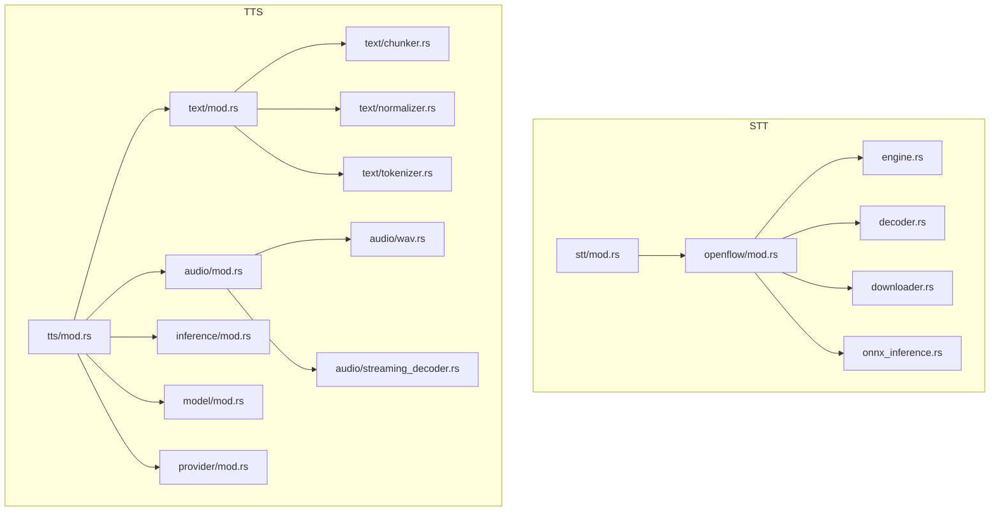
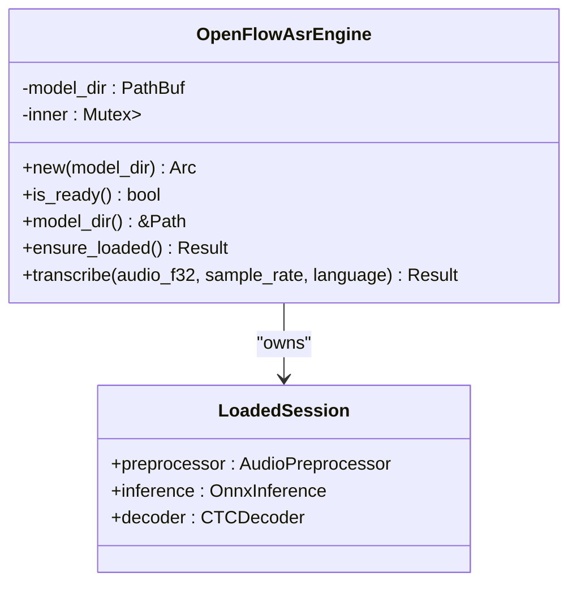
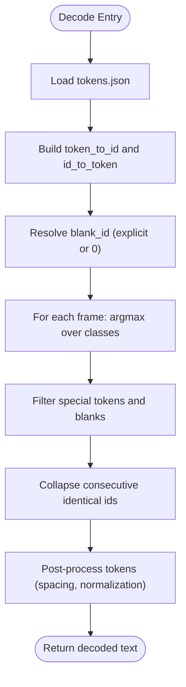
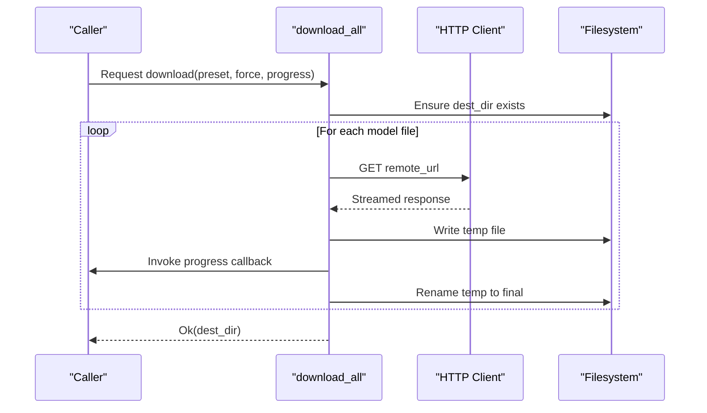
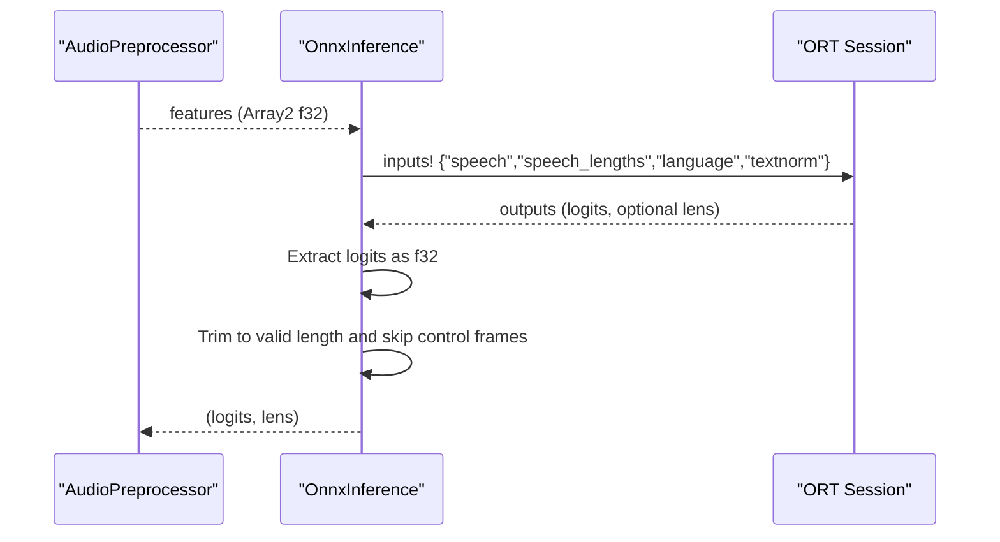
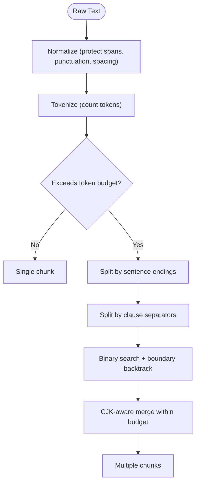
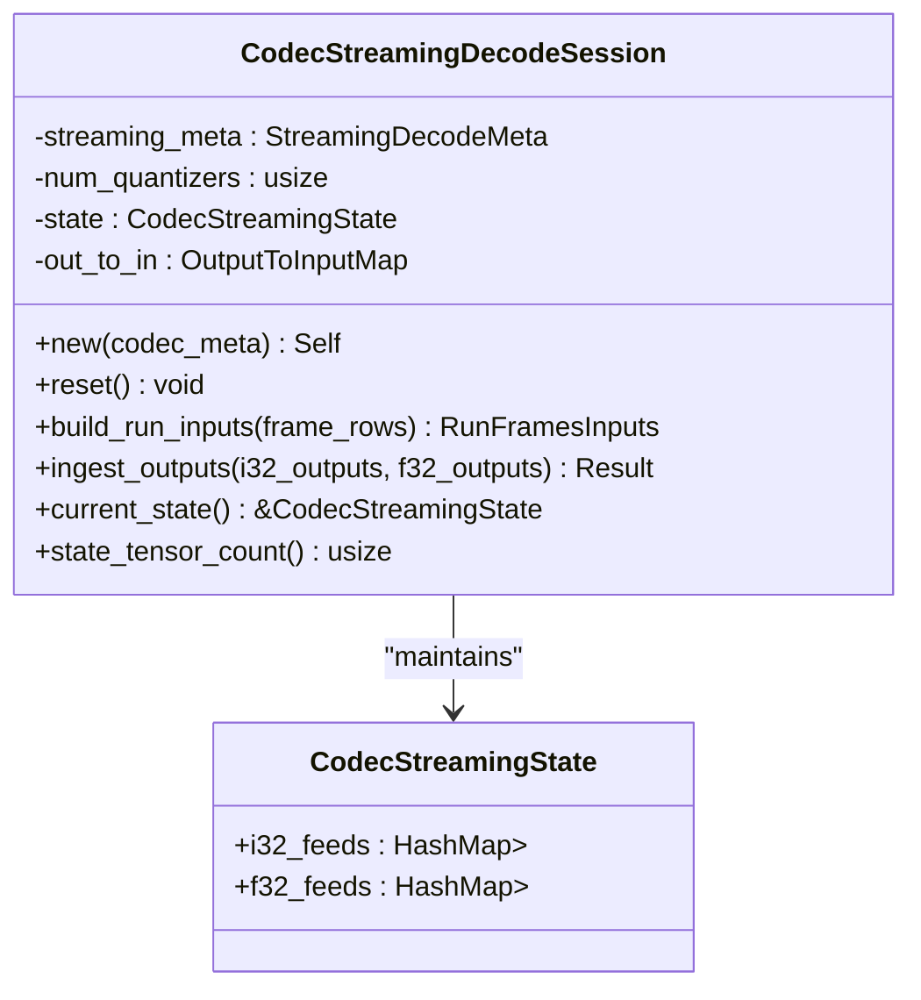
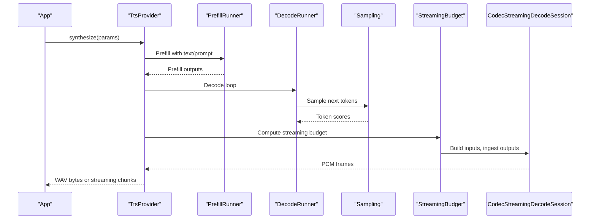
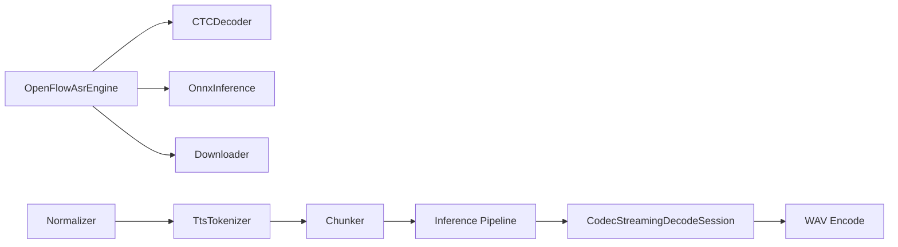

# Speech Processing Modules

<cite>
**Referenced Files in This Document**
- [stt/mod.rs](file://src-tauri/src/modules/stt/mod.rs)
- [stt/openflow/mod.rs](file://src-tauri/src/modules/stt/openflow/mod.rs)
- [stt/openflow/engine.rs](file://src-tauri/src/modules/stt/openflow/engine.rs)
- [stt/openflow/decoder.rs](file://src-tauri/src/modules/stt/openflow/decoder.rs)
- [stt/openflow/downloader.rs](file://src-tauri/src/modules/stt/openflow/downloader.rs)
- [stt/openflow/onnx_inference.rs](file://src-tauri/src/modules/stt/openflow/onnx_inference.rs)
- [tts/mod.rs](file://src-tauri/src/modules/tts/mod.rs)
- [tts/text/mod.rs](file://src-tauri/src/modules/tts/text/mod.rs)
- [tts/text/chunker.rs](file://src-tauri/src/modules/tts/text/chunker.rs)
- [tts/text/normalizer.rs](file://src-tauri/src/modules/tts/text/normalizer.rs)
- [tts/text/tokenizer.rs](file://src-tauri/src/modules/tts/text/tokenizer.rs)
- [tts/audio/mod.rs](file://src-tauri/src/modules/tts/audio/mod.rs)
- [tts/audio/wav.rs](file://src-tauri/src/modules/tts/audio/wav.rs)
- [tts/audio/streaming_decoder.rs](file://src-tauri/src/modules/tts/audio/streaming_decoder.rs)
- [tts/model/mod.rs](file://src-tauri/src/modules/tts/model/mod.rs)
- [tts/provider/mod.rs](file://src-tauri/src/modules/tts/provider/mod.rs)
- [tts/inference/mod.rs](file://src-tauri/src/modules/tts/inference/mod.rs)
</cite>

## Table of Contents
1. [Introduction](#introduction)
2. [Project Structure](#project-structure)
3. [Core Components](#core-components)
4. [Architecture Overview](#architecture-overview)
5. [Detailed Component Analysis](#detailed-component-analysis)
6. [Dependency Analysis](#dependency-analysis)
7. [Performance Considerations](#performance-considerations)
8. [Troubleshooting Guide](#troubleshooting-guide)
9. [Conclusion](#conclusion)
10. [Appendices](#appendices)

## Introduction
This document explains the speech processing modules for Speech-to-Text (STT) and Text-to-Speech (TTS) in the codebase. It covers the STT OpenFlow integration (SenseVoice ONNX), decoder, downloader, and ONNX inference components. For TTS, it documents audio processing, streaming decoder, voice management, and model handling, along with text chunking, normalization, tokenization, and the inference pipeline. It also includes performance optimization, streaming budget management, voice profile systems, and practical examples for initialization, audio streaming, voice selection, and error handling patterns.

## Project Structure
The speech processing modules are organized by domain:
- STT: located under src-tauri/src/modules/stt, with OpenFlow ASR as the sole backend.
- TTS: located under src-tauri/src/modules/tts, with modular components for text processing, audio utilities, model management, provider implementations, and inference pipeline.

**Diagram sources**
- [stt/mod.rs:1-40](file://src-tauri/src/modules/stt/mod.rs#L1-L40)
- [stt/openflow/mod.rs:1-24](file://src-tauri/src/modules/stt/openflow/mod.rs#L1-L24)
- [tts/mod.rs:1-209](file://src-tauri/src/modules/tts/mod.rs#L1-L209)
- [tts/text/mod.rs:1-8](file://src-tauri/src/modules/tts/text/mod.rs#L1-L8)
- [tts/audio/mod.rs:1-12](file://src-tauri/src/modules/tts/audio/mod.rs#L1-L12)

**Section sources**
- [stt/mod.rs:1-40](file://src-tauri/src/modules/stt/mod.rs#L1-L40)
- [tts/mod.rs:1-209](file://src-tauri/src/modules/tts/mod.rs#L1-L209)

## Core Components
- STT OpenFlow ASR Engine: Loads SenseVoice ONNX models lazily, preprocesses audio, runs ONNX inference, and decodes logits to text.
- STT Decoder: CTC greedy decoding with special token filtering and optional best-non-blank mode.
- STT Downloader: Downloads SenseVoice model files from HuggingFace with fallback to mirror and progress callbacks.
- STT ONNX Inference: Builds ONNX Runtime sessions, constructs inputs, runs inference, and extracts logits.
- TTS Text Pipeline: Normalization, tokenization, and chunking for voice clone mode with token budget.
- TTS Audio Utilities: WAV encode/decode helpers and streaming decoder state machine.
- TTS Inference Pipeline: Prefill, decode, sampling, streaming, and budget management.
- TTS Model Management: Ensures models are cached and exposes model directories for ONNX sessions.
- TTS Providers: Trait abstractions for synthesis (buffered, streaming, warmup, voice clone, continuation).

**Section sources**
- [stt/openflow/engine.rs:1-203](file://src-tauri/src/modules/stt/openflow/engine.rs#L1-L203)
- [stt/openflow/decoder.rs:1-354](file://src-tauri/src/modules/stt/openflow/decoder.rs#L1-L354)
- [stt/openflow/downloader.rs:1-205](file://src-tauri/src/modules/stt/openflow/downloader.rs#L1-L205)
- [stt/openflow/onnx_inference.rs:1-126](file://src-tauri/src/modules/stt/openflow/onnx_inference.rs#L1-L126)
- [tts/text/normalizer.rs:1-583](file://src-tauri/src/modules/tts/text/normalizer.rs#L1-L583)
- [tts/text/tokenizer.rs:1-199](file://src-tauri/src/modules/tts/text/tokenizer.rs#L1-L199)
- [tts/text/chunker.rs:1-462](file://src-tauri/src/modules/tts/text/chunker.rs#L1-L462)
- [tts/audio/wav.rs:1-160](file://src-tauri/src/modules/tts/audio/wav.rs#L1-L160)
- [tts/audio/streaming_decoder.rs:1-333](file://src-tauri/src/modules/tts/audio/streaming_decoder.rs#L1-L333)
- [tts/inference/mod.rs:1-32](file://src-tauri/src/modules/tts/inference/mod.rs#L1-L32)
- [tts/model/mod.rs:1-19](file://src-tauri/src/modules/tts/model/mod.rs#L1-L19)
- [tts/provider/mod.rs:1-14](file://src-tauri/src/modules/tts/provider/mod.rs#L1-L14)

## Architecture Overview
High-level architecture for STT and TTS:

```mermaid
graph TB
subgraph "STT (OpenFlow)"
PCMA["Frontend PCM16LE"]
CMD["Tauri Command: stt_transcribe"]
ENG["OpenFlowAsrEngine"]
PRE["AudioPreprocessor"]
INF["OnnxInference"]
DEC["CTCDecoder"]
PCMA --> CMD --> ENG --> PRE --> INF --> DEC
end
subgraph "TTS"
TXTN["Normalize + Tokenize"]
CHUNK["Chunker (voice clone)"]
PREF["Prefill"]
DECODE["Decode Runner"]
SAMPL["Sampling"]
STR["Streaming Budget"]
STRDEC["CodecStreamingDecodeSession"]
WAVENC["WAV Encode"]
TXTN --> CHUNK --> PREF --> DECODE --> SAMPL --> STR --> STRDEC --> WAVENC
end
```

**Diagram sources**
- [stt/openflow/engine.rs:127-175](file://src-tauri/src/modules/stt/openflow/engine.rs#L127-L175)
- [stt/openflow/onnx_inference.rs:55-124](file://src-tauri/src/modules/stt/openflow/onnx_inference.rs#L55-L124)
- [stt/openflow/decoder.rs:88-201](file://src-tauri/src/modules/stt/openflow/decoder.rs#L88-L201)
- [tts/text/normalizer.rs:56-71](file://src-tauri/src/modules/tts/text/normalizer.rs#L56-L71)
- [tts/text/tokenizer.rs:100-136](file://src-tauri/src/modules/tts/text/tokenizer.rs#L100-L136)
- [tts/text/chunker.rs:76-170](file://src-tauri/src/modules/tts/text/chunker.rs#L76-L170)
- [tts/audio/streaming_decoder.rs:53-197](file://src-tauri/src/modules/tts/audio/streaming_decoder.rs#L53-L197)
- [tts/audio/wav.rs:22-47](file://src-tauri/src/modules/tts/audio/wav.rs#L22-L47)

## Detailed Component Analysis

### STT OpenFlow ASR Engine
- Purpose: Provide a thread-safe, lazily loaded ONNX session for SenseVoice (SenseVoice-Small ONNX) transcription.
- Key responsibilities:
  - Model readiness checks and lazy initialization.
  - Audio preprocessing to target sample rate and normalization.
  - ONNX inference with language and text normalization IDs.
  - Greedy CTC decoding to produce text and detected language.
- Concurrency: Uses a mutex-guarded session; blocking calls inside a spawn_blocking to avoid blocking the async runtime.

**Diagram sources**
- [stt/openflow/engine.rs:45-175](file://src-tauri/src/modules/stt/openflow/engine.rs#L45-L175)

**Section sources**
- [stt/openflow/engine.rs:1-203](file://src-tauri/src/modules/stt/openflow/engine.rs#L1-L203)

### STT Decoder (CTC Greedy)
- Purpose: Convert logits from ONNX inference into readable text.
- Features:
  - Token table loading from tokens.json (mapping or array).
  - Special token filtering (<unk>, <s>, </s>, <blank>, etc.).
  - Optional best-non-blank decoding controlled by environment variable.
  - Post-processing to clean up spacing and special tokens.

**Diagram sources**
- [stt/openflow/decoder.rs:28-201](file://src-tauri/src/modules/stt/openflow/decoder.rs#L28-L201)

**Section sources**
- [stt/openflow/decoder.rs:1-354](file://src-tauri/src/modules/stt/openflow/decoder.rs#L1-L354)

### STT Downloader
- Purpose: Download SenseVoice model files (quantized or FP16) with fallback to mirror and progress reporting.
- Behavior:
  - Creates destination directory if missing.
  - Iterates over model files and downloads from primary or mirror URLs.
  - Emits progress callbacks per file.
  - Cleans up temporary files on failure.

**Diagram sources**
- [stt/openflow/downloader.rs:89-124](file://src-tauri/src/modules/stt/openflow/downloader.rs#L89-L124)
- [stt/openflow/downloader.rs:162-204](file://src-tauri/src/modules/stt/openflow/downloader.rs#L162-L204)

**Section sources**
- [stt/openflow/downloader.rs:1-205](file://src-tauri/src/modules/stt/openflow/downloader.rs#L1-L205)

### STT ONNX Inference
- Purpose: Manage ONNX Runtime session and run inference with standardized inputs.
- Inputs: speech (batched features), speech_lengths, language, textnorm.
- Outputs: logits (CTC), encoder_out_lens (optional), with post-processing to skip initial control frames.

**Diagram sources**
- [stt/openflow/onnx_inference.rs:55-124](file://src-tauri/src/modules/stt/openflow/onnx_inference.rs#L55-L124)

**Section sources**
- [stt/openflow/onnx_inference.rs:1-126](file://src-tauri/src/modules/stt/openflow/onnx_inference.rs#L1-L126)

### TTS Text Processing
- Normalization: Robust cleaning preserving protected spans (URLs, emails, mentions, filenames), markdown handling, punctuation normalization, and spacing rules.
- Tokenization: Pure Rust tokenizers using HuggingFace tokenizers JSON for bit-exactness with Python reference.
- Chunking: Three-stage splitting for voice clone mode with token budget, punctuation-aware merging, and CJK-aware joining.

**Diagram sources**
- [tts/text/normalizer.rs:56-71](file://src-tauri/src/modules/tts/text/normalizer.rs#L56-L71)
- [tts/text/tokenizer.rs:100-136](file://src-tauri/src/modules/tts/text/tokenizer.rs#L100-L136)
- [tts/text/chunker.rs:76-170](file://src-tauri/src/modules/tts/text/chunker.rs#L76-L170)

**Section sources**
- [tts/text/normalizer.rs:1-583](file://src-tauri/src/modules/tts/text/normalizer.rs#L1-L583)
- [tts/text/tokenizer.rs:1-199](file://src-tauri/src/modules/tts/text/tokenizer.rs#L1-L199)
- [tts/text/chunker.rs:1-462](file://src-tauri/src/modules/tts/text/chunker.rs#L1-L462)

### TTS Audio Utilities and Streaming Decoder
- WAV Utilities: Encode f32 PCM to 16-bit WAV bytes and decode WAV back to f32 samples with proper clamping and channel handling.
- Streaming Decoder: Stateful session for codec streaming decode with transformer offsets and attention caches. Builds inputs and ingests outputs for stateful ONNX runs.

**Diagram sources**
- [tts/audio/streaming_decoder.rs:53-197](file://src-tauri/src/modules/tts/audio/streaming_decoder.rs#L53-L197)

**Section sources**
- [tts/audio/wav.rs:1-160](file://src-tauri/src/modules/tts/audio/wav.rs#L1-L160)
- [tts/audio/streaming_decoder.rs:1-333](file://src-tauri/src/modules/tts/audio/streaming_decoder.rs#L1-L333)

### TTS Inference Pipeline and Model Management
- Inference modules coordinate prefill, decode, sampling, and streaming with budget management.
- Model management ensures required models are cached and exposes model directories for ONNX sessions.
- Providers define the synthesis interface (buffered, streaming, warmup, voice clone, continuation).

**Diagram sources**
- [tts/mod.rs:83-124](file://src-tauri/src/modules/tts/mod.rs#L83-L124)
- [tts/inference/mod.rs:13-31](file://src-tauri/src/modules/tts/inference/mod.rs#L13-L31)
- [tts/model/mod.rs:12-19](file://src-tauri/src/modules/tts/model/mod.rs#L12-L19)

**Section sources**
- [tts/mod.rs:1-209](file://src-tauri/src/modules/tts/mod.rs#L1-L209)
- [tts/inference/mod.rs:1-32](file://src-tauri/src/modules/tts/inference/mod.rs#L1-L32)
- [tts/model/mod.rs:1-19](file://src-tauri/src/modules/tts/model/mod.rs#L1-L19)
- [tts/provider/mod.rs:1-14](file://src-tauri/src/modules/tts/provider/mod.rs#L1-L14)

## Dependency Analysis
- STT OpenFlow depends on:
  - Audio preprocessing (FBank/LFR/CMVN aligned with FunASR).
  - ONNX Runtime for inference.
  - CTC decoder for text output.
  - Downloader for model acquisition.
- TTS text pipeline depends on:
  - Normalizer and Tokenizer for robust text handling.
  - Chunker for voice clone token budgeting.
- TTS audio pipeline depends on:
  - Streaming decoder state machine for codec streaming.
  - WAV utilities for PCM/WAV conversion.
- TTS inference pipeline depends on:
  - Prefill, decode, sampling, and streaming modules.
  - Model management for caching and session creation.

**Diagram sources**
- [stt/openflow/engine.rs:14-16](file://src-tauri/src/modules/stt/openflow/engine.rs#L14-L16)
- [tts/text/tokenizer.rs:48-52](file://src-tauri/src/modules/tts/text/tokenizer.rs#L48-L52)
- [tts/audio/streaming_decoder.rs:53-63](file://src-tauri/src/modules/tts/audio/streaming_decoder.rs#L53-L63)
- [tts/audio/wav.rs:22-47](file://src-tauri/src/modules/tts/audio/wav.rs#L22-L47)

**Section sources**
- [stt/openflow/engine.rs:1-203](file://src-tauri/src/modules/stt/openflow/engine.rs#L1-L203)
- [tts/text/tokenizer.rs:1-199](file://src-tauri/src/modules/tts/text/tokenizer.rs#L1-L199)
- [tts/audio/streaming_decoder.rs:1-333](file://src-tauri/src/modules/tts/audio/streaming_decoder.rs#L1-L333)
- [tts/audio/wav.rs:1-160](file://src-tauri/src/modules/tts/audio/wav.rs#L1-L160)

## Performance Considerations
- STT:
  - Lazy session loading avoids cold-start overhead until first transcription.
  - Blocking inference inside spawn_blocking prevents async runtime contention.
  - CMVN loading is optional; missing CMVN logs a warning but still allows recognition.
- TTS:
  - Tokenizer is pure Rust with no external process, reducing startup overhead.
  - Streaming decoder maintains state tensors to minimize recomputation across frames.
  - Streaming budget computation balances latency and throughput for real-time playback.
- General:
  - Model caching reduces repeated downloads and accelerates warmup.
  - Environment variable controls optional best-non-blank decoding for robustness.

[No sources needed since this section provides general guidance]

## Troubleshooting Guide
- STT:
  - Model not ready: ensure model.onnx and tokens.json exist in the model directory; use downloader to fetch models.
  - ONNX load failures: verify model path and graph compatibility; check log level for details.
  - Decoder errors: confirm tokens.json format and blank token presence.
- TTS:
  - Tokenizer load failures: ensure tokenizer.json exists; fallback logic expects tokenizer.json alongside tokenizer.model.
  - Streaming state errors: verify output names in codec metadata match ONNX outputs; missing outputs cause codec errors.
  - WAV decode failures: invalid WAV bytes or unsupported format will surface as errors.
- Error types:
  - TtsError variants cover model not found, tokenization errors, codec errors, and WAV decode errors.

**Section sources**
- [stt/openflow/engine.rs:27-34](file://src-tauri/src/modules/stt/openflow/engine.rs#L27-L34)
- [stt/openflow/downloader.rs:95-124](file://src-tauri/src/modules/stt/openflow/downloader.rs#L95-L124)
- [tts/text/tokenizer.rs:76-93](file://src-tauri/src/modules/tts/text/tokenizer.rs#L76-L93)
- [tts/audio/streaming_decoder.rs:168-186](file://src-tauri/src/modules/tts/audio/streaming_decoder.rs#L168-L186)
- [tts/audio/wav.rs:52-69](file://src-tauri/src/modules/tts/audio/wav.rs#L52-L69)

## Conclusion
The speech processing modules implement a focused, efficient STT pipeline using OpenFlow/SenseVoice and a comprehensive TTS stack with robust text normalization, tokenization, chunking, streaming, and audio utilities. The design emphasizes reliability, performance, and maintainability through modular components, lazy initialization, and clear separation of concerns.

[No sources needed since this section summarizes without analyzing specific files]

## Appendices

### Examples and Patterns

- STT Initialization and Transcription
  - Initialize the OpenFlow ASR engine with a model directory.
  - Ensure models are ready; if not, trigger the downloader.
  - Call transcribe with PCM f32 samples and desired language; receive normalized text and detected language.

- Audio Streaming (TTS)
  - Prepare text with normalization and tokenization.
  - Split into chunks respecting token budget for voice clone mode.
  - Use streaming decoder session to build inputs and ingest outputs across frames.
  - Encode resulting PCM to WAV for playback.

- Voice Selection
  - Choose a voice preset by name or use the default.
  - For voice clone mode, provide a reference audio path; otherwise, fallback to voice preset.
  - For continuation mode, supply prompt text and audio.

- Error Handling
  - Wrap model loading and inference in Result types; handle TtsError variants appropriately.
  - Log warnings for optional features (e.g., missing CMVN) and fail gracefully.

[No sources needed since this section provides general guidance]