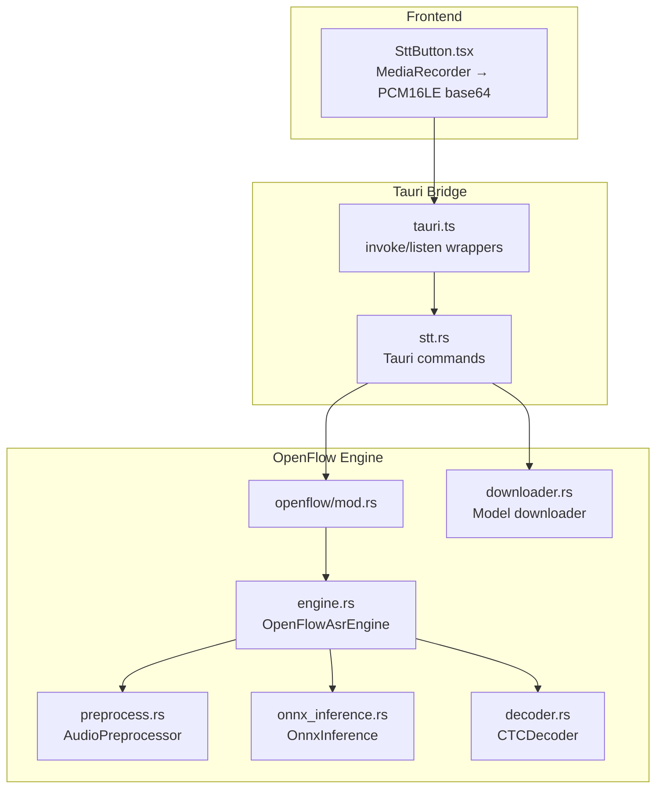
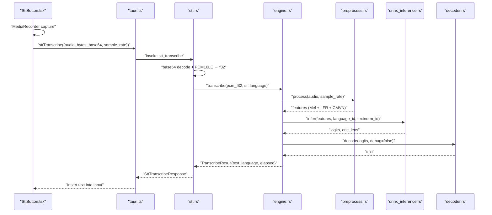
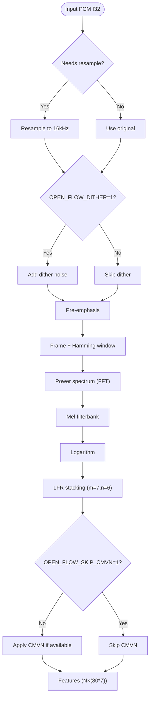
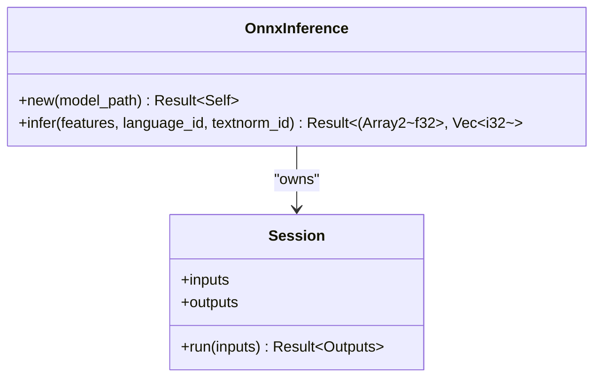
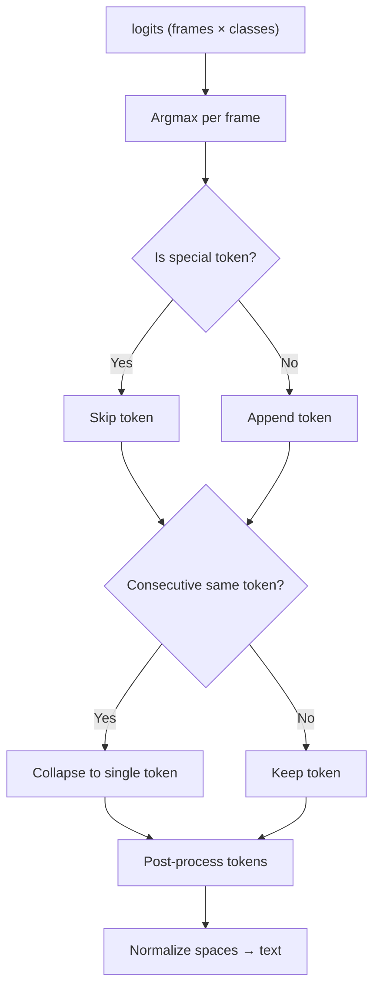
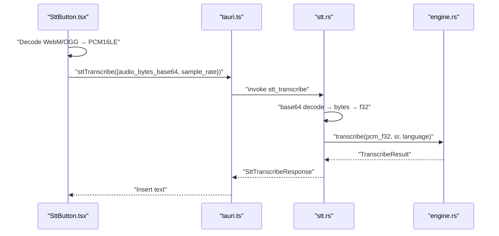
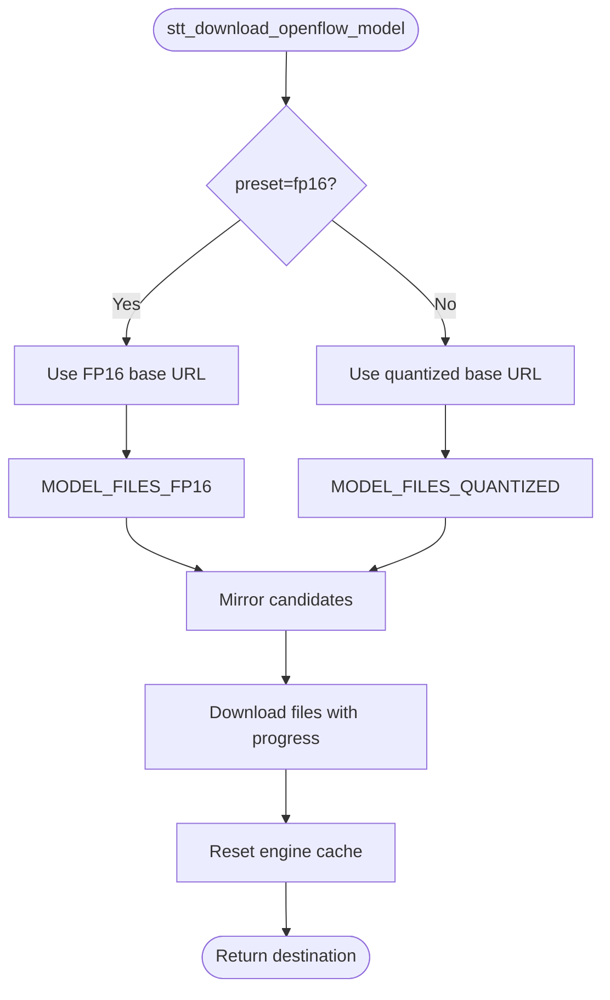
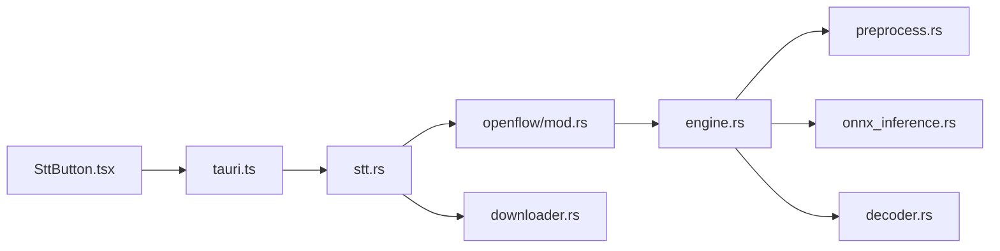

# Speech-to-Text (STT) System

<cite>
**Referenced Files in This Document**
- [stt.rs](file://src-tauri/src/commands/stt.rs)
- [mod.rs (STT module)](file://src-tauri/src/modules/stt/mod.rs)
- [settings.rs](file://src-tauri/src/modules/stt/settings.rs)
- [mod.rs (OpenFlow)](file://src-tauri/src/modules/stt/openflow/mod.rs)
- [engine.rs](file://src-tauri/src/modules/stt/openflow/engine.rs)
- [preprocess.rs](file://src-tauri/src/modules/stt/openflow/preprocess.rs)
- [onnx_inference.rs](file://src-tauri/src/modules/stt/openflow/onnx_inference.rs)
- [decoder.rs](file://src-tauri/src/modules/stt/openflow/decoder.rs)
- [downloader.rs](file://src-tauri/src/modules/stt/openflow/downloader.rs)
- [SttButton.tsx](file://src/modules/chat/SttButton.tsx)
- [tauri.ts](file://src/lib/tauri.ts)
</cite>

## Table of Contents
1. [Introduction](#introduction)
2. [Project Structure](#project-structure)
3. [Core Components](#core-components)
4. [Architecture Overview](#architecture-overview)
5. [Detailed Component Analysis](#detailed-component-analysis)
6. [Dependency Analysis](#dependency-analysis)
7. [Performance Considerations](#performance-considerations)
8. [Troubleshooting Guide](#troubleshooting-guide)
9. [Conclusion](#conclusion)
10. [Appendices](#appendices)

## Introduction
This document describes the Speech-to-Text (STT) system built on the OpenFlow/SenseVoice ONNX implementation. It covers the audio preprocessing pipeline, ONNX inference engine, model downloading and caching, transcription result processing, and the end-to-end transcribe workflow from frontend MediaRecorder capture to final text output. It also documents configuration options, performance tuning levers, and error handling patterns.

## Project Structure
The STT system spans three layers:
- Frontend: React component that captures microphone audio, converts to PCM16LE base64, and invokes Tauri commands.
- Backend Rust (Tauri commands): Orchestrates model readiness, downloads models, and performs transcription.
- OpenFlow engine: Provides audio preprocessing, ONNX inference, and CTC decoding.

**Diagram sources**
- [SttButton.tsx:31-51](file://src/modules/chat/SttButton.tsx#L31-L51)
- [tauri.ts:1-120](file://src/lib/tauri.ts#L1-L120)
- [stt.rs:130-160](file://src-tauri/src/commands/stt.rs#L130-L160)
- [mod.rs (OpenFlow):1-24](file://src-tauri/src/modules/stt/openflow/mod.rs#L1-L24)
- [engine.rs:1-202](file://src-tauri/src/modules/stt/openflow/engine.rs#L1-L202)
- [preprocess.rs:68-112](file://src-tauri/src/modules/stt/openflow/preprocess.rs#L68-L112)
- [onnx_inference.rs:55-124](file://src-tauri/src/modules/stt/openflow/onnx_inference.rs#L55-L124)
- [decoder.rs:88-201](file://src-tauri/src/modules/stt/openflow/decoder.rs#L88-L201)
- [downloader.rs:89-124](file://src-tauri/src/modules/stt/openflow/downloader.rs#L89-L124)

**Section sources**
- [mod.rs (STT module):1-40](file://src-tauri/src/modules/stt/mod.rs#L1-L40)
- [mod.rs (OpenFlow):1-24](file://src-tauri/src/modules/stt/openflow/mod.rs#L1-L24)

## Core Components
- STT module overview and shared result type.
- OpenFlow backend with preprocessing, inference, and decoding.
- Tauri commands for model status, settings, transcription, and model download.
- Frontend button component integrating MediaRecorder and invoking STT.

Key responsibilities:
- Audio preprocessing: resampling to 16 kHz, framing, Mel spectrogram, Low Frame Rate (LFR), CMVN normalization.
- ONNX inference: graph optimization level 3, thread pool sizing, dynamic input shapes.
- Decoding: greedy CTC decoding with special token filtering and whitespace normalization.
- Model management: download presets (quantized vs FP16), fallback mirrors, progress callbacks, and readiness checks.

**Section sources**
- [mod.rs (STT module):31-40](file://src-tauri/src/modules/stt/mod.rs#L31-L40)
- [engine.rs:1-202](file://src-tauri/src/modules/stt/openflow/engine.rs#L1-L202)
- [preprocess.rs:68-112](file://src-tauri/src/modules/stt/openflow/preprocess.rs#L68-L112)
- [onnx_inference.rs:23-124](file://src-tauri/src/modules/stt/openflow/onnx_inference.rs#L23-L124)
- [decoder.rs:28-201](file://src-tauri/src/modules/stt/openflow/decoder.rs#L28-L201)
- [stt.rs:130-160](file://src-tauri/src/commands/stt.rs#L130-L160)
- [SttButton.tsx:31-51](file://src/modules/chat/SttButton.tsx#L31-L51)

## Architecture Overview
End-to-end transcription flow from frontend to backend and back:

**Diagram sources**
- [SttButton.tsx:97-117](file://src/modules/chat/SttButton.tsx#L97-L117)
- [tauri.ts:1-120](file://src/lib/tauri.ts#L1-L120)
- [stt.rs:130-160](file://src-tauri/src/commands/stt.rs#L130-L160)
- [engine.rs:149-175](file://src-tauri/src/modules/stt/openflow/engine.rs#L149-L175)
- [preprocess.rs:68-112](file://src-tauri/src/modules/stt/openflow/preprocess.rs#L68-L112)
- [onnx_inference.rs:55-124](file://src-tauri/src/modules/stt/openflow/onnx_inference.rs#L55-L124)
- [decoder.rs:88-201](file://src-tauri/src/modules/stt/openflow/decoder.rs#L88-L201)

## Detailed Component Analysis

### Audio Preprocessing Pipeline
The pipeline transforms arbitrary PCM input into model-ready features:
- Resample to 16 kHz if needed.
- Optional dithering controlled by environment variable.
- Pre-emphasis filter.
- Framing with Hamming window and FFT.
- Mel filterbank computation.
- Logarithmic scaling.
- Low Frame Rate (LFR) stacking with optional left-padding control.
- Optional CMVN normalization if am.mvn is present.

**Diagram sources**
- [preprocess.rs:68-112](file://src-tauri/src/modules/stt/openflow/preprocess.rs#L68-L112)
- [preprocess.rs:158-186](file://src-tauri/src/modules/stt/openflow/preprocess.rs#L158-L186)
- [preprocess.rs:224-248](file://src-tauri/src/modules/stt/openflow/preprocess.rs#L224-L248)
- [preprocess.rs:250-274](file://src-tauri/src/modules/stt/openflow/preprocess.rs#L250-L274)
- [preprocess.rs:276-323](file://src-tauri/src/modules/stt/openflow/preprocess.rs#L276-L323)
- [preprocess.rs:348-383](file://src-tauri/src/modules/stt/openflow/preprocess.rs#L348-L383)
- [preprocess.rs:105-109](file://src-tauri/src/modules/stt/openflow/preprocess.rs#L105-L109)

**Section sources**
- [preprocess.rs:6-20](file://src-tauri/src/modules/stt/openflow/preprocess.rs#L6-L20)
- [preprocess.rs:68-112](file://src-tauri/src/modules/stt/openflow/preprocess.rs#L68-L112)

### ONNX Inference Engine
The engine wraps ONNX Runtime with:
- Graph optimization level 3.
- Thread count tuned for CPU cores.
- Dynamic input tensors for variable-length sequences.
- Output parsing supporting both float32 and float16 models.
- Skipping initial control frames for SenseVoice.

**Diagram sources**
- [onnx_inference.rs:23-53](file://src-tauri/src/modules/stt/openflow/onnx_inference.rs#L23-L53)
- [onnx_inference.rs:55-124](file://src-tauri/src/modules/stt/openflow/onnx_inference.rs#L55-L124)

**Section sources**
- [onnx_inference.rs:23-53](file://src-tauri/src/modules/stt/openflow/onnx_inference.rs#L23-L53)
- [onnx_inference.rs:55-124](file://src-tauri/src/modules/stt/openflow/onnx_inference.rs#L55-L124)

### CTC Decoder
Greedy decoding with:
- Special token filtering (<unk>, <s>, </s>, <blank>, <space>, etc.).
- Whitespace normalization and token concatenation.
- Optional “best non-blank” mode controlled by environment variable.

**Diagram sources**
- [decoder.rs:88-201](file://src-tauri/src/modules/stt/openflow/decoder.rs#L88-L201)

**Section sources**
- [decoder.rs:28-86](file://src-tauri/src/modules/stt/openflow/decoder.rs#L28-L86)
- [decoder.rs:88-201](file://src-tauri/src/modules/stt/openflow/decoder.rs#L88-L201)

### Transcription Workflow (Frontend to Backend)
- Frontend captures audio via MediaRecorder, decodes to PCM16LE, and base64 encodes.
- Invokes Tauri command with language hint and sample rate.
- Backend ensures OpenFlow engine is initialized and model is ready.
- Converts base64 to PCM f32, runs preprocessing, ONNX inference, and decoding.
- Returns structured result to frontend.

**Diagram sources**
- [SttButton.tsx:97-117](file://src/modules/chat/SttButton.tsx#L97-L117)
- [tauri.ts:1-120](file://src/lib/tauri.ts#L1-L120)
- [stt.rs:130-160](file://src-tauri/src/commands/stt.rs#L130-L160)
- [engine.rs:149-175](file://src-tauri/src/modules/stt/openflow/engine.rs#L149-L175)

**Section sources**
- [SttButton.tsx:31-51](file://src/modules/chat/SttButton.tsx#L31-L51)
- [stt.rs:130-160](file://src-tauri/src/commands/stt.rs#L130-L160)
- [engine.rs:149-175](file://src-tauri/src/modules/stt/openflow/engine.rs#L149-L175)

### Model Downloading and Caching
- Presets: quantized (~230 MB) and FP16 (~450 MB).
- Fallback mirrors: primary Hugging Face, secondary hf-mirror.com.
- Progress events emitted to frontend.
- After download, engine cache is reset to reload new model files.

**Diagram sources**
- [stt.rs:180-221](file://src-tauri/src/commands/stt.rs#L180-L221)
- [downloader.rs:89-124](file://src-tauri/src/modules/stt/openflow/downloader.rs#L89-L124)
- [downloader.rs:126-204](file://src-tauri/src/modules/stt/openflow/downloader.rs#L126-L204)

**Section sources**
- [downloader.rs:13-65](file://src-tauri/src/modules/stt/openflow/downloader.rs#L13-L65)
- [downloader.rs:89-124](file://src-tauri/src/modules/stt/openflow/downloader.rs#L89-L124)
- [stt.rs:180-221](file://src-tauri/src/commands/stt.rs#L180-L221)

### Configuration Options
- Provider selection: OpenFlow only (legacy fields preserved for compatibility).
- Model directory: resolved via default SenseVoice directory.
- Environment variables controlling preprocessing and decoding:
  - OPEN_FLOW_DITHER=1: enable dithering.
  - OPEN_FLOW_SKIP_CMVN=1: skip CMVN normalization.
  - OPEN_FLOW_LFR_LEFT_PAD=0: disable left padding for LFR.
  - OPEN_FLOW_BEST_NON_BLANK=1: use best non-blank strategy in decoding.

**Section sources**
- [settings.rs:16-29](file://src-tauri/src/modules/stt/settings.rs#L16-L29)
- [preprocess.rs:77-85](file://src-tauri/src/modules/stt/openflow/preprocess.rs#L77-L85)
- [preprocess.rs:105-109](file://src-tauri/src/modules/stt/openflow/preprocess.rs#L105-L109)
- [preprocess.rs:356-358](file://src-tauri/src/modules/stt/openflow/preprocess.rs#L356-L358)
- [decoder.rs:157-160](file://src-tauri/src/modules/stt/openflow/decoder.rs#L157-L160)

## Dependency Analysis
High-level dependencies among components:

**Diagram sources**
- [SttButton.tsx:1-191](file://src/modules/chat/SttButton.tsx#L1-L191)
- [tauri.ts:1-120](file://src/lib/tauri.ts#L1-L120)
- [stt.rs:1-222](file://src-tauri/src/commands/stt.rs#L1-L222)
- [mod.rs (OpenFlow):1-24](file://src-tauri/src/modules/stt/openflow/mod.rs#L1-L24)
- [engine.rs:1-202](file://src-tauri/src/modules/stt/openflow/engine.rs#L1-L202)
- [preprocess.rs:1-556](file://src-tauri/src/modules/stt/openflow/preprocess.rs#L1-L556)
- [onnx_inference.rs:1-126](file://src-tauri/src/modules/stt/openflow/onnx_inference.rs#L1-L126)
- [decoder.rs:1-354](file://src-tauri/src/modules/stt/openflow/decoder.rs#L1-L354)
- [downloader.rs:1-205](file://src-tauri/src/modules/stt/openflow/downloader.rs#L1-L205)

**Section sources**
- [mod.rs (OpenFlow):16-24](file://src-tauri/src/modules/stt/openflow/mod.rs#L16-L24)
- [engine.rs:1-202](file://src-tauri/src/modules/stt/openflow/engine.rs#L1-L202)

## Performance Considerations
- Preprocessing:
  - FFT size and hop length are fixed for 16 kHz; ensure input sample rates are reasonable to avoid excessive resampling overhead.
  - LFR reduces temporal resolution; tune m/n if latency or accuracy trade-offs are needed.
- ONNX Runtime:
  - Graph optimization level 3 improves throughput at the cost of compilation time.
  - Thread count is set to a fixed value; adjust based on CPU cores for optimal concurrency.
- Decoding:
  - Greedy decoding is fast; enabling “best non-blank” adds extra per-frame computation.
- Frontend:
  - Base64 encoding overhead is minimal compared to network latency; ensure efficient chunk sizes in MediaRecorder.

[No sources needed since this section provides general guidance]

## Troubleshooting Guide
Common issues and resolutions:
- Model not found:
  - Symptom: Transcription fails with a readiness error.
  - Action: Trigger model download via the settings page; verify the model directory exists and contains model.onnx/tokens.json.
- Empty or low-quality audio:
  - Symptom: Empty transcription result.
  - Action: Ensure microphone permissions; check ambient noise; verify MediaRecorder MIME type compatibility.
- Slow transcription:
  - Symptom: High elapsed_seconds.
  - Action: Confirm model preset (quantized vs FP16); ensure sufficient CPU resources; reduce concurrent tasks.
- Download failures:
  - Symptom: Download progress stalls or fails.
  - Action: Retry download; verify network connectivity; confirm fallback mirror availability.

**Section sources**
- [stt.rs:27-42](file://src-tauri/src/commands/stt.rs#L27-L42)
- [stt.rs:130-160](file://src-tauri/src/commands/stt.rs#L130-L160)
- [downloader.rs:126-204](file://src-tauri/src/modules/stt/openflow/downloader.rs#L126-L204)

## Conclusion
The STT system integrates a robust audio preprocessing pipeline, an optimized ONNX inference engine, and a reliable CTC decoder to deliver accurate, low-latency speech recognition. Its design emphasizes simplicity (single backend), reliability (fallback mirrors, readiness checks), and configurability (environment variables). The frontend provides a seamless user experience with clear feedback during recording and processing.

[No sources needed since this section summarizes without analyzing specific files]

## Appendices

### Initialization Examples
- Initialize STT engine and model:
  - Ensure model directory and files exist; the engine lazily loads on first transcription.
- Set up audio streaming:
  - Use MediaRecorder with appropriate MIME type; convert captured blobs to PCM16LE base64 before sending to backend.

**Section sources**
- [stt.rs:27-42](file://src-tauri/src/commands/stt.rs#L27-L42)
- [SttButton.tsx:91-117](file://src/modules/chat/SttButton.tsx#L91-L117)

### Transcription Result Processing
- Frontend receives structured response with text, language, elapsed time, and provider.
- Insert the returned text into the input field and optionally show a success toast.

**Section sources**
- [stt.rs:154-159](file://src-tauri/src/commands/stt.rs#L154-L159)
- [SttButton.tsx:108-116](file://src/modules/chat/SttButton.tsx#L108-L116)