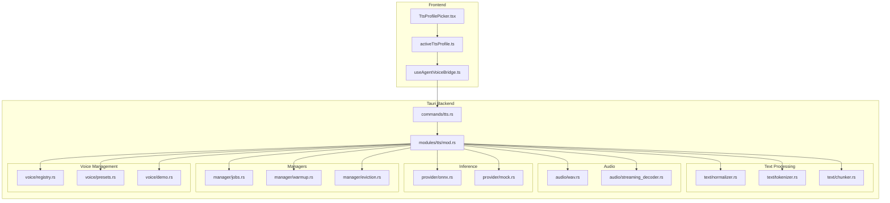
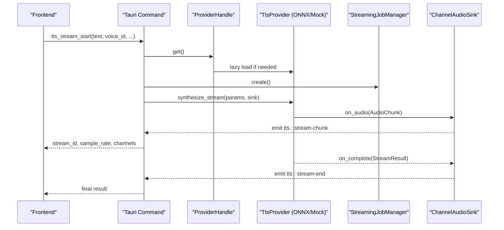
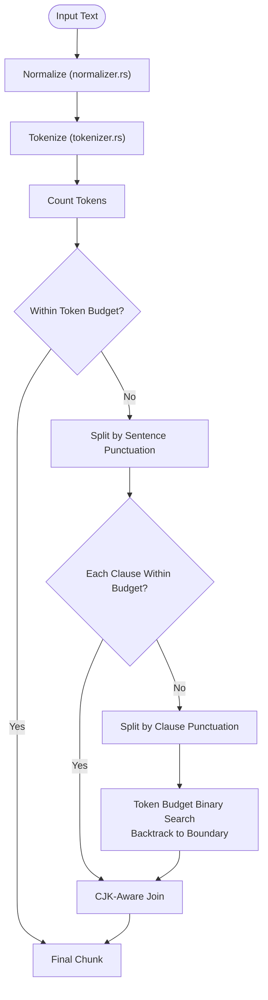
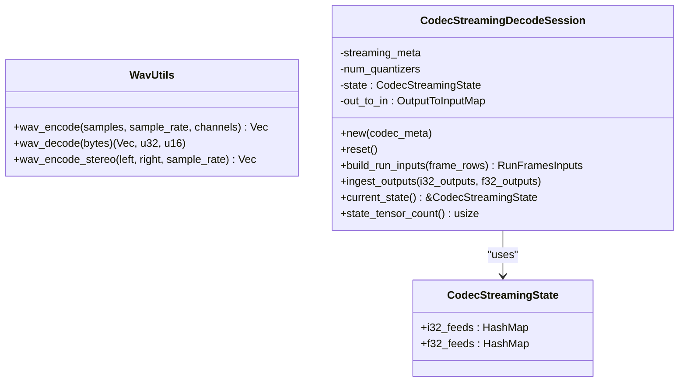
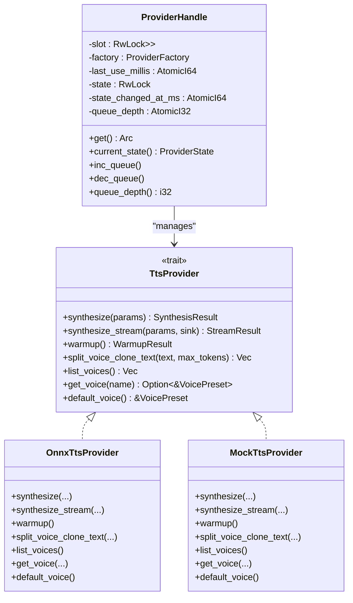
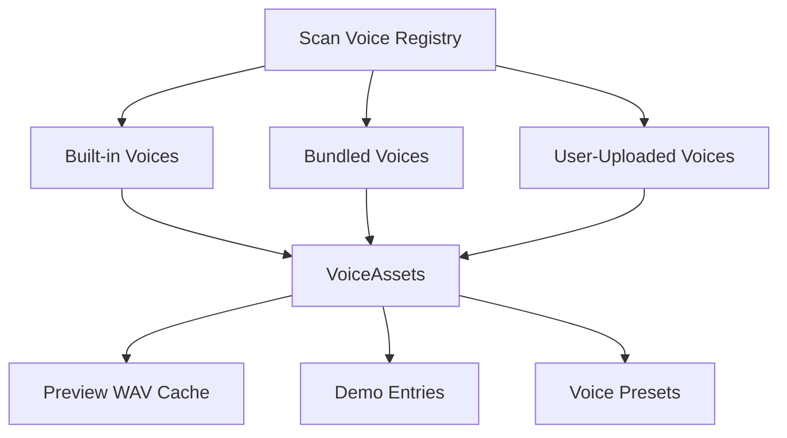
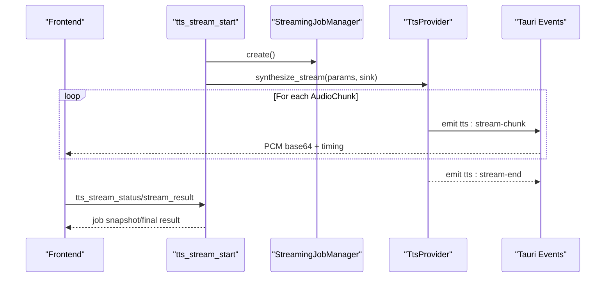
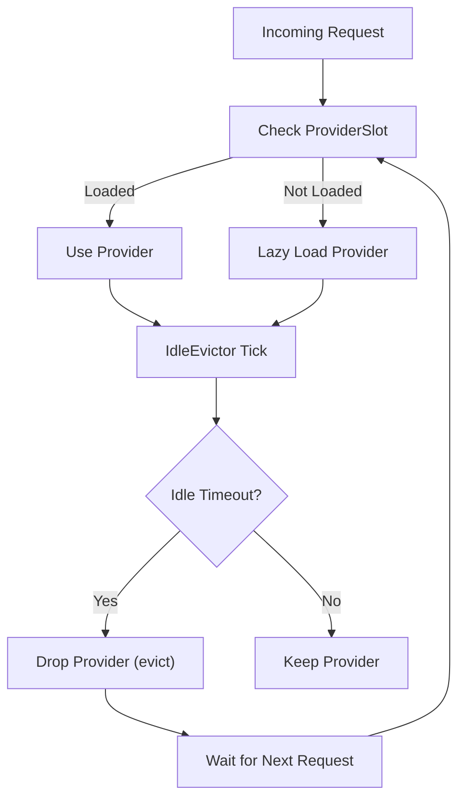
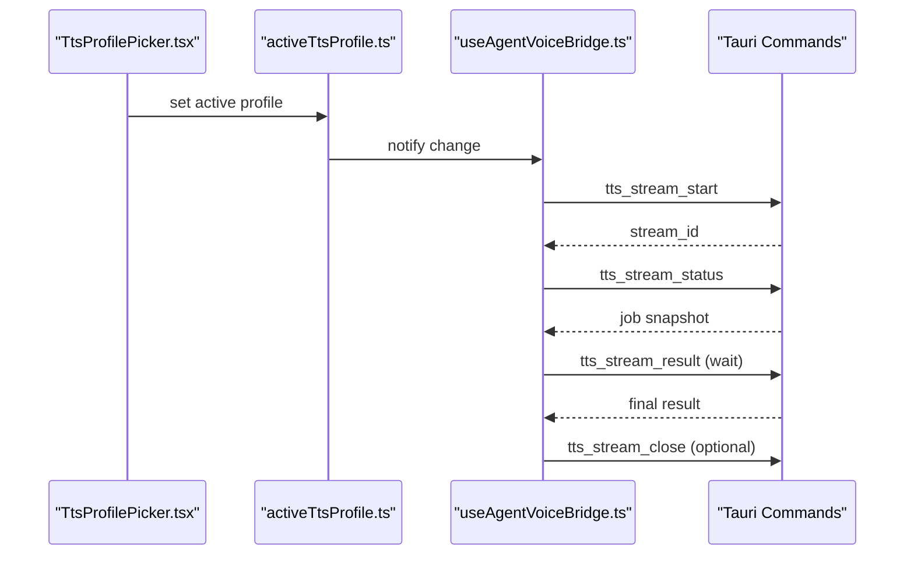
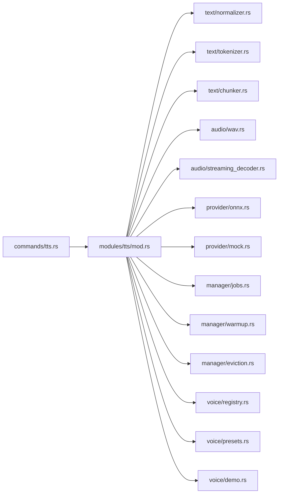

# Text-to-Speech (TTS) System

<cite>
**Referenced Files in This Document**
- [tts.rs](file://src-tauri/src/commands/tts.rs)
- [mod.rs](file://src-tauri/src/modules/tts/mod.rs)
- [chunker.rs](file://src-tauri/src/modules/tts/text/chunker.rs)
- [normalizer.rs](file://src-tauri/src/modules/tts/text/normalizer.rs)
- [tokenizer.rs](file://src-tauri/src/modules/tts/text/tokenizer.rs)
- [wav.rs](file://src-tauri/src/modules/tts/audio/wav.rs)
- [streaming_decoder.rs](file://src-tauri/src/modules/tts/audio/streaming_decoder.rs)
- [jobs.rs](file://src-tauri/src/modules/tts/manager/jobs.rs)
- [warmup.rs](file://src-tauri/src/modules/tts/manager/warmup.rs)
- [eviction.rs](file://src-tauri/src/modules/tts/manager/eviction.rs)
- [onnx.rs](file://src-tauri/src/modules/tts/provider/onnx.rs)
- [mock.rs](file://src-tauri/src/modules/tts/provider/mock.rs)
- [config.rs](file://src-tauri/src/modules/tts/config.rs)
- [settings.rs](file://src-tauri/src/modules/tts/settings.rs)
- [profile.rs](file://src-tauri/src/modules/tts/profile.rs)
- [registry.rs](file://src-tauri/src/modules/tts/voice/registry.rs)
- [presets.rs](file://src-tauri/src/modules/tts/voice/presets.rs)
- [demo.rs](file://src-tauri/src/modules/tts/voice/demo.rs)
- [TtsProfilePicker.tsx](file://src/modules/chat/TtsProfilePicker.tsx)
- [activeTtsProfile.ts](file://src/modules/chat/activeTtsProfile.ts)
- [useAgentVoiceBridge.ts](file://src/modules/chat/useAgentVoiceBridge.ts)
</cite>

## Table of Contents
1. [Introduction](#introduction)
2. [Project Structure](#project-structure)
3. [Core Components](#core-components)
4. [Architecture Overview](#architecture-overview)
5. [Detailed Component Analysis](#detailed-component-analysis)
6. [Dependency Analysis](#dependency-analysis)
7. [Performance Considerations](#performance-considerations)
8. [Troubleshooting Guide](#troubleshooting-guide)
9. [Conclusion](#conclusion)
10. [Appendices](#appendices)

## Introduction
This document describes the Text-to-Speech (TTS) system architecture and implementation in the codebase. It covers the complete audio processing pipeline from text normalization and tokenization through streaming audio decoding and delivery to the frontend. It also documents the inference pipeline with ONNX Runtime integration, model downloading and caching, voice management (profiles, presets, registry), audio streaming architecture with budget management and eviction policies, and performance metrics. Finally, it provides configuration examples and troubleshooting guidance for common audio processing issues.

## Project Structure
The TTS system is implemented primarily in Rust under the Tauri backend, with supporting frontend components for voice selection and streaming orchestration. Key areas:
- Backend TTS module: text processing, audio utilities, inference, streaming, voice management, and managers
- Tauri commands: user-facing APIs for health, synthesis, streaming, voice listing, and user voice management
- Frontend components: voice picker, active profile management, and agent voice bridge for seamless playback

**Diagram sources**
- [tts.rs:1-1369](file://src-tauri/src/commands/tts.rs#L1-L1369)
- [mod.rs:1-209](file://src-tauri/src/modules/tts/mod.rs#L1-L209)
- [chunker.rs:1-462](file://src-tauri/src/modules/tts/text/chunker.rs#L1-L462)
- [normalizer.rs:1-583](file://src-tauri/src/modules/tts/text/normalizer.rs#L1-L583)
- [tokenizer.rs:1-199](file://src-tauri/src/modules/tts/text/tokenizer.rs#L1-L199)
- [wav.rs:1-160](file://src-tauri/src/modules/tts/audio/wav.rs#L1-L160)
- [streaming_decoder.rs:1-333](file://src-tauri/src/modules/tts/audio/streaming_decoder.rs#L1-L333)
- [jobs.rs](file://src-tauri/src/modules/tts/manager/jobs.rs)
- [warmup.rs](file://src-tauri/src/modules/tts/manager/warmup.rs)
- [eviction.rs](file://src-tauri/src/modules/tts/manager/eviction.rs)
- [onnx.rs](file://src-tauri/src/modules/tts/provider/onnx.rs)
- [mock.rs](file://src-tauri/src/modules/tts/provider/mock.rs)
- [registry.rs](file://src-tauri/src/modules/tts/voice/registry.rs)
- [presets.rs](file://src-tauri/src/modules/tts/voice/presets.rs)
- [demo.rs](file://src-tauri/src/modules/tts/voice/demo.rs)

**Section sources**
- [tts.rs:1-1369](file://src-tauri/src/commands/tts.rs#L1-L1369)
- [mod.rs:1-209](file://src-tauri/src/modules/tts/mod.rs#L1-L209)

## Core Components
- TTS Provider trait and implementations: abstract synthesis interface with ONNX and mock providers
- Text processing: robust normalizer, tokenizer (HuggingFace tokenizers), and chunker for voice clone mode
- Audio utilities: WAV encode/decode helpers and streaming decoder state machine
- Inference managers: warmup, streaming job management, and idle eviction
- Voice management: registry scanning, presets, demo entries, and user voice upload/rename/delete
- Frontend integration: profile picker, active profile, and agent voice bridge for gapless streaming

**Section sources**
- [mod.rs:60-209](file://src-tauri/src/modules/tts/mod.rs#L60-L209)
- [chunker.rs:76-170](file://src-tauri/src/modules/tts/text/chunker.rs#L76-L170)
- [tokenizer.rs:47-141](file://src-tauri/src/modules/tts/text/tokenizer.rs#L47-L141)
- [wav.rs:16-69](file://src-tauri/src/modules/tts/audio/wav.rs#L16-L69)
- [streaming_decoder.rs:53-197](file://src-tauri/src/modules/tts/audio/streaming_decoder.rs#L53-L197)
- [jobs.rs](file://src-tauri/src/modules/tts/manager/jobs.rs)
- [warmup.rs](file://src-tauri/src/modules/tts/manager/warmup.rs)
- [eviction.rs](file://src-tauri/src/modules/tts/manager/eviction.rs)
- [registry.rs](file://src-tauri/src/modules/tts/voice/registry.rs)
- [presets.rs](file://src-tauri/src/modules/tts/voice/presets.rs)
- [demo.rs](file://src-tauri/src/modules/tts/voice/demo.rs)

## Architecture Overview
The TTS system exposes Tauri commands that orchestrate synthesis and streaming. The ProviderHandle manages lazy loading and eviction of the underlying TTS provider. The text pipeline normalizes input, tokenizes, and splits into chunks respecting token budgets. The audio pipeline encodes/decodes WAV and streams PCM chunks to the frontend via Tauri events. Voice management supports built-in, bundled, and user-uploaded voices with preview caching.

**Diagram sources**
- [tts.rs:530-752](file://src-tauri/src/commands/tts.rs#L530-L752)
- [mod.rs:66-96](file://src-tauri/src/modules/tts/mod.rs#L66-L96)
- [jobs.rs](file://src-tauri/src/modules/tts/manager/jobs.rs)
- [streaming_decoder.rs:1-333](file://src-tauri/src/modules/tts/audio/streaming_decoder.rs#L1-L333)

## Detailed Component Analysis

### Text Processing Pipeline
- Normalization: robust cleaning preserving URLs, emails, mentions, filenames; normalizes punctuation, spacing, and markdown
- Tokenization: HuggingFace tokenizers crate with bit-exactness against SentencePiece
- Chunking: three-tier splitting by sentence/clause boundaries and token budget with CJK-aware joining

**Diagram sources**
- [normalizer.rs:56-71](file://src-tauri/src/modules/tts/text/normalizer.rs#L56-L71)
- [tokenizer.rs:100-132](file://src-tauri/src/modules/tts/text/tokenizer.rs#L100-L132)
- [chunker.rs:76-170](file://src-tauri/src/modules/tts/text/chunker.rs#L76-L170)

**Section sources**
- [normalizer.rs:1-583](file://src-tauri/src/modules/tts/text/normalizer.rs#L1-L583)
- [tokenizer.rs:1-199](file://src-tauri/src/modules/tts/text/tokenizer.rs#L1-L199)
- [chunker.rs:1-462](file://src-tauri/src/modules/tts/text/chunker.rs#L1-L462)

### Audio Processing Modules
- WAV utilities: encode f32 PCM to 16-bit WAV, decode WAV to f32 PCM, stereo interleaving helper
- Streaming decoder: maintains codec state tensors (transformer offsets, attention caches) and constructs ONNX feeds for streaming decode

**Diagram sources**
- [wav.rs:16-86](file://src-tauri/src/modules/tts/audio/wav.rs#L16-L86)
- [streaming_decoder.rs:35-197](file://src-tauri/src/modules/tts/audio/streaming_decoder.rs#L35-L197)

**Section sources**
- [wav.rs:1-160](file://src-tauri/src/modules/tts/audio/wav.rs#L1-L160)
- [streaming_decoder.rs:1-333](file://src-tauri/src/modules/tts/audio/streaming_decoder.rs#L1-L333)

### Inference Pipeline and ONNX Integration
- Provider abstraction defines buffered synthesis, streaming synthesis, warmup, text splitting, and voice listing
- ProviderHandle manages lazy initialization, loading state, eviction, and queue depth for concurrency
- Tauri commands integrate with ProviderHandle to ensure readiness, track queue depth, and run synthesis or streaming
- Streaming synthesis emits audio chunks via Tauri events with PCM base64 payload and timing metrics

**Diagram sources**
- [mod.rs:66-124](file://src-tauri/src/modules/tts/mod.rs#L66-L124)
- [mod.rs:201-209](file://src-tauri/src/modules/tts/mod.rs#L201-L209)
- [tts.rs:241-393](file://src-tauri/src/commands/tts.rs#L241-L393)
- [onnx.rs](file://src-tauri/src/modules/tts/provider/onnx.rs)
- [mock.rs](file://src-tauri/src/modules/tts/provider/mock.rs)

**Section sources**
- [mod.rs:60-209](file://src-tauri/src/modules/tts/mod.rs#L60-L209)
- [tts.rs:241-393](file://src-tauri/src/commands/tts.rs#L241-L393)

### Voice Management System
- Voice registry scans built-in, bundled, and user-uploaded voices and builds a unified asset list
- Voice presets provide default configurations
- Demo entries supply example prompts
- User voice management supports upload (validated and stored), rename (sidecar metadata), delete, and preview caching

**Diagram sources**
- [tts.rs:62-112](file://src-tauri/src/commands/tts.rs#L62-L112)
- [registry.rs](file://src-tauri/src/modules/tts/voice/registry.rs)
- [presets.rs](file://src-tauri/src/modules/tts/voice/presets.rs)
- [demo.rs](file://src-tauri/src/modules/tts/voice/demo.rs)

**Section sources**
- [tts.rs:803-952](file://src-tauri/src/commands/tts.rs#L803-L952)
- [tts.rs:810-881](file://src-tauri/src/commands/tts.rs#L810-L881)
- [tts.rs:954-1283](file://src-tauri/src/commands/tts.rs#L954-L1283)
- [registry.rs](file://src-tauri/src/modules/tts/voice/registry.rs)
- [presets.rs](file://src-tauri/src/modules/tts/voice/presets.rs)
- [demo.rs](file://src-tauri/src/modules/tts/voice/demo.rs)

### Audio Streaming Architecture and Metrics
- Streaming synthesis emits Tauri events per audio chunk with PCM base64, sample rate, channels, and timing metrics
- Stream lifecycle includes job creation, status polling, result retrieval, and close/cancel
- ProviderHandle tracks queue depth and provider state for front-end observability
- StreamResult includes emitted audio seconds, lead seconds, first audio latency, and real-time factor

**Diagram sources**
- [tts.rs:530-752](file://src-tauri/src/commands/tts.rs#L530-L752)
- [jobs.rs](file://src-tauri/src/modules/tts/manager/jobs.rs)
- [mod.rs:175-199](file://src-tauri/src/modules/tts/mod.rs#L175-L199)

**Section sources**
- [tts.rs:587-709](file://src-tauri/src/commands/tts.rs#L587-L709)
- [mod.rs:175-199](file://src-tauri/src/modules/tts/mod.rs#L175-L199)

### Budget Management and Eviction Policies
- ProviderHandle enforces idle eviction: after a period without requests, the provider is dropped and reloaded on next use
- Queue depth tracking prevents overload and informs front-end health indicators
- Warmup manager primes the provider to reduce first-request latency

**Diagram sources**
- [tts.rs:258-393](file://src-tauri/src/commands/tts.rs#L258-L393)
- [eviction.rs](file://src-tauri/src/modules/tts/manager/eviction.rs)
- [warmup.rs](file://src-tauri/src/modules/tts/manager/warmup.rs)

**Section sources**
- [tts.rs:258-393](file://src-tauri/src/commands/tts.rs#L258-L393)
- [eviction.rs](file://src-tauri/src/modules/tts/manager/eviction.rs)
- [warmup.rs](file://src-tauri/src/modules/tts/manager/warmup.rs)

### Frontend Integration
- TtsProfilePicker: selects voice profiles and settings
- activeTtsProfile: manages the active profile state
- useAgentVoiceBridge: orchestrates gapless streaming across sentences and waits for stream-end events

**Diagram sources**
- [TtsProfilePicker.tsx](file://src/modules/chat/TtsProfilePicker.tsx)
- [activeTtsProfile.ts](file://src/modules/chat/activeTtsProfile.ts)
- [useAgentVoiceBridge.ts](file://src/modules/chat/useAgentVoiceBridge.ts)
- [tts.rs:530-752](file://src-tauri/src/commands/tts.rs#L530-L752)

**Section sources**
- [TtsProfilePicker.tsx](file://src/modules/chat/TtsProfilePicker.tsx)
- [activeTtsProfile.ts](file://src/modules/chat/activeTtsProfile.ts)
- [useAgentVoiceBridge.ts](file://src/modules/chat/useAgentVoiceBridge.ts)

## Dependency Analysis
The TTS module composes several subsystems with clear separation of concerns:
- Text processing depends on tokenizer and chunker
- Audio processing depends on WAV utilities and streaming decoder
- Inference depends on provider implementations and manager components
- Voice management integrates registry, presets, and demo entries
- Tauri commands depend on the TTS module and manage lifecycle and events

**Diagram sources**
- [tts.rs:1-1369](file://src-tauri/src/commands/tts.rs#L1-L1369)
- [mod.rs:1-209](file://src-tauri/src/modules/tts/mod.rs#L1-L209)

**Section sources**
- [tts.rs:1-1369](file://src-tauri/src/commands/tts.rs#L1-L1369)
- [mod.rs:1-209](file://src-tauri/src/modules/tts/mod.rs#L1-L209)

## Performance Considerations
- Lazy provider loading reduces cold-start latency and memory footprint
- Idle eviction frees ~1.5 GB RAM after periods of inactivity; provider reloads on demand
- Queue depth tracking prevents overload and enables front-end feedback
- Token budget splitting minimizes chunk size while maintaining natural prosody
- Streaming PCM base64 avoids intermediate files and enables gapless playback
- WAV encode/decode uses 16-bit PCM at 48 kHz stereo for consistent quality and compatibility

[No sources needed since this section provides general guidance]

## Troubleshooting Guide
Common issues and resolutions:
- Provider not loaded or evicted: call health endpoint to check state; trigger warmup to prime the provider
- Streaming stalls or incomplete playback: ensure frontend waits for tts:stream-end before starting next sentence
- Audio quality problems: verify sample rate and channels match expected 48 kHz stereo; confirm PCM base64 payload integrity
- Voice selection issues: use tts_list_voice_assets to enumerate available voices; verify voice_id correctness
- User voice upload failures: check file size (<30 MB), allowed extensions (wav/mp3/flac/ogg/m4a), and audio validity via probe
- Tokenization errors: ensure tokenizer.json exists in model directory; verify vocabulary size and encoding/decoding round-trips

**Section sources**
- [tts.rs:406-429](file://src-tauri/src/commands/tts.rs#L406-L429)
- [tts.rs:587-709](file://src-tauri/src/commands/tts.rs#L587-L709)
- [wav.rs:16-69](file://src-tauri/src/modules/tts/audio/wav.rs#L16-L69)
- [tts.rs:803-881](file://src-tauri/src/commands/tts.rs#L803-L881)
- [tts.rs:1029-1157](file://src-tauri/src/commands/tts.rs#L1029-L1157)
- [tokenizer.rs:54-98](file://src-tauri/src/modules/tts/text/tokenizer.rs#L54-L98)

## Conclusion
The TTS system provides a robust, modular pipeline for text-to-speech synthesis with streaming delivery, voice cloning, and comprehensive voice management. Its architecture balances performance (lazy loading, eviction, queue tracking) with reliability (gapless streaming, event-driven orchestration). The frontend integration ensures smooth user experiences, while the backend offers extensibility for ONNX Runtime integration and advanced inference features.

[No sources needed since this section summarizes without analyzing specific files]

## Appendices

### Configuration Examples
- Voice selection: choose voice_id from tts_list_voice_assets or use builtin names
- Audio quality settings: adjust GenerationParams (max_new_frames, seed) via Tauri commands
- Streaming parameters: tune chunk emission timing and lead_seconds for optimal latency
- Profiles and presets: manage TtsProfileBook entries for reusable voice + settings combinations

**Section sources**
- [tts.rs:803-881](file://src-tauri/src/commands/tts.rs#L803-L881)
- [tts.rs:1285-1369](file://src-tauri/src/commands/tts.rs#L1285-L1369)
- [config.rs](file://src-tauri/src/modules/tts/config.rs)
- [settings.rs](file://src-tauri/src/modules/tts/settings.rs)
- [profile.rs](file://src-tauri/src/modules/tts/profile.rs)