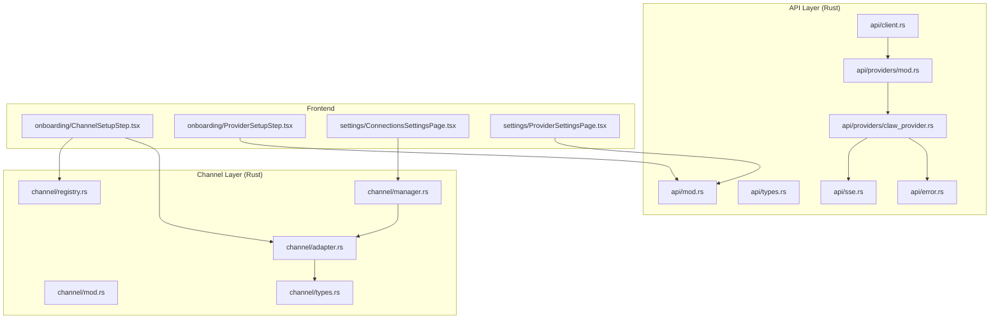
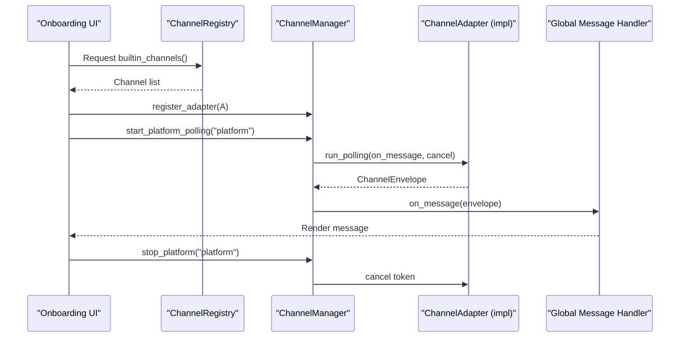
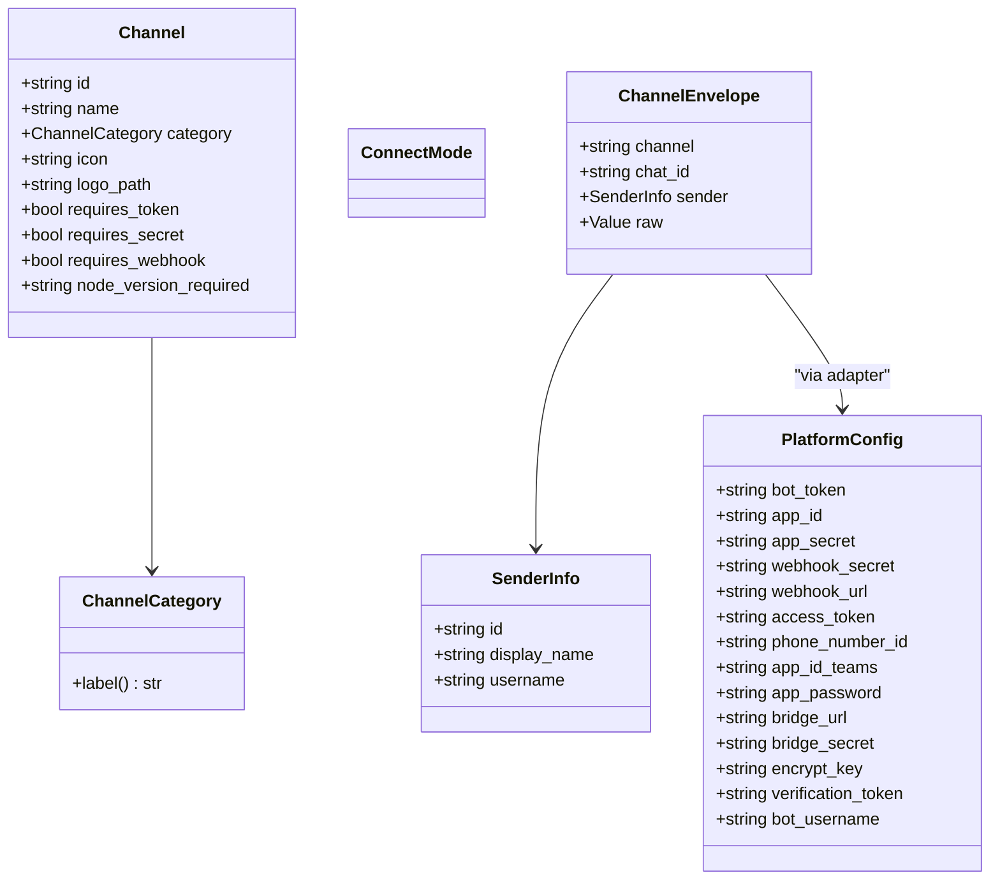
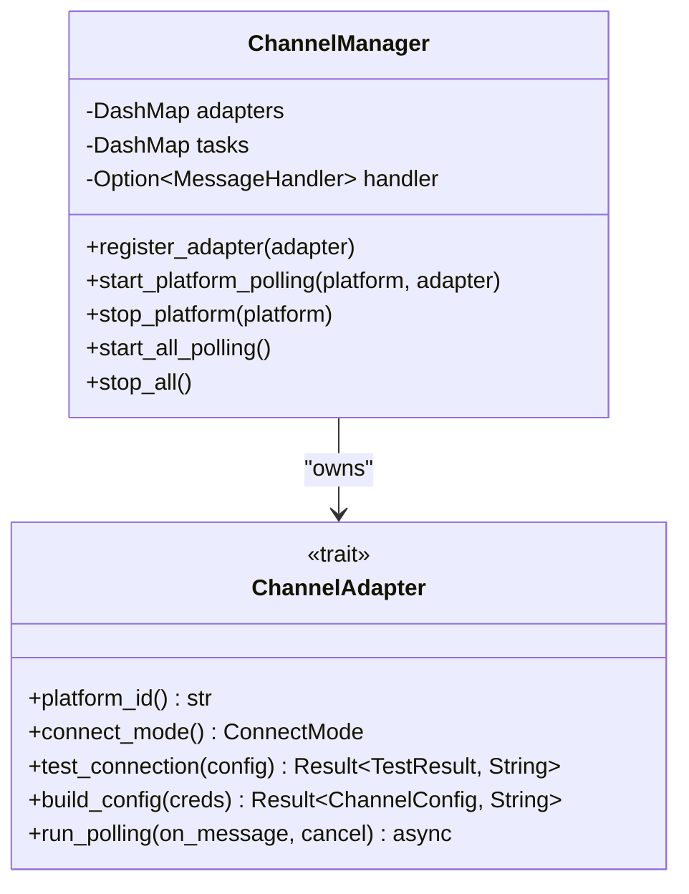
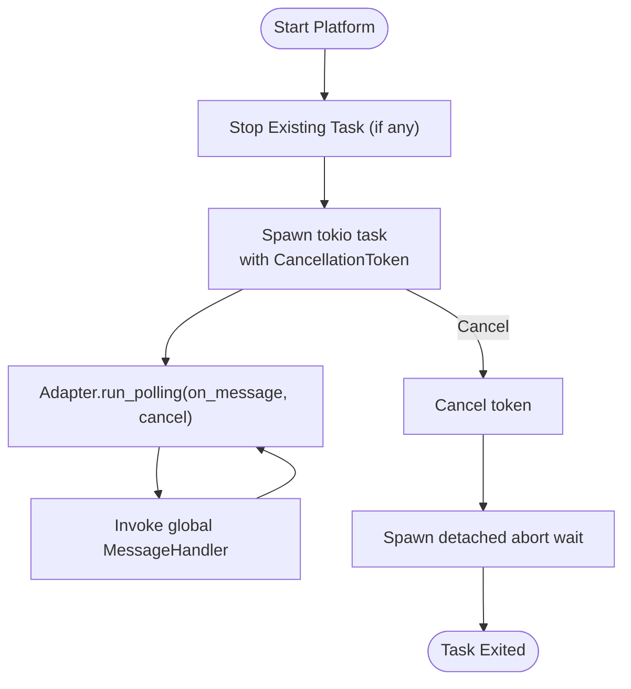
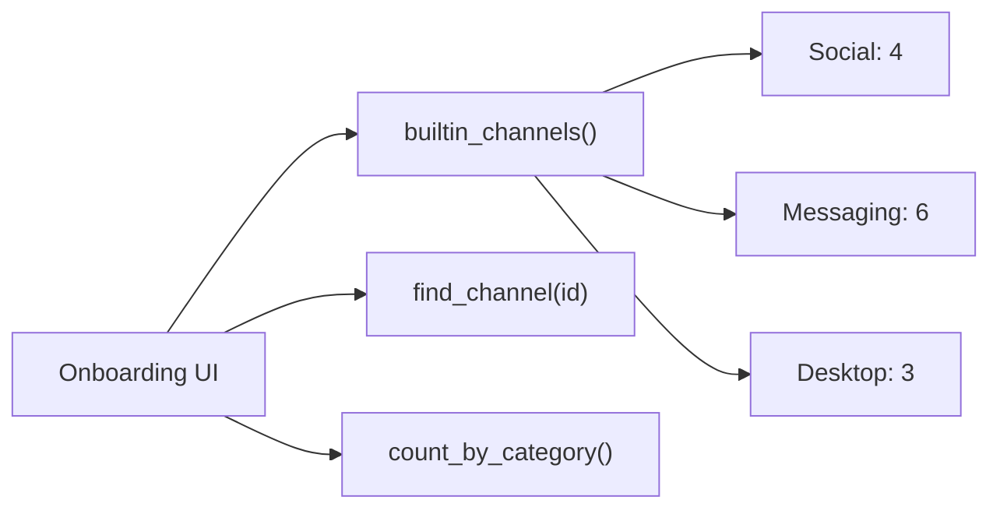
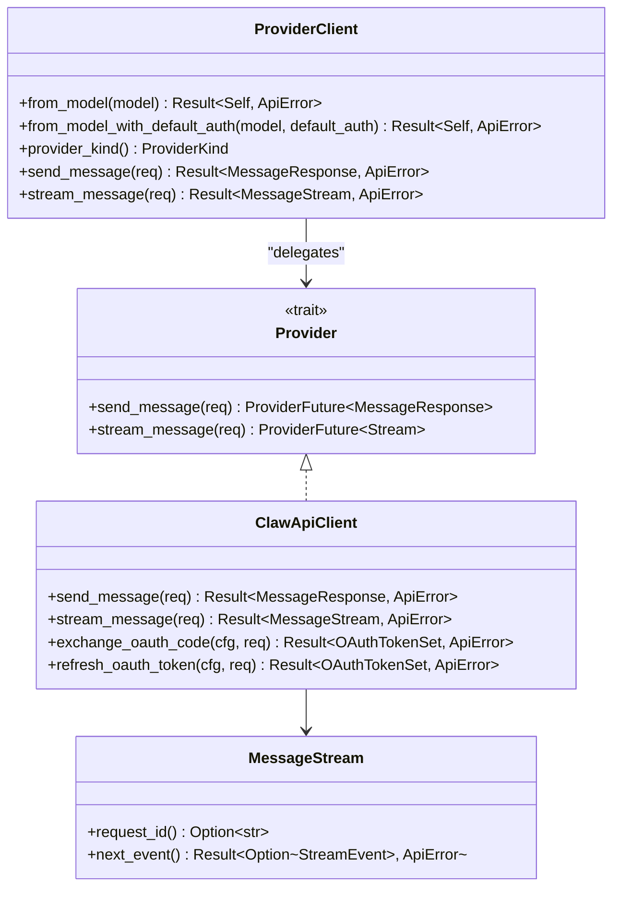
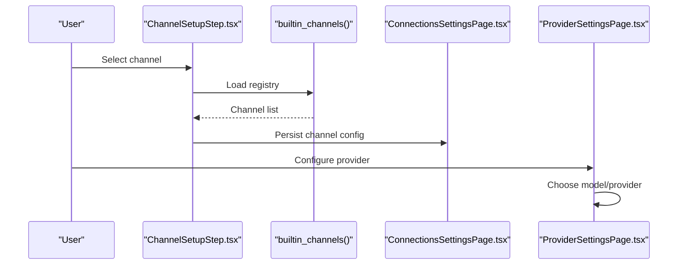
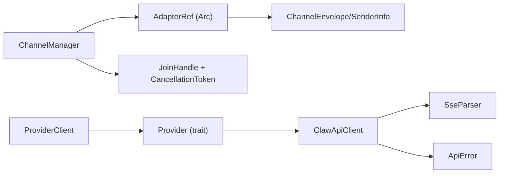

# Channel & API Integration

<cite>
**Referenced Files in This Document**
- [mod.rs](file://src-tauri/src/modules/channel/mod.rs)
- [types.rs](file://src-tauri/src/modules/channel/types.rs)
- [adapter.rs](file://src-tauri/src/modules/channel/adapter.rs)
- [manager.rs](file://src-tauri/src/modules/channel/manager.rs)
- [registry.rs](file://src-tauri/src/modules/channel/registry.rs)
- [mod.rs](file://src-tauri/src/modules/api/mod.rs)
- [client.rs](file://src-tauri/src/modules/api/client.rs)
- [types.rs](file://src-tauri/src/modules/api/types.rs)
- [mod.rs](file://src-tauri/src/modules/api/providers/mod.rs)
- [claw_provider.rs](file://src-tauri/src/modules/api/providers/claw_provider.rs)
- [error.rs](file://src-tauri/src/modules/api/error.rs)
- [sse.rs](file://src-tauri/src/modules/api/sse.rs)
- [ChannelCard.tsx](file://src/modules/onboarding/components/ChannelCard.tsx)
- [ChannelSetupStep.tsx](file://src/modules/onboarding/steps/ChannelSetupStep.tsx)
- [ProviderCard.tsx](file://src/modules/onboarding/components/ProviderCard.tsx)
- [ProviderSetupStep.tsx](file://src/modules/onboarding/steps/ProviderSetupStep.tsx)
- [ConnectionsSettingsPage.tsx](file://src/modules/settings/pages/ConnectionsSettingsPage.tsx)
- [ProviderKind.ts](file://src/modules/settings/pages/ProviderSettingsPage.tsx)
- [ProviderSettingsPage.tsx](file://src/modules/settings/pages/ProviderSettingsPage.tsx)
</cite>

## Table of Contents
1. [Introduction](#introduction)
2. [Project Structure](#project-structure)
3. [Core Components](#core-components)
4. [Architecture Overview](#architecture-overview)
5. [Detailed Component Analysis](#detailed-component-analysis)
6. [Dependency Analysis](#dependency-analysis)
7. [Performance Considerations](#performance-considerations)
8. [Troubleshooting Guide](#troubleshooting-guide)
9. [Conclusion](#conclusion)
10. [Appendices](#appendices)

## Introduction
This document explains the channel and API integration systems in the project. It covers the channel adapter pattern, channel management, and API provider integration. It documents channel types, routing mechanisms, and protocol adapters; details API client implementations, request/response handling, and error propagation; and provides practical guidance for adding new channels, implementing custom adapters, handling channel failures, securing channels, rate limiting, and optimizing performance for high-throughput scenarios.

## Project Structure
The channel system resides in the Rust backend under src-tauri/src/modules/channel. The API provider system lives under src-tauri/src/modules/api. Frontend onboarding and settings pages integrate with these systems to configure channels and providers.

**Diagram sources**
- [mod.rs:16-29](file://src-tauri/src/modules/channel/mod.rs#L16-L29)
- [types.rs:1-269](file://src-tauri/src/modules/channel/types.rs#L1-L269)
- [adapter.rs:23-74](file://src-tauri/src/modules/channel/adapter.rs#L23-L74)
- [manager.rs:39-47](file://src-tauri/src/modules/channel/manager.rs#L39-L47)
- [registry.rs:26-175](file://src-tauri/src/modules/channel/registry.rs#L26-L175)
- [mod.rs:1-40](file://src-tauri/src/modules/api/mod.rs#L1-L40)
- [client.rs:23-88](file://src-tauri/src/modules/api/client.rs#L23-L88)
- [types.rs:6-270](file://src-tauri/src/modules/api/types.rs#L6-L270)
- [mod.rs:17-29](file://src-tauri/src/modules/api/providers/mod.rs#L17-L29)
- [claw_provider.rs:118-127](file://src-tauri/src/modules/api/providers/claw_provider.rs#L118-L127)
- [sse.rs](file://src-tauri/src/modules/api/sse.rs)
- [error.rs](file://src-tauri/src/modules/api/error.rs)

**Section sources**
- [mod.rs:1-29](file://src-tauri/src/modules/channel/mod.rs#L1-L29)
- [mod.rs:1-40](file://src-tauri/src/modules/api/mod.rs#L1-L40)

## Core Components
- Channel types define categories, connection modes, envelopes, sender info, and platform credentials.
- The ChannelAdapter trait abstracts platform protocols and exposes lifecycle hooks.
- ChannelManager dynamically registers adapters, starts/stops polling tasks, and routes messages.
- Built-in channel registry enumerates supported platforms and their requirements.
- API provider system encapsulates provider clients, request/response models, and streaming.

**Section sources**
- [types.rs:19-180](file://src-tauri/src/modules/channel/types.rs#L19-L180)
- [adapter.rs:23-74](file://src-tauri/src/modules/channel/adapter.rs#L23-L74)
- [manager.rs:39-201](file://src-tauri/src/modules/channel/manager.rs#L39-L201)
- [registry.rs:26-175](file://src-tauri/src/modules/channel/registry.rs#L26-L175)
- [types.rs:6-270](file://src-tauri/src/modules/api/types.rs#L6-L270)
- [mod.rs:17-29](file://src-tauri/src/modules/api/providers/mod.rs#L17-L29)

## Architecture Overview
The channel subsystem uses a dynamic adapter pattern to support multiple platforms. Each platform implements ChannelAdapter, enabling polling or webhook-based message reception. ChannelManager coordinates adapter lifecycles and forwards normalized ChannelEnvelope messages to a global handler. API integration is handled by Provider clients that abstract provider-specific differences and expose unified send/stream operations.

**Diagram sources**
- [registry.rs:26-175](file://src-tauri/src/modules/channel/registry.rs#L26-L175)
- [manager.rs:121-144](file://src-tauri/src/modules/channel/manager.rs#L121-L144)
- [adapter.rs:45-74](file://src-tauri/src/modules/channel/adapter.rs#L45-L74)

## Detailed Component Analysis

### Channel Types and Routing
- ChannelCategory classifies platforms (Social, Messaging, Desktop).
- ConnectMode selects polling vs webhook strategies.
- ChannelEnvelope normalizes inbound messages across platforms.
- PlatformConfig centralizes credential fields for adapters.
- Routing is implicit via platform_id and ConnectMode; ChannelManager filters adapters by mode when starting polling.

**Diagram sources**
- [types.rs:56-166](file://src-tauri/src/modules/channel/types.rs#L56-L166)

**Section sources**
- [types.rs:19-180](file://src-tauri/src/modules/channel/types.rs#L19-L180)

### Channel Adapter Pattern
- ChannelAdapter defines platform_id, connect_mode, test_connection, build_config, and run_polling.
- Implementors must be Send + Sync and object-safe for dynamic dispatch.
- MessageHandler callback receives normalized ChannelEnvelope.

**Diagram sources**
- [adapter.rs:45-74](file://src-tauri/src/modules/channel/adapter.rs#L45-L74)
- [manager.rs:39-201](file://src-tauri/src/modules/channel/manager.rs#L39-L201)

**Section sources**
- [adapter.rs:23-74](file://src-tauri/src/modules/channel/adapter.rs#L23-L74)
- [manager.rs:73-201](file://src-tauri/src/modules/channel/manager.rs#L73-L201)

### Channel Lifecycle Management
- Registration replaces existing adapters by platform_id.
- start_platform_polling stops existing tasks, spawns a new tokio task with CancellationToken, and wires a closure that invokes the global handler.
- start_all_polling iterates registered adapters and starts only Polling-mode ones.
- stop_platform cancels the token and detaches a waiter to avoid blocking.
- stop_all cancels all tokens and waits asynchronously.

**Diagram sources**
- [manager.rs:121-144](file://src-tauri/src/modules/channel/manager.rs#L121-L144)
- [manager.rs:167-187](file://src-tauri/src/modules/channel/manager.rs#L167-L187)

**Section sources**
- [manager.rs:112-201](file://src-tauri/src/modules/channel/manager.rs#L112-L201)

### Built-in Channel Registry
- builtin_channels returns 13 channels across Social, Messaging, and Desktop categories.
- find_channel and count_by_category support UI and discovery.
- Each channel declares whether it requires token/secret/webhook and minimum Node.js version.

**Diagram sources**
- [registry.rs:26-175](file://src-tauri/src/modules/channel/registry.rs#L26-L175)

**Section sources**
- [registry.rs:13-211](file://src-tauri/src/modules/channel/registry.rs#L13-L211)

### API Provider Integration
- Provider trait unifies send/stream operations across providers.
- ProviderClient selects provider based on model alias and environment, then delegates send/stream.
- ClawApiClient implements Provider with retry/backoff, OAuth token handling, and SSE streaming.
- MessageRequest/MessageResponse and streaming events define the wire protocol.

**Diagram sources**
- [mod.rs:17-29](file://src-tauri/src/modules/api/providers/mod.rs#L17-L29)
- [client.rs:23-88](file://src-tauri/src/modules/api/client.rs#L23-L88)
- [claw_provider.rs:118-127](file://src-tauri/src/modules/api/providers/claw_provider.rs#L118-L127)
- [types.rs:6-270](file://src-tauri/src/modules/api/types.rs#L6-L270)

**Section sources**
- [mod.rs:17-29](file://src-tauri/src/modules/api/providers/mod.rs#L17-L29)
- [client.rs:23-113](file://src-tauri/src/modules/api/client.rs#L23-L113)
- [claw_provider.rs:118-403](file://src-tauri/src/modules/api/providers/claw_provider.rs#L118-L403)
- [types.rs:6-270](file://src-tauri/src/modules/api/types.rs#L6-L270)

### Frontend Integration
- Onboarding steps use ChannelRegistry to present channel choices and collect credentials.
- Provider setup integrates with ProviderClient selection and configuration.
- Settings pages expose connections and provider configuration.

**Diagram sources**
- [ChannelSetupStep.tsx](file://src/modules/onboarding/steps/ChannelSetupStep.tsx)
- [registry.rs:26-175](file://src-tauri/src/modules/channel/registry.rs#L26-L175)
- [ConnectionsSettingsPage.tsx](file://src/modules/settings/pages/ConnectionsSettingsPage.tsx)
- [ProviderSettingsPage.tsx](file://src/modules/settings/pages/ProviderSettingsPage.tsx)

**Section sources**
- [ChannelSetupStep.tsx](file://src/modules/onboarding/steps/ChannelSetupStep.tsx)
- [ProviderSetupStep.tsx](file://src/modules/onboarding/steps/ProviderSetupStep.tsx)
- [ConnectionsSettingsPage.tsx](file://src/modules/settings/pages/ConnectionsSettingsPage.tsx)
- [ProviderSettingsPage.tsx](file://src/modules/settings/pages/ProviderSettingsPage.tsx)

## Dependency Analysis
- ChannelManager depends on DashMap for concurrency and tokio tasks/CancellationToken for lifecycle.
- ChannelAdapter is Send + Sync and object-safe for dynamic dispatch.
- ProviderClient composes provider-specific clients and routes calls based on model detection.
- ClawApiClient depends on SSE parsing and OAuth helpers for streaming and auth.

**Diagram sources**
- [manager.rs:39-47](file://src-tauri/src/modules/channel/manager.rs#L39-L47)
- [adapter.rs:45-74](file://src-tauri/src/modules/channel/adapter.rs#L45-L74)
- [client.rs:23-88](file://src-tauri/src/modules/api/client.rs#L23-L88)
- [mod.rs:17-29](file://src-tauri/src/modules/api/providers/mod.rs#L17-L29)
- [claw_provider.rs:694-740](file://src-tauri/src/modules/api/providers/claw_provider.rs#L694-L740)
- [sse.rs](file://src-tauri/src/modules/api/sse.rs)
- [error.rs](file://src-tauri/src/modules/api/error.rs)

**Section sources**
- [manager.rs:39-201](file://src-tauri/src/modules/channel/manager.rs#L39-L201)
- [adapter.rs:45-74](file://src-tauri/src/modules/channel/adapter.rs#L45-L74)
- [client.rs:23-113](file://src-tauri/src/modules/api/client.rs#L23-L113)
- [mod.rs:17-29](file://src-tauri/src/modules/api/providers/mod.rs#L17-L29)
- [claw_provider.rs:694-740](file://src-tauri/src/modules/api/providers/claw_provider.rs#L694-L740)

## Performance Considerations
- Concurrency: DashMap-backed registries and tasks enable concurrent access and dynamic lifecycle changes.
- Backpressure: ChannelManager’s per-platform tasks prevent overlapping runs and allow controlled restarts.
- Streaming: ClawApiClient enforces per-chunk timeouts and uses a queue for parsed SSE events.
- Retry/backoff: Exponential backoff with bounded retries reduces thundering herd and improves resilience.
- Throughput: Prefer webhook-capable channels (ConnectMode::Webhook) where supported to reduce polling overhead.

[No sources needed since this section provides general guidance]

## Troubleshooting Guide
- Authentication failures: Verify environment variables and saved OAuth tokens. Use provider-specific helpers to resolve startup auth.
- Retry exhaustion: Review retry budgets and backoff configuration; inspect last error details.
- Stream timeouts: Increase stream read timeouts or adjust provider transport policy.
- Missing credentials: Ensure required fields are present in PlatformConfig or environment variables.

**Section sources**
- [claw_provider.rs:418-511](file://src-tauri/src/modules/api/providers/claw_provider.rs#L418-L511)
- [claw_provider.rs:327-365](file://src-tauri/src/modules/api/providers/claw_provider.rs#L327-L365)
- [claw_provider.rs:710-739](file://src-tauri/src/modules/api/providers/claw_provider.rs#L710-L739)

## Conclusion
The channel and API integration systems combine a flexible adapter pattern with robust lifecycle management and provider abstraction. Channels are modeled uniformly, adapters encapsulate platform specifics, and managers orchestrate dynamic start/stop behavior. The API layer provides a consistent interface for provider interactions, including streaming and error handling. Together, these components support extensibility, reliability, and high-performance operation.

[No sources needed since this section summarizes without analyzing specific files]

## Appendices

### How to Add a New Channel
- Define a new Channel entry in the registry with appropriate category, connection mode, and capability flags.
- Implement ChannelAdapter for the platform, including test_connection, build_config, and run_polling.
- Register the adapter with ChannelManager and start polling if ConnectMode::Polling.
- Integrate UI components to collect credentials and display channel status.

**Section sources**
- [registry.rs:26-175](file://src-tauri/src/modules/channel/registry.rs#L26-L175)
- [adapter.rs:23-74](file://src-tauri/src/modules/channel/adapter.rs#L23-L74)
- [manager.rs:73-161](file://src-tauri/src/modules/channel/manager.rs#L73-L161)

### Implementing a Custom Adapter
- Implement ChannelAdapter trait with platform_id, connect_mode, test_connection, build_config, and run_polling.
- Use MessageHandler to forward normalized ChannelEnvelope messages.
- Respect cancellation tokens to ensure graceful shutdown.

**Section sources**
- [adapter.rs:23-74](file://src-tauri/src/modules/channel/adapter.rs#L23-L74)

### Handling Channel Failures
- Use ChannelManager.stop_platform to cancel and restart failing adapters.
- Monitor logs and task exits; investigate platform-specific errors via test_connection.
- For webhook channels, validate signatures and endpoints; for polling, tune intervals and backoff.

**Section sources**
- [manager.rs:167-187](file://src-tauri/src/modules/channel/manager.rs#L167-L187)

### Channel Security
- Store credentials in PlatformConfig; avoid embedding secrets in code.
- Use OAuth where supported; persist and refresh tokens securely.
- Validate webhook signatures and enforce HTTPS endpoints.

**Section sources**
- [types.rs:136-166](file://src-tauri/src/modules/channel/types.rs#L136-L166)
- [claw_provider.rs:287-325](file://src-tauri/src/modules/api/providers/claw_provider.rs#L287-L325)

### Rate Limiting and Throttling
- Configure provider transport policies (connect timeout, overall timeout, stream read timeout).
- Use exponential backoff with bounded retries in provider clients.
- For polling channels, stagger polling intervals and respect provider rate limits.

**Section sources**
- [claw_provider.rs:205-231](file://src-tauri/src/modules/api/providers/claw_provider.rs#L205-L231)
- [claw_provider.rs:327-402](file://src-tauri/src/modules/api/providers/claw_provider.rs#L327-L402)

### High-Throughput Optimizations
- Prefer webhook-based channels (ConnectMode::Webhook) to minimize polling overhead.
- Use per-platform task isolation and DashMap for concurrent access.
- Tune provider-side timeouts and backoff to balance responsiveness and resource usage.

**Section sources**
- [manager.rs:121-144](file://src-tauri/src/modules/channel/manager.rs#L121-L144)
- [claw_provider.rs:219-231](file://src-tauri/src/modules/api/providers/claw_provider.rs#L219-L231)