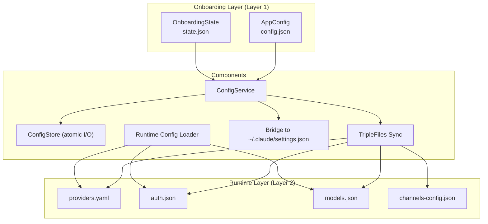
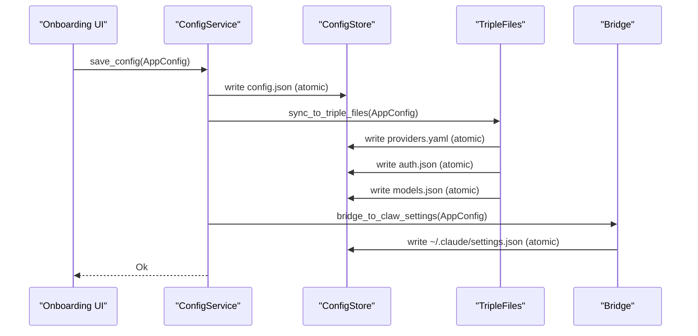
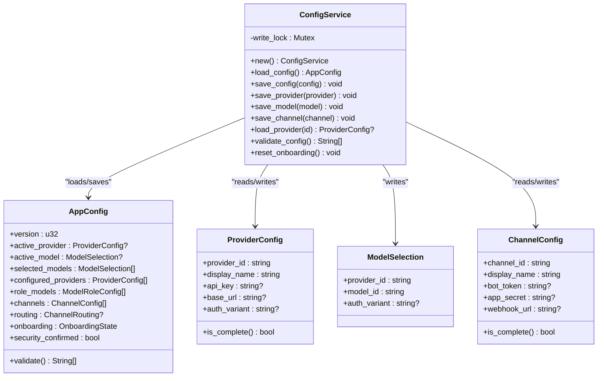
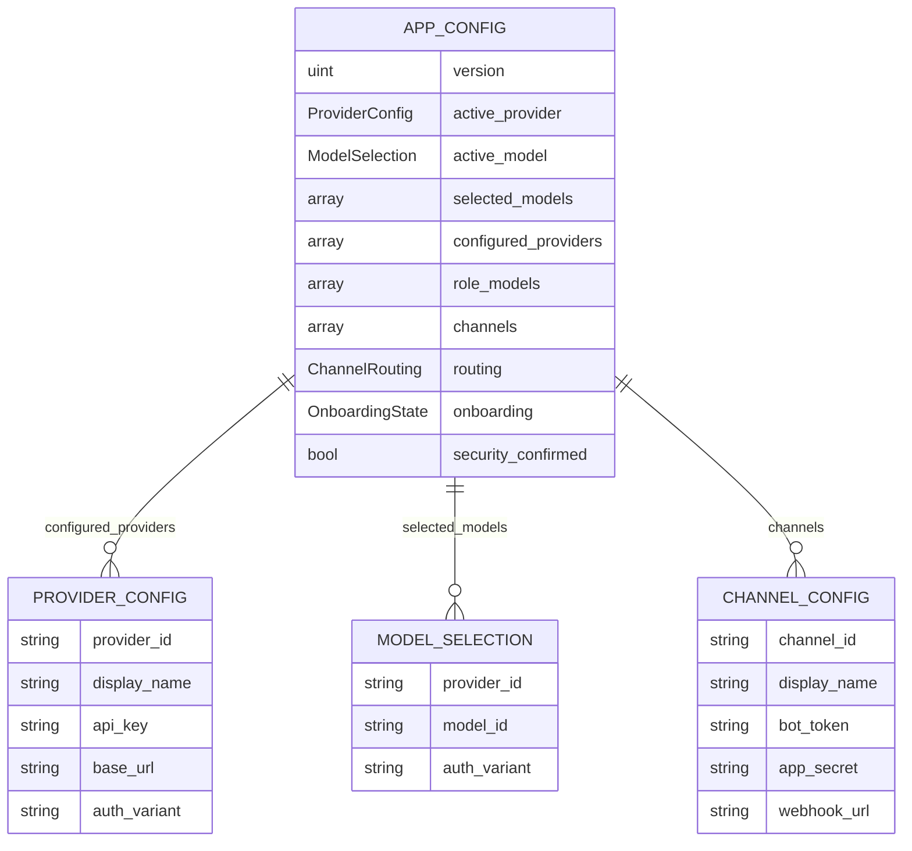
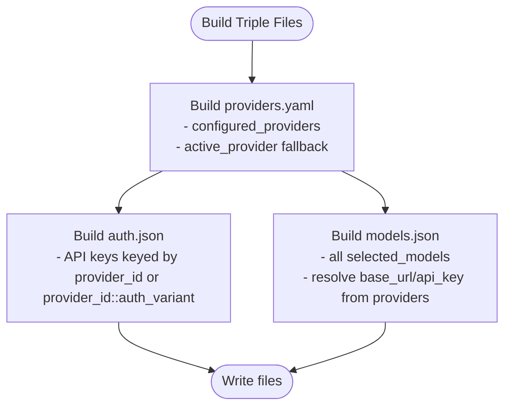
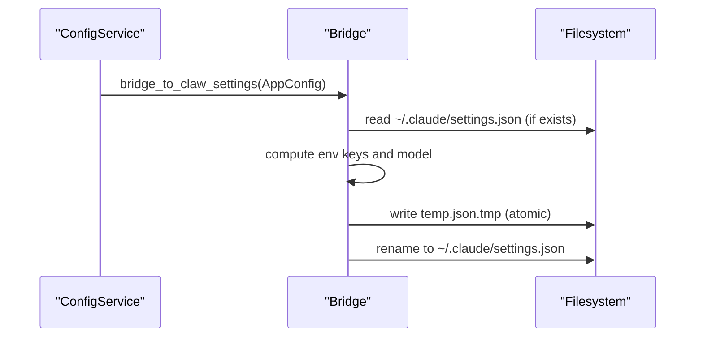
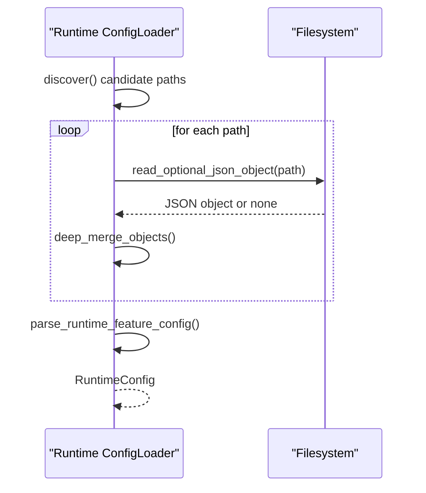
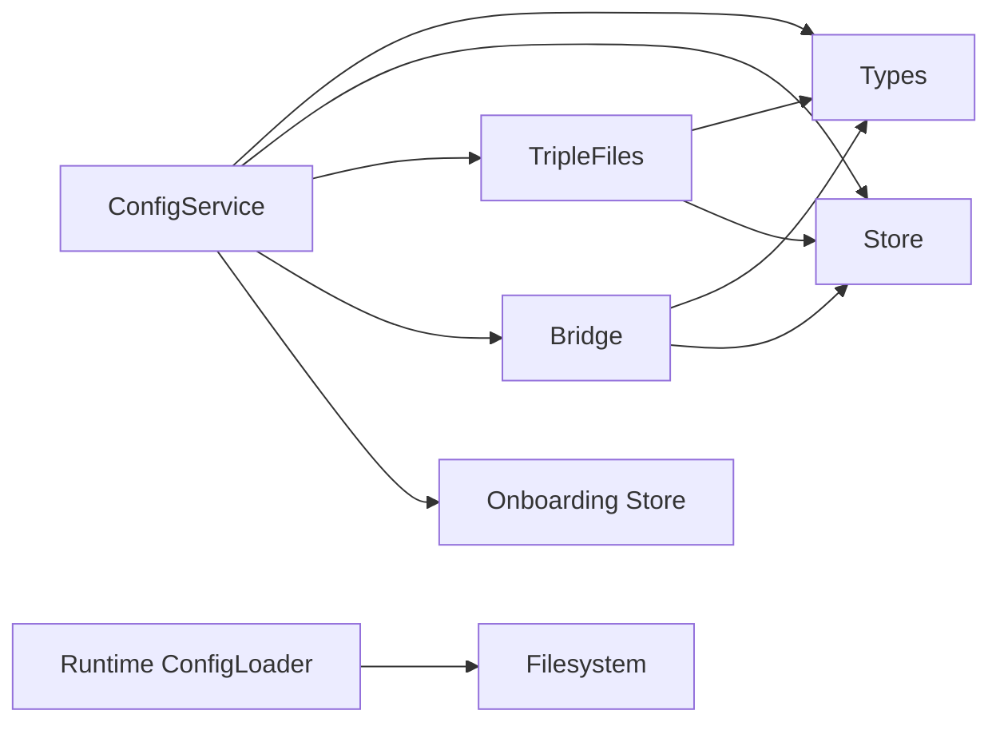

# Configuration Management

<cite>
**Referenced Files in This Document**
- [mod.rs](file://src-tauri/src/modules/config/mod.rs)
- [service.rs](file://src-tauri/src/modules/config/service.rs)
- [types.rs](file://src-tauri/src/modules/config/types.rs)
- [triple_files.rs](file://src-tauri/src/modules/config/triple_files.rs)
- [store.rs](file://src-tauri/src/modules/config/store.rs)
- [bridge.rs](file://src-tauri/src/modules/config/bridge.rs)
- [store.rs (onboarding)](file://src-tauri/src/modules/onboarding/store.rs)
- [config.rs (runtime)](file://rust/crates/runtime/src/config.rs)
</cite>

## Table of Contents
1. [Introduction](#introduction)
2. [Project Structure](#project-structure)
3. [Core Components](#core-components)
4. [Architecture Overview](#architecture-overview)
5. [Detailed Component Analysis](#detailed-component-analysis)
6. [Dependency Analysis](#dependency-analysis)
7. [Performance Considerations](#performance-considerations)
8. [Troubleshooting Guide](#troubleshooting-guide)
9. [Conclusion](#conclusion)

## Introduction
This document describes the configuration management system that powers onboarding and runtime configuration for the application. It explains the dual-mode persistence architecture:
- Shortcut format: a single JSON file for onboarding ease-of-use
- Runtime format: three separate files synchronized from the onboarding configuration for runtime resolution

It documents the ConfigService trait and implementation, configuration types (AppConfig, ProviderConfig, ChannelConfig, ModelSelection), atomic write operations, triple-file synchronization, and configuration bridge patterns. It also covers configuration precedence, error handling, and security considerations for sensitive data.

## Project Structure
The configuration system is organized into a small set of cohesive modules under the Rust Tauri backend:
- Types define the onboarding configuration models
- Store handles file I/O with atomic writes and permissions
- Triple-files converts onboarding config into runtime files
- Bridge maintains compatibility with legacy settings
- Service orchestrates save/load/validation/reset operations
- Onboarding store persists onboarding state separately
- Runtime config loader consumes the runtime files

**Diagram sources**
- [mod.rs:1-33](file://src-tauri/src/modules/config/mod.rs#L1-L33)
- [service.rs:1-484](file://src-tauri/src/modules/config/service.rs#L1-L484)
- [store.rs:1-302](file://src-tauri/src/modules/config/store.rs#L1-L302)
- [triple_files.rs:1-377](file://src-tauri/src/modules/config/triple_files.rs#L1-L377)
- [bridge.rs:1-237](file://src-tauri/src/modules/config/bridge.rs#L1-L237)
- [config.rs (runtime):170-331](file://rust/crates/runtime/src/config.rs#L170-L331)

**Section sources**
- [mod.rs:1-33](file://src-tauri/src/modules/config/mod.rs#L1-L33)

## Core Components
- ConfigService: central orchestrator for loading, saving, validating, resetting, and bridging configuration
- Types: strongly typed models for onboarding and runtime configuration
- Store: atomic file I/O with strict permissions and error modeling
- TripleFiles: conversion from onboarding config to runtime files
- Bridge: compatibility shim to legacy settings
- Onboarding store: separate persistence for onboarding state

Key responsibilities:
- Dual-write: save onboarding config and synchronize runtime files
- Validation: ensure required fields are present and complete
- Migration: upgrade onboarding config on load when version changes
- Security: enforce restrictive file permissions and redact sensitive fields in UI exposure

**Section sources**
- [service.rs:27-319](file://src-tauri/src/modules/config/service.rs#L27-L319)
- [types.rs:21-474](file://src-tauri/src/modules/config/types.rs#L21-L474)
- [store.rs:13-196](file://src-tauri/src/modules/config/store.rs#L13-L196)
- [triple_files.rs:21-184](file://src-tauri/src/modules/config/triple_files.rs#L21-L184)
- [bridge.rs:34-171](file://src-tauri/src/modules/config/bridge.rs#L34-L171)
- [store.rs (onboarding):10-121](file://src-tauri/src/modules/onboarding/store.rs#L10-L121)

## Architecture Overview
The system uses a layered approach:
- Layer 1 (Onboarding): a single JSON file containing the full onboarding configuration
- Layer 2 (Runtime): three files consumed by runtime loaders:
  - providers.yaml: provider definitions and API hints
  - auth.json: API keys (overrides provider definitions)
  - models.json: model registry compatible with external schemas
- Bridge: writes a minimal subset to legacy settings for compatibility

**Diagram sources**
- [service.rs:84-109](file://src-tauri/src/modules/config/service.rs#L84-L109)
- [triple_files.rs:21-36](file://src-tauri/src/modules/config/triple_files.rs#L21-L36)
- [bridge.rs:40-125](file://src-tauri/src/modules/config/bridge.rs#L40-L125)
- [store.rs:74-167](file://src-tauri/src/modules/config/store.rs#L74-L167)

## Detailed Component Analysis

### ConfigService
ConfigService is the central controller for configuration operations. It ensures thread-safe writes via an internal mutex and coordinates between onboarding and runtime layers.

- Load: reads config.json; if missing, constructs from onboarding state; migrates version if needed
- Save: writes config.json, synchronizes triple files, and persists onboarding state
- Provider/Model/Channel operations: targeted writes to maintain separation of concerns
- Validation: aggregates completeness checks across providers, models, channels, and security confirmation
- Reset: deletes onboarding and runtime configuration files

**Diagram sources**
- [service.rs:27-319](file://src-tauri/src/modules/config/service.rs#L27-L319)
- [types.rs:27-217](file://src-tauri/src/modules/config/types.rs#L27-L217)

**Section sources**
- [service.rs:27-319](file://src-tauri/src/modules/config/service.rs#L27-L319)
- [types.rs:27-217](file://src-tauri/src/modules/config/types.rs#L27-L217)

### Types and Models
Core types define the shape of onboarding and runtime configuration:
- AppConfig: top-level onboarding configuration with versioning and validation
- ProviderConfig: per-provider connection details and credentials
- ModelSelection: active provider/model pairing
- ChannelConfig and ChannelRouting: messaging channel settings and routing defaults
- Triple-file models: providers.yaml, auth.json, models.json structures

**Diagram sources**
- [types.rs:273-396](file://src-tauri/src/modules/config/types.rs#L273-L396)

**Section sources**
- [types.rs:21-474](file://src-tauri/src/modules/config/types.rs#L21-L474)

### Triple-File Synchronization
TripleFiles converts AppConfig into three runtime files:
- providers.yaml: accumulates all configured providers; ensures active provider presence
- auth.json: collects API keys keyed by provider_id or provider_id::auth_variant
- models.json: registers all selected models with provider-level connection details

Priority and fallback rules:
- Connection details resolved from configured_providers first, then active_provider fallback
- API type detection inferred from provider_id or base_url heuristics

**Diagram sources**
- [triple_files.rs:21-184](file://src-tauri/src/modules/config/triple_files.rs#L21-L184)

**Section sources**
- [triple_files.rs:21-184](file://src-tauri/src/modules/config/triple_files.rs#L21-L184)

### Atomic Write Operations and Security
All writes are atomic:
- Temporary file with .tmp extension is written and then renamed to the target
- Permissions set to 0600 (owner read/write only) on Unix systems
- Errors are modeled with dedicated error types for I/O, serialization, and deserialization

Security considerations:
- Sensitive fields (e.g., API keys) are stored in auth.json and kept private
- UI exposure redacts sensitive fields in channel configs
- Directory and files restricted to owner-only access

**Section sources**
- [store.rs:74-196](file://src-tauri/src/modules/config/store.rs#L74-L196)
- [store.rs (onboarding):88-121](file://src-tauri/src/modules/onboarding/store.rs#L88-L121)
- [types.rs:189-217](file://src-tauri/src/modules/config/types.rs#L189-L217)

### Bridge Pattern to Legacy Settings
The bridge writes a minimal subset to ~/.claude/settings.json to preserve compatibility with existing consumers:
- Env keys mapped to provider-specific tokens and base URLs
- Model field always set to active model
- Non-destructive: preserves all other fields in the file

**Diagram sources**
- [bridge.rs:40-125](file://src-tauri/src/modules/config/bridge.rs#L40-L125)

**Section sources**
- [bridge.rs:1-237](file://src-tauri/src/modules/config/bridge.rs#L1-L237)

### Runtime Configuration Loading
The runtime loader discovers and merges configuration from multiple sources, including the triple files produced by the onboarding system. It supports a hierarchy of settings locations and deep-merges values.

**Diagram sources**
- [config.rs (runtime):170-260](file://rust/crates/runtime/src/config.rs#L170-L260)

**Section sources**
- [config.rs (runtime):170-331](file://rust/crates/runtime/src/config.rs#L170-L331)

## Dependency Analysis
The configuration system exhibits clean separation of concerns:
- ConfigService depends on Types, Store, TripleFiles, Bridge, and Onboarding store
- TripleFiles depends on Types and Store
- Bridge depends on Types and Store
- Runtime loader depends on filesystem paths and JSON parsing utilities

**Diagram sources**
- [service.rs:16-25](file://src-tauri/src/modules/config/service.rs#L16-L25)
- [triple_files.rs:13-19](file://src-tauri/src/modules/config/triple_files.rs#L13-L19)
- [bridge.rs:26-32](file://src-tauri/src/modules/config/bridge.rs#L26-L32)
- [config.rs (runtime):170-260](file://rust/crates/runtime/src/config.rs#L170-L260)

**Section sources**
- [service.rs:16-25](file://src-tauri/src/modules/config/service.rs#L16-L25)
- [triple_files.rs:13-19](file://src-tauri/src/modules/config/triple_files.rs#L13-L19)
- [bridge.rs:26-32](file://src-tauri/src/modules/config/bridge.rs#L26-L32)
- [config.rs (runtime):170-260](file://rust/crates/runtime/src/config.rs#L170-L260)

## Performance Considerations
- Atomic writes avoid corruption and reduce retries; they are synchronous and safe
- Triple-file sync writes three files; batching is implicit via the single save call
- Validation scans lists of providers, channels, and models; keep lists concise for responsiveness
- Bridge writes are lightweight and non-destructive

## Troubleshooting Guide
Common issues and resolutions:
- Permission errors on Unix: ensure ~/.if2ai directory and files are owned by the user and have 0700/0600 permissions
- Corrupted config.json: remove the file to rebuild from onboarding state
- Missing runtime files: trigger a save to regenerate providers.yaml, auth.json, models.json
- Bridge conflicts: verify ~/.claude/settings.json env keys are not overwritten by other tools
- Validation failures: check that active_provider, active_model, channels, and security confirmation are set

Operational commands (conceptual):
- Reset onboarding: deletes onboarding and runtime configuration files
- Validate configuration: returns a list of issues found

**Section sources**
- [service.rs:275-312](file://src-tauri/src/modules/config/service.rs#L275-L312)
- [service.rs:267-273](file://src-tauri/src/modules/config/service.rs#L267-L273)
- [store.rs:179-196](file://src-tauri/src/modules/config/store.rs#L179-L196)

## Conclusion
The configuration management system provides a robust, secure, and forward-compatible approach to managing onboarding and runtime settings. Its dual-mode persistence simplifies user onboarding while enabling efficient runtime resolution through standardized files. The atomic write operations, explicit validation, and bridge compatibility ensure reliability and interoperability across components.