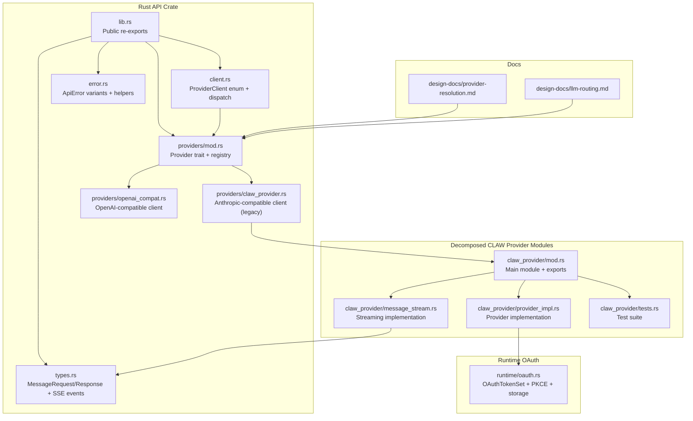
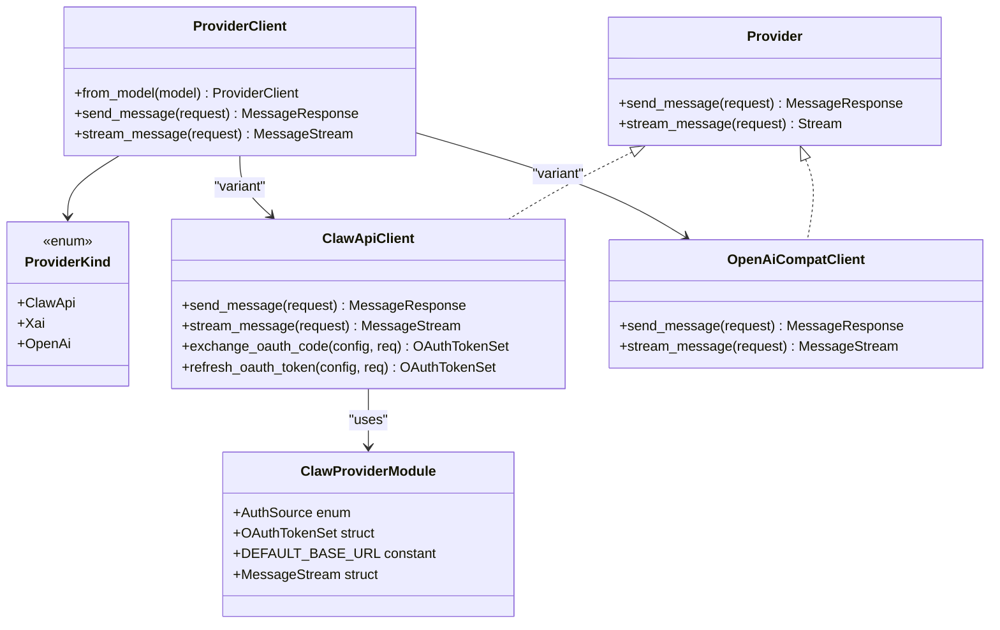
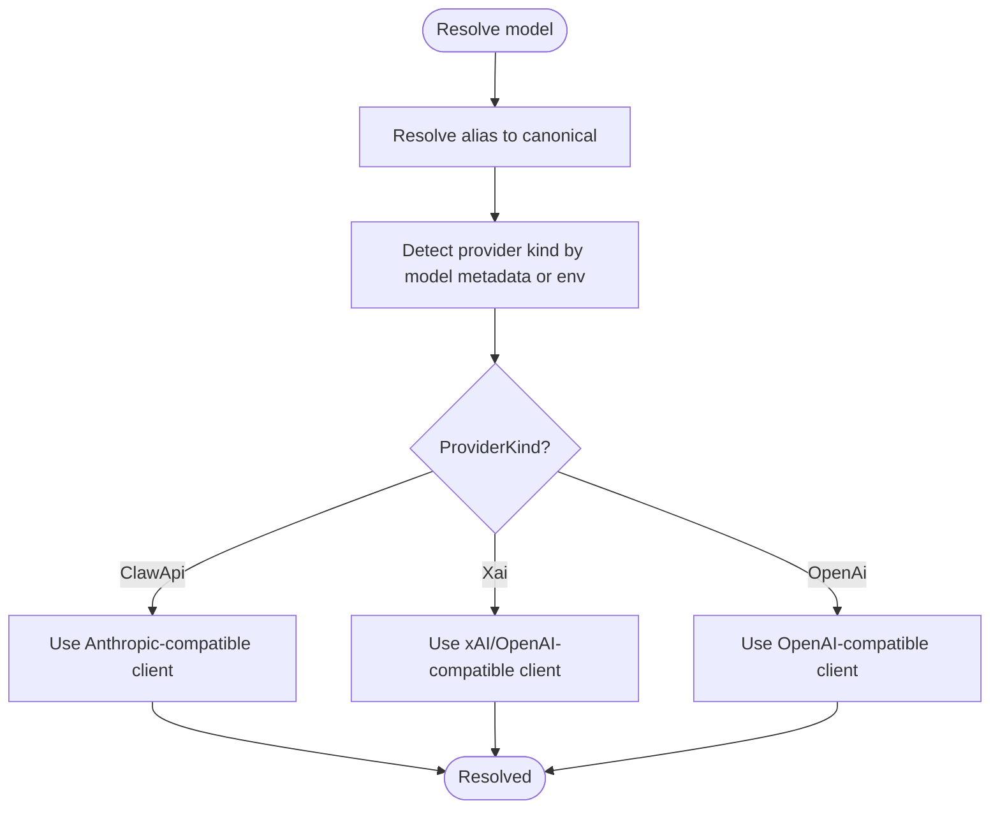
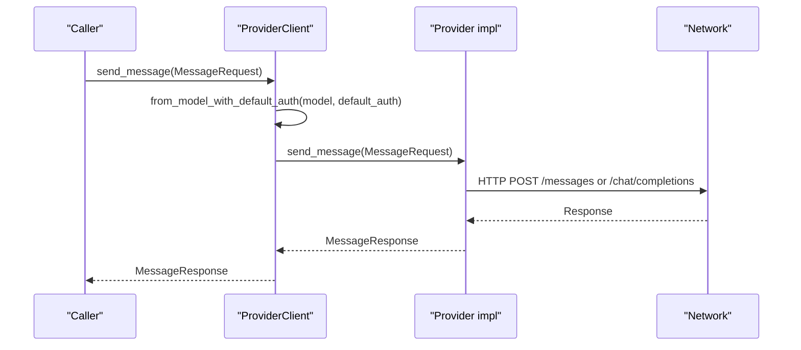
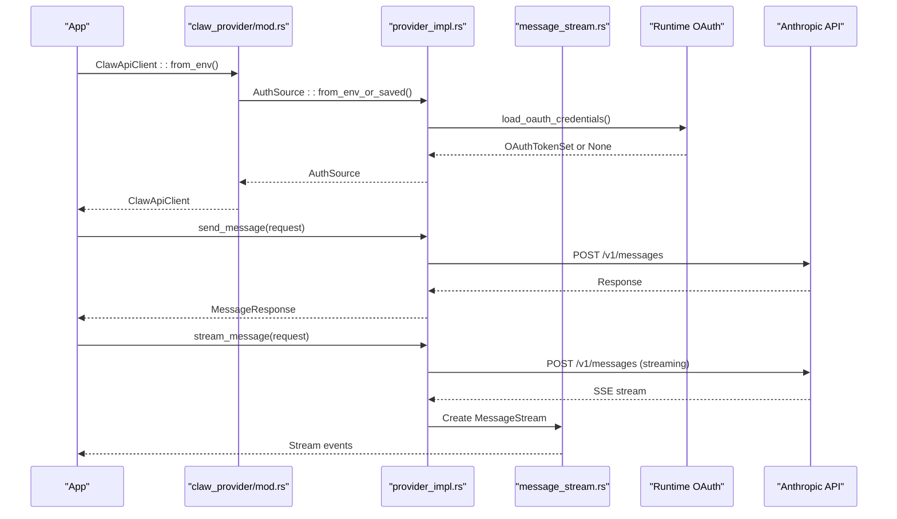
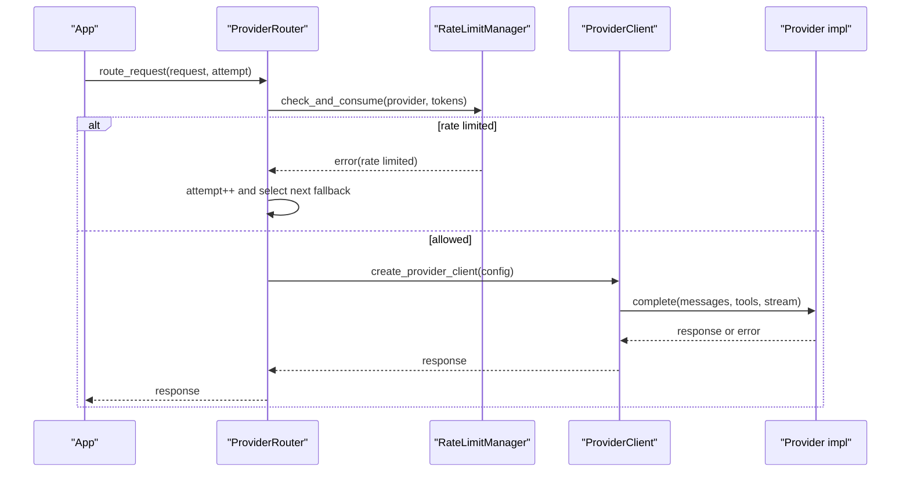
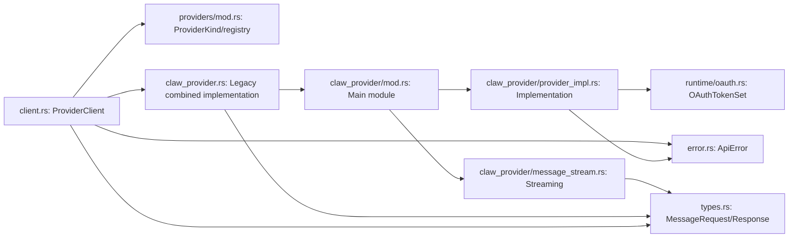

# Provider System

<cite>
**Referenced Files in This Document**
- [lib.rs](file://rust/crates/api/src/lib.rs)
- [client.rs](file://rust/crates/api/src/client.rs)
- [providers/mod.rs](file://rust/crates/api/src/providers/mod.rs)
- [providers/claw_provider.rs](file://rust/crates/api/src/providers/claw_provider.rs)
- [providers/openai_compat.rs](file://rust/crates/api/src/providers/openai_compat.rs)
- [types.rs](file://rust/crates/api/src/types.rs)
- [error.rs](file://rust/crates/api/src/error.rs)
- [oauth.rs](file://rust/crates/runtime/src/oauth.rs)
- [provider-resolution.md](file://docs/design-docs/provider-resolution.md)
- [llm-routing.md](file://docs/design-docs/llm-routing.md)
- [src-tauri/src/modules/api/providers/claw_provider/mod.rs](file://src-tauri/src/modules/api/providers/claw_provider/mod.rs)
- [src-tauri/src/modules/api/providers/claw_provider/provider_impl.rs](file://src-tauri/src/modules/api/providers/claw_provider/provider_impl.rs)
- [src-tauri/src/modules/api/providers/claw_provider/message_stream.rs](file://src-tauri/src/modules/api/providers/claw_provider/message_stream.rs)
- [src-tauri/src/modules/api/providers/claw_provider/tests.rs](file://src-tauri/src/modules/api/providers/claw_provider/tests.rs)
</cite>

## Update Summary
**Changes Made**
- Updated architecture diagrams to reflect CLAW provider system decomposition
- Added documentation for new modular structure with specialized files
- Updated file references to point to decomposed provider implementation
- Enhanced provider client architecture documentation with new modular organization
- Updated dependency analysis to show new file structure

## Table of Contents
1. [Introduction](#introduction)
2. [Project Structure](#project-structure)
3. [Core Components](#core-components)
4. [Architecture Overview](#architecture-overview)
5. [Detailed Component Analysis](#detailed-component-analysis)
6. [Dependency Analysis](#dependency-analysis)
7. [Performance Considerations](#performance-considerations)
8. [Troubleshooting Guide](#troubleshooting-guide)
9. [Conclusion](#conclusion)
10. [Appendices](#appendices)

## Introduction
This document describes the provider system that integrates external AI services (LLMs) in a unified way. It explains the provider client architecture, registry pattern, and service abstraction used to support multiple providers (Anthropic-compatible, OpenAI-compatible, and xAI/Grok). It covers provider types, authentication mechanisms, API client implementations, provider selection, fallback strategies, and rate limiting. It also includes examples for adding new providers, handling provider errors, and implementing provider-specific features, along with testing, validation, and security considerations for API credentials and rate limits.

**Updated** The CLAW provider system has been decomposed into specialized modules for better maintainability and separation of concerns, while preserving all existing functionality.

## Project Structure
The provider system is implemented in the Rust API crate and documented in design documents. The key elements are:
- Unified client and provider traits
- Provider implementations for Anthropic-compatible and OpenAI-compatible APIs
- Shared request/response types and error handling
- OAuth credential storage and refresh logic
- Design documents detailing provider resolution, routing, and fallback strategies

**Updated** The CLAW provider implementation has been modularized into specialized files for better organization and maintainability.

**Diagram sources**
- [lib.rs:1-26](file://rust/crates/api/src/lib.rs#L1-L26)
- [client.rs:1-142](file://rust/crates/api/src/client.rs#L1-L142)
- [providers/mod.rs:1-240](file://rust/crates/api/src/providers/mod.rs#L1-L240)
- [providers/claw_provider.rs:1-1147](file://rust/crates/api/src/providers/claw_provider.rs#L1-L1147)
- [providers/openai_compat.rs:1-800](file://rust/crates/api/src/providers/openai_compat.rs#L1-L800)
- [types.rs:1-224](file://rust/crates/api/src/types.rs#L1-L224)
- [error.rs:1-136](file://rust/crates/api/src/error.rs#L1-L136)
- [oauth.rs:1-590](file://rust/crates/runtime/src/oauth.rs#L1-L590)
- [provider-resolution.md:1-660](file://docs/design-docs/provider-resolution.md#L1-L660)
- [llm-routing.md:135-265](file://docs/design-docs/llm-routing.md#L135-L265)
- [src-tauri/src/modules/api/providers/claw_provider/mod.rs:1-428](file://src-tauri/src/modules/api/providers/claw_provider/mod.rs#L1-L428)
- [src-tauri/src/modules/api/providers/claw_provider/provider_impl.rs:1-299](file://src-tauri/src/modules/api/providers/claw_provider/provider_impl.rs#L1-L299)
- [src-tauri/src/modules/api/providers/claw_provider/message_stream.rs:1-103](file://src-tauri/src/modules/api/providers/claw_provider/message_stream.rs#L1-L103)
- [src-tauri/src/modules/api/providers/claw_provider/tests.rs:1-440](file://src-tauri/src/modules/api/providers/claw_provider/tests.rs#L1-L440)

**Section sources**
- [lib.rs:1-26](file://rust/crates/api/src/lib.rs#L1-L26)
- [client.rs:1-142](file://rust/crates/api/src/client.rs#L1-L142)
- [providers/mod.rs:1-240](file://rust/crates/api/src/providers/mod.rs#L1-L240)
- [provider-resolution.md:1-660](file://docs/design-docs/provider-resolution.md#L1-L660)
- [llm-routing.md:135-265](file://docs/design-docs/llm-routing.md#L135-L265)

## Core Components
- Provider trait: Defines asynchronous send and streaming methods for message requests.
- Provider kinds: Enumerates supported providers (Anthropic/Claudus, OpenAI, xAI/Grok).
- ProviderClient: An enum that encapsulates a specific provider client and dispatches requests accordingly.
- Provider registry: Resolves model aliases, detects provider kind, and maps models to provider metadata.
- Clients:
  - ClawApiClient: Anthropic-compatible client supporting API key and bearer token auth, OAuth refresh, SSE streaming, and retry/backoff.
  - OpenAiCompatClient: OpenAI-compatible client supporting bearer token auth, SSE streaming, and retry/backoff.
- Types: Unified request/response structures and SSE event types for streaming.
- Error: Centralized error types with retryability classification.
- OAuth: Token storage, PKCE generation, and exchange/refresh flows.

**Updated** The CLAW provider implementation has been modularized into separate files for better organization:
- Main module (`mod.rs`) handles exports and public interfaces
- Provider implementation (`provider_impl.rs`) contains core client logic
- Message streaming (`message_stream.rs`) handles SSE streaming functionality
- Tests (`tests.rs`) maintain comprehensive test coverage

**Section sources**
- [providers/mod.rs:12-24](file://rust/crates/api/src/providers/mod.rs#L12-L24)
- [providers/mod.rs:26-31](file://rust/crates/api/src/providers/mod.rs#L26-L31)
- [client.rs:21-26](file://rust/crates/api/src/client.rs#L21-L26)
- [client.rs:28-50](file://rust/crates/api/src/client.rs#L28-L50)
- [providers/claw_provider.rs:112-145](file://rust/crates/api/src/providers/claw_provider.rs#L112-L145)
- [providers/openai_compat.rs:66-74](file://rust/crates/api/src/providers/openai_compat.rs#L66-L74)
- [types.rs:4-25](file://rust/crates/api/src/types.rs#L4-L25)
- [error.rs:5-33](file://rust/crates/api/src/error.rs#L5-L33)
- [oauth.rs:12-18](file://rust/crates/runtime/src/oauth.rs#L12-L18)
- [src-tauri/src/modules/api/providers/claw_provider/mod.rs:1-428](file://src-tauri/src/modules/api/providers/claw_provider/mod.rs#L1-L428)
- [src-tauri/src/modules/api/providers/claw_provider/provider_impl.rs:1-299](file://src-tauri/src/modules/api/providers/claw_provider/provider_impl.rs#L1-L299)
- [src-tauri/src/modules/api/providers/claw_provider/message_stream.rs:1-103](file://src-tauri/src/modules/api/providers/claw_provider/message_stream.rs#L1-L103)
- [src-tauri/src/modules/api/providers/claw_provider/tests.rs:1-440](file://src-tauri/src/modules/api/providers/claw_provider/tests.rs#L1-L440)

## Architecture Overview
The system uses a registry-driven provider selection and a unified client that routes to provider-specific implementations. Authentication is handled per provider, with OAuth support for Anthropic-compatible clients. Streaming responses are normalized into a common event stream.

**Updated** The architecture now reflects the modular decomposition of the CLAW provider system.

**Diagram sources**
- [providers/mod.rs:12-24](file://rust/crates/api/src/providers/mod.rs#L12-L24)
- [providers/mod.rs:26-31](file://rust/crates/api/src/providers/mod.rs#L26-L31)
- [client.rs:21-84](file://rust/crates/api/src/client.rs#L21-L84)
- [providers/claw_provider.rs:606-622](file://rust/crates/api/src/providers/claw_provider.rs#L606-L622)
- [providers/openai_compat.rs:213-229](file://rust/crates/api/src/providers/openai_compat.rs#L213-L229)
- [src-tauri/src/modules/api/providers/claw_provider/mod.rs:44-126](file://src-tauri/src/modules/api/providers/claw_provider/mod.rs#L44-L126)
- [src-tauri/src/modules/api/providers/claw_provider/mod.rs:128-138](file://src-tauri/src/modules/api/providers/claw_provider/mod.rs#L128-L138)

## Detailed Component Analysis

### Provider Registry and Selection
- Model alias resolution normalizes user-friendly names to canonical model identifiers.
- Provider detection prefers model-family mapping, then environment-based detection for Anthropic, OpenAI, and xAI.
- Max token heuristic is derived from the resolved model.

**Diagram sources**
- [providers/mod.rs:143-202](file://rust/crates/api/src/providers/mod.rs#L143-L202)

**Section sources**
- [providers/mod.rs:41-185](file://rust/crates/api/src/providers/mod.rs#L41-L185)
- [providers/mod.rs:204-212](file://rust/crates/api/src/providers/mod.rs#L204-L212)

### ProviderClient Dispatch
- ProviderClient selects the appropriate underlying client based on resolved model and optional default auth.
- It exposes unified send/stream methods that delegate to the chosen provider.

**Diagram sources**
- [client.rs:28-69](file://rust/crates/api/src/client.rs#L28-L69)
- [providers/claw_provider.rs:206-224](file://rust/crates/api/src/providers/claw_provider.rs#L206-L224)
- [providers/openai_compat.rs:118-134](file://rust/crates/api/src/providers/openai_compat.rs#L118-L134)

**Section sources**
- [client.rs:21-84](file://rust/crates/api/src/client.rs#L21-L84)

### Modular CLAW Provider Implementation
**Updated** The CLAW provider system has been decomposed into specialized modules:

#### Main Module (`claw_provider/mod.rs`)
- Contains public exports and module organization
- Defines core types: `AuthSource`, `OAuthTokenSet`, `ClawApiClient`
- Provides constants for default base URL and retry policies
- Exports `MessageStream` for streaming functionality

#### Provider Implementation (`claw_provider/provider_impl.rs`)
- Implements `ClawApiClient` with constructor methods
- Handles authentication source resolution from environment and saved OAuth
- Manages HTTP client configuration with transport policies
- Provides message sending and streaming functionality
- Implements OAuth token exchange and refresh operations
- Contains retry logic with exponential backoff

#### Message Streaming (`claw_provider/message_stream.rs`)
- Implements `MessageStream` struct for handling SSE responses
- Manages chunk reading with timeout controls
- Parses SSE events into unified stream events
- Handles stream completion and error cases

#### Test Suite (`claw_provider/tests.rs`)
- Comprehensive test coverage for all provider functionality
- Tests authentication source resolution
- Validates OAuth token handling and refresh
- Tests streaming functionality and error handling
- Includes Claude settings fallback functionality

**Diagram sources**
- [src-tauri/src/modules/api/providers/claw_provider/mod.rs:153-246](file://src-tauri/src/modules/api/providers/claw_provider/mod.rs#L153-L246)
- [src-tauri/src/modules/api/providers/claw_provider/provider_impl.rs:145-180](file://src-tauri/src/modules/api/providers/claw_provider/provider_impl.rs#L145-L180)
- [src-tauri/src/modules/api/providers/claw_provider/message_stream.rs:15-61](file://src-tauri/src/modules/api/providers/claw_provider/message_stream.rs#L15-L61)

**Section sources**
- [src-tauri/src/modules/api/providers/claw_provider/mod.rs:1-428](file://src-tauri/src/modules/api/providers/claw_provider/mod.rs#L1-L428)
- [src-tauri/src/modules/api/providers/claw_provider/provider_impl.rs:1-299](file://src-tauri/src/modules/api/providers/claw_provider/provider_impl.rs#L1-L299)
- [src-tauri/src/modules/api/providers/claw_provider/message_stream.rs:1-103](file://src-tauri/src/modules/api/providers/claw_provider/message_stream.rs#L1-L103)
- [src-tauri/src/modules/api/providers/claw_provider/tests.rs:1-440](file://src-tauri/src/modules/api/providers/claw_provider/tests.rs#L1-L440)

### OpenAI-Compatible Client (OpenAiCompatClient)
- Authentication: Uses bearer token from environment variable.
- Streaming: Normalizes OpenAI-style SSE chunks into unified stream events and aggregates tool-call deltas.
- Retry/backoff: Similar exponential backoff policy.

**Section sources**
- [providers/openai_compat.rs:66-120](file://rust/crates/api/src/providers/openai_compat.rs#L66-L120)
- [providers/openai_compat.rs:153-211](file://rust/crates/api/src/providers/openai_compat.rs#L153-L211)
- [providers/openai_compat.rs:231-273](file://rust/crates/api/src/providers/openai_compat.rs#L231-L273)

### Types and Events
- MessageRequest/Response unify roles, content blocks, tool definitions, and usage.
- StreamEvent hierarchy captures message lifecycle and content block deltas.

**Section sources**
- [types.rs:4-224](file://rust/crates/api/src/types.rs#L4-L224)

### Error Handling
- Centralized ApiError with retryability classification.
- Recognizes retryable HTTP and API statuses; surfaces backoff overflow and retry exhaustion.

**Section sources**
- [error.rs:5-60](file://rust/crates/api/src/error.rs#L5-L60)
- [providers/claw_provider.rs:666-691](file://rust/crates/api/src/providers/claw_provider.rs#L666-L691)
- [providers/openai_compat.rs:153-182](file://rust/crates/api/src/providers/openai_compat.rs#L153-L182)

### Routing, Fallback, and Rate Limiting (Design)
- ProviderRouter maintains a primary provider and a fallback chain, probing providers and switching on demand.
- RateLimitManager tracks requests and token consumption per provider, applying backoff on retryable failures.

**Diagram sources**
- [llm-routing.md:135-201](file://docs/design-docs/llm-routing.md#L135-L201)
- [llm-routing.md:207-265](file://docs/design-docs/llm-routing.md#L207-L265)

**Section sources**
- [llm-routing.md:135-265](file://docs/design-docs/llm-routing.md#L135-L265)

## Dependency Analysis
- ProviderClient depends on Provider trait implementations and provider registry for selection.
- Provider implementations depend on shared types and error types.
- Anthropic-compatible client integrates with runtime OAuth for token exchange and refresh.
- Design documents define higher-level routing and rate limiting abstractions.

**Updated** Dependencies now reflect the modular structure with specialized provider implementation files.

**Diagram sources**
- [client.rs:21-84](file://rust/crates/api/src/client.rs#L21-L84)
- [providers/mod.rs:12-31](file://rust/crates/api/src/providers/mod.rs#L12-L31)
- [providers/claw_provider.rs:112-145](file://rust/crates/api/src/providers/claw_provider.rs#L112-L145)
- [providers/openai_compat.rs:66-74](file://rust/crates/api/src/providers/openai_compat.rs#L66-L74)
- [types.rs:4-25](file://rust/crates/api/src/types.rs#L4-L25)
- [error.rs:5-33](file://rust/crates/api/src/error.rs#L5-L33)
- [oauth.rs:12-18](file://rust/crates/runtime/src/oauth.rs#L12-L18)
- [src-tauri/src/modules/api/providers/claw_provider/mod.rs:1-428](file://src-tauri/src/modules/api/providers/claw_provider/mod.rs#L1-L428)
- [src-tauri/src/modules/api/providers/claw_provider/provider_impl.rs:1-299](file://src-tauri/src/modules/api/providers/claw_provider/provider_impl.rs#L1-L299)
- [src-tauri/src/modules/api/providers/claw_provider/message_stream.rs:1-103](file://src-tauri/src/modules/api/providers/claw_provider/message_stream.rs#L1-L103)

**Section sources**
- [client.rs:1-142](file://rust/crates/api/src/client.rs#L1-L142)
- [providers/mod.rs:1-240](file://rust/crates/api/src/providers/mod.rs#L1-L240)

## Performance Considerations
- Exponential backoff reduces thundering herd and respects provider throttling.
- Streaming minimizes latency by emitting incremental events.
- Retry policy caps prevent runaway resource usage.
- Rate limiting (design) prevents overload and ensures fair usage across providers.

## Troubleshooting Guide
Common scenarios and remedies:
- Missing credentials: Ensure environment variables for the selected provider are set; the system reports missing credentials with suggested variables.
- Expired OAuth token: Refresh tokens are required; otherwise, re-authenticate.
- Retryable failures: Inspect ApiError classification; the system automatically retries on retryable conditions up to configured limits.
- Streaming issues: Verify SSE parsing and that the provider supports streaming.

**Section sources**
- [error.rs:35-60](file://rust/crates/api/src/error.rs#L35-L60)
- [providers/claw_provider.rs:362-441](file://rust/crates/api/src/providers/claw_provider.rs#L362-L441)
- [providers/claw_provider.rs:666-691](file://rust/crates/api/src/providers/claw_provider.rs#L666-L691)

## Conclusion
The provider system offers a clean, extensible abstraction over multiple AI service providers. It centralizes authentication, streaming, and error handling while enabling provider selection, fallback strategies, and rate limiting. The design documents outline advanced routing and rate limiting plans, and the existing implementation provides robust client behavior for Anthropic-compatible and OpenAI-compatible APIs.

**Updated** The recent decomposition of the CLAW provider system into specialized modules enhances maintainability and code organization while preserving all existing functionality and OAuth streaming capabilities.

## Appendices

### Adding a New Provider
Steps to integrate a new provider:
- Define a new client struct implementing the Provider trait with send_message and stream_message.
- Add a variant to ProviderKind and ProviderClient enum.
- Extend provider selection logic to detect the new provider (model-based or environment-based).
- Integrate authentication and base URL resolution.
- Wire retry/backoff and streaming normalization.
- Add tests validating selection, authentication, and streaming.

**Section sources**
- [providers/mod.rs:12-24](file://rust/crates/api/src/providers/mod.rs#L12-L24)
- [client.rs:21-26](file://rust/crates/api/src/client.rs#L21-L26)
- [client.rs:28-50](file://rust/crates/api/src/client.rs#L28-L50)

### Provider-Specific Features
- Anthropic-compatible features include API key and bearer token auth, OAuth refresh, and SSE streaming.
- OpenAI-compatible features include bearer token auth, SSE streaming, and tool-call delta aggregation.

**Updated** The CLAW provider system now offers enhanced modularity with specialized components for better maintainability and testing.

**Section sources**
- [providers/claw_provider.rs:28-95](file://rust/crates/api/src/providers/claw_provider.rs#L28-L95)
- [providers/openai_compat.rs:66-120](file://rust/crates/api/src/providers/openai_compat.rs#L66-L120)
- [providers/openai_compat.rs:231-273](file://rust/crates/api/src/providers/openai_compat.rs#L231-L273)
- [src-tauri/src/modules/api/providers/claw_provider/mod.rs:44-126](file://src-tauri/src/modules/api/providers/claw_provider/mod.rs#L44-L126)

### Testing and Validation
- Unit tests exercise provider selection, alias resolution, and environment-based detection.
- OAuth integration tests cover token exchange and refresh flows.
- Provider routing and rate limiting are described in design documents with structured test approaches.

**Updated** The decomposed provider system maintains comprehensive test coverage across all modules.

**Section sources**
- [providers/mod.rs:214-239](file://rust/crates/api/src/providers/mod.rs#L214-L239)
- [providers/claw_provider.rs:705-800](file://rust/crates/api/src/providers/claw_provider.rs#L705-L800)
- [provider-resolution.md:621-646](file://docs/design-docs/provider-resolution.md#L621-L646)
- [src-tauri/src/modules/api/providers/claw_provider/tests.rs:1-440](file://src-tauri/src/modules/api/providers/claw_provider/tests.rs#L1-L440)

### Security Considerations
- Store OAuth tokens securely and refresh when possible; avoid embedding long-lived secrets.
- Prefer environment variables for API keys; mask sensitive headers in logs.
- Validate provider base URLs and enforce HTTPS where applicable.
- Limit exposure of internal provider IDs and configuration in UI.

**Section sources**
- [oauth.rs:262-292](file://rust/crates/runtime/src/oauth.rs#L262-L292)
- [providers/claw_provider.rs:76-95](file://rust/crates/api/src/providers/claw_provider.rs#L76-L95)
- [provider-resolution.md:567-589](file://docs/design-docs/provider-resolution.md#L567-L589)
- [src-tauri/src/modules/api/providers/claw_provider/mod.rs:153-246](file://src-tauri/src/modules/api/providers/claw_provider/mod.rs#L153-L246)

### Modular Architecture Benefits
**New Section** The decomposition of the CLAW provider system into specialized modules provides several benefits:

- **Separation of Concerns**: Each module has a single responsibility - implementation, streaming, or testing
- **Improved Maintainability**: Changes to one aspect don't affect others
- **Better Test Coverage**: Dedicated test module allows comprehensive testing
- **Enhanced Readability**: Clear module boundaries make code easier to understand
- **Reusability**: Components can be imported independently when needed

**Section sources**
- [src-tauri/src/modules/api/providers/claw_provider/mod.rs:1-428](file://src-tauri/src/modules/api/providers/claw_provider/mod.rs#L1-L428)
- [src-tauri/src/modules/api/providers/claw_provider/provider_impl.rs:1-299](file://src-tauri/src/modules/api/providers/claw_provider/provider_impl.rs#L1-L299)
- [src-tauri/src/modules/api/providers/claw_provider/message_stream.rs:1-103](file://src-tauri/src/modules/api/providers/claw_provider/message_stream.rs#L1-L103)
- [src-tauri/src/modules/api/providers/claw_provider/tests.rs:1-440](file://src-tauri/src/modules/api/providers/claw_provider/tests.rs#L1-L440)