# Security Controls

<cite>
**Referenced Files in This Document**
- [mod.rs](file://src-tauri/src/modules/security/mod.rs)
- [access.rs](file://src-tauri/src/modules/security/access.rs)
- [atomic_write.rs](file://src-tauri/src/modules/security/atomic_write.rs)
- [path.rs](file://src-tauri/src/modules/security/path.rs)
- [validation.rs](file://src-tauri/src/modules/security/validation.rs)
- [02-implementation.md](file://docs/final_design/security/02-implementation.md)
- [ADR-006-Security-Design.md](file://docs/design-docs/postCLI/ADR/ADR-006-Security-Design.md)
- [permissions.rs](file://rust/crates/runtime/src/permissions.rs)
- [sandbox.rs](file://rust/crates/runtime/src/sandbox.rs)
- [mod.rs](file://src-tauri/src/modules/skills/guard/mod.rs)
- [types.ts](file://src/modules/skills/types.ts)
- [SkillSecurityReport.tsx](file://src/modules/skills/SkillSecurityReport.tsx)
- [security_integration.rs](file://src-tauri/tests/security_integration.rs)
- [mod.rs](file://src-tauri/src/modules/memory/mod.rs)
</cite>

## Table of Contents
1. [Introduction](#introduction)
2. [Project Structure](#project-structure)
3. [Core Components](#core-components)
4. [Architecture Overview](#architecture-overview)
5. [Detailed Component Analysis](#detailed-component-analysis)
6. [Dependency Analysis](#dependency-analysis)
7. [Performance Considerations](#performance-considerations)
8. [Troubleshooting Guide](#troubleshooting-guide)
9. [Conclusion](#conclusion)
10. [Appendices](#appendices)

## Introduction
This document explains the security control systems protecting the application. It covers access control mechanisms, path validation strategies, atomic write operations, security policies, threat detection, and validation rules. It also documents file system security, credential protection, secure deletion patterns, examples of implementing custom security checks, handling security violations, and maintaining audit trails. Finally, it outlines best practices, vulnerability mitigation, and compliance considerations.

## Project Structure
Security is implemented across multiple layers:
- A dedicated security module with path validation, input validation, access control, and atomic write primitives.
- Runtime permission enforcement and sandboxing for file system isolation.
- A SkillsGuard threat scanner for static and runtime command scanning, integrated with UI reporting.
- Memory subsystem with scoped visibility and security hooks.
- Integration tests validating boundary checks, atomicity, and policy enforcement.

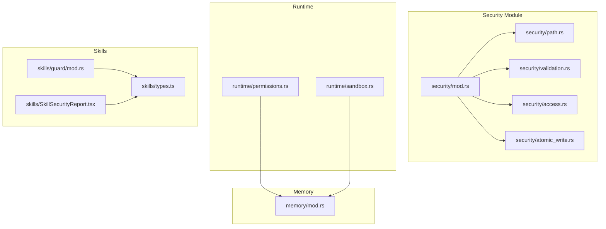

**Diagram sources**
- [mod.rs:1-25](file://src-tauri/src/modules/security/mod.rs#L1-L25)
- [path.rs:1-145](file://src-tauri/src/modules/security/path.rs#L1-L145)
- [validation.rs:1-142](file://src-tauri/src/modules/security/validation.rs#L1-L142)
- [access.rs:1-104](file://src-tauri/src/modules/security/access.rs#L1-L104)
- [atomic_write.rs:1-122](file://src-tauri/src/modules/security/atomic_write.rs#L1-L122)
- [permissions.rs:1-233](file://rust/crates/runtime/src/permissions.rs#L1-L233)
- [sandbox.rs:1-365](file://rust/crates/runtime/src/sandbox.rs#L1-L365)
- [mod.rs:1-800](file://src-tauri/src/modules/skills/guard/mod.rs#L1-L800)
- [types.ts:1-157](file://src/modules/skills/types.ts#L1-L157)
- [SkillSecurityReport.tsx:1-188](file://src/modules/skills/SkillSecurityReport.tsx#L1-L188)
- [mod.rs:1-517](file://src-tauri/src/modules/memory/mod.rs#L1-L517)

**Section sources**
- [mod.rs:1-25](file://src-tauri/src/modules/security/mod.rs#L1-L25)
- [02-implementation.md:1-62](file://docs/final_design/security/02-implementation.md#L1-L62)

## Core Components
- Path validation prevents traversal attacks by canonicalizing base and requested paths, rejecting escapes, and enforcing containment within allowed directories.
- Input validation enforces key constraints and content limits, detecting injection patterns to mitigate XSS and template injection.
- Access control uses category-based permissions with session/project contexts to restrict reads/writes.
- Atomic writes ensure crash-safe file operations using temporary files, sync, and atomic rename.
- Runtime permission policy enforces escalation rules and interactive prompts for sensitive actions.
- Sandbox configuration and detection provide filesystem isolation modes and environment awareness.
- SkillsGuard performs static and runtime threat scanning with trust-aware policies and UI reporting.
- Memory subsystem integrates security checks and scope-based visibility.

**Section sources**
- [path.rs:1-145](file://src-tauri/src/modules/security/path.rs#L1-L145)
- [validation.rs:1-142](file://src-tauri/src/modules/security/validation.rs#L1-L142)
- [access.rs:1-104](file://src-tauri/src/modules/security/access.rs#L1-L104)
- [atomic_write.rs:1-122](file://src-tauri/src/modules/security/atomic_write.rs#L1-L122)
- [permissions.rs:1-233](file://rust/crates/runtime/src/permissions.rs#L1-L233)
- [sandbox.rs:1-365](file://rust/crates/runtime/src/sandbox.rs#L1-L365)
- [mod.rs:1-800](file://src-tauri/src/modules/skills/guard/mod.rs#L1-L800)
- [types.ts:1-157](file://src/modules/skills/types.ts#L1-L157)
- [SkillSecurityReport.tsx:1-188](file://src/modules/skills/SkillSecurityReport.tsx#L1-L188)
- [mod.rs:1-517](file://src-tauri/src/modules/memory/mod.rs#L1-L517)

## Architecture Overview
The security architecture layers input validation, path checks, access control, and atomic writes before any persistent state change. Threat scanning is integrated into skills installation and runtime command execution. Permissions and sandboxing provide additional runtime safeguards.

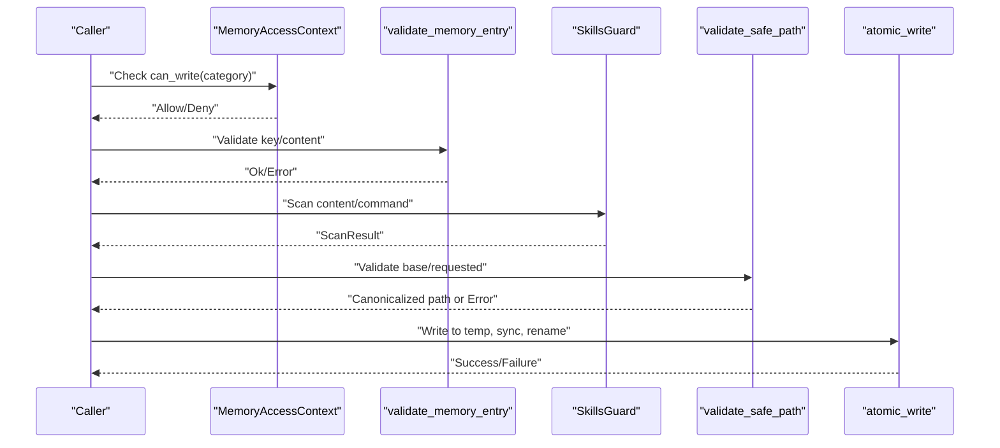

**Diagram sources**
- [access.rs:16-58](file://src-tauri/src/modules/security/access.rs#L16-L58)
- [validation.rs:6-34](file://src-tauri/src/modules/security/validation.rs#L6-L34)
- [mod.rs:115-183](file://src-tauri/src/modules/skills/guard/mod.rs#L115-L183)
- [path.rs:10-78](file://src-tauri/src/modules/security/path.rs#L10-L78)
- [atomic_write.rs:16-45](file://src-tauri/src/modules/security/atomic_write.rs#L16-L45)

**Section sources**
- [02-implementation.md:41-62](file://docs/final_design/security/02-implementation.md#L41-L62)
- [ADR-006-Security-Design.md:100-144](file://docs/design-docs/postCLI/ADR/ADR-006-Security-Design.md#L100-L144)

## Detailed Component Analysis

### Path Validation
- Two-phase validation:
  - Exists case: canonicalize base and full path; ensure full canonical starts with base canonical.
  - Missing leaf case: walk up to nearest existing ancestor, canonicalize, then traverse remaining components, checking containment after each step.
- Enforces base directory boundaries and rejects attempts to escape with parent directory components.

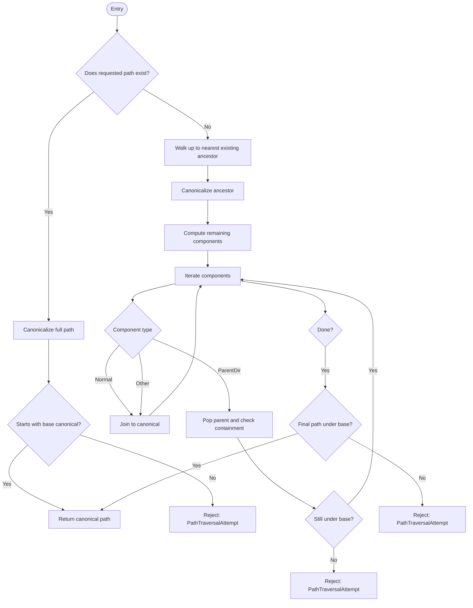

**Diagram sources**
- [path.rs:10-78](file://src-tauri/src/modules/security/path.rs#L10-L78)

**Section sources**
- [path.rs:1-145](file://src-tauri/src/modules/security/path.rs#L1-L145)
- [02-implementation.md:129-151](file://docs/final_design/security/02-implementation.md#L129-L151)

### Input Validation and Injection Detection
- Key constraints: non-empty, length limit, allowed characters.
- Content constraints: size cap and injection pattern detection (e.g., script tags, template expressions, data URLs).
- Returns structured errors for downstream handling.

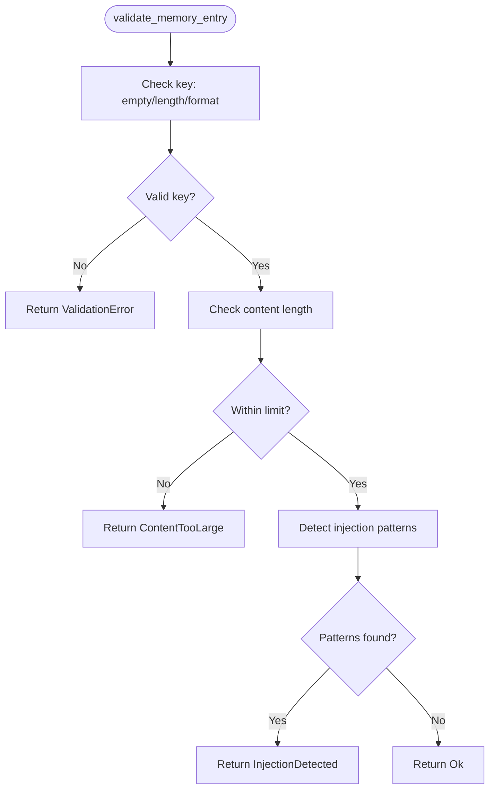

**Diagram sources**
- [validation.rs:6-34](file://src-tauri/src/modules/security/validation.rs#L6-L34)

**Section sources**
- [validation.rs:1-142](file://src-tauri/src/modules/security/validation.rs#L1-L142)
- [02-implementation.md:127-128](file://docs/final_design/security/02-implementation.md#L127-L128)

### Access Control (Category-Based Permissions)
- Contexts:
  - Session context: read Daily + Conversation; write Conversation.
  - Project context: read/write Core, Daily, Conversation, and a custom project category.
- Checks: can_read and can_write against MemoryCategory.

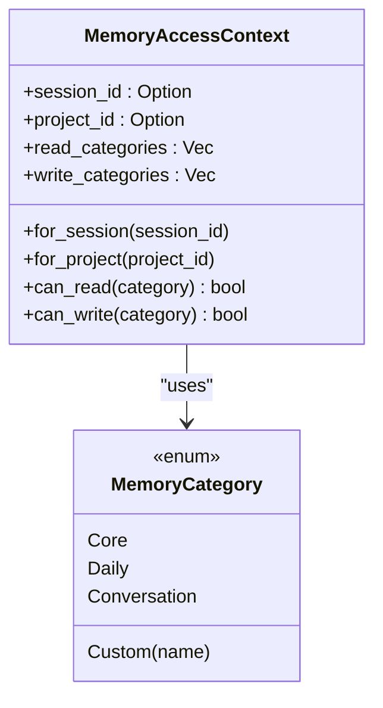

**Diagram sources**
- [access.rs:8-58](file://src-tauri/src/modules/security/access.rs#L8-L58)

**Section sources**
- [access.rs:1-104](file://src-tauri/src/modules/security/access.rs#L1-L104)
- [02-implementation.md:64-126](file://docs/final_design/security/02-implementation.md#L64-L126)

### Atomic Writes (Crash-Safe File Operations)
- Procedure:
  - Write to a temporary file with extension.
  - Sync to disk.
  - Atomically rename to target path.
- Guarantees atomicity, durability, and consistency.

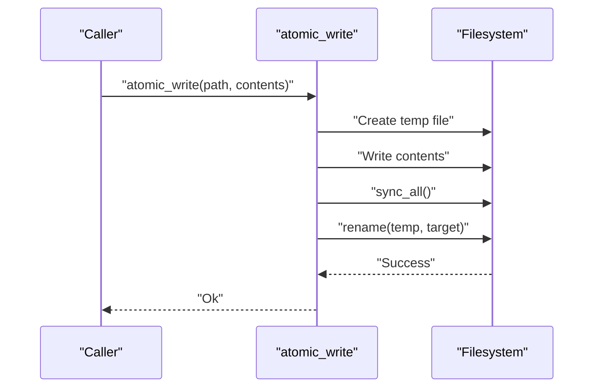

**Diagram sources**
- [atomic_write.rs:16-45](file://src-tauri/src/modules/security/atomic_write.rs#L16-L45)

**Section sources**
- [atomic_write.rs:1-122](file://src-tauri/src/modules/security/atomic_write.rs#L1-L122)
- [ADR-006-Security-Design.md:100-144](file://docs/design-docs/postCLI/ADR/ADR-006-Security-Design.md#L100-L144)
- [02-implementation.md:153-184](file://docs/final_design/security/02-implementation.md#L153-L184)

### Runtime Permission Policy
- Defines permission modes and escalation rules.
- Determines whether a tool can run based on active mode and required mode, with optional interactive prompts for risky escalations.

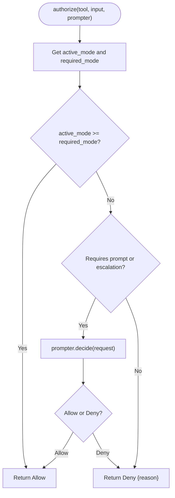

**Diagram sources**
- [permissions.rs:89-134](file://rust/crates/runtime/src/permissions.rs#L89-L134)

**Section sources**
- [permissions.rs:1-233](file://rust/crates/runtime/src/permissions.rs#L1-L233)
- [security_integration.rs:116-140](file://src-tauri/tests/security_integration.rs#L116-L140)

### Sandbox and Filesystem Isolation
- Detects container environments and supports namespace/network isolation on Linux.
- Resolves effective sandbox status and can construct a launcher command for unshared execution with controlled mounts and environment.

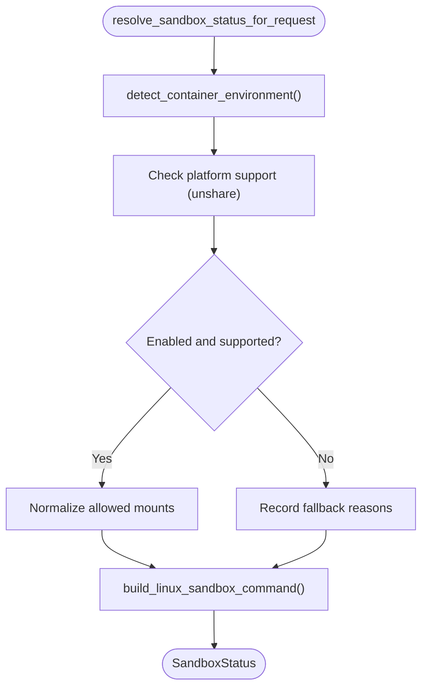

**Diagram sources**
- [sandbox.rs:156-262](file://rust/crates/runtime/src/sandbox.rs#L156-L262)

**Section sources**
- [sandbox.rs:1-365](file://rust/crates/runtime/src/sandbox.rs#L1-L365)

### Threat Detection and SkillsGuard
- Scans skills for structural anomalies, regex-based threat patterns, and invisible Unicode.
- Computes a trust-aware verdict and policy decision for installation.
- Provides runtime command scanning and a formatted report for UI rendering.

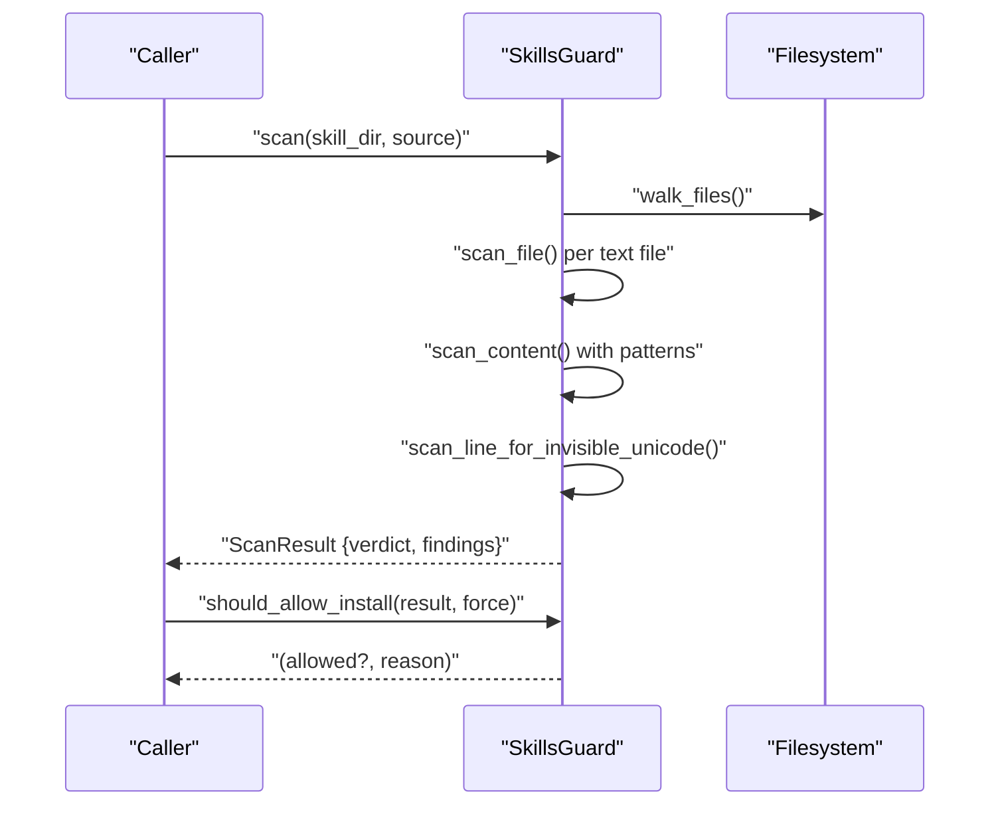

**Diagram sources**
- [mod.rs:115-183](file://src-tauri/src/modules/skills/guard/mod.rs#L115-L183)
- [mod.rs:185-247](file://src-tauri/src/modules/skills/guard/mod.rs#L185-L247)

**Section sources**
- [mod.rs:1-800](file://src-tauri/src/modules/skills/guard/mod.rs#L1-L800)
- [types.ts:1-157](file://src/modules/skills/types.ts#L1-L157)
- [SkillSecurityReport.tsx:1-188](file://src/modules/skills/SkillSecurityReport.tsx#L1-L188)
- [02-implementation.md:186-219](file://docs/final_design/security/02-implementation.md#L186-L219)

### Memory Security Hooks and Scope Visibility
- Memory subsystem defines categories and scope visibility rules.
- Security module primitives integrate with memory operations to enforce validation, access control, and atomic writes.

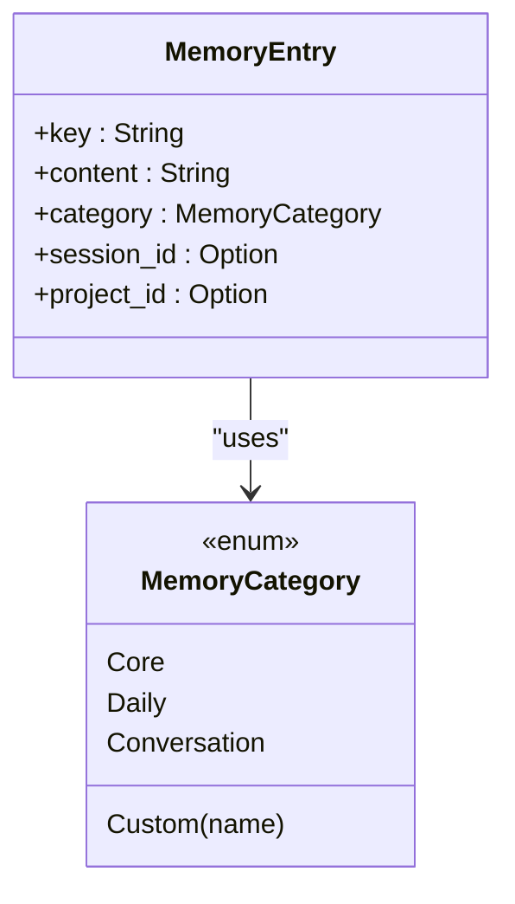

**Diagram sources**
- [mod.rs:96-140](file://src-tauri/src/modules/memory/mod.rs#L96-L140)

**Section sources**
- [mod.rs:1-517](file://src-tauri/src/modules/memory/mod.rs#L1-L517)
- [mod.rs:1-25](file://src-tauri/src/modules/security/mod.rs#L1-L25)

## Dependency Analysis
- Security module is a foundational layer consumed by memory, skills, and other modules.
- Runtime permission policy and sandboxing are orthogonal layers that complement file system and execution safety.
- SkillsGuard depends on threat pattern definitions and integrates with UI types for reporting.

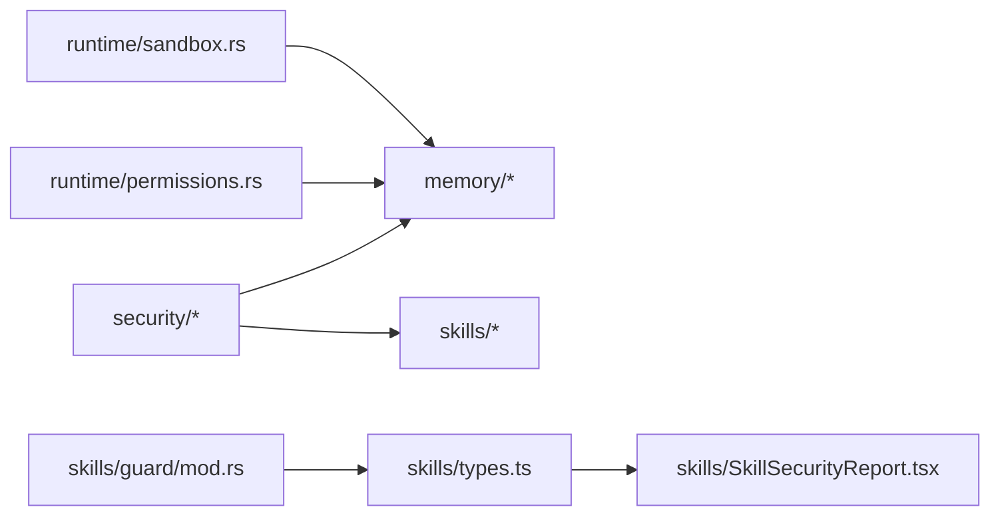

**Diagram sources**
- [mod.rs:12-25](file://src-tauri/src/modules/security/mod.rs#L12-L25)
- [permissions.rs:1-233](file://rust/crates/runtime/src/permissions.rs#L1-L233)
- [sandbox.rs:1-365](file://rust/crates/runtime/src/sandbox.rs#L1-L365)
- [mod.rs:1-800](file://src-tauri/src/modules/skills/guard/mod.rs#L1-L800)
- [types.ts:1-157](file://src/modules/skills/types.ts#L1-L157)
- [SkillSecurityReport.tsx:1-188](file://src/modules/skills/SkillSecurityReport.tsx#L1-L188)

**Section sources**
- [02-implementation.md:5-39](file://docs/final_design/security/02-implementation.md#L5-L39)

## Performance Considerations
- Path validation performs canonicalization and component-wise traversal; keep base directories minimal and avoid deep nesting to reduce overhead.
- Atomic writes incur a sync cost; batch operations where feasible and avoid unnecessary renames.
- Threat scanning iterates files and applies regex patterns; exclude non-text files and limit scanning scope for large skills.
- Permission checks are constant-time lookups; cache policy decisions when evaluating many tools in sequence.

## Troubleshooting Guide
Common issues and resolutions:
- Path traversal attempts: Ensure all paths are validated against a canonicalized base directory and reject any escape sequences.
- Injection violations: Review content for suspicious patterns and adjust validation rules if legitimate content is flagged.
- Permission denials: Verify active mode and tool requirements; use interactive prompts for risky escalations.
- Atomic write failures: Confirm filesystem permissions, disk availability, and absence of concurrent writers.
- SkillsGuard blocking: Adjust trust level or address findings; use force only when necessary and understood.

**Section sources**
- [path.rs:92-106](file://src-tauri/src/modules/security/path.rs#L92-L106)
- [validation.rs:51-68](file://src-tauri/src/modules/security/validation.rs#L51-L68)
- [permissions.rs:89-134](file://rust/crates/runtime/src/permissions.rs#L89-L134)
- [atomic_write.rs:57-65](file://src-tauri/src/modules/security/atomic_write.rs#L57-L65)
- [mod.rs:341-356](file://src-tauri/src/modules/skills/guard/mod.rs#L341-L356)

## Conclusion
The application employs a layered security model: strict path validation, input sanitization, category-based access control, atomic writes, runtime permission policy, sandboxing, and comprehensive threat detection. These controls collectively mitigate common vulnerabilities, protect sensitive data, and maintain auditability and compliance readiness.

## Appendices

### Secure Deletion Patterns
- Prefer atomic writes for updates to avoid partial states.
- For deletion, use scoped visibility and clear-all operations where appropriate; ensure audit logs record deletions.
- Use sandboxed execution for destructive operations and enforce permission escalation policies.

### Implementing Custom Security Checks
- Extend input validation with additional constraints tailored to your domain.
- Add new threat patterns to the SkillsGuard registry and define trust-aware policies.
- Integrate boundary checks early in file operations and centralize error handling.

### Maintaining Audit Trails
- Log security decisions, validation failures, and policy outcomes.
- Track memory scope promotions/demotions and sensitive operations.
- Preserve immutable scan reports and content hashes for integrity verification.