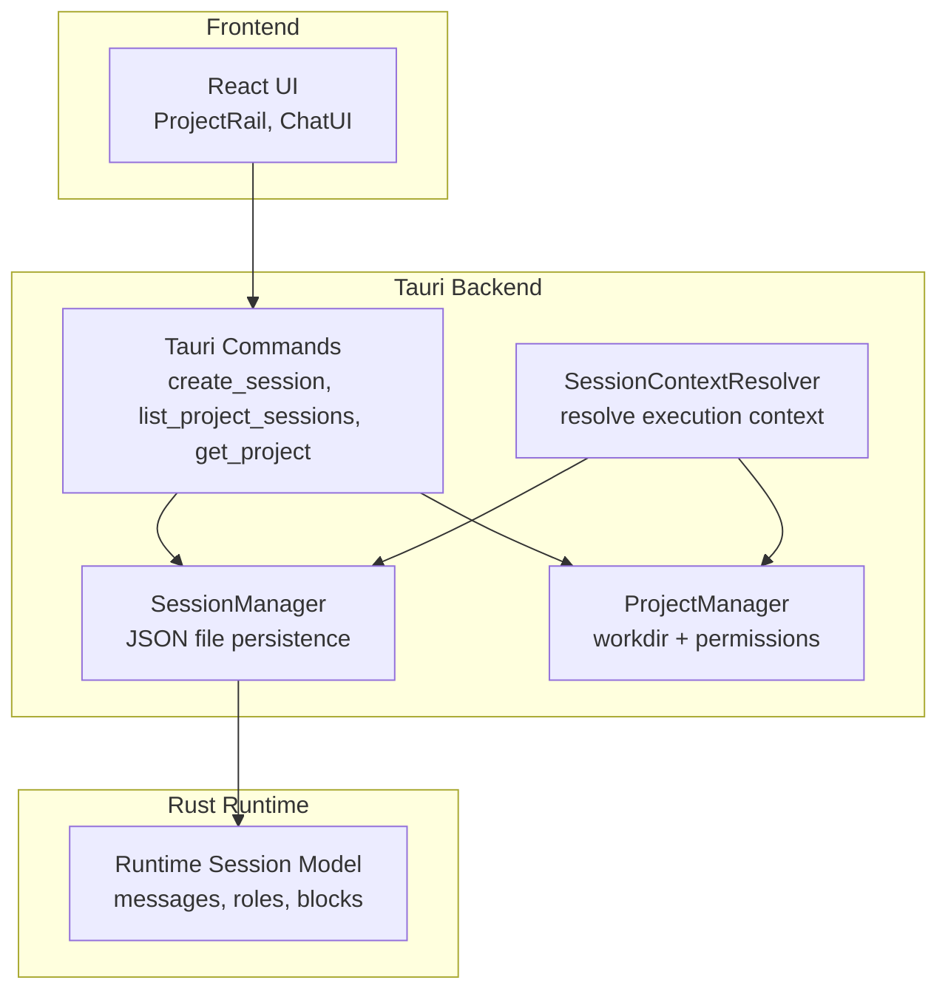
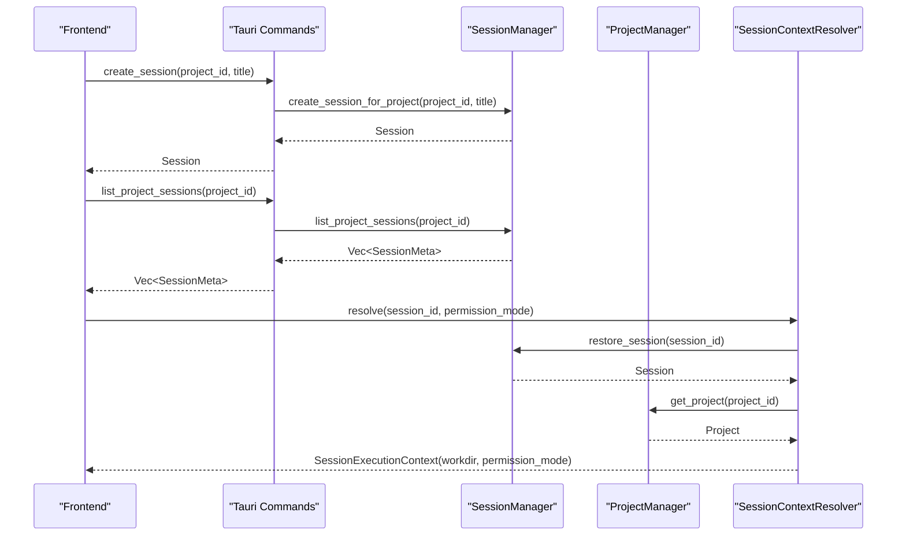
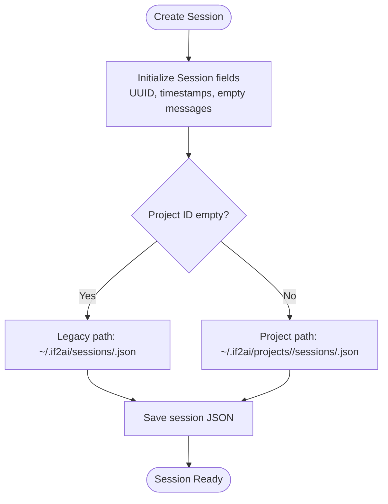
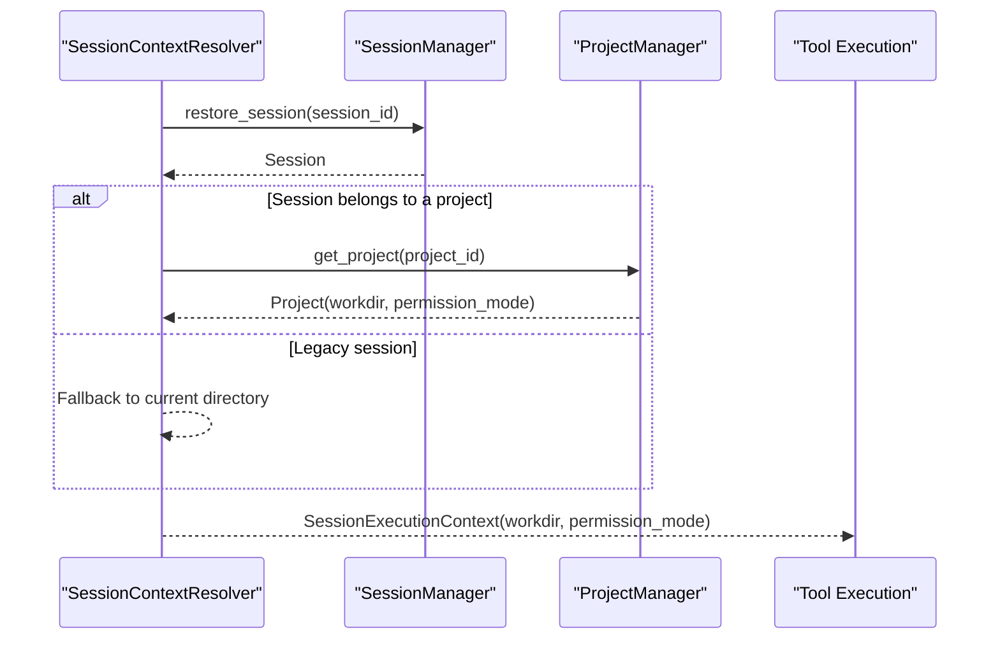
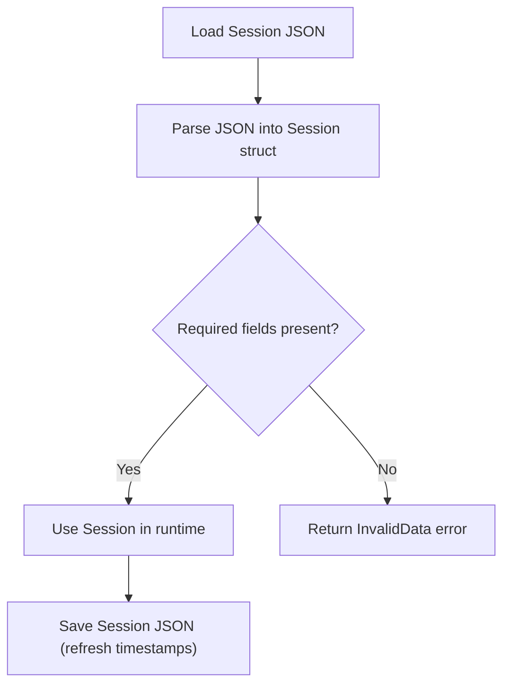
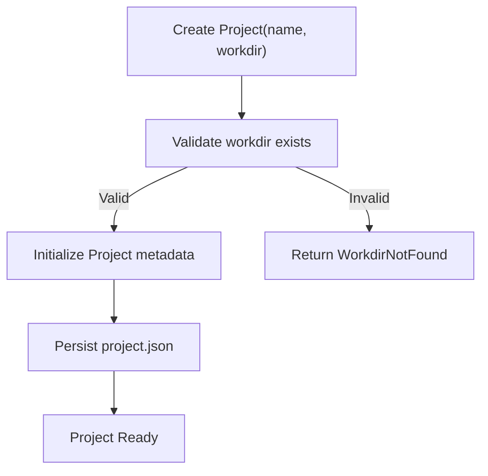
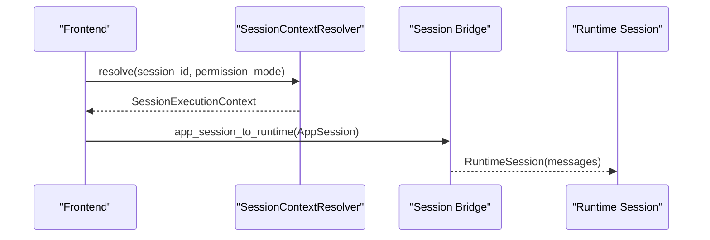
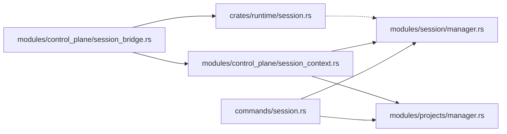

# Session & Project Management

<cite>
**Referenced Files in This Document**
- [session.rs](file://rust/crates/runtime/src/session.rs)
- [session.rs](file://src-tauri/src/modules/runtime/session.rs)
- [session.rs](file://src-tauri/src/commands/session.rs)
- [manager.rs](file://src-tauri/src/modules/session/manager.rs)
- [session_context.rs](file://src-tauri/src/modules/control_plane/session_context.rs)
- [session_bridge.rs](file://src-tauri/src/modules/control_plane/session_bridge.rs)
- [project.rs](file://src-tauri/src/commands/project.rs)
- [mod.rs](file://src-tauri/src/modules/projects/mod.rs)
- [manager.rs](file://src-tauri/src/modules/projects/manager.rs)
- [project-workdir-boundary.md](file://docs/design-docs/project-workdir-boundary.md)
</cite>

## Table of Contents
1. [Introduction](#introduction)
2. [Project Structure](#project-structure)
3. [Core Components](#core-components)
4. [Architecture Overview](#architecture-overview)
5. [Detailed Component Analysis](#detailed-component-analysis)
6. [Dependency Analysis](#dependency-analysis)
7. [Performance Considerations](#performance-considerations)
8. [Troubleshooting Guide](#troubleshooting-guide)
9. [Conclusion](#conclusion)

## Introduction
This document explains the session and project management systems in the application. It covers session lifecycle management, session isolation, and session data persistence. It also documents project creation, organization, and resource management, along with session switching, data sharing between sessions, and cleanup procedures. Additional topics include session configuration, project templates, data migration between sessions, session security, data privacy, and performance optimization for large datasets.

## Project Structure
The session and project management systems span both the Rust backend and the Tauri commands layer:
- Runtime session model and JSON serialization are defined in the Rust runtime crate.
- Application-level session management, including JSON file persistence and dual-path storage (legacy vs. project-scoped), is implemented in the Tauri modules.
- Project management provides workspace boundaries, permission modes, and workdir validation.
- Control plane utilities bridge application sessions to runtime sessions and resolve execution contexts.

**Diagram sources**
- [session.rs:14-134](file://src-tauri/src/commands/session.rs#L14-L134)
- [manager.rs:255-274](file://src-tauri/src/modules/session/manager.rs#L255-L274)
- [mod.rs:10-26](file://src-tauri/src/modules/projects/mod.rs#L10-L26)
- [session_context.rs:52-137](file://src-tauri/src/modules/control_plane/session_context.rs#L52-L137)
- [session.rs:62-65](file://src-tauri/src/modules/runtime/session.rs#L62-L65)

**Section sources**
- [session.rs:1-135](file://src-tauri/src/commands/session.rs#L1-L135)
- [manager.rs:1-967](file://src-tauri/src/modules/session/manager.rs#L1-L967)
- [mod.rs:1-105](file://src-tauri/src/modules/projects/mod.rs#L1-L105)
- [session_context.rs:1-138](file://src-tauri/src/modules/control_plane/session_context.rs#L1-L138)

## Core Components
- Runtime session model: Defines message roles, content blocks, and conversation messages with token usage and extended fields for thinking, outcomes, and resume metadata.
- Application session model: Extends the runtime model with metadata such as session ID, title, timestamps, pin state, token counts, and per-session memory toggles.
- SessionManager: Handles creation, restoration, listing, saving, adding messages, renaming, pinning, memory toggling, and deletion with dual-path storage.
- ProjectManager: Manages projects with workdir validation, permission modes, and session directory organization.
- SessionContextResolver: Resolves execution context for control-plane flows, binding session ID, project ID, workdir, and permission mode.
- Tauri commands: Expose session and project operations to the frontend.

**Section sources**
- [session.rs:46-140](file://rust/crates/runtime/src/session.rs#L46-L140)
- [session.rs:62-161](file://src-tauri/src/modules/runtime/session.rs#L62-L161)
- [manager.rs:130-253](file://src-tauri/src/modules/session/manager.rs#L130-L253)
- [manager.rs:255-725](file://src-tauri/src/modules/session/manager.rs#L255-L725)
- [mod.rs:10-71](file://src-tauri/src/modules/projects/mod.rs#L10-L71)
- [session_context.rs:10-137](file://src-tauri/src/modules/control_plane/session_context.rs#L10-L137)
- [session.rs:14-134](file://src-tauri/src/commands/session.rs#L14-L134)
- [project.rs:43-107](file://src-tauri/src/commands/project.rs#L43-L107)

## Architecture Overview
The system separates concerns across layers:
- Frontend triggers Tauri commands to manage sessions and projects.
- Commands delegate to managers for persistence and validation.
- SessionContextResolver binds sessions to project workdirs and permission modes for secure tool execution.
- Runtime session model ensures consistent message representation across layers.

**Diagram sources**
- [session.rs:14-59](file://src-tauri/src/commands/session.rs#L14-L59)
- [manager.rs:360-454](file://src-tauri/src/modules/session/manager.rs#L360-L454)
- [session_context.rs:69-136](file://src-tauri/src/modules/control_plane/session_context.rs#L69-L136)
- [mod.rs:10-26](file://src-tauri/src/modules/projects/mod.rs#L10-L26)

## Detailed Component Analysis

### Session Lifecycle Management
- Creation: Sessions are created with a UUID-based ID, timestamps, and optional project association. Legacy sessions go under a global sessions directory; project-scoped sessions go under the project’s sessions directory.
- Restoration: Sessions are restored by ID, with automatic detection of legacy vs. project-scoped paths.
- Persistence: Sessions are saved with refreshed timestamps and logical message counts. Dual-path ensures backward compatibility.
- Message management: Messages can be appended with token usage updates; message_count tracks logical totals even after compaction.
- Metadata operations: Sessions can be renamed, pinned, and memory toggled with timestamps for compile pipeline filtering.

**Diagram sources**
- [manager.rs:355-395](file://src-tauri/src/modules/session/manager.rs#L355-L395)
- [manager.rs:337-353](file://src-tauri/src/modules/session/manager.rs#L337-L353)

**Section sources**
- [manager.rs:355-395](file://src-tauri/src/modules/session/manager.rs#L355-L395)
- [manager.rs:456-520](file://src-tauri/src/modules/session/manager.rs#L456-L520)
- [manager.rs:522-556](file://src-tauri/src/modules/session/manager.rs#L522-L556)
- [manager.rs:558-576](file://src-tauri/src/modules/session/manager.rs#L558-L576)
- [manager.rs:578-614](file://src-tauri/src/modules/session/manager.rs#L578-L614)
- [manager.rs:616-634](file://src-tauri/src/modules/session/manager.rs#L616-L634)

### Session Isolation and Security
- Project-scoped workdir: Execution contexts derive workdir from the owning project; legacy sessions fall back to the current directory.
- Permission modes: Projects carry a permission mode; control-plane resolvers apply the requested mode for tool execution safety.
- Allowlists and sandboxing: Tools operate within validated workdirs and permission scopes; enforcement is integrated into tool execution contexts.

**Diagram sources**
- [session_context.rs:69-136](file://src-tauri/src/modules/control_plane/session_context.rs#L69-L136)
- [mod.rs:10-26](file://src-tauri/src/modules/projects/mod.rs#L10-L26)

**Section sources**
- [session_context.rs:90-136](file://src-tauri/src/modules/control_plane/session_context.rs#L90-L136)
- [project-workdir-boundary.md:48-125](file://docs/design-docs/project-workdir-boundary.md#L48-L125)

### Session Data Persistence and Migration
- JSON schema: Sessions persist as JSON with version and messages arrays; runtime and application models align on message structure.
- Migration path: Legacy sessions (global directory) and project-scoped sessions (under project sessions directory) are supported. Restoration scans both locations.
- Atomicity: Save operations refresh timestamps and message counts, ensuring accurate listing and activity tracking.

**Diagram sources**
- [session.rs:121-139](file://rust/crates/runtime/src/session.rs#L121-L139)
- [session.rs:136-154](file://src-tauri/src/modules/runtime/session.rs#L136-L154)

**Section sources**
- [session.rs:92-140](file://rust/crates/runtime/src/session.rs#L92-L140)
- [session.rs:107-154](file://src-tauri/src/modules/runtime/session.rs#L107-L154)
- [manager.rs:456-520](file://src-tauri/src/modules/session/manager.rs#L456-L520)

### Project Creation, Organization, and Resource Management
- Project creation validates workdir existence and initializes project metadata with timestamps and permission mode.
- Project listing and metadata provide session counts and display-friendly paths.
- Workdir boundary enforcement ensures tools operate within allowed directories.

**Diagram sources**
- [manager.rs:70-89](file://src-tauri/src/modules/projects/manager.rs#L70-L89)
- [mod.rs:10-26](file://src-tauri/src/modules/projects/mod.rs#L10-L26)

**Section sources**
- [project.rs:43-59](file://src-tauri/src/commands/project.rs#L43-L59)
- [manager.rs:70-89](file://src-tauri/src/modules/projects/manager.rs#L70-L89)
- [mod.rs:41-71](file://src-tauri/src/modules/projects/mod.rs#L41-L71)
- [project-workdir-boundary.md:48-125](file://docs/design-docs/project-workdir-boundary.md#L48-L125)

### Session Switching and Data Sharing Between Sessions
- Session switching: The control-plane resolver builds an execution context from a session ID, resolving the appropriate workdir and permission mode.
- Data sharing: The session bridge converts application sessions to runtime sessions for internal processing, enabling consistent message handling across layers.

**Diagram sources**
- [session_context.rs:69-136](file://src-tauri/src/modules/control_plane/session_context.rs#L69-L136)
- [session_bridge.rs:11-20](file://src-tauri/src/modules/control_plane/session_bridge.rs#L11-L20)

**Section sources**
- [session_context.rs:69-136](file://src-tauri/src/modules/control_plane/session_context.rs#L69-L136)
- [session_bridge.rs:11-20](file://src-tauri/src/modules/control_plane/session_bridge.rs#L11-L20)

### Cleanup Procedures
- Session deletion attempts legacy path first, then scans project-scoped paths to locate and remove the session file.
- Project deletion removes the project directory and all associated sessions.

**Section sources**
- [manager.rs:684-724](file://src-tauri/src/modules/session/manager.rs#L684-L724)
- [manager.rs:111-133](file://src-tauri/src/modules/projects/manager.rs#L111-L133)

### Examples and Templates
- Session configuration: Sessions include metadata such as title, timestamps, pin state, token counts, and per-session memory toggles. These fields enable fine-grained control over memory compilation and summarization.
- Project templates: Projects encapsulate a workdir and permission mode, forming the basis for tool execution boundaries and UI context display.

**Section sources**
- [manager.rs:130-166](file://src-tauri/src/modules/session/manager.rs#L130-L166)
- [mod.rs:10-26](file://src-tauri/src/modules/projects/mod.rs#L10-L26)

## Dependency Analysis
The following diagram shows key dependencies among components:

**Diagram sources**
- [session.rs:14-134](file://src-tauri/src/commands/session.rs#L14-L134)
- [manager.rs:255-274](file://src-tauri/src/modules/session/manager.rs#L255-L274)
- [session_context.rs:52-57](file://src-tauri/src/modules/control_plane/session_context.rs#L52-L57)
- [session_bridge.rs:7-9](file://src-tauri/src/modules/control_plane/session_bridge.rs#L7-L9)
- [session.rs:62-65](file://src-tauri/src/modules/runtime/session.rs#L62-L65)
- [session.rs:46-50](file://rust/crates/runtime/src/session.rs#L46-L50)

**Section sources**
- [session.rs:14-134](file://src-tauri/src/commands/session.rs#L14-L134)
- [manager.rs:255-274](file://src-tauri/src/modules/session/manager.rs#L255-L274)
- [session_context.rs:52-57](file://src-tauri/src/modules/control_plane/session_context.rs#L52-L57)
- [session_bridge.rs:7-9](file://src-tauri/src/modules/control_plane/session_bridge.rs#L7-L9)
- [session.rs:62-65](file://src-tauri/src/modules/runtime/session.rs#L62-L65)
- [session.rs:46-50](file://rust/crates/runtime/src/session.rs#L46-L50)

## Performance Considerations
- Large dataset optimization: The runtime session model supports token usage tracking and extended fields for thinking, outcomes, and resume cursors, enabling efficient summarization and resumption workflows.
- JSON serialization: Pretty-printed JSON improves readability and diffability; consider compression or streaming for very large histories.
- Listing and sorting: Session lists are sorted by pinned state and last update time, optimizing user experience for frequently accessed sessions.
- Memory toggles: Per-session memory toggles allow operators to disable memory writes for noisy sessions, reducing background processing overhead.

[No sources needed since this section provides general guidance]

## Troubleshooting Guide
- Session not found: Restoration scans legacy and project-scoped paths; ensure the session ID is correct and the file exists.
- Invalid session data: JSON parsing errors indicate corrupted session files; verify file integrity or recreate the session.
- Workdir not found: Project creation requires an existing workdir; confirm the path exists and is accessible.
- Permission denied: Execution failures often relate to workdir allowlists or permission modes; verify project permission mode and tool allowlists.

**Section sources**
- [manager.rs:456-520](file://src-tauri/src/modules/session/manager.rs#L456-L520)
- [manager.rs:684-724](file://src-tauri/src/modules/session/manager.rs#L684-L724)
- [manager.rs:70-89](file://src-tauri/src/modules/projects/manager.rs#L70-L89)

## Conclusion
The session and project management systems provide robust, secure, and scalable foundations for conversational workflows. They support dual-path persistence, strict workdir boundaries, and flexible permission modes, enabling safe and efficient tool execution. Operators can manage sessions with metadata controls, organize workloads via projects, and optimize performance through memory toggles and structured message handling.