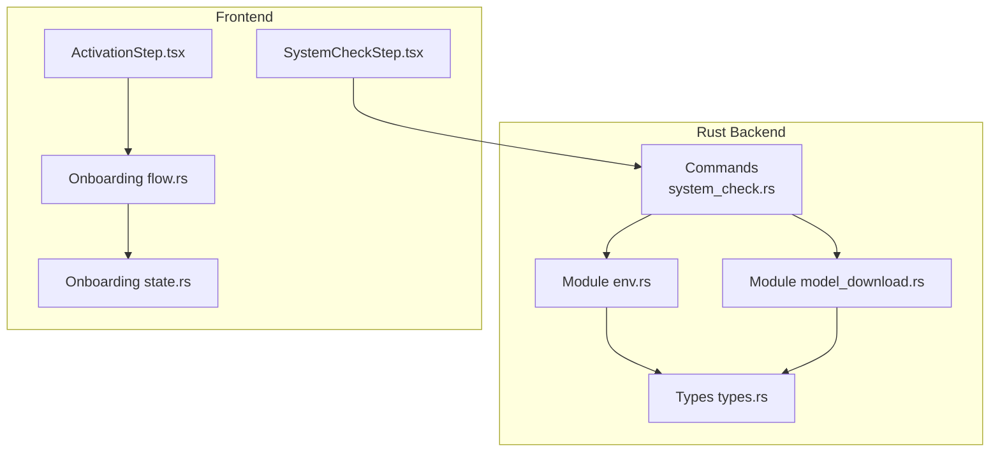
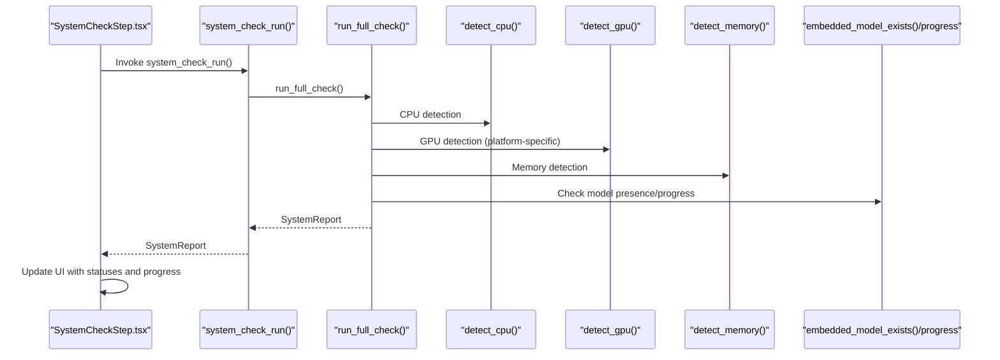
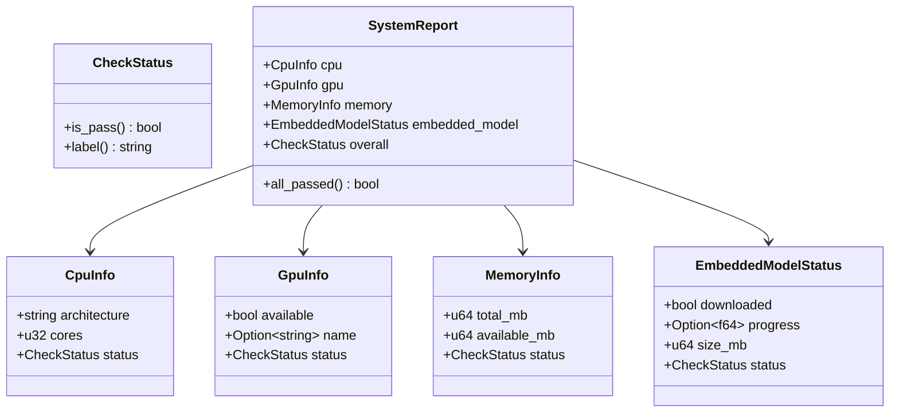
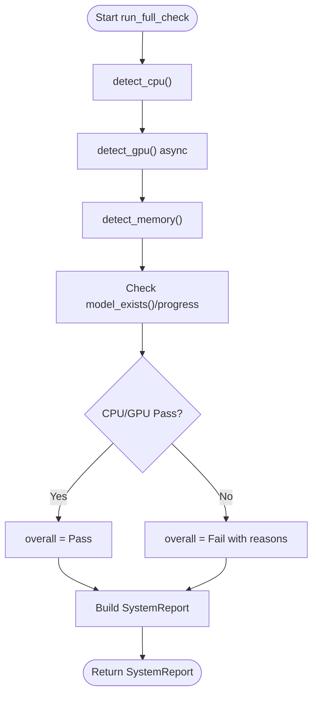
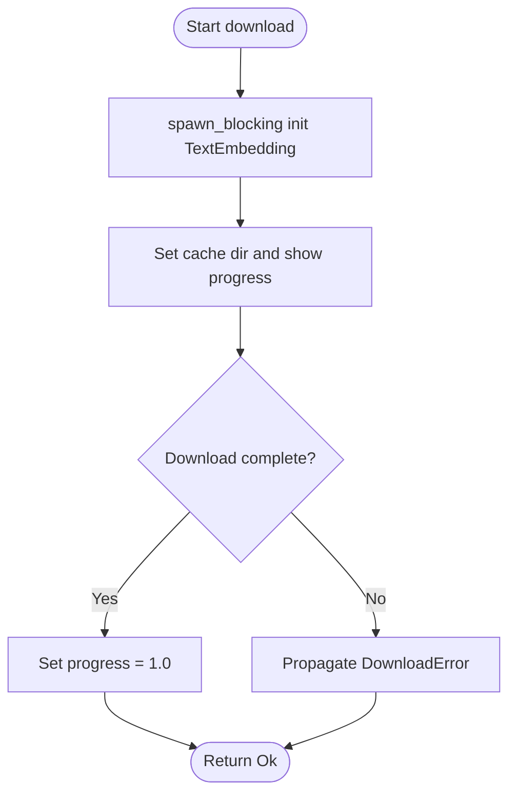
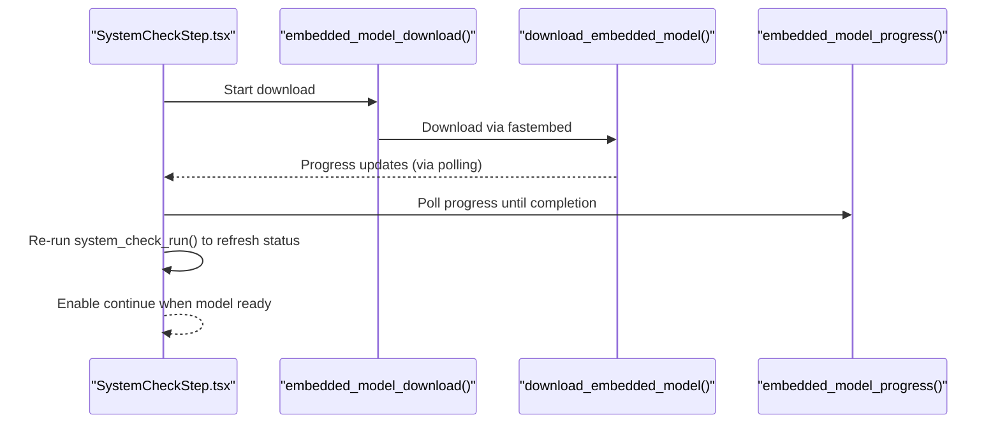
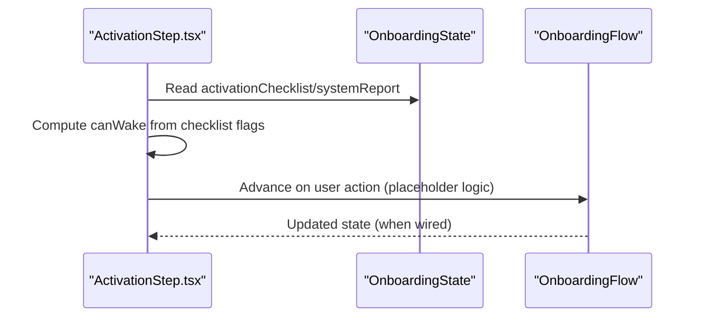
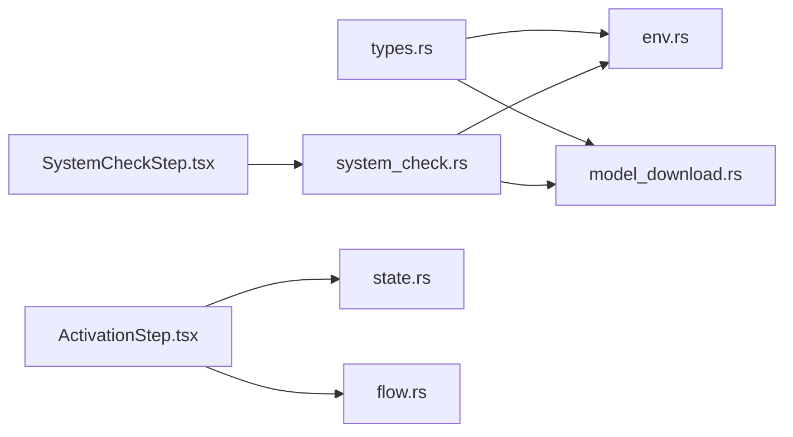

# System Health & Monitoring

<cite>
**Referenced Files in This Document**
- [system_check.rs](file://src-tauri/src/commands/system_check.rs)
- [env.rs](file://src-tauri/src/modules/system_check/env.rs)
- [model_download.rs](file://src-tauri/src/modules/system_check/model_download.rs)
- [types.rs](file://src-tauri/src/modules/system_check/types.rs)
- [SystemCheckStep.tsx](file://src/modules/onboarding/steps/SystemCheckStep.tsx)
- [flow.rs](file://src-tauri/src/modules/onboarding/flow.rs)
- [state.rs](file://src-tauri/src/modules/onboarding/state.rs)
- [ActivationStep.tsx](file://src/modules/onboarding/steps/ActivationStep.tsx)
- [lib.rs](file://src-tauri/src/lib.rs)
</cite>

## Table of Contents
1. [Introduction](#introduction)
2. [Project Structure](#project-structure)
3. [Core Components](#core-components)
4. [Architecture Overview](#architecture-overview)
5. [Detailed Component Analysis](#detailed-component-analysis)
6. [Dependency Analysis](#dependency-analysis)
7. [Performance Considerations](#performance-considerations)
8. [Troubleshooting Guide](#troubleshooting-guide)
9. [Conclusion](#conclusion)
10. [Appendices](#appendices)

## Introduction
This document describes the system health monitoring and environment checking framework used during onboarding. It covers environment validation (CPU, GPU, memory), dependency verification (embedded model presence), and system capability assessment. It also documents model download validation, hardware requirements checking, performance diagnostics, system check types, validation rules, remediation recommendations, examples of custom system checks, handling failed validations, user guidance for setup, continuous monitoring, health metrics collection, and automated recovery procedures.

## Project Structure
The system health framework spans Rust backend modules and TypeScript frontend components:
- Backend Rust modules under src-tauri/src/modules/system_check implement detection and reporting.
- Tauri commands bridge backend logic to the frontend.
- Frontend onboarding components orchestrate user-facing checks and actions.

**Diagram sources**
- [system_check.rs:10-108](file://src-tauri/src/commands/system_check.rs#L10-L108)
- [env.rs:1-252](file://src-tauri/src/modules/system_check/env.rs#L1-L252)
- [model_download.rs:1-159](file://src-tauri/src/modules/system_check/model_download.rs#L1-L159)
- [types.rs:1-244](file://src-tauri/src/modules/system_check/types.rs#L1-L244)
- [SystemCheckStep.tsx:177-616](file://src/modules/onboarding/steps/SystemCheckStep.tsx#L177-L616)
- [ActivationStep.tsx:31-68](file://src/modules/onboarding/steps/ActivationStep.tsx#L31-L68)
- [flow.rs:1-344](file://src-tauri/src/modules/onboarding/flow.rs#L1-L344)
- [state.rs:1-330](file://src-tauri/src/modules/onboarding/state.rs#L1-L330)

**Section sources**
- [lib.rs:1-23](file://src-tauri/src/lib.rs#L1-L23)
- [system_check.rs:10-108](file://src-tauri/src/commands/system_check.rs#L10-L108)
- [env.rs:1-252](file://src-tauri/src/modules/system_check/env.rs#L1-L252)
- [model_download.rs:1-159](file://src-tauri/src/modules/system_check/model_download.rs#L1-L159)
- [types.rs:1-244](file://src-tauri/src/modules/system_check/types.rs#L1-L244)
- [SystemCheckStep.tsx:177-616](file://src/modules/onboarding/steps/SystemCheckStep.tsx#L177-L616)
- [ActivationStep.tsx:31-68](file://src/modules/onboarding/steps/ActivationStep.tsx#L31-L68)
- [flow.rs:1-344](file://src-tauri/src/modules/onboarding/flow.rs#L1-L344)
- [state.rs:1-330](file://src-tauri/src/modules/onboarding/state.rs#L1-L330)

## Core Components
- SystemReport: Aggregates CPU, GPU, memory, and embedded model status into a single report.
- CheckStatus: Encodes pass/fail/running/pending outcomes for individual checks.
- Environment detectors: CPU, GPU, and memory detection via sysinfo and platform-specific commands.
- Model download subsystem: Fastembed-based download with progress tracking and resumable caching.
- Tauri commands: Expose backend checks and model operations to the frontend.
- Frontend onboarding UI: Drives system checks, displays progress, and enables next-step gating.

Key responsibilities:
- Environment validation: Detect CPU architecture/cores, GPU availability/name, and memory totals/available.
- Dependency verification: Confirm embedded model presence and track download progress.
- Capability assessment: Provide overall pass/fail outcome for hardware checks; model readiness gates progression.
- Diagnostics: Provide human-readable labels and structured statuses for UI rendering and automation.

**Section sources**
- [types.rs:13-131](file://src-tauri/src/modules/system_check/types.rs#L13-L131)
- [env.rs:17-223](file://src-tauri/src/modules/system_check/env.rs#L17-L223)
- [model_download.rs:28-114](file://src-tauri/src/modules/system_check/model_download.rs#L28-L114)
- [system_check.rs:18-43](file://src-tauri/src/commands/system_check.rs#L18-L43)
- [SystemCheckStep.tsx:177-221](file://src/modules/onboarding/steps/SystemCheckStep.tsx#L177-L221)

## Architecture Overview
The system health pipeline integrates frontend UI, backend commands, and system checks:

**Diagram sources**
- [system_check.rs:18-25](file://src-tauri/src/commands/system_check.rs#L18-L25)
- [env.rs:162-223](file://src-tauri/src/modules/system_check/env.rs#L162-L223)
- [model_download.rs:88-114](file://src-tauri/src/modules/system_check/model_download.rs#L88-L114)
- [SystemCheckStep.tsx:190-221](file://src/modules/onboarding/steps/SystemCheckStep.tsx#L190-L221)

## Detailed Component Analysis

### SystemReport and CheckStatus
- CheckStatus supports four states: Pass, Fail with reason, Running, Pending.
- SystemReport aggregates per-category results and overall outcome.
- all_passed() focuses on model readiness; hardware info-only checks do not block progression.

**Diagram sources**
- [types.rs:13-131](file://src-tauri/src/modules/system_check/types.rs#L13-L131)

**Section sources**
- [types.rs:13-131](file://src-tauri/src/modules/system_check/types.rs#L13-L131)

### Environment Detection (CPU/GPU/Memory)
- CPU detection uses sysinfo to fetch architecture and core count; falls back to compile-time constants if sysinfo fails.
- GPU detection is platform-specific:
  - macOS: parses system_profiler JSON output for GPU model.
  - Linux: greps lspci output for VGA devices.
  - Other platforms: returns unavailable.
- Memory detection uses sysinfo to report total and available memory.

**Diagram sources**
- [env.rs:162-223](file://src-tauri/src/modules/system_check/env.rs#L162-L223)

**Section sources**
- [env.rs:17-158](file://src-tauri/src/modules/system_check/env.rs#L17-L158)

### Model Download Validation and Diagnostics
- Fastembed-based download caches models under ~/.if2ai/models/fastembed/.
- Progress is tracked via an atomic counter scaled to 0–1.0.
- embedded_model_exists() verifies cache directory contents to confirm completion.
- Download errors propagate as structured DownloadError variants.

**Diagram sources**
- [model_download.rs:37-65](file://src-tauri/src/modules/system_check/model_download.rs#L37-L65)

**Section sources**
- [model_download.rs:28-114](file://src-tauri/src/modules/system_check/model_download.rs#L28-L114)

### Tauri Commands and Frontend Orchestration
- system_check_run(): Returns a SystemReport.
- embedded_model_download(): Initiates download; progress retrievable via embedded_model_progress().
- get/set_model_config(): Manage embedded model name and optional HuggingFace mirror URL.
- Frontend SystemCheckStep.tsx:
  - Auto-runs checks on mount.
  - Triggers model download automatically when pending.
  - Updates UI based on CheckStatus and progress.
  - Enables “continue” only when model is ready.

**Diagram sources**
- [system_check.rs:27-43](file://src-tauri/src/commands/system_check.rs#L27-L43)
- [model_download.rs:37-65](file://src-tauri/src/modules/system_check/model_download.rs#L37-L65)
- [SystemCheckStep.tsx:205-221](file://src/modules/onboarding/steps/SystemCheckStep.tsx#L205-L221)

**Section sources**
- [system_check.rs:18-108](file://src-tauri/src/commands/system_check.rs#L18-L108)
- [SystemCheckStep.tsx:177-221](file://src/modules/onboarding/steps/SystemCheckStep.tsx#L177-L221)

### Onboarding Integration and Step Gating
- OnboardingFlow.can_proceed() is a placeholder; Step 2 gating will be wired to system_check report.
- ActivationStep constructs a synthetic checklist using systemReport to gate wake-up.

**Diagram sources**
- [ActivationStep.tsx:54-68](file://src/modules/onboarding/steps/ActivationStep.tsx#L54-L68)
- [flow.rs:99-107](file://src-tauri/src/modules/onboarding/flow.rs#L99-L107)
- [state.rs:159-202](file://src-tauri/src/modules/onboarding/state.rs#L159-L202)

**Section sources**
- [ActivationStep.tsx:31-68](file://src/modules/onboarding/steps/ActivationStep.tsx#L31-L68)
- [flow.rs:99-107](file://src-tauri/src/modules/onboarding/flow.rs#L99-L107)
- [state.rs:159-202](file://src-tauri/src/modules/onboarding/state.rs#L159-L202)

## Dependency Analysis
- Backend modules depend on sysinfo for CPU/memory and platform-specific commands for GPU.
- Model download relies on fastembed and filesystem caching.
- Frontend depends on Tauri commands for health checks and model operations.
- Onboarding state and flow manage progression and recovery.

**Diagram sources**
- [types.rs:1-244](file://src-tauri/src/modules/system_check/types.rs#L1-L244)
- [env.rs:1-252](file://src-tauri/src/modules/system_check/env.rs#L1-L252)
- [model_download.rs:1-159](file://src-tauri/src/modules/system_check/model_download.rs#L1-L159)
- [system_check.rs:10-108](file://src-tauri/src/commands/system_check.rs#L10-L108)
- [SystemCheckStep.tsx:177-616](file://src/modules/onboarding/steps/SystemCheckStep.tsx#L177-L616)
- [ActivationStep.tsx:31-68](file://src/modules/onboarding/steps/ActivationStep.tsx#L31-L68)
- [state.rs:1-330](file://src-tauri/src/modules/onboarding/state.rs#L1-L330)
- [flow.rs:1-344](file://src-tauri/src/modules/onboarding/flow.rs#L1-L344)

**Section sources**
- [lib.rs:16-22](file://src-tauri/src/lib.rs#L16-L22)
- [system_check.rs:10-108](file://src-tauri/src/commands/system_check.rs#L10-L108)
- [env.rs:1-252](file://src-tauri/src/modules/system_check/env.rs#L1-L252)
- [model_download.rs:1-159](file://src-tauri/src/modules/system_check/model_download.rs#L1-L159)
- [types.rs:1-244](file://src-tauri/src/modules/system_check/types.rs#L1-L244)
- [SystemCheckStep.tsx:177-616](file://src/modules/onboarding/steps/SystemCheckStep.tsx#L177-L616)
- [ActivationStep.tsx:31-68](file://src/modules/onboarding/steps/ActivationStep.tsx#L31-L68)
- [flow.rs:1-344](file://src-tauri/src/modules/onboarding/flow.rs#L1-L344)
- [state.rs:1-330](file://src-tauri/src/modules/onboarding/state.rs#L1-L330)

## Performance Considerations
- Hardware checks (CPU/GPU/Memory) are lightweight and synchronous via sysinfo; they do not block UI responsiveness.
- Model download occurs off the main thread using spawn_blocking; progress updates are atomic and efficient.
- Frontend metrics compute instantaneous throughput over a small sliding window to avoid UI jitter.

Recommendations:
- Keep download progress polling minimal (e.g., short intervals) to reduce overhead.
- Use debounced UI updates for progress bars to prevent excessive re-renders.
- Cache model existence checks to avoid repeated filesystem scans.

[No sources needed since this section provides general guidance]

## Troubleshooting Guide
Common scenarios and remedies:
- CPU detection fails:
  - Cause: sysinfo failure or zero cores reported.
  - Remedy: Verify OS support; if unsupported, rely on fallback architecture constant.
- GPU not detected:
  - Cause: Unsupported platform or missing system_profiler/lspci.
  - Remedy: Use CPU mode; install required utilities on Linux/macOS.
- Memory info always passes:
  - Behavior: Memory info is informational and does not block progression.
- Model download stuck at 0%:
  - Cause: No prior progress recorded and model not cached.
  - Remedy: Trigger download again; ensure network connectivity; optionally configure HuggingFace mirror.
- Download progress shows Running but stalls:
  - Remedy: Retry download; check firewall/proxy; verify cache directory permissions.
- Model download fails:
  - Remedy: Inspect error message; retry; consider mirror URL; free disk space.

Automated recovery:
- OnboardingFlow.record_failure() persists last failure with timestamp and retriable flag.
- OnboardingFlow.save_draft_config() preserves partial form data for crash recovery.
- OnboardingState.to_app_state() transitions UI from FirstLaunch/Onboarding/Ready.

**Section sources**
- [env.rs:28-42](file://src-tauri/src/modules/system_check/env.rs#L28-L42)
- [env.rs:53-68](file://src-tauri/src/modules/system_check/env.rs#L53-L68)
- [model_download.rs:108-126](file://src-tauri/src/modules/system_check/model_download.rs#L108-L126)
- [flow.rs:158-180](file://src-tauri/src/modules/onboarding/flow.rs#L158-L180)
- [state.rs:137-174](file://src-tauri/src/modules/onboarding/state.rs#L137-L174)

## Conclusion
The system health monitoring framework provides robust environment validation, reliable model download tracking, and clear user guidance during onboarding. By separating concerns across backend modules, Tauri commands, and frontend components, the system remains maintainable and extensible. Future enhancements can wire Step 2 gating to actual precondition checks and expand diagnostics for continuous monitoring.

[No sources needed since this section summarizes without analyzing specific files]

## Appendices

### System Check Types and Validation Rules
- CPU: Cores > 0 and architecture detected; otherwise fail.
- GPU: Available or unavailable; name parsed on supported platforms.
- Memory: Total and available MB reported; status always Pass (info-only).
- Embedded Model: Pass when cached; Running when progress > 0; Pending when no progress; Fail with reason when explicit failure occurs.

**Section sources**
- [types.rs:13-131](file://src-tauri/src/modules/system_check/types.rs#L13-L131)
- [env.rs:28-42](file://src-tauri/src/modules/system_check/env.rs#L28-L42)
- [env.rs:53-68](file://src-tauri/src/modules/system_check/env.rs#L53-L68)
- [env.rs:146-158](file://src-tauri/src/modules/system_check/env.rs#L146-L158)
- [env.rs:176-197](file://src-tauri/src/modules/system_check/env.rs#L176-L197)

### Continuous Monitoring and Automated Recovery Procedures
- Continuous monitoring:
  - Poll embedded_model_progress() periodically to reflect live progress.
  - Re-run system_check_run() after download completes to refresh overall status.
- Automated recovery:
  - Use OnboardingFlow.record_failure() to persist failure metadata.
  - Use OnboardingFlow.save_draft_config() to retain partial user input.
  - Use OnboardingState.to_app_state() to drive UI transitions.

**Section sources**
- [SystemCheckStep.tsx:212-221](file://src/modules/onboarding/steps/SystemCheckStep.tsx#L212-L221)
- [flow.rs:158-180](file://src-tauri/src/modules/onboarding/flow.rs#L158-L180)
- [state.rs:189-202](file://src-tauri/src/modules/onboarding/state.rs#L189-L202)