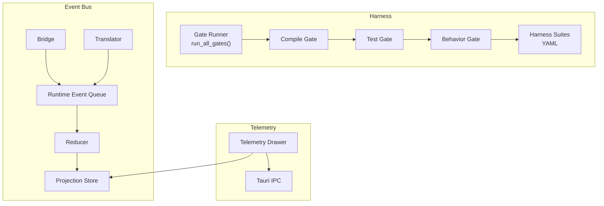
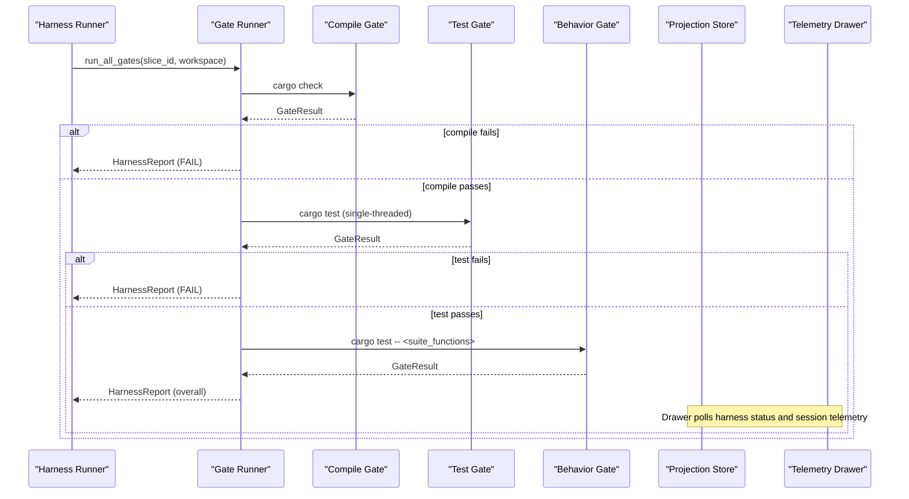
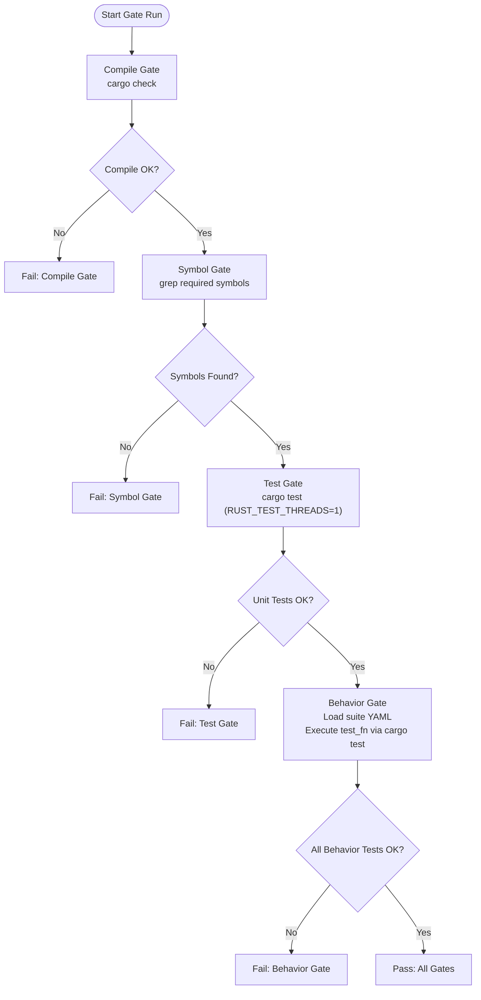
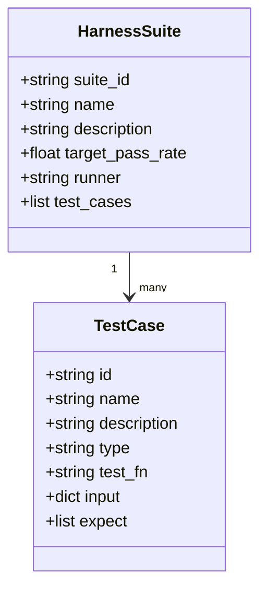
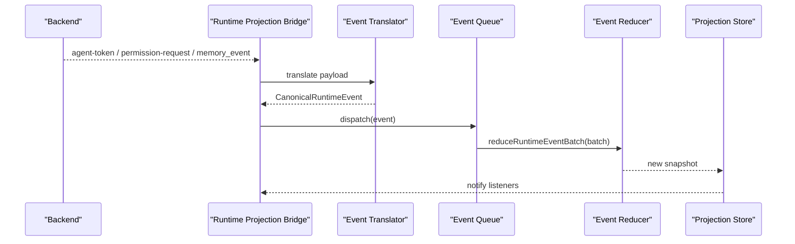
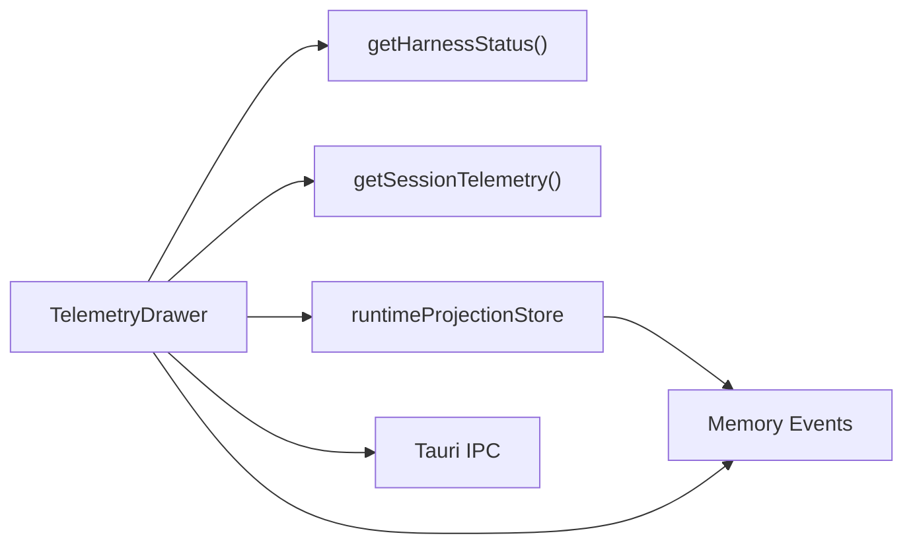
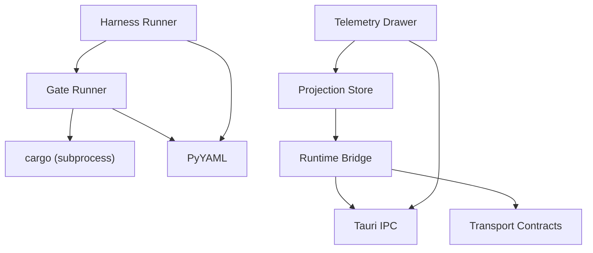

# Testing & Harness Framework

<cite>
**Referenced Files in This Document**
- [gate.py](file://harness/gate.py)
- [runner.py](file://harness/runner.py)
- [e2e_conversation.yaml](file://harness/suites/e2e_conversation.yaml)
- [phase1_integration.yaml](file://harness/suites/phase1_integration.yaml)
- [runtime-event-queue.ts](file://src/runtime-projection/runtime-event-queue.ts)
- [runtime-event-reducer.ts](file://src/runtime-projection/runtime-event-reducer.ts)
- [runtime-event-translator.ts](file://src/runtime-projection/runtime-event-translator.ts)
- [runtime-projection-store.ts](file://src/runtime-projection/runtime-projection-store.ts)
- [runtime-projection-bridge.ts](file://src/runtime-projection/runtime-projection-bridge.ts)
- [TelemetryDrawer.tsx](file://src/components/chat/TelemetryDrawer.tsx)
- [tts_integration.rs](file://src-tauri/tests/tts_integration.rs)
- [security_integration.rs](file://src-tauri/tests/security_integration.rs)
- [client_integration.rs](file://rust/crates/api/tests/client_integration.rs)
- [tts_integration.rs](file://src-tauri/tests/tts_integration.rs)
- [tauri.ts](file://src/lib/tauri.ts)
</cite>

## Table of Contents
1. [Introduction](#introduction)
2. [Project Structure](#project-structure)
3. [Core Components](#core-components)
4. [Architecture Overview](#architecture-overview)
5. [Detailed Component Analysis](#detailed-component-analysis)
6. [Dependency Analysis](#dependency-analysis)
7. [Performance Considerations](#performance-considerations)
8. [Troubleshooting Guide](#troubleshooting-guide)
9. [Conclusion](#conclusion)
10. [Appendices](#appendices)

## Introduction
This document describes the testing harness and quality assurance framework for the if2Ai project. It explains the event bus system, testing gates, and telemetry collection. It documents harness architecture, test execution patterns, and result aggregation. It covers integration testing, end-to-end validation, and performance benchmarking. It also includes examples for writing custom tests, implementing test harnesses, and analyzing test results, along with guidance on test data management, environment isolation, and automated testing pipelines.

## Project Structure
The testing framework is organized around three pillars:
- Harness gates: a layered quality control system enforcing compile-time correctness, unit coverage, and behavior validation.
- Event bus system: a canonical runtime event pipeline that normalizes backend payloads into frontend projections for observability and testing.
- Telemetry collection: a developer-facing telemetry drawer that surfaces runtime metrics and memory lifecycle events for diagnostics.

**Diagram sources**
- [gate.py:359-414](file://harness/gate.py#L359-L414)
- [runner.py:26-75](file://harness/runner.py#L26-L75)
- [runtime-event-queue.ts:54-124](file://src/runtime-projection/runtime-event-queue.ts#L54-L124)
- [runtime-event-translator.ts:45-132](file://src/runtime-projection/runtime-event-translator.ts#L45-L132)
- [runtime-event-reducer.ts:40-287](file://src/runtime-projection/runtime-event-reducer.ts#L40-L287)
- [runtime-projection-store.ts:66-134](file://src/runtime-projection/runtime-projection-store.ts#L66-L134)
- [runtime-projection-bridge.ts:88-194](file://src/runtime-projection/runtime-projection-bridge.ts#L88-L194)
- [TelemetryDrawer.tsx:364-708](file://src/components/chat/TelemetryDrawer.tsx#L364-L708)

**Section sources**
- [gate.py:1-414](file://harness/gate.py#L1-L414)
- [runner.py:1-718](file://harness/runner.py#L1-L718)

## Core Components
- Harness gates: Three-layer enforcement (compile, test, behavior) with symbol checks and behavior suite evaluation.
- Harness runner: CLI entry point orchestrating gate execution, report generation, and status dashboards.
- Harness suites: YAML-defined behavior suites driving cargo test execution and expectations.
- Event bus: Canonical event translation, batching, reduction, and global store for runtime observability.
- Telemetry drawer: Developer panel surfacing harness status, session telemetry, and memory lifecycle events.

**Section sources**
- [gate.py:189-352](file://harness/gate.py#L189-L352)
- [runner.py:26-75](file://harness/runner.py#L26-L75)
- [e2e_conversation.yaml:1-120](file://harness/suites/e2e_conversation.yaml#L1-L120)
- [phase1_integration.yaml:1-101](file://harness/suites/phase1_integration.yaml#L1-L101)
- [runtime-event-queue.ts:27-47](file://src/runtime-projection/runtime-event-queue.ts#L27-L47)
- [runtime-event-translator.ts:45-132](file://src/runtime-projection/runtime-event-translator.ts#L45-L132)
- [runtime-event-reducer.ts:40-287](file://src/runtime-projection/runtime-event-reducer.ts#L40-L287)
- [runtime-projection-store.ts:32-54](file://src/runtime-projection/runtime-projection-store.ts#L32-L54)
- [TelemetryDrawer.tsx:364-708](file://src/components/chat/TelemetryDrawer.tsx#L364-L708)

## Architecture Overview
The harness gates operate in sequence: compile gate validates syntax and types, test gate executes unit tests, and behavior gate runs suite-defined tests. Results are aggregated into a structured report. The event bus normalizes backend payloads into canonical events, batches them, reduces them into immutable snapshots, and exposes them via a global store. The telemetry drawer consumes both harness status and session telemetry to provide live diagnostics.

**Diagram sources**
- [runner.py:26-75](file://harness/runner.py#L26-L75)
- [gate.py:359-414](file://harness/gate.py#L359-L414)
- [phase1_integration.yaml:22-82](file://harness/suites/phase1_integration.yaml#L22-L82)

## Detailed Component Analysis

### Harness Gates and Behavior Suites
The gate system enforces three layers:
- Compile gate: runs cargo check with a timeout.
- Test gate: runs cargo test with single-threaded execution to avoid flaky concurrency.
- Behavior gate: loads a YAML suite and executes specified test functions via cargo test.

**Diagram sources**
- [gate.py:190-352](file://harness/gate.py#L190-L352)
- [runner.py:26-75](file://harness/runner.py#L26-L75)

Key behaviors:
- Symbol gate verifies required symbols exist in implementation targets using word-boundary regex.
- Behavior gate supports runner types: cargo_test and symbol_check; skips when suite is missing or unsupported.
- Gate results include status, duration, and truncated output/error for traceability.

**Section sources**
- [gate.py:123-188](file://harness/gate.py#L123-L188)
- [gate.py:190-247](file://harness/gate.py#L190-L247)
- [gate.py:249-352](file://harness/gate.py#L249-L352)
- [runner.py:26-75](file://harness/runner.py#L26-L75)

### Harness Suites and Test Execution Patterns
Harness suites define behavior tests with:
- suite_id, name, description, target_pass_rate
- runner type (e.g., cargo_test)
- test_cases with id, name, description, type, test_fn, input, expect

Examples:
- E2E conversation suite validates end-to-end flows including single-turn conversations, tool usage, budget exhaustion, session persistence, listing sessions, and concurrent sessions.
- Phase 1 integration suite aggregates tool registry and E2E suites plus additional integration tests for provider fallback, app state initialization, database schema migration, and code quality checks.

**Diagram sources**
- [e2e_conversation.yaml:6-120](file://harness/suites/e2e_conversation.yaml#L6-L120)
- [phase1_integration.yaml:6-101](file://harness/suites/phase1_integration.yaml#L6-L101)

**Section sources**
- [e2e_conversation.yaml:1-120](file://harness/suites/e2e_conversation.yaml#L1-L120)
- [phase1_integration.yaml:1-101](file://harness/suites/phase1_integration.yaml#L1-L101)

### Event Bus System
The event bus transforms backend payloads into canonical events, batches them, reduces them into immutable snapshots, and exposes them via a global store. The bridge wires Tauri event sources to the store.

**Diagram sources**
- [runtime-projection-bridge.ts:88-194](file://src/runtime-projection/runtime-projection-bridge.ts#L88-L194)
- [runtime-event-translator.ts:45-132](file://src/runtime-projection/runtime-event-translator.ts#L45-L132)
- [runtime-event-queue.ts:54-124](file://src/runtime-projection/runtime-event-queue.ts#L54-L124)
- [runtime-event-reducer.ts:40-287](file://src/runtime-projection/runtime-event-reducer.ts#L40-L287)
- [runtime-projection-store.ts:66-134](file://src/runtime-projection/runtime-projection-store.ts#L66-L134)

Implementation highlights:
- Translator functions convert wire payloads into canonical event shapes, preserving field semantics and handling unknown variants gracefully.
- Event queue batches events via microtasks and supports synchronous flush for tests.
- Reducer applies events to produce immutable snapshots with strict purity rules.
- Bridge wires three Tauri event sources and optionally performs fetch-based translations for activation and execution-mode decisions.

**Section sources**
- [runtime-event-translator.ts:45-132](file://src/runtime-projection/runtime-event-translator.ts#L45-L132)
- [runtime-event-translator.ts:138-276](file://src/runtime-projection/runtime-event-translator.ts#L138-L276)
- [runtime-event-queue.ts:54-124](file://src/runtime-projection/runtime-event-queue.ts#L54-L124)
- [runtime-event-reducer.ts:40-287](file://src/runtime-projection/runtime-event-reducer.ts#L40-L287)
- [runtime-projection-store.ts:66-134](file://src/runtime-projection/runtime-projection-store.ts#L66-L134)
- [runtime-projection-bridge.ts:88-194](file://src/runtime-projection/runtime-projection-bridge.ts#L88-L194)

### Telemetry Collection and Visualization
The Telemetry Drawer provides a developer-only panel displaying harness status, session telemetry, token usage, tool call statistics, reflection cycles, context compaction events, and memory lifecycle and promotion timelines. It polls harness status and session telemetry and renders memory events from the runtime projection store.

**Diagram sources**
- [TelemetryDrawer.tsx:364-708](file://src/components/chat/TelemetryDrawer.tsx#L364-L708)
- [runtime-projection-store.ts:66-134](file://src/runtime-projection/runtime-projection-store.ts#L66-L134)

**Section sources**
- [TelemetryDrawer.tsx:364-708](file://src/components/chat/TelemetryDrawer.tsx#L364-L708)

### Integration Testing Examples
Integration tests demonstrate end-to-end flows and boundary enforcement:
- TTS integration tests validate buffered synthesis, streaming job lifecycle, warmup manager integration, demo audio resolution, voice presets, text chunking, and edge cases.
- Security integration tests validate XSS detection, path traversal blocking, atomic write rollback, and access context enforcement.
- API client integration tests validate message posting, SSE streaming, retries, provider client dispatch, and retry exhaustion.

**Section sources**
- [tts_integration.rs:22-463](file://src-tauri/tests/tts_integration.rs#L22-L463)
- [security_integration.rs:39-140](file://src-tauri/tests/security_integration.rs#L39-L140)
- [client_integration.rs:15-484](file://rust/crates/api/tests/client_integration.rs#L15-L484)

## Dependency Analysis
The harness depends on:
- Python subprocess execution for cargo commands.
- YAML parsing for suite definitions.
- Rust test execution with controlled concurrency.

The event bus depends on:
- Tauri IPC for backend event streams.
- Transport contracts for wire shapes.
- Immutable reducers for state projection.

**Diagram sources**
- [gate.py:92-117](file://harness/gate.py#L92-L117)
- [runner.py:26-75](file://harness/runner.py#L26-L75)
- [runtime-projection-bridge.ts:51-73](file://src/runtime-projection/runtime-projection-bridge.ts#L51-L73)
- [TelemetryDrawer.tsx:39-46](file://src/components/chat/TelemetryDrawer.tsx#L39-L46)

**Section sources**
- [gate.py:92-117](file://harness/gate.py#L92-L117)
- [runner.py:26-75](file://harness/runner.py#L26-L75)
- [runtime-projection-bridge.ts:51-73](file://src/runtime-projection/runtime-projection-bridge.ts#L51-L73)
- [TelemetryDrawer.tsx:39-46](file://src/components/chat/TelemetryDrawer.tsx#L39-L46)

## Performance Considerations
- Gate timeouts: compile gate ≤ 120s, test gate ≤ 180s, behavior gate per test ≤ 120s.
- Single-threaded test execution: RUST_TEST_THREADS=1 to avoid flaky concurrency.
- Event batching: microtask-based batching reduces render thrashing while maintaining responsiveness.
- Immutable snapshots: structural sharing minimizes allocation overhead.
- Telemetry polling: 5-second intervals balance freshness and performance.

[No sources needed since this section provides general guidance]

## Troubleshooting Guide
Common issues and resolutions:
- Gate failures:
  - Compile gate failures indicate syntax/type errors; fix code and rerun.
  - Test gate failures often stem from concurrency; ensure single-threaded execution.
  - Behavior gate failures indicate suite misconfiguration or missing test functions.
- Harness runner:
  - Use --report-out to persist JSON reports for CI parsing.
  - Use status command to inspect progress across phases.
- Event bus:
  - Unknown backend event types are ignored by translator; verify backend compatibility.
  - Ensure bridge listeners are wired and unmounted properly to prevent leaks.
- Telemetry drawer:
  - Verify harness status and session telemetry endpoints are reachable.
  - Confirm memory events are flowing through the projection store.

**Section sources**
- [gate.py:190-352](file://harness/gate.py#L190-L352)
- [runner.py:506-623](file://harness/runner.py#L506-L623)
- [runtime-event-translator.ts:45-132](file://src/runtime-projection/runtime-event-translator.ts#L45-L132)
- [TelemetryDrawer.tsx:442-477](file://src/components/chat/TelemetryDrawer.tsx#L442-L477)

## Conclusion
The if2Ai testing harness provides robust, layered quality control through compile, test, and behavior gates. The event bus ensures canonical, immutable projections for observability and testing. The telemetry drawer offers developer-grade diagnostics. Together, these components enable reliable integration testing, end-to-end validation, and performance monitoring across the stack.

[No sources needed since this section summarizes without analyzing specific files]

## Appendices

### Writing Custom Tests
- Rust integration tests:
  - Use MockTtsProvider for TTS flows.
  - Validate streaming job lifecycle and warmup manager behavior.
  - Assert boundary conditions and security policies.
- Frontend integration tests:
  - Use tauri.ts wrappers for IPC commands.
  - Validate event translation and projection updates.
  - Exercise TelemetryDrawer interactions.

**Section sources**
- [tts_integration.rs:22-463](file://src-tauri/tests/tts_integration.rs#L22-L463)
- [security_integration.rs:39-140](file://src-tauri/tests/security_integration.rs#L39-L140)
- [tauri.ts:202-231](file://src/lib/tauri.ts#L202-L231)

### Implementing Test Harnesses
- Define harness suites with runner and test_cases.
- Use symbol checks to ensure implementation targets are modified.
- Aggregate results into HarnessReport for CI consumption.

**Section sources**
- [e2e_conversation.yaml:1-120](file://harness/suites/e2e_conversation.yaml#L1-L120)
- [phase1_integration.yaml:1-101](file://harness/suites/phase1_integration.yaml#L1-L101)
- [gate.py:359-414](file://harness/gate.py#L359-L414)

### Analyzing Test Results
- Parse JSON reports from harness runner for pass/fail and durations.
- Inspect truncated output/error fields for root cause analysis.
- Use TelemetryDrawer to correlate runtime metrics with test outcomes.

**Section sources**
- [runner.py:63-75](file://harness/runner.py#L63-L75)
- [TelemetryDrawer.tsx:442-477](file://src/components/chat/TelemetryDrawer.tsx#L442-L477)