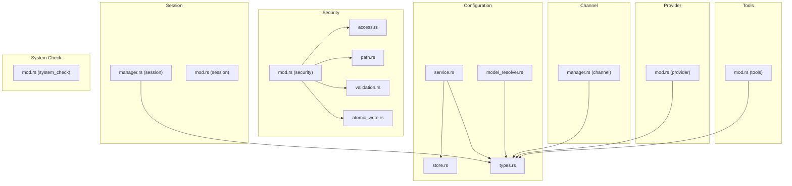
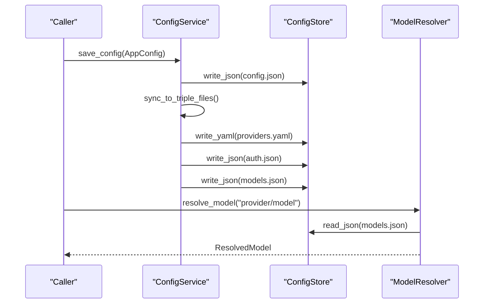
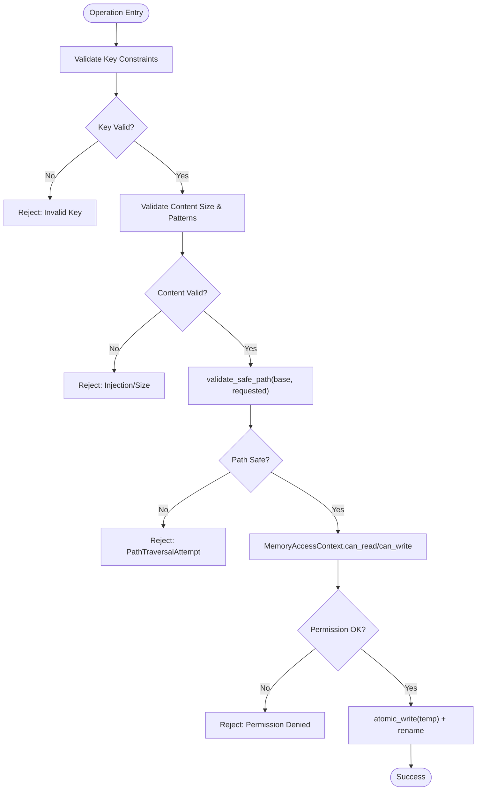
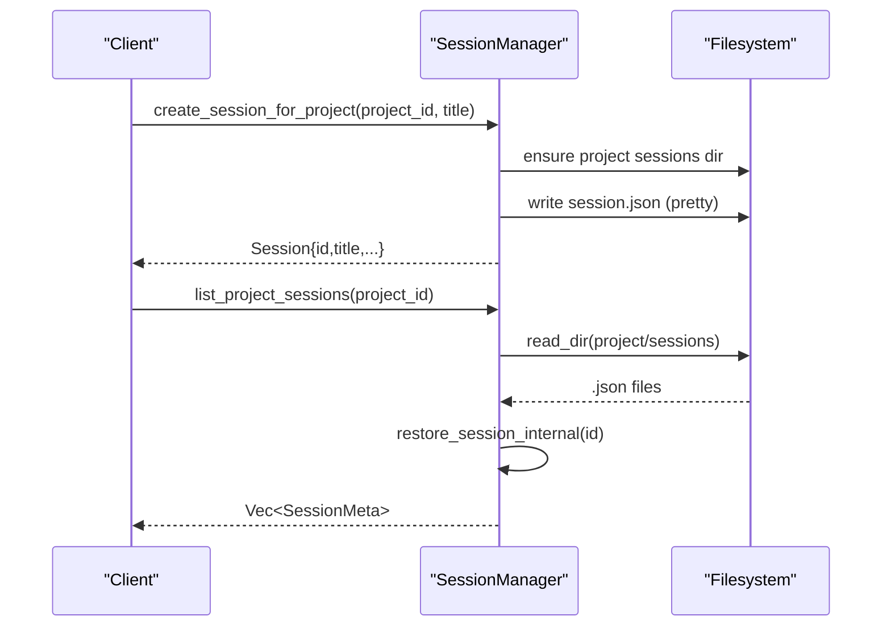
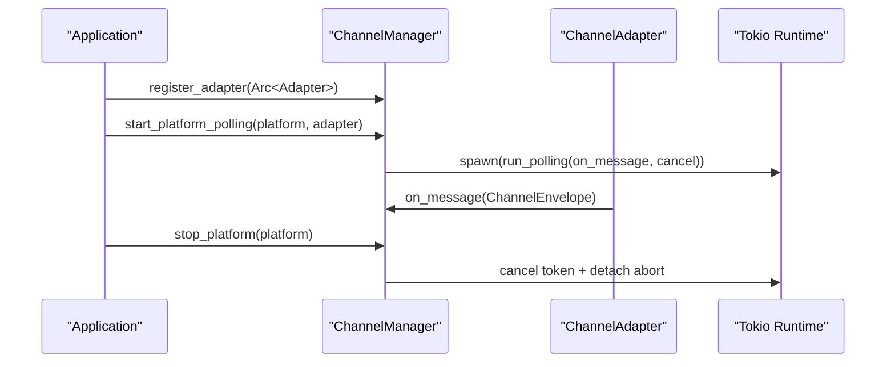
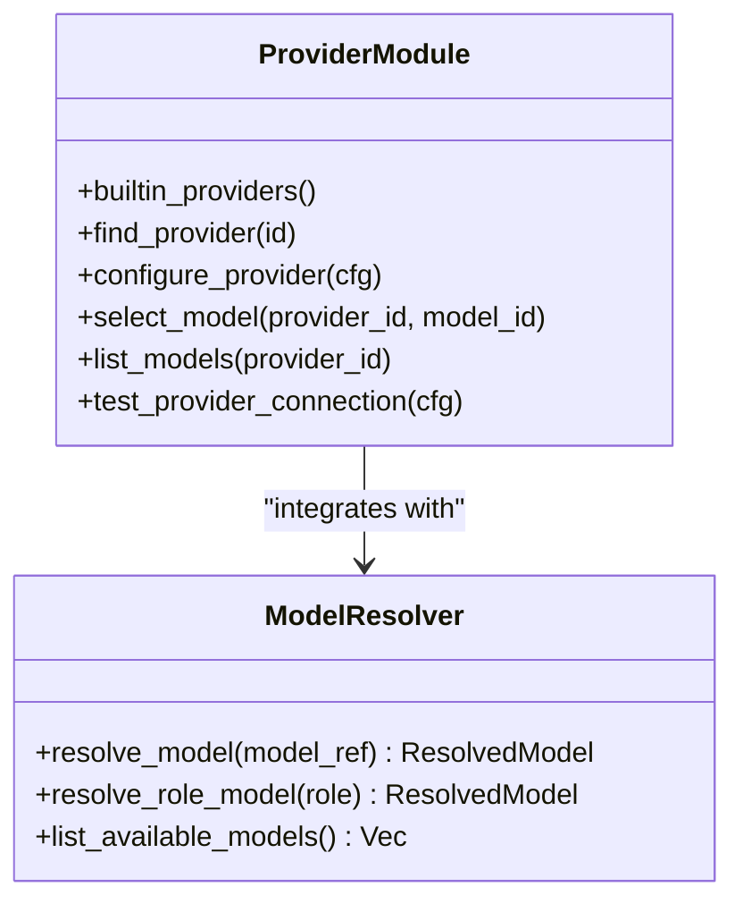
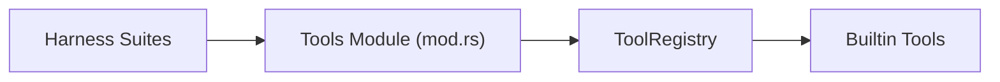
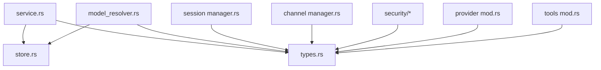

# Utility & Support Modules

<cite>
**Referenced Files in This Document**
- [model_resolver.rs](file://src-tauri/src/modules/config/model_resolver.rs)
- [types.rs](file://src-tauri/src/modules/config/types.rs)
- [store.rs](file://src-tauri/src/modules/config/store.rs)
- [service.rs](file://src-tauri/src/modules/config/service.rs)
- [access.rs](file://src-tauri/src/modules/security/access.rs)
- [atomic_write.rs](file://src-tauri/src/modules/security/atomic_write.rs)
- [path.rs](file://src-tauri/src/modules/security/path.rs)
- [validation.rs](file://src-tauri/src/modules/security/validation.rs)
- [mod.rs (security)](file://src-tauri/src/modules/security/mod.rs)
- [manager.rs (session)](file://src-tauri/src/modules/session/manager.rs)
- [mod.rs (session)](file://src-tauri/src/modules/session/mod.rs)
- [manager.rs (channel)](file://src-tauri/src/modules/channel/manager.rs)
- [mod.rs (provider)](file://src-tauri/src/modules/provider/mod.rs)
- [mod.rs (tools)](file://src-tauri/src/modules/tools/mod.rs)
- [mod.rs (system_check)](file://src-tauri/src/modules/system_check/mod.rs)
</cite>

## Table of Contents
1. [Introduction](#introduction)
2. [Project Structure](#project-structure)
3. [Core Components](#core-components)
4. [Architecture Overview](#architecture-overview)
5. [Detailed Component Analysis](#detailed-component-analysis)
6. [Dependency Analysis](#dependency-analysis)
7. [Performance Considerations](#performance-considerations)
8. [Troubleshooting Guide](#troubleshooting-guide)
9. [Conclusion](#conclusion)

## Introduction
This document explains the foundational utility and support modules that power configuration, security, session management, provider orchestration, tooling, and system checks across the system. It focuses on:
- Configuration bridge and service patterns
- Model resolver and provider registry
- Security access controls, path validation, and atomic write operations
- Session management and project-aware persistence
- Channel adapter lifecycle management
- Tool registry and harness testing frameworks
- Examples of configuration management, security enforcement, session handling, and system integration patterns

## Project Structure
The utility and support modules are organized by domain and responsibility:
- Configuration: model resolution, type definitions, store, and unified service
- Security: access control, path validation, input validation, atomic writes
- Session: JSON-backed persistence with project-aware paths
- Channel: dynamic adapter lifecycle management
- Provider: registry, client, service, and testing
- Tools: tool registry and builtin tool registration
- System Check: environment detection and model download

**Diagram sources**
- [model_resolver.rs:1-377](file://src-tauri/src/modules/config/model_resolver.rs#L1-L377)
- [types.rs:1-474](file://src-tauri/src/modules/config/types.rs#L1-L474)
- [store.rs:1-302](file://src-tauri/src/modules/config/store.rs#L1-L302)
- [service.rs:1-484](file://src-tauri/src/modules/config/service.rs#L1-L484)
- [access.rs:1-104](file://src-tauri/src/modules/security/access.rs#L1-L104)
- [path.rs:1-145](file://src-tauri/src/modules/security/path.rs#L1-L145)
- [validation.rs:1-142](file://src-tauri/src/modules/security/validation.rs#L1-L142)
- [atomic_write.rs:1-122](file://src-tauri/src/modules/security/atomic_write.rs#L1-L122)
- [manager.rs (session):1-967](file://src-tauri/src/modules/session/manager.rs#L1-L967)
- [manager.rs (channel):1-404](file://src-tauri/src/modules/channel/manager.rs#L1-L404)
- [mod.rs (provider):1-25](file://src-tauri/src/modules/provider/mod.rs#L1-L25)
- [mod.rs (tools):1-173](file://src-tauri/src/modules/tools/mod.rs#L1-L173)
- [mod.rs (system_check):1-13](file://src-tauri/src/modules/system_check/mod.rs#L1-L13)

**Section sources**
- [model_resolver.rs:1-377](file://src-tauri/src/modules/config/model_resolver.rs#L1-L377)
- [types.rs:1-474](file://src-tauri/src/modules/config/types.rs#L1-L474)
- [store.rs:1-302](file://src-tauri/src/modules/config/store.rs#L1-L302)
- [service.rs:1-484](file://src-tauri/src/modules/config/service.rs#L1-L484)
- [access.rs:1-104](file://src-tauri/src/modules/security/access.rs#L1-L104)
- [path.rs:1-145](file://src-tauri/src/modules/security/path.rs#L1-L145)
- [validation.rs:1-142](file://src-tauri/src/modules/security/validation.rs#L1-L142)
- [atomic_write.rs:1-122](file://src-tauri/src/modules/security/atomic_write.rs#L1-L122)
- [manager.rs (session):1-967](file://src-tauri/src/modules/session/manager.rs#L1-L967)
- [manager.rs (channel):1-404](file://src-tauri/src/modules/channel/manager.rs#L1-L404)
- [mod.rs (provider):1-25](file://src-tauri/src/modules/provider/mod.rs#L1-L25)
- [mod.rs (tools):1-173](file://src-tauri/src/modules/tools/mod.rs#L1-L173)
- [mod.rs (system_check):1-13](file://src-tauri/src/modules/system_check/mod.rs#L1-L13)

## Core Components
- Configuration bridge and service patterns
  - Unified service coordinates Layer 1 (single JSON) and Layer 2 (triple files) writes and migrations.
  - Store utilities provide atomic JSON/YAML writes with secure permissions and temp-file rename semantics.
  - Model resolver translates “provider_id/model_id” references to resolved provider details and supports role-based routing.
- Security access controls, path validation, and atomic write operations
  - Access control defines session/project contexts and read/write permissions.
  - Path validation prevents traversal attacks with canonicalization and ancestor walking.
  - Input validation enforces key and content constraints; atomic write ensures crash-safe file updates.
- Session management and project handling
  - Session manager persists sessions to JSON with project-aware paths and maintains metadata for listing and sorting.
- Channel adapter lifecycle management
  - Channel manager registers adapters, starts/stops polling tasks, and tracks cancellation tokens.
- Provider client, registry, and service management
  - Provider module exposes registry, client, service, and testing APIs for model discovery and connectivity.
- Tool registry and harness testing frameworks
  - Tools module registers builtin tools and exposes registry and context types for tool execution.
- System checking mechanisms
  - System check module provides environment detection and model download reporting.

**Section sources**
- [service.rs:1-484](file://src-tauri/src/modules/config/service.rs#L1-L484)
- [store.rs:1-302](file://src-tauri/src/modules/config/store.rs#L1-L302)
- [model_resolver.rs:1-377](file://src-tauri/src/modules/config/model_resolver.rs#L1-L377)
- [access.rs:1-104](file://src-tauri/src/modules/security/access.rs#L1-L104)
- [path.rs:1-145](file://src-tauri/src/modules/security/path.rs#L1-L145)
- [validation.rs:1-142](file://src-tauri/src/modules/security/validation.rs#L1-L142)
- [atomic_write.rs:1-122](file://src-tauri/src/modules/security/atomic_write.rs#L1-L122)
- [manager.rs (session):1-967](file://src-tauri/src/modules/session/manager.rs#L1-L967)
- [manager.rs (channel):1-404](file://src-tauri/src/modules/channel/manager.rs#L1-L404)
- [mod.rs (provider):1-25](file://src-tauri/src/modules/provider/mod.rs#L1-L25)
- [mod.rs (tools):1-173](file://src-tauri/src/modules/tools/mod.rs#L1-L173)
- [mod.rs (system_check):1-13](file://src-tauri/src/modules/system_check/mod.rs#L1-L13)

## Architecture Overview
The configuration subsystem uses a dual-layer design:
- Layer 1: a single JSON file for onboarding and runtime convenience
- Layer 2: three files (providers YAML, auth JSON, models JSON) for runtime resolution and provider-specific overrides

Security is layered:
- Input validation and sanitization
- Path validation against traversal attempts
- Access control matrices for memory categories
- Atomic writes for crash-safe persistence

Sessions are persisted to JSON with project-aware paths and metadata-driven sorting.

Channels are dynamically managed via a lifecycle manager that starts/stops polling tasks per adapter.

```mermaid
graph TB
CFG_SRV["ConfigService (service.rs)"]
CFG_STORE["ConfigStore (store.rs)"]
CFG_TYPES["Types (types.rs)"]
CFG_RES["ModelResolver (model_resolver.rs)"]
SEC_LAYER["Security Layer"]
SEC_ACCESS["Access Control (access.rs)"]
SEC_PATH["Path Validation (path.rs)"]
SEC_VALID["Input Validation (validation.rs)"]
SEC_ATOMIC["Atomic Write (atomic_write.rs)"]
SES_MGR["SessionManager (manager.rs)"]
CH_MGR["ChannelManager (manager.rs)"]
PROV_MOD["Provider Module (mod.rs)"]
TOOLS_MOD["Tools Module (mod.rs)"]
SYS_MOD["System Check (mod.rs)"]
CFG_SRV --> CFG_STORE
CFG_SRV --> CFG_TYPES
CFG_RES --> CFG_TYPES
SEC_LAYER --> SEC_ACCESS
SEC_LAYER --> SEC_PATH
SEC_LAYER --> SEC_VALID
SEC_LAYER --> SEC_ATOMIC
SES_MGR --> CFG_TYPES
CH_MGR --> CFG_TYPES
PROV_MOD --> CFG_TYPES
TOOLS_MOD --> CFG_TYPES
```

**Diagram sources**
- [service.rs:1-484](file://src-tauri/src/modules/config/service.rs#L1-L484)
- [store.rs:1-302](file://src-tauri/src/modules/config/store.rs#L1-L302)
- [types.rs:1-474](file://src-tauri/src/modules/config/types.rs#L1-L474)
- [model_resolver.rs:1-377](file://src-tauri/src/modules/config/model_resolver.rs#L1-L377)
- [access.rs:1-104](file://src-tauri/src/modules/security/access.rs#L1-L104)
- [path.rs:1-145](file://src-tauri/src/modules/security/path.rs#L1-L145)
- [validation.rs:1-142](file://src-tauri/src/modules/security/validation.rs#L1-L142)
- [atomic_write.rs:1-122](file://src-tauri/src/modules/security/atomic_write.rs#L1-L122)
- [manager.rs (session):1-967](file://src-tauri/src/modules/session/manager.rs#L1-L967)
- [manager.rs (channel):1-404](file://src-tauri/src/modules/channel/manager.rs#L1-L404)
- [mod.rs (provider):1-25](file://src-tauri/src/modules/provider/mod.rs#L1-L25)
- [mod.rs (tools):1-173](file://src-tauri/src/modules/tools/mod.rs#L1-L173)
- [mod.rs (system_check):1-13](file://src-tauri/src/modules/system_check/mod.rs#L1-L13)

## Detailed Component Analysis

### Configuration Bridge and Service Patterns
- Unified service
  - Loads and saves configuration with version migration and concurrency protection.
  - Dual-write: writes Layer 1 JSON and syncs to Layer 2 YAML/JSON triple files.
  - Persists onboarding state and supports resetting onboarding.
- Store utilities
  - Atomic JSON/YAML writes with temp-file extension and rename.
  - Enforces secure permissions (0600) on Unix systems.
  - Provides read helpers for optional files and typed deserialization.
- Model resolver
  - Parses “provider_id/model_id” references.
  - Resolves provider base URL, API key, and protocol from models JSON.
  - Supports role-based model routing with fallback chain.
  - Lists available models grouped by provider and integrates with builtin provider registry.

**Diagram sources**
- [service.rs:84-109](file://src-tauri/src/modules/config/service.rs#L84-L109)
- [store.rs:74-115](file://src-tauri/src/modules/config/store.rs#L74-L115)
- [model_resolver.rs:92-171](file://src-tauri/src/modules/config/model_resolver.rs#L92-L171)

**Section sources**
- [service.rs:1-484](file://src-tauri/src/modules/config/service.rs#L1-L484)
- [store.rs:1-302](file://src-tauri/src/modules/config/store.rs#L1-L302)
- [model_resolver.rs:1-377](file://src-tauri/src/modules/config/model_resolver.rs#L1-L377)

### Security Access Controls, Path Validation, and Atomic Writes
- Access control
  - Session context grants read/write privileges for conversation/daily categories.
  - Project context grants broader access including custom categories.
  - Permission checks are centralized in a context object.
- Path validation
  - Two-phase validation: when path exists and when it does not.
  - Canonicalization and ancestor walking ensure containment within base directory.
- Input validation
  - Enforces key constraints (length, allowed characters).
  - Limits content size and detects injection patterns.
- Atomic writes
  - Writes to temp file, syncs to disk, then renames to target.
  - JSON variant pretty-serializes and applies the same atomic rename.

**Diagram sources**
- [validation.rs:6-34](file://src-tauri/src/modules/security/validation.rs#L6-L34)
- [path.rs:10-78](file://src-tauri/src/modules/security/path.rs#L10-L78)
- [access.rs:9-58](file://src-tauri/src/modules/security/access.rs#L9-L58)
- [atomic_write.rs:16-45](file://src-tauri/src/modules/security/atomic_write.rs#L16-L45)

**Section sources**
- [access.rs:1-104](file://src-tauri/src/modules/security/access.rs#L1-L104)
- [path.rs:1-145](file://src-tauri/src/modules/security/path.rs#L1-L145)
- [validation.rs:1-142](file://src-tauri/src/modules/security/validation.rs#L1-L142)
- [atomic_write.rs:1-122](file://src-tauri/src/modules/security/atomic_write.rs#L1-L122)
- [mod.rs (security):1-26](file://src-tauri/src/modules/security/mod.rs#L1-L26)

### Session Management and Project Handling
- Session manager
  - Creates, restores, lists, saves, deletes sessions.
  - Supports project-scoped paths and legacy paths for backward compatibility.
  - Maintains metadata including pinned state, timestamps, and message counts.
  - Provides helpers for toggling memory and renaming sessions.
- Project-aware persistence
  - Uses project_id to route to nested sessions directory.
  - Legacy sessions live under a top-level sessions directory.

**Diagram sources**
- [manager.rs (session):355-454](file://src-tauri/src/modules/session/manager.rs#L355-L454)
- [manager.rs (session):456-521](file://src-tauri/src/modules/session/manager.rs#L456-L521)

**Section sources**
- [manager.rs (session):1-967](file://src-tauri/src/modules/session/manager.rs#L1-L967)
- [mod.rs (session):1-9](file://src-tauri/src/modules/session/mod.rs#L1-L9)

### Channel Adapter Lifecycle Management
- Channel manager
  - Registers adapters and tracks them by platform ID.
  - Starts/stops polling tasks with cancellation tokens.
  - Exposes handler to route all incoming messages.
  - Thread-safe via DashMap for adapters and tasks.

**Diagram sources**
- [manager.rs (channel):73-144](file://src-tauri/src/modules/channel/manager.rs#L73-L144)
- [manager.rs (channel):163-188](file://src-tauri/src/modules/channel/manager.rs#L163-L188)

**Section sources**
- [manager.rs (channel):1-404](file://src-tauri/src/modules/channel/manager.rs#L1-L404)

### Provider Client, Registry, and Service Management
- Provider module
  - Exposes registry, client, service, test, and types.
  - Provides list_providers, configure_provider, select_model, list_models, test_provider_connection.
- Integration points
  - Model resolver consumes provider registry and models JSON for runtime resolution.
  - Config service writes Layer 2 files used by runtime resolution.

**Diagram sources**
- [mod.rs (provider):14-25](file://src-tauri/src/modules/provider/mod.rs#L14-L25)
- [model_resolver.rs:204-258](file://src-tauri/src/modules/config/model_resolver.rs#L204-L258)

**Section sources**
- [mod.rs (provider):1-25](file://src-tauri/src/modules/provider/mod.rs#L1-L25)
- [model_resolver.rs:1-377](file://src-tauri/src/modules/config/model_resolver.rs#L1-L377)

### Tool Registry and Harness Testing Frameworks
- Tools module
  - Registers builtin tools (file ops, web search, memory, scheduler, skills, etc.).
  - Exposes registry, context, and toolset abstractions.
- Harness testing
  - Harness test suites define integration test plans and coverage for modules.

**Diagram sources**
- [mod.rs (tools):1-173](file://src-tauri/src/modules/tools/mod.rs#L1-L173)

**Section sources**
- [mod.rs (tools):1-173](file://src-tauri/src/modules/tools/mod.rs#L1-L173)

### System Checking Mechanisms
- System check module
  - Provides environment detection and model download reporting.
  - Supports onboarding runtime checks and diagnostics.

**Section sources**
- [mod.rs (system_check):1-13](file://src-tauri/src/modules/system_check/mod.rs#L1-L13)

## Dependency Analysis
- Configuration depends on store utilities for atomic writes and on types for schema definitions.
- Model resolver depends on types for parsing and on store for reading models JSON.
- Session manager depends on types for session metadata and on filesystem for persistence.
- Channel manager depends on types for platform configs and envelopes.
- Security module composes access, path, validation, and atomic write modules.
- Provider module integrates with configuration types and model resolver.

**Diagram sources**
- [service.rs:16-25](file://src-tauri/src/modules/config/service.rs#L16-L25)
- [model_resolver.rs:26-29](file://src-tauri/src/modules/config/model_resolver.rs#L26-L29)
- [store.rs:14-37](file://src-tauri/src/modules/config/store.rs#L14-L37)
- [types.rs:10-17](file://src-tauri/src/modules/config/types.rs#L10-L17)
- [manager.rs (session):14-14](file://src-tauri/src/modules/session/manager.rs#L14-L14)
- [manager.rs (channel):19-21](file://src-tauri/src/modules/channel/manager.rs#L19-L21)
- [mod.rs (security):12-25](file://src-tauri/src/modules/security/mod.rs#L12-L25)
- [mod.rs (provider):14-24](file://src-tauri/src/modules/provider/mod.rs#L14-L24)
- [mod.rs (tools):7-25](file://src-tauri/src/modules/tools/mod.rs#L7-L25)

**Section sources**
- [service.rs:1-484](file://src-tauri/src/modules/config/service.rs#L1-L484)
- [model_resolver.rs:1-377](file://src-tauri/src/modules/config/model_resolver.rs#L1-L377)
- [store.rs:1-302](file://src-tauri/src/modules/config/store.rs#L1-L302)
- [types.rs:1-474](file://src-tauri/src/modules/config/types.rs#L1-L474)
- [manager.rs (session):1-967](file://src-tauri/src/modules/session/manager.rs#L1-L967)
- [manager.rs (channel):1-404](file://src-tauri/src/modules/channel/manager.rs#L1-L404)
- [mod.rs (security):1-26](file://src-tauri/src/modules/security/mod.rs#L1-L26)
- [mod.rs (provider):1-25](file://src-tauri/src/modules/provider/mod.rs#L1-L25)
- [mod.rs (tools):1-173](file://src-tauri/src/modules/tools/mod.rs#L1-L173)

## Performance Considerations
- Atomic writes minimize partial file states and reduce recovery complexity.
- Canonicalized path validation avoids expensive symlink traversals and reduces risk of directory escapes.
- Concurrency protection in ConfigService prevents interleaved writes and race conditions.
- Project-aware session paths reduce contention by isolating sessions under project directories.

[No sources needed since this section provides general guidance]

## Troubleshooting Guide
- Configuration save failures
  - Check for write lock contention; ensure only one write operation at a time.
  - Verify Layer 1 and Layer 2 writes succeed; inspect temp-file rename outcomes.
- Model resolution errors
  - Confirm “provider_id/model_id” format and existence in models JSON.
  - Validate provider base URL and API key presence.
- Session persistence issues
  - Ensure project sessions directory exists; verify JSON serialization and pretty print.
  - Check legacy vs project-scoped paths when restoring sessions.
- Channel lifecycle problems
  - Confirm adapter registration and polling mode; verify cancellation tokens and task completion.
- Security violations
  - Review path traversal attempts and input validation failures.
  - Confirm access control checks for memory categories.

**Section sources**
- [service.rs:84-109](file://src-tauri/src/modules/config/service.rs#L84-L109)
- [model_resolver.rs:92-171](file://src-tauri/src/modules/config/model_resolver.rs#L92-L171)
- [manager.rs (session):522-556](file://src-tauri/src/modules/session/manager.rs#L522-L556)
- [manager.rs (channel):112-144](file://src-tauri/src/modules/channel/manager.rs#L112-L144)
- [path.rs:10-78](file://src-tauri/src/modules/security/path.rs#L10-L78)
- [validation.rs:6-34](file://src-tauri/src/modules/security/validation.rs#L6-L34)
- [access.rs:9-58](file://src-tauri/src/modules/security/access.rs#L9-L58)

## Conclusion
The utility and support modules establish a robust foundation for configuration, security, session management, provider orchestration, tooling, and system checks. Their design emphasizes atomicity, safety, and modularity, enabling reliable integration across the system. By leveraging the configuration bridge, model resolver, security primitives, and lifecycle managers, developers can implement secure, maintainable features with predictable behavior.