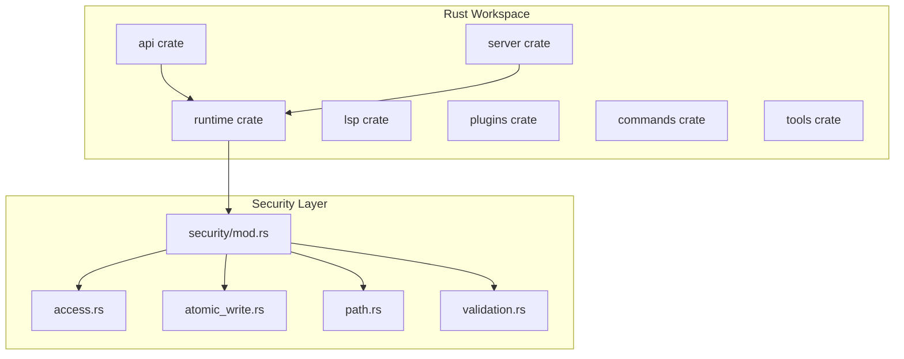
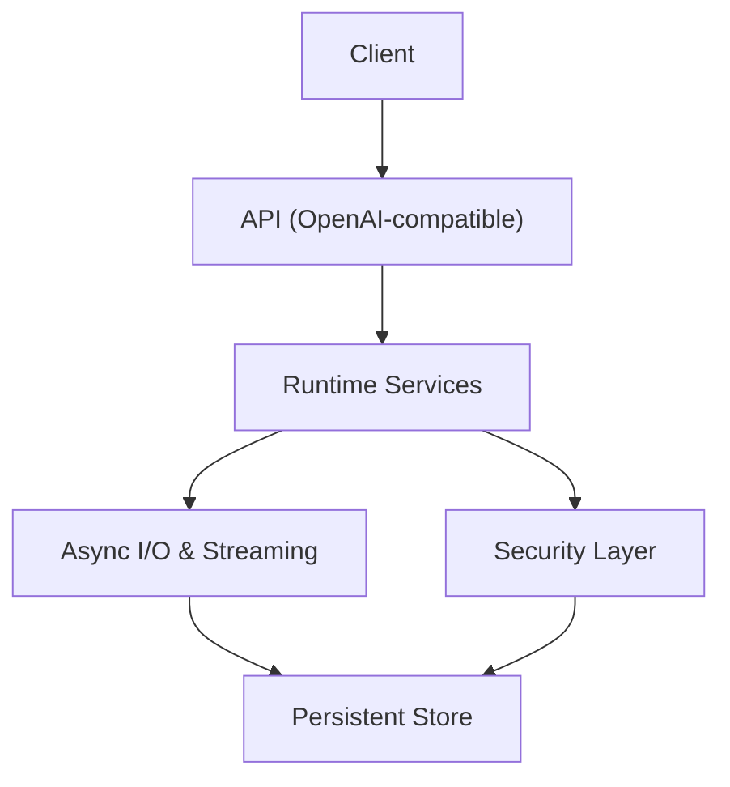
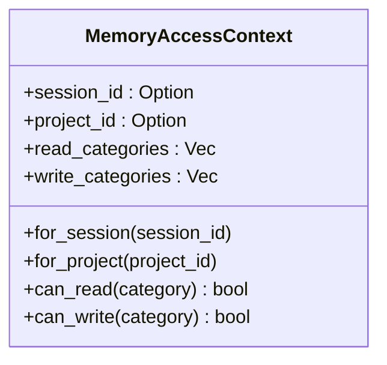
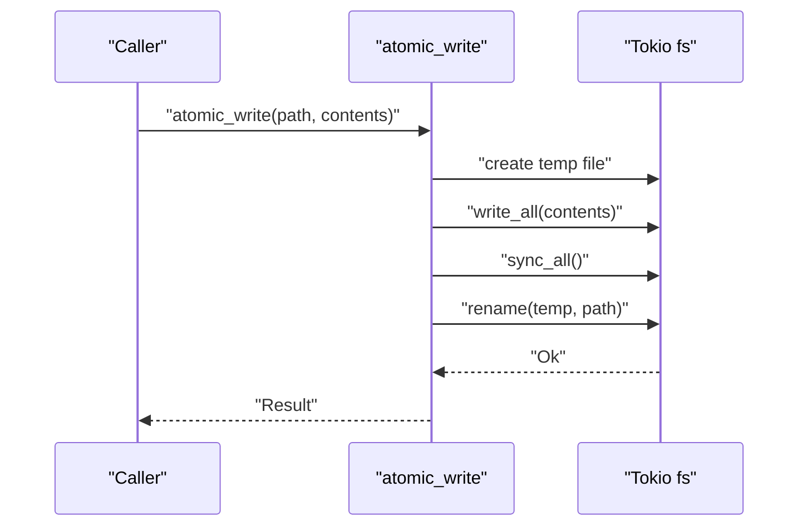
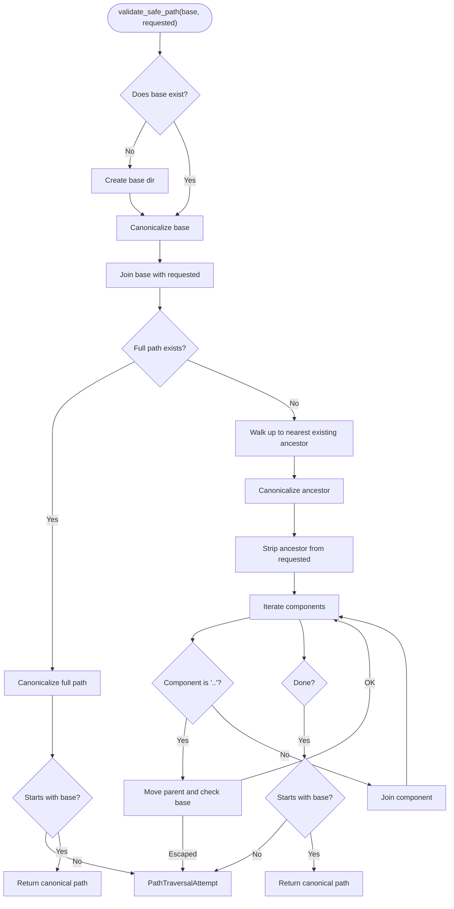
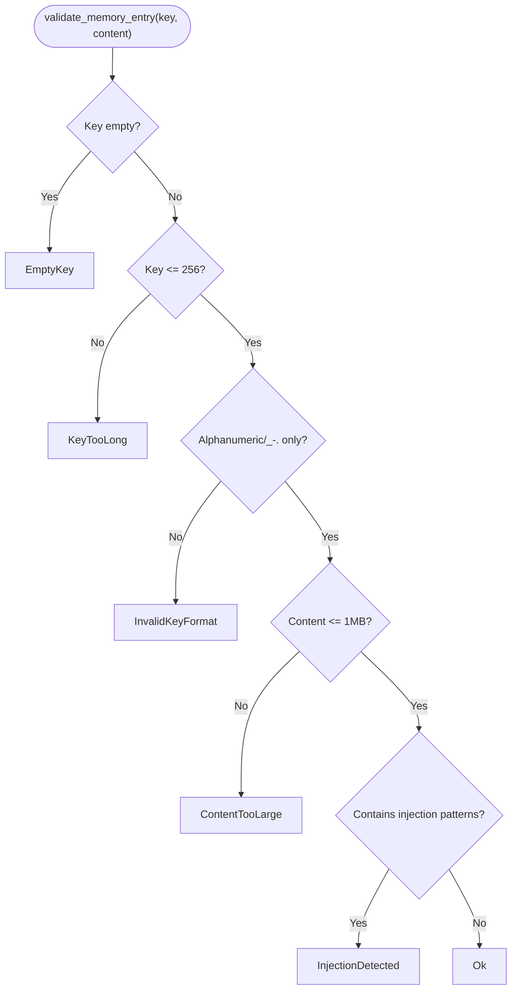
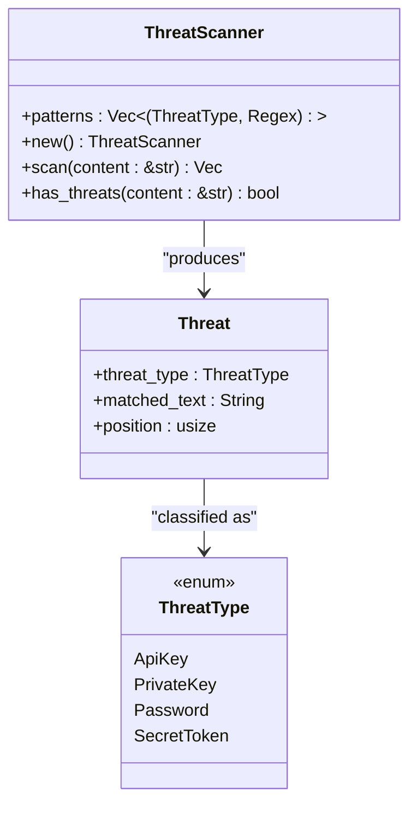
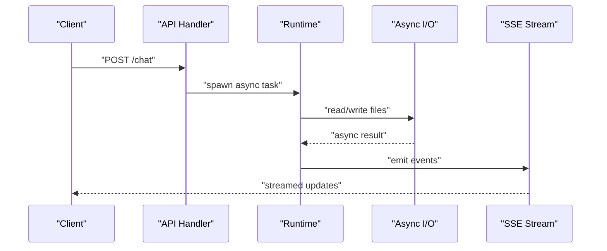
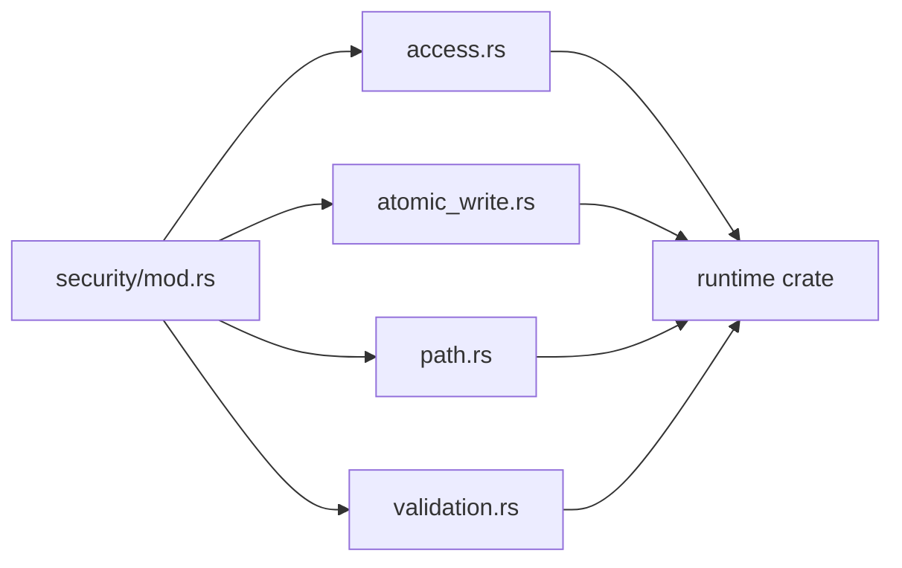

# Performance & Security Considerations

<cite>
**Referenced Files in This Document**
- [Cargo.toml](file://rust/Cargo.toml)
- [security/mod.rs](file://src-tauri/src/modules/security/mod.rs)
- [security/access.rs](file://src-tauri/src/modules/security/access.rs)
- [security/atomic_write.rs](file://src-tauri/src/modules/security/atomic_write.rs)
- [security/path.rs](file://src-tauri/src/modules/security/path.rs)
- [security/validation.rs](file://src-tauri/src/modules/security/validation.rs)
- [memory/security.rs](file://src-tauri/src/modules/memory/security.rs)
- [memory/security/scanner.rs](file://src-tauri/src/modules/memory/security/scanner.rs)
- [skills/guard/threat_patterns.rs](file://src-tauri/src/modules/skills/guard/threat_patterns.rs)
- [runtime/permissions.rs](file://rust/crates/runtime/src/permissions.rs)
- [runtime/session.rs](file://rust/crates/runtime/src/session.rs)
- [runtime/conversation.rs](file://rust/crates/runtime/src/conversation.rs)
- [runtime/sandbox.rs](file://rust/crates/runtime/src/sandbox.rs)
- [runtime/mcp.rs](file://rust/crates/runtime/src/mcp.rs)
- [runtime/mcp_client.rs](file://rust/crates/runtime/src/mcp_client.rs)
- [runtime/mcp_stdio.rs](file://rust/crates/runtime/src/mcp_stdio.rs)
- [runtime/oauth.rs](file://rust/crates/runtime/src/oauth.rs)
- [runtime/prompt.rs](file://rust/crates/runtime/src/prompt.rs)
- [runtime/json.rs](file://rust/crates/runtime/src/json.rs)
- [runtime/file_ops.rs](file://rust/crates/runtime/src/file_ops.rs)
- [runtime/sse.rs](file://rust/crates/runtime/src/sse.rs)
- [runtime/usage.rs](file://rust/crates/runtime/src/usage.rs)
- [runtime/bootstrap.rs](file://rust/crates/runtime/src/bootstrap.rs)
- [runtime/compact.rs](file://rust/crates/runtime/src/compact.rs)
- [runtime/hooks.rs](file://rust/crates/runtime/src/hooks.rs)
- [runtime/config.rs](file://rust/crates/runtime/src/config.rs)
- [runtime/remote.rs](file://rust/crates/runtime/src/remote.rs)
- [runtime/bash.rs](file://rust/crates/runtime/src/bash.rs)
- [runtime/compact.rs](file://rust/crates/runtime/src/compact.rs)
- [runtime/usage.rs](file://rust/crates/runtime/src/usage.rs)
- [runtime/json.rs](file://rust/crates/runtime/src/json.rs)
- [runtime/sse.rs](file://rust/crates/runtime/src/sse.rs)
- [runtime/file_ops.rs](file://rust/crates/runtime/src/file_ops.rs)
- [runtime/bootstrap.rs](file://rust/crates/runtime/src/bootstrap.rs)
- [runtime/hooks.rs](file://rust/crates/runtime/src/hooks.rs)
- [runtime/config.rs](file://rust/crates/runtime/src/config.rs)
- [runtime/remote.rs](file://rust/crates/runtime/src/remote.rs)
- [runtime/bash.rs](file://rust/crates/runtime/src/bash.rs)
- [runtime/permissions.rs](file://rust/crates/runtime/src/permissions.rs)
- [runtime/session.rs](file://rust/crates/runtime/src/session.rs)
- [runtime/conversation.rs](file://rust/crates/runtime/src/conversation.rs)
- [runtime/sandbox.rs](file://rust/crates/runtime/src/sandbox.rs)
- [runtime/mcp.rs](file://rust/crates/runtime/src/mcp.rs)
- [runtime/mcp_client.rs](file://rust/crates/runtime/src/mcp_client.rs)
- [runtime/mcp_stdio.rs](file://rust/crates/runtime/src/mcp_stdio.rs)
- [runtime/oauth.rs](file://rust/crates/runtime/src/oauth.rs)
- [runtime/prompt.rs](file://rust/crates/runtime/src/prompt.rs)
- [runtime/json.rs](file://rust/crates/runtime/src/json.rs)
- [runtime/file_ops.rs](file://rust/crates/runtime/src/file_ops.rs)
- [runtime/sse.rs](file://rust/crates/runtime/src/sse.rs)
- [runtime/usage.rs](file://rust/crates/runtime/src/usage.rs)
- [runtime/bootstrap.rs](file://rust/crates/runtime/src/bootstrap.rs)
- [runtime/compact.rs](file://rust/crates/runtime/src/compact.rs)
- [runtime/hooks.rs](file://rust/crates/runtime/src/hooks.rs)
- [runtime/config.rs](file://rust/crates/runtime/src/config.rs)
- [runtime/remote.rs](file://rust/crates/runtime/src/remote.rs)
- [runtime/bash.rs](file://rust/crates/runtime/src/bash.rs)
</cite>

## Table of Contents
1. [Introduction](#introduction)
2. [Project Structure](#project-structure)
3. [Core Components](#core-components)
4. [Architecture Overview](#architecture-overview)
5. [Detailed Component Analysis](#detailed-component-analysis)
6. [Dependency Analysis](#dependency-analysis)
7. [Performance Considerations](#performance-considerations)
8. [Troubleshooting Guide](#troubleshooting-guide)
9. [Conclusion](#conclusion)

## Introduction
This document focuses on performance optimization and security implementation in the Rust backend of the project. It covers memory management strategies, asynchronous processing patterns, resource utilization optimization, and the integrated threat scanning and security architecture. It also explains access control, input validation, and defensive programming practices, with emphasis on Rust’s memory safety guarantees, concurrency patterns, and the security implications of system-level operations.

## Project Structure
The Rust backend is organized as a workspace with multiple crates:
- api: OpenAI-compatible API and SSE streaming
- runtime: Core runtime services, MCP integration, sandboxing, permissions, sessions, conversations, and I/O helpers
- server: HTTP server glue
- lsp, plugins, commands, tools: auxiliary modules

Security is implemented across the Tauri application under src-tauri/src/modules/security and integrated into runtime and memory subsystems.

**Diagram sources**
- [Cargo.toml:1-24](file://rust/Cargo.toml#L1-L24)
- [security/mod.rs:1-26](file://src-tauri/src/modules/security/mod.rs#L1-L26)
- [security/access.rs:1-104](file://src-tauri/src/modules/security/access.rs#L1-L104)
- [security/atomic_write.rs:1-122](file://src-tauri/src/modules/security/atomic_write.rs#L1-L122)
- [security/path.rs:1-145](file://src-tauri/src/modules/security/path.rs#L1-L145)
- [security/validation.rs:1-142](file://src-tauri/src/modules/security/validation.rs#L1-L142)

**Section sources**
- [Cargo.toml:1-24](file://rust/Cargo.toml#L1-L24)

## Core Components
- Security module: Provides layered defenses for memory operations via access control, path validation, atomic writes, and input validation.
- Runtime: Implements concurrency primitives, sandboxing, MCP integration, and I/O helpers optimized for async workloads.
- Threat scanning: Detects sensitive patterns in memory content and skill artifacts to prevent accidental exposure of secrets.

Key implementation patterns:
- Atomic writes ensure crash-safety for persisted state.
- Path validation prevents traversal and escapes.
- Input validation enforces key and content constraints and blocks injection attempts.
- Access control limits read/write categories per session/project.
- Async I/O and streaming support efficient resource utilization.

**Section sources**
- [security/mod.rs:1-26](file://src-tauri/src/modules/security/mod.rs#L1-L26)
- [security/access.rs:1-104](file://src-tauri/src/modules/security/access.rs#L1-L104)
- [security/atomic_write.rs:1-122](file://src-tauri/src/modules/security/atomic_write.rs#L1-L122)
- [security/path.rs:1-145](file://src-tauri/src/modules/security/path.rs#L1-L145)
- [security/validation.rs:1-142](file://src-tauri/src/modules/security/validation.rs#L1-L142)

## Architecture Overview
The backend integrates security and performance-conscious runtime services. Async I/O and streaming are central to resource efficiency, while strict validation and atomic persistence protect data integrity.

[No sources needed since this diagram shows conceptual workflow, not actual code structure]

## Detailed Component Analysis

### Security Module: Access Control
- Purpose: Enforce category-based permissions for memory reads/writes scoped to sessions or projects.
- Behavior: Predefined read/write categories per context; checks performed before mutating memory.

**Diagram sources**
- [security/access.rs:8-58](file://src-tauri/src/modules/security/access.rs#L8-L58)

**Section sources**
- [security/access.rs:1-104](file://src-tauri/src/modules/security/access.rs#L1-L104)

### Security Module: Atomic Writes
- Purpose: Crash-safe file updates using temporary files and atomic rename.
- Behavior: Write to a temporary file, flush to disk, then atomically replace the target.

**Diagram sources**
- [security/atomic_write.rs:16-45](file://src-tauri/src/modules/security/atomic_write.rs#L16-L45)

**Section sources**
- [security/atomic_write.rs:1-122](file://src-tauri/src/modules/security/atomic_write.rs#L1-L122)

### Security Module: Path Validation
- Purpose: Prevent path traversal and escape attempts by validating against a base directory.
- Behavior: Canonicalize paths, reject escapes, and ensure safe creation of memory database path.

**Diagram sources**
- [security/path.rs:10-78](file://src-tauri/src/modules/security/path.rs#L10-L78)

**Section sources**
- [security/path.rs:1-145](file://src-tauri/src/modules/security/path.rs#L1-L145)

### Security Module: Input Validation
- Purpose: Validate and sanitize memory entry keys and content to prevent injection and enforce size limits.
- Behavior: Enforces key constraints, content length limits, and detects XSS/template injection patterns.

**Diagram sources**
- [security/validation.rs:6-34](file://src-tauri/src/modules/security/validation.rs#L6-L34)

**Section sources**
- [security/validation.rs:1-142](file://src-tauri/src/modules/security/validation.rs#L1-L142)

### Threat Scanning System
- Purpose: Detect sensitive patterns in memory content and skill artifacts to prevent accidental exposure of secrets.
- Implementation: Regex-based scanner with predefined patterns for API keys, private keys, passwords, and tokens.

**Diagram sources**
- [memory/security/scanner.rs:335-371](file://src-tauri/src/modules/memory/security/scanner.rs#L335-L371)

**Section sources**
- [memory/security/scanner.rs:313-372](file://src-tauri/src/modules/memory/security/scanner.rs#L313-L372)
- [memory/security.rs:34-76](file://src-tauri/src/modules/memory/security.rs#L34-L76)
- [skills/guard/threat_patterns.rs:67-89](file://src-tauri/src/modules/skills/guard/threat_patterns.rs#L67-L89)

### Runtime Concurrency and Async Patterns
- Async I/O: Tokio-based file operations and streaming enable efficient handling of concurrent requests.
- SSE streaming: Real-time event delivery to clients with backpressure-aware sinks.
- Sandboxing: Controlled execution environments for external commands and MCP integrations.
- Permissions: Fine-grained access control enforced at runtime boundaries.

**Diagram sources**
- [runtime/sse.rs:1-200](file://rust/crates/runtime/src/sse.rs)
- [runtime/file_ops.rs:1-200](file://rust/crates/runtime/src/file_ops.rs)
- [runtime/conversation.rs:1-200](file://rust/crates/runtime/src/conversation.rs)

**Section sources**
- [runtime/sse.rs:1-200](file://rust/crates/runtime/src/sse.rs)
- [runtime/file_ops.rs:1-200](file://rust/crates/runtime/src/file_ops.rs)
- [runtime/conversation.rs:1-200](file://rust/crates/runtime/src/conversation.rs)

### Memory Management Strategies
- Atomic writes and path validation reduce I/O contention and ensure durability without partial states.
- Async I/O minimizes blocking and improves throughput under load.
- JSON serialization helpers provide structured persistence with pretty-printing for readability and auditability.

**Section sources**
- [security/atomic_write.rs:47-55](file://src-tauri/src/modules/security/atomic_write.rs#L47-L55)
- [runtime/json.rs:1-200](file://rust/crates/runtime/src/json.rs)

## Dependency Analysis
The security module is re-exported and consumed by runtime and memory subsystems. The workspace lints forbid unsafe code, promoting memory safety across crates.

**Diagram sources**
- [security/mod.rs:17-25](file://src-tauri/src/modules/security/mod.rs#L17-L25)

**Section sources**
- [Cargo.toml:15-24](file://rust/Cargo.toml#L15-L24)
- [security/mod.rs:1-26](file://src-tauri/src/modules/security/mod.rs#L1-L26)

## Performance Considerations
- Favor async I/O and streaming to avoid blocking threads and reduce latency.
- Use atomic writes for critical state to minimize retries and improve reliability.
- Apply input validation early to fail fast and reduce downstream processing costs.
- Limit memory growth by enforcing content size caps and periodic compaction.
- Profile hotspots using async-aware profilers and optimize I/O-heavy paths.
- Leverage concurrency primitives judiciously; avoid oversubscription of CPU and disk.

[No sources needed since this section provides general guidance]

## Troubleshooting Guide
Common issues and mitigations:
- Path traversal errors: Ensure base directories exist and validate all paths through the security layer.
- Atomic write failures: Verify filesystem permissions and disk availability; confirm sync operations succeed.
- Validation errors: Review key naming conventions and content constraints; sanitize inputs before persistence.
- Permission denials: Confirm session/project contexts align with intended categories; adjust access policies accordingly.
- SSE connection drops: Implement retry logic and handle backpressure gracefully.

**Section sources**
- [security/path.rs:92-106](file://src-tauri/src/modules/security/path.rs#L92-L106)
- [security/atomic_write.rs:57-65](file://src-tauri/src/modules/security/atomic_write.rs#L57-L65)
- [security/validation.rs:51-68](file://src-tauri/src/modules/security/validation.rs#L51-L68)
- [security/access.rs:49-57](file://src-tauri/src/modules/security/access.rs#L49-L57)

## Conclusion
The Rust backend employs a layered security model with atomic writes, path validation, input sanitization, and access control, combined with robust async I/O and streaming for performance. The threat scanning system complements these controls by detecting sensitive patterns in memory and skill artifacts. Together, these mechanisms deliver memory safety, resilience, and strong defensive programming practices suitable for system-level operations.