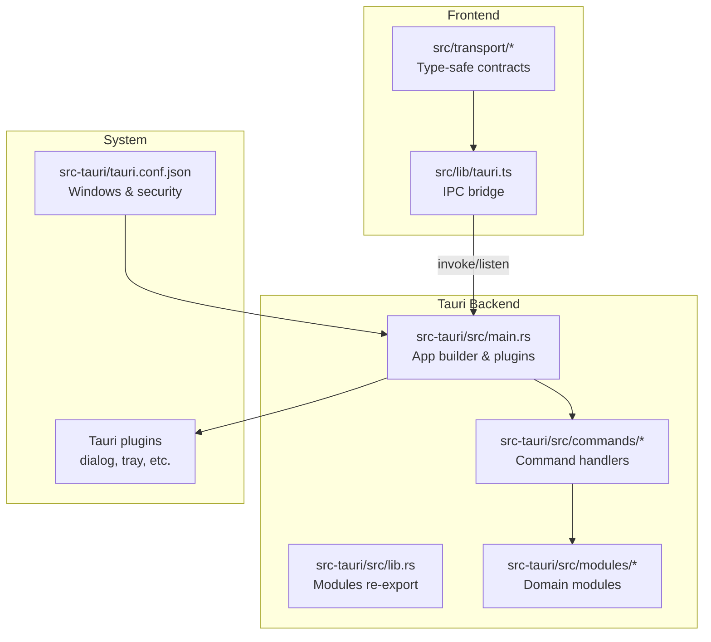
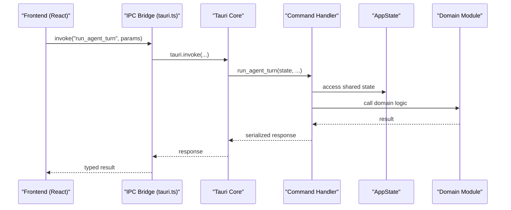
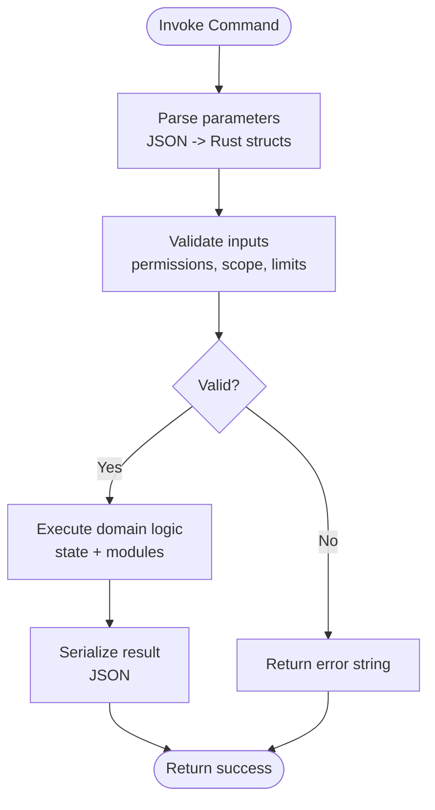
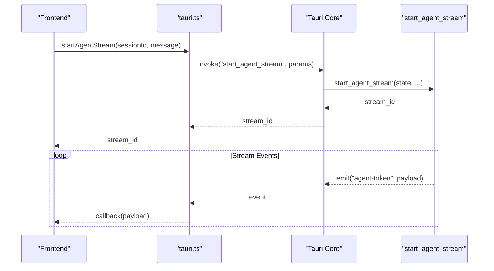
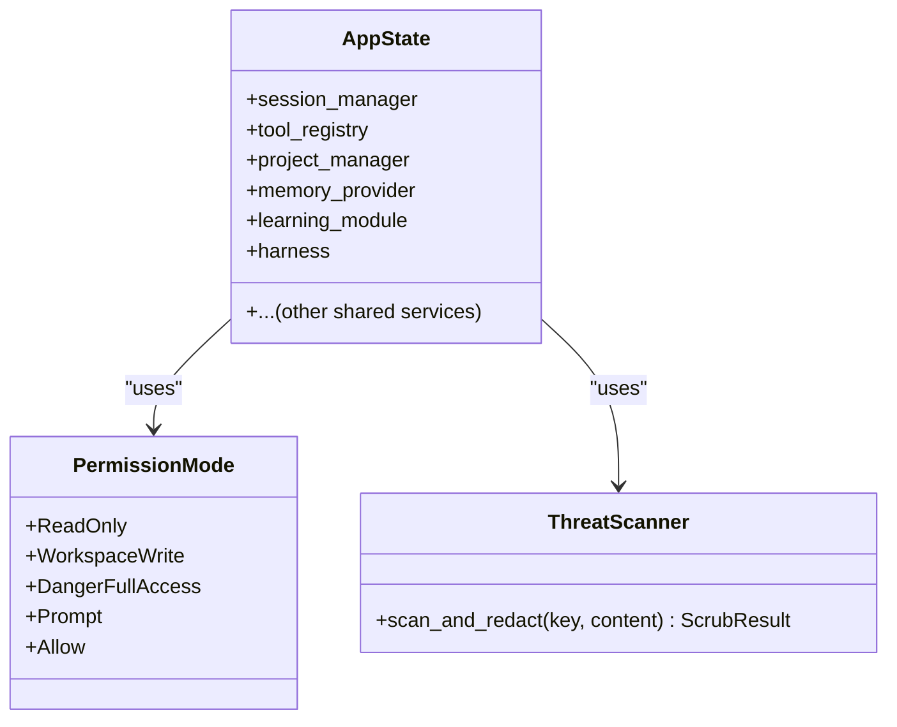
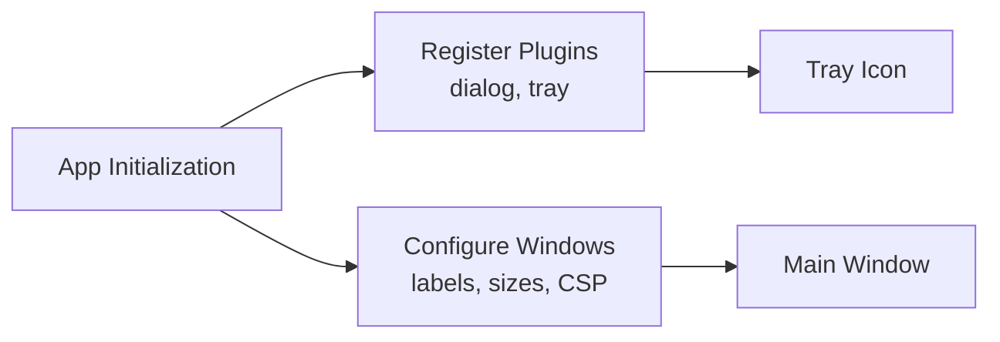
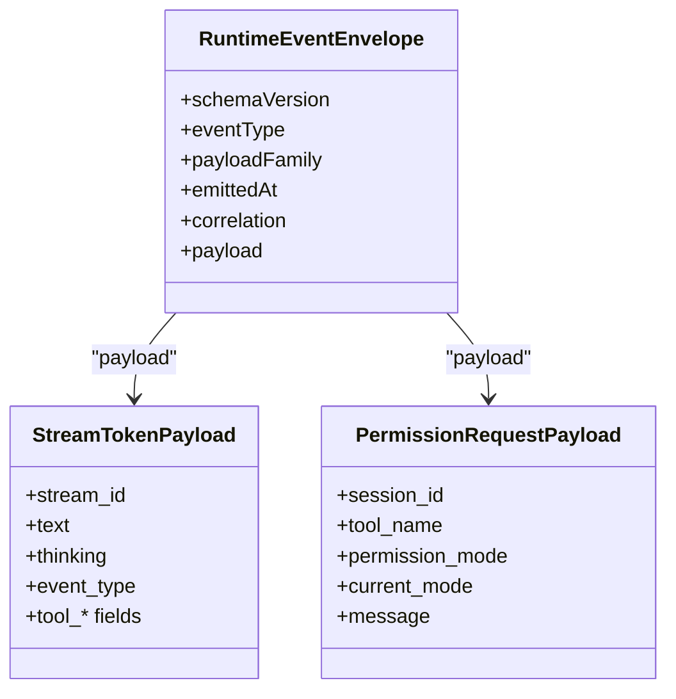
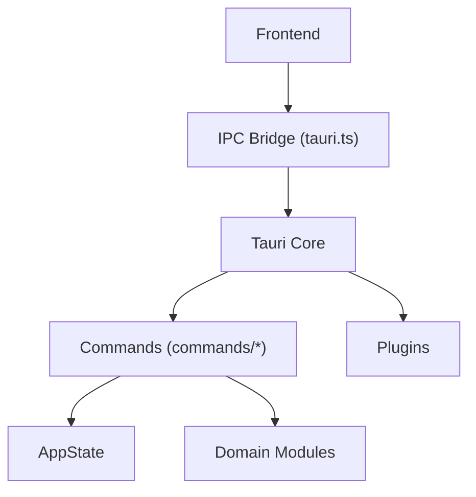

# Tauri Integration & IPC

<cite>
**Referenced Files in This Document**
- [Cargo.toml](file://src-tauri/Cargo.toml)
- [tauri.conf.json](file://src-tauri/tauri.conf.json)
- [main.rs](file://src-tauri/src/main.rs)
- [lib.rs](file://src-tauri/src/lib.rs)
- [commands/mod.rs](file://src-tauri/src/commands/mod.rs)
- [commands/agent.rs](file://src-tauri/src/commands/agent.rs)
- [commands/memory.rs](file://src-tauri/src/commands/memory.rs)
- [commands/tools.rs](file://src-tauri/src/commands/tools.rs)
- [modules/runtime/permissions.rs](file://src-tauri/src/modules/runtime/permissions.rs)
- [modules/memory/security.rs](file://src-tauri/src/modules/memory/security.rs)
- [tauri.ts](file://src/lib/tauri.ts)
- [transport/index.ts](file://src/transport/index.ts)
- [transport/contracts.ts](file://src/transport/contracts.ts)
</cite>

## Table of Contents
1. [Introduction](#introduction)
2. [Project Structure](#project-structure)
3. [Core Components](#core-components)
4. [Architecture Overview](#architecture-overview)
5. [Detailed Component Analysis](#detailed-component-analysis)
6. [Dependency Analysis](#dependency-analysis)
7. [Performance Considerations](#performance-considerations)
8. [Troubleshooting Guide](#troubleshooting-guide)
9. [Conclusion](#conclusion)

## Introduction
This document explains how Tauri 2.0 integrates the React frontend with the Rust backend to enable seamless inter-process communication (IPC). It details the command registration pattern, parameter serialization/deserialization, error propagation, Tauri plugin architecture, window management, and system-level integrations. Practical examples demonstrate frontend-to-backend communication, and guidance is provided for debugging, security, and performance.

## Project Structure
The Tauri integration spans three layers:
- Frontend (React): Thin IPC bridge and transport contracts
- Tauri backend (Rust): Command handlers and application state
- System integrations: Plugins, dialogs, and window management

**Diagram sources**
- [main.rs:784-800](file://src-tauri/src/main.rs#L784-L800)
- [lib.rs:1-23](file://src-tauri/src/lib.rs#L1-L23)
- [tauri.conf.json:1-57](file://src-tauri/tauri.conf.json#L1-L57)

**Section sources**
- [Cargo.toml:1-161](file://src-tauri/Cargo.toml#L1-L161)
- [tauri.conf.json:1-57](file://src-tauri/tauri.conf.json#L1-L57)
- [main.rs:784-800](file://src-tauri/src/main.rs#L784-L800)
- [lib.rs:1-23](file://src-tauri/src/lib.rs#L1-L23)

## Core Components
- IPC Bridge: Frontend calls invoke() and listens to events via a typed wrapper.
- Command Handlers: Rust #[tauri::command] functions exposed to the frontend.
- Application State: Shared state container passed to commands via Tauri’s state management.
- Transport Contracts: Canonical TypeScript types for IPC payloads and events.
- Permissions & Security: Permission policies and PII scrubbing for safe memory writes.

**Section sources**
- [tauri.ts:1-800](file://src/lib/tauri.ts#L1-L800)
- [transport/contracts.ts:1-539](file://src/transport/contracts.ts#L1-L539)
- [commands/mod.rs:1-418](file://src-tauri/src/commands/mod.rs#L1-L418)
- [modules/runtime/permissions.rs:1-248](file://src-tauri/src/modules/runtime/permissions.rs#L1-L248)
- [modules/memory/security.rs:1-593](file://src-tauri/src/modules/memory/security.rs#L1-L593)

## Architecture Overview
The backend initializes application state, registers Tauri plugins, and exposes commands. The frontend invokes commands and subscribes to events. Commands operate on shared state and domain modules, returning serialized results to the frontend.

**Diagram sources**
- [tauri.ts:202-212](file://src/lib/tauri.ts#L202-L212)
- [commands/agent.rs:164-172](file://src-tauri/src/commands/agent.rs#L164-L172)
- [commands/mod.rs:288-290](file://src-tauri/src/commands/mod.rs#L288-L290)

**Section sources**
- [main.rs:784-800](file://src-tauri/src/main.rs#L784-L800)
- [commands/agent.rs:164-172](file://src-tauri/src/commands/agent.rs#L164-L172)
- [tauri.ts:202-212](file://src/lib/tauri.ts#L202-L212)

## Detailed Component Analysis

### IPC Command System
- Command Registration: Each command is a #[tauri::command] function in a module under src-tauri/src/commands/. The commands/mod.rs re-exports them for use in main.rs.
- Parameter Serialization: Parameters are automatically serialized/deserialized by Tauri using serde. Complex types are defined in the commands modules and transported as JSON.
- Error Propagation: Commands return Result<T, String> where String becomes the error payload on the frontend. The frontend receives a string error message for user-friendly display.

**Diagram sources**
- [commands/agent.rs:164-172](file://src-tauri/src/commands/agent.rs#L164-L172)
- [commands/tools.rs:131-140](file://src-tauri/src/commands/tools.rs#L131-L140)

**Section sources**
- [commands/mod.rs:288-418](file://src-tauri/src/commands/mod.rs#L288-L418)
- [commands/agent.rs:164-172](file://src-tauri/src/commands/agent.rs#L164-L172)
- [commands/tools.rs:131-140](file://src-tauri/src/commands/tools.rs#L131-L140)

### Frontend-to-Backend Communication Patterns
- Typed IPC Bridge: The frontend calls typed wrappers around tauri.invoke and tauri.listen. Examples include runAgentTurn, startAgentStream, executeTool, and memory_recall.
- Event Streaming: Long-running operations emit events (e.g., agent-token) that the frontend listens to. The bridge provides convenience listeners for token streams and permission requests.
- Transport Contracts: Canonical TypeScript types define wire shapes for envelopes, memory events, stream tokens, and permission requests.

**Diagram sources**
- [tauri.ts:221-231](file://src/lib/tauri.ts#L221-L231)
- [tauri.ts:248-265](file://src/lib/tauri.ts#L248-L265)
- [commands/agent.rs:737-744](file://src-tauri/src/commands/agent.rs#L737-L744)

**Section sources**
- [tauri.ts:221-231](file://src/lib/tauri.ts#L221-L231)
- [tauri.ts:248-265](file://src/lib/tauri.ts#L248-L265)
- [commands/agent.rs:737-744](file://src-tauri/src/commands/agent.rs#L737-L744)

### Command Definitions and Examples
- Agent Commands: run_agent_turn returns a structured response; start_agent_stream returns a stream_id and emits token events.
- Tool Commands: execute_tool validates JSON args, enforces permission policy, and executes tools via the tool registry.
- Memory Commands: memory_recall, memory_delete, memory_export, memory_promote/demote, memory_compile_now, memory_compiled_read, memory_compiled_clear.

Practical examples (paths only):
- [run_agent_turn:164-172](file://src-tauri/src/commands/agent.rs#L164-L172)
- [start_agent_stream:737-744](file://src-tauri/src/commands/agent.rs#L737-L744)
- [execute_tool:131-140](file://src-tauri/src/commands/tools.rs#L131-L140)
- [memory_recall:142-151](file://src-tauri/src/commands/memory.rs#L142-L151)
- [memory_promote:298-304](file://src-tauri/src/commands/memory.rs#L298-L304)

**Section sources**
- [commands/agent.rs:164-172](file://src-tauri/src/commands/agent.rs#L164-L172)
- [commands/agent.rs:737-744](file://src-tauri/src/commands/agent.rs#L737-L744)
- [commands/tools.rs:131-140](file://src-tauri/src/commands/tools.rs#L131-L140)
- [commands/memory.rs:142-151](file://src-tauri/src/commands/memory.rs#L142-L151)
- [commands/memory.rs:298-304](file://src-tauri/src/commands/memory.rs#L298-L304)

### Application State and Shared Services
- AppState: Holds shared services (session manager, tool registry, memory provider, learning module, harness, etc.). Commands receive it via Tauri’s State.
- Permission Management: PermissionMode and PermissionPolicy govern tool execution safety and escalation.
- Security: ThreatScanner scans and redacts PII before memory writes.

**Diagram sources**
- [commands/mod.rs:28-169](file://src-tauri/src/commands/mod.rs#L28-L169)
- [modules/runtime/permissions.rs:1-150](file://src-tauri/src/modules/runtime/permissions.rs#L1-L150)
- [modules/memory/security.rs:209-305](file://src-tauri/src/modules/memory/security.rs#L209-L305)

**Section sources**
- [commands/mod.rs:28-169](file://src-tauri/src/commands/mod.rs#L28-L169)
- [modules/runtime/permissions.rs:1-150](file://src-tauri/src/modules/runtime/permissions.rs#L1-L150)
- [modules/memory/security.rs:209-305](file://src-tauri/src/modules/memory/security.rs#L209-L305)

### Tauri Plugin Architecture and Window Management
- Plugins: Dialog plugin is registered during app initialization.
- Windows: Defined in tauri.conf.json with properties like title, size, resizable, backgroundColor, and tray icon.
- Tray Icon: Configured centrally for system-level integration.

**Diagram sources**
- [main.rs:784-786](file://src-tauri/src/main.rs#L784-L786)
- [tauri.conf.json:12-37](file://src-tauri/tauri.conf.json#L12-L37)

**Section sources**
- [main.rs:784-786](file://src-tauri/src/main.rs#L784-L786)
- [tauri.conf.json:12-37](file://src-tauri/tauri.conf.json#L12-L37)

### Transport Contracts and Event Types
- Canonical Envelopes: Every runtime-emitted event is wrapped with schemaVersion, eventType, payloadFamily, emittedAt, and correlation IDs.
- Event Families: conversation, tool, permission, memory, activation, execution_mode, harness, system.
- Wire Shapes: StreamTokenPayload, MemoryEventPayload, PermissionRequestPayload, and others define the transport contract.

**Diagram sources**
- [transport/contracts.ts:61-73](file://src/transport/contracts.ts#L61-L73)
- [transport/contracts.ts:338-367](file://src/transport/contracts.ts#L338-L367)
- [transport/contracts.ts:369-377](file://src/transport/contracts.ts#L369-L377)

**Section sources**
- [transport/contracts.ts:61-73](file://src/transport/contracts.ts#L61-L73)
- [transport/contracts.ts:338-367](file://src/transport/contracts.ts#L338-L367)
- [transport/contracts.ts:369-377](file://src/transport/contracts.ts#L369-L377)

## Dependency Analysis
- Frontend depends on the IPC bridge and transport contracts.
- Backend depends on Tauri core, serde for serialization, and domain modules.
- Commands depend on AppState and domain modules for business logic.
- Plugins extend system-level capabilities (dialogs, tray).

**Diagram sources**
- [tauri.ts:1-800](file://src/lib/tauri.ts#L1-L800)
- [commands/mod.rs:1-418](file://src-tauri/src/commands/mod.rs#L1-L418)
- [main.rs:784-786](file://src-tauri/src/main.rs#L784-L786)

**Section sources**
- [tauri.ts:1-800](file://src/lib/tauri.ts#L1-L800)
- [commands/mod.rs:1-418](file://src-tauri/src/commands/mod.rs#L1-L418)
- [main.rs:784-786](file://src-tauri/src/main.rs#L784-L786)

## Performance Considerations
- Serialization overhead: Prefer compact payloads and avoid excessive nesting in IPC parameters.
- Streaming: Use event-based streaming for long-running operations to reduce latency and memory pressure.
- Background tasks: Offload heavy work to background threads or async tasks; keep the main thread responsive.
- Caching: Reuse compiled regex patterns and shared providers to minimize initialization costs.
- Memory: Use scoped memory APIs and avoid retaining large objects in state unnecessarily.

## Troubleshooting Guide
- Command errors: Inspect the error string returned by commands for user-friendly messages. Common causes include permission denials, invalid inputs, or provider connectivity issues.
- Permission prompts: If a tool requires escalation, the backend emits a permission-request event; ensure the frontend listens and responds appropriately.
- Logging: The backend initializes a rolling file logger; check backend.log for detailed traces.
- Network timeouts: The agent runtime surfaces friendly messages for common network errors (DNS, timeouts, 429/5xx).

**Section sources**
- [commands/agent.rs:664-721](file://src-tauri/src/commands/agent.rs#L664-L721)
- [tauri.ts:268-292](file://src/lib/tauri.ts#L268-L292)
- [main.rs:417-428](file://src-tauri/src/main.rs#L417-L428)

## Security Considerations
- Permission Model: PermissionMode controls tool execution scope. PermissionPolicy enforces required escalation and supports prompting for dangerous actions.
- PII Scrubbing: ThreatScanner detects and redacts sensitive content before memory writes, emitting audit events for flagged items.
- Sandboxing: Respect environment variables and control plane settings to enforce strict boundary enforcement and sandbox modes.

**Section sources**
- [modules/runtime/permissions.rs:61-150](file://src-tauri/src/modules/runtime/permissions.rs#L61-L150)
- [modules/memory/security.rs:209-305](file://src-tauri/src/modules/memory/security.rs#L209-L305)
- [commands/tools.rs:176-256](file://src-tauri/src/commands/tools.rs#L176-L256)

## Conclusion
Tauri 2.0 provides a robust IPC foundation connecting the React frontend and Rust backend. The command system leverages serde for serialization, AppState for shared services, and canonical transport contracts for type safety. With permission policies and PII scrubbing, the system balances usability with strong security guarantees. Proper use of streaming, logging, and performance-conscious design ensures a responsive and reliable user experience.