# Automation Workflows & Examples

<cite>
**Referenced Files in This Document**
- [browser_tool.rs](file://src-tauri/src/modules/tools/builtin/browser_tool.rs)
- [session.rs](file://src-tauri/src/modules/browser/session.rs)
- [errors.rs](file://src-tauri/src/modules/browser/errors.rs)
- [snapshot.rs](file://src-tauri/src/modules/browser/snapshot.rs)
- [cold_state.rs](file://src-tauri/src/modules/browser/cold_state.rs)
- [browser.rs](file://src-tauri/src/commands/browser.rs)
- [window.rs](file://src-tauri/src/commands/window.rs)
- [BrowserViewerPage.tsx](file://src/modules/browser-viewer/BrowserViewerPage.tsx)
- [tauri.ts](file://src/lib/tauri.ts)
- [browser-slice.ts](file://src/stores/browser-slice.ts)
- [runtime-event-queue.ts](file://src/runtime-projection/runtime-event-queue.ts)
- [SKILL.md](file://src-tauri/resources/bundled-skills/browser-cdp/SKILL.md)
- [ADR-015-Browser-Subsystem-Remediation-Design.md](file://docs/design-docs/postCLI/ADR/ADR-015-Browser-Subsystem-Remediation-Design.md)
</cite>

## Table of Contents
1. [Introduction](#introduction)
2. [Project Structure](#project-structure)
3. [Core Components](#core-components)
4. [Architecture Overview](#architecture-overview)
5. [Detailed Component Analysis](#detailed-component-analysis)
6. [Dependency Analysis](#dependency-analysis)
7. [Performance Considerations](#performance-considerations)
8. [Troubleshooting Guide](#troubleshooting-guide)
9. [Conclusion](#conclusion)
10. [Appendices](#appendices)

## Introduction
This document explains browser automation workflows and practical implementation patterns in the project. It covers navigation, form filling, content extraction, interactive element manipulation, snapshot capture for debugging, cold state management for efficient execution, and building robust custom automation with error handling and retries. It also addresses anti-bot detection avoidance and ethical automation considerations.

## Project Structure
The browser automation system spans Rust backend modules and a React frontend:
- Backend: a Tauri-managed browser tool integrates with a Chromium session via CDP, emitting status events and supporting snapshot capture, screenshots, and diagnostics.
- Frontend: a BrowserViewer window mirrors the live page and displays the current URL, with toolbar controls to navigate, go back/forward/reload, and request status updates.

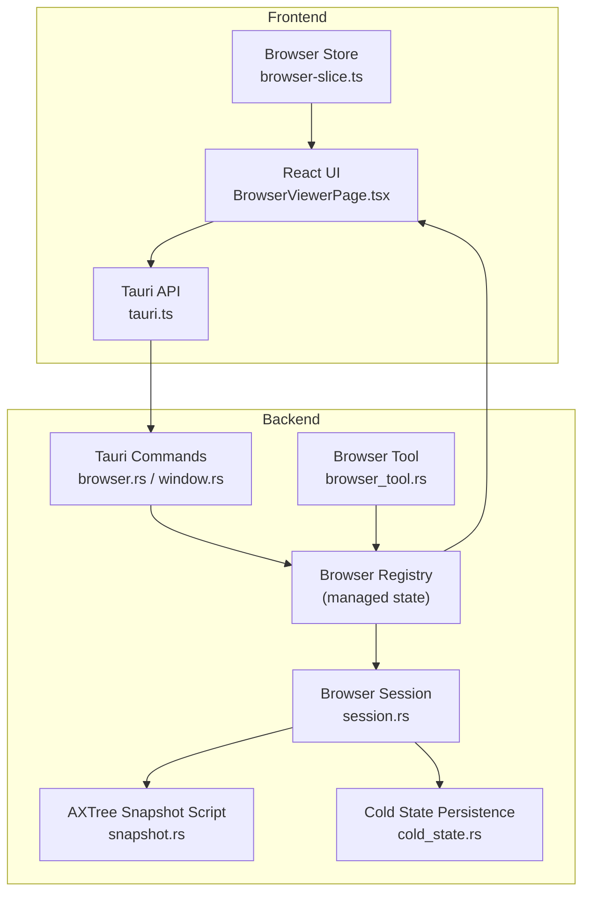

**Diagram sources**
- [BrowserViewerPage.tsx:1-137](file://src/modules/browser-viewer/BrowserViewerPage.tsx#L1-L137)
- [browser_tool.rs:1-200](file://src-tauri/src/modules/tools/builtin/browser_tool.rs#L1-L200)
- [session.rs:1-1409](file://src-tauri/src/modules/browser/session.rs#L1-L1409)
- [snapshot.rs:1-253](file://src-tauri/src/modules/browser/snapshot.rs#L1-L253)
- [cold_state.rs:1-215](file://src-tauri/src/modules/browser/cold_state.rs#L1-L215)
- [browser.rs:1-224](file://src-tauri/src/commands/browser.rs#L1-L224)
- [window.rs:1-67](file://src-tauri/src/commands/window.rs#L1-L67)
- [browser-slice.ts:1-103](file://src/stores/browser-slice.ts#L1-L103)
- [tauri.ts:1337-1366](file://src/lib/tauri.ts#L1337-L1366)

**Section sources**
- [browser_tool.rs:1-200](file://src-tauri/src/modules/tools/builtin/browser_tool.rs#L1-L200)
- [session.rs:1-1409](file://src-tauri/src/modules/browser/session.rs#L1-L1409)
- [browser.rs:1-224](file://src-tauri/src/commands/browser.rs#L1-L224)
- [window.rs:1-67](file://src-tauri/src/commands/window.rs#L1-L67)
- [BrowserViewerPage.tsx:1-137](file://src/modules/browser-viewer/BrowserViewerPage.tsx#L1-L137)
- [tauri.ts:1337-1366](file://src/lib/tauri.ts#L1337-L1366)
- [browser-slice.ts:1-103](file://src/stores/browser-slice.ts#L1-L103)

## Core Components
- Browser Tool: Orchestrates lifecycle, navigation, interaction, and diagnostics. It validates URLs, enforces safety, and routes actions to the registry and session.
- Browser Session: Manages a single Chromium process and page, handles CDP operations, waits, snapshots, screenshots, downloads, and observability ledgers.
- AXTree Snapshot Script: Produces a human-readable accessibility tree with interactive element references for precise targeting.
- Cold State: Persists last-visited URLs across app restarts to resume sessions efficiently.
- Tauri Commands and Frontend Bridge: Expose browser controls to the UI, mirror navigation into a native viewer, and maintain live status.

**Section sources**
- [browser_tool.rs:1-200](file://src-tauri/src/modules/tools/builtin/browser_tool.rs#L1-L200)
- [session.rs:1-1409](file://src-tauri/src/modules/browser/session.rs#L1-L1409)
- [snapshot.rs:1-253](file://src-tauri/src/modules/browser/snapshot.rs#L1-L253)
- [cold_state.rs:1-215](file://src-tauri/src/modules/browser/cold_state.rs#L1-L215)
- [browser.rs:1-224](file://src-tauri/src/commands/browser.rs#L1-L224)
- [window.rs:1-67](file://src-tauri/src/commands/window.rs#L1-L67)
- [BrowserViewerPage.tsx:1-137](file://src/modules/browser-viewer/BrowserViewerPage.tsx#L1-L137)
- [tauri.ts:1337-1366](file://src/lib/tauri.ts#L1337-L1366)
- [browser-slice.ts:1-103](file://src/stores/browser-slice.ts#L1-L103)

## Architecture Overview
End-to-end flow from tool invocation to UI updates and viewer mirroring:

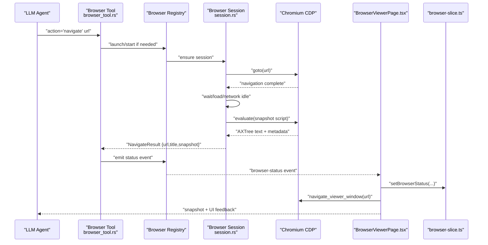

**Diagram sources**
- [browser_tool.rs:360-740](file://src-tauri/src/modules/tools/builtin/browser_tool.rs#L360-L740)
- [session.rs:616-656](file://src-tauri/src/modules/browser/session.rs#L616-L656)
- [BrowserViewerPage.tsx:65-94](file://src/modules/browser-viewer/BrowserViewerPage.tsx#L65-L94)
- [tauri.ts:1342-1364](file://src/lib/tauri.ts#L1342-L1364)
- [browser-slice.ts:53-78](file://src/stores/browser-slice.ts#L53-L78)

## Detailed Component Analysis

### Navigation and Safety Validation
- URL safety checks prevent SSRF-like misuse (disallow file://, javascript:, data:, RFC-1918, cloud metadata endpoints).
- Navigation waits for initial load completion and captures title and AXTree snapshot.

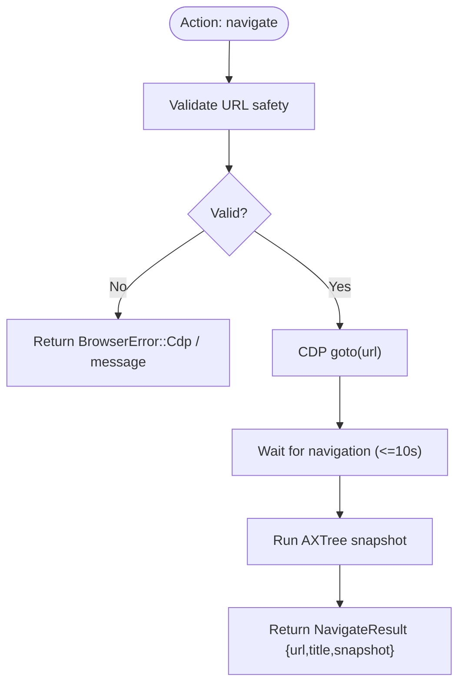

**Diagram sources**
- [browser_tool.rs:47-141](file://src-tauri/src/modules/tools/builtin/browser_tool.rs#L47-L141)
- [session.rs:616-656](file://src-tauri/src/modules/browser/session.rs#L616-L656)

**Section sources**
- [browser_tool.rs:47-141](file://src-tauri/src/modules/tools/builtin/browser_tool.rs#L47-L141)
- [session.rs:616-656](file://src-tauri/src/modules/browser/session.rs#L616-L656)

### Form Filling and Content Extraction
- Use snapshot to locate interactive elements by reference, then type into inputs and optionally press Enter to submit.
- For complex forms, combine snapshot inspection with evaluate for targeted interactions.

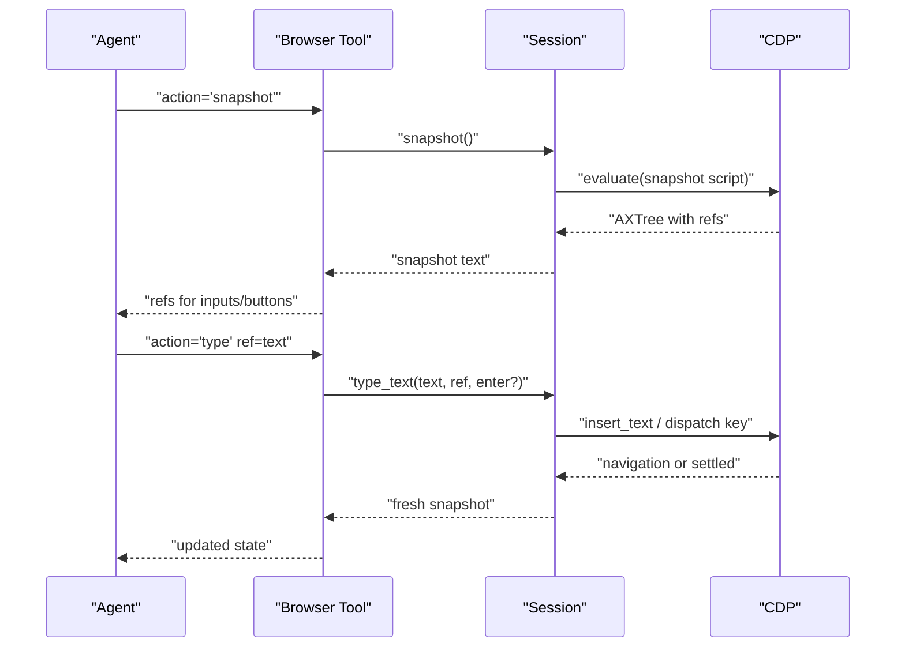

**Diagram sources**
- [session.rs:728-787](file://src-tauri/src/modules/browser/session.rs#L728-L787)
- [snapshot.rs:25-223](file://src-tauri/src/modules/browser/snapshot.rs#L25-L223)

**Section sources**
- [session.rs:728-787](file://src-tauri/src/modules/browser/session.rs#L728-L787)
- [snapshot.rs:25-223](file://src-tauri/src/modules/browser/snapshot.rs#L25-L223)

### Interactive Element Manipulation
- Click by reference, scroll, select options, and press keys.
- Post-action delays and optional navigation waits reduce race conditions on SPAs.

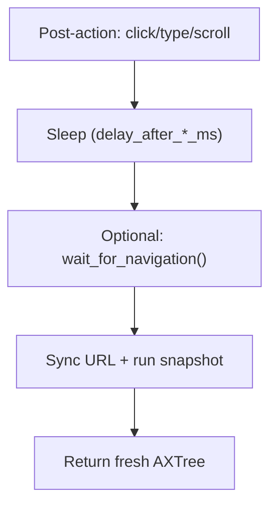

**Diagram sources**
- [session.rs:681-726](file://src-tauri/src/modules/browser/session.rs#L681-L726)
- [session.rs:789-800](file://src-tauri/src/modules/browser/session.rs#L789-L800)

**Section sources**
- [session.rs:681-726](file://src-tauri/src/modules/browser/session.rs#L681-L726)
- [session.rs:789-800](file://src-tauri/src/modules/browser/session.rs#L789-L800)

### Snapshot Capture Mechanisms
- AXTree snapshot script annotates interactive elements with data-if2ai-ref and produces a compact, readable tree.
- Includes same-origin iframe traversal and hard limits to manage size.

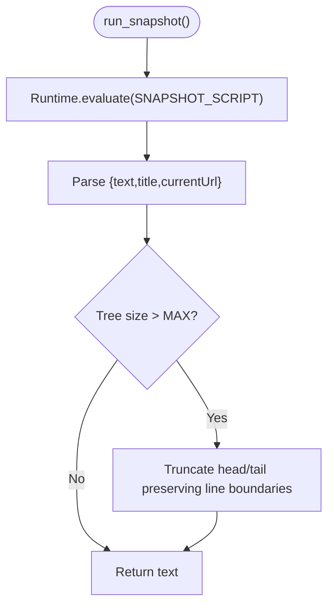

**Diagram sources**
- [session.rs:543-561](file://src-tauri/src/modules/browser/session.rs#L543-L561)
- [snapshot.rs:25-223](file://src-tauri/src/modules/browser/snapshot.rs#L25-L223)

**Section sources**
- [session.rs:543-561](file://src-tauri/src/modules/browser/session.rs#L543-L561)
- [snapshot.rs:25-223](file://src-tauri/src/modules/browser/snapshot.rs#L25-L223)

### Screenshot and Thumbnail Capture
- Full-page JPEG capture and small thumbnails for UI rendering and debugging.

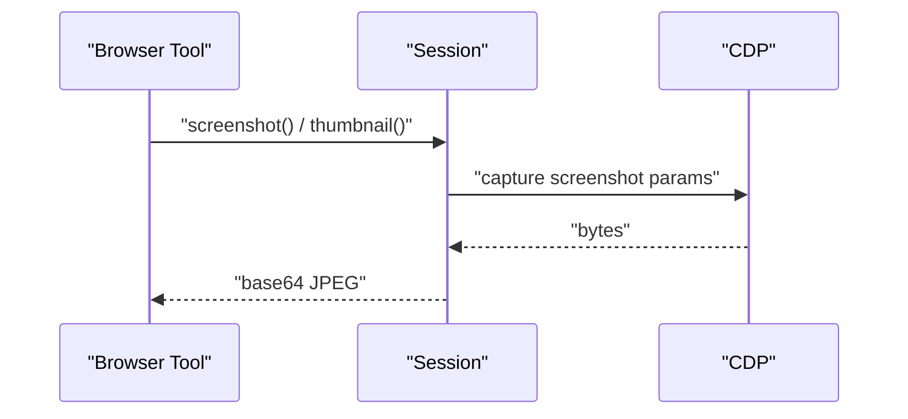

**Diagram sources**
- [session.rs:663-679](file://src-tauri/src/modules/browser/session.rs#L663-L679)

**Section sources**
- [session.rs:663-679](file://src-tauri/src/modules/browser/session.rs#L663-L679)

### Diagnostics: Console and Network Ledgers
- Console warnings/errors and HTTP errors are captured and formatted for the LLM.

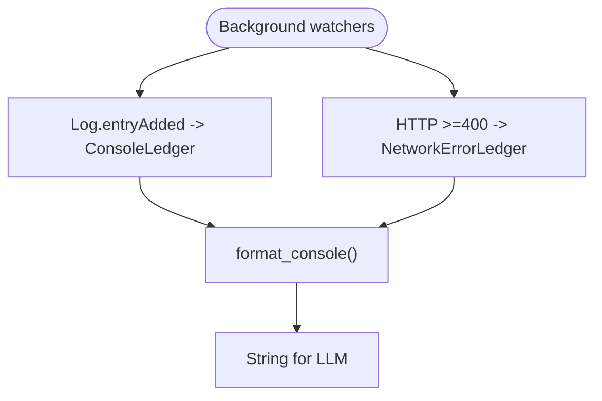

**Diagram sources**
- [session.rs:132-176](file://src-tauri/src/modules/browser/session.rs#L132-L176)
- [browser_tool.rs:742-783](file://src-tauri/src/modules/tools/builtin/browser_tool.rs#L742-L783)

**Section sources**
- [session.rs:132-176](file://src-tauri/src/modules/browser/session.rs#L132-L176)
- [browser_tool.rs:742-783](file://src-tauri/src/modules/tools/builtin/browser_tool.rs#L742-L783)

### Cold State Management
- Persists last-visited URL per session to support resumption across restarts without panics on I/O or parse failures.

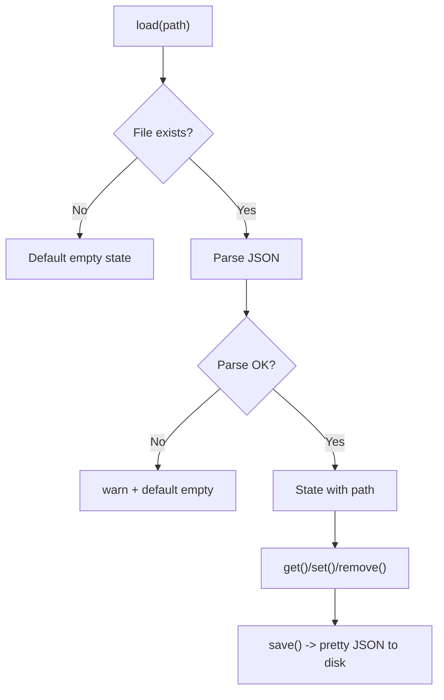

**Diagram sources**
- [cold_state.rs:44-110](file://src-tauri/src/modules/browser/cold_state.rs#L44-L110)

**Section sources**
- [cold_state.rs:44-110](file://src-tauri/src/modules/browser/cold_state.rs#L44-L110)

### Frontend Viewer Mirroring and Status
- The BrowserViewer toolbar invokes Tauri commands to navigate the embedded native webview and listens for status updates to keep the UI in sync.

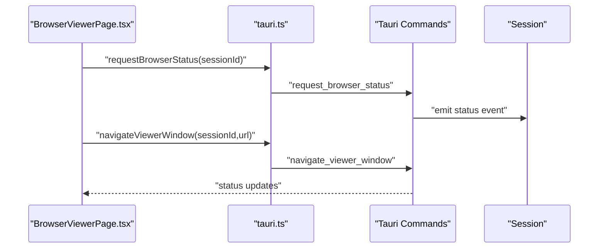

**Diagram sources**
- [BrowserViewerPage.tsx:65-94](file://src/modules/browser-viewer/BrowserViewerPage.tsx#L65-L94)
- [tauri.ts:1342-1364](file://src/lib/tauri.ts#L1342-L1364)
- [browser.rs:77-85](file://src-tauri/src/commands/browser.rs#L77-L85)
- [window.rs:48-67](file://src-tauri/src/commands/window.rs#L48-L67)

**Section sources**
- [BrowserViewerPage.tsx:65-94](file://src/modules/browser-viewer/BrowserViewerPage.tsx#L65-L94)
- [tauri.ts:1342-1364](file://src/lib/tauri.ts#L1342-L1364)
- [browser.rs:77-85](file://src-tauri/src/commands/browser.rs#L77-L85)
- [window.rs:48-67](file://src-tauri/src/commands/window.rs#L48-L67)

### Anti-Bot Detection Avoidance and Ethical Automation
- Stealth mode patches reduce basic detection signals; however, enterprise protections require alternative strategies.
- Guidance to stop automation and request user assistance for login, CAPTCHA, or bot verification.

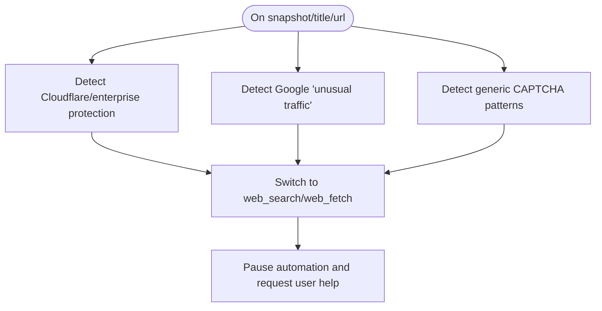

**Diagram sources**
- [browser_tool.rs:894-952](file://src-tauri/src/modules/tools/builtin/browser_tool.rs#L894-L952)
- [SKILL.md:205-229](file://src-tauri/resources/bundled-skills/browser-cdp/SKILL.md#L205-L229)

**Section sources**
- [browser_tool.rs:894-952](file://src-tauri/src/modules/tools/builtin/browser_tool.rs#L894-L952)
- [SKILL.md:205-229](file://src-tauri/resources/bundled-skills/browser-cdp/SKILL.md#L205-L229)

## Dependency Analysis
- The browser tool depends on the registry for session lifecycle and on the session for CDP operations.
- The session depends on the snapshot script and emits status events consumed by the UI.
- The frontend store subscribes to status events and mirrors navigation into the native viewer.

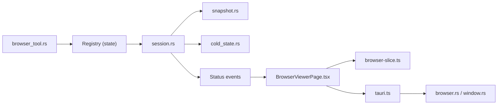

**Diagram sources**
- [browser_tool.rs:1-200](file://src-tauri/src/modules/tools/builtin/browser_tool.rs#L1-L200)
- [session.rs:1-1409](file://src-tauri/src/modules/browser/session.rs#L1-L1409)
- [snapshot.rs:1-253](file://src-tauri/src/modules/browser/snapshot.rs#L1-L253)
- [cold_state.rs:1-215](file://src-tauri/src/modules/browser/cold_state.rs#L1-L215)
- [BrowserViewerPage.tsx:1-137](file://src/modules/browser-viewer/BrowserViewerPage.tsx#L1-L137)
- [browser-slice.ts:1-103](file://src/stores/browser-slice.ts#L1-L103)
- [tauri.ts:1337-1366](file://src/lib/tauri.ts#L1337-L1366)
- [browser.rs:1-224](file://src-tauri/src/commands/browser.rs#L1-L224)
- [window.rs:1-67](file://src-tauri/src/commands/window.rs#L1-L67)

**Section sources**
- [browser_tool.rs:1-200](file://src-tauri/src/modules/tools/builtin/browser_tool.rs#L1-L200)
- [session.rs:1-1409](file://src-tauri/src/modules/browser/session.rs#L1-L1409)
- [snapshot.rs:1-253](file://src-tauri/src/modules/browser/snapshot.rs#L1-L253)
- [cold_state.rs:1-215](file://src-tauri/src/modules/browser/cold_state.rs#L1-L215)
- [BrowserViewerPage.tsx:1-137](file://src/modules/browser-viewer/BrowserViewerPage.tsx#L1-L137)
- [browser-slice.ts:1-103](file://src/stores/browser-slice.ts#L1-L103)
- [tauri.ts:1337-1366](file://src/lib/tauri.ts#L1337-L1366)
- [browser.rs:1-224](file://src-tauri/src/commands/browser.rs#L1-L224)
- [window.rs:1-67](file://src-tauri/src/commands/window.rs#L1-L67)

## Performance Considerations
- Use snapshot and screenshot judiciously; they are CPU and memory intensive.
- Prefer reusing existing tabs and avoiding unnecessary new windows to reduce overhead.
- Apply appropriate post-action delays and network-idle waits to minimize retries and redundant operations.
- Cap evaluate expressions and output sizes to prevent excessive memory usage.

[No sources needed since this section provides general guidance]

## Troubleshooting Guide
Common issues and remedies:
- Chrome not found: ensure a compatible browser is installed and discoverable.
- Session not running or takeover paused: start the session or release takeover before retrying.
- Element not found by reference: take a fresh snapshot after navigation or interactions.
- CDP timeouts or crashes: the system resets the session and asks the user to navigate again.
- Anti-bot detection: switch to web_search/web_fetch for protected sites.

**Section sources**
- [errors.rs:8-71](file://src-tauri/src/modules/browser/errors.rs#L8-L71)
- [browser_tool.rs:372-378](file://src-tauri/src/modules/tools/builtin/browser_tool.rs#L372-L378)
- [browser_tool.rs:877-890](file://src-tauri/src/modules/tools/builtin/browser_tool.rs#L877-L890)
- [SKILL.md:263-271](file://src-tauri/resources/bundled-skills/browser-cdp/SKILL.md#L263-L271)

## Conclusion
The system provides a robust, steerable browser automation pipeline with strong safety guards, diagnostic visibility, and UI mirroring. By combining AXTree-based targeting, snapshot-driven debugging, and careful post-action settling, it supports reliable workflows for navigation, form filling, and content extraction. Cold state persistence and ethical automation practices further improve usability and responsible use.

[No sources needed since this section summarizes without analyzing specific files]

## Appendices

### Step-by-Step: Building a Custom Workflow
- Validate and normalize the target URL.
- Navigate to the page and wait for load.
- Inspect the AXTree snapshot to identify interactive elements by reference.
- Perform typed interactions (type, click, select, key) with appropriate delays.
- Capture screenshots or thumbnails for debugging.
- Use evaluate for advanced queries or validations.
- Monitor console and network ledgers for errors.
- Handle anti-bot prompts by pausing and requesting user assistance.
- Resume from cold state if needed.

**Section sources**
- [browser_tool.rs:47-141](file://src-tauri/src/modules/tools/builtin/browser_tool.rs#L47-L141)
- [session.rs:616-656](file://src-tauri/src/modules/browser/session.rs#L616-L656)
- [session.rs:728-787](file://src-tauri/src/modules/browser/session.rs#L728-L787)
- [session.rs:663-679](file://src-tauri/src/modules/browser/session.rs#L663-L679)
- [snapshot.rs:25-223](file://src-tauri/src/modules/browser/snapshot.rs#L25-L223)
- [browser_tool.rs:742-783](file://src-tauri/src/modules/tools/builtin/browser_tool.rs#L742-L783)
- [SKILL.md:205-229](file://src-tauri/resources/bundled-skills/browser-cdp/SKILL.md#L205-L229)
- [cold_state.rs:44-110](file://src-tauri/src/modules/browser/cold_state.rs#L44-L110)

### Best Practices Checklist
- Always validate URLs and avoid unsafe schemes.
- Wait for load and network idle before relying on state.
- Use references from snapshots for precise interactions.
- Limit evaluate input/output sizes.
- Prefer reuse of existing tabs.
- Pause on login/CAPTCHA/verification; request user assistance.
- Keep logs and snapshots for reproducibility.

**Section sources**
- [SKILL.md:205-229](file://src-tauri/resources/bundled-skills/browser-cdp/SKILL.md#L205-L229)
- [ADR-015-Browser-Subsystem-Remediation-Design.md:750-807](file://docs/design-docs/postCLI/ADR/ADR-015-Browser-Subsystem-Remediation-Design.md#L750-L807)