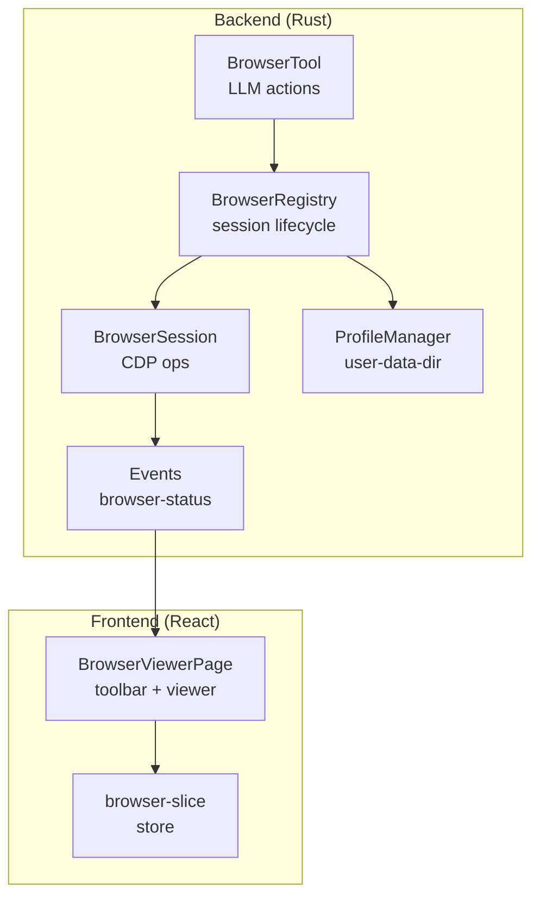
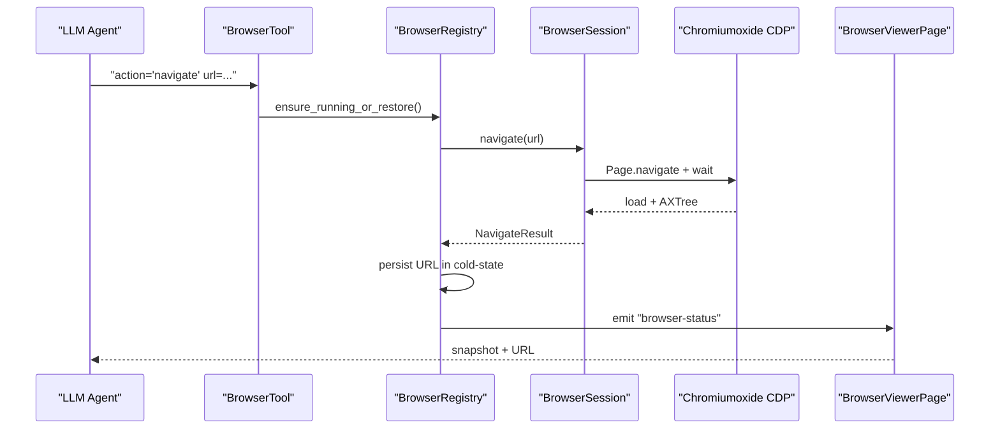
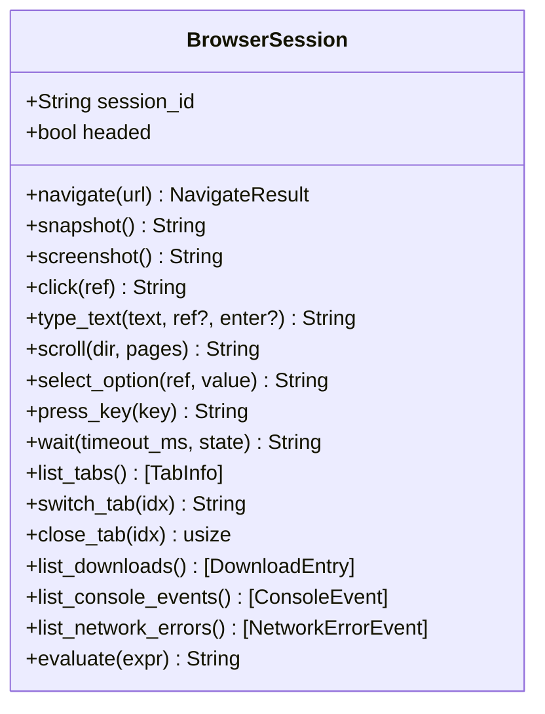
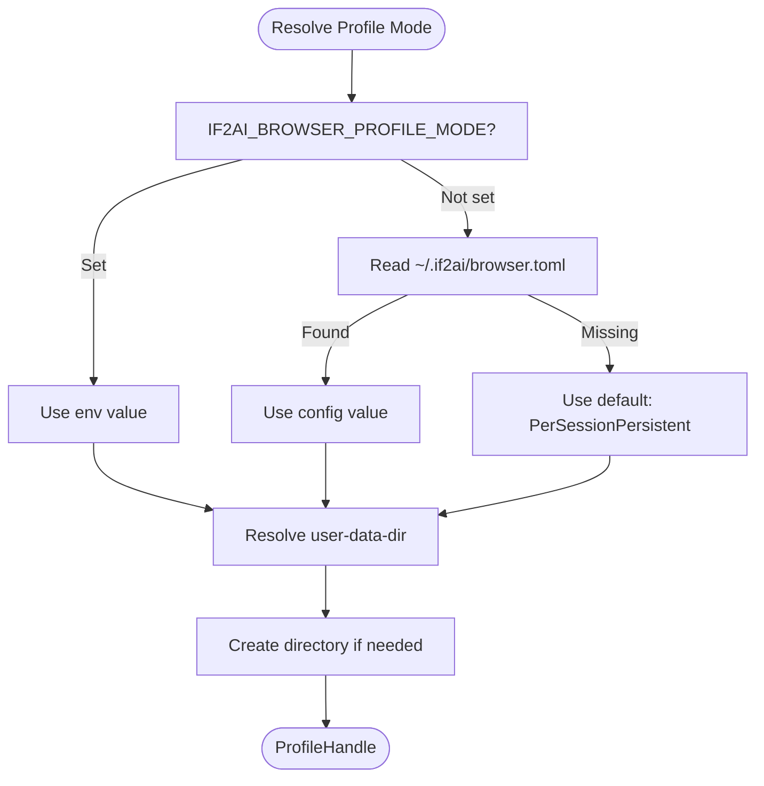
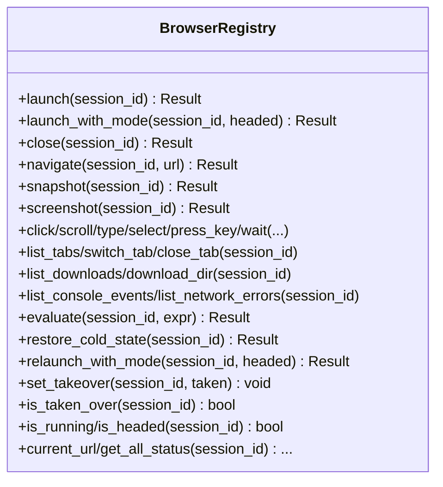
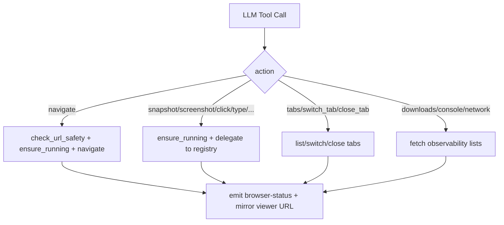
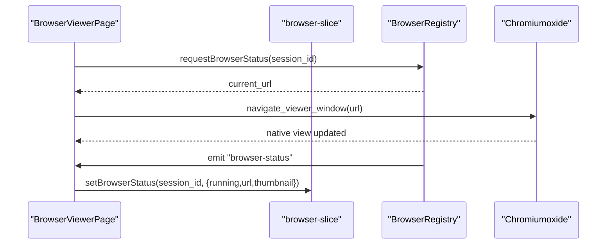
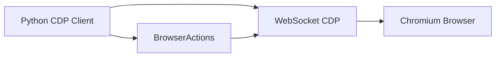
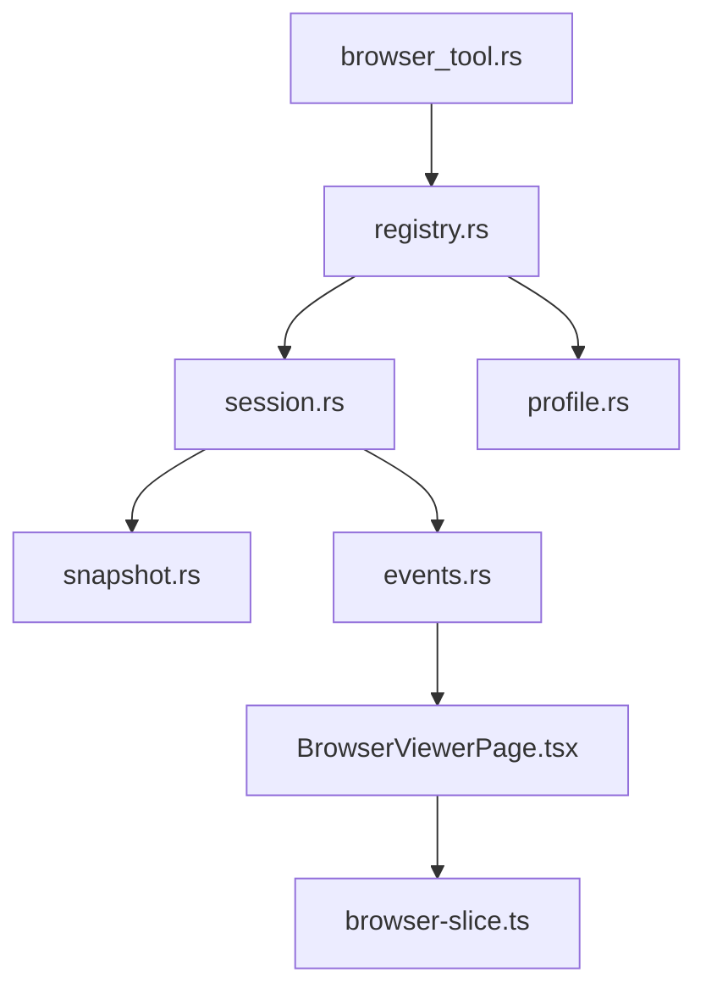

# Browser Automation

<cite>
**Referenced Files in This Document**
- [session.rs](file://src-tauri/src/modules/browser/session.rs)
- [profile.rs](file://src-tauri/src/modules/browser/profile.rs)
- [registry.rs](file://src-tauri/src/modules/browser/registry.rs)
- [snapshot.rs](file://src-tauri/src/modules/browser/snapshot.rs)
- [events.rs](file://src-tauri/src/modules/browser/events.rs)
- [browser_tool.rs](file://src-tauri/src/modules/tools/builtin/browser_tool.rs)
- [BrowserViewerPage.tsx](file://src/modules/browser-viewer/BrowserViewerPage.tsx)
- [browser-slice.ts](file://src/stores/browser-slice.ts)
- [cdp_client.py](file://src-tauri/resources/bundled-skills/browser-cdp/scripts/cdp_client.py)
- [browser_actions.py](file://src-tauri/resources/bundled-skills/browser-cdp/scripts/browser_actions.py)
- [errors.rs](file://src-tauri/src/modules/browser/errors.rs)
</cite>

## Table of Contents
1. [Introduction](#introduction)
2. [Project Structure](#project-structure)
3. [Core Components](#core-components)
4. [Architecture Overview](#architecture-overview)
5. [Detailed Component Analysis](#detailed-component-analysis)
6. [Dependency Analysis](#dependency-analysis)
7. [Performance Considerations](#performance-considerations)
8. [Troubleshooting Guide](#troubleshooting-guide)
9. [Conclusion](#conclusion)
10. [Appendices](#appendices)

## Introduction
This document describes If2Ai's Chromiumoxide-based browser control system for end-to-end web automation. It covers session lifecycle, profile isolation, CDP integration for headless and visible modes, cookie and user agent handling, and the browser viewer interface for monitoring automation. Practical automation workflows (navigation, form filling, content extraction) are explained with security and performance guidance.

## Project Structure
The browser automation system spans Rust backend modules and a React frontend viewer:
- Backend (Rust):
  - Browser session management and CDP integration
  - Profile management and persistence
  - Tool orchestration and safety checks
  - Events to drive the UI
- Frontend (React):
  - Browser viewer toolbar and status synchronization
  - Store for browser state

**Diagram sources**
- [registry.rs:44-75](file://src-tauri/src/modules/browser/registry.rs#L44-L75)
- [session.rs:263-308](file://src-tauri/src/modules/browser/session.rs#L263-L308)
- [profile.rs:56-77](file://src-tauri/src/modules/browser/profile.rs#L56-L77)
- [browser_tool.rs:149-257](file://src-tauri/src/modules/tools/builtin/browser_tool.rs#L149-L257)
- [events.rs:24-36](file://src-tauri/src/modules/browser/events.rs#L24-L36)
- [BrowserViewerPage.tsx:46-107](file://src/modules/browser-viewer/BrowserViewerPage.tsx#L46-L107)
- [browser-slice.ts:16-34](file://src/stores/browser-slice.ts#L16-L34)

**Section sources**
- [registry.rs:1-130](file://src-tauri/src/modules/browser/registry.rs#L1-L130)
- [session.rs:1-120](file://src-tauri/src/modules/browser/session.rs#L1-L120)
- [profile.rs:1-60](file://src-tauri/src/modules/browser/profile.rs#L1-L60)
- [browser_tool.rs:1-60](file://src-tauri/src/modules/tools/builtin/browser_tool.rs#L1-L60)
- [events.rs:1-40](file://src-tauri/src/modules/browser/events.rs#L1-L40)
- [BrowserViewerPage.tsx:1-45](file://src/modules/browser-viewer/BrowserViewerPage.tsx#L1-L45)
- [browser-slice.ts:1-40](file://src/stores/browser-slice.ts#L1-L40)

## Core Components
- BrowserRegistry: Manages per-session BrowserSession instances, cold-state persistence, and UI status emission.
- BrowserSession: Wraps a Chromiumoxide Browser/Page, handles navigation, snapshots, screenshots, input, waits, tabs, downloads, and observability.
- ProfileManager: Controls user-data-dir placement and lifecycle (per-session persistent, shared, ephemeral).
- BrowserTool: Orchestrates LLM actions (start/stop/navigate/snapshot/screenshot/click/type/scroll/select/key/wait/evaluate/tabs/downloads/console/network) with safety and takeover gating.
- Events: Emits "browser-status" events for UI synchronization.
- BrowserViewerPage: Native-hosted viewer toolbar that mirrors AI navigation and supports manual takeover.

**Section sources**
- [registry.rs:44-130](file://src-tauri/src/modules/browser/registry.rs#L44-L130)
- [session.rs:263-308](file://src-tauri/src/modules/browser/session.rs#L263-L308)
- [profile.rs:56-169](file://src-tauri/src/modules/browser/profile.rs#L56-L169)
- [browser_tool.rs:149-257](file://src-tauri/src/modules/tools/builtin/browser_tool.rs#L149-L257)
- [events.rs:24-82](file://src-tauri/src/modules/browser/events.rs#L24-L82)
- [BrowserViewerPage.tsx:46-107](file://src/modules/browser-viewer/BrowserViewerPage.tsx#L46-L107)

## Architecture Overview
The system integrates LLM tool calls with a Chromiumoxide-powered browser via CDP. Safety checks and profile policies govern operations, while events and the viewer provide transparency and manual control.

**Diagram sources**
- [browser_tool.rs:350-476](file://src-tauri/src/modules/tools/builtin/browser_tool.rs#L350-L476)
- [registry.rs:245-261](file://src-tauri/src/modules/browser/registry.rs#L245-L261)
- [session.rs:618-656](file://src-tauri/src/modules/browser/session.rs#L618-L656)
- [events.rs:51-82](file://src-tauri/src/modules/browser/events.rs#L51-L82)
- [BrowserViewerPage.tsx:65-94](file://src/modules/browser-viewer/BrowserViewerPage.tsx#L65-L94)

## Detailed Component Analysis

### BrowserSession: CDP Operations and Lifecycle
- Launch and configure Chromium with sandbox bypass and stealth mode.
- Navigation with wait strategies, snapshot generation, and screenshot capture.
- Input operations (insert text, key dispatch), scrolling, element selection, and JavaScript evaluation.
- Multi-tab support, downloads ledger, and observability (console/network).

**Diagram sources**
- [session.rs:263-308](file://src-tauri/src/modules/browser/session.rs#L263-L308)
- [session.rs:618-800](file://src-tauri/src/modules/browser/session.rs#L618-L800)

**Section sources**
- [session.rs:324-497](file://src-tauri/src/modules/browser/session.rs#L324-L497)
- [session.rs:618-800](file://src-tauri/src/modules/browser/session.rs#L618-L800)

### Profile Isolation and Persistence
- Modes: PerSessionPersistent (default), Shared, Ephemeral.
- Resolution order: environment variable > config TOML > default.
- Directory creation and cleanup semantics differ by mode; shared mode prevents deletion via UI.

**Diagram sources**
- [profile.rs:85-169](file://src-tauri/src/modules/browser/profile.rs#L85-L169)

**Section sources**
- [profile.rs:85-169](file://src-tauri/src/modules/browser/profile.rs#L85-L169)
- [profile.rs:323-401](file://src-tauri/src/modules/browser/profile.rs#L323-L401)

### BrowserRegistry: Session Management and Cold-State
- Thread-safe session map with per-session mutex.
- Cold-state persistence for URL restoration across restarts.
- Status caching for URL and lock-free enumeration.
- Takeover gating to pause AI actions during manual control.

**Diagram sources**
- [registry.rs:44-75](file://src-tauri/src/modules/browser/registry.rs#L44-L75)
- [registry.rs:166-237](file://src-tauri/src/modules/browser/registry.rs#L166-L237)
- [registry.rs:245-460](file://src-tauri/src/modules/browser/registry.rs#L245-L460)

**Section sources**
- [registry.rs:166-237](file://src-tauri/src/modules/browser/registry.rs#L166-L237)
- [registry.rs:245-460](file://src-tauri/src/modules/browser/registry.rs#L245-L460)
- [registry.rs:533-588](file://src-tauri/src/modules/browser/registry.rs#L533-L588)

### BrowserTool: LLM Action Orchestration and Safety
- Action taxonomy: lifecycle, perception, interaction, tabs, files, diagnostics.
- URL safety checks (scheme/host/IP restrictions) and takeover gating.
- Multimodal screenshot support and structured output formatting.

**Diagram sources**
- [browser_tool.rs:350-740](file://src-tauri/src/modules/tools/builtin/browser_tool.rs#L350-L740)

**Section sources**
- [browser_tool.rs:38-142](file://src-tauri/src/modules/tools/builtin/browser_tool.rs#L38-L142)
- [browser_tool.rs:350-740](file://src-tauri/src/modules/tools/builtin/browser_tool.rs#L350-L740)

### Browser Viewer Interface: Monitoring and Manual Control
- Toolbar mirrors AI navigation into a native WKWebView/WebView2 content area.
- Live status updates via "browser-status" events and local store.
- Manual takeover via stop/close actions.

**Diagram sources**
- [BrowserViewerPage.tsx:65-94](file://src/modules/browser-viewer/BrowserViewerPage.tsx#L65-L94)
- [browser-slice.ts:53-78](file://src/stores/browser-slice.ts#L53-L78)
- [events.rs:51-82](file://src-tauri/src/modules/browser/events.rs#L51-L82)

**Section sources**
- [BrowserViewerPage.tsx:46-107](file://src/modules/browser-viewer/BrowserViewerPage.tsx#L46-L107)
- [browser-slice.ts:16-34](file://src/stores/browser-slice.ts#L16-L34)
- [events.rs:24-36](file://src-tauri/src/modules/browser/events.rs#L24-L36)

### CDP Integration: Python Scripts and Protocols
- CDPClient: WebSocket connection, command/response handling, tab management, session attach/detach, event buffering.
- BrowserActions: Navigation, waiting, mouse/keyboard input, element interaction by ref, screenshots, PDF export.

**Diagram sources**
- [cdp_client.py:90-283](file://src-tauri/resources/bundled-skills/browser-cdp/scripts/cdp_client.py#L90-L283)
- [browser_actions.py:97-110](file://src-tauri/resources/bundled-skills/browser-cdp/scripts/browser_actions.py#L97-L110)

**Section sources**
- [cdp_client.py:121-283](file://src-tauri/resources/bundled-skills/browser-cdp/scripts/cdp_client.py#L121-L283)
- [browser_actions.py:115-234](file://src-tauri/resources/bundled-skills/browser-cdp/scripts/browser_actions.py#L115-L234)

## Dependency Analysis
- BrowserSession depends on Chromiumoxide for CDP, snapshot script, and stealth mode.
- BrowserRegistry coordinates sessions, cold-state, and UI events.
- BrowserTool depends on BrowserRegistry and enforces safety and takeover rules.
- Frontend depends on Tauri events and a lightweight store for state.

**Diagram sources**
- [browser_tool.rs:149-257](file://src-tauri/src/modules/tools/builtin/browser_tool.rs#L149-L257)
- [registry.rs:44-75](file://src-tauri/src/modules/browser/registry.rs#L44-L75)
- [session.rs:263-308](file://src-tauri/src/modules/browser/session.rs#L263-L308)
- [profile.rs:56-77](file://src-tauri/src/modules/browser/profile.rs#L56-L77)
- [snapshot.rs:16-25](file://src-tauri/src/modules/browser/snapshot.rs#L16-L25)
- [events.rs:24-36](file://src-tauri/src/modules/browser/events.rs#L24-L36)
- [BrowserViewerPage.tsx:46-107](file://src/modules/browser-viewer/BrowserViewerPage.tsx#L46-L107)
- [browser-slice.ts:16-34](file://src/stores/browser-slice.ts#L16-L34)

**Section sources**
- [browser_tool.rs:149-257](file://src-tauri/src/modules/tools/builtin/browser_tool.rs#L149-L257)
- [registry.rs:44-130](file://src-tauri/src/modules/browser/registry.rs#L44-L130)
- [session.rs:1-120](file://src-tauri/src/modules/browser/session.rs#L1-L120)
- [profile.rs:1-60](file://src-tauri/src/modules/browser/profile.rs#L1-L60)
- [snapshot.rs:16-25](file://src-tauri/src/modules/browser/snapshot.rs#L16-L25)
- [events.rs:1-40](file://src-tauri/src/modules/browser/events.rs#L1-L40)
- [BrowserViewerPage.tsx:1-45](file://src/modules/browser-viewer/BrowserViewerPage.tsx#L1-L45)
- [browser-slice.ts:1-40](file://src/stores/browser-slice.ts#L1-L40)

## Performance Considerations
- Headless vs Headed: Disable GPU in headless mode to avoid initialization crashes; enable GPU in headed mode for normal rendering.
- Stealth mode: Reduces detection signals; enterprise protections may still require alternative strategies.
- Post-action delays: Tune delays after click/type/scroll to accommodate SPA navigation and reduce retries.
- Snapshot limits: AXTree truncation prevents oversized payloads; monitor MAX_TREE and adjust timeouts.
- Thumbnails: Lower quality for thumbnails to reduce event payload size.
- Sandbox bypass: Required on macOS/Linux to avoid early termination; ensure proper environment.

[No sources needed since this section provides general guidance]

## Troubleshooting Guide
Common issues and remedies:
- Chrome not found: Install Google Chrome or Chromium; the system reports a specific error when the binary is missing.
- Session not found: Ensure the session is running or call "start" before other actions.
- Not running: Start the browser session before issuing commands.
- CDP errors: Indicates browser process issues; the system attempts to reset the session on navigation failures.
- Timeout errors: Increase wait timeouts or adjust state expectations ("domcontentloaded" vs "load" vs "networkidle").
- Element ref not found: Snapshots change after interactions; take a fresh snapshot before referencing elements.
- Snapshot/evaluate failures: Inspect console/network diagnostics via "console" and "network" actions.
- Viewer not updating: Confirm "browser-status" events are emitted and the viewer is subscribed.

**Section sources**
- [errors.rs:8-46](file://src-tauri/src/modules/browser/errors.rs#L8-L46)
- [browser_tool.rs:714-783](file://src-tauri/src/modules/tools/builtin/browser_tool.rs#L714-L783)
- [events.rs:51-82](file://src-tauri/src/modules/browser/events.rs#L51-L82)

## Conclusion
If2Ai's browser automation system combines robust session management, profile isolation, and CDP-driven interactions with a transparent viewer and safety controls. The modular design enables reliable headless and visible automation, while diagnostics and observability aid debugging and optimization.

## Appendices

### Practical Automation Workflows
- Form filling:
  - Navigate to the page.
  - Snapshot to identify input refs.
  - Type into targeted inputs; optionally press Enter to submit.
  - Wait for navigation and snapshot again.
- Navigation and content extraction:
  - Navigate to target URL.
  - Snapshot to extract AXTree text and element refs.
  - Use refs to click links/buttons and capture screenshots for visual context.
- Diagnostics:
  - Use "console" and "network" actions to review errors/warnings and HTTP statuses.
  - Inspect downloads and thumbnails for debugging.

[No sources needed since this section provides general guidance]