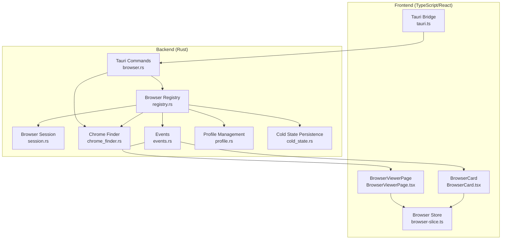
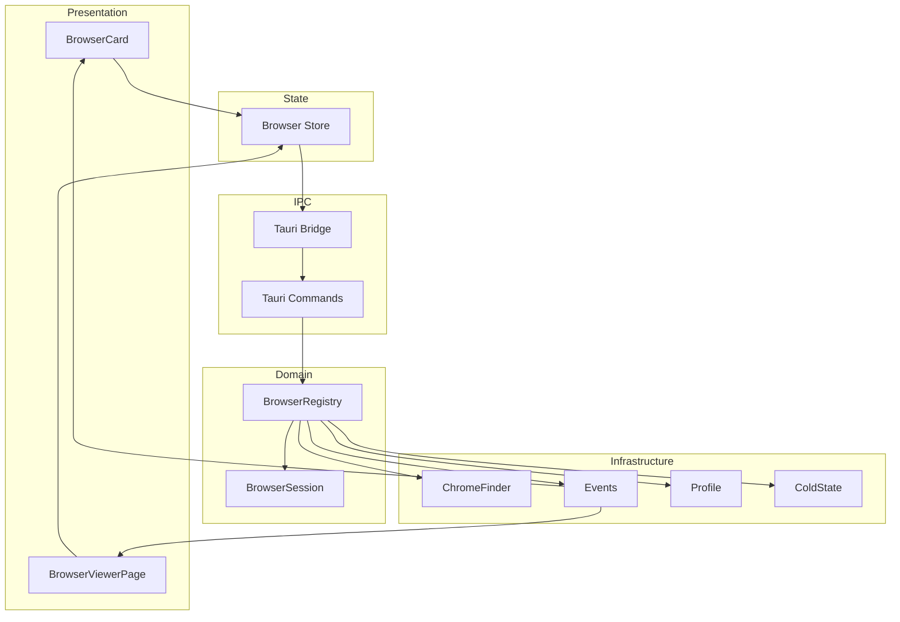
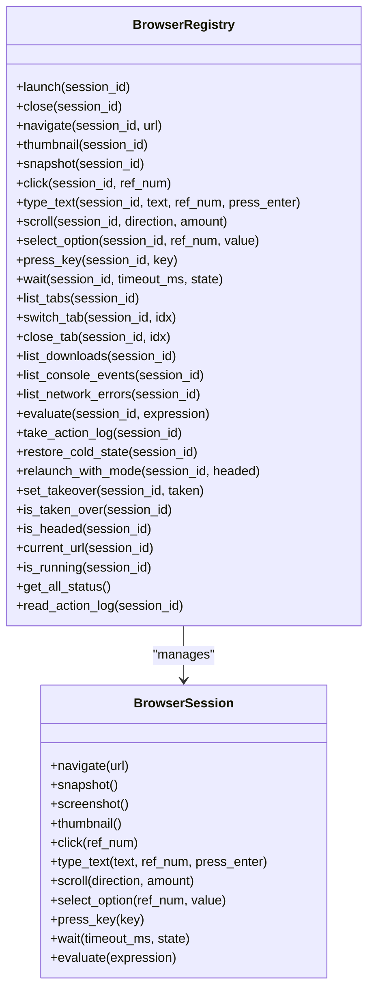
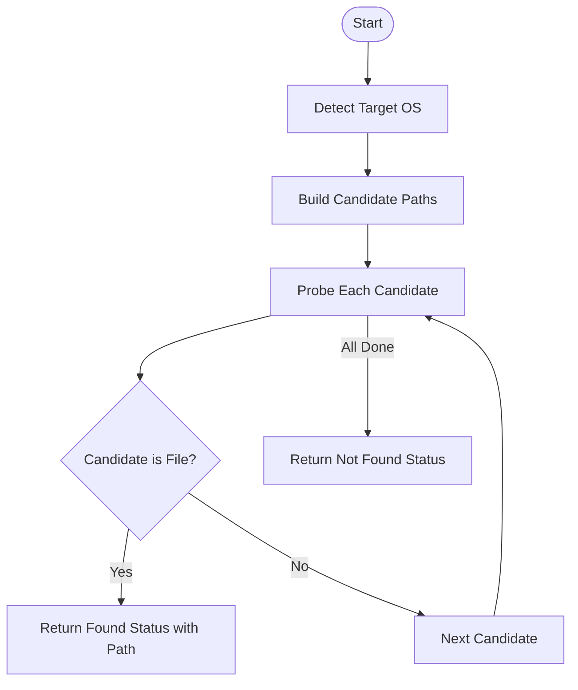
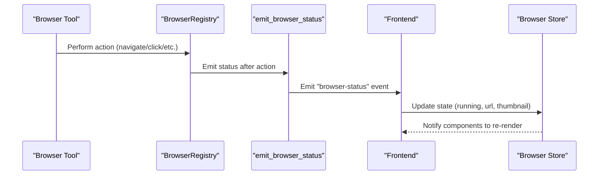
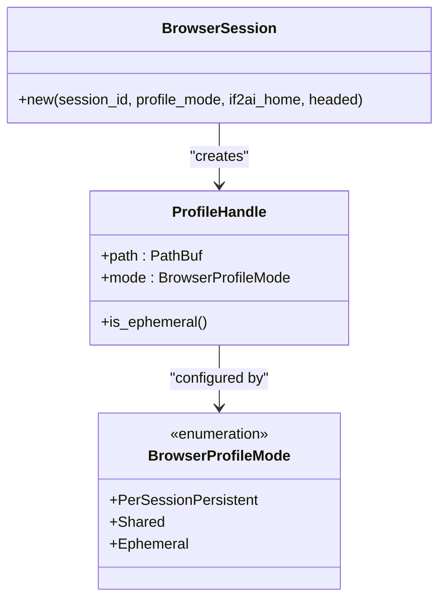
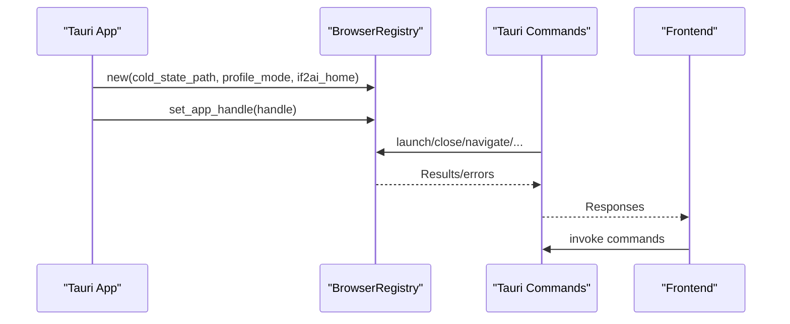
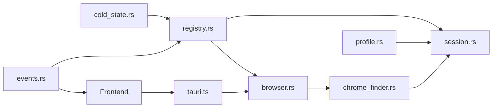

# Browser Control Architecture

<cite>
**Referenced Files in This Document**
- [browser-control-system.md](file://docs/design-docs/postCLI/browser-control-system.md)
- [mod.rs](file://src-tauri/src/modules/browser/mod.rs)
- [registry.rs](file://src-tauri/src/modules/browser/registry.rs)
- [session.rs](file://src-tauri/src/modules/browser/session.rs)
- [chrome_finder.rs](file://src-tauri/src/modules/browser/chrome_finder.rs)
- [events.rs](file://src-tauri/src/modules/browser/events.rs)
- [profile.rs](file://src-tauri/src/modules/browser/profile.rs)
- [cold_state.rs](file://src-tauri/src/modules/browser/cold_state.rs)
- [browser.rs](file://src-tauri/src/commands/browser.rs)
- [BrowserCard.tsx](file://src/components/browser/BrowserCard.tsx)
- [BrowserViewerPage.tsx](file://src/modules/browser-viewer/BrowserViewerPage.tsx)
- [browser-slice.ts](file://src/stores/browser-slice.ts)
- [tauri.ts](file://src/lib/tauri.ts)
</cite>

## Table of Contents
1. [Introduction](#introduction)
2. [Project Structure](#project-structure)
3. [Core Components](#core-components)
4. [Architecture Overview](#architecture-overview)
5. [Detailed Component Analysis](#detailed-component-analysis)
6. [Dependency Analysis](#dependency-analysis)
7. [Performance Considerations](#performance-considerations)
8. [Troubleshooting Guide](#troubleshooting-guide)
9. [Conclusion](#conclusion)

## Introduction
This document explains the browser control architecture in If2Ai, focusing on the modular design pattern used for browser management. The system centers around a registry that tracks browser instances per chat session, a Chrome finder mechanism for locating browser executables across platforms, and a provider-like pattern for browser selection. It covers component boundaries, initialization sequences, integration with the broader application, and extensibility points for adding new browser implementations.

## Project Structure
The browser control system spans both the Rust backend and the TypeScript/React frontend:

- Backend (Rust):
  - Browser subsystem modules under `src-tauri/src/modules/browser/`
  - Tauri commands under `src-tauri/src/commands/`
  - Frontend components under `src/components/browser/` and `src/modules/browser-viewer/`
  - State management under `src/stores/`

- Documentation:
  - Design document detailing the architecture and interfaces

**Diagram sources**
- [registry.rs:44-75](file://src-tauri/src/modules/browser/registry.rs#L44-L75)
- [session.rs:263-308](file://src-tauri/src/modules/browser/session.rs#L263-L308)
- [chrome_finder.rs:1-102](file://src-tauri/src/modules/browser/chrome_finder.rs#L1-L102)
- [events.rs:19-36](file://src-tauri/src/modules/browser/events.rs#L19-L36)
- [profile.rs:56-77](file://src-tauri/src/modules/browser/profile.rs#L56-L77)
- [cold_state.rs:25-36](file://src-tauri/src/modules/browser/cold_state.rs#L25-L36)
- [browser.rs:1-224](file://src-tauri/src/commands/browser.rs#L1-L224)
- [BrowserCard.tsx:1-280](file://src/components/browser/BrowserCard.tsx#L1-L280)
- [BrowserViewerPage.tsx:1-284](file://src/modules/browser-viewer/BrowserViewerPage.tsx#L1-L284)
- [browser-slice.ts:1-103](file://src/stores/browser-slice.ts#L1-L103)
- [tauri.ts:1-800](file://src/lib/tauri.ts#L1-L800)

**Section sources**
- [browser-control-system.md:1-389](file://docs/design-docs/postCLI/browser-control-system.md#L1-L389)
- [mod.rs:1-40](file://src-tauri/src/modules/browser/mod.rs#L1-L40)

## Core Components
- BrowserRegistry: Manages per-session BrowserSession instances, coordinates lifecycle, and emits status events. It maintains last-known URLs for non-blocking status queries and supports takeover flags for user-controlled sessions.
- BrowserSession: Wraps a chromiumoxide Browser/Page pair, exposing navigation, interaction, screenshots, and observability features. Handles profile resolution and stealth mode configuration.
- ChromeFinder: Platform-specific discovery of Chrome/Chromium binaries.
- Events: Defines BrowserStatusEvent payload and emits live status to the frontend.
- Profile Management: Controls where Chromium user-data-dir is placed and how long it persists.
- Cold State: Persists last-visited URLs per session across app restarts.
- Tauri Commands: Expose browser control APIs to the frontend and manage takeover flows.
- Frontend Components: BrowserCard displays live status and thumbnails; BrowserViewerPage provides a separate viewer window.

**Section sources**
- [registry.rs:44-588](file://src-tauri/src/modules/browser/registry.rs#L44-L588)
- [session.rs:263-497](file://src-tauri/src/modules/browser/session.rs#L263-L497)
- [chrome_finder.rs:1-102](file://src-tauri/src/modules/browser/chrome_finder.rs#L1-L102)
- [events.rs:19-82](file://src-tauri/src/modules/browser/events.rs#L19-L82)
- [profile.rs:56-169](file://src-tauri/src/modules/browser/profile.rs#L56-L169)
- [cold_state.rs:25-133](file://src-tauri/src/modules/browser/cold_state.rs#L25-L133)
- [browser.rs:1-224](file://src-tauri/src/commands/browser.rs#L1-L224)
- [BrowserCard.tsx:1-280](file://src/components/browser/BrowserCard.tsx#L1-L280)
- [BrowserViewerPage.tsx:1-284](file://src/modules/browser-viewer/BrowserViewerPage.tsx#L1-L284)
- [browser-slice.ts:1-103](file://src/stores/browser-slice.ts#L1-L103)

## Architecture Overview
The system follows a modular, layered architecture:

- Layered design:
  - Presentation layer: React components (BrowserCard, BrowserViewerPage)
  - State layer: Redux-like store slice (browser-slice.ts)
  - IPC layer: Tauri bridge (tauri.ts) and commands (browser.rs)
  - Domain layer: BrowserRegistry and BrowserSession
  - Infrastructure layer: ChromeFinder, Events, Profile, ColdState

- Component relationships:
  - BrowserRegistry owns BrowserSession instances and coordinates operations
  - Events emit BrowserStatusEvent payloads to the frontend
  - Tauri commands delegate to BrowserRegistry for actions
  - Frontend components subscribe to events and update the store

**Diagram sources**
- [BrowserCard.tsx:58-112](file://src/components/browser/BrowserCard.tsx#L58-L112)
- [BrowserViewerPage.tsx:46-107](file://src/modules/browser-viewer/BrowserViewerPage.tsx#L46-L107)
- [browser-slice.ts:95-102](file://src/stores/browser-slice.ts#L95-L102)
- [tauri.ts:1-800](file://src/lib/tauri.ts#L1-L800)
- [browser.rs:40-85](file://src-tauri/src/commands/browser.rs#L40-L85)
- [registry.rs:166-237](file://src-tauri/src/modules/browser/registry.rs#L166-L237)
- [session.rs:324-497](file://src-tauri/src/modules/browser/session.rs#L324-L497)
- [chrome_finder.rs:71-84](file://src-tauri/src/modules/browser/chrome_finder.rs#L71-L84)
- [events.rs:51-82](file://src-tauri/src/modules/browser/events.rs#L51-L82)
- [profile.rs:115-168](file://src-tauri/src/modules/browser/profile.rs#L115-L168)
- [cold_state.rs:40-133](file://src-tauri/src/modules/browser/cold_state.rs#L40-L133)

## Detailed Component Analysis

### BrowserRegistry: Modular Session Management
- Responsibilities:
  - Maintain per-session BrowserSession instances in a concurrent registry
  - Launch/close sessions, delegate operations, and track status
  - Persist and restore last-visited URLs across app restarts
  - Support takeover mode and user-controlled sessions
  - Emit BrowserStatusEvent for live UI updates

- Concurrency and performance:
  - Uses DashMap for concurrent access and Arc<Mutex<>> for per-session locking
  - Caches last-known URLs for non-blocking status queries
  - Synchronizes cold-state persistence on navigation

**Diagram sources**
- [registry.rs:166-588](file://src-tauri/src/modules/browser/registry.rs#L166-L588)
- [session.rs:618-800](file://src-tauri/src/modules/browser/session.rs#L618-L800)

**Section sources**
- [registry.rs:44-588](file://src-tauri/src/modules/browser/registry.rs#L44-L588)

### Chrome Finder: Cross-Platform Binary Discovery
- Implements platform-specific candidate paths for Chrome/Chromium on macOS, Linux, and Windows
- Returns first valid executable found or a status indicating not found
- Used by BrowserSession::new to configure the browser engine

**Diagram sources**
- [chrome_finder.rs:9-84](file://src-tauri/src/modules/browser/chrome_finder.rs#L9-L84)

**Section sources**
- [chrome_finder.rs:1-102](file://src-tauri/src/modules/browser/chrome_finder.rs#L1-L102)

### Events and Frontend Integration
- BrowserStatusEvent carries session_id, running state, current URL, and optional thumbnail
- emit_browser_status captures thumbnail asynchronously and emits the event
- Frontend components subscribe to the "browser-status" event and update the store

**Diagram sources**
- [events.rs:51-82](file://src-tauri/src/modules/browser/events.rs#L51-L82)
- [BrowserCard.tsx:80-94](file://src/components/browser/BrowserCard.tsx#L80-L94)
- [browser-slice.ts:53-78](file://src/stores/browser-slice.ts#L53-L78)

**Section sources**
- [events.rs:19-82](file://src-tauri/src/modules/browser/events.rs#L19-L82)
- [BrowserCard.tsx:68-112](file://src/components/browser/BrowserCard.tsx#L68-L112)
- [browser-slice.ts:1-103](file://src/stores/browser-slice.ts#L1-L103)

### Provider Pattern and Fallback Mechanisms
- Provider pattern implementation:
  - BrowserSession::new acts as a provider factory, resolving profile mode and launching the browser
  - ProfileMode enum governs where user-data-dir is placed and how long it persists
- Fallback mechanisms:
  - ChromeFinder probes multiple platform-specific paths and returns a status indicating availability
  - If no Chrome binary is found, BrowserSession::new returns a structured error; the frontend displays guidance

**Diagram sources**
- [profile.rs:62-169](file://src-tauri/src/modules/browser/profile.rs#L62-L169)
- [session.rs:324-380](file://src-tauri/src/modules/browser/session.rs#L324-L380)

**Section sources**
- [profile.rs:56-169](file://src-tauri/src/modules/browser/profile.rs#L56-L169)
- [session.rs:324-400](file://src-tauri/src/modules/browser/session.rs#L324-L400)

### Initialization Sequence and Component Boundaries
- Initialization:
  - BrowserRegistry is registered as Tauri managed state and injected into commands
  - AppHandle is injected into the registry for event emission
  - ColdState is loaded at registry creation and persisted on navigation
- Component boundaries:
  - Rust backend encapsulates browser lifecycle and state
  - Tauri commands provide controlled entry points for frontend invocations
  - Frontend components consume events and maintain UI state

**Diagram sources**
- [registry.rs:87-146](file://src-tauri/src/modules/browser/registry.rs#L87-L146)
- [browser.rs:40-85](file://src-tauri/src/commands/browser.rs#L40-L85)

**Section sources**
- [registry.rs:77-146](file://src-tauri/src/modules/browser/registry.rs#L77-L146)
- [browser.rs:1-85](file://src-tauri/src/commands/browser.rs#L1-L85)

### Extensibility Points and Integration
- Adding new browser implementations:
  - Implement a new provider that adheres to the BrowserSession interface (navigate, snapshot, screenshot, etc.)
  - Integrate discovery logic similar to ChromeFinder for the new provider
  - Register the new provider in the BrowserSession::new factory or via a configuration mechanism
- Extending the registry:
  - Add new delegated operations in BrowserRegistry mirroring the BrowserSession API
  - Emit corresponding events for frontend updates
- Frontend integration:
  - Extend BrowserCard and BrowserViewerPage to handle new capabilities
  - Update the store slice if new state fields are required

[No sources needed since this section provides general guidance]

## Dependency Analysis
The browser control system exhibits clear separation of concerns with low coupling between layers:

- Backend modules depend on each other in a hierarchical manner:
  - registry.rs depends on session.rs, events.rs, profile.rs, cold_state.rs, chrome_finder.rs
  - browser.rs depends on registry.rs, chrome_finder.rs, and events.rs
- Frontend components depend on the Tauri bridge and the store slice
- Events form a unidirectional data flow from backend to frontend

**Diagram sources**
- [chrome_finder.rs:1-102](file://src-tauri/src/modules/browser/chrome_finder.rs#L1-L102)
- [session.rs:324-380](file://src-tauri/src/modules/browser/session.rs#L324-L380)
- [profile.rs:115-168](file://src-tauri/src/modules/browser/profile.rs#L115-L168)
- [cold_state.rs:40-133](file://src-tauri/src/modules/browser/cold_state.rs#L40-L133)
- [events.rs:51-82](file://src-tauri/src/modules/browser/events.rs#L51-L82)
- [registry.rs:87-146](file://src-tauri/src/modules/browser/registry.rs#L87-L146)
- [browser.rs:19-85](file://src-tauri/src/commands/browser.rs#L19-L85)
- [tauri.ts:1-800](file://src/lib/tauri.ts#L1-L800)

**Section sources**
- [registry.rs:1-40](file://src-tauri/src/modules/browser/registry.rs#L1-L40)
- [browser.rs:1-27](file://src-tauri/src/commands/browser.rs#L1-L27)

## Performance Considerations
- Concurrency:
  - DashMap shards minimize contention; per-session Mutex avoids blocking other sessions
  - Asynchronous event emission prevents UI stalls
- Caching:
  - Last-known URLs cache avoids expensive session locks for status queries
  - Thumbnails are captured asynchronously and degrade gracefully on failure
- Resource management:
  - Profile handles control directory lifecycle; persistent profiles persist across restarts
  - Cold-state persistence ensures minimal startup overhead for resumed sessions

[No sources needed since this section provides general guidance]

## Troubleshooting Guide
- Chrome not found:
  - Symptom: Browser tool returns structured error; frontend shows guidance
  - Resolution: Install Chrome/Chromium; verify platform-specific paths
- Session not running:
  - Symptom: BrowserCard disappears; viewer shows idle state
  - Resolution: Ensure session is launched before invoking actions
- Takeover conflicts:
  - Symptom: AI tool calls paused during user takeover
  - Resolution: Release takeover to resume AI automation
- Event emission failures:
  - Symptom: No live updates in BrowserCard
  - Resolution: Check event emission logs; ensure registry is initialized with AppHandle

**Section sources**
- [session.rs:330-334](file://src-tauri/src/modules/browser/session.rs#L330-L334)
- [events.rs:79-82](file://src-tauri/src/modules/browser/events.rs#L79-L82)
- [registry.rs:499-520](file://src-tauri/src/modules/browser/registry.rs#L499-L520)

## Conclusion
The browser control architecture in If2Ai employs a robust modular design centered on a registry-managed browser lifecycle, cross-platform Chrome discovery, and a provider-like pattern for browser selection. The system integrates seamlessly with the broader application through Tauri commands and events, enabling real-time UI updates and extensible browser implementations. The documented component boundaries, initialization sequence, and integration points provide a clear foundation for extending and maintaining the browser control subsystem.