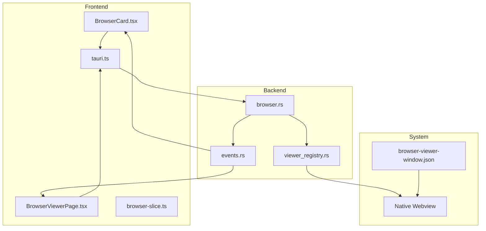
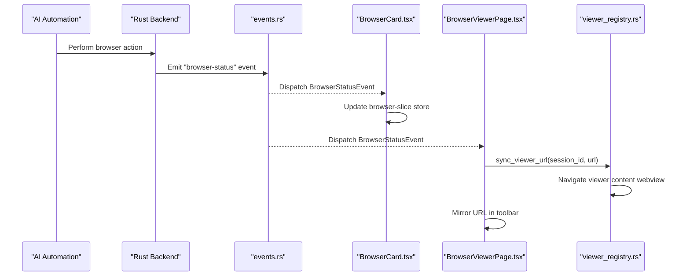
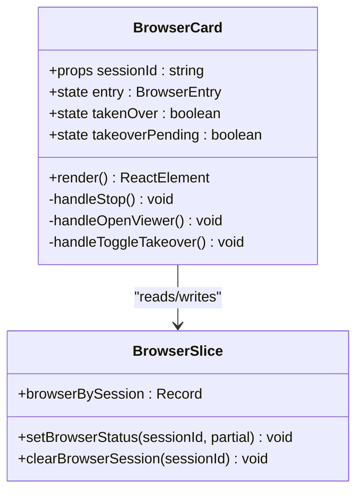
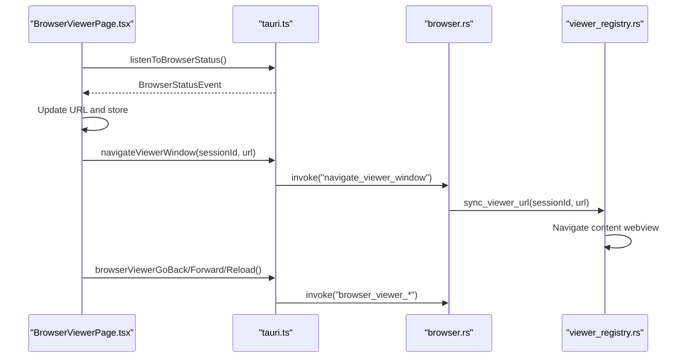
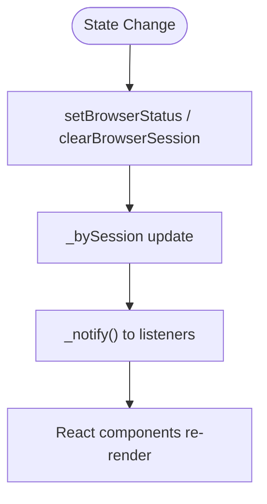
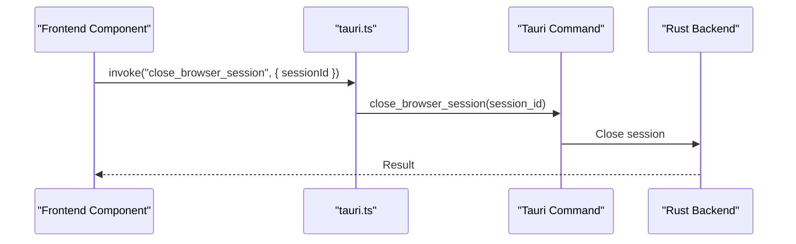
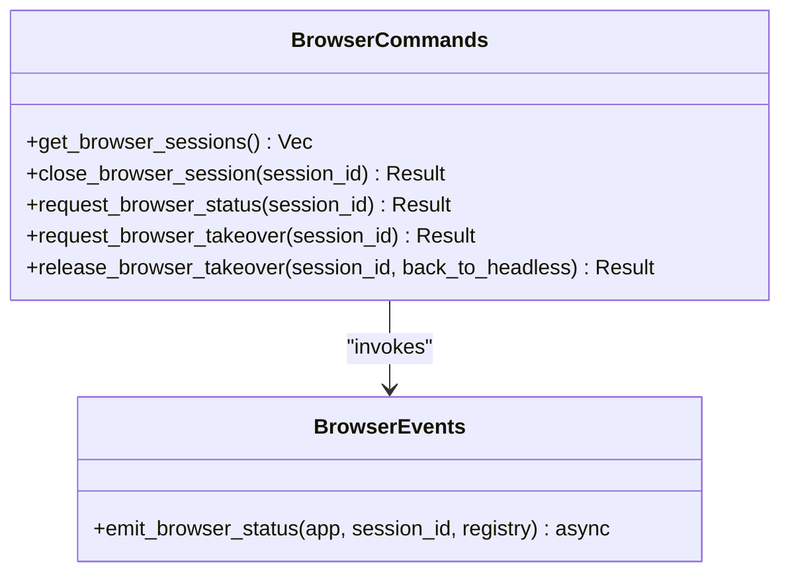
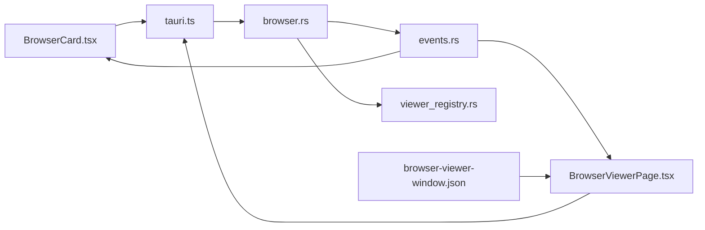

# Browser Viewer Interface

<cite>
**Referenced Files in This Document**
- [BrowserViewerPage.tsx](file://src/modules/browser-viewer/BrowserViewerPage.tsx)
- [BrowserCard.tsx](file://src/components/browser/BrowserCard.tsx)
- [browser-slice.ts](file://src/stores/browser-slice.ts)
- [tauri.ts](file://src/lib/tauri.ts)
- [browser.rs](file://src-tauri/src/commands/browser.rs)
- [events.rs](file://src-tauri/src/modules/browser/events.rs)
- [browser-viewer-window.json](file://src-tauri/capabilities/browser-viewer-window.json)
- [viewer_registry.rs](file://src-tauri/src/modules/viewer_registry.rs)
- [phase-7b-browser-control-system.yaml](file://docs/_legacy/exec-plans/active/phase-7b-browser-control-system.yaml)
- [ADR-015-Browser-Subsystem-Remediation-Design.md](file://docs/design-docs/postCLI/ADR/ADR-015-Browser-Subsystem-Remediation-Design.md)
</cite>

## Table of Contents
1. [Introduction](#introduction)
2. [Project Structure](#project-structure)
3. [Core Components](#core-components)
4. [Architecture Overview](#architecture-overview)
5. [Detailed Component Analysis](#detailed-component-analysis)
6. [Dependency Analysis](#dependency-analysis)
7. [Performance Considerations](#performance-considerations)
8. [Troubleshooting Guide](#troubleshooting-guide)
9. [Conclusion](#conclusion)

## Introduction
This document describes the browser viewer interface component that enables real-time visualization and control of AI-driven browser sessions. It covers the React-based browser card implementation, the dedicated viewer window for live page snapshots, and the integration between frontend components and backend browser sessions via Tauri IPC. The viewer supports debugging automation workflows, displaying page snapshots, and providing user interaction controls such as navigation, back/forward, reload, and emergency stop. It also documents configuration options for viewer appearance, size management, and positioning, along with accessibility and responsive design considerations.

## Project Structure
The browser viewer spans frontend React components, a shared browser state store, and backend Tauri commands and modules:
- Frontend modules:
  - BrowserCard: floating overlay card for session status and quick actions
  - BrowserViewerPage: toolbar and controls for the dedicated viewer window
  - browser-slice: module-level store for browser session state
  - tauri.ts: IPC helpers and event listeners for browser control
- Backend modules:
  - browser.rs: Tauri commands for browser control and status
  - events.rs: browser status event emission
  - viewer_registry.rs: maintains viewer content webview handles
  - capabilities: viewer window permissions

**Diagram sources**
- [BrowserCard.tsx:58-280](file://src/components/browser/BrowserCard.tsx#L58-L280)
- [BrowserViewerPage.tsx:46-284](file://src/modules/browser-viewer/BrowserViewerPage.tsx#L46-L284)
- [browser-slice.ts:12-103](file://src/stores/browser-slice.ts#L12-L103)
- [tauri.ts:1179-1364](file://src/lib/tauri.ts#L1179-L1364)
- [browser.rs:1-224](file://src-tauri/src/commands/browser.rs#L1-L224)
- [events.rs:1-83](file://src-tauri/src/modules/browser/events.rs#L1-L83)
- [viewer_registry.rs:1-29](file://src-tauri/src/modules/viewer_registry.rs#L1-L29)
- [browser-viewer-window.json:1-17](file://src-tauri/capabilities/browser-viewer-window.json#L1-L17)

**Section sources**
- [BrowserCard.tsx:1-280](file://src/components/browser/BrowserCard.tsx#L1-L280)
- [BrowserViewerPage.tsx:1-284](file://src/modules/browser-viewer/BrowserViewerPage.tsx#L1-L284)
- [browser-slice.ts:1-103](file://src/stores/browser-slice.ts#L1-L103)
- [tauri.ts:1179-1364](file://src/lib/tauri.ts#L1179-L1364)
- [browser.rs:1-224](file://src-tauri/src/commands/browser.rs#L1-L224)
- [events.rs:1-83](file://src-tauri/src/modules/browser/events.rs#L1-L83)
- [viewer_registry.rs:1-29](file://src-tauri/src/modules/viewer_registry.rs#L1-L29)
- [browser-viewer-window.json:1-17](file://src-tauri/capabilities/browser-viewer-window.json#L1-L17)

## Core Components
- BrowserCard: Renders a floating overlay card showing live viewport thumbnails, current hostname, running indicators, and controls for takeover/release, opening the viewer, and emergency stop. It subscribes to the "browser-status" event and updates the module-level store.
- BrowserViewerPage: Provides a toolbar for the dedicated viewer window, including back/forward/reload controls, URL bar, running indicator, open-in-system-browser, and stop button. It mirrors AI navigation into the native webview and listens to browser status events.
- Browser Store (browser-slice): A module-level store using useSyncExternalStore to manage per-session browser state, enabling efficient updates across components without prop drilling.
- IPC Layer (tauri.ts): Thin wrapper around @tauri-apps APIs exposing typed helpers for browser commands, event listening, and viewer window control.
- Backend Commands (browser.rs): Implements Tauri commands for closing sessions, requesting status, takeover/release, and profile management.
- Event Emission (events.rs): Emits "browser-status" events after each browser action, including URL and base64-encoded viewport thumbnails.
- Viewer Registry (viewer_registry.rs): Maintains native webview handles for open viewer windows and synchronizes AI navigation into the viewer content webview.

**Section sources**
- [BrowserCard.tsx:54-280](file://src/components/browser/BrowserCard.tsx#L54-L280)
- [BrowserViewerPage.tsx:46-284](file://src/modules/browser-viewer/BrowserViewerPage.tsx#L46-L284)
- [browser-slice.ts:12-103](file://src/stores/browser-slice.ts#L12-L103)
- [tauri.ts:1179-1364](file://src/lib/tauri.ts#L1179-L1364)
- [browser.rs:1-224](file://src-tauri/src/commands/browser.rs#L1-L224)
- [events.rs:19-83](file://src-tauri/src/modules/browser/events.rs#L19-L83)
- [viewer_registry.rs:15-29](file://src-tauri/src/modules/viewer_registry.rs#L15-L29)

## Architecture Overview
The viewer architecture integrates frontend React components with backend Tauri modules through a well-defined IPC pattern:
- Frontend components subscribe to "browser-status" events and update the shared store.
- Backend emits "browser-status" events after each browser action, capturing URL and viewport thumbnails.
- The viewer window uses a native webview to display live pages independently from the AI-controlled session.
- Viewer registry synchronizes AI navigation into the viewer content webview.

**Diagram sources**
- [events.rs:38-83](file://src-tauri/src/modules/browser/events.rs#L38-L83)
- [BrowserCard.tsx:76-112](file://src/components/browser/BrowserCard.tsx#L76-L112)
- [BrowserViewerPage.tsx:65-107](file://src/modules/browser-viewer/BrowserViewerPage.tsx#L65-L107)
- [viewer_registry.rs:19-29](file://src-tauri/src/modules/viewer_registry.rs#L19-L29)

## Detailed Component Analysis

### BrowserCard Component
The BrowserCard displays a compact, floating overlay for an AI-controlled browser session. It:
- Subscribes to "browser-status" events and updates the module-level store
- Shows a live viewport thumbnail (base64 JPEG) and current hostname
- Provides takeover/release controls, open viewer, and emergency stop
- Uses a floating overlay positioned in the top-right corner of the chat area

**Diagram sources**
- [BrowserCard.tsx:54-280](file://src/components/browser/BrowserCard.tsx#L54-L280)
- [browser-slice.ts:26-102](file://src/stores/browser-slice.ts#L26-L102)

**Section sources**
- [BrowserCard.tsx:54-280](file://src/components/browser/BrowserCard.tsx#L54-L280)
- [browser-slice.ts:12-103](file://src/stores/browser-slice.ts#L12-L103)

### BrowserViewerPage Component
The BrowserViewerPage renders the toolbar for the dedicated viewer window:
- Listens to "browser-status" events to populate URL and mirror navigation into the native webview
- Provides back/forward/reload controls and a URL input field
- Shows a running indicator and an open-in-system-browser button
- Includes an emergency stop button to close the browser session

**Diagram sources**
- [BrowserViewerPage.tsx:65-145](file://src/modules/browser-viewer/BrowserViewerPage.tsx#L65-L145)
- [tauri.ts:1342-1364](file://src/lib/tauri.ts#L1342-L1364)
- [browser.rs:1-224](file://src-tauri/src/commands/browser.rs#L1-L224)
- [viewer_registry.rs:19-29](file://src-tauri/src/modules/viewer_registry.rs#L19-L29)

**Section sources**
- [BrowserViewerPage.tsx:46-284](file://src/modules/browser-viewer/BrowserViewerPage.tsx#L46-L284)
- [tauri.ts:1319-1364](file://src/lib/tauri.ts#L1319-L1364)
- [browser.rs:1-224](file://src-tauri/src/commands/browser.rs#L1-L224)
- [viewer_registry.rs:19-29](file://src-tauri/src/modules/viewer_registry.rs#L19-L29)

### Browser Store (browser-slice)
The browser-slice implements a module-level store using useSyncExternalStore:
- Exposes browserBySession map and mutation functions
- Notifies subscribers on every state change
- Provides setBrowserStatus and clearBrowserSession for centralized state management

**Diagram sources**
- [browser-slice.ts:49-78](file://src/stores/browser-slice.ts#L49-L78)

**Section sources**
- [browser-slice.ts:12-103](file://src/stores/browser-slice.ts#L12-L103)

### IPC Communication Patterns
The IPC layer in tauri.ts provides typed helpers:
- listenToBrowserStatus: subscribe to "browser-status" events
- openBrowserViewerWindow: open or focus the viewer window
- requestBrowserStatus: trigger an immediate status event for initialization
- navigateViewerWindow, browserViewerGoBack, browserViewerGoForward, browserViewerReload: control the viewer webview
- closeBrowserSession: gracefully shut down a browser session
- request/release takeover: hand control to the user or reclaim it

**Diagram sources**
- [tauri.ts:1319-1364](file://src/lib/tauri.ts#L1319-L1364)
- [browser.rs:47-56](file://src-tauri/src/commands/browser.rs#L47-L56)

**Section sources**
- [tauri.ts:1179-1364](file://src/lib/tauri.ts#L1179-L1364)
- [browser.rs:1-224](file://src-tauri/src/commands/browser.rs#L1-L224)

### Backend Browser Commands and Events
The backend implements:
- get_browser_sessions: list active sessions
- close_browser_session: shutdown a session
- request_browser_status: emit a status event for initialization
- request/release takeover: switch between headless and headed modes
- emit_browser_status: asynchronous event emission with thumbnail capture

**Diagram sources**
- [browser.rs:37-224](file://src-tauri/src/commands/browser.rs#L37-L224)
- [events.rs:38-83](file://src-tauri/src/modules/browser/events.rs#L38-L83)

**Section sources**
- [browser.rs:1-224](file://src-tauri/src/commands/browser.rs#L1-L224)
- [events.rs:1-83](file://src-tauri/src/modules/browser/events.rs#L1-L83)

## Dependency Analysis
The viewer components depend on:
- Frontend-to-backend IPC via tauri.ts
- Backend event emission via events.rs
- Viewer registry synchronization via viewer_registry.rs
- Capability configuration for the viewer window via browser-viewer-window.json

**Diagram sources**
- [BrowserCard.tsx:16-32](file://src/components/browser/BrowserCard.tsx#L16-L32)
- [BrowserViewerPage.tsx:16-27](file://src/modules/browser-viewer/BrowserViewerPage.tsx#L16-L27)
- [tauri.ts:1319-1364](file://src/lib/tauri.ts#L1319-L1364)
- [browser.rs:1-224](file://src-tauri/src/commands/browser.rs#L1-L224)
- [events.rs:1-83](file://src-tauri/src/modules/browser/events.rs#L1-L83)
- [viewer_registry.rs:1-29](file://src-tauri/src/modules/viewer_registry.rs#L1-L29)
- [browser-viewer-window.json:1-17](file://src-tauri/capabilities/browser-viewer-window.json#L1-L17)

**Section sources**
- [BrowserCard.tsx:16-32](file://src/components/browser/BrowserCard.tsx#L16-L32)
- [BrowserViewerPage.tsx:16-27](file://src/modules/browser-viewer/BrowserViewerPage.tsx#L16-L27)
- [tauri.ts:1319-1364](file://src/lib/tauri.ts#L1319-L1364)
- [browser.rs:1-224](file://src-tauri/src/commands/browser.rs#L1-L224)
- [events.rs:1-83](file://src-tauri/src/modules/browser/events.rs#L1-L83)
- [viewer_registry.rs:1-29](file://src-tauri/src/modules/viewer_registry.rs#L1-L29)
- [browser-viewer-window.json:1-17](file://src-tauri/capabilities/browser-viewer-window.json#L1-L17)

## Performance Considerations
- Thumbnail capture is performed asynchronously to avoid blocking tool execution; failures degrade gracefully by emitting null thumbnails.
- The viewer content webview is synchronized with AI navigation to reduce redundant user interactions.
- The floating card minimizes rendering overhead by subscribing to a single global event stream and updating only when necessary.
- Native webview rendering bypasses iframe/X-Frame-Options restrictions, ensuring accurate page representation.

[No sources needed since this section provides general guidance]

## Troubleshooting Guide
Common issues and resolutions:
- Viewer window not opening: Verify the "browser-viewer" capability permissions and ensure the window identifier pattern matches the configured capability.
- Navigation not mirrored: Confirm that the viewer registry contains a webview handle for the session and that sync_viewer_url is invoked after successful AI navigation.
- Status events not received: Check that listenToBrowserStatus is properly subscribed and unmounted on component cleanup to avoid memory leaks.
- Thumbnail missing: Expect null thumbnails when screenshot capture fails; the event still emits with running state and URL.

**Section sources**
- [browser-viewer-window.json:1-17](file://src-tauri/capabilities/browser-viewer-window.json#L1-L17)
- [viewer_registry.rs:19-29](file://src-tauri/src/modules/viewer_registry.rs#L19-L29)
- [events.rs:38-83](file://src-tauri/src/modules/browser/events.rs#L38-L83)
- [BrowserViewerPage.tsx:65-107](file://src/modules/browser-viewer/BrowserViewerPage.tsx#L65-L107)

## Conclusion
The browser viewer interface provides a robust, real-time visualization and control mechanism for AI-driven browser sessions. Through a clean separation of concerns—frontend overlays, dedicated viewer windows, shared state management, and backend IPC—the system delivers reliable debugging capabilities, accurate page snapshots, and flexible user interaction controls. The architecture supports takeover/release workflows, responsive design, and accessibility considerations, enabling effective automation oversight across diverse use cases.