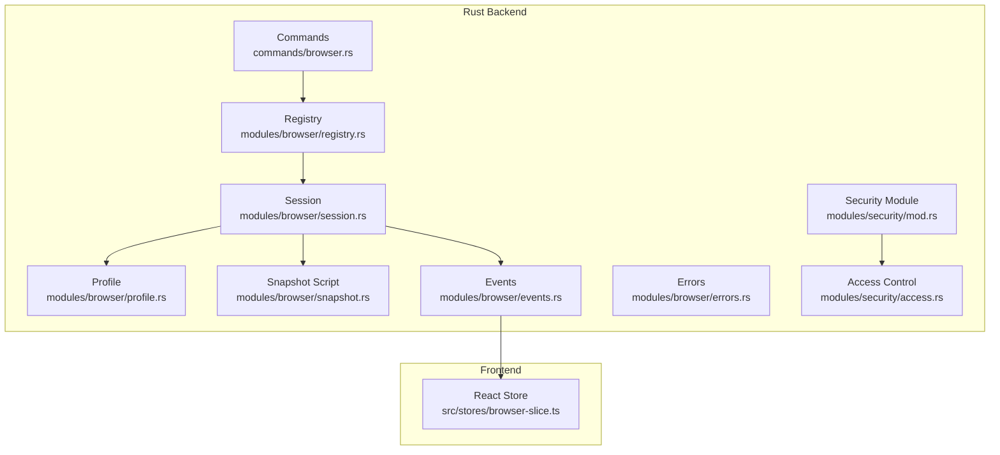
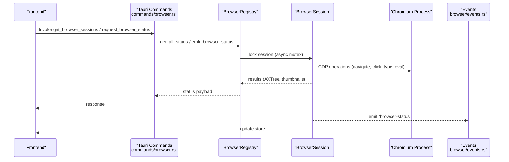
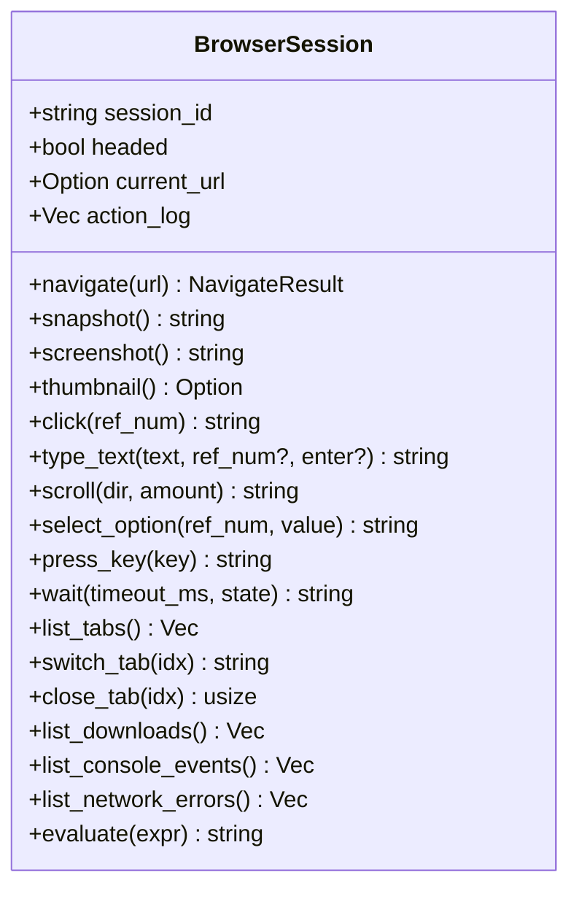
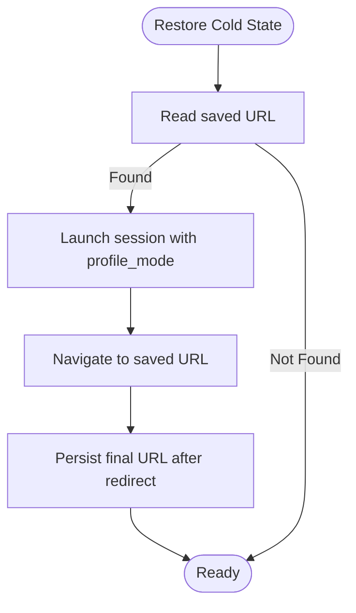
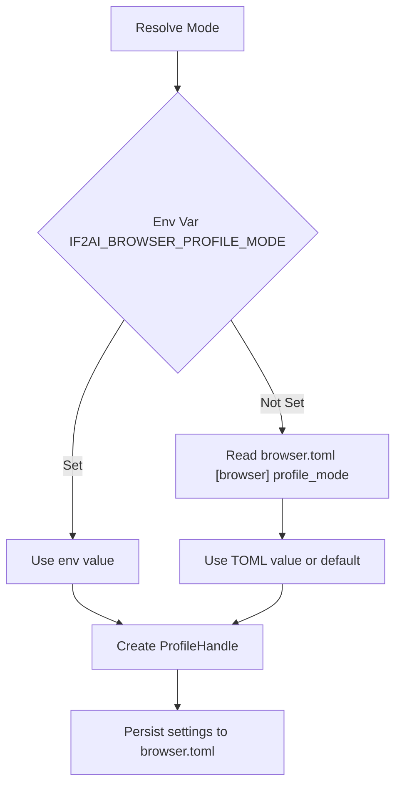
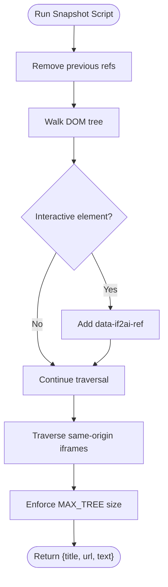
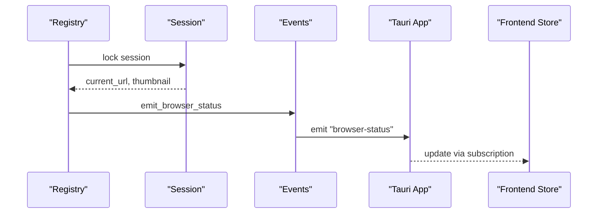
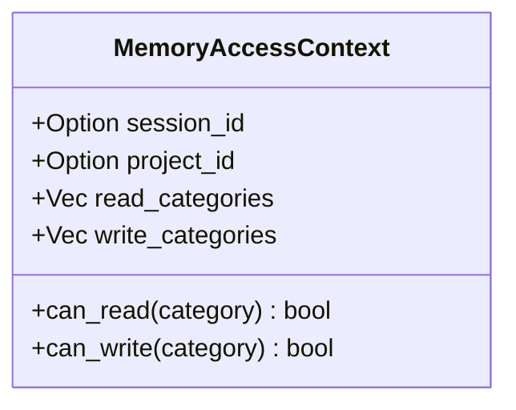
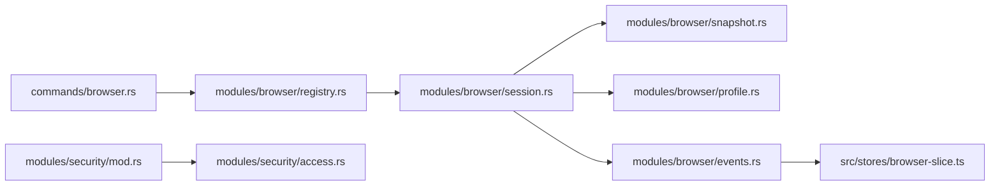
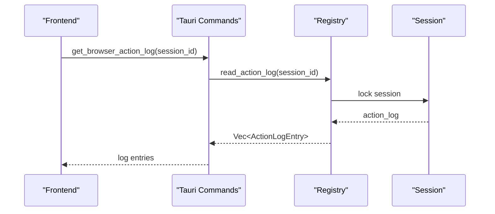

# Security & Troubleshooting

<cite>
**Referenced Files in This Document**
- [browser/mod.rs](file://src-tauri/src/modules/browser/mod.rs)
- [browser/session.rs](file://src-tauri/src/modules/browser/session.rs)
- [browser/registry.rs](file://src-tauri/src/modules/browser/registry.rs)
- [browser/errors.rs](file://src-tauri/src/modules/browser/errors.rs)
- [browser/events.rs](file://src-tauri/src/modules/browser/events.rs)
- [browser/profile.rs](file://src-tauri/src/modules/browser/profile.rs)
- [browser/snapshot.rs](file://src-tauri/src/modules/browser/snapshot.rs)
- [commands/browser.rs](file://src-tauri/src/commands/browser.rs)
- [security/mod.rs](file://src-tauri/src/modules/security/mod.rs)
- [security/access.rs](file://src-tauri/src/modules/security/access.rs)
- [stores/browser-slice.ts](file://src/stores/browser-slice.ts)
- [security_integration.rs](file://src-tauri/tests/security_integration.rs)
</cite>

## Table of Contents
1. [Introduction](#introduction)
2. [Project Structure](#project-structure)
3. [Core Components](#core-components)
4. [Architecture Overview](#architecture-overview)
5. [Detailed Component Analysis](#detailed-component-analysis)
6. [Dependency Analysis](#dependency-analysis)
7. [Performance Considerations](#performance-considerations)
8. [Troubleshooting Guide](#troubleshooting-guide)
9. [Conclusion](#conclusion)
10. [Appendices](#appendices)

## Introduction
This document provides comprehensive security and troubleshooting guidance for the browser automation subsystem. It covers sandboxing, process isolation, privilege management, threat detection, content safety, and safe browsing practices. It also documents common troubleshooting scenarios, diagnostic tools, logging strategies, production best practices, and recovery procedures.

## Project Structure
The browser automation subsystem is implemented in Rust and exposed to the frontend via Tauri commands and events. Key areas:
- Browser lifecycle and automation: session, registry, profile, snapshot, and events
- Frontend integration: a React store synchronized with backend browser status
- Security foundations: access control and atomic write patterns
- Tests: integration coverage for security boundaries

**Diagram sources**
- [commands/browser.rs:1-224](file://src-tauri/src/commands/browser.rs#L1-L224)
- [browser/registry.rs:1-634](file://src-tauri/src/modules/browser/registry.rs#L1-L634)
- [browser/session.rs:1-800](file://src-tauri/src/modules/browser/session.rs#L1-L800)
- [browser/profile.rs:1-693](file://src-tauri/src/modules/browser/profile.rs#L1-L693)
- [browser/snapshot.rs:1-253](file://src-tauri/src/modules/browser/snapshot.rs#L1-L253)
- [browser/events.rs:1-83](file://src-tauri/src/modules/browser/events.rs#L1-L83)
- [browser/errors.rs:1-78](file://src-tauri/src/modules/browser/errors.rs#L1-L78)
- [security/mod.rs:1-26](file://src-tauri/src/modules/security/mod.rs#L1-L26)
- [security/access.rs:1-104](file://src-tauri/src/modules/security/access.rs#L1-L104)
- [stores/browser-slice.ts:1-103](file://src/stores/browser-slice.ts#L1-L103)

**Section sources**
- [browser/mod.rs:1-40](file://src-tauri/src/modules/browser/mod.rs#L1-L40)
- [commands/browser.rs:1-224](file://src-tauri/src/commands/browser.rs#L1-L224)
- [stores/browser-slice.ts:1-103](file://src/stores/browser-slice.ts#L1-L103)

## Core Components
- BrowserSession: encapsulates a headless/headed Chromium process, page, and automation actions; manages downloads, console/network logs, and action logs
- BrowserRegistry: global registry managing per-session BrowserSession instances with concurrency-safe access and cold-state persistence
- Profile management: controls user-data-dir placement and lifecycle (ephemeral vs persistent vs shared)
- Snapshot engine: injects a deterministic AXTree snapshot script with ref attributes for LLM targeting
- Events and store: emits “browser-status” events and synchronizes frontend state
- Security module: provides access control and atomic write primitives

**Section sources**
- [browser/session.rs:262-497](file://src-tauri/src/modules/browser/session.rs#L262-L497)
- [browser/registry.rs:40-75](file://src-tauri/src/modules/browser/registry.rs#L40-L75)
- [browser/profile.rs:54-169](file://src-tauri/src/modules/browser/profile.rs#L54-L169)
- [browser/snapshot.rs:16-223](file://src-tauri/src/modules/browser/snapshot.rs#L16-L223)
- [browser/events.rs:19-82](file://src-tauri/src/modules/browser/events.rs#L19-L82)
- [security/access.rs:8-58](file://src-tauri/src/modules/security/access.rs#L8-L58)

## Architecture Overview
The subsystem orchestrates automation through a registry that spawns and supervises sessions. Sessions configure Chromium with sandbox and stealth mitigations, inject snapshot logic, and expose safe APIs for navigation, clicking, typing, scrolling, and evaluation. Events propagate state to the frontend, and the store maintains a reactive UI overlay.

**Diagram sources**
- [commands/browser.rs:37-85](file://src-tauri/src/commands/browser.rs#L37-L85)
- [browser/registry.rs:552-572](file://src-tauri/src/modules/browser/registry.rs#L552-L572)
- [browser/events.rs:51-82](file://src-tauri/src/modules/browser/events.rs#L51-L82)
- [browser/session.rs:616-726](file://src-tauri/src/modules/browser/session.rs#L616-L726)

## Detailed Component Analysis

### BrowserSession: Automation, Safety, and Observability
- Process isolation: each session owns a dedicated Chromium process configured with sandbox and stealth settings
- Stealth mode: removes automation markers and sets a realistic user agent to reduce detection
- Safe input: uses CDP InsertText and key dispatch; enforces timeouts and post-action waits
- Observability: maintains in-memory ledgers for console events and network errors; supports download tracking and thumbnail capture
- Action logging: records every action with parameters and outcomes for recovery and auditing

**Diagram sources**
- [browser/session.rs:262-497](file://src-tauri/src/modules/browser/session.rs#L262-L497)
- [browser/session.rs:616-800](file://src-tauri/src/modules/browser/session.rs#L616-L800)

**Section sources**
- [browser/session.rs:356-497](file://src-tauri/src/modules/browser/session.rs#L356-L497)
- [browser/session.rs:544-561](file://src-tauri/src/modules/browser/session.rs#L544-L561)
- [browser/session.rs:616-726](file://src-tauri/src/modules/browser/session.rs#L616-L726)

### BrowserRegistry: Concurrency, Persistence, and Recovery
- Concurrency: uses DashMap for session lookup and async Mutex for per-session operations
- Cold-state persistence: restores last visited URL across restarts
- Headed takeover: safely relaunches a session in headed mode and resumes navigation
- Status caching: maintains last-known URLs to avoid blocking on busy sessions

**Diagram sources**
- [browser/registry.rs:443-460](file://src-tauri/src/modules/browser/registry.rs#L443-L460)
- [browser/registry.rs:245-261](file://src-tauri/src/modules/browser/registry.rs#L245-L261)

**Section sources**
- [browser/registry.rs:40-75](file://src-tauri/src/modules/browser/registry.rs#L40-L75)
- [browser/registry.rs:166-194](file://src-tauri/src/modules/browser/registry.rs#L166-L194)
- [browser/registry.rs:443-460](file://src-tauri/src/modules/browser/registry.rs#L443-L460)

### Profile Management: Isolation and Lifecycle
- Modes: PerSessionPersistent, Shared, Ephemeral
- Resolution: environment variable overrides TOML setting; TOML fallbacks to default
- Disk caps: settings include soft caps for future LRU cleanup
- Cleanup: explicit command to clear persistent profiles when sessions are closed

**Diagram sources**
- [browser/profile.rs:84-106](file://src-tauri/src/modules/browser/profile.rs#L84-L106)
- [browser/profile.rs:115-168](file://src-tauri/src/modules/browser/profile.rs#L115-L168)
- [browser/profile.rs:234-287](file://src-tauri/src/modules/browser/profile.rs#L234-L287)

**Section sources**
- [browser/profile.rs:54-106](file://src-tauri/src/modules/browser/profile.rs#L54-L106)
- [browser/profile.rs:115-168](file://src-tauri/src/modules/browser/profile.rs#L115-L168)
- [browser/profile.rs:234-287](file://src-tauri/src/modules/browser/profile.rs#L234-L287)

### Snapshot Engine: Deterministic AXTree and SSRF Guardrails
- Injects a snapshot script that annotates interactive elements with data-if2ai-ref
- Limits output size and truncates to preserve performance
- Includes same-origin iframe traversal to improve LLM coverage

**Diagram sources**
- [browser/snapshot.rs:25-223](file://src-tauri/src/modules/browser/snapshot.rs#L25-L223)

**Section sources**
- [browser/snapshot.rs:16-223](file://src-tauri/src/modules/browser/snapshot.rs#L16-L223)

### Events and Frontend Store: Live Status and Diagnostics
- Backend emits “browser-status” with running state, URL, and optional thumbnail
- Frontend store merges partial updates and notifies subscribers
- Commands expose manual refresh and takeover/release flows

**Diagram sources**
- [browser/events.rs:51-82](file://src-tauri/src/modules/browser/events.rs#L51-L82)
- [stores/browser-slice.ts:80-102](file://src/stores/browser-slice.ts#L80-L102)

**Section sources**
- [browser/events.rs:19-82](file://src-tauri/src/modules/browser/events.rs#L19-L82)
- [stores/browser-slice.ts:16-34](file://src/stores/browser-slice.ts#L16-L34)

### Security Module: Access Control and Atomic Operations
- Memory access control: category-based permissions for sessions and projects
- Atomic writes: crash-safe file operations
- Integration tests validate XSS scanning, path traversal blocking, and permission enforcement

**Diagram sources**
- [security/access.rs:8-58](file://src-tauri/src/modules/security/access.rs#L8-L58)

**Section sources**
- [security/mod.rs:1-26](file://src-tauri/src/modules/security/mod.rs#L1-L26)
- [security/access.rs:8-58](file://src-tauri/src/modules/security/access.rs#L8-L58)
- [security_integration.rs:1-140](file://src-tauri/tests/security_integration.rs#L1-L140)

## Dependency Analysis
- Registry depends on Session, Profile, and ColdState for lifecycle and persistence
- Session depends on Chromiumoxide for CDP operations and snapshot script injection
- Commands depend on Registry for orchestration and on Events for frontend updates
- Frontend store depends on Tauri event emission for synchronization

**Diagram sources**
- [commands/browser.rs:1-224](file://src-tauri/src/commands/browser.rs#L1-L224)
- [browser/registry.rs:1-634](file://src-tauri/src/modules/browser/registry.rs#L1-L634)
- [browser/session.rs:1-800](file://src-tauri/src/modules/browser/session.rs#L1-L800)
- [browser/snapshot.rs:1-253](file://src-tauri/src/modules/browser/snapshot.rs#L1-L253)
- [browser/profile.rs:1-693](file://src-tauri/src/modules/browser/profile.rs#L1-L693)
- [browser/events.rs:1-83](file://src-tauri/src/modules/browser/events.rs#L1-L83)
- [stores/browser-slice.ts:1-103](file://src/stores/browser-slice.ts#L1-L103)
- [security/mod.rs:1-26](file://src-tauri/src/modules/security/mod.rs#L1-L26)
- [security/access.rs:1-104](file://src-tauri/src/modules/security/access.rs#L1-L104)

**Section sources**
- [browser/registry.rs:1-120](file://src-tauri/src/modules/browser/registry.rs#L1-L120)
- [browser/session.rs:1-60](file://src-tauri/src/modules/browser/session.rs#L1-L60)

## Performance Considerations
- Headless vs headed trade-offs: disable GPU in headless mode to avoid initialization crashes; enable GPU in headed mode for accurate rendering
- Stealth overhead: minimal impact; improves compatibility with anti-bot systems
- Snapshot size limits: enforced to keep payloads manageable and avoid memory pressure
- Post-action delays: tuned to accommodate SPA navigation and reduce double-click risks
- Network idle detection: bounded polling cadence prevents starvation while ensuring responsiveness

[No sources needed since this section provides general guidance]

## Troubleshooting Guide

### Common Issues and Resolutions
- Chrome/Chromium not found
  - Symptom: startup fails with “Chrome/Chromium not found”
  - Action: install Google Chrome or Chromium; verify availability via get_chrome_status
  - Section sources
    - [commands/browser.rs:58-68](file://src-tauri/src/commands/browser.rs#L58-L68)
    - [browser/errors.rs:8-10](file://src-tauri/src/modules/browser/errors.rs#L8-L10)

- Browser session not running
  - Symptom: “No browser session found” or “Browser is not running”
  - Action: ensure session is launched; use get_browser_sessions to confirm status
  - Section sources
    - [browser/errors.rs:12-18](file://src-tauri/src/modules/browser/errors.rs#L12-L18)
    - [commands/browser.rs:37-45](file://src-tauri/src/commands/browser.rs#L37-L45)

- Element reference not found
  - Symptom: “Element with ref [N] not found”
  - Action: take a fresh snapshot to refresh refs; ensure the element is visible and interactive
  - Section sources
    - [browser/errors.rs:28-30](file://src-tauri/src/modules/browser/errors.rs#L28-L30)
    - [browser/session.rs:683-706](file://src-tauri/src/modules/browser/session.rs#L683-L706)

- Evaluation expression too long
  - Symptom: “evaluate expression too long”
  - Action: split scripts into smaller chunks under the 10 KB limit
  - Section sources
    - [browser/errors.rs:66-70](file://src-tauri/src/modules/browser/errors.rs#L66-L70)

- Profile deletion blocked
  - Symptom: “Session ‘X’ must be closed before clearing its profile”
  - Action: close the session first; then clear the profile
  - Section sources
    - [commands/browser.rs:105-121](file://src-tauri/src/commands/browser.rs#L105-L121)
    - [browser/errors.rs:53-57](file://src-tauri/src/modules/browser/errors.rs#L53-L57)

- Headed takeover failures
  - Symptom: relaunch to headed mode fails (e.g., no display)
  - Action: release takeover and retry; rollback flag is handled automatically
  - Section sources
    - [commands/browser.rs:168-183](file://src-tauri/src/commands/browser.rs#L168-L183)

### Diagnostic Tools and Logging Strategies
- Browser status events: subscribe to “browser-status”; inspect running state, URL, and thumbnail
- Action log: retrieve via get_browser_action_log for replay and debugging
- Console and network ledgers: list_console_events and list_network_errors for recent warnings/errors
- Downloads ledger: list_downloads for in-progress and completed downloads
- Frontend store: use setBrowserStatus to merge updates and clearBrowserSession to remove entries

**Diagram sources**
- [commands/browser.rs:188-197](file://src-tauri/src/commands/browser.rs#L188-L197)
- [browser/registry.rs:580-587](file://src-tauri/src/modules/browser/registry.rs#L580-L587)

**Section sources**
- [browser/events.rs:19-82](file://src-tauri/src/modules/browser/events.rs#L19-L82)
- [commands/browser.rs:188-197](file://src-tauri/src/commands/browser.rs#L188-L197)
- [browser/registry.rs:390-409](file://src-tauri/src/modules/browser/registry.rs#L390-L409)

### Security Best Practices for Production
- Sandboxing and stealth
  - Use no_sandbox and disable-setuid-sandbox when launching as a child process
  - Remove automation indicators and set realistic user agent
  - Section sources
    - [browser/session.rs:356-379](file://src-tauri/src/modules/browser/session.rs#L356-L379)
    - [browser/session.rs:460-477](file://src-tauri/src/modules/browser/session.rs#L460-L477)

- Process isolation and privilege management
  - Keep each session in its own Chromium process
  - Avoid elevated privileges; run with least-privilege accounts
  - Section sources
    - [browser/session.rs:262-308](file://src-tauri/src/modules/browser/session.rs#L262-L308)

- Content safety and threat detection
  - Enforce profile mode policies (PerSessionPersistent/Shared/Ephemeral)
  - Validate and sanitize inputs; leverage atomic write patterns
  - Section sources
    - [browser/profile.rs:54-77](file://src-tauri/src/modules/browser/profile.rs#L54-L77)
    - [security/mod.rs:1-26](file://src-tauri/src/modules/security/mod.rs#L1-L26)

- Safe browsing practices
  - Prefer headless mode for automation; use headed mode only for user takeover
  - Respect network idle detection and post-action delays
  - Section sources
    - [browser/session.rs:381-395](file://src-tauri/src/modules/browser/session.rs#L381-L395)
    - [browser/session.rs:208-230](file://src-tauri/src/modules/browser/session.rs#L208-L230)

### Resource Limits and Monitoring
- Disk usage caps: configure soft caps in browser.toml for per-profile and total disk usage
- Snapshot size limits: enforced to prevent memory pressure
- Network idle polling: bounded cadence to avoid starvation
- Section sources
  - [browser/profile.rs:226-227](file://src-tauri/src/modules/browser/profile.rs#L226-L227)
  - [browser/snapshot.rs:27-216](file://src-tauri/src/modules/browser/snapshot.rs#L27-L216)
  - [browser/session.rs:225-230](file://src-tauri/src/modules/browser/session.rs#L225-L230)

### Recovery Procedures and Graceful Degradation
- Cold-state restore: on startup, restore last visited URL if present
- Graceful shutdown: close sessions to terminate Chromium; defer close if references remain
- Event emission robustness: thumbnail capture failures do not block event emission
- Section sources
  - [browser/registry.rs:443-460](file://src-tauri/src/modules/browser/registry.rs#L443-L460)
  - [browser/registry.rs:201-237](file://src-tauri/src/modules/browser/registry.rs#L201-L237)
  - [browser/events.rs:47-50](file://src-tauri/src/modules/browser/events.rs#L47-L50)

## Conclusion
The browser automation subsystem integrates strong isolation, stealth, and observability with practical diagnostics and recovery mechanisms. By adhering to the outlined security and troubleshooting practices—sandboxing, privilege minimization, input validation, and robust monitoring—you can operate the system reliably in production environments.

## Appendices

### API and IPC Reference
- Commands
  - get_browser_sessions: list active sessions and status
  - close_browser_session: gracefully shut down a session
  - get_chrome_status: check Chrome/Chromium availability
  - request_browser_status: emit current status event
  - list_browser_profiles / clear_browser_profile: manage persistent profiles
  - get_browser_settings / set_browser_settings: read/write browser.toml
  - request_browser_takeover / release_browser_takeover: control headed mode
  - get_browser_action_log: retrieve action log
- Section sources
  - [commands/browser.rs:37-224](file://src-tauri/src/commands/browser.rs#L37-L224)