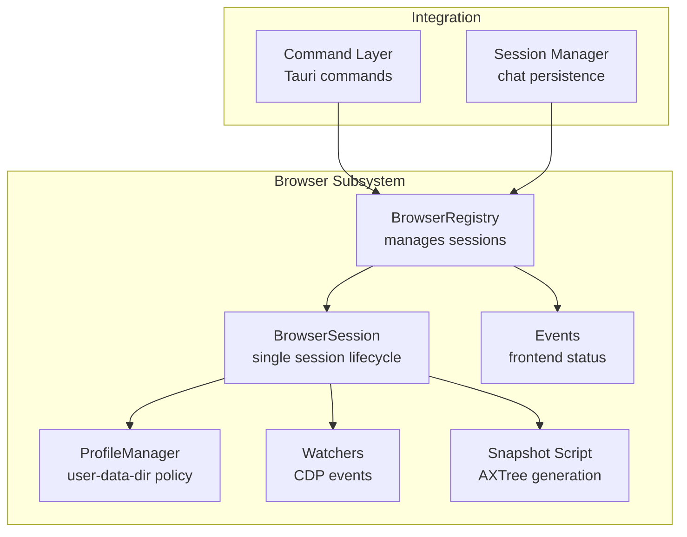
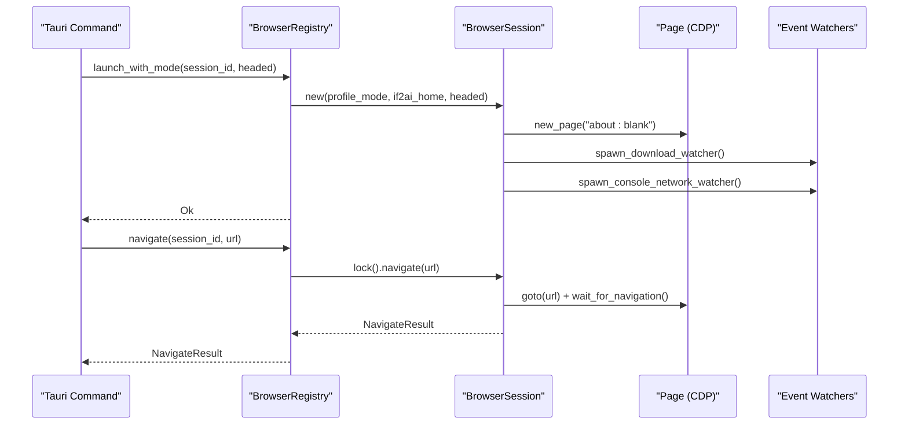
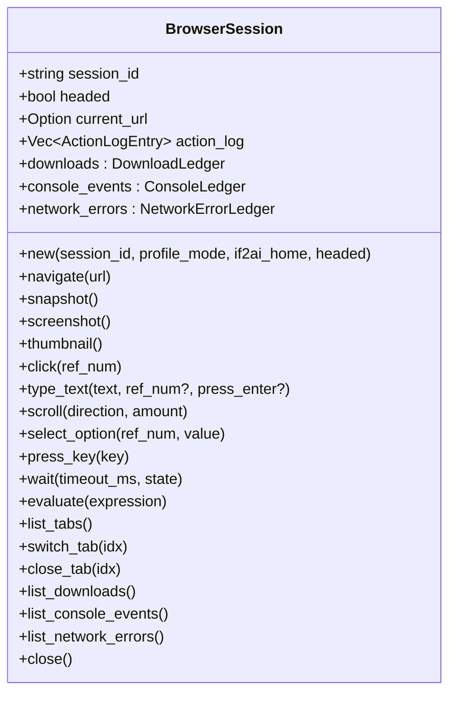
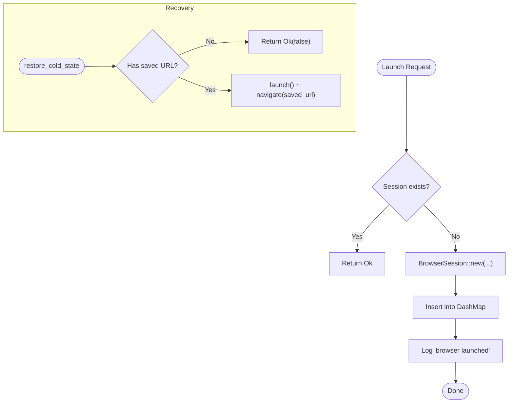
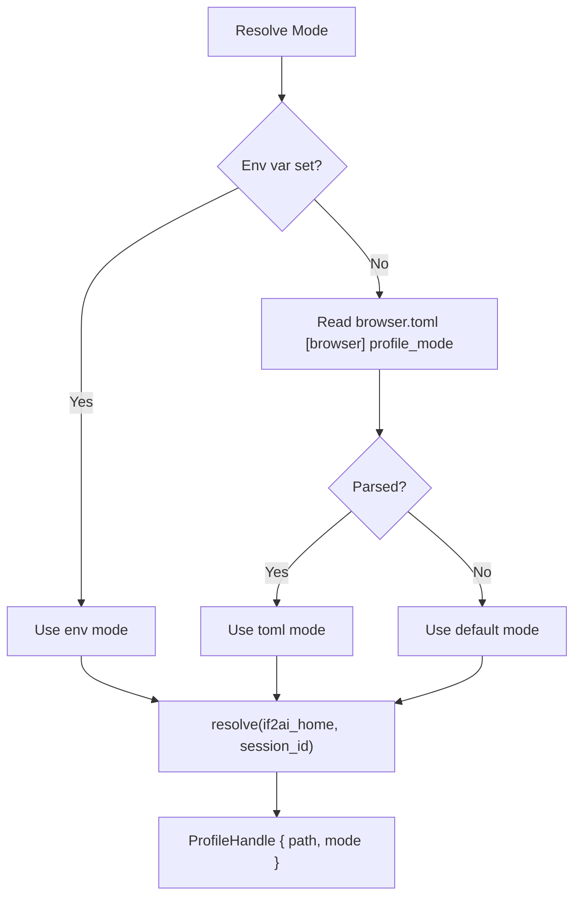
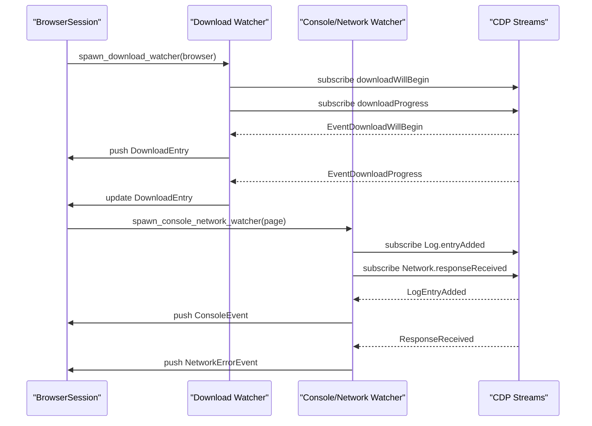
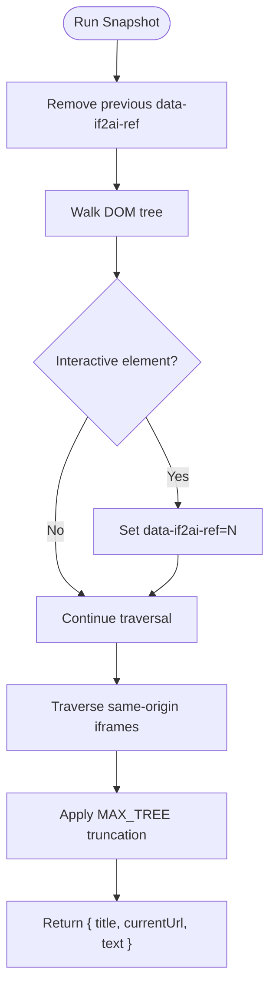
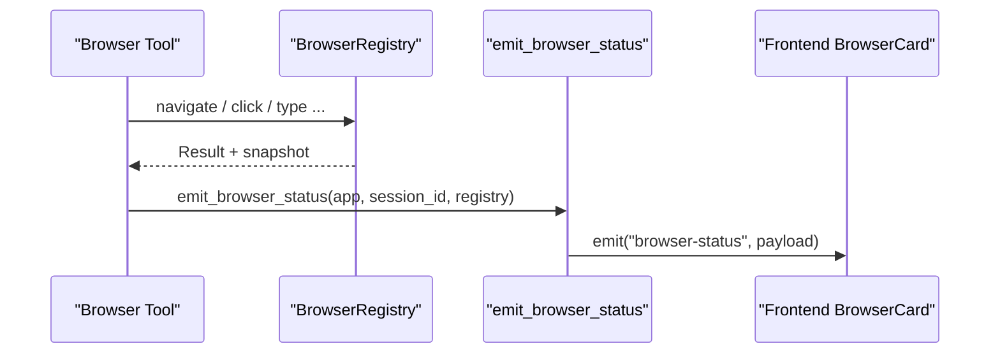
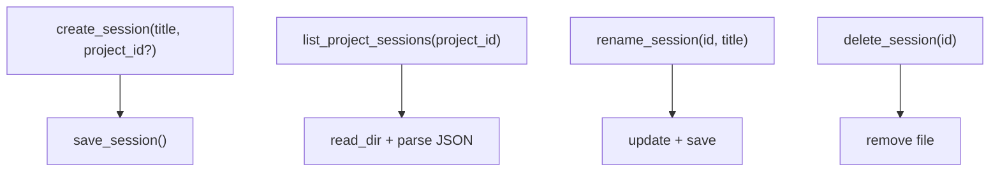
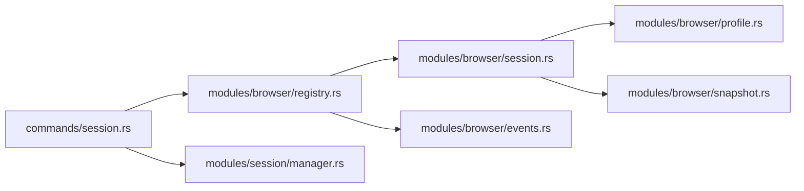

# Session Management & CDP Integration

<cite>
**Referenced Files in This Document**
- [lib.rs](file://src-tauri/src/lib.rs)
- [session.rs](file://src-tauri/src/modules/browser/session.rs)
- [registry.rs](file://src-tauri/src/modules/browser/registry.rs)
- [profile.rs](file://src-tauri/src/modules/browser/profile.rs)
- [events.rs](file://src-tauri/src/modules/browser/events.rs)
- [snapshot.rs](file://src-tauri/src/modules/browser/snapshot.rs)
- [chrome_finder.rs](file://src-tauri/src/modules/browser/chrome_finder.rs)
- [manager.rs](file://src-tauri/src/modules/session/manager.rs)
- [session.rs](file://src-tauri/src/commands/session.rs)
</cite>

## Table of Contents
1. [Introduction](#introduction)
2. [Project Structure](#project-structure)
3. [Core Components](#core-components)
4. [Architecture Overview](#architecture-overview)
5. [Detailed Component Analysis](#detailed-component-analysis)
6. [Dependency Analysis](#dependency-analysis)
7. [Performance Considerations](#performance-considerations)
8. [Troubleshooting Guide](#troubleshooting-guide)
9. [Conclusion](#conclusion)
10. [Appendices](#appendices)

## Introduction
This document explains browser session management and Chrome DevTools Protocol (CDP) integration in the If2Ai project. It covers the complete session lifecycle from creation to destruction, including profile isolation, user agent customization, cookie management, CDP message handling, event subscription patterns, asynchronous communication, state persistence, snapshot capabilities, recovery mechanisms, and practical configuration examples. It also addresses performance, memory management, resource cleanup, and troubleshooting.

## Project Structure
The browser subsystem resides under the Tauri backend and integrates with the broader runtime. The key modules are:
- Browser registry and session lifecycle
- Profile management and persistence
- CDP event watchers and snapshot generation
- Frontend event emission
- Session persistence for chat conversations

**Diagram sources**
- [registry.rs:44-75](file://src-tauri/src/modules/browser/registry.rs#L44-L75)
- [session.rs:262-308](file://src-tauri/src/modules/browser/session.rs#L262-L308)
- [profile.rs:56-168](file://src-tauri/src/modules/browser/profile.rs#L56-L168)
- [events.rs:19-36](file://src-tauri/src/modules/browser/events.rs#L19-L36)
- [snapshot.rs:16-253](file://src-tauri/src/modules/browser/snapshot.rs#L16-L253)
- [session.rs:10-135](file://src-tauri/src/commands/session.rs#L10-L135)
- [manager.rs:255-274](file://src-tauri/src/modules/session/manager.rs#L255-L274)

**Section sources**
- [lib.rs:12-20](file://src-tauri/src/lib.rs#L12-L20)
- [registry.rs:1-75](file://src-tauri/src/modules/browser/registry.rs#L1-L75)
- [session.rs:1-48](file://src-tauri/src/modules/browser/session.rs#L1-L48)

## Core Components
- BrowserRegistry: Central coordinator managing per-session BrowserSession instances, cold-state persistence, takeover flags, and status reporting.
- BrowserSession: Wraps a chromiumoxide Browser and Page, orchestrates CDP operations, waits, snapshots, downloads, and observability ledgers.
- ProfileManager: Determines and resolves user-data-dir locations per session, supporting persistent, shared, or ephemeral modes.
- Watchers: Background tasks listening to CDP events for downloads, console logs, and network errors.
- Snapshot Script: Generates AXTree-based text snapshots with element references for LLM interaction.
- Events: Emits "browser-status" Tauri events to keep the frontend synchronized.
- Session Manager: Manages chat session persistence (not browser state) for conversation continuity.

**Section sources**
- [registry.rs:44-75](file://src-tauri/src/modules/browser/registry.rs#L44-L75)
- [session.rs:262-308](file://src-tauri/src/modules/browser/session.rs#L262-L308)
- [profile.rs:56-168](file://src-tauri/src/modules/browser/profile.rs#L56-L168)
- [events.rs:19-36](file://src-tauri/src/modules/browser/events.rs#L19-L36)
- [snapshot.rs:16-253](file://src-tauri/src/modules/browser/snapshot.rs#L16-L253)
- [manager.rs:255-274](file://src-tauri/src/modules/session/manager.rs#L255-L274)

## Architecture Overview
The browser subsystem uses a registry pattern to manage concurrent sessions safely. Each session encapsulates a Chromium process and a Page. The registry coordinates launching, routing operations, and closing sessions. CDP event streams are subscribed to via background tasks and fan into in-memory ledgers. Snapshots are generated via an injected AXTree script. Frontend synchronization occurs through Tauri events.

**Diagram sources**
- [registry.rs:174-194](file://src-tauri/src/modules/browser/registry.rs#L174-L194)
- [session.rs:618-656](file://src-tauri/src/modules/browser/session.rs#L618-L656)
- [session.rs:1222-1286](file://src-tauri/src/modules/browser/session.rs#L1222-L1286)
- [session.rs:1288-1363](file://src-tauri/src/modules/browser/session.rs#L1288-L1363)

## Detailed Component Analysis

### BrowserSession: Lifecycle, CDP, and Operations
- Lifecycle: Launches Chromium with profile resolution, sets stealth user agent, enables downloads, spawns watchers, and maintains URL cache.
- CDP Integration: Uses chromiumoxide to send/receive CDP messages, subscribe to events, and wait for page states.
- Actions: Navigate, snapshot, screenshot/thumbnail, click, type, scroll, select option, press key, evaluate JS, multi-tab management, and wait states.
- Observability: Maintains ring buffers for downloads, console events, and network errors.
- Resource cleanup: Aborts watcher tasks and closes the browser on drop/close.

**Diagram sources**
- [session.rs:262-308](file://src-tauri/src/modules/browser/session.rs#L262-L308)
- [session.rs:618-656](file://src-tauri/src/modules/browser/session.rs#L618-L656)
- [session.rs:1001-1142](file://src-tauri/src/modules/browser/session.rs#L1001-L1142)

**Section sources**
- [session.rs:310-497](file://src-tauri/src/modules/browser/session.rs#L310-L497)
- [session.rs:614-999](file://src-tauri/src/modules/browser/session.rs#L614-L999)
- [session.rs:1001-1220](file://src-tauri/src/modules/browser/session.rs#L1001-L1220)

### BrowserRegistry: Concurrency, Status, and Recovery
- Concurrency: Uses DashMap for session lookup and Arc<Mutex<>> for per-session exclusive access, avoiding blocking across await points.
- Status: Tracks running sessions, last-known URLs, and takeover flags for human takeover.
- Recovery: Cold-state persistence restores last visited URL across restarts; relaunch_with_mode toggles headed mode while preserving persistent profiles.

**Diagram sources**
- [registry.rs:166-194](file://src-tauri/src/modules/browser/registry.rs#L166-L194)
- [registry.rs:436-460](file://src-tauri/src/modules/browser/registry.rs#L436-L460)

**Section sources**
- [registry.rs:44-75](file://src-tauri/src/modules/browser/registry.rs#L44-L75)
- [registry.rs:166-194](file://src-tauri/src/modules/browser/registry.rs#L166-L194)
- [registry.rs:436-460](file://src-tauri/src/modules/browser/registry.rs#L436-L460)

### Profile Management: Isolation and Persistence
- Modes: PerSessionPersistent (isolated), Shared (shared), Ephemeral (temporary).
- Resolution: Environment variable IF2AI_BROWSER_PROFILE_MODE, then browser.toml, then default.
- Behavior: Drop semantics delete directory only for Ephemeral; persistent profiles survive restarts.

**Diagram sources**
- [profile.rs:85-106](file://src-tauri/src/modules/browser/profile.rs#L85-L106)
- [profile.rs:115-168](file://src-tauri/src/modules/browser/profile.rs#L115-L168)

**Section sources**
- [profile.rs:56-168](file://src-tauri/src/modules/browser/profile.rs#L56-L168)
- [profile.rs:344-401](file://src-tauri/src/modules/browser/profile.rs#L344-L401)

### CDP Event Handling and Observability
- Downloads: Subscribes to downloadWillBegin and downloadProgress; maintains ring buffer with state transitions.
- Console/Network: Enables Log and Network domains; filters and buffers console warnings/errors and HTTP 4xx/5xx.
- Threading: Spawned tasks with select loops; gracefully terminate when listeners end.

**Diagram sources**
- [session.rs:1222-1286](file://src-tauri/src/modules/browser/session.rs#L1222-L1286)
- [session.rs:1288-1363](file://src-tauri/src/modules/browser/session.rs#L1288-L1363)

**Section sources**
- [session.rs:1222-1286](file://src-tauri/src/modules/browser/session.rs#L1222-L1286)
- [session.rs:1288-1363](file://src-tauri/src/modules/browser/session.rs#L1288-L1363)

### Snapshot Generation and Interaction Model
- AXTree Snapshot: Injects a script that annotates interactive elements with data-if2ai-ref attributes and produces a structured text representation.
- Interaction: LLM references elements by [N] to click/type/select; session evaluates element queries and performs actions.

**Diagram sources**
- [snapshot.rs:25-223](file://src-tauri/src/modules/browser/snapshot.rs#L25-L223)

**Section sources**
- [snapshot.rs:16-253](file://src-tauri/src/modules/browser/snapshot.rs#L16-L253)
- [session.rs:544-561](file://src-tauri/src/modules/browser/session.rs#L544-L561)

### Frontend Synchronization and Status Events
- Event Emission: After each action, emit "browser-status" with running state, URL, and optional thumbnail.
- Failure Handling: Thumbnail capture failures degrade to None; emit still succeeds.

**Diagram sources**
- [events.rs:51-82](file://src-tauri/src/modules/browser/events.rs#L51-L82)
- [registry.rs:245-261](file://src-tauri/src/modules/browser/registry.rs#L245-L261)

**Section sources**
- [events.rs:19-36](file://src-tauri/src/modules/browser/events.rs#L19-L36)
- [events.rs:51-82](file://src-tauri/src/modules/browser/events.rs#L51-L82)

### Session Persistence and Chat Continuity
- Chat Sessions: Separate from browser sessions; persisted to JSON with metadata and messages.
- Commands: Create/list/rename/delete sessions; attach active retrieval context when configured.

**Diagram sources**
- [manager.rs:355-395](file://src-tauri/src/modules/session/manager.rs#L355-L395)
- [manager.rs:397-454](file://src-tauri/src/modules/session/manager.rs#L397-L454)
- [manager.rs:617-634](file://src-tauri/src/modules/session/manager.rs#L617-L634)
- [session.rs:14-86](file://src-tauri/src/commands/session.rs#L14-L86)

**Section sources**
- [manager.rs:255-274](file://src-tauri/src/modules/session/manager.rs#L255-L274)
- [session.rs:14-86](file://src-tauri/src/commands/session.rs#L14-L86)

## Dependency Analysis
- Registry depends on Session, Profile, and ColdState.
- Session depends on chromiumoxide (CDP), snapshot script, and profile handle.
- Events depend on Tauri AppHandle and registry state.
- Commands depend on SessionManager and BrowserRegistry.

**Diagram sources**
- [session.rs:14-86](file://src-tauri/src/commands/session.rs#L14-L86)
- [registry.rs:44-75](file://src-tauri/src/modules/browser/registry.rs#L44-L75)
- [session.rs:262-308](file://src-tauri/src/modules/browser/session.rs#L262-L308)
- [profile.rs:56-168](file://src-tauri/src/modules/browser/profile.rs#L56-L168)
- [snapshot.rs:16-253](file://src-tauri/src/modules/browser/snapshot.rs#L16-L253)
- [events.rs:19-36](file://src-tauri/src/modules/browser/events.rs#L19-L36)
- [manager.rs:255-274](file://src-tauri/src/modules/session/manager.rs#L255-L274)

**Section sources**
- [lib.rs:12-20](file://src-tauri/src/lib.rs#L12-L20)
- [registry.rs:44-75](file://src-tauri/src/modules/browser/registry.rs#L44-L75)

## Performance Considerations
- Headless vs Headed: Disable GPU in headless mode to reduce initialization overhead; enable GPU in headed mode for rendering fidelity.
- Sandboxing: no_sandbox() required on macOS/Linux to avoid early process exit; reduces security but improves reliability.
- Stealth Mode: Removes automation flags and sets realistic user agent to reduce detection; impacts performance minimally.
- Post-action Delays: Tuned delays after click/type/scroll to accommodate SPA navigation; balances responsiveness and correctness.
- Event Watchers: Background tasks fan CDP streams; ring buffers cap memory growth for downloads/console/network.
- Snapshot Limits: MAX_TREE truncation and output truncation prevent excessive memory usage.

[No sources needed since this section provides general guidance]

## Troubleshooting Guide
Common issues and remedies:
- Chrome Binary Not Found
  - Symptom: Launch fails with ChromeNotFound.
  - Cause: No Chrome/Chromium binary discovered.
  - Fix: Install Chrome/Chromium or adjust PATH; verify candidates for your platform.
  - Section sources
    - [chrome_finder.rs:71-84](file://src-tauri/src/modules/browser/chrome_finder.rs#L71-L84)
    - [session.rs:330-335](file://src-tauri/src/modules/browser/session.rs#L330-L335)

- CDP Errors During Launch
  - Symptom: "CDP error: Browser process exit" or similar.
  - Cause: Sandbox conflicts on macOS/Linux without no_sandbox().
  - Fix: Ensure no_sandbox() is enabled; verify environment and permissions.
  - Section sources
    - [session.rs:362-403](file://src-tauri/src/modules/browser/session.rs#L362-L403)

- Download Tracking Silent
  - Symptom: Downloads not tracked; warnings logged.
  - Cause: SetDownloadBehavior failed or CDP event listener unavailable.
  - Fix: Proceed without download tracking; investigate CDP domain enablement.
  - Section sources
    - [session.rs:419-435](file://src-tauri/src/modules/browser/session.rs#L419-L435)
    - [session.rs:1230-1286](file://src-tauri/src/modules/browser/session.rs#L1230-L1286)

- Console/Network Observability Disabled
  - Symptom: Empty console/network lists.
  - Cause: Log.enable or Network.enable failed; subscriptions lost.
  - Fix: Watchers are best-effort; expect silence on subscription failures.
  - Section sources
    - [session.rs:1295-1363](file://src-tauri/src/modules/browser/session.rs#L1295-L1363)

- Human Takeover Interferes with AI
  - Symptom: AI actions paused mid-execution.
  - Cause: takeover flag set for session.
  - Fix: Release takeover; registry rejects AI actions while taken.
  - Section sources
    - [registry.rs:503-520](file://src-tauri/src/modules/browser/registry.rs#L503-L520)

- Relaunch Mode Change Loses Cookies (Ephemeral)
  - Symptom: Login lost after relaunch with mode change.
  - Cause: Ephemeral mode drops profile on Drop.
  - Fix: Use PerSessionPersistent or Shared mode for persistent state.
  - Section sources
    - [registry.rs:476-497](file://src-tauri/src/modules/browser/registry.rs#L476-L497)
    - [profile.rs:178-194](file://src-tauri/src/modules/browser/profile.rs#L178-L194)

- Snapshot or Evaluation Failures
  - Symptom: Empty snapshot or evaluation errors.
  - Cause: Page not ready, unsupported expression size, or evaluation errors.
  - Fix: Retry after wait; respect MAX_EVALUATE_EXPRESSION_BYTES; check page state.
  - Section sources
    - [session.rs:544-561](file://src-tauri/src/modules/browser/session.rs#L544-L561)
    - [session.rs:974-999](file://src-tauri/src/modules/browser/session.rs#L974-L999)

## Conclusion
The browser subsystem provides robust session lifecycle management, profile isolation, and CDP-driven automation. It balances reliability and observability with performance-conscious defaults. The registry ensures concurrency safety, while watchers and snapshots enable responsive, LLM-friendly interactions. Persistent chat sessions complement browser sessions for conversation continuity. Proper configuration of profile modes, stealth settings, and event handling yields reliable automation across diverse environments.

[No sources needed since this section summarizes without analyzing specific files]

## Appendices

### Practical Configuration Examples
- Persistent Login Across Restarts
  - Use PerSessionPersistent mode to retain cookies and localStorage.
  - Section sources
    - [profile.rs:62-77](file://src-tauri/src/modules/browser/profile.rs#L62-L77)
    - [profile.rs:115-135](file://src-tauri/src/modules/browser/profile.rs#L115-L135)

- Shared Identity Across Sessions
  - Use Shared mode for personal assistant workflows.
  - Section sources
    - [profile.rs:70-72](file://src-tauri/src/modules/browser/profile.rs#L70-L72)
    - [profile.rs:136-151](file://src-tauri/src/modules/browser/profile.rs#L136-L151)

- Headed Mode for Human Takeover
  - Launch with headed=true to allow user control; relaunch preserves persistent state.
  - Section sources
    - [session.rs:381-395](file://src-tauri/src/modules/browser/session.rs#L381-L395)
    - [registry.rs:476-497](file://src-tauri/src/modules/browser/registry.rs#L476-L497)

- Stealth User Agent and Bot Mitigation
  - Enable stealth mode with realistic user agent to reduce detection.
  - Section sources
    - [session.rs:471-477](file://src-tauri/src/modules/browser/session.rs#L471-L477)

- Snapshot and Interaction Reference
  - Use data-if2ai-ref annotations to click/type/select elements.
  - Section sources
    - [snapshot.rs:25-223](file://src-tauri/src/modules/browser/snapshot.rs#L25-L223)
    - [session.rs:683-726](file://src-tauri/src/modules/browser/session.rs#L683-L726)

### Recovery and Persistence Patterns
- Cold-State Restore
  - Navigate to last known URL after app restart.
  - Section sources
    - [registry.rs:443-460](file://src-tauri/src/modules/browser/registry.rs#L443-L460)

- Chat Session Persistence
  - Create/list/rename/delete sessions; track messages and metadata.
  - Section sources
    - [manager.rs:355-395](file://src-tauri/src/modules/session/manager.rs#L355-L395)
    - [session.rs:14-86](file://src-tauri/src/commands/session.rs#L14-L86)