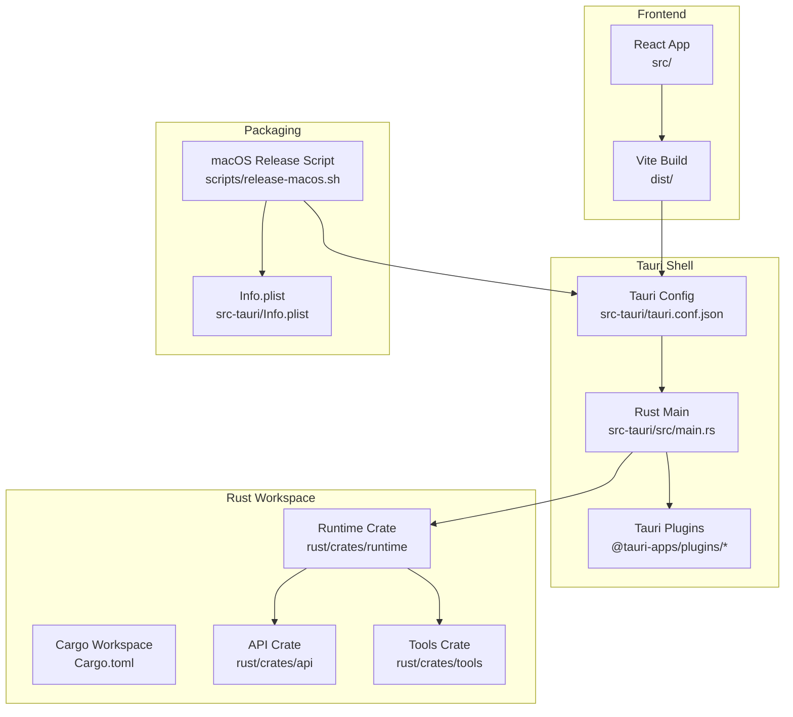
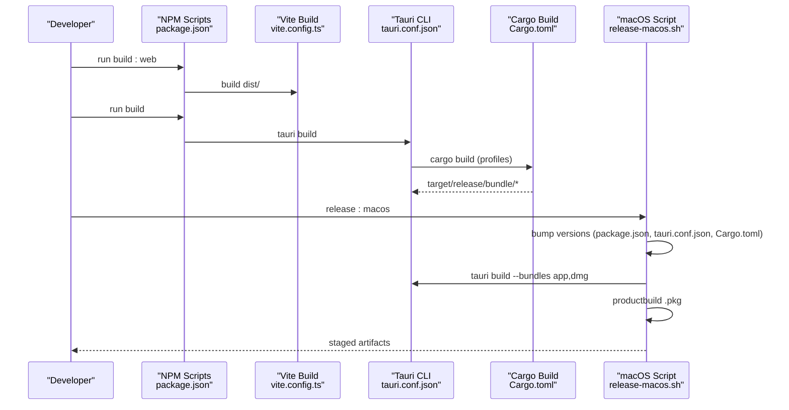
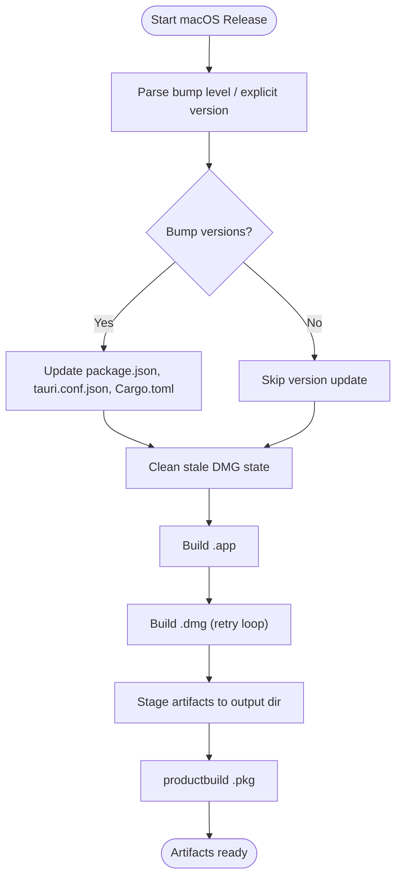
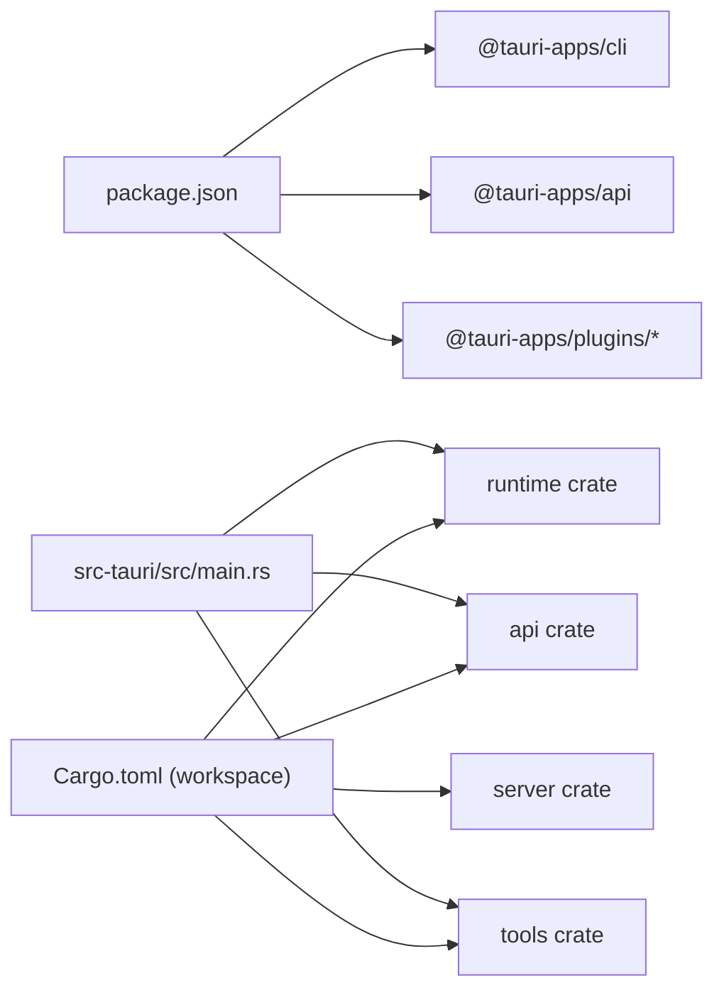

# Configuration & Deployment

<cite>
**Referenced Files in This Document**
- [tauri.conf.json](file://src-tauri/tauri.conf.json)
- [package.json](file://package.json)
- [Cargo.toml](file://Cargo.toml)
- [rust/Cargo.toml](file://rust/Cargo.toml)
- [vite.config.ts](file://vite.config.ts)
- [release-macos.sh](file://scripts/release-macos.sh)
- [build.rs](file://src-tauri/build.rs)
- [Info.plist](file://src-tauri/Info.plist)
- [main.rs](file://src-tauri/src/main.rs)
- [tauri.ts](file://src/lib/tauri.ts)
- [config.rs](file://rust/crates/runtime/src/config.rs)
- [ci.yml](file://rust/.github/workflows/ci.yml)
- [copilot-instructions.md](file://.github/copilot-instructions.md)
</cite>

## Table of Contents
1. [Introduction](#introduction)
2. [Project Structure](#project-structure)
3. [Core Components](#core-components)
4. [Architecture Overview](#architecture-overview)
5. [Detailed Component Analysis](#detailed-component-analysis)
6. [Dependency Analysis](#dependency-analysis)
7. [Performance Considerations](#performance-considerations)
8. [Troubleshooting Guide](#troubleshooting-guide)
9. [Conclusion](#conclusion)
10. [Appendices](#appendices)

## Introduction
This document provides comprehensive configuration and deployment guidance for If2Ai, a Tauri + Rust + React desktop application. It covers:
- Application configuration system (Tauri, Vite, Rust/Cargo profiles)
- Build process across Windows, macOS, and Linux
- Code signing and distribution channels
- Environment configuration and dependency management
- Packaging, installers, and update mechanisms
- Production deployment, security hardening, and performance optimization
- Troubleshooting and maintenance procedures
- Examples of configuration customization and deployment workflows

## Project Structure
If2Ai follows a hybrid architecture:
- Frontend built with Vite and React, packaged into dist/
- Tauri orchestrates the desktop shell, exposing Rust-powered commands and modules
- Rust workspace manages crates for API, runtime, tools, and server components
- Scripts automate macOS packaging and versioning

**Diagram sources**
- [tauri.conf.json:1-57](file://src-tauri/tauri.conf.json#L1-L57)
- [package.json:1-85](file://package.json#L1-L85)
- [Cargo.toml:1-48](file://Cargo.toml#L1-L48)
- [rust/Cargo.toml:1-24](file://rust/Cargo.toml#L1-L24)
- [vite.config.ts:1-35](file://vite.config.ts#L1-L35)
- [release-macos.sh:1-150](file://scripts/release-macos.sh#L1-L150)
- [Info.plist:1-14](file://src-tauri/Info.plist#L1-L14)
- [main.rs:406-800](file://src-tauri/src/main.rs#L406-L800)

**Section sources**
- [tauri.conf.json:1-57](file://src-tauri/tauri.conf.json#L1-L57)
- [package.json:1-85](file://package.json#L1-L85)
- [Cargo.toml:1-48](file://Cargo.toml#L1-L48)
- [rust/Cargo.toml:1-24](file://rust/Cargo.toml#L1-L24)
- [vite.config.ts:1-35](file://vite.config.ts#L1-L35)

## Core Components
- Tauri configuration defines product metadata, build commands, window layout, tray icon, and bundling resources. It also sets macOS minimum system version and Info.plist path.
- Vite configuration resolves aliases, ports, output directory, and compile-time constants synchronized with app versions.
- Rust workspace profiles optimize development and testing performance, with workspace-wide settings applied to member crates.
- macOS packaging script automates version bumping across JSON/TOML files, builds .app, retries DMG creation, stages artifacts, and produces a .pkg via productbuild.

Key runtime configuration is loaded from merged settings, enabling feature flags, plugin toggles, sandbox policies, and model overrides.

**Section sources**
- [tauri.conf.json:1-57](file://src-tauri/tauri.conf.json#L1-L57)
- [vite.config.ts:1-35](file://vite.config.ts#L1-L35)
- [Cargo.toml:13-47](file://Cargo.toml#L13-L47)
- [rust/Cargo.toml:1-24](file://rust/Cargo.toml#L1-L24)
- [release-macos.sh:1-150](file://scripts/release-macos.sh#L1-L150)
- [config.rs:231-396](file://rust/crates/runtime/src/config.rs#L231-L396)

## Architecture Overview
The deployment pipeline integrates frontend build, Tauri bundling, and platform-specific packaging.

**Diagram sources**
- [package.json:6-16](file://package.json#L6-L16)
- [vite.config.ts:25-34](file://vite.config.ts#L25-L34)
- [tauri.conf.json:5-10](file://src-tauri/tauri.conf.json#L5-L10)
- [Cargo.toml:13-47](file://Cargo.toml#L13-L47)
- [release-macos.sh:105-149](file://scripts/release-macos.sh#L105-L149)

## Detailed Component Analysis

### Tauri Configuration System
- Product identity and version are centralized in tauri.conf.json.
- Build settings specify the frontend build command, dev URL, and output directory for bundling.
- Window configuration controls size, overlay title bar, background color, and tray icon path.
- Bundling includes resource inclusion (bundled skills and voice assets) and macOS-specific settings (minimum OS version and Info.plist).

Environment-sensitive behavior:
- macOS microphone and camera usage descriptions are defined in Info.plist.
- Runtime feature flags and configuration are loaded at startup and influence memory, permissions, and sandbox policies.

**Section sources**
- [tauri.conf.json:1-57](file://src-tauri/tauri.conf.json#L1-L57)
- [Info.plist:1-14](file://src-tauri/Info.plist#L1-L14)
- [main.rs:448-466](file://src-tauri/src/main.rs#L448-L466)

### Build Settings and Profiles
- Vite defines the frontend output directory and compile-time constants (__APP_VERSION__, __APP_NAME__) derived from package.json.
- Cargo workspace profiles:
  - dev: reduced debuginfo, disables incremental with sccache compatibility, applies opt-level=1 to dependencies.
  - test: inherits dev with incremental=true for faster repeated test runs.

These profiles balance fast iteration during development and reliable test performance.

**Section sources**
- [vite.config.ts:25-34](file://vite.config.ts#L25-L34)
- [Cargo.toml:13-47](file://Cargo.toml#L13-L47)
- [rust/Cargo.toml:1-24](file://rust/Cargo.toml#L1-L24)

### Runtime Configuration and Feature Flags
- Runtime configuration merges settings from multiple sources, exposing:
  - Hooks and plugins
  - MCP server collections
  - OAuth client configuration
  - Model override and permission mode
  - Sandbox policy
- These settings are consumed at startup to initialize memory providers, job runners, and other subsystems.

**Section sources**
- [config.rs:231-396](file://rust/crates/runtime/src/config.rs#L231-L396)
- [main.rs:448-466](file://src-tauri/src/main.rs#L448-L466)

### macOS Packaging and Distribution
- The macOS release script:
  - Optionally bumps versions across package.json, tauri.conf.json, and Cargo.toml.
  - Cleans stale DMG state to avoid hdiutil failures.
  - Builds .app, retries DMG creation, stages artifacts, and produces a .pkg via productbuild.
  - Sets MACOSX_DEPLOYMENT_TARGET for compatibility with native dependencies.

**Diagram sources**
- [release-macos.sh:36-149](file://scripts/release-macos.sh#L36-L149)

**Section sources**
- [release-macos.sh:1-150](file://scripts/release-macos.sh#L1-L150)

### Frontend-to-Rust IPC Layer
- The frontend invokes Rust commands through a typed wrapper that:
  - Exposes typed helpers for agent streams, memory events, permissions, sessions, projects, tools, and skills.
  - Bridges to @tauri-apps/api invoke/listen abstractions.
- Contracts for runtime, memory, activation, and permission flows are centralized in transport contracts.

**Section sources**
- [tauri.ts:1-800](file://src/lib/tauri.ts#L1-L800)

### Rust Entry Point and Initialization
- The Rust main initializes logging, loads runtime configuration, sets up memory providers (with fallbacks), job runners, and optional harness/tracing.
- Environment variables control feature flags (e.g., IF2AI_HRR_ENABLED, IF2AI_HARNESS_ENABLED) and directory overrides (IF2AI_SESSIONS_DIR, IF2AI_PROJECTS_DIR).
- Browser profile mode and tool registries are initialized based on environment and configuration.

**Section sources**
- [main.rs:406-800](file://src-tauri/src/main.rs#L406-L800)

### CI/CD and Automation
- CI workflow:
  - Checks out repository and installs Rust toolchain.
  - Runs cargo check, cargo test, and cargo build --release across Ubuntu and macOS runners.
- GitHub Copilot instructions outline project structure and basic developer commands.

**Section sources**
- [ci.yml:1-36](file://rust/.github/workflows/ci.yml#L1-L36)
- [.github/copilot-instructions.md:1-34](file://.github/copilot-instructions.md#L1-L34)

## Dependency Analysis
- Frontend dependencies (React, shadcn/ui, Tailwind) are declared in package.json.
- Tauri plugins (dialog, fs) are declared in package.json and used in the Rust main.
- Rust workspace members include api, runtime, tools, and server crates; the workspace root Cargo.toml defines build profiles and sccache compatibility.

**Diagram sources**
- [package.json:17-83](file://package.json#L17-L83)
- [Cargo.toml:1-48](file://Cargo.toml#L1-L48)
- [rust/Cargo.toml:1-24](file://rust/Cargo.toml#L1-L24)
- [main.rs:784-800](file://src-tauri/src/main.rs#L784-L800)

**Section sources**
- [package.json:17-83](file://package.json#L17-L83)
- [Cargo.toml:1-48](file://Cargo.toml#L1-L48)
- [rust/Cargo.toml:1-24](file://rust/Cargo.toml#L1-L24)
- [main.rs:784-800](file://src-tauri/src/main.rs#L784-L800)

## Performance Considerations
- Rust build profiles:
  - dev: trade-off full recompiles for sccache effectiveness; opt-level=1 for dependencies improves runtime performance.
  - test: incremental=true accelerates repeated test runs.
- Frontend:
  - Vite outDir set to dist; define constants for app metadata reduce runtime string allocations.
- Native dependencies:
  - macOS packaging sets MACOSX_DEPLOYMENT_TARGET to ensure compatibility with native components.

Recommendations:
- Use release builds for production deployments.
- Keep sccache integration aligned with incremental=false in dev to maximize caching benefits.
- Monitor memory provider fallbacks and adjust environment variables to prefer faster providers when available.

**Section sources**
- [Cargo.toml:13-47](file://Cargo.toml#L13-L47)
- [vite.config.ts:25-34](file://vite.config.ts#L25-L34)
- [release-macos.sh:32-32](file://scripts/release-macos.sh#L32-L32)

## Troubleshooting Guide
Common deployment issues and remedies:
- DMG creation failures on macOS:
  - The release script cleans stale hdiutil state and retries DMG builds up to a fixed number of attempts.
  - Ensure sufficient disk space and permissions for staging directories.
- Version mismatch across files:
  - The macOS script synchronizes versions across package.json, tauri.conf.json, and Cargo.toml; verify the bump level or set an explicit version.
- Native dependency compatibility:
  - Set MACOSX_DEPLOYMENT_TARGET to meet minimum system requirements for native components.
- Tauri bundling errors:
  - Confirm frontend dist is built before tauri build and that devUrl and frontendDist match the Vite configuration.
- Rust incremental vs sccache:
  - If using sccache, incremental must be disabled in dev profiles to prevent cache misses; the workspace config enforces this.

**Section sources**
- [release-macos.sh:87-126](file://scripts/release-macos.sh#L87-L126)
- [tauri.conf.json:5-10](file://src-tauri/tauri.conf.json#L5-L10)
- [vite.config.ts:22-27](file://vite.config.ts#L22-L27)
- [Cargo.toml:17-24](file://Cargo.toml#L17-L24)

## Conclusion
If2Ai’s configuration and deployment system combines Tauri, Vite, and a Rust workspace to deliver a robust desktop application. Centralized configuration in tauri.conf.json and runtime settings enables flexible feature flags and environment overrides. The macOS packaging script streamlines versioning, artifact staging, and installer generation. CI ensures cross-platform builds and tests. For production, prefer release builds, validate native dependency targets, and leverage environment variables to tune runtime behavior.

## Appendices

### Platform Build and Distribution Checklist
- Windows
  - Use tauri.conf.json build settings; ensure beforeBuildCommand and frontendDist align with Vite output.
  - Verify bundling resources and icons are included.
- macOS
  - Run the macOS release script to bump versions, build .app, retry DMG, and produce .pkg.
  - Confirm Info.plist entries for microphone/camera usage descriptions.
- Linux
  - Adapt tauri.conf.json bundle settings for target formats (.deb, .rpm) as needed.
  - Validate runtime dependencies and desktop entry configuration.

**Section sources**
- [tauri.conf.json:38-54](file://src-tauri/tauri.conf.json#L38-L54)
- [release-macos.sh:1-150](file://scripts/release-macos.sh#L1-L150)
- [Info.plist:1-14](file://src-tauri/Info.plist#L1-L14)

### Security Hardening and Environment Variables
- IF2AI_HRR_ENABLED: Enables hybrid memory provider with algebraic reasoning (experimental).
- IF2AI_HARNESS_ENABLED: Enables agent loop harness for evaluation and telemetry.
- IF2AI_SESSIONS_DIR, IF2AI_PROJECTS_DIR: Override default data directories for sessions and projects.
- Logging and tracing are initialized at startup; ensure log directory is writable.

**Section sources**
- [main.rs:265-267](file://src-tauri/src/main.rs#L265-L267)
- [main.rs:752-760](file://src-tauri/src/main.rs#L752-L760)
- [main.rs:489-499](file://src-tauri/src/main.rs#L489-L499)

### Example Customization Workflows
- Customize window appearance:
  - Adjust width, height, title bar style, and backgroundColor in tauri.conf.json windows array.
- Add bundled resources:
  - Extend resources array in tauri.conf.json to include additional assets.
- Modify macOS minimum system version:
  - Update minimumSystemVersion in tauri.conf.json macOS block.
- Configure runtime features:
  - Use runtime settings to toggle plugins, MCP servers, sandbox, and permission modes.

**Section sources**
- [tauri.conf.json:12-54](file://src-tauri/tauri.conf.json#L12-L54)
- [config.rs:231-396](file://rust/crates/runtime/src/config.rs#L231-L396)