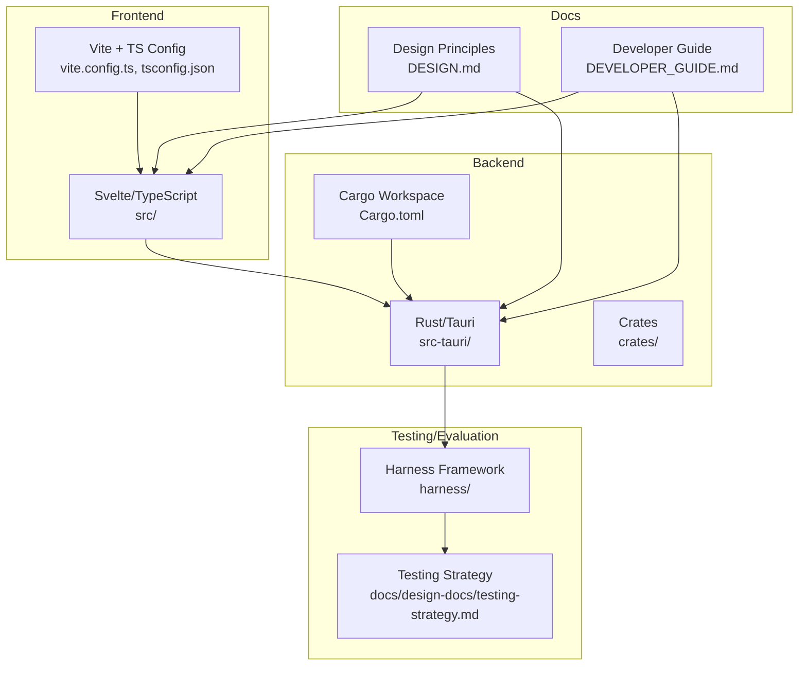
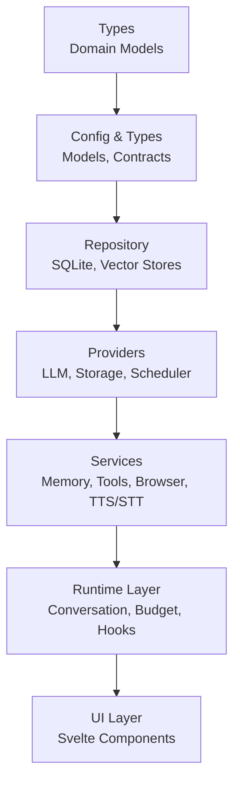
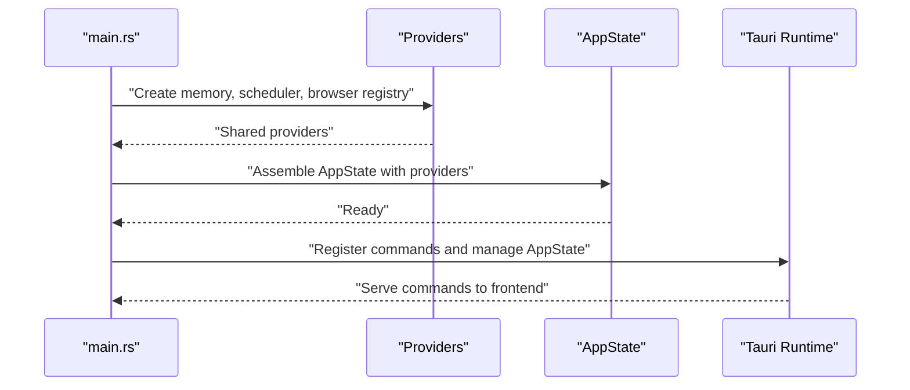
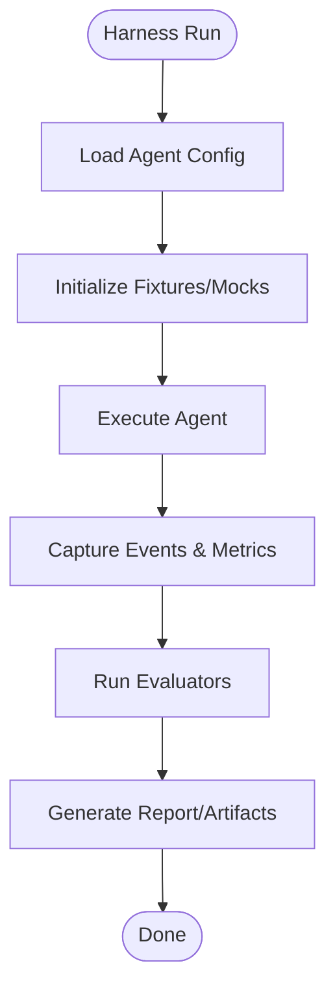
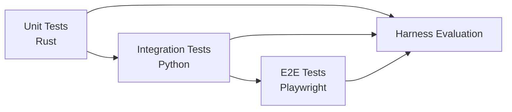
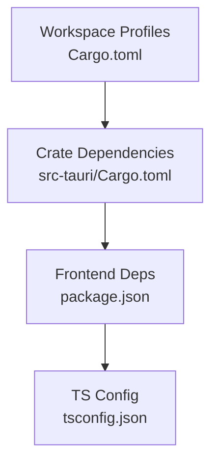
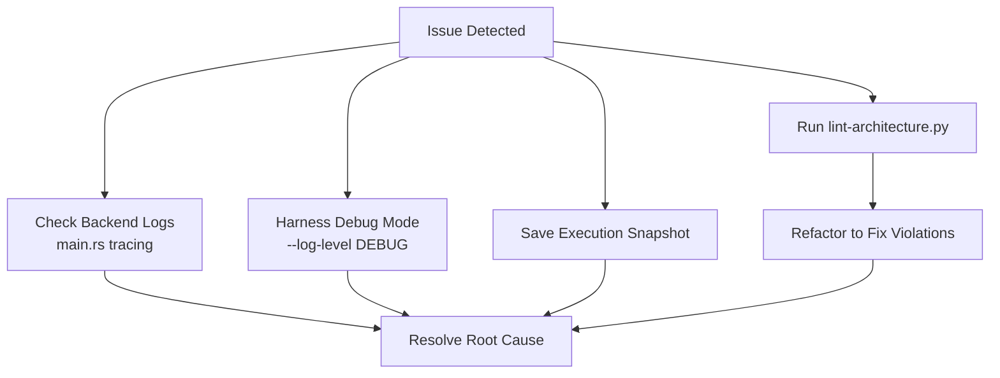
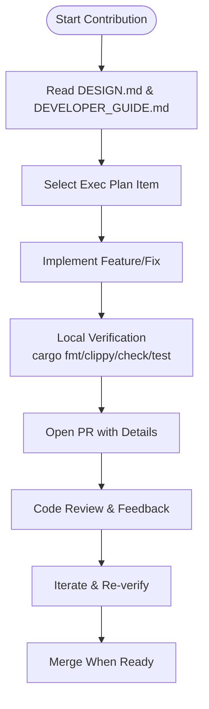

# Development Guidelines

<cite>
**Referenced Files in This Document**
- [DEVELOPER_GUIDE.md](file://DEVELOPER_GUIDE.md)
- [DESIGN.md](file://DESIGN.md)
- [rust/CONTRIBUTING.md](file://rust/CONTRIBUTING.md)
- [Cargo.toml](file://Cargo.toml)
- [src-tauri/Cargo.toml](file://src-tauri/Cargo.toml)
- [package.json](file://package.json)
- [tsconfig.json](file://tsconfig.json)
- [harness/README.md](file://harness/README.md)
- [docs/design-docs/testing-strategy.md](file://docs/design-docs/testing-strategy.md)
- [.github/copilot-instructions.md](file://.github/copilot-instructions.md)
- [scripts/lint_architecture.py](file://scripts/lint_architecture.py)
- [src-tauri/src/main.rs](file://src-tauri/src/main.rs)
</cite>

## Table of Contents
1. [Introduction](#introduction)
2. [Project Structure](#project-structure)
3. [Core Components](#core-components)
4. [Architecture Overview](#architecture-overview)
5. [Detailed Component Analysis](#detailed-component-analysis)
6. [Dependency Analysis](#dependency-analysis)
7. [Performance Considerations](#performance-considerations)
8. [Troubleshooting Guide](#troubleshooting-guide)
9. [Contribution Workflow](#contribution-workflow)
10. [Testing Requirements](#testing-requirements)
11. [Documentation Standards](#documentation-standards)
12. [Development Environment Setup](#development-environment-setup)
13. [Coding Standards](#coding-standards)
14. [Quality Gates](#quality-gates)
15. [Examples and Common Pitfalls](#examples-and-common-pitfalls)
16. [Conclusion](#conclusion)

## Introduction
This document provides comprehensive development guidelines for If2Ai contributors. It consolidates coding standards for Rust and TypeScript/JavaScript, architectural patterns, contribution workflow, testing requirements, documentation standards, quality gates, environment setup, debugging, and performance profiling. The guidance is grounded in the project’s design principles, contributor documents, and tooling.

## Project Structure
If2Ai is a cross-platform desktop application built with Tauri, Rust (backend), and Svelte/TypeScript (frontend). The repository is organized into:
- rust/: Rust workspace and crates for backend services, commands, LSP, plugins, runtime, server, and tools
- src/: Svelte frontend code
- src-tauri/: Rust Tauri backend with modules for application, browser, channel, commands, config, control plane, learning, memory, onboarding, projects, provider, runtime, scheduler, security, session, skills, STT, system_check, tools, and TTS
- harness/: Python-based testing and evaluation framework
- docs/: Design documents, execution plans, product specs, and references
- scripts/: Architectural linting and packaging helpers
- Root configuration: Cargo.toml, package.json, tauri.conf.json, vite.config.ts, tsconfig.json

**Diagram sources**
- [DEVELOPER_GUIDE.md:141-195](file://DEVELOPER_GUIDE.md#L141-L195)
- [DESIGN.md:37-68](file://DESIGN.md#L37-L68)
- [Cargo.toml:1-48](file://Cargo.toml#L1-L48)
- [harness/README.md:24-44](file://harness/README.md#L24-L44)

**Section sources**
- [DEVELOPER_GUIDE.md:141-195](file://DEVELOPER_GUIDE.md#L141-L195)
- [DESIGN.md:37-68](file://DESIGN.md#L37-L68)
- [Cargo.toml:1-48](file://Cargo.toml#L1-L48)
- [harness/README.md:24-44](file://harness/README.md#L24-L44)

## Core Components
- Rust backend (src-tauri/): Implements Tauri commands, modules for memory, tools, runtime, browser, TTS/STT, learning, onboarding, and more. The main entry initializes providers, state, and registers commands.
- Frontend (src/): Svelte components, UI primitives, chat, memory, settings, and runtime projection.
- Harness framework: Python-based test runner, evaluators, fixtures, and reporting for Agent behavior assessment.
- Testing strategy: Multi-tier testing (unit, integration, E2E) plus Harness evaluation aligned with design constraints.

Key implementation references:
- Backend entry and initialization: [src-tauri/src/main.rs:406-800](file://src-tauri/src/main.rs#L406-L800)
- Rust workspace and profiles: [Cargo.toml:1-48](file://Cargo.toml#L1-L48)
- Rust crate dependencies and lints: [src-tauri/Cargo.toml:1-161](file://src-tauri/Cargo.toml#L1-L161)
- Frontend dependencies and scripts: [package.json:1-85](file://package.json#L1-L85)
- TypeScript configuration: [tsconfig.json:1-38](file://tsconfig.json#L1-L38)
- Harness overview and commands: [harness/README.md:1-505](file://harness/README.md#L1-L505)
- Testing strategy and coverage goals: [docs/design-docs/testing-strategy.md:1-496](file://docs/design-docs/testing-strategy.md#L1-L496)

**Section sources**
- [src-tauri/src/main.rs:406-800](file://src-tauri/src/main.rs#L406-L800)
- [Cargo.toml:1-48](file://Cargo.toml#L1-L48)
- [src-tauri/Cargo.toml:1-161](file://src-tauri/Cargo.toml#L1-L161)
- [package.json:1-85](file://package.json#L1-L85)
- [tsconfig.json:1-38](file://tsconfig.json#L1-L38)
- [harness/README.md:1-505](file://harness/README.md#L1-L505)
- [docs/design-docs/testing-strategy.md:1-496](file://docs/design-docs/testing-strategy.md#L1-L496)

## Architecture Overview
If2Ai follows an agent-first engineering philosophy with strict layering, provider injection, and observability. The backend enforces:
- Layered architecture: Types → Config → Repo → Providers → Service → Runtime → UI
- Provider pattern for external dependencies
- Structured logging and async-first I/O
- Deterministic behavior via mocking and fixtures

**Diagram sources**
- [DESIGN.md:39-137](file://DESIGN.md#L39-L137)
- [src-tauri/src/main.rs:501-782](file://src-tauri/src/main.rs#L501-L782)

**Section sources**
- [DESIGN.md:39-137](file://DESIGN.md#L39-L137)
- [src-tauri/src/main.rs:501-782](file://src-tauri/src/main.rs#L501-L782)

## Detailed Component Analysis

### Rust Backend Initialization and State Management
The backend entrypoint constructs shared providers, job runners, memory infrastructure, and manages Tauri commands. It demonstrates:
- Provider composition and fallback strategies
- Shared state management via AppState
- Lazy initialization patterns for heavy components (e.g., TTS providers)
- Structured logging and environment-driven toggles

**Diagram sources**
- [src-tauri/src/main.rs:406-800](file://src-tauri/src/main.rs#L406-L800)

**Section sources**
- [src-tauri/src/main.rs:406-800](file://src-tauri/src/main.rs#L406-L800)

### Harness Framework: Runner, Evaluator, and Fixtures
Harness provides:
- Runner: executes Agent configurations and captures execution traces
- Evaluator: correctness, behavior, performance, and reliability scoring
- Fixtures: reusable agent/tool/LLM mocks
- Reporting: HTML/JSON reports and snapshot comparison

**Diagram sources**
- [harness/README.md:48-245](file://harness/README.md#L48-L245)

**Section sources**
- [harness/README.md:48-245](file://harness/README.md#L48-L245)

### Testing Strategy: Multi-Tier and Harness Evaluation
The testing strategy defines:
- Unit tests (Rust): focused, deterministic, covering happy paths, boundaries, and errors
- Integration tests (Python): cross-module interactions and persistence
- E2E tests (Python + Playwright): end-to-end user workflows
- Harness evaluation: behavior correctness, performance, and reliability metrics

**Diagram sources**
- [docs/design-docs/testing-strategy.md:30-285](file://docs/design-docs/testing-strategy.md#L30-L285)

**Section sources**
- [docs/design-docs/testing-strategy.md:30-285](file://docs/design-docs/testing-strategy.md#L30-L285)

## Dependency Analysis
- Rust workspace and profiles: The workspace root defines optimized dev/test profiles and dependency tuning for heavy crates (e.g., fastembed, lancedb, arrow).
- Crate-level lints: Permissive lints are configured at the workspace level to keep code review automation smooth while maintaining quality.
- Frontend dependencies: Managed via package.json; TypeScript configured via tsconfig.json for strictness and bundler mode.

**Diagram sources**
- [Cargo.toml:1-48](file://Cargo.toml#L1-L48)
- [src-tauri/Cargo.toml:106-161](file://src-tauri/Cargo.toml#L106-L161)
- [package.json:17-83](file://package.json#L17-L83)
- [tsconfig.json:19-28](file://tsconfig.json#L19-L28)

**Section sources**
- [Cargo.toml:1-48](file://Cargo.toml#L1-L48)
- [src-tauri/Cargo.toml:106-161](file://src-tauri/Cargo.toml#L106-L161)
- [package.json:17-83](file://package.json#L17-L83)
- [tsconfig.json:19-28](file://tsconfig.json#L19-L28)

## Performance Considerations
- Rust build profiles optimize for development speed and dependency performance; incremental compilation is disabled to improve caching with sccache.
- Frontend builds leverage Vite for fast dev and optimized production bundles.
- Asynchronous I/O and structured logging support observability and performance monitoring.

Practical tips:
- Use dev profiles for local iteration; enable harness only when needed to reduce overhead.
- Prefer deterministic mocks to avoid flaky performance measurements.
- Monitor coverage and performance regressions via Harness reports.

**Section sources**
- [Cargo.toml:9-47](file://Cargo.toml#L9-L47)
- [package.json:6-16](file://package.json#L6-L16)
- [harness/README.md:448-456](file://harness/README.md#L448-L456)

## Troubleshooting Guide
Common areas to inspect:
- Backend logs: structured logs are initialized early in main.rs and written to rolling files.
- Harness debugging: enable verbose logs, save snapshots, and use interactive debug mode.
- Architecture linting: run the architectural lint to detect forbidden directories and oversized files.

**Diagram sources**
- [src-tauri/src/main.rs:417-427](file://src-tauri/src/main.rs#L417-L427)
- [harness/README.md:329-356](file://harness/README.md#L329-L356)
- [scripts/lint_architecture.py:1-305](file://scripts/lint_architecture.py#L1-L305)

**Section sources**
- [src-tauri/src/main.rs:417-427](file://src-tauri/src/main.rs#L417-L427)
- [harness/README.md:329-356](file://harness/README.md#L329-L356)
- [scripts/lint_architecture.py:1-305](file://scripts/lint_architecture.py#L1-L305)

## Contribution Workflow
Follow this process for contributions:
1. Read and understand the design constraints and developer guide
2. Create or select an execution plan item
3. Implement features with unit, integration, and Harness tests
4. Ensure local verification passes (Rust checks, formatting, clippy, tests)
5. Open a pull request with motivation, summary, and verification details
6. Address review feedback and re-run verification as needed

**Diagram sources**
- [DEVELOPER_GUIDE.md:278-306](file://DEVELOPER_GUIDE.md#L278-L306)
- [rust/CONTRIBUTING.md:17-43](file://rust/CONTRIBUTING.md#L17-L43)

**Section sources**
- [DEVELOPER_GUIDE.md:278-306](file://DEVELOPER_GUIDE.md#L278-L306)
- [rust/CONTRIBUTING.md:17-43](file://rust/CONTRIBUTING.md#L17-L43)

## Testing Requirements
- Unit tests: Rust tests with coverage targets per module
- Integration tests: Cross-module behavior with mocks
- E2E tests: End-to-end user workflows
- Harness evaluation: Behavior correctness, performance, and reliability
- Quality gates: Coverage thresholds, architecture linting, and CI checks

Coverage and quality targets:
- Code coverage ≥ 80%
- Key paths 100% covered
- Architecture linting enforced (file sizes, bounded contexts)

**Section sources**
- [docs/design-docs/testing-strategy.md:257-420](file://docs/design-docs/testing-strategy.md#L257-L420)
- [DESIGN.md:352-371](file://DESIGN.md#L352-L371)
- [scripts/lint_architecture.py:45-88](file://scripts/lint_architecture.py#L45-L88)

## Documentation Standards
- Keep documentation fresh and linked; maintain design, product specs, and execution plans
- Update design docs when changing constraints or architectural decisions
- Use structured documentation layers: navigation, design, specification, execution, reference, generated

**Section sources**
- [DESIGN.md:287-342](file://DESIGN.md#L287-L342)

## Development Environment Setup
- Backend: Install Rust toolchain; build and run with cargo; configure dev profiles
- Frontend: Install Node dependencies; run dev server with Vite; build for production
- Harness: Use Python to run tests and generate reports
- IDE and Copilot: Follow Copilot instructions for project orientation

Commands overview:
- Rust: cargo build, cargo test, cargo clippy, cargo fmt
- Frontend: npm run tauri dev, npm run build
- Harness: python -m harness runner suite

**Section sources**
- [DEVELOPER_GUIDE.md:232-266](file://DEVELOPER_GUIDE.md#L232-L266)
- [rust/CONTRIBUTING.md:5-26](file://rust/CONTRIBUTING.md#L5-L26)
- [.github/copilot-instructions.md:24-29](file://.github/copilot-instructions.md#L24-L29)

## Coding Standards
Rust:
- Follow existing patterns in the touched crate
- Format with rustfmt; keep clippy clean
- Prefer focused diffs; avoid drive-by refactors
- Adhere to layered architecture and provider injection

TypeScript/JavaScript:
- Strict TypeScript configuration
- Use Svelte component conventions and file naming
- Maintain function and file size limits per design constraints

**Section sources**
- [rust/CONTRIBUTING.md:30-35](file://rust/CONTRIBUTING.md#L30-L35)
- [DESIGN.md:139-166](file://DESIGN.md#L139-L166)
- [tsconfig.json:19-28](file://tsconfig.json#L19-L28)

## Quality Gates
Automated checks:
- Architecture linting (bounded contexts, file sizes)
- Code coverage thresholds
- Clippy warnings
- Documentation freshness and completeness

Manual review criteria:
- Alignment with design constraints
- Readability and simplicity
- No new “magic behavior”
- Consistent and complete tests

**Section sources**
- [DESIGN.md:222-243](file://DESIGN.md#L222-L243)
- [scripts/lint_architecture.py:1-305](file://scripts/lint_architecture.py#L1-L305)
- [docs/design-docs/testing-strategy.md:404-420](file://docs/design-docs/testing-strategy.md#L404-L420)

## Examples and Common Pitfalls
Examples of good practices:
- Use Provider pattern for external dependencies
- Keep functions small and focused
- Write deterministic tests with mocks
- Use Harness to evaluate Agent behavior

Common pitfalls to avoid:
- Direct external dependency injection (breaks testability)
- Excessive function or file sizes
- Non-async I/O blocking
- Omitting documentation updates
- Ignoring architecture lint warnings

**Section sources**
- [DESIGN.md:70-137](file://DESIGN.md#L70-L137)
- [DESIGN.md:139-166](file://DESIGN.md#L139-L166)
- [DESIGN.md:222-243](file://DESIGN.md#L222-L243)

## Conclusion
These guidelines consolidate If2Ai’s development practices, emphasizing agent-first design, strict architecture, robust testing, and quality gates. By following the workflows, standards, and quality checks outlined here, contributors can deliver reliable, maintainable, and observable features across the Rust backend and Svelte frontend.