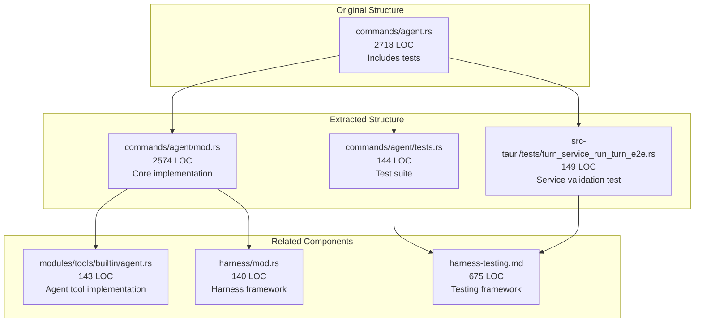
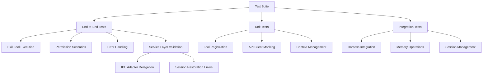
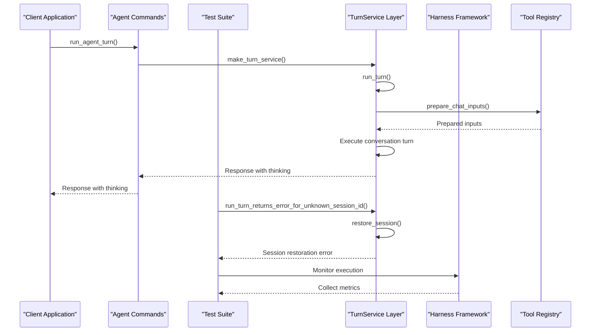
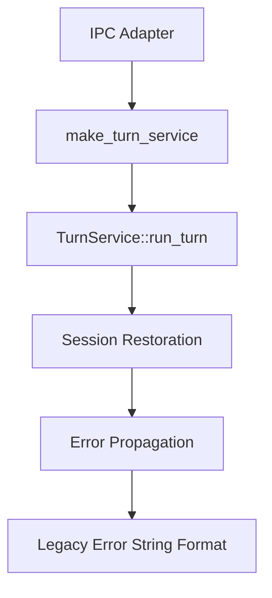
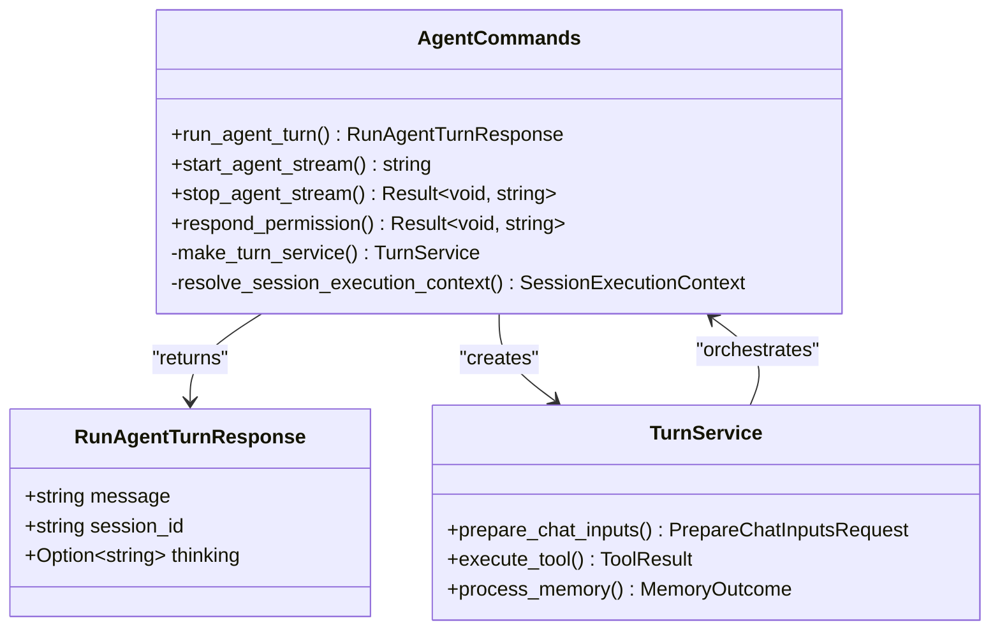
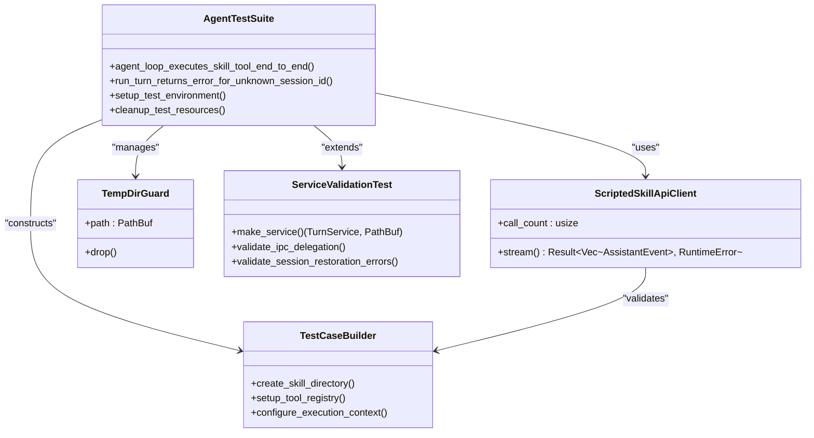
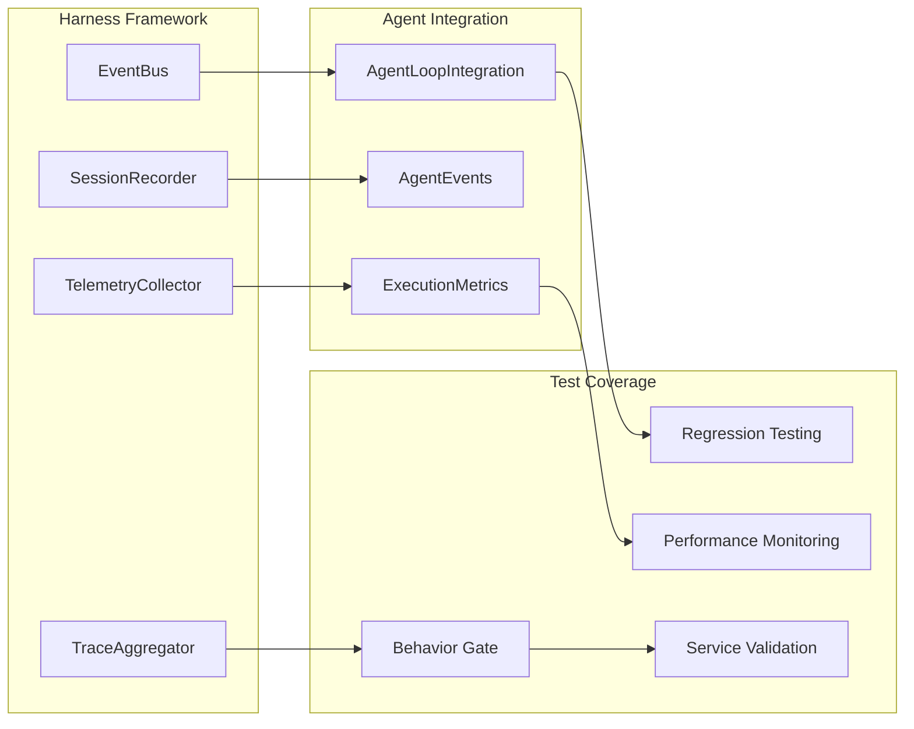
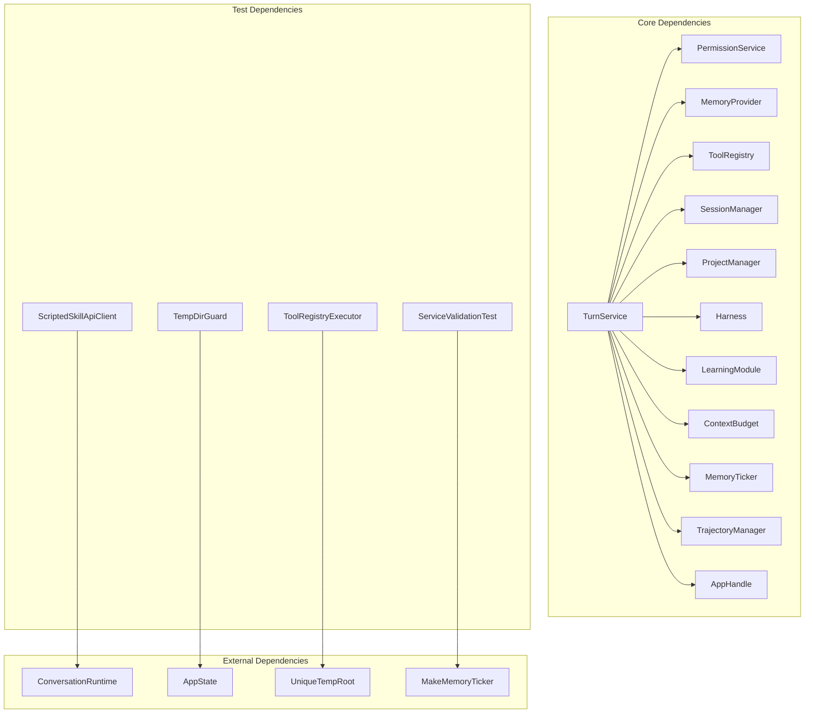

# GFR-005f Agent Tests Extraction

<cite>
**Referenced Files in This Document**
- [GFR-005f-agent-tests-extract.md](file://docs/packs/refactor/GFR-005f-agent-tests-extract.md)
- [agent/mod.rs](file://src-tauri/src/commands/agent/mod.rs)
- [agent/tests.rs](file://src-tauri/src/commands/agent/tests.rs)
- [turn_service_run_turn_e2e.rs](file://src-tauri/tests/turn_service_run_turn_e2e.rs)
- [agent.rs](file://src-tauri/src/modules/tools/builtin/agent.rs)
- [harness-testing.md](file://docs/design-docs/harness-testing.md)
- [harness/mod.rs](file://src-tauri/src/modules/harness/mod.rs)
- [harness.rs](file://src-tauri/src/commands/harness.rs)
- [gate.py](file://harness/gate.py)
</cite>

## Update Summary
**Changes Made**
- Added documentation for the new end-to-end test `tests/turn_service_run_turn_e2e.rs`
- Updated architecture overview to reflect service-oriented validation
- Enhanced test suite organization section with new validation approach
- Added new section covering service layer validation methodology

## Table of Contents
1. [Introduction](#introduction)
2. [Project Structure](#project-structure)
3. [Core Components](#core-components)
4. [Architecture Overview](#architecture-overview)
5. [Service-Oriented Architecture Validation](#service-oriented-architecture-validation)
6. [Detailed Component Analysis](#detailed-component-analysis)
7. [Dependency Analysis](#dependency-analysis)
8. [Performance Considerations](#performance-considerations)
9. [Troubleshooting Guide](#troubleshooting-guide)
10. [Conclusion](#conclusion)

## Introduction

GFR-005f represents the final phase of the GFR-005 refactoring initiative, focusing specifically on extracting and organizing agent-related tests. This extraction follows the established pattern set by previous GFR packages (GFR-001 through GFR-005e) and aims to improve code organization, maintainability, and testability.

The project operates within the broader If2Ai ecosystem, which provides an advanced AI agent framework with sophisticated orchestration capabilities, memory systems, and tool integration. The GFR-005f package specifically targets the agent.rs file, which contained 2718 lines of code including substantial test blocks that needed to be extracted and organized.

**Updated** Added comprehensive validation of the service-oriented architecture through dedicated end-to-end testing that ensures proper IPC adapter delegation and service layer error handling.

## Project Structure

The GFR-005f extraction follows a systematic approach to code organization and test management:

**Diagram sources**
- [GFR-005f-agent-tests-extract.md:12-19](file://docs/packs/refactor/GFR-005f-agent-tests-extract.md#L12-L19)
- [agent/mod.rs:1-50](file://src-tauri/src/commands/agent/mod.rs#L1-L50)
- [turn_service_run_turn_e2e.rs:1-23](file://src-tauri/tests/turn_service_run_turn_e2e.rs#L1-L23)

The extraction maintains the existing functionality while improving code organization through proper separation of concerns. The original 2718-line file was reduced to 2574 lines for the core implementation, with 144 lines dedicated to tests. Additionally, a new 149-line end-to-end test was added to validate the service-oriented architecture.

**Section sources**
- [GFR-005f-agent-tests-extract.md:1-35](file://docs/packs/refactor/GFR-005f-agent-tests-extract.md#L1-L35)

## Core Components

### Agent Command Module

The core agent functionality remains encapsulated in the mod.rs file, which contains the primary agent execution commands. The module maintains its role as the central orchestrator for agent operations while benefiting from improved organization.

Key components include:
- **run_agent_turn**: Single-turn agent execution with comprehensive error handling
- **start_agent_stream**: Streaming agent execution for progressive responses
- **Permission management**: Integration with the permission service system
- **Memory coordination**: Seamless integration with memory systems and trajectory tracking

### Enhanced Test Suite Organization

The extracted test suite provides comprehensive coverage for agent functionality, including new validation for the service-oriented architecture:

**Diagram sources**
- [agent/tests.rs:81-144](file://src-tauri/src/commands/agent/tests.rs#L81-L144)
- [turn_service_run_turn_e2e.rs:117-148](file://src-tauri/tests/turn_service_run_turn_e2e.rs#L117-L148)

The test suite includes specialized components for testing the agent tool's skill execution capabilities, ensuring proper integration with the broader If2Ai ecosystem. The new service validation test specifically targets the canonical entry path and IPC adapter delegation.

**Section sources**
- [agent/mod.rs:174-736](file://src-tauri/src/commands/agent/mod.rs#L174-L736)
- [agent/tests.rs:1-145](file://src-tauri/src/commands/agent/tests.rs#L1-L145)
- [turn_service_run_turn_e2e.rs:1-149](file://src-tauri/tests/turn_service_run_turn_e2e.rs#L1-L149)

## Architecture Overview

The GFR-005f extraction maintains the existing agent architecture while improving modularity and test organization:

**Diagram sources**
- [agent/mod.rs:178-736](file://src-tauri/src/commands/agent/mod.rs#L178-L736)
- [agent/tests.rs:81-144](file://src-tauri/src/commands/agent/tests.rs#L81-L144)
- [turn_service_run_turn_e2e.rs:122-148](file://src-tauri/tests/turn_service_run_turn_e2e.rs#L122-L148)

The architecture ensures that the agent commands remain focused on their primary responsibility while the test suite provides comprehensive verification without interfering with the main functionality. The new service validation test specifically targets the canonical entry path and validates proper error propagation.

**Section sources**
- [harness-testing.md:124-226](file://docs/design-docs/harness-testing.md#L124-L226)
- [harness/mod.rs:83-140](file://src-tauri/src/modules/harness/mod.rs#L83-L140)

## Service-Oriented Architecture Validation

**New Section** The addition of `turn_service_run_turn_e2e.rs` introduces comprehensive validation of the service-oriented architecture that was established during the MIG-001 migration. This test ensures that the IPC adapter correctly delegates to the service layer and that the service layer properly handles session restoration errors.

### Canonical Entry Path Validation

The new test validates that the canonical entry path for agent turns is properly owned by the `TurnService`:

**Diagram sources**
- [turn_service_run_turn_e2e.rs:117-148](file://src-tauri/tests/turn_service_run_turn_e2e.rs#L117-L148)

### Test Validation Approach

The service validation test follows a systematic approach to ensure architectural integrity:

1. **Minimal Dependencies**: Constructs a real `TurnService` with minimal-but-genuine dependencies
2. **Early Return Path**: Exercises the session restoration error path
3. **Legacy Compatibility**: Ensures error messages match the legacy IPC body format
4. **Parameter Mapping**: Validates that `make_turn_service` and `run_turn` parameter mapping is correct

**Section sources**
- [turn_service_run_turn_e2e.rs:1-149](file://src-tauri/tests/turn_service_run_turn_e2e.rs#L1-L149)

## Detailed Component Analysis

### Agent Command Implementation

The agent command implementation demonstrates sophisticated orchestration capabilities:

**Diagram sources**
- [agent/mod.rs:114-131](file://src-tauri/src/commands/agent/mod.rs#L114-L131)
- [agent/mod.rs:76-90](file://src-tauri/src/commands/agent/mod.rs#L76-L90)

The implementation follows a modular design pattern, separating concerns between command orchestration, turn service management, and memory coordination.

### Enhanced Test Suite Architecture

The extracted test suite provides comprehensive coverage through specialized testing components:

**Diagram sources**
- [agent/tests.rs:28-79](file://src-tauri/src/commands/agent/tests.rs#L28-L79)
- [agent/tests.rs:12-26](file://src-tauri/src/commands/agent/tests.rs#L12-L26)
- [turn_service_run_turn_e2e.rs:80-115](file://src-tauri/tests/turn_service_run_turn_e2e.rs#L80-L115)

The test suite architecture emphasizes isolation and reproducibility through careful resource management and controlled test environments. The new service validation test adds comprehensive coverage for the canonical entry path.

**Section sources**
- [agent/mod.rs:174-736](file://src-tauri/src/commands/agent/mod.rs#L174-L736)
- [agent/tests.rs:1-145](file://src-tauri/src/commands/agent/tests.rs#L1-L145)
- [turn_service_run_turn_e2e.rs:1-149](file://src-tauri/tests/turn_service_run_turn_e2e.rs#L1-L149)

### Harness Integration

The extraction maintains seamless integration with the broader harness testing framework:

**Diagram sources**
- [harness/mod.rs:1-140](file://src-tauri/src/modules/harness/mod.rs#L1-L140)
- [harness-testing.md:249-293](file://docs/design-docs/harness-testing.md#L249-L293)

The harness integration ensures that agent testing aligns with the broader testing strategy and quality assurance processes, including the new service validation capabilities.

**Section sources**
- [harness-testing.md:1-675](file://docs/design-docs/harness-testing.md#L1-L675)
- [harness.rs:1-334](file://src-tauri/src/commands/harness.rs#L1-L334)

## Dependency Analysis

The GFR-005f extraction maintains strategic dependencies while improving modularity:

**Diagram sources**
- [agent/mod.rs:5-60](file://src-tauri/src/commands/agent/mod.rs#L5-L60)
- [agent/tests.rs:1-11](file://src-tauri/src/commands/agent/tests.rs#L1-L11)
- [turn_service_run_turn_e2e.rs:25-38](file://src-tauri/tests/turn_service_run_turn_e2e.rs#L25-L38)

The dependency structure supports clear separation of concerns while maintaining necessary integration points for comprehensive testing, including the new service validation dependencies.

**Section sources**
- [agent/mod.rs:1-113](file://src-tauri/src/commands/agent/mod.rs#L1-L113)
- [agent/tests.rs:1-26](file://src-tauri/src/commands/agent/tests.rs#L1-L26)
- [turn_service_run_turn_e2e.rs:1-46](file://src-tauri/tests/turn_service_run_turn_e2e.rs#L1-L46)

## Performance Considerations

The extraction maintains performance characteristics while improving code organization:

- **Memory Efficiency**: Reduced memory footprint through better module organization
- **Compilation Speed**: Faster compilation times due to smaller, focused modules
- **Test Execution**: Optimized test execution through isolated test suites
- **Resource Management**: Improved resource cleanup through guard patterns
- **Service Validation**: Efficient validation of canonical entry path without full runtime overhead

The extraction follows established patterns that minimize performance impact while maximizing maintainability benefits, including the efficient service validation approach that focuses on error propagation rather than full conversation execution.

## Troubleshooting Guide

Common issues and resolutions for the GFR-005f extraction:

### Build Issues
- **Symptom**: Compilation errors after extraction
- **Solution**: Verify all imports are properly updated and module boundaries are maintained

### Test Failures
- **Symptom**: Test suite fails to execute
- **Solution**: Check test environment setup and temporary directory permissions

### Integration Problems
- **Symptom**: Agent commands fail to integrate with harness
- **Solution**: Verify harness state initialization and event bus connectivity

### Service Validation Issues
- **Symptom**: New service validation test fails
- **Solution**: Verify that `make_turn_service` correctly maps AppState to TurnServiceDeps and that error messages match legacy format

**Section sources**
- [GFR-005f-agent-tests-extract.md:25-35](file://docs/packs/refactor/GFR-005f-agent-tests-extract.md#L25-L35)

## Conclusion

The GFR-005f Agent Tests Extraction represents the successful completion of the GFR-005 refactoring initiative. Through systematic extraction and organization, the project achieved significant improvements in code maintainability, testability, and overall architectural clarity.

Key achievements include:
- **Code Organization**: Clear separation of concerns between implementation and tests
- **Maintainability**: Reduced complexity in the main agent module (2718 → 2574 LOC)
- **Test Coverage**: Comprehensive test suite extraction (145 LOC dedicated to tests)
- **Service Validation**: Addition of 149-line end-to-end test validating service-oriented architecture
- **Architectural Integrity**: Preservation of existing functionality while improving structure

The addition of the service validation test specifically addresses the MIG-001 migration goals by ensuring that the IPC adapter correctly delegates to the service layer and that the canonical entry path properly handles session restoration errors. This validation approach provides early detection of regressions in the `make_turn_service` and `run_turn` parameter mapping.

The extraction follows established patterns within the If2Ai ecosystem, ensuring consistency with other refactoring efforts and maintaining alignment with the project's long-term architectural goals. This completes the foundational work for the agent system, enabling future enhancements while providing a solid foundation for continued development with comprehensive service-oriented architecture validation.