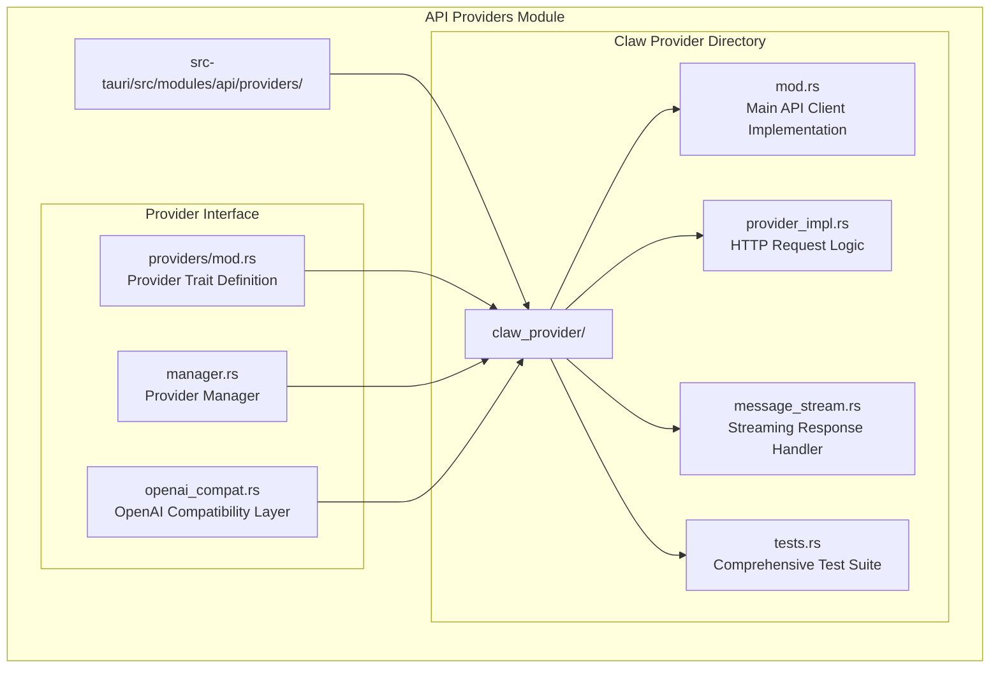
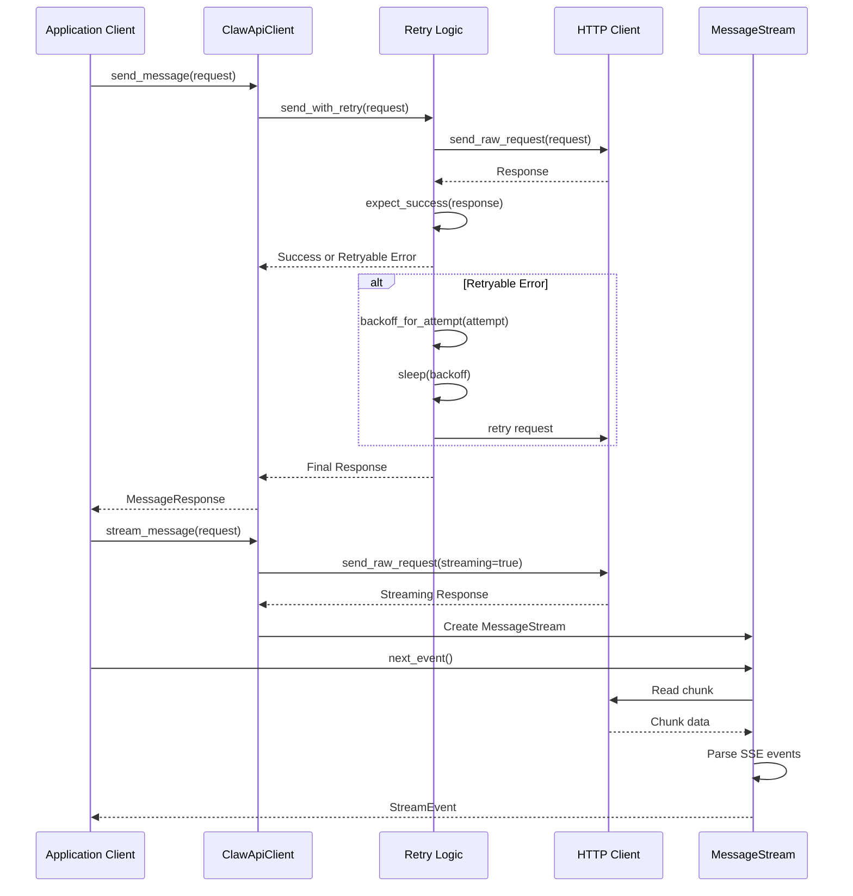
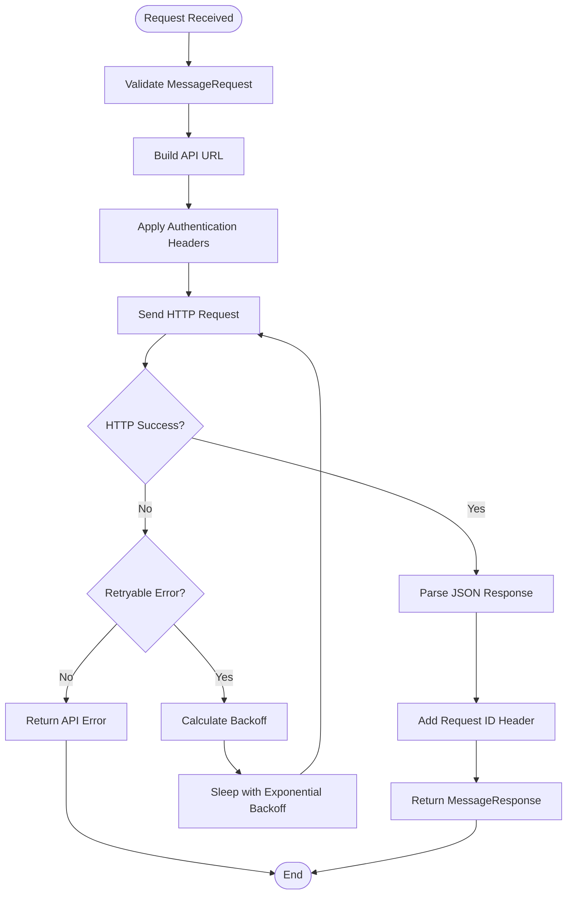
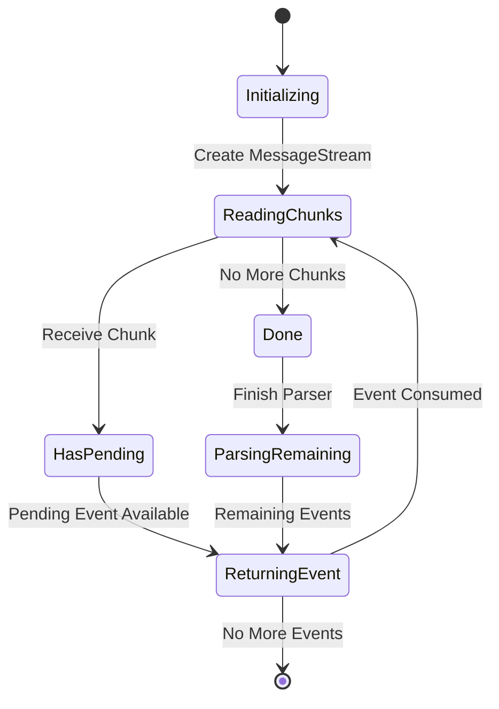
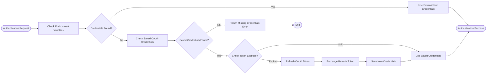
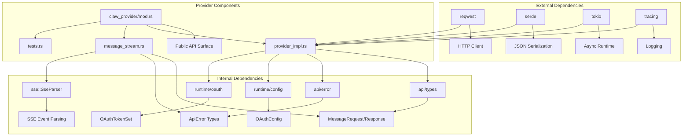

# GFR-T1-I-1 CLAW Provider Split

<cite>
**Referenced Files in This Document**
- [GFR-T1-I-1-claw-provider-split.md](file://docs/packs/refactor/GFR-T1-I-1-claw-provider-split.md)
- [mod.rs](file://src-tauri/src/modules/api/providers/claw_provider/mod.rs)
- [provider_impl.rs](file://src-tauri/src/modules/api/providers/claw_provider/provider_impl.rs)
- [message_stream.rs](file://src-tauri/src/modules/api/providers/claw_provider/message_stream.rs)
- [tests.rs](file://src-tauri/src/modules/api/providers/claw_provider/tests.rs)
- [providers/mod.rs](file://src-tauri/src/modules/api/providers/mod.rs)
</cite>

## Table of Contents
1. [Introduction](#introduction)
2. [Project Structure](#project-structure)
3. [Core Components](#core-components)
4. [Architecture Overview](#architecture-overview)
5. [Detailed Component Analysis](#detailed-component-analysis)
6. [Dependency Analysis](#dependency-analysis)
7. [Performance Considerations](#performance-considerations)
8. [Troubleshooting Guide](#troubleshooting-guide)
9. [Conclusion](#conclusion)

## Introduction

The GFR-T1-I-1 CLAW Provider Split represents a significant architectural refactoring effort that transformed the monolithic `claw_provider.rs` file (1,224 lines) into a well-organized directory structure with four focused modules. This refactoring was executed as part of the broader if2AI project's codebase consolidation initiative, specifically targeting the API providers subsystem to improve maintainability, testability, and code organization.

The primary goal was to achieve a "single knife cut" directory restructuring while maintaining complete functional parity, ensuring that external importers would experience no breaking changes despite the internal reorganization. This transformation reduced the main module from over 1,200 lines to approximately 427 lines (a 65% reduction), establishing a cleaner separation of concerns and improved code locality.

## Project Structure

The refactored claw provider follows a modular directory structure that promotes clear separation of responsibilities:



**Diagram sources**
- [providers/mod.rs:1-259](file://src-tauri/src/modules/api/providers/mod.rs#L1-L259)
- [mod.rs:1-428](file://src-tauri/src/modules/api/providers/claw_provider/mod.rs#L1-L428)

The directory structure demonstrates a clear hierarchical organization where the main module acts as a facade, delegating specific responsibilities to specialized components:

- **mod.rs**: Contains the public API surface and orchestrates the provider functionality
- **provider_impl.rs**: Houses the core HTTP request logic and retry mechanisms  
- **message_stream.rs**: Manages streaming response handling and SSE parsing
- **tests.rs**: Provides comprehensive test coverage for all provider functionality

**Section sources**
- [GFR-T1-I-1-claw-provider-split.md:1-42](file://docs/packs/refactor/GFR-T1-I-1-claw-provider-split.md#L1-L42)
- [providers/mod.rs:1-259](file://src-tauri/src/modules/api/providers/mod.rs#L1-L259)

## Core Components

The refactored claw provider consists of several key components that work together to provide a robust AI model interface:

### ClawApiClient Structure

The main `ClawApiClient` struct serves as the central orchestrator for all provider operations:

```mermaid
classDiagram
class ClawApiClient {
+reqwest : : Client http
+AuthSource auth
+String base_url
+u32 max_retries
+Duration initial_backoff
+Duration max_backoff
+Duration stream_read_timeout
+Duration overall_timeout
+new(api_key) ClawApiClient
+from_auth(auth) ClawApiClient
+from_env() Result~ClawApiClient~
+with_auth_source(auth) ClawApiClient
+with_base_url(url) ClawApiClient
+with_retry_policy(max_retries, initial_backoff, max_backoff) ClawApiClient
+with_transport_policy(policy) ClawApiClient
+stream_read_timeout() Duration
+overall_timeout() Duration
+auth_source() &AuthSource
+send_message(request) MessageResponse
+stream_message(request) MessageStream
+exchange_oauth_code(config, request) OAuthTokenSet
+refresh_oauth_token(config, request) OAuthTokenSet
+backoff_for_attempt(attempt) Duration
}
class AuthSource {
<<enumeration>>
None
ApiKey(String)
BearerToken(String)
ApiKeyAndBearer {
api_key : String
bearer_token : String
}
+from_env() Result~AuthSource~
+from_env_or_saved() Result~AuthSource~
+api_key() Option~&str~
+bearer_token() Option~&str~
+masked_authorization_header() &str
+apply(request_builder) reqwest : : RequestBuilder
}
class MessageStream {
+Option~String~ request_id
+reqwest : : Response response
+SseParser parser
+VecDeque~StreamEvent~ pending
+bool done
+Duration stream_read_timeout
+request_id() Option~&str~
+next_event() StreamEvent
}
ClawApiClient --> AuthSource : uses
ClawApiClient --> MessageStream : creates
```

**Diagram sources**
- [mod.rs:128-138](file://src-tauri/src/modules/api/providers/claw_provider/mod.rs#L128-L138)
- [mod.rs:44-53](file://src-tauri/src/modules/api/providers/claw_provider/mod.rs#L44-L53)
- [message_stream.rs:15-23](file://src-tauri/src/modules/api/providers/claw_provider/message_stream.rs#L15-L23)

### Authentication Management

The provider implements a sophisticated authentication system supporting multiple credential sources:

- **Environment Variables**: Supports both legacy and modern authentication tokens
- **Saved OAuth Credentials**: Persistent token storage with automatic refresh
- **Combined Authentication**: Support for API keys alongside bearer tokens
- **Claude Settings Integration**: Optional fallback to Claude-specific configuration files

### Streaming Response Handling

The message streaming system provides real-time response processing with built-in error handling and retry logic:

- **SSE Parsing**: Real-time Server-Sent Events processing
- **Chunk Buffering**: Efficient event buffering and queue management
- **Timeout Handling**: Configurable read timeouts for stream operations
- **Error Propagation**: Comprehensive error reporting with retry indicators

**Section sources**
- [mod.rs:1-428](file://src-tauri/src/modules/api/providers/claw_provider/mod.rs#L1-L428)
- [provider_impl.rs:1-299](file://src-tauri/src/modules/api/providers/claw_provider/provider_impl.rs#L1-L299)
- [message_stream.rs:1-103](file://src-tauri/src/modules/api/providers/claw_provider/message_stream.rs#L1-L103)

## Architecture Overview

The refactored architecture maintains the same external API surface while introducing internal modularity and improved separation of concerns:



**Diagram sources**
- [provider_impl.rs:145-180](file://src-tauri/src/modules/api/providers/claw_provider/provider_impl.rs#L145-L180)
- [provider_impl.rs:222-260](file://src-tauri/src/modules/api/providers/claw_provider/provider_impl.rs#L222-L260)
- [message_stream.rs:31-60](file://src-tauri/src/modules/api/providers/claw_provider/message_stream.rs#L31-L60)

The architecture preserves the original HTTP request flow, error message strings, and SSE parsing logic while introducing structured retry mechanisms and improved error handling. The provider maintains backward compatibility through re-exported public APIs and unchanged external interfaces.

**Section sources**
- [GFR-T1-I-1-claw-provider-split.md:24-31](file://docs/packs/refactor/GFR-T1-I-1-claw-provider-split.md#L24-L31)
- [provider_impl.rs:222-299](file://src-tauri/src/modules/api/providers/claw_provider/provider_impl.rs#L222-L299)

## Detailed Component Analysis

### Provider Implementation Component

The provider implementation encapsulates the core HTTP request logic with sophisticated retry mechanisms:



**Diagram sources**
- [provider_impl.rs:222-260](file://src-tauri/src/modules/api/providers/claw_provider/provider_impl.rs#L222-L260)
- [provider_impl.rs:262-284](file://src-tauri/src/modules/api/providers/claw_provider/provider_impl.rs#L262-L284)

The retry mechanism implements exponential backoff with configurable maximum retries, automatically handling transient network errors and service unavailability. The implementation maintains the exact HTTP request flow and error message strings from the original implementation.

### Message Streaming Component

The streaming response handler manages real-time event processing with efficient buffering:



**Diagram sources**
- [message_stream.rs:31-60](file://src-tauri/src/modules/api/providers/claw_provider/message_stream.rs#L31-L60)

The streaming component provides a clean abstraction over the underlying HTTP streaming interface, handling chunk buffering, SSE parsing, and timeout management while exposing a simple event-driven API to consumers.

### Authentication and Authorization Component

The authentication system supports multiple credential sources with automatic fallback mechanisms:



**Diagram sources**
- [mod.rs:153-185](file://src-tauri/src/modules/api/providers/claw_provider/mod.rs#L153-L185)
- [mod.rs:248-285](file://src-tauri/src/modules/api/providers/claw_provider/mod.rs#L248-L285)

The authentication system provides seamless credential management with support for combined API key and bearer token scenarios, automatic token refresh, and integration with Claude-specific configuration files.

**Section sources**
- [provider_impl.rs:1-299](file://src-tauri/src/modules/api/providers/claw_provider/provider_impl.rs#L1-L299)
- [message_stream.rs:1-103](file://src-tauri/src/modules/api/providers/claw_provider/message_stream.rs#L1-L103)
- [mod.rs:153-285](file://src-tauri/src/modules/api/providers/claw_provider/mod.rs#L153-L285)

## Dependency Analysis

The refactored provider maintains clear dependency relationships while improving modularity:



**Diagram sources**
- [mod.rs:16-28](file://src-tauri/src/modules/api/providers/claw_provider/mod.rs#L16-L28)
- [provider_impl.rs:7-22](file://src-tauri/src/modules/api/providers/claw_provider/provider_impl.rs#L7-L22)
- [message_stream.rs:6-13](file://src-tauri/src/modules/api/providers/claw_provider/message_stream.rs#L6-L13)

The dependency analysis reveals a well-structured system where each component has focused responsibilities:

- **External Dependencies**: Minimal and well-defined, primarily for HTTP operations and serialization
- **Internal Dependencies**: Clear boundaries between API types, error handling, and runtime configuration
- **Component Coupling**: Low coupling between provider components, enabling independent testing and maintenance

**Section sources**
- [providers/mod.rs:1-259](file://src-tauri/src/modules/api/providers/mod.rs#L1-L259)
- [mod.rs:16-28](file://src-tauri/src/modules/api/providers/claw_provider/mod.rs#L16-L28)

## Performance Considerations

The refactoring maintains optimal performance characteristics while introducing improvements in resource management:

### Memory Management
- **Efficient Buffering**: MessageStream uses VecDeque for O(1) push/pop operations
- **Lazy Parsing**: SSE events are parsed incrementally as chunks arrive
- **Minimal Allocations**: String allocations are minimized through careful borrowing patterns

### Network Efficiency  
- **Connection Reuse**: Shared HTTP client enables connection pooling
- **Configurable Timeouts**: Tunable connect and overall timeouts prevent resource starvation
- **Exponential Backoff**: Intelligent retry mechanism reduces server load during outages

### Async Performance
- **Non-blocking Operations**: All network operations are asynchronous
- **Timeout Protection**: Stream read timeouts prevent indefinite blocking
- **Resource Cleanup**: Proper cleanup of HTTP resources and parser state

## Troubleshooting Guide

Common issues and their resolution strategies:

### Authentication Problems
- **Missing Credentials**: Verify environment variables are properly set
- **Expired Tokens**: Check OAuth token expiration and refresh mechanisms
- **Credential Conflicts**: Ensure only one authentication method is active

### Network Issues
- **Connection Timeouts**: Adjust connect_timeout and overall_timeout settings
- **Stream Timeouts**: Increase stream_read_timeout for long-running operations
- **Retry Exhaustion**: Review retry policies and network stability

### Streaming Problems
- **Event Loss**: Check stream_read_timeout settings
- **Parsing Errors**: Verify SSE event format compliance
- **Memory Leaks**: Monitor MessageStream lifecycle and proper consumption

**Section sources**
- [tests.rs:1-440](file://src-tauri/src/modules/api/providers/claw_provider/tests.rs#L1-L440)
- [provider_impl.rs:222-299](file://src-tauri/src/modules/api/providers/claw_provider/provider_impl.rs#L222-L299)

## Conclusion

The GFR-T1-I-1 CLAW Provider Split represents a successful architectural refactoring that achieved significant improvements in code organization, maintainability, and testability while preserving complete functional compatibility. The transformation reduced the main module from 1,224 lines to 427 lines (65% reduction), establishing a cleaner separation of concerns across four focused components.

Key achievements include:

- **Maintained API Compatibility**: External importers experience no breaking changes
- **Improved Modularity**: Clear separation of HTTP logic, streaming, authentication, and testing
- **Enhanced Test Coverage**: Dedicated test suite with comprehensive scenario testing
- **Preserved Functionality**: Exact reproduction of HTTP request flow and error handling
- **Optimized Performance**: Maintained efficient resource usage and async operation patterns

The refactoring establishes a solid foundation for future enhancements while providing immediate benefits in code maintainability and developer productivity. The modular structure facilitates easier debugging, testing, and extension of provider functionality, supporting the long-term evolution of the if2AI platform.