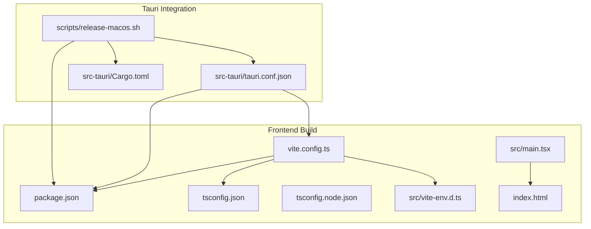
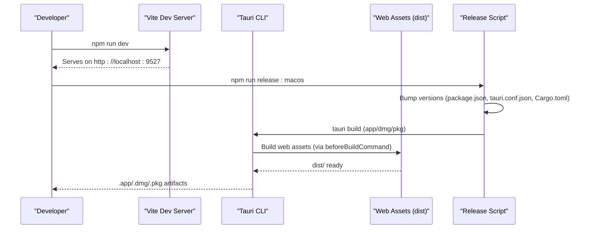
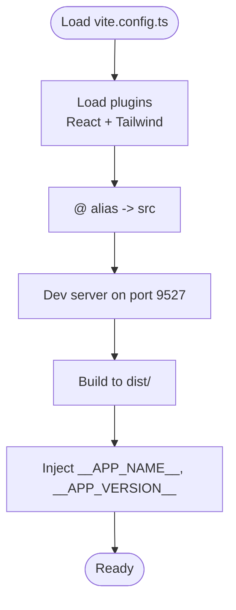
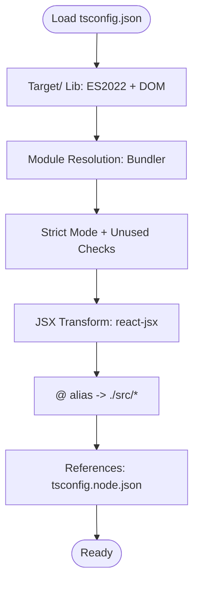
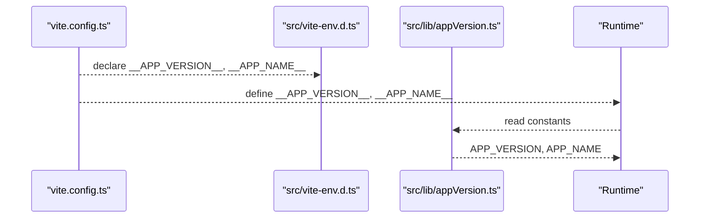
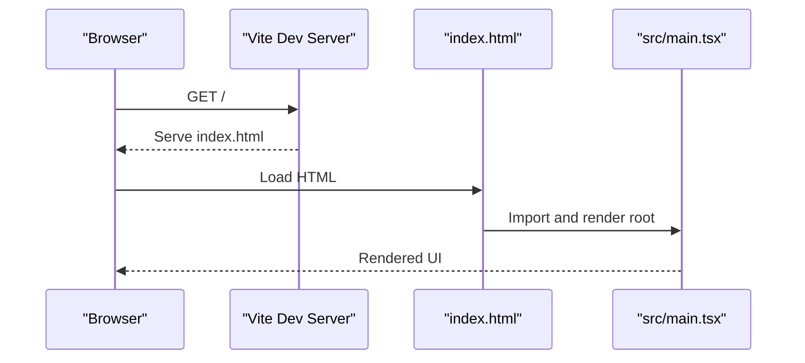
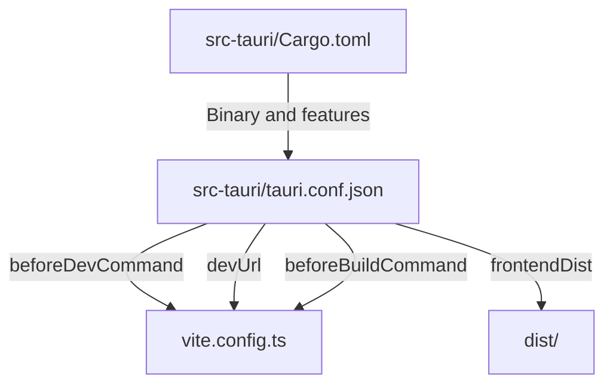
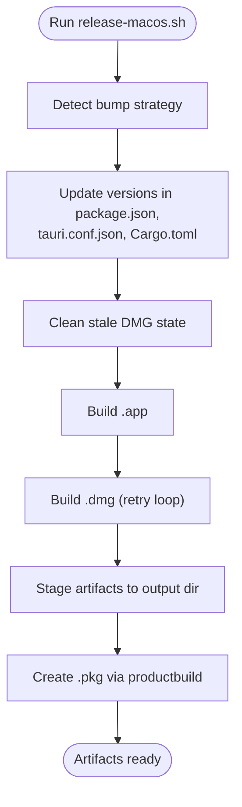
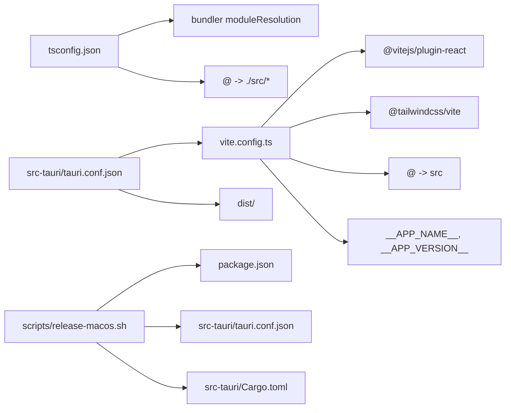

# Build Configuration

<cite>
**Referenced Files in This Document**
- [vite.config.ts](file://vite.config.ts)
- [package.json](file://package.json)
- [tsconfig.json](file://tsconfig.json)
- [tsconfig.node.json](file://tsconfig.node.json)
- [src/vite-env.d.ts](file://src/vite-env.d.ts)
- [src/lib/appVersion.ts](file://src/lib/appVersion.ts)
- [index.html](file://index.html)
- [src/main.tsx](file://src/main.tsx)
- [src-tauri/tauri.conf.json](file://src-tauri/tauri.conf.json)
- [scripts/release-macos.sh](file://scripts/release-macos.sh)
- [src-tauri/Cargo.toml](file://src-tauri/Cargo.toml)
</cite>

## Table of Contents
1. [Introduction](#introduction)
2. [Project Structure](#project-structure)
3. [Core Components](#core-components)
4. [Architecture Overview](#architecture-overview)
5. [Detailed Component Analysis](#detailed-component-analysis)
6. [Dependency Analysis](#dependency-analysis)
7. [Performance Considerations](#performance-considerations)
8. [Troubleshooting Guide](#troubleshooting-guide)
9. [Conclusion](#conclusion)

## Introduction
This document explains the build configuration and development workflow for the project. It covers the Vite configuration (plugins, aliases, dev server, and build outputs), TypeScript configuration and type checking, the integration with the Tauri backend, and the end-to-end build and release process. It also highlights environment variable usage, build targets, and deployment considerations, along with performance and troubleshooting guidance.

## Project Structure
The build system spans three primary areas:
- Frontend build via Vite and React
- TypeScript compilation and type checking
- Tauri integration for desktop packaging and runtime

**Diagram sources**
- [vite.config.ts](file://vite.config.ts)
- [package.json](file://package.json)
- [tsconfig.json](file://tsconfig.json)
- [tsconfig.node.json](file://tsconfig.node.json)
- [src/vite-env.d.ts](file://src/vite-env.d.ts)
- [src/main.tsx](file://src/main.tsx)
- [index.html](file://index.html)
- [src-tauri/tauri.conf.json](file://src-tauri/tauri.conf.json)
- [scripts/release-macos.sh](file://scripts/release-macos.sh)
- [src-tauri/Cargo.toml](file://src-tauri/Cargo.toml)

**Section sources**
- [vite.config.ts](file://vite.config.ts)
- [package.json](file://package.json)
- [tsconfig.json](file://tsconfig.json)
- [tsconfig.node.json](file://tsconfig.node.json)
- [src/vite-env.d.ts](file://src/vite-env.d.ts)
- [src/main.tsx](file://src/main.tsx)
- [index.html](file://index.html)
- [src-tauri/tauri.conf.json](file://src-tauri/tauri.conf.json)
- [scripts/release-macos.sh](file://scripts/release-macos.sh)
- [src-tauri/Cargo.toml](file://src-tauri/Cargo.toml)

## Core Components
- Vite configuration defines plugins, path aliases, dev server port, build output directory, and compile-time constants.
- TypeScript configuration enables strictness, bundler module resolution, JSX transform, and path aliases mirroring Vite’s alias.
- Tauri configuration orchestrates frontend build integration, dev server URL, and packaging resources.
- Release script coordinates version synchronization across frontend, Tauri, and Rust packages, then produces macOS artifacts.

Key behaviors:
- Path alias @ resolves to src for ergonomic imports.
- Dev server runs on port 9527 and serves the React app.
- Build outputs to dist and is consumed by Tauri during packaging.
- Compile-time constants inject app name and version from package metadata.

**Section sources**
- [vite.config.ts](file://vite.config.ts)
- [tsconfig.json](file://tsconfig.json)
- [src/vite-env.d.ts](file://src/vite-env.d.ts)
- [src/lib/appVersion.ts](file://src/lib/appVersion.ts)
- [src-tauri/tauri.conf.json](file://src-tauri/tauri.conf.json)
- [scripts/release-macos.sh](file://scripts/release-macos.sh)

## Architecture Overview
The frontend build pipeline feeds Tauri, which bundles the web assets into a desktop application. The release script ensures version consistency across all components.

**Diagram sources**
- [package.json](file://package.json)
- [src-tauri/tauri.conf.json](file://src-tauri/tauri.conf.json)
- [scripts/release-macos.sh](file://scripts/release-macos.sh)

## Detailed Component Analysis

### Vite Configuration
- Plugins: React refresh and Tailwind CSS integration.
- Aliases: @ resolves to src for concise imports.
- Dev server: Port 9527 with default host.
- Build: Outputs to dist.
- Define: Injects app name and version as compile-time constants.

**Diagram sources**
- [vite.config.ts](file://vite.config.ts)

**Section sources**
- [vite.config.ts](file://vite.config.ts)

### TypeScript Configuration
- Target and library: ES2022 with DOM APIs.
- Module resolution: Bundler for Vite compatibility.
- Strictness: Enabled with unused locals/parameters checks.
- JSX transform: React JSX.
- Path aliases: Mirrors Vite’s @ alias to ./src/*.
- References: Includes tsconfig.node.json for Vite config typing.

**Diagram sources**
- [tsconfig.json](file://tsconfig.json)
- [tsconfig.node.json](file://tsconfig.node.json)

**Section sources**
- [tsconfig.json](file://tsconfig.json)
- [tsconfig.node.json](file://tsconfig.node.json)

### Environment Types and Compile-Time Constants
- Vite injects __APP_VERSION__ and __APP_NAME__ into the build.
- These constants are declared in src/vite-env.d.ts and consumed by src/lib/appVersion.ts to expose APP_VERSION and APP_NAME.
- Fallback values are provided for development scenarios.

**Diagram sources**
- [vite.config.ts](file://vite.config.ts)
- [src/vite-env.d.ts](file://src/vite-env.d.ts)
- [src/lib/appVersion.ts](file://src/lib/appVersion.ts)

**Section sources**
- [src/vite-env.d.ts](file://src/vite-env.d.ts)
- [src/lib/appVersion.ts](file://src/lib/appVersion.ts)
- [vite.config.ts](file://vite.config.ts)

### Development Server and Entry Point
- Dev server runs on port 9527 as configured.
- index.html mounts the React root and loads src/main.tsx.
- src/main.tsx renders different views based on URL parameters (e.g., settings, browser viewer, loading screen).

**Diagram sources**
- [index.html](file://index.html)
- [src/main.tsx](file://src/main.tsx)
- [vite.config.ts](file://vite.config.ts)

**Section sources**
- [index.html](file://index.html)
- [src/main.tsx](file://src/main.tsx)
- [vite.config.ts](file://vite.config.ts)

### Tauri Integration and Build Targets
- Tauri configuration:
  - beforeDevCommand invokes the Vite dev script.
  - devUrl points to the Vite dev server.
  - beforeBuildCommand builds the web assets.
  - frontendDist points to the dist directory produced by Vite.
- Windows and tray icon configuration are defined for the desktop app.
- Resource bundling includes bundled skills and voice assets.

**Diagram sources**
- [src-tauri/tauri.conf.json](file://src-tauri/tauri.conf.json)
- [vite.config.ts](file://vite.config.ts)
- [src-tauri/Cargo.toml](file://src-tauri/Cargo.toml)

**Section sources**
- [src-tauri/tauri.conf.json](file://src-tauri/tauri.conf.json)
- [vite.config.ts](file://vite.config.ts)
- [src-tauri/Cargo.toml](file://src-tauri/Cargo.toml)

### Release and Version Management
- The macOS release script:
  - Accepts a bump strategy (patch/minor/major/explicit version/none).
  - Updates versions in package.json, tauri.conf.json, and Cargo.toml.
  - Cleans stale DMG state, builds .app, retries DMG builds, stages artifacts, and creates a .pkg via productbuild.
- Version sources:
  - Frontend version from package.json.
  - Tauri version from tauri.conf.json.
  - Backend version from Cargo.toml.

**Diagram sources**
- [scripts/release-macos.sh](file://scripts/release-macos.sh)
- [package.json](file://package.json)
- [src-tauri/tauri.conf.json](file://src-tauri/tauri.conf.json)
- [src-tauri/Cargo.toml](file://src-tauri/Cargo.toml)

**Section sources**
- [scripts/release-macos.sh](file://scripts/release-macos.sh)
- [package.json](file://package.json)
- [src-tauri/tauri.conf.json](file://src-tauri/tauri.conf.json)
- [src-tauri/Cargo.toml](file://src-tauri/Cargo.toml)

## Dependency Analysis
- Vite depends on React plugin and Tailwind integration; it resolves @ to src and defines app metadata constants.
- TypeScript mirrors Vite’s module resolution and path aliases.
- Tauri depends on Vite’s dist output and consumes it as frontendDist.
- Release script coordinates version synchronization across package.json, tauri.conf.json, and Cargo.toml.

**Diagram sources**
- [vite.config.ts](file://vite.config.ts)
- [tsconfig.json](file://tsconfig.json)
- [src-tauri/tauri.conf.json](file://src-tauri/tauri.conf.json)
- [scripts/release-macos.sh](file://scripts/release-macos.sh)
- [src-tauri/Cargo.toml](file://src-tauri/Cargo.toml)

**Section sources**
- [vite.config.ts](file://vite.config.ts)
- [tsconfig.json](file://tsconfig.json)
- [src-tauri/tauri.conf.json](file://src-tauri/tauri.conf.json)
- [scripts/release-macos.sh](file://scripts/release-macos.sh)
- [src-tauri/Cargo.toml](file://src-tauri/Cargo.toml)

## Performance Considerations
- Module resolution: Using bundler moduleResolution in tsconfig.json aligns with Vite and reduces unnecessary Node-style resolution overhead.
- Strict TypeScript settings catch potential issues early and improve DX.
- Dev server port 9527 avoids conflicts with common ports; keep it consistent across environments.
- Tailwind integration is included via the Tailwind Vite plugin; ensure purge/content globs are tuned for production builds to minimize CSS size.
- For large projects, consider enabling Vite’s built-in code splitting and lazy-loading routes to reduce initial bundle size.
- Keep dependencies lean; avoid bundling unused UI libraries or heavy polyfills.

[No sources needed since this section provides general guidance]

## Troubleshooting Guide
Common issues and resolutions:
- Dev server not starting:
  - Verify port 9527 is free and npm scripts are correct.
  - Confirm beforeDevCommand in tauri.conf.json matches the dev script.
- Build fails or dist missing:
  - Ensure beforeBuildCommand runs successfully and outputs to dist.
  - Check that frontendDist in tauri.conf.json points to dist.
- Version mismatch in releases:
  - Use the release script to synchronize versions across package.json, tauri.conf.json, and Cargo.toml.
- Missing compile-time constants:
  - Confirm define entries in vite.config.ts and declarations in src/vite-env.d.ts match usage in src/lib/appVersion.ts.

**Section sources**
- [vite.config.ts](file://vite.config.ts)
- [src-tauri/tauri.conf.json](file://src-tauri/tauri.conf.json)
- [scripts/release-macos.sh](file://scripts/release-macos.sh)
- [src/vite-env.d.ts](file://src/vite-env.d.ts)
- [src/lib/appVersion.ts](file://src/lib/appVersion.ts)

## Conclusion
The build system integrates Vite, TypeScript, and Tauri to deliver a streamlined development and packaging workflow. Vite handles fast refresh and asset bundling, TypeScript enforces strong typing, and Tauri embeds the web assets into a desktop application. The release script centralizes version management for consistent releases across platforms.

[No sources needed since this section summarizes without analyzing specific files]