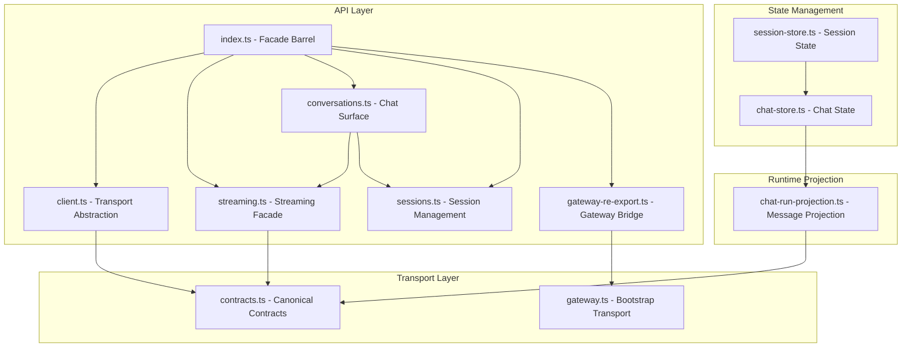
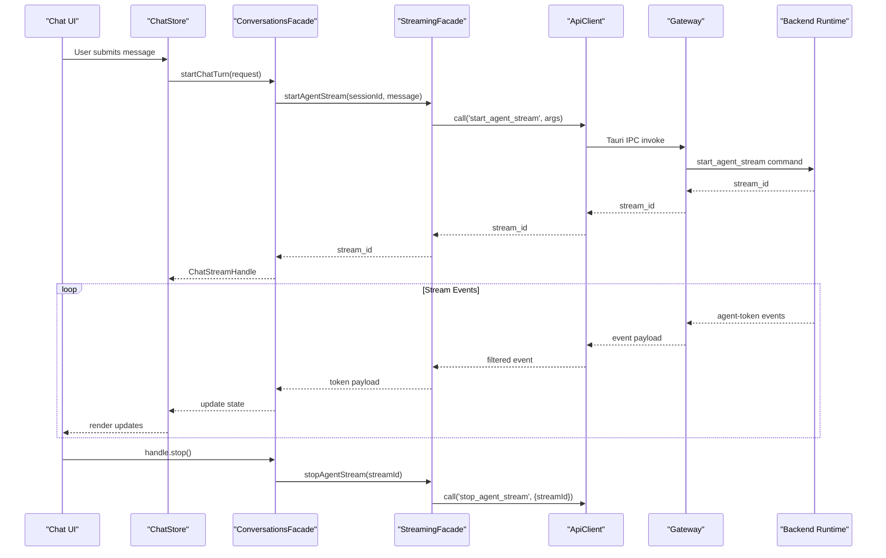
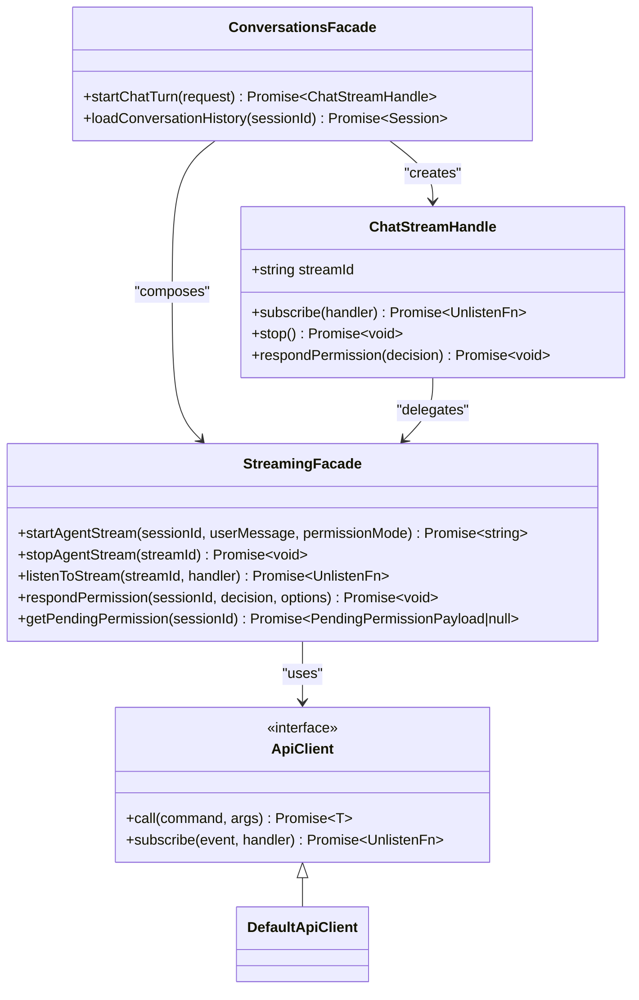
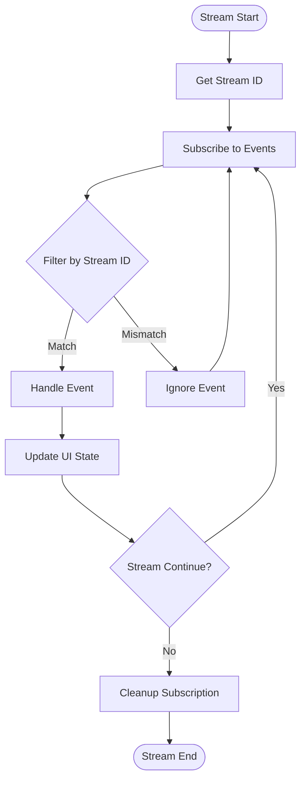
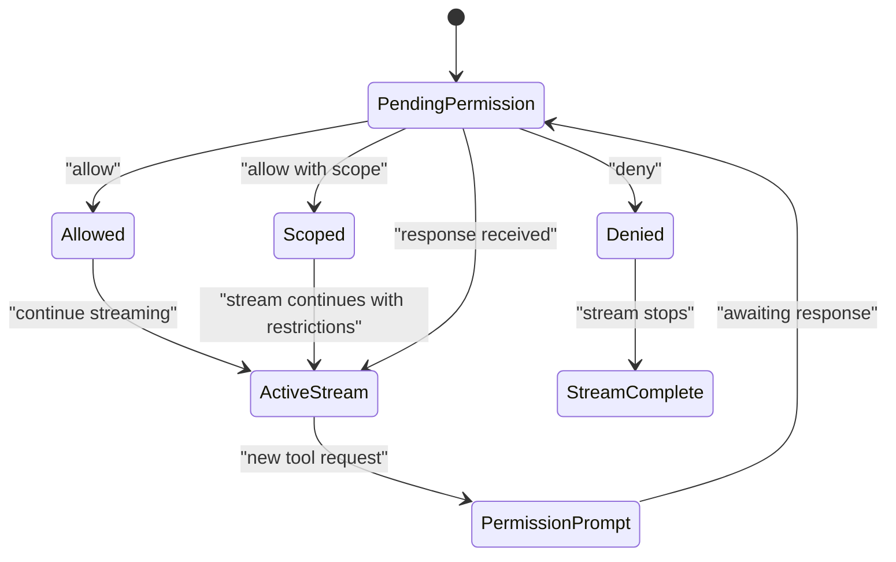
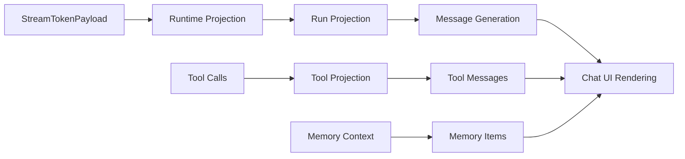
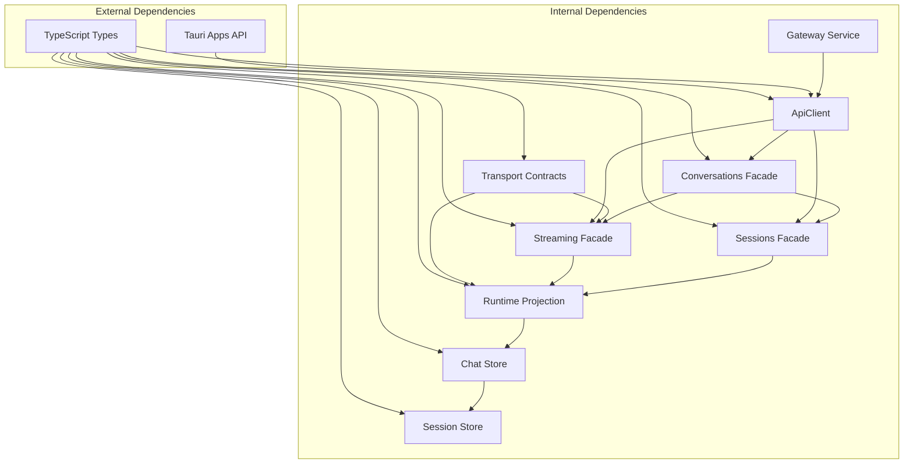

# Frontend API Facade and Streaming

<cite>
**Referenced Files in This Document**
- [index.ts](file://src/api/index.ts)
- [client.ts](file://src/api/client.ts)
- [streaming.ts](file://src/api/streaming.ts)
- [gateway-re-export.ts](file://src/api/gateway-re-export.ts)
- [contracts.ts](file://src/transport/contracts.ts)
- [gateway.ts](file://src/transport/gateway.ts)
- [conversations.ts](file://src/api/conversations.ts)
- [sessions.ts](file://src/api/sessions.ts)
- [chat-run-projection.ts](file://src/runtime-projection/chat-run-projection.ts)
- [chat-store.ts](file://src/stores/chat-store.ts)
- [session-store.ts](file://src/stores/session-store.ts)
- [client.test.ts](file://src/api/client.test.ts)
- [conversations.test.ts](file://src/api/conversations.test.ts)
</cite>

## Table of Contents
1. [Introduction](#introduction)
2. [Project Structure](#project-structure)
3. [Core Components](#core-components)
4. [Architecture Overview](#architecture-overview)
5. [Detailed Component Analysis](#detailed-component-analysis)
6. [Dependency Analysis](#dependency-analysis)
7. [Performance Considerations](#performance-considerations)
8. [Troubleshooting Guide](#troubleshooting-guide)
9. [Conclusion](#conclusion)

## Introduction

The Frontend API Facade and Streaming system represents a comprehensive architectural layer that abstracts and orchestrates all frontend-to-backend communication in the if2Ai application. This system implements a strategic separation between presentation logic and transport mechanisms, providing a clean API surface for chat streaming, session management, and real-time event handling.

The architecture follows a multi-layered approach where the API facade serves as the primary interface for all business operations, while the transport layer maintains loose coupling with the underlying IPC mechanism. This design enables future migration to alternative transport protocols without disrupting application logic.

## Project Structure

The streaming and API facade system is organized across several key directories and modules:

**Diagram sources**
- [index.ts:1-24](file://src/api/index.ts#L1-L24)
- [client.ts:1-68](file://src/api/client.ts#L1-L68)
- [streaming.ts:1-98](file://src/api/streaming.ts#L1-L98)
- [contracts.ts:1-615](file://src/transport/contracts.ts#L1-L615)

**Section sources**
- [index.ts:1-24](file://src/api/index.ts#L1-L24)
- [client.ts:1-68](file://src/api/client.ts#L1-L68)
- [streaming.ts:1-98](file://src/api/streaming.ts#L1-L98)

## Core Components

### API Facade Barrel

The API facade barrel serves as the central import point for all domain-specific APIs, implementing the principle of single responsibility and controlled access to backend services.

Key characteristics:
- Provides unified import interface for all API domains
- Prevents direct access to transport primitives from business logic
- Enables future transport migration through centralized abstraction
- Maintains backward compatibility during architectural transitions

### Transport Abstraction Layer

The transport abstraction layer implements a clean separation between business logic and IPC mechanisms, providing:

- **ApiClient Interface**: Standardized contract for all transport operations
- **Default Implementation**: Tauri IPC integration for production use
- **Test Support**: Mock client injection for unit testing
- **Future Extensibility**: Pluggable transport architecture

### Streaming Domain Facade

The streaming facade encapsulates all agent interaction logic with sophisticated event handling and state management:

- **Stream Lifecycle Management**: Complete control over streaming sessions
- **Event Filtering**: Client-side filtering of relevant stream events
- **Permission Handling**: Structured permission prompt responses
- **Error Recovery**: Graceful handling of streaming interruptions

**Section sources**
- [index.ts:14-24](file://src/api/index.ts#L14-L24)
- [client.ts:24-68](file://src/api/client.ts#L24-L68)
- [streaming.ts:10-98](file://src/api/streaming.ts#L10-L98)

## Architecture Overview

The system employs a layered architecture that separates concerns across multiple abstraction levels:

**Diagram sources**
- [conversations.ts:85-112](file://src/api/conversations.ts#L85-L112)
- [streaming.ts:28-44](file://src/api/streaming.ts#L28-L44)
- [client.ts:35-44](file://src/api/client.ts#L35-L44)

The architecture ensures loose coupling between components while maintaining strong typing and clear data flow patterns. The canonical contracts define the wire protocol, enabling reliable communication between frontend and backend systems.

**Section sources**
- [contracts.ts:410-443](file://src/transport/contracts.ts#L410-L443)
- [gateway.ts:54-113](file://src/transport/gateway.ts#L54-L113)

## Detailed Component Analysis

### Streaming Facade Implementation

The streaming facade provides a comprehensive interface for managing agent interactions with sophisticated event handling capabilities:

**Diagram sources**
- [client.ts:24-68](file://src/api/client.ts#L24-L68)
- [streaming.ts:28-97](file://src/api/streaming.ts#L28-L97)
- [conversations.ts:68-83](file://src/api/conversations.ts#L68-L83)

#### Event Handling Architecture

The streaming system implements sophisticated event filtering and correlation mechanisms:

**Diagram sources**
- [streaming.ts:55-64](file://src/api/streaming.ts#L55-L64)

#### Permission Management System

The permission system provides structured handling of tool access requests with configurable scopes:

**Diagram sources**
- [streaming.ts:71-82](file://src/api/streaming.ts#L71-L82)
- [contracts.ts:445-455](file://src/transport/contracts.ts#L445-L455)

**Section sources**
- [streaming.ts:10-98](file://src/api/streaming.ts#L10-L98)
- [contracts.ts:410-463](file://src/transport/contracts.ts#L410-L463)

### Conversation Management Facade

The conversation facade provides a unified interface for chat operations while maintaining session context:

```mermaid
sequenceDiagram
participant ChatUI as "Chat Interface"
participant ConvFacade as "ConversationsFacade"
participant StreamFacade as "StreamingFacade"
participant SessionFacade as "SessionsFacade"
participant Store as "ChatStore"
ChatUI->>ConvFacade : startChatTurn({sessionId, message})
ConvFacade->>StreamFacade : startAgentStream(sessionId, message)
StreamFacade-->>ConvFacade : streamId
ConvFacade->>ConvFacade : create ChatStreamHandle
ConvFacade-->>ChatUI : ChatStreamHandle
ChatUI->>ConvFacade : handle.subscribe(handler)
ConvFacade->>StreamFacade : listenToStream(streamId, handler)
StreamFacade-->>ConvFacade : UnlistenFn
ConvFacade-->>ChatUI : UnlistenFn
ChatUI->>ConvFacade : handle.stop()
ConvFacade->>StreamFacade : stopAgentStream(streamId)
ChatUI->>ConvFacade : loadConversationHistory(sessionId)
ConvFacade->>SessionFacade : getSession(sessionId)
SessionFacade-->>ConvFacade : Session
ConvFacade-->>ChatUI : Session
```

**Diagram sources**
- [conversations.ts:100-125](file://src/api/conversations.ts#L100-L125)

**Section sources**
- [conversations.ts:1-126](file://src/api/conversations.ts#L1-L126)
- [sessions.ts:78-180](file://src/api/sessions.ts#L78-L180)

### Runtime Projection Integration

The system integrates with runtime projections to transform streaming events into UI-ready messages:

**Diagram sources**
- [chat-run-projection.ts:44-146](file://src/runtime-projection/chat-run-projection.ts#L44-L146)

**Section sources**
- [chat-run-projection.ts:1-266](file://src/runtime-projection/chat-run-projection.ts#L1-L266)

## Dependency Analysis

The system exhibits excellent modularity with clear dependency relationships:

**Diagram sources**
- [client.ts:14-15](file://src/api/client.ts#L14-L15)
- [streaming.ts:19](file://src/api/streaming.ts#L19)
- [contracts.ts:1-615](file://src/transport/contracts.ts#L1-L615)

The dependency graph reveals a well-structured system where:
- Lower layers (transport, contracts) remain stable and reusable
- Higher layers (facade, store) depend on but do not modify lower layers
- Clear separation of concerns prevents circular dependencies
- Testability is enhanced through dependency injection

**Section sources**
- [client.ts:1-68](file://src/api/client.ts#L1-L68)
- [contracts.ts:1-615](file://src/transport/contracts.ts#L1-L615)

## Performance Considerations

The streaming architecture incorporates several performance optimization strategies:

### Event Filtering Efficiency
- Client-side event filtering reduces unnecessary UI updates
- Stream correlation keys enable targeted event processing
- Unlisten handlers prevent memory leaks from abandoned subscriptions

### State Management Optimization
- UseSyncExternalStore pattern minimizes re-renders
- Selective state updates based on stream correlation
- Efficient message projection reduces DOM manipulation overhead

### Memory Management
- Proper cleanup of event subscriptions
- Stream lifecycle management prevents resource accumulation
- Test mocks enable deterministic memory usage in unit tests

## Troubleshooting Guide

### Common Issues and Solutions

**Stream Not Starting**
- Verify gateway readiness before initiating streams
- Check API client configuration and transport availability
- Ensure proper session context is established

**Events Not Received**
- Confirm subscription cleanup is properly handled
- Verify stream correlation key matches event payload
- Check for network connectivity issues

**Permission Prompts Not Responding**
- Ensure sessionId binding remains consistent
- Verify permission mode compatibility
- Check for concurrent permission requests

**Memory Leaks**
- Always invoke returned UnlistenFn on component cleanup
- Monitor subscription counts in test environments
- Verify proper API client reset in test teardown

**Section sources**
- [client.test.ts:82-116](file://src/api/client.test.ts#L82-L116)
- [conversations.test.ts:51-136](file://src/api/conversations.test.ts#L51-L136)

## Conclusion

The Frontend API Facade and Streaming system represents a mature, well-architected solution for managing complex asynchronous interactions in a Tauri-based application. The system successfully balances flexibility with maintainability through its layered architecture and comprehensive abstraction patterns.

Key strengths include:
- **Clean Separation of Concerns**: Clear boundaries between transport, business logic, and presentation layers
- **Testability**: Comprehensive mocking support enables thorough unit testing
- **Extensibility**: Pluggable transport architecture supports future protocol migrations
- **Performance**: Optimized event handling and state management minimize resource usage
- **Reliability**: Robust error handling and cleanup mechanisms ensure system stability

The system's design anticipates future architectural evolution while maintaining backward compatibility, positioning the application for continued growth and enhancement. The canonical contracts and transport abstractions provide a solid foundation for extending functionality without compromising system integrity.