# Frontend Application

<cite>
**Referenced Files in This Document**
- [App.tsx](file://src/App.tsx)
- [main.tsx](file://src/main.tsx)
- [vite.config.ts](file://vite.config.ts)
- [package.json](file://package.json)
- [tsconfig.json](file://tsconfig.json)
- [MainShell.tsx](file://src/shell/MainShell.tsx)
- [BootShell.tsx](file://src/boot/BootShell.tsx)
- [boot-orchestrator.ts](file://src/boot/boot-orchestrator.ts)
- [ChatWorkspace.tsx](file://src/modules/chat/components/ChatWorkspace.tsx)
- [SettingsApp.tsx](file://src/modules/settings/SettingsApp.tsx)
- [OnboardingApp.tsx](file://src/modules/onboarding/OnboardingApp.tsx)
- [index.ts](file://src/modules/skills/index.ts)
- [api/index.ts](file://src/api/index.ts)
- [api/client.ts](file://src/api/client.ts)
- [api/projects.ts](file://src/api/projects.ts)
- [api/sessions.ts](file://src/api/sessions.ts)
- [api/onboarding.ts](file://src/api/onboarding.ts)
- [state/bootstrap-store.ts](file://src/state/bootstrap-store.ts)
- [state/use-bootstrap-store.ts](file://src/state/use-bootstrap-store.ts)
- [transport/index.ts](file://src/transport/index.ts)
- [transport/contracts.ts](file://src/transport/contracts.ts)
- [transport/gateway.ts](file://src/transport/gateway.ts)
- [tauri.ts](file://src/lib/tauri.ts)
- [runtime-projection-store.ts](file://src/runtime-projection/runtime-projection-store.ts)
- [conversation-slice.ts](file://src/stores/conversation-slice.ts)
- [globals.css](file://src/styles/globals.css)
- [ds/index.ts](file://src/components/ds/index.ts)
</cite>

## Update Summary
**Changes Made**
- Added documentation for the new API facade system established through src/api/ directory
- Documented the transport-agnostic abstraction layer replacing direct Tauri IPC calls
- Added documentation for the new bootstrap store system and frontend transport layer
- Updated architecture diagrams to reflect the new API facade pattern
- Added documentation for the new transport contracts and gateway system

## Table of Contents
1. [Introduction](#introduction)
2. [Project Structure](#project-structure)
3. [Core Components](#core-components)
4. [Architecture Overview](#architecture-overview)
5. [Detailed Component Analysis](#detailed-component-analysis)
6. [API Facade System](#api-facade-system)
7. [Bootstrap Store System](#bootstrap-store-system)
8. [Transport Layer](#transport-layer)
9. [Dependency Analysis](#dependency-analysis)
10. [Performance Considerations](#performance-considerations)
11. [Troubleshooting Guide](#troubleshooting-guide)
12. [Conclusion](#conclusion)
13. [Appendices](#appendices)

## Introduction
This document describes the React-based frontend for a Tauri-powered desktop application. It explains how React components interact with the Tauri backend via the new API facade system, how the modular architecture separates concerns across chat, settings, onboarding, and skills management, and how state is managed using React hooks and custom stores. It also documents the design system, styling approach with Tailwind CSS, responsive design, component composition patterns, and the build configuration with Vite and TypeScript.

**Updated** The frontend now features a comprehensive API facade system that abstracts transport mechanisms, a bootstrap store for application boot state management, and a transport layer that provides canonical contracts for backend communication.

## Project Structure
The frontend is organized around a thin React shell that delegates to module-specific surfaces with a new API facade architecture:
- App.tsx orchestrates boot, onboarding gating, and routes to MainShell and module surfaces using the new API facade system
- MainShell.tsx provides the global chrome and navigation
- BootShell.tsx manages the boot sequence with the new bootstrap store
- Module surfaces:
  - Chat: src/modules/chat/components/ChatWorkspace.tsx
  - Settings: src/modules/settings/SettingsApp.tsx
  - Onboarding: src/modules/onboarding/OnboardingApp.tsx
  - Skills: src/modules/skills/index.ts
- API facade system: src/api/ directory with transport-agnostic domain modules
- Transport layer: src/transport/ directory with canonical contracts
- Bootstrap store: src/state/ directory for boot state management
- Shared infrastructure:
  - Thin Tauri bridge: src/lib/tauri.ts (now focused on transport primitives)
  - Runtime projection store: src/runtime-projection/runtime-projection-store.ts
  - Conversation slice: src/stores/conversation-slice.ts
  - Design system: src/components/ds/index.ts
  - Styles: src/styles/globals.css

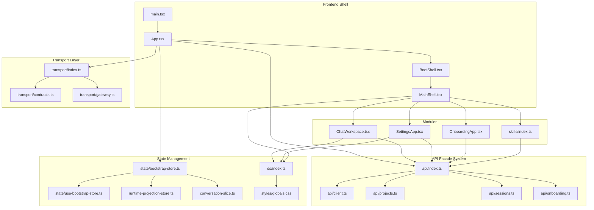

**Diagram sources**
- [main.tsx:16-43](file://src/main.tsx#L16-L43)
- [App.tsx:102-154](file://src/App.tsx#L102-L154)
- [BootShell.tsx:52-82](file://src/boot/BootShell.tsx#L52-L82)
- [MainShell.tsx:52-84](file://src/shell/MainShell.tsx#L52-L84)
- [api/index.ts:14-22](file://src/api/index.ts#L14-L22)
- [api/client.ts:24-67](file://src/api/client.ts#L24-L67)
- [transport/index.ts:9-11](file://src/transport/index.ts#L9-L11)
- [transport/contracts.ts:26-28](file://src/transport/contracts.ts#L26-L28)
- [transport/gateway.ts:15-64](file://src/transport/gateway.ts#L15-L64)
- [state/bootstrap-store.ts:59-91](file://src/state/bootstrap-store.ts#L59-L91)
- [state/use-bootstrap-store.ts:12-27](file://src/state/use-bootstrap-store.ts#L12-L27)

**Section sources**
- [main.tsx:16-43](file://src/main.tsx#L16-L43)
- [App.tsx:102-154](file://src/App.tsx#L102-L154)
- [BootShell.tsx:52-82](file://src/boot/BootShell.tsx#L52-L82)
- [MainShell.tsx:52-84](file://src/shell/MainShell.tsx#L52-L84)

## Core Components
- App.tsx
  - Coordinates boot sequence using the new bootstrap store and API facade system
  - Manages global state for active project/session, loading flags, conversations, and UI preferences
  - Subscribes to Tauri events (e.g., chat prefill) and wires runtime projection listeners
  - Integrates permission prompts via the runtime projection store
  - Uses API facade functions for all business operations (project/session CRUD, streaming, permissions)
- BootShell.tsx
  - Minimal boot shell container managing splash, onboarding, and main surfaces
  - Handles global overlays (toaster notifications, activation gate overlay)
  - Renders the appropriate surface based on bootstrap store state
- MainShell.tsx
  - Provides global chrome: version watermark, execution mode pill, global navbar, and main content area
  - Forwards navigation and settings actions to App.tsx
- ChatWorkspace.tsx
  - Hosts the chat UI, sidebar, and optional browser overlay
  - Manages layout controls (density, font), left/right pane visibility, and session-scoped UI
- SettingsApp.tsx
  - Presents settings pages and manages local UI state; integrates with API facades for skills and provider configuration
- OnboardingApp.tsx
  - Renders step-based onboarding flow and coordinates with backend state via API facades
- Skills module
  - Exports UI components and types for skills management using API facades

**Section sources**
- [App.tsx:102-154](file://src/App.tsx#L102-L154)
- [BootShell.tsx:52-82](file://src/boot/BootShell.tsx#L52-L82)
- [MainShell.tsx:52-84](file://src/shell/MainShell.tsx#L52-L84)
- [ChatWorkspace.tsx:92-401](file://src/modules/chat/components/ChatWorkspace.tsx#L92-L401)
- [SettingsApp.tsx:36-227](file://src/modules/settings/SettingsApp.tsx#L36-L227)
- [OnboardingApp.tsx:156-211](file://src/modules/onboarding/OnboardingApp.tsx#L156-L211)
- [index.ts:1-9](file://src/modules/skills/index.ts#L1-L9)

## Architecture Overview
The frontend follows a layered architecture with the new API facade system:
- Presentation layer: React components (App, MainShell, BootShell, module surfaces)
- API facade layer: src/api/ directory providing transport-agnostic domain modules
- Transport abstraction: ApiClient interface with default Tauri implementation
- Transport contracts: Canonical types in src/transport/ directory
- State management:
  - React hooks for UI state in App.tsx and module components
  - Bootstrap store for boot sequence state management
  - Custom stores for shared, cross-component state:
    - runtime-projection-store.ts: canonical runtime projection store
    - conversation-slice.ts: per-session conversation state
- Infrastructure:
  - Vite + TypeScript for build and type safety
  - Tailwind CSS with a custom design token system for styling

**Updated** The architecture now features a clean separation between presentation, API facades, transport abstraction, and state management layers.

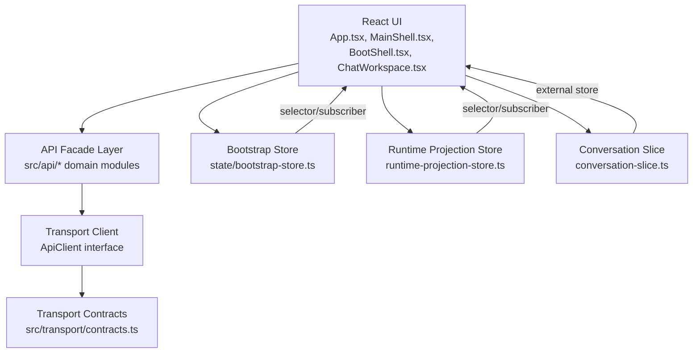

**Diagram sources**
- [App.tsx:102-154](file://src/App.tsx#L102-L154)
- [api/index.ts:14-22](file://src/api/index.ts#L14-L22)
- [api/client.ts:24-67](file://src/api/client.ts#L24-L67)
- [transport/contracts.ts:26-28](file://src/transport/contracts.ts#L26-L28)
- [state/bootstrap-store.ts:59-91](file://src/state/bootstrap-store.ts#L59-L91)
- [runtime-projection-store.ts:66-134](file://src/runtime-projection/runtime-projection-store.ts#L66-L134)
- [conversation-slice.ts:69-248](file://src/stores/conversation-slice.ts#L69-L248)

## Detailed Component Analysis

### App.tsx: Boot, Routing, and API Facade Integration
- Boot and onboarding gating:
  - Uses bootstrap store for boot phase management instead of inline orchestration
  - Calls API facade functions for onboarding state checking and project/session operations
  - Ensures default workdir and loads projects/sessions through API facades
- API facade orchestration:
  - Uses API facades (@/api) for all business operations instead of direct Tauri calls
  - Listens to chat prefill events to focus main window and prefill prompts
- Runtime projection:
  - Wires the canonical runtime projection listeners and reads permission prompts from the store
- State management:
  - React hooks for UI state (active section, projects, sessions, loading flags)
  - Bootstrap store selectors for project list and active project state
  - Memoization and refs to stabilize derived computations and avoid unnecessary re-renders

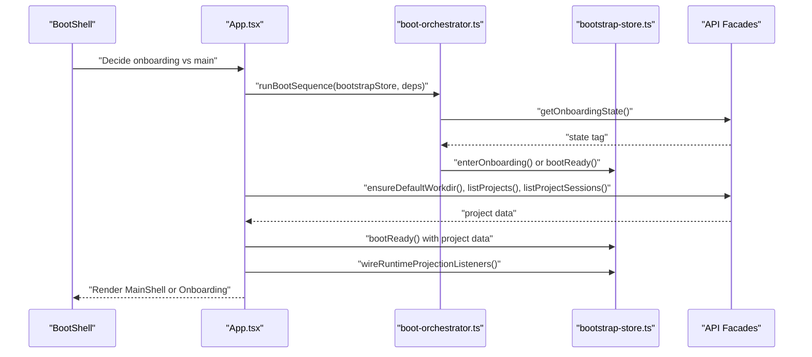

**Diagram sources**
- [App.tsx:123-154](file://src/App.tsx#L123-L154)
- [boot-orchestrator.ts:64-157](file://src/boot/boot-orchestrator.ts#L64-L157)
- [state/bootstrap-store.ts:119-153](file://src/state/bootstrap-store.ts#L119-L153)

**Section sources**
- [App.tsx:123-154](file://src/App.tsx#L123-L154)
- [boot-orchestrator.ts:64-157](file://src/boot/boot-orchestrator.ts#L64-L157)
- [state/bootstrap-store.ts:119-153](file://src/state/bootstrap-store.ts#L119-L153)

### BootShell.tsx: Minimal Boot Container
- Responsibilities:
  - Single mount point for splash, onboarding, and main surfaces
  - Always-mounted global overlays (toaster notifications, activation gate overlay)
  - Renders appropriate surface based on boot phase from bootstrap store
- Composition:
  - Accepts surface prop and children, enabling centralized boot surface management

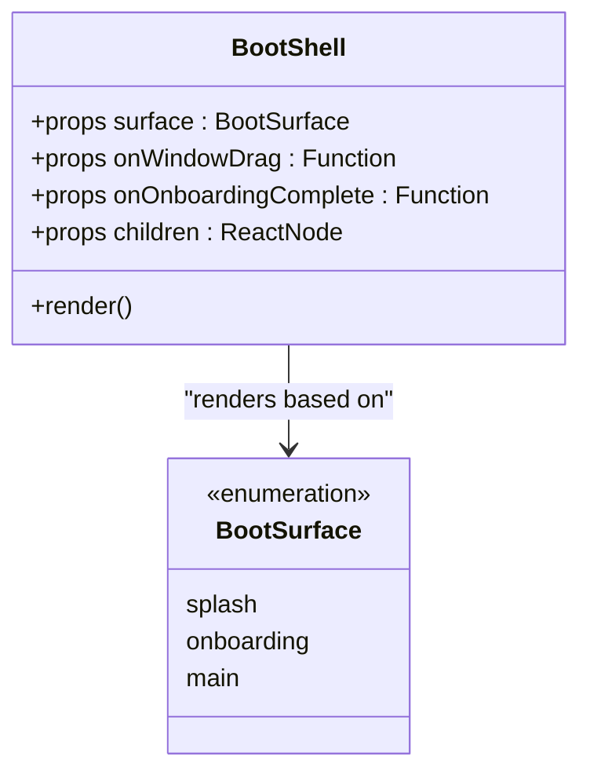

**Diagram sources**
- [BootShell.tsx:40-50](file://src/boot/BootShell.tsx#L40-L50)
- [BootShell.tsx:52-82](file://src/boot/BootShell.tsx#L52-L82)

**Section sources**
- [BootShell.tsx:40-50](file://src/boot/BootShell.tsx#L40-L50)
- [BootShell.tsx:52-82](file://src/boot/BootShell.tsx#L52-L82)

### MainShell.tsx: Global Chrome and Navigation
- Responsibilities:
  - Version watermark, execution mode pill, global navbar, and main content area
  - Forwards navigation and settings actions to App.tsx
- Composition:
  - Accepts navbar props and children, enabling App.tsx to control active section and pass module surfaces

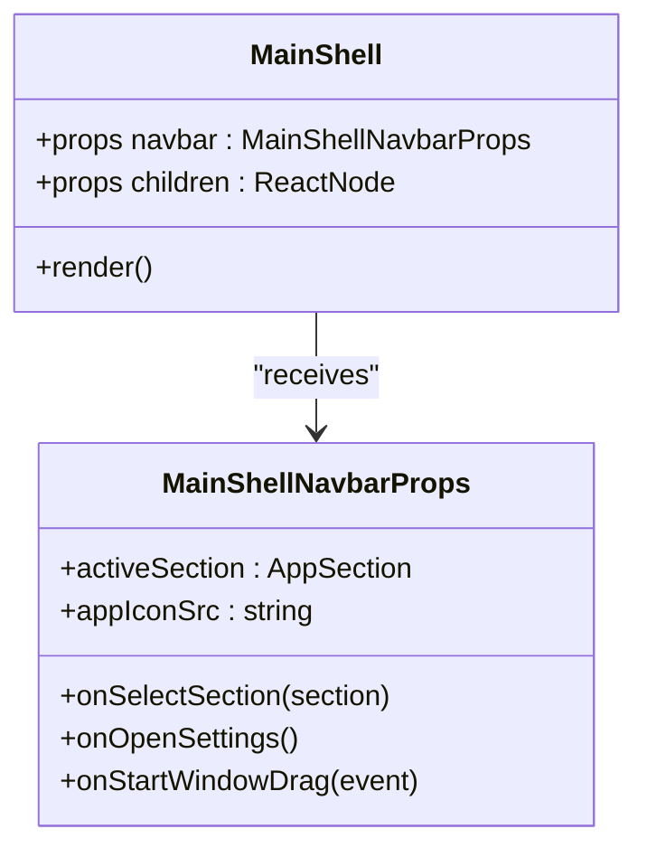

**Diagram sources**
- [MainShell.tsx:36-50](file://src/shell/MainShell.tsx#L36-L50)
- [MainShell.tsx:52-84](file://src/shell/MainShell.tsx#L52-L84)

**Section sources**
- [MainShell.tsx:52-84](file://src/shell/MainShell.tsx#L52-L84)

### ChatWorkspace.tsx: Chat Surface and Layout Controls
- Features:
  - Left sidebar (ProjectRail), main chat area, optional browser overlay, and header controls
  - Layout controls for density and font modes persisted to localStorage
  - Session-scoped UI: model selection, permission mode, todos, and right rail toggle
- Integration:
  - Uses API facades for project/session operations and listens to browser store for AI browser status

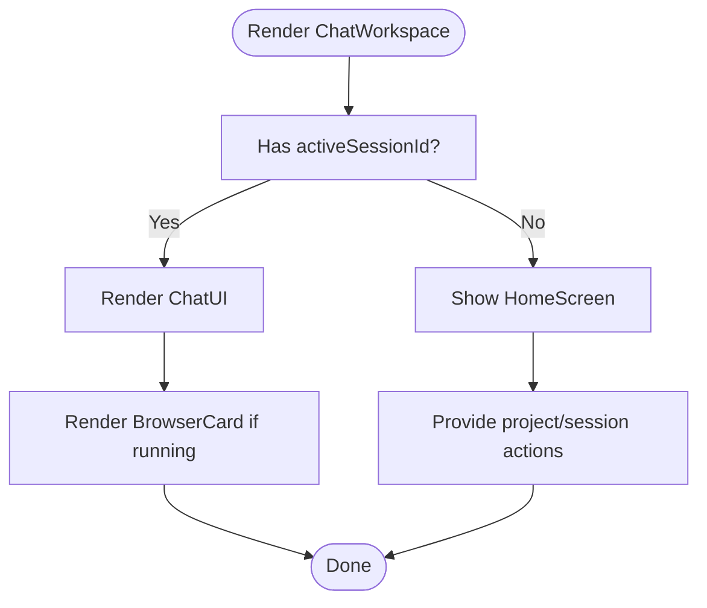

**Diagram sources**
- [ChatWorkspace.tsx:92-401](file://src/modules/chat/components/ChatWorkspace.tsx#L92-L401)

**Section sources**
- [ChatWorkspace.tsx:92-401](file://src/modules/chat/components/ChatWorkspace.tsx#L92-L401)

### SettingsApp.tsx: Settings Pages and Local State
- Responsibilities:
  - Manages UI state for theme, font mode, language, startup mode, density, auto-scroll, and notifications
  - Integrates with API facades for skills listing, toggling, reviewing, and approving proposals
  - Switches between settings pages based on active section
- Patterns:
  - Memoized actions object to avoid prop drilling
  - Local storage for font mode persistence

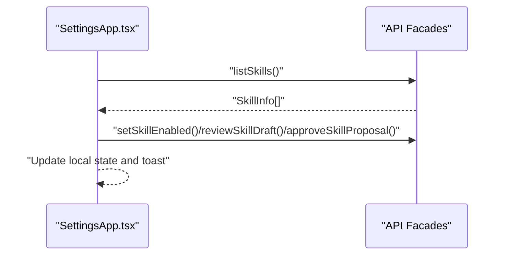

**Diagram sources**
- [SettingsApp.tsx:36-227](file://src/modules/settings/SettingsApp.tsx#L36-L227)

**Section sources**
- [SettingsApp.tsx:36-227](file://src/modules/settings/SettingsApp.tsx#L36-L227)

### OnboardingApp.tsx: Step-Based Flow
- Responsibilities:
  - Renders step-specific pages and coordinates with backend AppState via API facades
  - Completes when backend transitions to Ready, signaling App.tsx to swap surfaces
- Composition:
  - Uses internal hooks to manage state and transitions

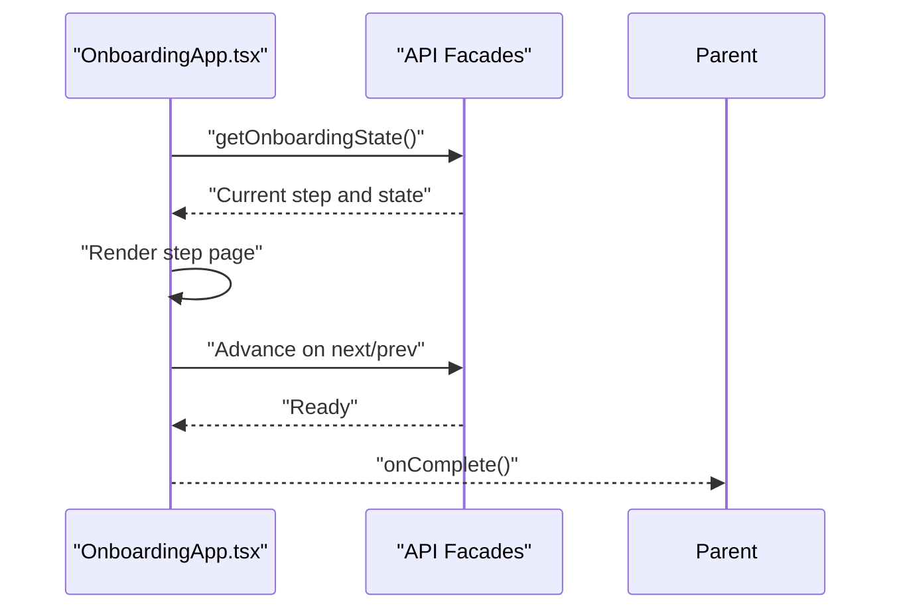

**Diagram sources**
- [OnboardingApp.tsx:156-211](file://src/modules/onboarding/OnboardingApp.tsx#L156-L211)

**Section sources**
- [OnboardingApp.tsx:156-211](file://src/modules/onboarding/OnboardingApp.tsx#L156-L211)

### Skills Module: UI and Types
- Exports:
  - SkillSecurityReport, SkillEditor, SkillsHubView, and related types
- Integration:
  - Uses API facades for skills operations (listing, enabling, reviewing, proposing)

**Section sources**
- [index.ts:1-9](file://src/modules/skills/index.ts#L1-L9)

### State Management: Hooks and Custom Stores
- React hooks in App.tsx:
  - Manage UI state (active section, projects, sessions, loading flags, input, models, permission mode)
  - Use memoization and refs to stabilize derived computations
- Bootstrap store:
  - Immutable snapshots, queue-based batching, and external store subscription via useSyncExternalStore
  - Manages boot phase, project lists, active project selection, and startup errors
  - Explicit action methods prevent global catch-all state evolution
- Runtime projection store:
  - Immutable snapshots, queue-based batching, and external store subscription via useSyncExternalStore
  - Used to read permission prompts and execution mode decisions
- Conversation slice:
  - Module-level singleton using useSyncExternalStore
  - Provides functions to upsert conversations, append/update messages, manage loading and todos, and track title states

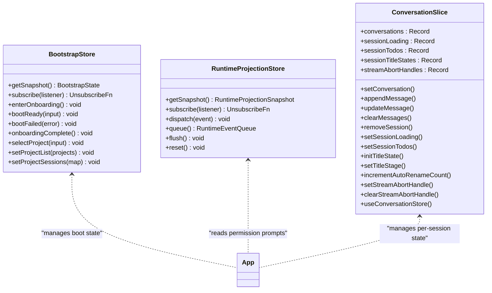

**Diagram sources**
- [state/bootstrap-store.ts:59-91](file://src/state/bootstrap-store.ts#L59-L91)
- [runtime-projection-store.ts:32-134](file://src/runtime-projection/runtime-projection-store.ts#L32-L134)
- [conversation-slice.ts:19-248](file://src/stores/conversation-slice.ts#L19-L248)

**Section sources**
- [state/bootstrap-store.ts:59-91](file://src/state/bootstrap-store.ts#L59-L91)
- [runtime-projection-store.ts:32-134](file://src/runtime-projection/runtime-projection-store.ts#L32-L134)
- [conversation-slice.ts:19-248](file://src/stores/conversation-slice.ts#L19-L248)

## API Facade System
The API facade system provides a transport-agnostic abstraction layer over Tauri IPC calls:

### ApiClient Interface
- Transport abstraction every src/api/* module depends on
- Provides call() for RPC-style request/response and subscribe() for event streams
- Default implementation uses Tauri invoke/listen primitives
- Supports test injection via setApiClient() for unit testing

### Domain Modules
- src/api/projects.ts: Project CRUD operations (create, list, rename, delete, worktree management)
- src/api/sessions.ts: Session management (create, get, rename, delete, pin/unpin)
- src/api/onboarding.ts: Onboarding state retrieval
- src/api/streaming.ts: Streaming operations
- src/api/window.ts: Window management
- src/api/slash.ts: Slash command processing

### Transport Abstraction Benefits
- Single extension point for future transport implementations (sidecar/HTTP)
- Unit testability without Tauri window dependencies
- Clean separation between business logic and transport details
- Consistent error handling and typing across all API calls

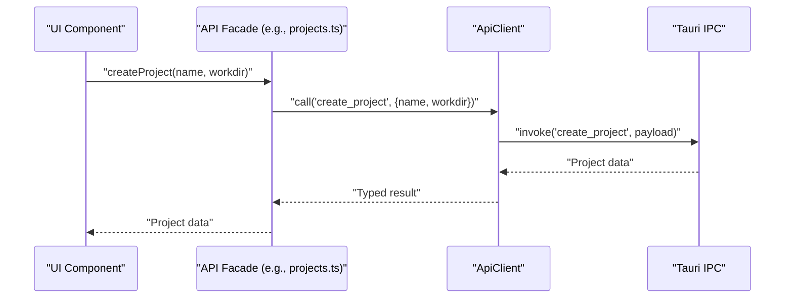

**Diagram sources**
- [api/projects.ts:13-15](file://src/api/projects.ts#L13-L15)
- [api/client.ts:35-44](file://src/api/client.ts#L35-L44)

**Section sources**
- [api/client.ts:24-67](file://src/api/client.ts#L24-L67)
- [api/projects.ts:13-60](file://src/api/projects.ts#L13-L60)
- [api/sessions.ts:19-47](file://src/api/sessions.ts#L19-L47)
- [api/onboarding.ts:7-9](file://src/api/onboarding.ts#L7-L9)

## Bootstrap Store System
The bootstrap store manages application boot sequence state independently from runtime projection:

### Bootstrap State Management
- BootPhase enumeration: 'splash' | 'onboarding' | 'main' | 'error'
- Immutable state snapshots with explicit action methods
- Separate from runtime-projection-store for independent evolution
- Minimal boot state to avoid global catch-all evolution

### Store Actions
- enterOnboarding(): Transition to onboarding phase
- bootReady(input): Complete boot with project data
- bootFailed(error): Handle fatal boot errors
- onboardingComplete(): Restart boot sequence after completion
- selectProject(input): Update active project selection
- setProjectList(projects): Refresh project listings
- setProjectSessions(map): Update per-project session data

### React Integration
- useBootstrapState(): Subscribe to full bootstrap state
- useBootstrapSelector(selector): Subscribe to state slices
- Mirrors runtime-projection-store patterns for consistency

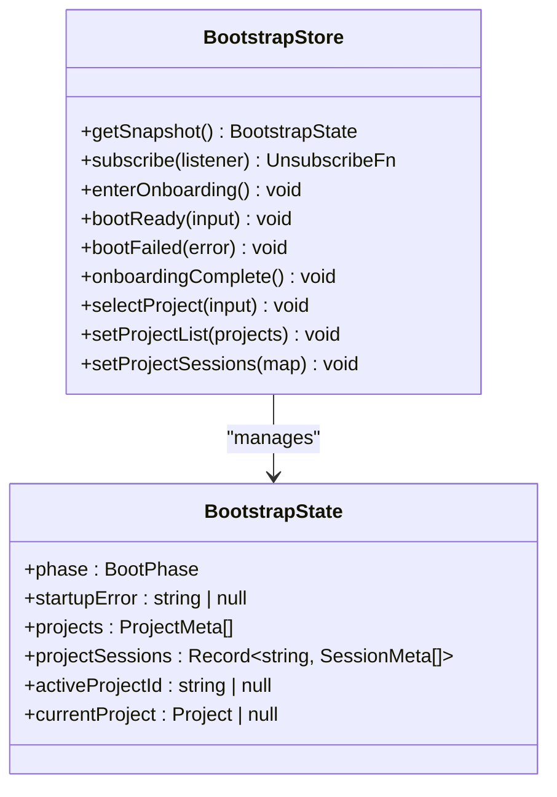

**Diagram sources**
- [state/bootstrap-store.ts:28-46](file://src/state/bootstrap-store.ts#L28-L46)
- [state/bootstrap-store.ts:59-91](file://src/state/bootstrap-store.ts#L59-L91)

**Section sources**
- [state/bootstrap-store.ts:28-91](file://src/state/bootstrap-store.ts#L28-L91)
- [state/use-bootstrap-store.ts:12-27](file://src/state/use-bootstrap-store.ts#L12-L27)

## Transport Layer
The transport layer provides canonical contracts and gateway discovery:

### Transport Contracts
- src/transport/contracts.ts: Canonical runtime contracts mirroring backend types
- Defines schema versions, event envelopes, activation status, execution modes, memory contracts
- Establishes wire protocols for all runtime events and state projections
- Maintains backward compatibility during migration

### Gateway System
- src/transport/gateway.ts: Local gateway bootstrap transport
- Provides getGatewayUrl() and getGatewayHealth() for backend discovery
- Implements awaitGatewayReady() with timeout and schema validation
- Supports both tauriIpc and localHttp transport tags
- Enforces schema version matching between frontend and backend

### Transport Boundary Benefits
- Clear separation between transport primitives and business logic
- Type-safe communication between frontend and backend
- Support for future transport implementations beyond Tauri IPC
- Canonical event schemas for runtime projection and UI consumption

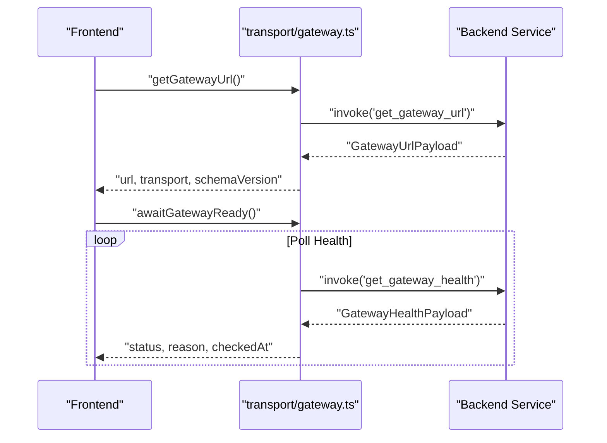

**Diagram sources**
- [transport/gateway.ts:57-113](file://src/transport/gateway.ts#L57-L113)

**Section sources**
- [transport/contracts.ts:26-28](file://src/transport/contracts.ts#L26-L28)
- [transport/gateway.ts:57-113](file://src/transport/gateway.ts#L57-L113)
- [transport/index.ts:9-11](file://src/transport/index.ts#L9-L11)

## Dependency Analysis
- Build and toolchain:
  - Vite with React plugin and TailwindCSS plugin
  - TypeScript with bundler module resolution and strict mode
- Dependencies:
  - React 19, Radix UI primitives, shadcn/ui, Tailwind 4, Sonner for notifications, @tauri-apps/api for IPC
- Aliasing:
  - Path alias @/ resolves to src for clean imports
- API Facade Dependencies:
  - All business logic imports from @/api instead of @/lib/tauri
  - Transport contracts imported from @/transport for type safety

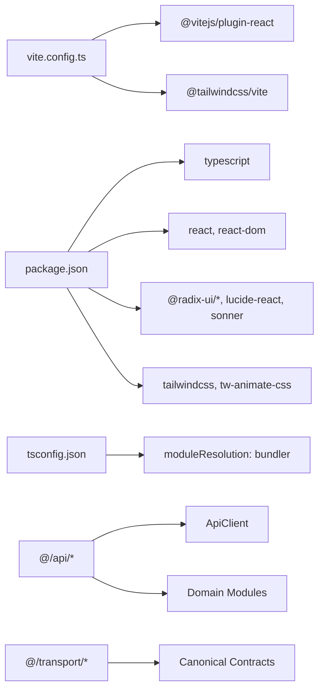

**Diagram sources**
- [vite.config.ts:12-34](file://vite.config.ts#L12-L34)
- [package.json:17-83](file://package.json#L17-L83)
- [tsconfig.json:13-28](file://tsconfig.json#L13-L28)
- [api/index.ts:14-22](file://src/api/index.ts#L14-L22)
- [transport/index.ts:9-11](file://src/transport/index.ts#L9-L11)

**Section sources**
- [vite.config.ts:12-34](file://vite.config.ts#L12-L34)
- [package.json:17-83](file://package.json#L17-L83)
- [tsconfig.json:13-28](file://tsconfig.json#L13-L28)
- [api/index.ts:14-22](file://src/api/index.ts#L14-L22)
- [transport/index.ts:9-11](file://src/transport/index.ts#L9-L11)

## Performance Considerations
- Event batching and immutable snapshots:
  - Runtime projection store batches events and replaces snapshots immutably to minimize re-renders
  - Bootstrap store maintains immutable state snapshots for predictable re-renders
- Stable identities:
  - useMemo and refs prevent unnecessary recalculations in App.tsx
  - Bootstrap store selectors provide stable identity for subscribed components
- Queue-driven updates:
  - Conversation slice and runtime projection store use queues to coalesce updates
  - Bootstrap store actions are explicit to prevent accidental global state evolution
- Transport abstraction benefits:
  - API client caching and connection pooling for repeated API calls
  - Test isolation through mock client injection reduces test overhead
- Tailwind and CSS variables:
  - Centralized design tokens reduce CSS bloat and enable efficient dark mode switching

## Troubleshooting Guide
- API facade failures:
  - Verify API client is properly initialized and not overridden by tests
  - Check that API facades import from @/api instead of @/lib/tauri
  - Ensure transport contracts match backend schema versions
- Bootstrap store issues:
  - Confirm bootstrap store actions are called in correct order during boot sequence
  - Verify useBootstrapSelector hooks subscribe to correct state slices
  - Check that bootstrap store state transitions are handled properly
- Transport layer problems:
  - Verify gateway health checks complete successfully before business calls
  - Ensure schema version compatibility between frontend and backend
  - Check that transport contracts are imported from @/transport for type safety
- Permission prompts not appearing:
  - Confirm runtime projection listeners are wired and approvals are being dispatched to the store
- Streaming issues:
  - Ensure listenToStream filters by streamId and that abort handles are cleared on completion
- Settings not persisting:
  - Confirm localStorage keys for UI preferences and that SettingsApp writes to them

**Section sources**
- [api/client.ts:51-67](file://src/api/client.ts#L51-L67)
- [state/bootstrap-store.ts:119-153](file://src/state/bootstrap-store.ts#L119-L153)
- [transport/gateway.ts:80-113](file://src/transport/gateway.ts#L80-L113)
- [runtime-projection-store.ts:88-95](file://src/runtime-projection/runtime-projection-store.ts#L88-L95)

## Conclusion
The frontend employs a clean separation of concerns with the new API facade system: React components handle presentation, API facades provide transport-agnostic business operations, the bootstrap store manages boot sequence state, and custom stores handle shared state. The modular architecture supports distinct surfaces for chat, settings, onboarding, and skills, while a unified design system and Tailwind-based styling ensure consistent visuals and responsive layouts. The new transport layer with canonical contracts enables future transport implementations while maintaining type safety. The build configuration with Vite and TypeScript provides a robust development experience with improved testability and maintainability.

## Appendices

### Component Composition Patterns
- Container components (App.tsx, MainShell.tsx, BootShell.tsx) manage state and pass props down
- Presentational components (ChatWorkspace.tsx, SettingsApp.tsx) focus on rendering and event callbacks
- API facade modules abstract cross-cutting concerns (business operations, transport abstraction)
- Custom hooks and stores (bootstrap store, runtime projection store) provide state management abstractions

**Section sources**
- [App.tsx:102-154](file://src/App.tsx#L102-L154)
- [MainShell.tsx:52-84](file://src/shell/MainShell.tsx#L52-L84)
- [BootShell.tsx:52-82](file://src/boot/BootShell.tsx#L52-L82)
- [ChatWorkspace.tsx:92-401](file://src/modules/chat/components/ChatWorkspace.tsx#L92-L401)
- [SettingsApp.tsx:36-227](file://src/modules/settings/SettingsApp.tsx#L36-L227)

### Prop Interfaces and Event Handling
- ChatWorkspace props:
  - Projects, sessions, active identifiers, callbacks for selection, creation, renaming, deletion, streaming, and layout controls
- MainShell props:
  - Navbar props and children for dynamic content
- SettingsApp props:
  - onClose callback for settings window
- BootShell props:
  - Surface management, window drag handlers, onboarding completion callbacks

**Section sources**
- [ChatWorkspace.tsx:92-138](file://src/modules/chat/components/ChatWorkspace.tsx#L92-L138)
- [MainShell.tsx:44-50](file://src/shell/MainShell.tsx#L44-L50)
- [SettingsApp.tsx:30-32](file://src/modules/settings/SettingsApp.tsx#L30-L32)
- [BootShell.tsx:40-50](file://src/boot/BootShell.tsx#L40-L50)

### Build Configuration and Development Workflow
- Scripts:
  - dev, build:web, build, tauri, tauri:dev, preview, test, test:ui
- Plugins:
  - React and TailwindCSS Vite plugins
- Aliasing:
  - @/ resolves to src
- TypeScript:
  - Strict mode, bundler module resolution, JSX transform
- API Facade Integration:
  - All business logic imports from @/api
  - Transport contracts from @/transport

**Section sources**
- [package.json:6-16](file://package.json#L6-L16)
- [vite.config.ts:12-34](file://vite.config.ts#L12-L34)
- [tsconfig.json:13-28](file://tsconfig.json#L13-L28)
- [api/index.ts:14-22](file://src/api/index.ts#L14-L22)
- [transport/index.ts:9-11](file://src/transport/index.ts#L9-L11)

### API Facade Usage Examples
- Project operations: import { createProject, listProjects, renameProject } from '@/api'
- Session operations: import { createSession, getSession, renameSession } from '@/api'
- Onboarding state: import { getOnboardingState } from '@/api'
- Transport contracts: import { ActivationSnapshot, ExecutionModeDecision } from '@/transport/contracts'

**Section sources**
- [api/projects.ts:13-60](file://src/api/projects.ts#L13-L60)
- [api/sessions.ts:19-47](file://src/api/sessions.ts#L19-L47)
- [api/onboarding.ts:7-9](file://src/api/onboarding.ts#L7-L9)
- [transport/contracts.ts:123-135](file://src/transport/contracts.ts#L123-L135)