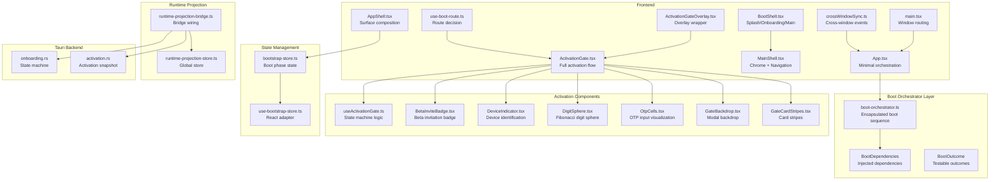
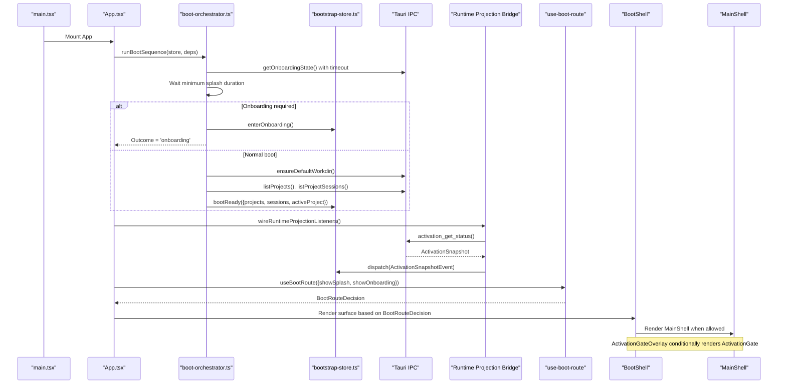
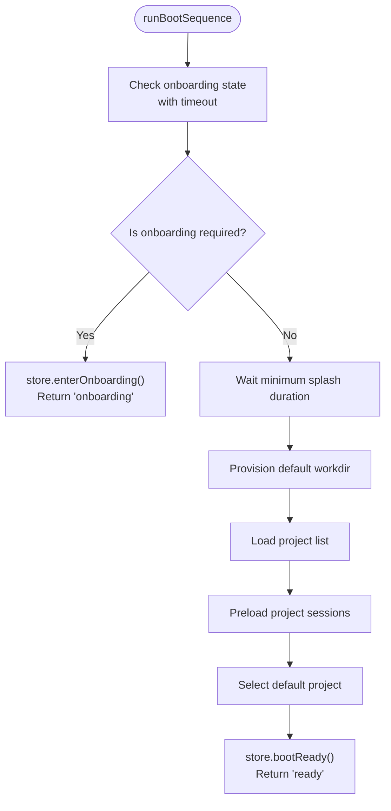
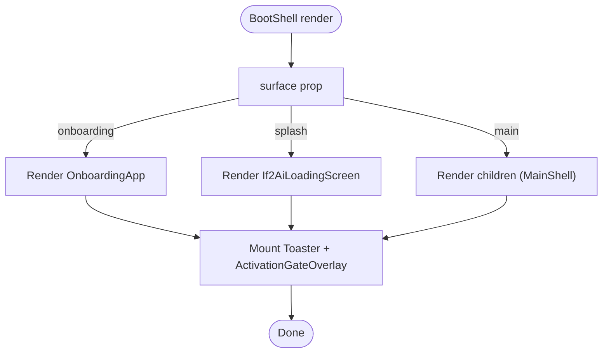
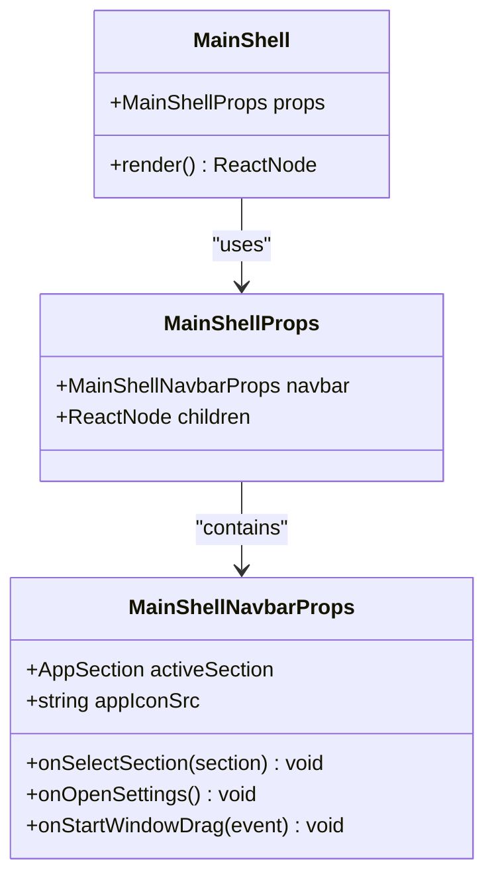
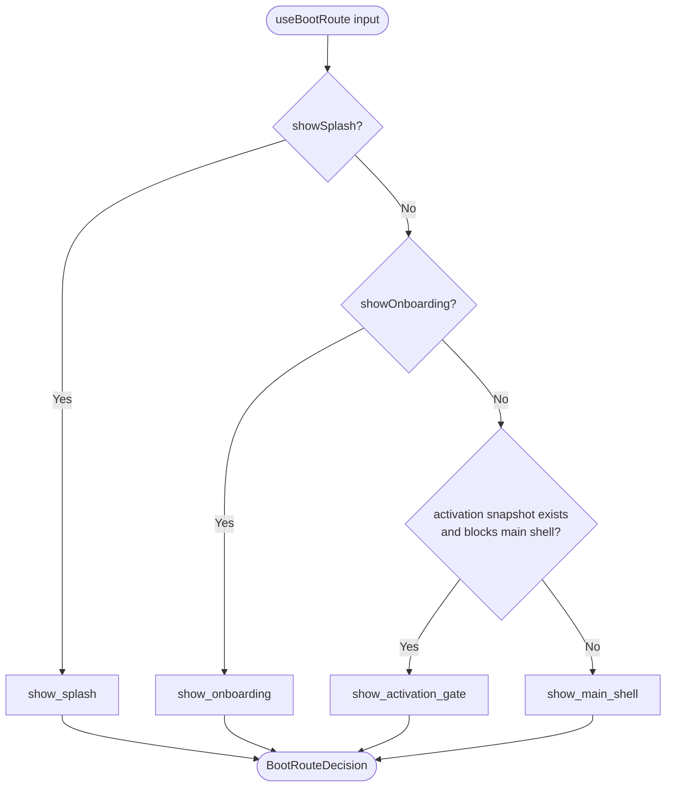
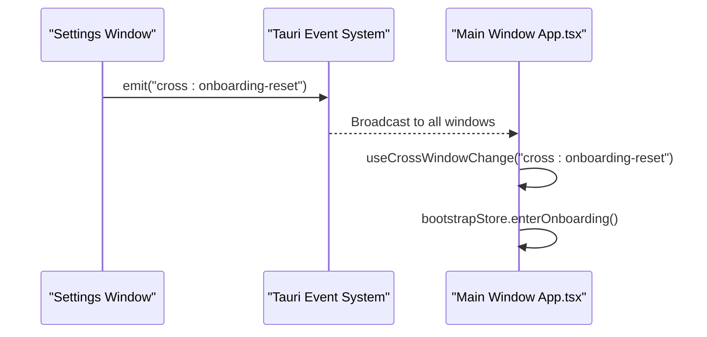
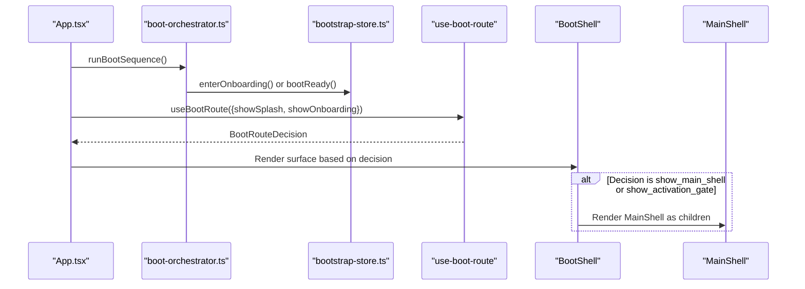
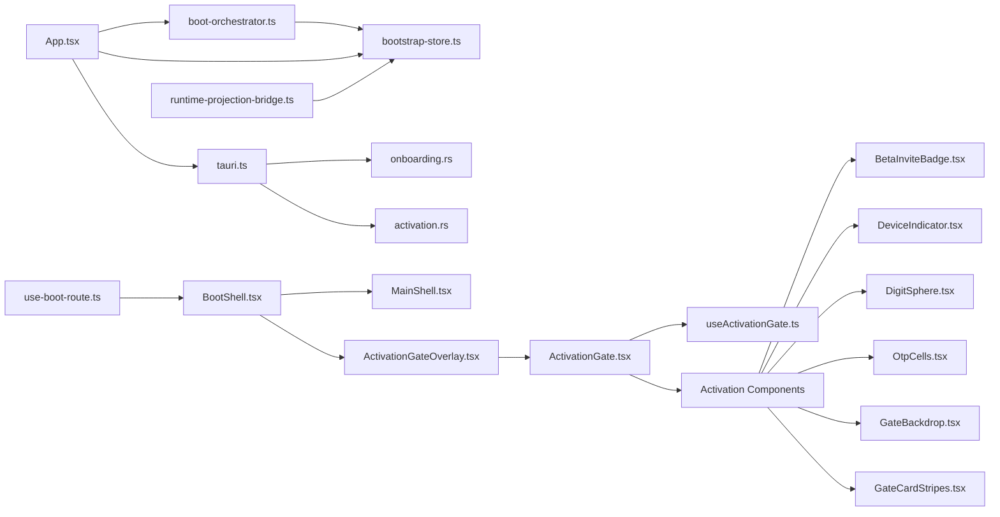

# Boot Process and Shell Management

<cite>
**Referenced Files in This Document**
- [boot-orchestrator.ts](file://src/boot/boot-orchestrator.ts)
- [BootShell.tsx](file://src/boot/BootShell.tsx)
- [MainShell.tsx](file://src/shell/MainShell.tsx)
- [use-boot-route.ts](file://src/boot/use-boot-route.ts)
- [ActivationGate.tsx](file://src/boot/activation/ActivationGate.tsx)
- [ActivationGateOverlay.tsx](file://src/boot/ActivationGateOverlay.tsx)
- [useActivationGate.ts](file://src/boot/activation/useActivationGate.ts)
- [App.tsx](file://src/App.tsx)
- [AppShell.tsx](file://src/modules/app-shell/AppShell.tsx)
- [main.tsx](file://src/main.tsx)
- [bootstrap-store.ts](file://src/state/bootstrap-store.ts)
- [use-bootstrap-store.ts](file://src/state/use-bootstrap-store.ts)
- [crossWindowSync.ts](file://src/lib/crossWindowSync.ts)
- [tauri.ts](file://src/lib/tauri.ts)
- [runtime-projection-bridge.ts](file://src/runtime-projection/runtime-projection-bridge.ts)
- [runtime-projection-store.ts](file://src/runtime-projection/runtime-projection-store.ts)
- [contracts.ts](file://src/transport/contracts.ts)
- [onboarding.rs](file://src-tauri/src/commands/onboarding.rs)
- [activation.rs](file://src-tauri/src/commands/activation.rs)
</cite>

## Update Summary
**Changes Made**
- Updated activation gate section to reflect new comprehensive ActivationGate component replacing ActivationGateOverlay
- Added documentation for OTP input flow, device indicators, and real-time license status updates
- Enhanced activation flow documentation with detailed state machine and user interaction patterns
- Updated architecture diagrams to show the new ActivationGate component structure
- Added information about the new activation components (BetaInviteBadge, DeviceIndicator, DigitSphere, OtpCells)
- Revised activation gate overlay documentation to reflect the new component-based approach

## Table of Contents
1. [Introduction](#introduction)
2. [Project Structure](#project-structure)
3. [Core Components](#core-components)
4. [Architecture Overview](#architecture-overview)
5. [Detailed Component Analysis](#detailed-component-analysis)
6. [Boot Orchestrator Pattern](#boot-orchestrator-pattern)
7. [Dependency Analysis](#dependency-analysis)
8. [Performance Considerations](#performance-considerations)
9. [Testing Strategy](#testing-strategy)
10. [Troubleshooting Guide](#troubleshooting-guide)
11. [Conclusion](#conclusion)

## Introduction
This document explains the boot process and shell management system that determines whether to show the onboarding flow or the main application interface during startup. The system has been refactored to use a dedicated boot orchestrator pattern that encapsulates the complex boot sequence, making it testable and maintainable. It covers the BootShell and MainShell components, their responsibilities, and how they handle different application states. It also documents the boot route determination logic, cross-window synchronization for onboarding resets, the transition process between boot and main shells, and how the system integrates with Tauri IPC for backend communication during boot.

**Updated** The activation system has been enhanced with a comprehensive ActivationGate component that replaces the previous ActivationGateOverlay, providing a full-featured activation flow with OTP input, device indicators, and real-time license status updates.

## Project Structure
The boot and shell management system spans several modules with a clear separation of concerns:
- Boot orchestrator that encapsulates the complete boot sequence
- Boot shell and route selection logic
- Main shell chrome and navigation
- Runtime projection pipeline for activation gating
- Tauri IPC integration for onboarding and activation
- Cross-window synchronization for settings-driven state changes
- Bootstrap store for managing boot phase state
- Comprehensive activation gate system with OTP flow and device indicators

**Diagram sources**
- [boot-orchestrator.ts:1-169](file://src/boot/boot-orchestrator.ts#L1-L169)
- [App.tsx:147-253](file://src/App.tsx#L147-L253)
- [AppShell.tsx:54-106](file://src/modules/app-shell/AppShell.tsx#L54-L106)
- [bootstrap-store.ts:1-159](file://src/state/bootstrap-store.ts#L1-L159)
- [use-bootstrap-store.ts:1-28](file://src/state/use-bootstrap-store.ts#L1-L28)
- [ActivationGate.tsx:1-256](file://src/boot/activation/ActivationGate.tsx#L1-L256)
- [useActivationGate.ts:1-401](file://src/boot/activation/useActivationGate.ts#L1-L401)
- [ActivationGateOverlay.tsx:1-41](file://src/boot/ActivationGateOverlay.tsx#L1-L41)

**Section sources**
- [boot-orchestrator.ts:1-169](file://src/boot/boot-orchestrator.ts#L1-L169)
- [App.tsx:147-253](file://src/App.tsx#L147-L253)
- [AppShell.tsx:54-106](file://src/modules/app-shell/AppShell.tsx#L54-L106)
- [bootstrap-store.ts:1-159](file://src/state/bootstrap-store.ts#L1-L159)

## Core Components
- **boot-orchestrator.ts**: Encapsulates the complete boot sequence with explicit dependencies, making it testable and maintainable. Handles onboarding state checking, splash duration enforcement, project/session provisioning, and state transitions.
- **BootShell**: Renders splash, onboarding, or main content based on the current boot route and always mounts global overlays (notifications and activation gate).
- **MainShell**: Provides the main application chrome (version watermark, execution mode pill, global navbar) and delegates content rendering to children.
- **useBootRoute**: Derives a canonical 4-state boot route from local flags and the activation projection snapshot.
- **ActivationGate**: **Updated** Comprehensive activation flow component with OTP input, device indicators, real-time status updates, and full visual fidelity to the SwiftUI counterpart.
- **ActivationGateOverlay**: **Updated** Overlay wrapper that conditionally renders the ActivationGate component based on activation snapshot state.
- **useActivationGate**: **Updated** State machine hook that drives the activation modal with comprehensive flow control, error handling, and real-time status updates.
- **Bootstrap Store**: Manages boot phase state (splash, onboarding, main, error) and provides explicit actions for state transitions.
- **Runtime projection bridge/store**: Bridges backend events and activation snapshots into a global store for reactive consumption.
- **Tauri IPC**: Provides onboarding state checks and activation snapshot retrieval during boot.

**Section sources**
- [boot-orchestrator.ts:1-169](file://src/boot/boot-orchestrator.ts#L1-L169)
- [BootShell.tsx:31-83](file://src/boot/BootShell.tsx#L31-L83)
- [MainShell.tsx:44-85](file://src/shell/MainShell.tsx#L44-L85)
- [use-boot-route.ts:44-92](file://src/boot/use-boot-route.ts#L44-L92)
- [ActivationGate.tsx:1-256](file://src/boot/activation/ActivationGate.tsx#L1-L256)
- [ActivationGateOverlay.tsx:29-40](file://src/boot/ActivationGateOverlay.tsx#L29-L40)
- [useActivationGate.ts:93-401](file://src/boot/activation/useActivationGate.ts#L93-L401)
- [bootstrap-store.ts:23-91](file://src/state/bootstrap-store.ts#L23-L91)
- [runtime-projection-bridge.ts:88-194](file://src/runtime-projection/runtime-projection-bridge.ts#L88-L194)
- [runtime-projection-store.ts:132-134](file://src/runtime-projection/runtime-projection-store.ts#L132-L134)

## Architecture Overview
The boot process coordinates asynchronous operations, ensures minimum splash duration, and decides between onboarding and main shell based on backend activation state. The new boot orchestrator pattern encapsulates the complex sequence while maintaining testability and configurability. The runtime projection pipeline continuously feeds activation snapshots, enabling dynamic gating even after boot.

**Updated** The activation system now features a comprehensive component hierarchy with real-time status updates, OTP input flow, and device identification capabilities.

**Diagram sources**
- [main.tsx:16-43](file://src/main.tsx#L16-L43)
- [App.tsx:147-253](file://src/App.tsx#L147-L253)
- [boot-orchestrator.ts:66-164](file://src/boot/boot-orchestrator.ts#L66-L164)
- [bootstrap-store.ts:119-140](file://src/state/bootstrap-store.ts#L119-L140)
- [runtime-projection-bridge.ts:172-178](file://src/runtime-projection/runtime-projection-bridge.ts#L172-L178)
- [use-boot-route.ts:61-72](file://src/boot/use-boot-route.ts#L61-L72)
- [BootShell.tsx:58-81](file://src/boot/BootShell.tsx#L58-L81)
- [MainShell.tsx:52-85](file://src/shell/MainShell.tsx#L52-L85)

## Detailed Component Analysis

### Boot Orchestrator Pattern
The new boot orchestrator encapsulates the complete boot sequence that was previously implemented as a 90-line useEffect in App.tsx. This pattern provides several key benefits:

**Responsibilities:**
- Handles onboarding state checking with configurable timeout (default 3 seconds)
- Enforces minimum splash duration (default 800ms) to prevent flickering
- Provisions default workdir and project structure
- Loads project lists and preloads project sessions
- Selects default project when available
- Manages state transitions through the bootstrap store
- Supports cancellation via an external signal
- Provides testable outcomes ('onboarding', 'ready', 'error')

**Configuration Parameters:**
- `splashHoldMs`: Configurable minimum splash duration (default 800ms)
- `onboardingTimeoutMs`: Configurable onboarding check timeout (default 3000ms)
- `signal`: Optional cancellation mechanism for aborting mid-run

**Dependency Injection:**
The orchestrator accepts a BootDependencies interface that allows for easy mocking and testing without touching Tauri IPC directly.

**Diagram sources**
- [boot-orchestrator.ts:66-164](file://src/boot/boot-orchestrator.ts#L66-L164)

**Section sources**
- [boot-orchestrator.ts:1-169](file://src/boot/boot-orchestrator.ts#L1-L169)

### App Shell Integration
The App component now serves as a minimal orchestrator that delegates the complex boot sequence to the boot orchestrator:

**Responsibilities:**
- Creates and manages a cancellation signal for the boot sequence
- Calls runBootSequence with injected dependencies
- Handles model selection after boot completion
- Manages cross-window synchronization for onboarding resets
- Subscribes to bootstrap store state for rendering decisions

**Key Changes:**
- The useEffect that previously contained 90 lines of boot logic has been replaced with a simple delegation to runBootSequence
- The bootstrap store now owns all boot phase state, making App.tsx a pure render component
- Model selection remains inline as it's orthogonal to project bootstrapping

**Section sources**
- [App.tsx:147-253](file://src/App.tsx#L147-L253)

### Bootstrap Store Management
The bootstrap store provides a clean separation of concerns for boot phase state:

**State Structure:**
- `phase`: Current boot phase ('splash', 'onboarding', 'main', 'error')
- `startupError`: Human-readable error message when phase is 'error'
- `projects`: Project list loaded during boot
- `projectSessions`: Sessions mapped by project ID
- `activeProjectId`: Currently selected project ID
- `currentProject`: Full project record for the active project

**Actions:**
- `enterOnboarding()`: Transition to onboarding phase
- `bootReady()`: Complete boot and transition to main phase
- `bootFailed()`: Handle fatal boot errors
- `onboardingComplete()`: Reset to splash phase after onboarding
- `selectProject()`: Change active project at runtime
- `setProjectList()` and `setProjectSessions()`: Update project data

**Section sources**
- [bootstrap-store.ts:23-91](file://src/state/bootstrap-store.ts#L23-L91)

### AppShell Composition
AppShell serves as the canonical surface composer that reads from the bootstrap store:

**Responsibilities:**
- Reads boot phase from bootstrap store
- Computes boot route using useBootRoute
- Renders appropriate surface (splash, onboarding, or main)
- Composes BootShell, MainShell, and ContentRouter
- Manages global overlays and chat section overlays

**Key Features:**
- Pure render function that doesn't manage boot state itself
- Delegates boot orchestration to the orchestrator pattern
- Maintains separation between boot phase and runtime projection state
- Supports overlay composition for permission prompts and telemetry

**Section sources**
- [AppShell.tsx:54-106](file://src/modules/app-shell/AppShell.tsx#L54-L106)

### BootShell Component
Responsibilities:
- Renders splash, onboarding, or main content based on the BootSurface prop.
- Always mounts global overlays: notifications toaster and activation gate overlay.
- Delegates window drag handling and onboarding completion callback to child components.

Rendering logic:
- Onboarding: renders the onboarding app with forwarded handlers.
- Splash: renders the loading screen with project name and stage label.
- Main: renders children (MainShell tree).

**Diagram sources**
- [BootShell.tsx:58-81](file://src/boot/BootShell.tsx#L58-L81)

**Section sources**
- [BootShell.tsx:31-83](file://src/boot/BootShell.tsx#L31-L83)

### MainShell Component
Responsibilities:
- Provides the main application chrome: version watermark, execution mode pill, global navbar.
- Delegates active section selection and settings opening to navbar props.
- Renders the main content area as children.

Key behaviors:
- ExecutionModePill is mounted directly as a self-gating projection consumer.
- GlobalNavbar receives active section and selection callbacks.
- Background gradients and scroll container are applied to the main content area.

**Diagram sources**
- [MainShell.tsx:44-85](file://src/shell/MainShell.tsx#L44-L85)

**Section sources**
- [MainShell.tsx:15-85](file://src/shell/MainShell.tsx#L15-L85)

### Boot Route Determination Logic
The useBootRoute hook computes a canonical 4-state route:
- show_splash: splash screen is active.
- show_onboarding: onboarding is active.
- show_activation_gate: onboarding complete but activation snapshot blocks main shell.
- show_main_shell: fully ready to render main shell.

Decision rules:
- If showSplash is true, route is show_splash.
- Else if showOnboarding is true, route is show_onboarding.
- Else if activation snapshot exists and does not allow main shell, route is show_activation_gate.
- Otherwise, route is show_main_shell.

Mapping to BootSurface:
- show_splash → splash
- show_onboarding → onboarding
- show_activation_gate → main (ActivationGateOverlay overlays the main surface)
- show_main_shell → main

**Diagram sources**
- [use-boot-route.ts:61-72](file://src/boot/use-boot-route.ts#L61-L72)
- [use-boot-route.ts:81-91](file://src/boot/use-boot-route.ts#L81-L91)

**Section sources**
- [use-boot-route.ts:44-92](file://src/boot/use-boot-route.ts#L44-L92)

### Activation Gate System
**Updated** The activation system has been completely redesigned with a comprehensive ActivationGate component that replaces the previous ActivationGateOverlay.

#### ActivationGate Component
The ActivationGate is a full-screen activation modal that provides a complete activation experience:

**Core Features:**
- **Visual Fidelity**: 1:1 visual port of UClaw's `ActivationGateView.swift`
- **Full Modal Structure**: Frosted backdrop, red/orange diagonal-stripe card, centered content
- **Fibonacci Digit Sphere**: Animated 3D sphere with multilingual character display
- **OTP Input Flow**: 8-cell OTP with five visual phases (idle, filling, verifying, success, error)
- **Real-time Status Updates**: Dynamic status messages with dots loading indicator
- **Dual Input Modes**: Automatic activation with OTP generation or manual code entry
- **Device Identification**: Click-to-copy device identifier with full installation ID support
- **Beta Invitation Badge**: Orange gradient badge with sparkle icon
- **Responsive Design**: Full-width layout with proper spacing and accessibility

**Component Structure:**
- GateBackdrop: Frosted glass effect background
- GateCardStripes: Diagonal red/orange striped card foundation
- DigitSphere: Animated 3D character sphere with Fibonacci distribution
- OtpCells: Interactive 8-digit OTP input with visual feedback
- BetaInviteBadge: Top-right invitation badge
- DeviceIndicator: Bottom-right device identification
- DotsLoading: Status indicator with animated dots

#### ActivationGateOverlay
The ActivationGateOverlay serves as a conditional renderer that wraps the ActivationGate component:

**Responsibilities:**
- Reads activation snapshot from runtime projection store
- Conditionally renders ActivationGate based on activation state
- Handles close requests and snapshot refresh
- Maintains overlay semantics for boot process

**Conditional Rendering Logic:**
- If activation is null → render nothing (boot still loading)
- If activation allowsMainShell → render nothing (main shell allowed)
- Otherwise → render ActivationGate modal

#### useActivationGate Hook
**Updated** The useActivationGate hook provides comprehensive state machine logic for the activation flow:

**State Machine Stages:**
- `idle`: Initial state, ready for user action
- `checkingLocalLicense`: Checking existing activation status
- `requesting`: Creating new activation request
- `waitingApproval`: Waiting for administrator approval
- `redeeming`: Processing OTP redemption
- `temporaryUnavailable`: Temporary service unavailability
- `activated`: Activation successful
- `offlineGrace`: Offline grace period

**OTP Phases:**
- `idle`: Empty cells with blinking caret
- `filling`: Left-to-right cell filling animation
- `verifying`: Merged verification box
- `success`: Green success state
- `error`: Red error state with shake animation

**Key Capabilities:**
- Real-time status updates via retry event listening
- Automatic OTP fill animation with configurable timing
- Manual code input with validation and submission
- Device identification and copy-to-clipboard functionality
- Graceful error handling with user-friendly messages
- Success ceremony with delayed modal closure
- Offline grace period support

**Section sources**
- [ActivationGate.tsx:1-256](file://src/boot/activation/ActivationGate.tsx#L1-L256)
- [ActivationGateOverlay.tsx:29-40](file://src/boot/ActivationGateOverlay.tsx#L29-L40)
- [useActivationGate.ts:93-401](file://src/boot/activation/useActivationGate.ts#L93-L401)

### Cross-Window Synchronization for Onboarding Resets
The system uses Tauri events to synchronize state across windows:
- Settings window triggers a cross-window event when onboarding is reset.
- Main window listens for the event and immediately switches to onboarding flow.
- The listener is registered during boot and cleaned up on unmount.

**Diagram sources**
- [crossWindowSync.ts:79-111](file://src/lib/crossWindowSync.ts#L79-L111)
- [App.tsx:167-173](file://src/App.tsx#L167-L173)

**Section sources**
- [crossWindowSync.ts:1-112](file://src/lib/crossWindowSync.ts#L1-L112)
- [App.tsx:167-173](file://src/App.tsx#L167-L173)

### Transition Between Boot and Main Shells
The transition occurs after the boot routine completes:
- Boot route is computed using useBootRoute.
- BootShell renders the appropriate surface based on the route.
- When activation allows main shell, BootShell renders MainShell as children.
- ActivationGateOverlay remains mounted but renders nothing when main shell is allowed.

**Diagram sources**
- [boot-orchestrator.ts:66-164](file://src/boot/boot-orchestrator.ts#L66-L164)
- [bootstrap-store.ts:119-140](file://src/state/bootstrap-store.ts#L119-L140)
- [use-boot-route.ts:61-72](file://src/boot/use-boot-route.ts#L61-L72)
- [BootShell.tsx:58-73](file://src/boot/BootShell.tsx#L58-L73)
- [MainShell.tsx:52-85](file://src/shell/MainShell.tsx#L52-L85)

**Section sources**
- [boot-orchestrator.ts:66-164](file://src/boot/boot-orchestrator.ts#L66-L164)
- [bootstrap-store.ts:119-140](file://src/state/bootstrap-store.ts#L119-L140)
- [use-boot-route.ts:81-91](file://src/boot/use-boot-route.ts#L81-L91)
- [BootShell.tsx:58-73](file://src/boot/BootShell.tsx#L58-L73)
- [MainShell.tsx:52-85](file://src/shell/MainShell.tsx#L52-L85)

### Tauri IPC Integration During Boot
The boot process relies on Tauri IPC commands:
- Onboarding state check: onboarding_get_state with a 3-second timeout to prevent indefinite blocking.
- Project/session data: listProjects and listProjectSessions for initializing the main shell.
- Default workdir: ensureDefaultWorkdir to guarantee a default project exists.
- Model selection: invoke model_get_active to set the active model.
- Activation snapshot: activation_get_status is fetched via the runtime projection bridge to determine gating.

**Updated** The activation system integrates with Tauri IPC through the useActivationGate hook, which handles:
- Installation ID retrieval for device identification
- Activation status checking for initial state
- License request creation and polling
- OTP redemption processing
- Retry status listening for error handling
- Real-time status updates via event listeners

```mermaid
graph TB
A["boot-orchestrator.ts"] --> B["onboarding_get_state()"]
A --> C["ensureDefaultWorkdir()"]
A --> D["listProjects()"]
A --> E["listProjectSessions()"]
F["App.tsx"] --> G["model_get_active (invoke)"]
H["Runtime Projection Bridge"] --> I["activation_get_status()"]
J["useActivationGate.ts"] --> K["activationGetInstallationId()"]
J --> L["activationGetStatus()"]
J --> M["activationRequestLicense()"]
J --> N["activationPollRequestStatus()"]
J --> O["activationRedeemWithRequestId()"]
J --> P["activationRedeemByInviteCode()"]
J --> Q["listenActivationRetryStatus()"]
H --> K
```

**Diagram sources**
- [boot-orchestrator.ts:80-157](file://src/boot/boot-orchestrator.ts#L80-L157)
- [App.tsx:215-227](file://src/App.tsx#L215-L227)
- [runtime-projection-bridge.ts:172-178](file://src/runtime-projection/runtime-projection-bridge.ts#L172-L178)
- [useActivationGate.ts:35-46](file://src/boot/activation/useActivationGate.ts#L35-L46)
- [onboarding.rs:15-24](file://src-tauri/src/commands/onboarding.rs#L15-L24)
- [activation.rs:123-126](file://src-tauri/src/commands/activation.rs#L123-L126)

**Section sources**
- [boot-orchestrator.ts:80-157](file://src/boot/boot-orchestrator.ts#L80-L157)
- [App.tsx:215-227](file://src/App.tsx#L215-L227)
- [runtime-projection-bridge.ts:172-178](file://src/runtime-projection/runtime-projection-bridge.ts#L172-L178)
- [useActivationGate.ts:35-46](file://src/boot/activation/useActivationGate.ts#L35-L46)
- [onboarding.rs:15-24](file://src-tauri/src/commands/onboarding.rs#L15-L24)
- [activation.rs:123-126](file://src-tauri/src/commands/activation.rs#L123-L126)

## Boot Orchestrator Pattern
The new boot orchestrator pattern represents a significant architectural improvement:

**Pattern Benefits:**
- **Testability**: Dependencies are explicitly injected, allowing for easy mocking and unit testing
- **Maintainability**: Complex boot logic is encapsulated in a single, focused module
- **Configurability**: Timing parameters and cancellation mechanisms are exposed as configuration
- **Separation of Concerns**: App.tsx becomes a pure orchestrator, not a boot manager
- **Reusability**: The orchestrator can be reused across different contexts

**Implementation Details:**
- BootDependencies interface defines all required dependencies
- Configurable timing parameters (splashHoldMs, onboardingTimeoutMs)
- Cancellation support via external signal object
- Testable outcomes (BootOutcome enum)
- Comprehensive error handling and fallbacks

**Testing Approach:**
The orchestrator is thoroughly tested with mock dependencies, covering happy paths, error conditions, and cancellation scenarios. Tests verify state transitions and ensure the orchestrator behaves correctly under various conditions.

**Section sources**
- [boot-orchestrator.ts:40-58](file://src/boot/boot-orchestrator.ts#L40-L58)
- [boot-orchestrator.ts:66-164](file://src/boot/boot-orchestrator.ts#L66-L164)
- [bootstrap-store.test.ts:97-175](file://src/state/bootstrap-store.test.ts#L97-L175)

## Dependency Analysis
The boot and shell management system exhibits clear separation of concerns with the new orchestrator pattern:
- **boot-orchestrator.ts** orchestrates boot and state management through dependency injection.
- **useBootRoute** encapsulates route logic and is decoupled from IPC details.
- **BootShell and MainShell** are presentation containers with minimal logic.
- **bootstrap-store** provides canonical boot phase state management.
- **Runtime projection bridge/store** provides a canonical source of truth for activation gating.
- **Tauri IPC commands** are accessed through a thin wrapper in tauri.ts.
- **ActivationGate system** provides comprehensive activation flow with component-based architecture.

**Updated** The activation system introduces a new layer of component dependencies with the useActivationGate hook managing complex state transitions and user interactions.

**Diagram sources**
- [App.tsx:147-253](file://src/App.tsx#L147-L253)
- [boot-orchestrator.ts:66-164](file://src/boot/boot-orchestrator.ts#L66-L164)
- [bootstrap-store.ts:119-140](file://src/state/bootstrap-store.ts#L119-L140)
- [use-boot-route.ts:61-72](file://src/boot/use-boot-route.ts#L61-L72)
- [BootShell.tsx:58-81](file://src/boot/BootShell.tsx#L58-L81)
- [MainShell.tsx:52-85](file://src/shell/MainShell.tsx#L52-L85)
- [ActivationGateOverlay.tsx:29-40](file://src/boot/ActivationGateOverlay.tsx#L29-L40)
- [ActivationGate.tsx:45-36](file://src/boot/activation/ActivationGate.tsx#L45-L36)
- [useActivationGate.ts:93-399](file://src/boot/activation/useActivationGate.ts#L93-L399)
- [runtime-projection-bridge.ts:88-194](file://src/runtime-projection/runtime-projection-bridge.ts#L88-L194)
- [runtime-projection-store.ts:132-134](file://src/runtime-projection/runtime-projection-store.ts#L132-L134)
- [tauri.ts:427-429](file://src/lib/tauri.ts#L427-L429)
- [onboarding.rs:15-24](file://src-tauri/src/commands/onboarding.rs#L15-L24)
- [activation.rs:123-126](file://src-tauri/src/commands/activation.rs#L123-L126)

**Section sources**
- [App.tsx:147-253](file://src/App.tsx#L147-L253)
- [boot-orchestrator.ts:66-164](file://src/boot/boot-orchestrator.ts#L66-L164)
- [bootstrap-store.ts:119-140](file://src/state/bootstrap-store.ts#L119-L140)
- [use-boot-route.ts:61-72](file://src/boot/use-boot-route.ts#L61-L72)
- [BootShell.tsx:58-81](file://src/boot/BootShell.tsx#L58-L81)
- [MainShell.tsx:52-85](file://src/shell/MainShell.tsx#L52-L85)
- [ActivationGateOverlay.tsx:29-40](file://src/boot/ActivationGateOverlay.tsx#L29-L40)
- [ActivationGate.tsx:45-36](file://src/boot/activation/ActivationGate.tsx#L45-L36)
- [useActivationGate.ts:93-399](file://src/boot/activation/useActivationGate.ts#L93-L399)
- [runtime-projection-bridge.ts:88-194](file://src/runtime-projection/runtime-projection-bridge.ts#L88-L194)
- [runtime-projection-store.ts:132-134](file://src/runtime-projection/runtime-projection-store.ts#L132-L134)
- [tauri.ts:427-429](file://src/lib/tauri.ts#L427-L429)
- [onboarding.rs:15-24](file://src-tauri/src/commands/onboarding.rs#L15-L24)
- [activation.rs:123-126](file://src-tauri/src/commands/activation.rs#L123-L126)

## Performance Considerations
- **Minimum splash duration**: Prevents flickering and ensures perceived responsiveness with configurable timing (default 800ms).
- **Boot routines**: Use Promise.race to avoid indefinite blocking on onboarding checks with configurable timeout (default 3 seconds).
- **Runtime projection batching**: Reduces reducer thrashing during high-frequency events.
- **Activation snapshot refresh**: Performed on-demand to minimize unnecessary network calls.
- **Cancellation support**: Allows aborting long-running boot sequences when needed.
- **Parallel operations**: Onboarding check and splash timer run concurrently to reduce boot time.
- **Activation flow optimization**: OTP animations and state transitions are optimized for smooth user experience.
- **Component lazy loading**: Activation components are only rendered when needed, reducing initial bundle size.

**Updated** The activation system includes performance optimizations such as:
- Animation frame management for DigitSphere component
- Debounced status updates to prevent excessive re-renders
- Efficient OTP input handling with immediate visual feedback
- Graceful degradation when network requests fail

## Testing Strategy
The boot orchestrator is designed with comprehensive test coverage:

**Test Categories:**
- **Happy path testing**: Verifies normal boot sequence completion
- **Error condition testing**: Validates error handling and state transitions
- **Cancellation testing**: Ensures proper cleanup when boot is aborted
- **Timeout testing**: Confirms graceful fallback when onboarding checks timeout
- **State transition testing**: Validates all possible state changes

**Test Implementation:**
- Mock dependencies using the BootDependencies interface
- Configure timing parameters for fast test execution
- Verify bootstrap store state after each operation
- Test both synchronous and asynchronous scenarios

**Updated** The activation system includes comprehensive testing for:
- State machine transitions across all stages
- OTP input validation and redemption flow
- Error handling for network failures and invalid codes
- Device identification and clipboard functionality
- Real-time status updates and retry mechanisms

**Section sources**
- [bootstrap-store.test.ts:97-175](file://src/state/bootstrap-store.test.ts#L97-L175)

## Troubleshooting Guide
Common issues and recovery strategies:
- **Onboarding state check timeout**: The boot routine logs a warning and proceeds without onboarding. Verify backend availability and retry. The timeout is configurable (default 3 seconds).
- **Activation snapshot unknown**: When activation is null, the system treats it as unknown and does not block main shell. Trigger a refresh via the overlay's reload action.
- **Cross-window reset not taking effect**: Ensure the cross-window event is emitted and the main window listener is registered during boot.
- **Project/session initialization failures**: The boot routine catches errors and continues with reduced functionality; check backend connectivity and permissions.
- **Boot sequence cancellation**: If a boot is cancelled mid-execution, the store remains in its previous state without partial mutations.
- **Model selection failures**: The model selection step is separate from boot and uses invoke with fallback behavior.
- **Activation flow failures**: Check network connectivity, validate OTP input format, and ensure device identification is available.
- **Real-time status updates not working**: Verify activation status event listeners are properly registered and functioning.

**Updated** Additional troubleshooting for activation system:
- **OTP input not working**: Ensure manual input mode is properly toggled and input is exactly 8 characters
- **Device indicator missing**: Check installation ID retrieval and clipboard permissions
- **Activation status stuck**: Manually trigger refresh via activation overlay or check backend service status
- **Animation performance issues**: Verify requestAnimationFrame usage and component cleanup on unmount

**Section sources**
- [boot-orchestrator.ts:94-98](file://src/boot/boot-orchestrator.ts#L94-L98)
- [ActivationGateOverlay.tsx:32-34](file://src/boot/ActivationGateOverlay.tsx#L32-L34)
- [crossWindowSync.ts:79-111](file://src/lib/crossWindowSync.ts#L79-L111)
- [App.tsx:215-227](file://src/App.tsx#L215-L227)
- [useActivationGate.ts:111-128](file://src/boot/activation/useActivationGate.ts#L111-L128)

## Conclusion
The boot process and shell management system has been significantly improved through the introduction of the boot orchestrator pattern. The new architecture cleanly separates orchestration, presentation, and state management while providing testability and configurability. The boot orchestrator encapsulates the complex boot sequence with explicit dependencies, making it maintainable and testable. App.tsx now serves as a minimal orchestrator that delegates boot management to the dedicated orchestrator, while the bootstrap store provides canonical state management. The runtime projection pipeline supplies activation gating, and Tauri IPC integration remains centralized through a thin wrapper. Cross-window synchronization enables responsive settings-driven state changes, while timeout and error handling improve resilience.

**Updated** The activation system has been completely redesigned with a comprehensive ActivationGate component that provides a full-featured activation experience. The new system includes OTP input flow, device identification, real-time status updates, and a complete visual fidelity to the original SwiftUI implementation. The activation components are modular and testable, with the useActivationGate hook providing robust state machine logic for handling complex activation scenarios. The overlay system maintains backward compatibility while enabling the new comprehensive activation flow.

The new pattern establishes a foundation for future enhancements while maintaining backward compatibility and improving code quality. The activation system now provides enterprise-grade activation capabilities with proper error handling, user feedback, and real-time status updates. The component-based architecture ensures maintainability and extensibility for future activation features.